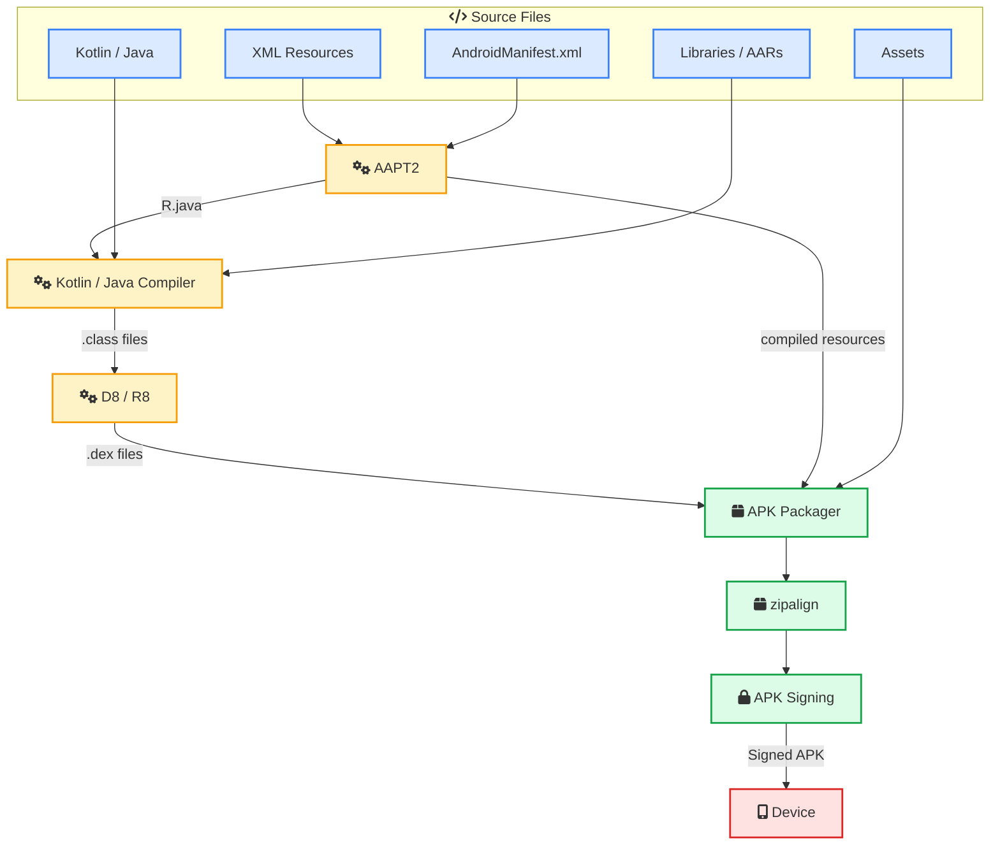
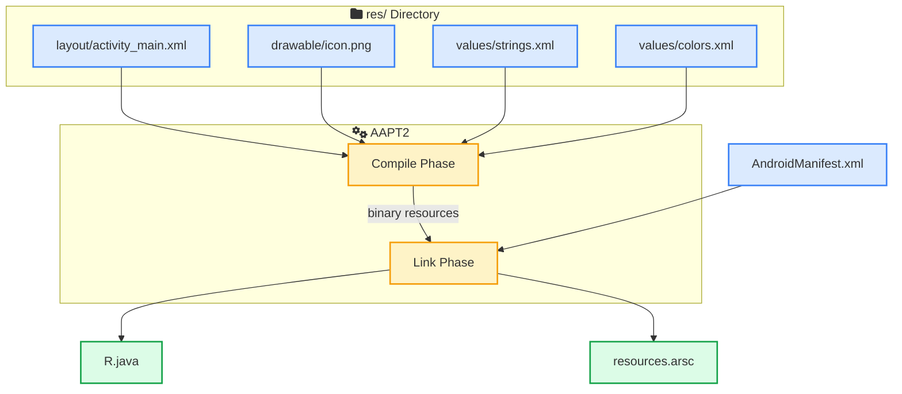
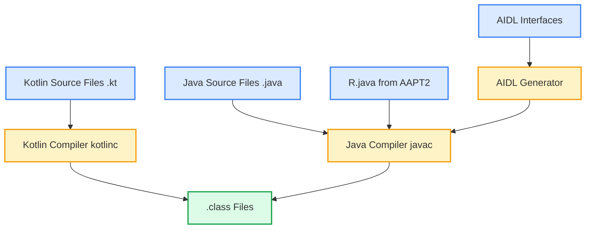
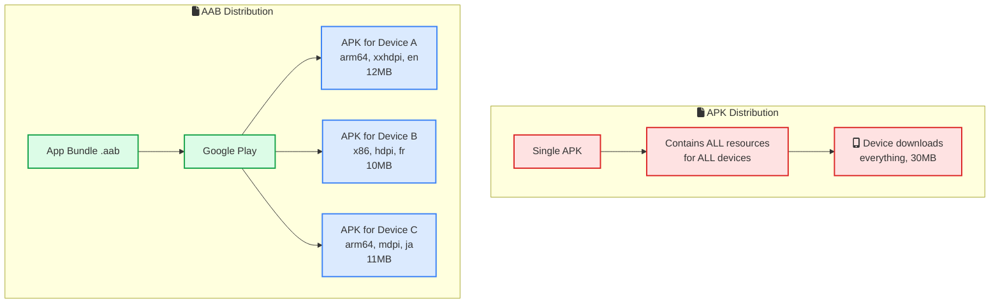
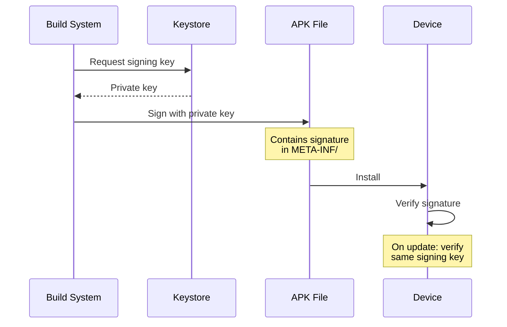
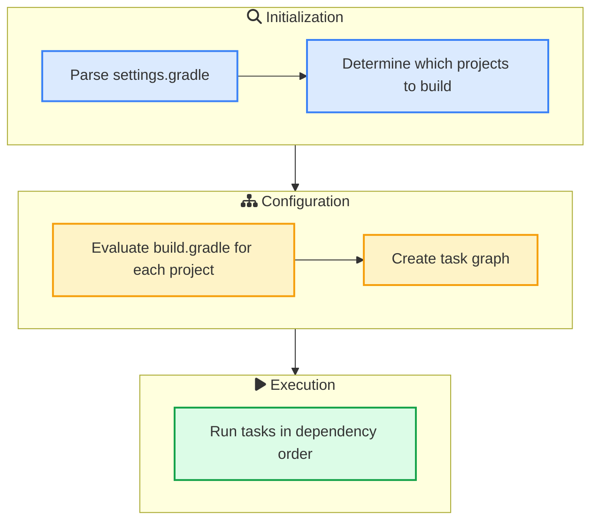
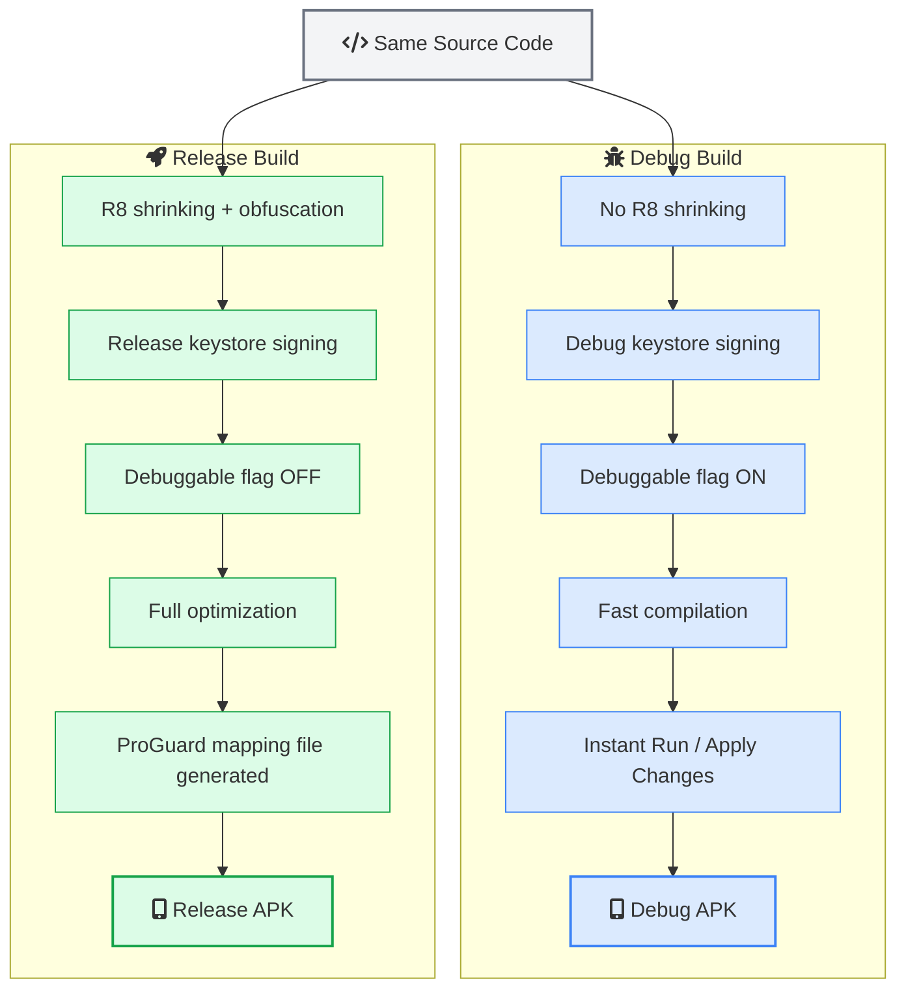

You write your Kotlin code, hit the Run button in Android Studio, and a few seconds later your app is running on your phone. But what actually happens in between? There is a whole pipeline of tools that compile, transform, package, and sign your code before it becomes an installable app.

Understanding this pipeline makes you a better Android developer. You will know why builds are slow, how to fix them, why ProGuard breaks things, what actually goes inside an APK, and how to configure your build for different environments.

This guide walks through every step of the Android build process, from source code to a running app.

## The Big Picture

Before we get into the details, here is the full build pipeline at a glance:



**Source files go in. A signed APK comes out.** Everything in the middle is handled by Gradle and the Android SDK tools.

Let's walk through each step.

## Step 1: Resource Compilation (AAPT2)

The first thing that happens during a build is resource compilation. AAPT2 (Android Asset Packaging Tool 2) takes all the resources from your `res/` directory and the `AndroidManifest.xml` and processes them.

### What AAPT2 Does

AAPT2 works in two phases:

**Compile phase**: Each resource file (layouts, drawables, strings, etc.) is individually compiled into a binary format. This is where AAPT2 validates your XML and catches errors like referencing a color that doesn't exist.

**Link phase**: All the compiled resources are merged together. AAPT2 generates two things:
- The **resource table** (`resources.arsc`) containing all resource values
- The **R.java** file with integer IDs for every resource



### Understanding R.java

When you write `R.layout.activity_main` or `R.drawable.icon` in your code, you are referencing an integer ID from the R.java file. Here is what a simplified R.java looks like:

```java
public final class R {
    public static final class layout {
        public static final int activity_main = 0x7f030001;
        public static final int fragment_home = 0x7f030002;
    }
    public static final class drawable {
        public static final int icon = 0x7f020001;
        public static final int background = 0x7f020002;
    }
    public static final class string {
        public static final int app_name = 0x7f040001;
        public static final int welcome_message = 0x7f040002;
    }
}
```

The Android runtime uses these IDs to look up the actual resources from the compiled resource table at runtime. This is why you never edit R.java manually. It gets regenerated every time you build.

### AAPT2 vs the Original AAPT

The original AAPT (which came with older Android SDK versions and was located at `$ANDROID_HOME/platform-tools/`) compiled all resources in a single step. AAPT2 split this into compile and link phases, which means:

- <i class="fas fa-check-circle text-success"></i> Incremental resource compilation. If you change one layout file, only that file gets recompiled.
- <i class="fas fa-check-circle text-success"></i> Better error messages. AAPT2 catches more issues at compile time.
- <i class="fas fa-check-circle text-success"></i> Faster builds. The two-phase approach plays well with Gradle's caching.

AAPT2 became the default in Android Gradle Plugin 3.0 and the original AAPT was removed entirely in later versions.

## Step 2: Source Code Compilation

Once AAPT2 generates R.java, the build moves to source code compilation. This is where your Kotlin and Java files get turned into bytecode.

### The Compilation Flow



If your project has both Kotlin and Java files, the Kotlin compiler runs first. It understands Java, so it can reference Java classes. Then the Java compiler runs and can reference the Kotlin classes that were already compiled. The output is standard Java bytecode in `.class` files.

If you use AIDL (Android Interface Definition Language) for inter-process communication, those `.aidl` files get converted to Java interfaces before the Java compiler step.

### What About Annotation Processors?

If you use libraries like Dagger, Room, or Glide, annotation processors run during compilation. They read your annotations and generate additional Java or Kotlin source files, which then get compiled along with the rest of your code.

For Kotlin projects, **kapt** (Kotlin Annotation Processing Tool) bridges the gap between Kotlin and Java annotation processors. The newer **KSP** (Kotlin Symbol Processing) is faster because it works directly with Kotlin code instead of going through Java stubs.

## Step 3: DEX Compilation (D8)

Android does not run standard Java bytecode. It runs Dalvik bytecode, which is optimized for mobile devices with limited memory and battery. The D8 compiler handles this conversion.

### Why Not Just Use Java Bytecode?

The JVM was designed for desktop and server environments where memory and power are not a concern. Android devices, especially older ones, have much tighter constraints. Dalvik bytecode is:

- **More compact** than Java bytecode, so APKs are smaller
- **Optimized for register-based execution**, which is faster on ARM processors
- **Designed for low-memory environments**, using less RAM at runtime

### What D8 Does

D8 takes all the `.class` files (your code, library code, everything) and converts them into `.dex` files containing Dalvik bytecode:

```
.class files (Java bytecode)
       |
       v
    D8 Compiler
       |
       v
classes.dex (Dalvik bytecode)
```

D8 replaced the older `dx` tool starting with Android Gradle Plugin 3.1. It produces better bytecode and compiles faster.

### The 65K Method Limit and Multidex

A single `.dex` file can reference at most 65,536 methods. That sounds like a lot, but once you add popular libraries like Google Play Services, Firebase, and AndroidX, you can easily hit that limit.

When your app exceeds 65K methods, the build produces multiple dex files: `classes.dex`, `classes2.dex`, `classes3.dex`, and so on. This is called **multidex**.

For apps with `minSdk 21` or higher (Android 5.0+), multidex works out of the box because ART natively supports loading multiple dex files. For older versions, you need the multidex support library.

You can check your method count by running:

```bash
./gradlew app:dependencies
```

Or use tools like [APK Analyzer](https://developer.android.com/studio/debug/apk-analyzer){:target="_blank"} in Android Studio to see the exact method count per dex file.

## Step 4: Code Shrinking and Obfuscation (R8)

For release builds, R8 steps in after (or instead of) D8. R8 does three things:

### 1. Code Shrinking (Tree Shaking)

R8 analyzes your code starting from the entry points (activities, services, etc.) and removes everything that is not reachable. If you include a library with 10,000 methods but only use 50, R8 strips out the other 9,950.

### 2. Obfuscation

R8 renames classes, methods, and fields to short, meaningless names:

```
com.myapp.data.UserRepository  -->  a.b.c
getUserById()                   -->  a()
```

This makes reverse engineering harder and reduces the size of the dex files (shorter names = smaller bytecode).

### 3. Optimization

R8 applies bytecode optimizations like inlining short methods, removing dead branches, and merging classes that are always used together.

### R8 vs ProGuard

R8 replaced ProGuard as the default code shrinker starting with Android Gradle Plugin 3.4. R8 uses the same `proguard-rules.pro` configuration file, so the migration was seamless for most projects. The key differences:

| Feature | ProGuard | R8 |
|---------|----------|-----|
| Shrinking | Yes | Yes |
| Obfuscation | Yes | Yes |
| Optimization | Yes | Yes, and better |
| DEX compilation | No (separate step) | Built in |
| Build speed | Slower (two steps) | Faster (single step) |
| Output quality | Good | Better (smaller APKs) |

Enable R8 in your `build.gradle`:

```groovy
android {
    buildTypes {
        release {
            minifyEnabled true
            shrinkResources true
            proguardFiles getDefaultProguardFile('proguard-android-optimize.txt'),
                         'proguard-rules.pro'
        }
    }
}
```

Setting `minifyEnabled true` turns on R8. Setting `shrinkResources true` also removes unused resources (layouts, drawables, etc. that no code references).

### The Keep Rules Headache

R8 is aggressive about removing code. Sometimes it removes things it should not, like classes referenced via reflection, or classes used by JSON serialization. This is where keep rules come in:

```
# Keep model classes for Gson serialization
-keep class com.myapp.data.model.** { *; }

# Keep classes with @Keep annotation
-keep @androidx.annotation.Keep class * { *; }
```

Getting keep rules right is one of the trickiest parts of Android development. If your release build crashes but debug works fine, chances are R8 removed or renamed something it should not have. The `mapping.txt` file generated during the build maps obfuscated names back to the originals, which is how you decode crash reports from production.

## Step 5: Packaging

After compilation and optimization, everything needs to be packed into a single file.

### What Goes Inside an APK

An APK is just a ZIP file with a specific structure:

```
my-app.apk
  |-- AndroidManifest.xml     (binary XML, app metadata)
  |-- classes.dex              (compiled Dalvik bytecode)
  |-- classes2.dex             (multidex, if needed)
  |-- resources.arsc           (compiled resource table)
  |-- res/                     (non-compiled resources like images)
  |-- assets/                  (raw files, accessed via AssetManager)
  |-- lib/                     (native .so libraries per CPU architecture)
  |     |-- armeabi-v7a/
  |     |-- arm64-v8a/
  |     |-- x86/
  |     |-- x86_64/
  |-- META-INF/                (signing information)
        |-- MANIFEST.MF
        |-- CERT.SF
        |-- CERT.RSA
```

You can inspect any APK using the [APK Analyzer](https://developer.android.com/studio/debug/apk-analyzer){:target="_blank"} in Android Studio or by renaming the `.apk` file to `.zip` and extracting it. If you want to go further and [convert an APK back to Java code](/convert-apk-file-to-java-code/), there are tools for that too.

### APK vs Android App Bundle (AAB)

Google introduced the Android App Bundle format as a replacement for APKs when publishing to the Play Store. Here is the difference:



With an APK, every device downloads the same file, including resources it will never use (like xxxhdpi images on an hdpi screen, or x86 libraries on an ARM device).

With an AAB, Google Play generates optimized APKs per device. Each device downloads only what it needs. This can cut download sizes by 15% or more.

Since August 2021, Google Play requires AAB for all new app submissions. You build an AAB the same way you build an APK, just with a different Gradle task:

```bash
# Build APK
./gradlew assembleRelease

# Build AAB
./gradlew bundleRelease
```

## Step 6: Alignment and Signing

The final steps before your APK is ready to install.

### zipalign

`zipalign` is a tool that aligns uncompressed data within the APK to 4-byte boundaries. This lets the Android system read data directly from the APK using memory mapping (`mmap`) without copying it into RAM first. It is a small optimization but matters on devices with limited memory.

### APK Signing

Every APK must be signed before it can be installed on a device. Android uses the signature to verify that future updates come from the same developer.



There are two types of builds:

**Debug builds**: Android Studio automatically signs with a debug keystore located at `~/.android/debug.keystore`. Every developer gets one automatically. These APKs cannot be uploaded to the Play Store.

**Release builds**: You sign with your own keystore containing a private key that you control. If you lose this key, you can never update your app on the Play Store (unless you use Google Play App Signing, which is strongly recommended).

Android supports multiple signature schemes:
- **v1** (JAR signing): The original, works on all Android versions
- **v2** (APK Signature Scheme): Faster verification, protects against more tampering (Android 7.0+)
- **v3**: Supports key rotation (Android 9.0+)
- **v4**: Incremental install support (Android 11+)

Modern builds sign with all schemes for backward compatibility.

## Gradle: The Orchestrator

All the steps above are individual tools. [Gradle](https://gradle.org/){:target="_blank"} is the build system that ties them all together. The Android Gradle Plugin (AGP) tells Gradle which tools to run, in what order, and with what settings.

### Gradle Build Phases

Every Gradle build runs in three phases:



1. **Initialization**: Gradle reads `settings.gradle` to figure out which modules are part of the build
2. **Configuration**: Gradle evaluates `build.gradle` for each module and builds a directed acyclic graph (DAG) of tasks
3. **Execution**: Gradle runs the tasks in the right order, skipping tasks whose inputs have not changed

This is important to understand because code you put in your `build.gradle` files runs during the configuration phase, even for tasks you are not executing. Expensive operations in `build.gradle` slow down every single build.

### The Build Files

A typical Android project has these build-related files:

| File | Purpose |
|------|---------|
| `settings.gradle` | Lists all modules in the project |
| `build.gradle` (root) | Plugin versions and project-wide configuration |
| `app/build.gradle` | App module configuration (SDK versions, dependencies, build types) |
| `gradle.properties` | JVM settings and Gradle feature flags |
| `local.properties` | Machine-specific settings (SDK path), not checked into git |
| `gradle/libs.versions.toml` | Version catalog for dependency management (newer projects) |

### Build Types

Build types define how your app is compiled and packaged for different situations:

```groovy
android {
    buildTypes {
        debug {
            applicationIdSuffix ".debug"
            debuggable true
            minifyEnabled false
        }
        release {
            minifyEnabled true
            shrinkResources true
            proguardFiles getDefaultProguardFile('proguard-android-optimize.txt'),
                         'proguard-rules.pro'
        }
        staging {
            initWith debug
            applicationIdSuffix ".staging"
            // Use staging API endpoint
        }
    }
}
```

- **debug**: Fast builds, no optimization, debuggable. What you use during development.
- **release**: Slower builds, R8 optimization enabled, signed with your release key. What goes to production.
- **custom types**: You can create your own. A `staging` type is common for testing with production-like settings.

### Product Flavors

Product flavors let you create different versions of your app from the same codebase:

```groovy
android {
    flavorDimensions "tier"
    productFlavors {
        free {
            dimension "tier"
            applicationIdSuffix ".free"
            buildConfigField "boolean", "IS_PREMIUM", "false"
        }
        paid {
            dimension "tier"
            applicationIdSuffix ".paid"
            buildConfigField "boolean", "IS_PREMIUM", "true"
        }
    }
}
```

Each flavor can have its own source directory (`src/free/`, `src/paid/`) with different code, resources, or even different dependencies.

### Build Variants

Build variants are the cross product of build types and product flavors:

| | debug | release |
|---|---|---|
| **free** | freeDebug | freeRelease |
| **paid** | paidDebug | paidRelease |

Each variant is a separate build that Gradle can produce. You can build a specific variant with:

```bash
./gradlew assembleFreeDebug
./gradlew assemblePaidRelease
```

## Speeding Up Your Builds

Slow builds kill productivity. Here are practical ways to make your Android builds faster.

### 1. Enable the Gradle Build Cache

The build cache stores task outputs and reuses them when inputs have not changed. Add this to `gradle.properties`:

```properties
org.gradle.caching=true
```

This is especially useful on CI/CD pipelines where you can share the cache across builds. If you are setting up CI/CD, check out [how to set up CI/CD for Android using GitHub Actions](/android-ci-cd-using-github-actions/).

### 2. Use Parallel Execution

Let Gradle build independent modules at the same time:

```properties
org.gradle.parallel=true
```

This helps a lot in multi-module projects where modules do not depend on each other.

### 3. Increase JVM Heap Size

The default JVM heap is often too small for large projects:

```properties
org.gradle.jvmargs=-Xmx4g -XX:+HeapDumpOnOutOfMemoryError
```

4GB is a reasonable starting point. Monitor your build and increase if you see GC pressure.

### 4. Enable Configuration Cache

The configuration cache saves the result of the configuration phase so it can be skipped on subsequent builds:

```properties
org.gradle.configuration-cache=true
```

This can save several seconds on each build, especially in projects with many modules.

### 5. Avoid Dynamic Dependency Versions

```groovy
// Bad: Gradle checks for new versions every build
implementation 'com.squareup.retrofit2:retrofit:2.+'

// Good: Fixed version, Gradle can cache this
implementation 'com.squareup.retrofit2:retrofit:2.9.0'
```

Dynamic versions force Gradle to check for updates on every build, adding network overhead.

### 6. Modularize Your Project

Split your app into Gradle modules. When you change code in one module, only that module and its dependents get recompiled. The rest are served from cache.

### Build Speed Comparison

Here is a rough idea of what each optimization does:

| Optimization | First Build Impact | Incremental Build Impact |
|-------------|-------------------|------------------------|
| Build cache | None | 20-40% faster |
| Parallel execution | 10-30% faster | 10-30% faster |
| Configuration cache | None | 5-15% faster |
| Fixed dependency versions | 2-5% faster | 2-5% faster |
| Modularization | Slower (more modules) | 30-50% faster |

## Debug Build vs Release Build

Here is a summary of what changes between debug and release builds:



The same source code goes through different pipelines depending on the build type. This is why you should always test your release build before shipping. R8 can change behavior in unexpected ways.

## What Happens at Runtime

After the build is done and the APK is installed, here is what happens when the user opens your app:

1. The Android system reads the `AndroidManifest.xml` to find the launcher activity
2. **ART (Android Runtime)** loads the `.dex` files. On modern Android (5.0+), ART compiles Dalvik bytecode to native machine code during install or idle time (Ahead-of-Time compilation). On older versions, Dalvik used Just-in-Time compilation, converting bytecode to native code on the fly.
3. Resources are loaded from the resource table (`resources.arsc`) using the IDs from R.java
4. Your Activity's `onCreate()` runs and the app starts

ART replaced the original Dalvik VM starting with Android 5.0 (Lollipop). The main improvement: ART compiles your app to native code ahead of time, so there is no JIT compilation overhead at runtime. Apps start faster and run smoother.

## Tools Every Android Developer Should Know

| Tool | What It Does | Where to Find It |
|------|-------------|------------------|
| AAPT2 | Compiles resources, generates R.java | `$ANDROID_HOME/build-tools/<version>/aapt2` |
| D8 | Converts .class to .dex | Built into AGP |
| R8 | Shrinks, obfuscates, optimizes + dex compilation | Built into AGP |
| zipalign | Aligns APK contents for efficient runtime access | `$ANDROID_HOME/build-tools/<version>/zipalign` |
| apksigner | Signs APKs | `$ANDROID_HOME/build-tools/<version>/apksigner` |
| APK Analyzer | Inspects APK contents, size, and dex info | Android Studio > Build > Analyze APK |
| Gradle | Orchestrates the entire build | `./gradlew` in project root |

## Common Build Errors and What They Mean

### 1. Duplicate class found

```
Duplicate class com.example.MyClass found in modules module-a and module-b
```

Two of your dependencies include the same class. Use `./gradlew app:dependencies` to find the conflict and exclude one.

### 2. Method count exceeds 65,536

Your app hit the multidex limit. Set `minSdk` to 21+ or enable multidex:

```groovy
android {
    defaultConfig {
        multiDexEnabled true
    }
}
```

### 3. R8 / ProGuard: ClassNotFoundException at runtime

R8 removed a class it thought was unused, but your code accesses it via reflection. Add a keep rule:

```
-keep class com.myapp.data.model.** { *; }
```

### 4. Resource not found at runtime

A resource was stripped by `shrinkResources true`. If you load resources dynamically (by name instead of ID), R8 cannot detect the usage. Add a `keep.xml`:

```xml
<?xml version="1.0" encoding="utf-8"?>
<resources xmlns:tools="http://schemas.android.com/tools"
    tools:keep="@layout/dynamic_*,@drawable/icon_*" />
```

## Wrapping Up

The Android build process is more than just "compile and run." Here is what happens under the hood:

1. **AAPT2** compiles your resources and generates R.java with resource IDs
2. **Kotlin/Java compilers** turn your source code into .class files
3. **D8** converts .class files into Dalvik bytecode (.dex files)
4. **R8** (release builds) shrinks, obfuscates, and optimizes the code
5. **APK Packager** bundles dex files, compiled resources, and assets into an APK
6. **zipalign** aligns the APK for efficient memory access
7. **apksigner** signs the APK so it can be installed

Gradle ties all of this together, running each step in the right order with the right configuration for your build type and product flavor.

Understanding this pipeline helps you debug build issues faster, optimize build times, write proper R8 keep rules, and generally make better decisions about your project structure. It is one of those things that separates developers who just use Android Studio from developers who truly understand what their tools are doing.

---

*If you are looking to automate your Android builds, check out [CI/CD for Android Using GitHub Actions](/android-ci-cd-using-github-actions/) for a complete pipeline setup, or the [GitHub Actions basics guide](/github-actions-basics-cicd-automation/) if you are new to CI/CD. For a deeper look at what is inside your APK, see [how to convert an APK file to Java code](/convert-apk-file-to-java-code/).*

*Want to understand how other mobile frameworks handle their build? See [Flutter Under the Hood](/flutter-under-the-hood/) for comparison.*

*References: [Android Developer: Configure Your Build](https://developer.android.com/build){:target="_blank"}, [Android Gradle Build Overview](https://developer.android.com/build/gradle-build-overview){:target="_blank"}, [D8 and R8 Documentation](https://developer.android.com/build/shrink-code){:target="_blank"}, [APK Signature Scheme](https://source.android.com/docs/security/features/apksigning){:target="_blank"}*
