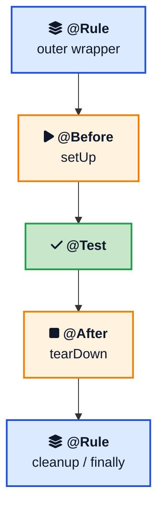
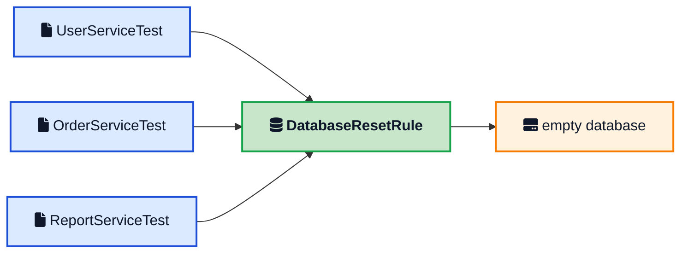
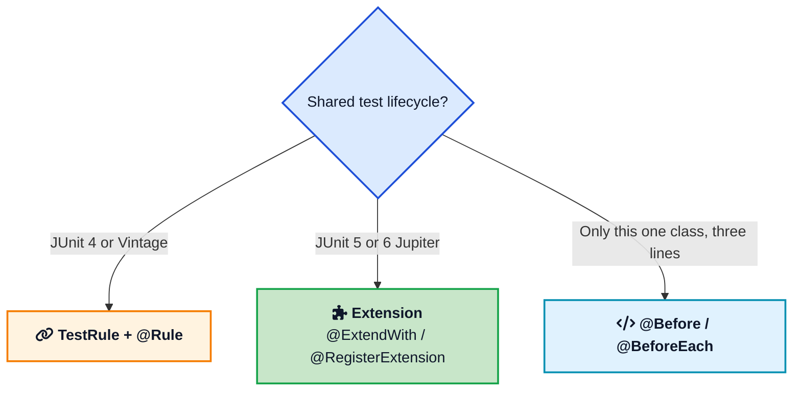

You write `setUp` to wipe a database. It works. Then you write a second test class that talks to the same database, so you copy `setUp`. Then a third class. Six months later the reset logic changes and you miss one copy. Tests start failing in ways that look like product bugs.

That is the problem [JUnit Rules](/glossary/junit-rule/){:target="_blank" rel="noopener"} were built to solve. A Rule is the same before/after idea as `setUp` and `tearDown`, lifted out of the test class so you can reuse it. This post keeps the original database example, shows how the wrapper actually runs, covers the rules JUnit 4 already ships, and maps each one to the [JUnit 5 Extension](/glossary/junit-extension/){:target="_blank" rel="noopener"} you should use on new code. The `@Rule` marker itself is just a [Java annotation](/java-custom-annotations/){:target="_blank" rel="noopener"}. The runner reads it with reflection the same way it finds `@Test`.



## <i class="fas fa-question-circle"></i> What a JUnit Rule Actually Is

In JUnit 4, `@Before` and `@After` (often still named `setUp` and `tearDown` from JUnit 3) run around each test method. They work. They also belong to that one class.

A Rule is an object the runner wraps around the test. You implement `TestRule`, JUnit hands you a `Statement` that means "run the test," and you return a new `Statement` that does extra work around it. From the [TestRule javadoc](https://junit.org/junit4/javadoc/4.13.2/org/junit/rules/TestRule.html){:target="_blank" rel="noopener"}: a rule can add checks, do setup and cleanup, or just watch the test. It can do everything `@Before` / `@After` / `@BeforeClass` / `@AfterClass` can do, and it is easier to share.

The runner applies rules **around** `@Before`, the `@Test` method, and `@After`. So the order for one method looks like this:





That wrapping is why a Rule can enforce a timeout on the whole method, including `setUp`, or wipe a database even if `setUp` in the test class does something else.

`MethodRule` is the older interface. `TestRule` replaced it in JUnit 4.9. New rules should implement `TestRule`.

## <i class="fas fa-database"></i> Why setUp Does Not Scale

Imagine you test a `UserService` that writes to a real database in instrumentation tests. You want every method to start from an empty schema. In one class, `@Before` is fine:

```java
@Before
public void setUp() {
    getTargetContext().deleteDatabase(DatabaseHelper.DB_NAME);
}
```

That is exactly the pattern in the [Android database testing](/testing-android-database/){:target="_blank" rel="noopener"} post. The pain starts when `OrderServiceTest`, `ReportServiceTest`, and `SyncWorkerTest` need the same wipe. You either copy the method, push it into a base class that every test must extend, or extract a Rule.

A base class looks tidy until you need two independent helpers (database reset and a mock server) and Java will not let you extend both. A Rule is composition. A test class can hold as many `@Rule` fields as it wants. That is the same reason the [Template Method](/design-patterns/template-method/){:target="_blank" rel="noopener"} pattern shows up in test frameworks, and also why composition with Rules (or Extensions) ages better than a deep test superclass.

## <i class="fas fa-code"></i> A Custom Rule: Reset the Database

Here is the original example, with two fixes that matter in real suites. The field is `public` (JUnit 4 ignores a package-private `@Rule`). Cleanup, if you add it, sits in `finally` so a failed assertion still leaves the next test a clean database.

```java
import org.junit.rules.TestRule;
import org.junit.runner.Description;
import org.junit.runners.model.Statement;

public class DatabaseResetRule implements TestRule {

    @Override
    public Statement apply(final Statement base, Description description) {
        return new Statement() {
            @Override
            public void evaluate() throws Throwable {
                clearDatabase();
                try {
                    base.evaluate();
                } finally {
                    // optional: close connections, delete files
                }
            }
        };
    }

    private void clearDatabase() {
        // drop tables, delete the file, or run a truncate script
    }
}
```

`Description` is there if you need the test method name or the class. You do not have to use it.

Use the rule in every test class that needs a clean store:

```java
import org.junit.Rule;
import org.junit.Test;

import static org.hamcrest.CoreMatchers.is;
import static org.junit.Assert.assertNotNull;
import static org.junit.Assert.assertThat;

public class UserServiceTest {

    @Rule
    public DatabaseResetRule db = new DatabaseResetRule();

    @Test
    public void shouldAddUserToDatabase() {
        UserService service = new UserService();
        service.add(new User("Ajit"));
        assertNotNull(service.getUserByName("Ajit"));
    }

    @Test
    public void shouldGetAllUsers() {
        UserService service = new UserService();
        service.add(new User("Ajit"));
        assertThat(service.getAllUsers().size(), is(1));
    }
}
```

If the only thing you need is start/stop of a resource, skip the raw `Statement` and extend `ExternalResource`. That is what `TemporaryFolder` does internally:

```java
import org.junit.rules.ExternalResource;

public class DatabaseResetRule extends ExternalResource {
    @Override
    protected void before() {
        clearDatabase();
    }

    @Override
    protected void after() {
        // close the helper, delete the file
    }

    private void clearDatabase() {
        // ...
    }
}
```

Same `@Rule` field in the test. Less wrapping code to get wrong.





Change `clearDatabase` once. Every class that holds the rule picks it up. That is the whole benefit over copying `setUp`.

## <i class="fas fa-boxes"></i> Rules JUnit 4 Already Ships

You do not have to write a Rule for every job. The [JUnit 4 Rules wiki](https://github.com/junit-team/junit4/wiki/Rules){:target="_blank" rel="noopener"} lists the ones in `org.junit.rules`.

**TemporaryFolder** creates files and directories and deletes them when the method ends. From 4.13 you can fail the test if deletion fails:

```java
@Rule
public TemporaryFolder folder = TemporaryFolder.builder().assureDeletion().build();

@Test
public void writesAFile() throws IOException {
    File input = folder.newFile("input.txt");
    // ...
}
```

**ExpectedException** lets you assert type and message inside the method, which is more precise than `@Test(expected = ...)`.

```java
@Rule
public ExpectedException thrown = ExpectedException.none();

@Test
public void rejectsANullIcon() {
    thrown.expect(IllegalArgumentException.class);
    thrown.expectMessage("Icon is null");
    new DigitalAssetManager(null, null);
}
```

**Timeout** applies one limit to every method in the class, including `setUp`. Pair it with `DisableOnDebug` if you do not want breakpoints to fail the test.

**TestName** exposes the current method name, useful in logs or in a per-test output folder.

**ErrorCollector** keeps going after the first failure so you see every bad row in a table, not just the first.

**TestWatcher** hooks succeeded, failed, skipped, starting, and finished without changing the test result. Good for extra logging.

**Verifier** is the base for "the test passed, but the log is empty, so fail anyway."

**@ClassRule** is the class-level twin. The field must be `public static`. Use it to connect a server once for a suite, not once per method.

**RuleChain** (or `@Rule(order = ...)` since 4.13) fixes wrapper order. Without it, multiple fields are applied in an order that depends on the [JVM](/how-jvm-works/){:target="_blank" rel="noopener"} reflection API, which is not a contract you want.

```java
@Rule
public TestRule chain = RuleChain
        .outerRule(new LoggingRule("outer"))
        .around(new DatabaseResetRule())
        .around(new LoggingRule("inner"));
```

Outer starts first and finishes last, like nested try/finally.

Android tests used the same API. `ActivityTestRule` in older Espresso suites is a Rule that launches an Activity before the method and finishes it after. See the [ListView instrumentation](/instrumentation-testing-of-listview/){:target="_blank" rel="noopener"} and [Espresso](/android-instrumentation-testing-using-espresso/){:target="_blank" rel="noopener"} posts. Newer AndroidX tests move to `ActivityScenario` instead of that Rule.

## <i class="fas fa-exchange-alt"></i> JUnit 5 and 6: Extensions Do This Job Now

If you are starting a project on current JUnit (the docs call the stack JUnit Platform + Jupiter, version 6.x on [the user guide](https://docs.junit.org/current/user-guide/){:target="_blank" rel="noopener"}), do not add new `TestRule` classes. Jupiter replaced Rules with Extensions. Baeldung's [JUnit 5 extensions guide](https://www.baeldung.com/junit-5-extensions){:target="_blank" rel="noopener"} is a solid walkthrough. JUnit Vintage can still run old `@Rule` tests on the platform, but Vintage is deprecated there and is meant as a bridge.

The database reset becomes a callback:

```java
import org.junit.jupiter.api.extension.BeforeEachCallback;
import org.junit.jupiter.api.extension.ExtensionContext;

public class DatabaseResetExtension implements BeforeEachCallback {
    @Override
    public void beforeEach(ExtensionContext context) {
        clearDatabase();
    }

    private void clearDatabase() {
        // same wipe as the Rule
    }
}
```

Register it on the class:

```java
import org.junit.jupiter.api.Test;
import org.junit.jupiter.api.extension.ExtendWith;

@ExtendWith(DatabaseResetExtension.class)
class UserServiceTest {

    @Test
    void shouldAddUserToDatabase() {
        // ...
    }
}
```

Or keep an instance, the closest match to a `@Rule` field:

```java
import org.junit.jupiter.api.extension.RegisterExtension;

class UserServiceTest {
    @RegisterExtension
    DatabaseResetExtension db = new DatabaseResetExtension();
}
```

Built-in mappings you will use constantly:

| JUnit 4 Rule | JUnit 5 / 6 |
|--------------|-------------|
| TemporaryFolder | `@TempDir` on a field or parameter |
| ExpectedException | `Assertions.assertThrows` |
| Timeout | `@Timeout` on a method or class |
| TestName | `TestInfo` parameter on the test method |
| @ClassRule | `BeforeAllCallback` / `AfterAllCallback` |
| custom TestRule | `BeforeEachCallback`, `AfterEachCallback`, or a full `Extension` |





Spring Boot tests follow the same split. Older suites use Spring's JUnit 4 `SpringClassRule` and `SpringMethodRule`. Current Spring Boot tests use `@ExtendWith(SpringExtension.class)` or `@SpringBootTest`, which registers that extension for you. Mockito's `@ExtendWith(MockitoExtension.class)` replaced `MockitoJUnit.rule()`.

## <i class="fas fa-exclamation-triangle"></i> Mistakes That Make the Rule Look Broken

**The field is not public.** JUnit 4 will not apply it. No error, just no reset. Make it `public` (or use a public getter method annotated with `@Rule`).

**You forgot `@Test`.** Rules wrap test methods. A public method without `@Test` is not a test.

**Cleanup is not in `finally`.** If `base.evaluate()` throws, code after it never runs. The next test inherits dirty state. `ExternalResource` already uses the safe pattern.

**You needed `@ClassRule` but used `@Rule`.** Starting Docker or a database per method is slow and flaky. One static `@ClassRule` (or `BeforeAllCallback`) is the right scope. Wiping rows can still be a per-method Rule inside that.

**Several `@Rule` fields and failures that depend on order.** Order is undefined unless you set `order` or `RuleChain`. If one rule starts a server and another needs the port, make that nesting explicit.

**You added a Rule on JUnit 5 by habit.** Jupiter ignores `org.junit.Rule`. The test compiles if Vintage and Jupiter both sit on the classpath, and then you wonder which engine ran. Pick one model per test class.

## <i class="fas fa-flag-checkered"></i> Wrapping Up

`setUp` and `tearDown` are the right tool when the logic is local. The moment the same wipe, server, or temp directory shows up in a second class, pull it into a JUnit Rule. Implement `TestRule` or extend `ExternalResource`, put a public `@Rule` field on each test, and keep cleanup in `finally`.

That design is still how a lot of JUnit 4 and Android instrumentation suites work. On JUnit 5 and 6 the same design is an Extension. The names changed. The lesson did not: shared lifecycle belongs in a reusable wrapper, not in a copied method.

---

**Related posts:**

- [Java Custom Annotations](/java-custom-annotations/){:target="_blank" rel="noopener"} - `@Rule` and `@Test` are annotations the runner reads with reflection
- [How the JVM Works](/how-jvm-works/){:target="_blank" rel="noopener"} - Where class metadata lives, which JUnit uses to find rules and tests
- [Testing an Android Database](/testing-android-database/){:target="_blank" rel="noopener"} - The `@Before` database wipe that a Rule would share across classes
- [Android Instrumentation Testing Using Espresso](/android-instrumentation-testing-using-espresso/){:target="_blank" rel="noopener"} - `ActivityTestRule` is a Rule that launches an Activity
- [Instrumentation Testing of ListView](/instrumentation-testing-of-listview/){:target="_blank" rel="noopener"} - Another `ActivityTestRule` example from the same era
- [Template Method Design Pattern](/design-patterns/template-method/){:target="_blank" rel="noopener"} - The lifecycle skeleton `@Before` / `@Test` / `@After` follows

*Further reading: the [JUnit 4 Rules wiki](https://github.com/junit-team/junit4/wiki/Rules){:target="_blank" rel="noopener"}, the [Rule](https://junit.org/junit4/javadoc/4.13.2/org/junit/Rule.html){:target="_blank" rel="noopener"} and [TestRule](https://junit.org/junit4/javadoc/4.13.2/org/junit/rules/TestRule.html){:target="_blank" rel="noopener"} javadocs, Baeldung's [JUnit 4 Rules](https://www.baeldung.com/junit-4-rules){:target="_blank" rel="noopener"} and [JUnit 5 Extensions](https://www.baeldung.com/junit-5-extensions){:target="_blank" rel="noopener"} guides, and the current [JUnit User Guide](https://docs.junit.org/current/user-guide/){:target="_blank" rel="noopener"}.*
