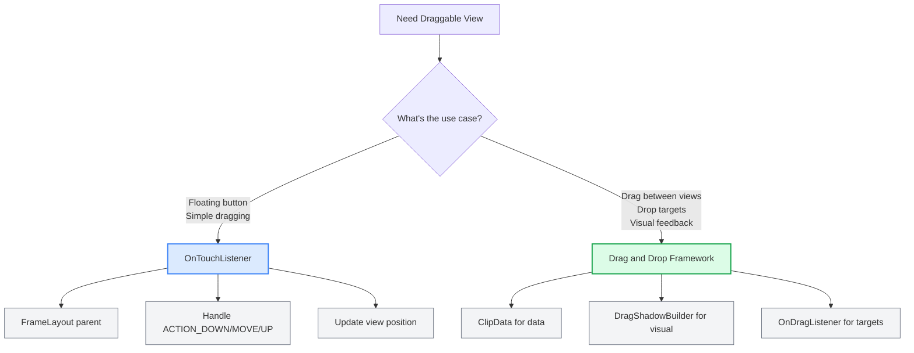
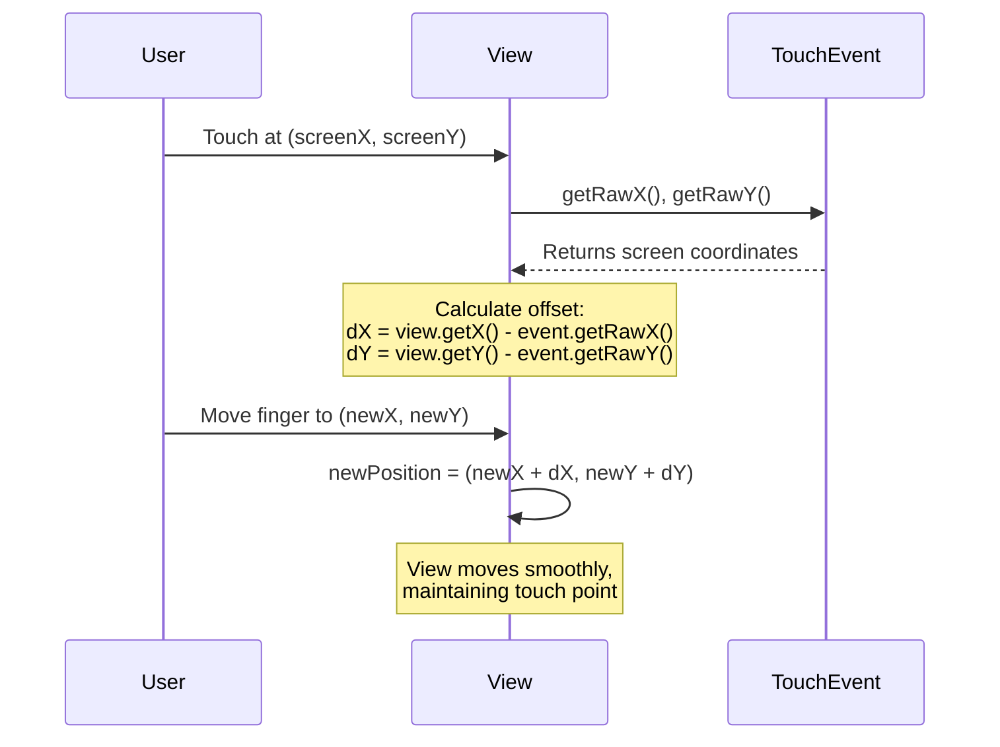
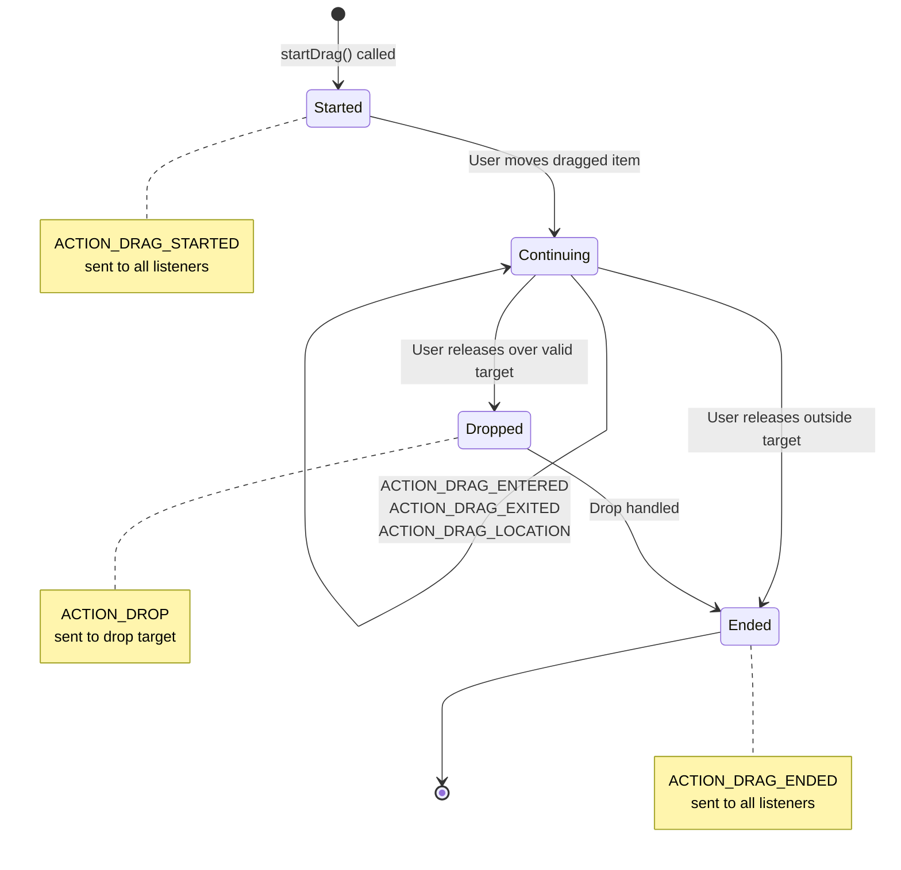

You want to add a floating button that users can drag around the screen. Or maybe you need a draggable card that moves smoothly with the user's finger. This is a common pattern in Android apps, from chat heads to floating action buttons to custom drag and drop interfaces.

The good news: making views draggable in Android is straightforward once you understand touch event handling. The bad news: there are several approaches, each with tradeoffs. This guide covers both the simple OnTouchListener approach and the more powerful drag and drop framework, plus the gotchas that trip up developers.

## The Two Approaches: Simple Dragging vs Drag and Drop

Android offers two ways to make views draggable:

1. **OnTouchListener approach**: Simple dragging within a container. Good for floating buttons, draggable cards, or any view that moves freely.
2. **Drag and Drop framework**: Full drag and drop between views with visual feedback. Good for reordering lists, moving items between containers, or complex drag operations.

Most apps start with OnTouchListener because it's simpler. But if you need to drag items between different views or show drop zones, the drag and drop framework is the right choice.



Let's start with the simpler approach.

## Approach 1: Simple Dragging with OnTouchListener

This is what you use when you want a view that follows the user's finger. Think floating action buttons, draggable cards, or any view that moves freely on screen.

### Step 1: Use FrameLayout as the Parent

FrameLayout is the key. Unlike LinearLayout or RelativeLayout, FrameLayout lets children overlap and be positioned anywhere. This is essential for draggable views.

```xml
<?xml version="1.0" encoding="utf-8"?>
<FrameLayout
    xmlns:android="http://schemas.android.com/apk/res/android"
    android:layout_width="match_parent"
    android:layout_height="match_parent">

    <!-- Your main content -->
    <ScrollView
        android:layout_width="match_parent"
        android:layout_height="match_parent">

        <LinearLayout
            android:layout_width="match_parent"
            android:layout_height="wrap_content"
            android:orientation="vertical">

            <!-- Your content here -->
        </LinearLayout>
    </ScrollView>

    <!-- Draggable view floats above -->
    <ImageButton
        android:id="@+id/draggable_view"
        android:layout_width="64dp"
        android:layout_height="64dp"
        android:layout_gravity="bottom|end"
        android:layout_margin="16dp"
        android:src="@drawable/ic_drag_handle"/>

</FrameLayout>
```

The draggable view is declared last in the XML, so it renders on top. The `layout_gravity` sets its initial position.

### Step 2: Implement OnTouchListener

The core logic lives in the `onTouch` method. Here's the complete implementation:

```java
import android.os.Bundle;
import android.view.MotionEvent;
import android.view.View;
import android.widget.Toast;
import androidx.appcompat.app.AppCompatActivity;

public class DraggableActivity extends AppCompatActivity implements View.OnTouchListener {
    private float dX, dY;
    private int lastAction;

    @Override
    protected void onCreate(Bundle savedInstanceState) {
        super.onCreate(savedInstanceState);
        setContentView(R.layout.activity_draggable);

        View dragView = findViewById(R.id.draggable_view);
        dragView.setOnTouchListener(this);
    }

    @Override
    public boolean onTouch(View view, MotionEvent event) {
        switch (event.getActionMasked()) {
            case MotionEvent.ACTION_DOWN:
                // Capture the offset between view position and touch point
                dX = view.getX() - event.getRawX();
                dY = view.getY() - event.getRawY();
                lastAction = MotionEvent.ACTION_DOWN;
                break;

            case MotionEvent.ACTION_MOVE:
                // Update view position to follow touch
                view.setX(event.getRawX() + dX);
                view.setY(event.getRawY() + dY);
                lastAction = MotionEvent.ACTION_MOVE;
                break;

            case MotionEvent.ACTION_UP:
                // Handle click if no movement occurred
                if (lastAction == MotionEvent.ACTION_DOWN) {
                    handleClick(view);
                }
                break;

            default:
                return false;
        }
        return true; // Consume the event
    }

    private void handleClick(View view) {
        Toast.makeText(this, "Clicked!", Toast.LENGTH_SHORT).show();
    }
}
```

### Understanding the Offset Calculation

The trickiest part is understanding why we need `dX` and `dY`. When the user touches the view, they might touch anywhere on it—the center, the edge, or a corner. If you just set the view position to the touch coordinates, the view jumps so its top-left corner aligns with the touch point. That feels wrong.

The offset fixes this:



**Example**: Say the view is at position (100, 200) and the user touches at screen coordinate (120, 220). The offset is (100 - 120, 200 - 220) = (-20, -20). When the user moves their finger to (150, 250), the view moves to (150 + (-20), 250 + (-20)) = (130, 230). The touch point stays under the finger the entire time.

### Handling Clicks vs Drags

You can't use `OnClickListener` alongside `OnTouchListener` because the touch listener consumes the event. Instead, detect clicks by checking if `ACTION_UP` happens immediately after `ACTION_DOWN` without any `ACTION_MOVE` in between.

For better click detection, use a movement threshold:

```java
private static final float CLICK_THRESHOLD = 10f; // pixels
private float initialX, initialY;

@Override
public boolean onTouch(View view, MotionEvent event) {
    switch (event.getActionMasked()) {
        case MotionEvent.ACTION_DOWN:
            initialX = event.getRawX();
            initialY = event.getRawY();
            dX = view.getX() - event.getRawX();
            dY = view.getY() - event.getRawY();
            lastAction = MotionEvent.ACTION_DOWN;
            break;

        case MotionEvent.ACTION_MOVE:
            view.setX(event.getRawX() + dX);
            view.setY(event.getRawY() + dY);
            lastAction = MotionEvent.ACTION_MOVE;
            break;

        case MotionEvent.ACTION_UP:
            if (lastAction == MotionEvent.ACTION_DOWN) {
                float deltaX = Math.abs(event.getRawX() - initialX);
                float deltaY = Math.abs(event.getRawY() - initialY);
                
                if (deltaX < CLICK_THRESHOLD && deltaY < CLICK_THRESHOLD) {
                    handleClick(view);
                }
            }
            break;
    }
    return true;
}
```

This treats small movements as clicks, which is more forgiving for users with shaky hands.

### Keeping Views Within Screen Bounds

By default, the view can be dragged off screen. To prevent this, clamp the position:

```java
case MotionEvent.ACTION_MOVE:
    float newX = event.getRawX() + dX;
    float newY = event.getRawY() + dY;
    
    // Get parent dimensions (works on all API levels)
    View parent = (View) view.getParent();
    int maxWidth = parent.getWidth();
    int maxHeight = parent.getHeight();
    
    // Clamp to parent bounds
    newX = Math.max(0, Math.min(newX, maxWidth - view.getWidth()));
    newY = Math.max(0, Math.min(newY, maxHeight - view.getHeight()));
    
    view.setX(newX);
    view.setY(newY);
    lastAction = MotionEvent.ACTION_MOVE;
    break;
```

On Android 11 (API 30) and later, use `WindowInsets` to account for system bars like the status bar and navigation bar:

```java
View rootView = findViewById(android.R.id.content);
WindowInsets insets = rootView.getRootWindowInsets();
int statusBarHeight = insets.getSystemWindowInsetTop();
int navBarHeight = insets.getSystemWindowInsetBottom();

// Adjust available height for system bars
View parent = (View) view.getParent();
int availableHeight = parent.getHeight() - statusBarHeight - navBarHeight;
newY = Math.max(statusBarHeight, Math.min(newY, availableHeight - view.getHeight()));
```

## Approach 2: Drag and Drop Framework

When you need to drag items between different views or show drop zones, use Android's drag and drop framework. It provides visual feedback, drop target highlighting, and a structured lifecycle.

### The Drag and Drop Lifecycle

The framework has four stages:



### Implementing Drag and Drop

Here's a complete example that lets you drag a view and drop it on a target:

**Layout:**

```xml
<LinearLayout
    android:layout_width="match_parent"
    android:layout_height="match_parent"
    android:orientation="vertical">

    <!-- Draggable source -->
    <ImageView
        android:id="@+id/drag_source"
        android:layout_width="100dp"
        android:layout_height="100dp"
        android:src="@drawable/ic_drag_item"
        android:contentDescription="Drag me"/>

    <!-- Drop target -->
    <FrameLayout
        android:id="@+id/drop_target"
        android:layout_width="match_parent"
        android:layout_height="0dp"
        android:layout_weight="1"
        android:background="#E3F2FD"
        android:padding="16dp">
        
        <TextView
            android:layout_width="wrap_content"
            android:layout_height="wrap_content"
            android:layout_gravity="center"
            android:text="Drop here"
            android:textSize="18sp"/>
    </FrameLayout>
</LinearLayout>
```

**Activity:**

```java
public class DragDropActivity extends AppCompatActivity {
    private ImageView dragSource;
    private FrameLayout dropTarget;

    @Override
    protected void onCreate(Bundle savedInstanceState) {
        super.onCreate(savedInstanceState);
        setContentView(R.layout.activity_drag_drop);

        dragSource = findViewById(R.id.drag_source);
        dropTarget = findViewById(R.id.drop_target);

        // Make source draggable
        dragSource.setOnLongClickListener(v -> {
            ClipData.Item item = new ClipData.Item("Dragged item data");
            String[] mimeTypes = {ClipDescription.MIMETYPE_TEXT_PLAIN};
            ClipData dragData = new ClipData("Label", mimeTypes, item);

            View.DragShadowBuilder shadowBuilder = new View.DragShadowBuilder(v);
            v.startDragAndDrop(dragData, shadowBuilder, null, 0);
            return true;
        });

        // Set up drop target
        dropTarget.setOnDragListener(new DropTargetListener());
    }

    private class DropTargetListener implements View.OnDragListener {
        @Override
        public boolean onDrag(View v, DragEvent event) {
            switch (event.getAction()) {
                case DragEvent.ACTION_DRAG_STARTED:
                    // Drag has started
                    return true;

                case DragEvent.ACTION_DRAG_ENTERED:
                    // Dragged item entered drop target
                    v.setBackgroundColor(getColor(R.color.drop_target_active));
                    return true;

                case DragEvent.ACTION_DRAG_EXITED:
                    // Dragged item left drop target
                    v.setBackgroundColor(getColor(R.color.drop_target_inactive));
                    return true;

                case DragEvent.ACTION_DROP:
                    // Item was dropped
                    ClipData.Item item = event.getClipData().getItemAt(0);
                    String draggedData = item.getText().toString();
                    
                    // Handle the drop
                    handleDrop(draggedData);
                    
                    v.setBackgroundColor(getColor(R.color.drop_target_inactive));
                    return true;

                case DragEvent.ACTION_DRAG_ENDED:
                    // Drag operation ended
                    v.setBackgroundColor(getColor(R.color.drop_target_inactive));
                    return true;

                default:
                    return false;
            }
        }
    }

    private void handleDrop(String data) {
        Toast.makeText(this, "Dropped: " + data, Toast.LENGTH_SHORT).show();
        // Add your drop handling logic here
    }
}
```

### Key Components Explained

**ClipData**: Carries the data being dragged. Can contain text, URIs, or Intent objects.

```java
ClipData.Item item = new ClipData.Item("My data");
String[] mimeTypes = {ClipDescription.MIMETYPE_TEXT_PLAIN};
ClipData dragData = new ClipData("Description", mimeTypes, item);
```

**DragShadowBuilder**: Creates the visual representation during drag. The default shows a semi-transparent copy of the view. You can customize it:

```java
public class CustomDragShadow extends View.DragShadowBuilder {
    public CustomDragShadow(View view) {
        super(view);
    }

    @Override
    public void onProvideShadowMetrics(Point shadowSize, Point shadowTouchPoint) {
        View view = getView();
        shadowSize.set(view.getWidth(), view.getHeight());
        shadowTouchPoint.set(view.getWidth() / 2, view.getHeight() / 2);
    }

    @Override
    public void onDrawShadow(Canvas canvas) {
        getView().draw(canvas);
    }
}
```

**OnDragListener**: Handles drag events on drop targets. Must return `true` for events you handle.

### Drag and Drop vs OnTouchListener

| Feature | OnTouchListener | Drag and Drop Framework |
|---------|----------------|-------------------------|
| Complexity | Simple | More complex |
| Use case | Floating buttons, simple dragging | Drag between views, drop targets |
| Visual feedback | None (you build it) | Built-in shadow and highlighting |
| Event handling | Direct touch events | Structured drag lifecycle |
| Performance | Lower overhead | Slightly more overhead |
| Best for | Single container dragging | Multi-view drag operations |

Use OnTouchListener for simple cases. Use the drag and drop framework when you need the structure and visual feedback it provides.

## Common Pitfalls and Solutions

### 1. View Jumps on First Touch

**Problem**: The view jumps to the touch point instead of moving smoothly.

**Cause**: Not calculating the offset correctly, or using `getX()` instead of `getRawX()`.

**Solution**: Always calculate `dX` and `dY` in `ACTION_DOWN`:

```java
dX = view.getX() - event.getRawX();  // Not event.getX()
dY = view.getY() - event.getRawY();  // Not event.getY()
```

### 2. Click Events Not Working

**Problem**: `OnClickListener` doesn't fire after adding `OnTouchListener`.

**Cause**: `OnTouchListener` consumes the event by returning `true`.

**Solution**: Detect clicks manually in `ACTION_UP`:

```java
case MotionEvent.ACTION_UP:
    if (lastAction == MotionEvent.ACTION_DOWN) {
        // It's a click, not a drag
        performClick();
    }
    break;
```

### 3. View Disappears Off Screen

**Problem**: Users can drag the view completely off screen.

**Solution**: Clamp coordinates to parent bounds using `Math.max()` and `Math.min()` as shown in the "Keeping Views Within Screen Bounds" section above.

### 4. Dragging Conflicts with Scrolling

**Problem**: In a ScrollView, dragging the view also scrolls the container.

**Solution**: Use `requestDisallowInterceptTouchEvent()`:

```java
case MotionEvent.ACTION_DOWN:
    view.getParent().requestDisallowInterceptTouchEvent(true);
    // ... rest of code
    break;

case MotionEvent.ACTION_UP:
    view.getParent().requestDisallowInterceptTouchEvent(false);
    break;
```

### 5. Performance Issues with Complex Views

**Problem**: Dragging feels laggy with complex views (many children, animations).

**Solution**: Use `View.animate()` for smoother movement, or draw a simplified version during drag:

```java
case MotionEvent.ACTION_MOVE:
    view.animate()
        .x(event.getRawX() + dX)
        .y(event.getRawY() + dY)
        .setDuration(0)
        .start();
    break;
```

Or for the drag and drop framework, create a lightweight `DragShadowBuilder` instead of using the full view.

### 6. Drag and Drop Not Working on Older Android Versions

**Problem**: `startDragAndDrop()` requires API 24+. Older versions need `startDrag()`.

**Solution**: Use the compatibility method:

```java
if (Build.VERSION.SDK_INT >= Build.VERSION_CODES.N) {
    view.startDragAndDrop(dragData, shadowBuilder, null, 0);
} else {
    view.startDrag(dragData, shadowBuilder, null, 0);
}
```

## Best Practices

### 1. Use Appropriate Parent Layout

FrameLayout is ideal for draggable views because it allows free positioning. Avoid ConstraintLayout or RelativeLayout for the draggable view's direct parent—they enforce positioning constraints that interfere with programmatic movement.

### 2. Provide Visual Feedback

During drag, show visual feedback. For OnTouchListener, you might change the view's alpha or scale:

```java
case MotionEvent.ACTION_DOWN:
    view.setAlpha(0.7f);
    view.setScaleX(1.1f);
    view.setScaleY(1.1f);
    break;

case MotionEvent.ACTION_UP:
    view.setAlpha(1.0f);
    view.setScaleX(1.0f);
    view.setScaleY(1.0f);
    break;
```

The drag and drop framework provides this automatically via `DragShadowBuilder`, but you can still enhance drop targets with color changes.

### 3. Save Position on Drag End

For floating buttons, save the final position so it persists across app restarts:

```java
case MotionEvent.ACTION_UP:
    SharedPreferences prefs = getSharedPreferences("app_prefs", MODE_PRIVATE);
    prefs.edit()
        .putFloat("button_x", view.getX())
        .putFloat("button_y", view.getY())
        .apply();
    break;
```

Restore in `onCreate()`:

```java
SharedPreferences prefs = getSharedPreferences("app_prefs", MODE_PRIVATE);
float savedX = prefs.getFloat("button_x", -1);
float savedY = prefs.getFloat("button_y", -1);
if (savedX >= 0 && savedY >= 0) {
    dragView.setX(savedX);
    dragView.setY(savedY);
}
```

### 4. Handle Configuration Changes

When the [screen rotates](/what-happens-when-android-screen-rotates/), views reset to their XML positions. Save state and restore it:

```java
@Override
protected void onSaveInstanceState(Bundle outState) {
    super.onSaveInstanceState(outState);
    View dragView = findViewById(R.id.draggable_view);
    outState.putFloat("drag_x", dragView.getX());
    outState.putFloat("drag_y", dragView.getY());
}

@Override
protected void onRestoreInstanceState(Bundle savedInstanceState) {
    super.onRestoreInstanceState(savedInstanceState);
    float x = savedInstanceState.getFloat("drag_x");
    float y = savedInstanceState.getFloat("drag_y");

    // Use post() because the view may not be laid out yet
    View dragView = findViewById(R.id.draggable_view);
    dragView.post(() -> {
        dragView.setX(x);
        dragView.setY(y);
    });
}
```

### 5. Test on Different Screen Sizes

Draggable views behave differently on phones vs tablets. Test boundary clamping and ensure the view doesn't get stuck in corners on large screens.

### 6. Consider Accessibility

Draggable views can be hard for users with motor impairments. Provide an alternative way to access the functionality, or make the drag threshold larger for easier activation.

## Real-World Examples

### Floating Action Button with Drag

Many apps use draggable floating action buttons. Here's a minimal implementation:

```java
public class FloatingButtonActivity extends AppCompatActivity {
    private FloatingActionButton fab;

    @Override
    protected void onCreate(Bundle savedInstanceState) {
        super.onCreate(savedInstanceState);
        setContentView(R.layout.activity_main);

        fab = findViewById(R.id.fab);
        fab.setOnTouchListener(new FabDragListener());
    }

    private class FabDragListener implements View.OnTouchListener {
        private float dX, dY;

        @Override
        public boolean onTouch(View view, MotionEvent event) {
            switch (event.getAction()) {
                case MotionEvent.ACTION_DOWN:
                    dX = view.getX() - event.getRawX();
                    dY = view.getY() - event.getRawY();
                    break;

                case MotionEvent.ACTION_MOVE:
                    float newX = event.getRawX() + dX;
                    float newY = event.getRawY() + dY;
                    
                    // Keep within parent bounds
                    View parent = (View) view.getParent();
                    newX = Math.max(0, Math.min(newX, parent.getWidth() - view.getWidth()));
                    newY = Math.max(0, Math.min(newY, parent.getHeight() - view.getHeight()));
                    
                    view.setX(newX);
                    view.setY(newY);
                    break;
            }
            return true;
        }
    }
}
```

### Drag to Reorder List Items

For reordering list items, use the drag and drop framework with RecyclerView:

```java
ItemTouchHelper.SimpleCallback callback = new ItemTouchHelper.SimpleCallback(
    ItemTouchHelper.UP | ItemTouchHelper.DOWN,
    ItemTouchHelper.LEFT | ItemTouchHelper.RIGHT
) {
    @Override
    public boolean onMove(RecyclerView recyclerView, 
                         RecyclerView.ViewHolder viewHolder,
                         RecyclerView.ViewHolder target) {
        int fromPos = viewHolder.getAdapterPosition();
        int toPos = target.getAdapterPosition();
        adapter.moveItem(fromPos, toPos);
        return true;
    }

    @Override
    public void onSwiped(RecyclerView.ViewHolder viewHolder, int direction) {
        adapter.removeItem(viewHolder.getAdapterPosition());
    }
};

ItemTouchHelper touchHelper = new ItemTouchHelper(callback);
touchHelper.attachToRecyclerView(recyclerView);
```

This is simpler than implementing drag and drop manually and provides built-in animations.

## When to Use Each Approach

**Use OnTouchListener when:**
- <i class="fas fa-check-circle text-success"></i> You need a simple floating button or draggable card
- <i class="fas fa-check-circle text-success"></i> The view moves within a single container
- <i class="fas fa-check-circle text-success"></i> You want minimal code and dependencies
- <i class="fas fa-check-circle text-success"></i> Performance is critical

**Use Drag and Drop Framework when:**
- <i class="fas fa-check-circle text-success"></i> You need to drag items between different views
- <i class="fas fa-check-circle text-success"></i> You want visual feedback (shadows, highlighting)
- <i class="fas fa-check-circle text-success"></i> You have multiple drop targets
- <i class="fas fa-check-circle text-success"></i> You need structured drag lifecycle events

**Don't use either when:**
- <i class="fas fa-times-circle text-danger"></i> Standard scrolling or swiping would work better
- <i class="fas fa-times-circle text-danger"></i> The interaction is confusing for users
- <i class="fas fa-times-circle text-danger"></i> You can use RecyclerView's built-in drag handlers instead

## Modern Alternatives: Jetpack Compose

If you're building new screens with Jetpack Compose, drag and drop is built in:

```kotlin
@Composable
fun DraggableBox() {
    var offsetX by remember { mutableStateOf(0f) }
    var offsetY by remember { mutableStateOf(0f) }

    Box(
        modifier = Modifier
            .offset { IntOffset(offsetX.toInt(), offsetY.toInt()) }
            .pointerInput(Unit) {
                detectDragGestures { change, dragAmount ->
                    change.consume()
                    offsetX += dragAmount.x
                    offsetY += dragAmount.y
                }
            }
            .size(100.dp)
            .background(Color.Blue)
    )
}
```

Compose's drag handling is declarative and integrates with the composition system. For existing View-based code, stick with OnTouchListener or the drag and drop framework.

## Wrapping Up

Making views draggable in Android comes down to understanding touch events and choosing the right approach. For simple cases, OnTouchListener with FrameLayout is the quickest path. For complex drag and drop scenarios, the framework provides structure and visual feedback.

The key takeaways:

1. **FrameLayout enables free positioning**: Use it as the parent for draggable views
2. **Calculate offset in ACTION_DOWN**: This prevents the view from jumping to the touch point
3. **Use getRawX() and getRawY()**: These give screen coordinates, not view-relative coordinates
4. **Handle clicks manually**: OnTouchListener consumes events, so detect clicks in ACTION_UP
5. **Clamp to screen bounds**: Prevent views from disappearing off screen
6. **Choose the right approach**: OnTouchListener for simple dragging, drag and drop framework for complex scenarios

The code examples in this guide are production-ready starting points. Adapt them to your needs, add boundary checking, save positions, and test on different devices. Draggable views can enhance UX when used thoughtfully, but avoid overusing them—not everything needs to be draggable.

---

*For more Android development guides, check out [Android Custom Animations](/android-custom-animations/) for view animations, [Android Data Binding](/android-data-binding/) for declarative UI, and [Android UI for Beginners](/android-ui-for-beginners/) for layout fundamentals.*

*Building mobile apps? See [Flutter Under the Hood](/flutter-under-the-hood/) for cross-platform development, [Android CI/CD with GitHub Actions](/android-ci-cd-using-github-actions/) for automation, and [Offline Mode in Android Apps](/offline-mode-of-android-apps/) for handling network connectivity.*

*References: [Android Developer Guide: Drag and Drop](https://developer.android.com/develop/ui/views/touch-and-input/drag-drop), [Android Touch Event Handling](https://developer.android.com/develop/ui/views/touch-and-input/input-events), [Vogella Android Drag and Drop Tutorial](https://www.vogella.com/tutorials/AndroidDragAndDrop/article.html)*
