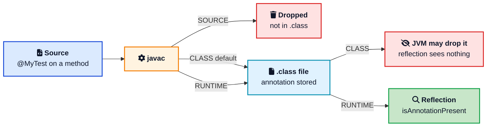
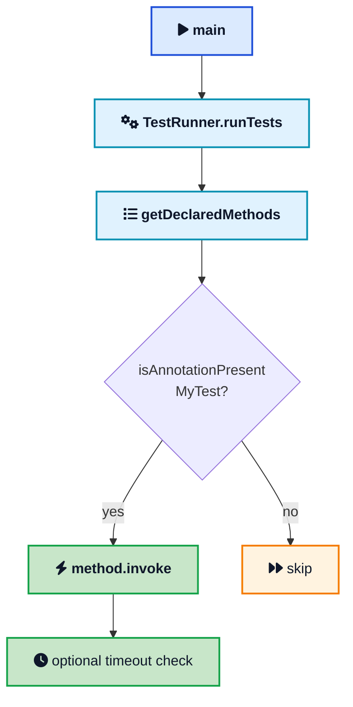
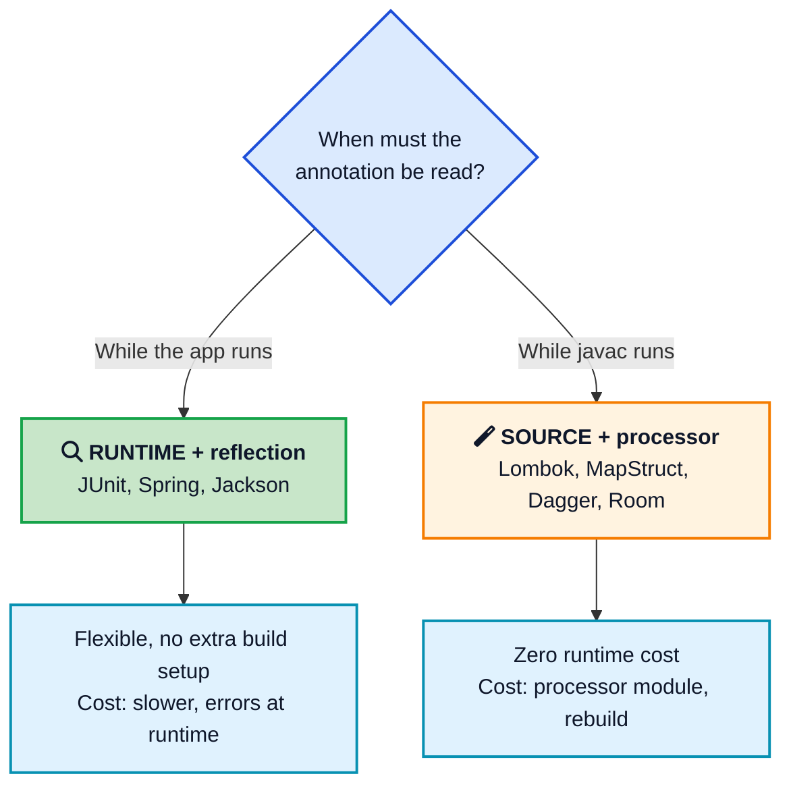

You put `@Test` on a method and JUnit runs it. You put `@Autowired` on a field and Spring fills it in. You put `@JsonProperty` on a getter and Jackson names the JSON field. None of those tags is magic. Each one is a small piece of metadata, plus some other code that knows how to read it.

That other code is the interesting part. A [Java annotation](/glossary/java-annotation/){:target="_blank" rel="noopener"} does nothing by itself. The compiler, a framework, or a few lines of reflection have to look at the tag and decide what to do. Once you see that split, writing your own annotations stops feeling like advanced Java and starts feeling like a labeling system.

This post rebuilds that system from scratch. We will look at the annotations you already use, the meta-annotations that control them, a custom `@MyTest` runner you can run locally, then the compile-time path that tools like Lombok use. The original mini [test runner on GitHub](https://github.com/ajitsing/JavaCustomAnnotations){:target="_blank" rel="noopener"} is still the working example. If you want the runtime that actually stores this metadata, the [how the JVM works](/how-jvm-works/){:target="_blank" rel="noopener"} guide sits underneath everything here.



## <i class="fas fa-tags"></i> What a Java Annotation Actually Is

An annotation is data about your code, not code that runs. Oracle's tutorial puts it plainly: annotations have no direct effect on the operation of the code they annotate. `@Override` does not override anything. It tells `javac` "please fail the build if this method does not override a parent method." `@Deprecated` does not stop callers. It tells the compiler and your IDE to warn them.

That is a different idea from a method call or an `if`. You are attaching a label. Some other program consumes the label later.

Java got annotations in JDK 5. Before that, frameworks stuffed the same information into XML files or marker interfaces (empty interfaces like `Serializable`). Annotations won because the metadata lives next to the thing it describes. When you rename a field, the `@Column` on it moves with it. An XML mapping in another file does not.

You declare a custom annotation with `@interface`. That is not a coincidence. An annotation type is a special kind of interface. The compiler generates a real interface for it, and at runtime you get a proxy that implements that interface so `timeout()` can return the value you wrote in source.

## <i class="fas fa-code"></i> Annotations You Already Use

If you write tests, you have used `@Test`. JUnit 5's `@Test` lives in `org.junit.jupiter.api`. JUnit 4's lives in `org.junit`. Same idea: mark methods, let a runner find them. You do not call `firstTest()` from `main`. The runner does.

If you map JSON, Jackson's `@JsonProperty` and Gson's `@Expose` tell the library which fields to include and what to name them. Hibernate and JPA use `@Entity` and `@Column` the same way for tables. Spring Boot apps are covered in annotations: `@SpringBootApplication`, `@RestController`, `@GetMapping`, `@Autowired`.

The JDK itself ships a small set you should know:

- `@Override` is a compile-time check. Retention is SOURCE.
- `@Deprecated` marks APIs that should not be used. Since Java 9 it can carry `since` and `forRemoval`.
- `@SuppressWarnings` silences specific compiler warnings. Also SOURCE.
- `@FunctionalInterface` documents that an interface has exactly one abstract method, and the compiler enforces it.
- `@SafeVarargs` is a promise about generic varargs.

Those last few are processed by `javac`. You never write a loop that looks for `@Override`. Custom annotations you invent for your own framework almost always need you to write that loop, or to write a processor that runs at compile time.

## <i class="fas fa-layer-group"></i> Meta-Annotations: Retention and Target

When you define an annotation, you annotate the annotation. Those tags are called meta-annotations. Two of them decide whether your custom type is usable.

**`@Retention`** answers "how long does this live?"

**`@Target`** answers "where may I put this?"





The three [retention policies](https://docs.oracle.com/en/java/javase/21/docs/api/java.base/java/lang/annotation/RetentionPolicy.html){:target="_blank" rel="noopener"} are:

| Policy | Still in source | In the `.class` file | Visible with reflection |
|--------|-----------------|----------------------|-------------------------|
| SOURCE | yes | no | no |
| CLASS | yes | yes | no |
| RUNTIME | yes | yes | yes |

CLASS is the default if you forget `@Retention`. That default is the number one reason a custom annotation "does not work." You put it on a method, you print `getAnnotation`, you get `null`. The compiler did its job. The JVM was never asked to keep the metadata around.

Use SOURCE when only the compiler or an [annotation processor](/glossary/annotation-processor/){:target="_blank" rel="noopener"} cares, for example Lombok-style code generation. Use RUNTIME when JUnit-style discovery, Spring-style injection, or your own scanner will read the annotation while the program runs. CLASS is rare in application code. Some bytecode tools read it from the class file without loading the class, but if you are using `java.lang.reflect`, you want RUNTIME.

`@Target` takes one or more `ElementType` values. The ones you will actually use:

- `TYPE`: class, interface, enum, record, annotation type
- `METHOD`, `FIELD`, `CONSTRUCTOR`, `PARAMETER`
- `TYPE_USE` and `TYPE_PARAMETER`: Java 8 type annotations, such as `List<@NonNull String>`
- `ANNOTATION_TYPE`: you can only put this on another annotation (meta-annotation)
- `RECORD_COMPONENT`: Java 16 records

If you omit `@Target`, the annotation is allowed on most declarations. Be explicit anyway. A test marker that accidentally compiles on a field is a footgun.

A few other meta-annotations show up often:

- `@Documented` includes the annotation in Javadoc.
- `@Inherited` copies a class-level annotation from a superclass to a subclass. It does not copy method annotations, and it does not apply to interfaces.
- `@Repeatable` (Java 8) lets you write the same annotation twice on one element. You also define a containing annotation that holds an array of them.

## <i class="fas fa-plus-circle"></i> How to Create a Custom Annotation

Start with the smallest useful example: a marker that means "this method is a test." That is how JUnit began, and it is enough to teach the whole loop.

```java
import java.lang.annotation.ElementType;
import java.lang.annotation.Retention;
import java.lang.annotation.RetentionPolicy;
import java.lang.annotation.Target;

@Retention(RetentionPolicy.RUNTIME)
@Target(ElementType.METHOD)
public @interface MyTest {
    long timeout() default 0L;
    String reason() default "";
}
```

Members look like methods. They cannot take parameters or throw exceptions. Allowed return types are primitives, `String`, `Class`, enums, other annotations, and arrays of those. A default cannot be `null`.

If you have a single member named `value`, callers can skip the name:

```java
public @interface Role {
    String value();
}

@Role("admin")          // short form
@Role(value = "admin")  // same thing
```

That is why so many library annotations are written `@Qualifier("mainDataSource")` instead of `@Qualifier(name = "mainDataSource")`.

You can also make a marker with no members at all, which is what the first version of `@MyTest` was. Markers are fine when presence is the only signal you need.

## <i class="fas fa-flask"></i> A Tiny Test Runner with Reflection

Here is the original idea, cleaned up. You mark tests with `@MyTest`. A runner scans the class and invokes those methods. Helper methods without the annotation are ignored. Full source is in the [JavaCustomAnnotations](https://github.com/ajitsing/JavaCustomAnnotations){:target="_blank" rel="noopener"} repo.

```java
public class SampleTests {
    @MyTest
    public void firstTest() {
        System.out.println("Running first test");
    }

    @MyTest(timeout = 1000, reason = "checks the happy path")
    public void secondTest() {
        System.out.println("Running 2nd test");
    }

    public void thirdTest() {
        System.out.println("This is not a test");
    }

    private void helperMethod() {
        System.out.println("I am a helper");
    }
}
```

The runner uses reflection. It asks the [class loader](/glossary/class-loader/){:target="_blank" rel="noopener"}'s `Class` object for methods, then checks each one:

```java
import java.lang.reflect.InvocationTargetException;
import java.lang.reflect.Method;

public class TestRunner {
    public void runTests(Object test) throws Exception {
        Method[] allMethods = test.getClass().getDeclaredMethods();
        for (Method method : allMethods) {
            executeMethod(test, method);
        }
    }

    private void executeMethod(Object test, Method method)
            throws InvocationTargetException, IllegalAccessException {
        if (!method.isAnnotationPresent(MyTest.class)) {
            return;
        }
        MyTest spec = method.getAnnotation(MyTest.class);
        method.setAccessible(true);
        long started = System.nanoTime();
        method.invoke(test);
        long tookMs = (System.nanoTime() - started) / 1_000_000;
        if (spec.timeout() > 0 && tookMs > spec.timeout()) {
            throw new AssertionError(
                method.getName() + " took " + tookMs + " ms, limit is " + spec.timeout());
        }
    }
}
```

`getDeclaredMethods()` returns methods declared on that class, including private ones, and does not walk the superclass. `getMethods()` returns public methods, including inherited ones. JUnit-style runners usually want declared methods on the test class, so `getDeclaredMethods` is the right call. `setAccessible(true)` is only needed if you allow package-private or private tests.

Wire it from `main`:

```java
public class Main {
    public static void main(String[] args) throws Exception {
        new TestRunner().runTests(new SampleTests());
    }
}
```

Output is the two annotated methods. `thirdTest` and `helperMethod` never run, because they have no `@MyTest`.





That is the entire JUnit discovery model, minus reporting, assertions, and lifecycle callbacks. JUnit 5's Jupiter engine still does a version of this scan, then builds a test plan from the methods it found.

One reflection detail that bites people: `method.invoke` wraps failures in `InvocationTargetException`. The real assertion error or runtime exception is `getCause()`. Unwrap it if you are building a runner you actually want to use.

## <i class="fas fa-industry"></i> Runtime vs Compile Time

You now have two ways to consume an annotation. Pick based on when the work should happen.





**Runtime** is what we just built. The [bytecode](/glossary/bytecode/){:target="_blank" rel="noopener"} still contains the annotation, the JVM keeps it, and your code asks for it. Spring's `@Transactional`, Jackson's `@JsonIgnore`, and Bean Validation's `@NotNull` all work this way (sometimes with a bytecode enhancer on top).

**Compile time** uses the annotation processing API in `javax.annotation.processing` (still that package name inside the JDK). You extend `AbstractProcessor`, list the types you support, and in `process` you can emit new source files. `javac` compiles those in a later round. That is how MapStruct writes mapper implementations and how Dagger writes the dependency graph. Android's Room does the same during the [Android build process](/android-build-process/){:target="_blank" rel="noopener"}. Kotlin projects go through kapt or the faster KSP.

A processor skeleton looks like this:

```java
import javax.annotation.processing.AbstractProcessor;
import javax.annotation.processing.RoundEnvironment;
import javax.annotation.processing.SupportedAnnotationTypes;
import javax.annotation.processing.SupportedSourceVersion;
import javax.lang.model.SourceVersion;
import javax.lang.model.element.TypeElement;
import java.util.Set;

@SupportedAnnotationTypes("com.example.MyTest")
@SupportedSourceVersion(SourceVersion.RELEASE_21)
public class MyTestProcessor extends AbstractProcessor {
    @Override
    public boolean process(Set<? extends TypeElement> annotations,
                           RoundEnvironment roundEnv) {
        roundEnv.getElementsAnnotatedWith(MyTest.class)
                .forEach(element -> {
                    // validate, or write a new .java file
                });
        return true;
    }
}
```

You register the processor in `META-INF/services/javax.annotation.processing.Processor`, or with Google's AutoService. For SOURCE retention, the annotation never reaches the running app. That is a feature: generated code has already done the work.

If you are choosing for a new library, prefer compile time when the annotation would otherwise force every call site to pay for reflection, or when a mistake should fail the build. Prefer runtime when behavior depends on objects that only exist after startup, such as "inject this field from the current Spring context."

## <i class="fas fa-cogs"></i> How Popular Libraries Use the Same Trick

Once you have written `@MyTest`, the big frameworks look less mysterious.

**JUnit** discovers tests by annotation, then runs before/after callbacks the same way. A [JUnit Rule](/junit-rules/){:target="_blank" rel="noopener"} is another annotation (`@Rule`) pointing at an object that wraps each test.

**Spring** reads `@Component`, `@Service`, and `@Autowired` to build the application context. Around `@Transactional` it often creates a [proxy](/design-patterns/proxy/){:target="_blank" rel="noopener"} so that begin/commit/rollback wrap the real method. If you later inspect the proxy with raw reflection, you may not see the annotation that was on the target class. Spring's `AnnotationUtils` and `AopUtils` exist because of that gap.

**Jackson** and Gson walk fields and methods, skip anything without the right annotation (or honor `@JsonIgnore`), and name properties from `@JsonProperty`.

**Jakarta Bean Validation** (`@NotNull`, `@Size`) is read by a validator at runtime, often on a REST controller argument.

**Lombok** is the compile-time extreme: `@Getter` is gone from the [bytecode](/glossary/bytecode/){:target="_blank" rel="noopener"} after the processor writes an actual `getName()` method. Your running program never sees `@Getter`.

You can mix both styles in one annotation type, but it is usually cleaner to pick one retention and stick to it.

## <i class="fas fa-exclamation-triangle"></i> Mistakes That Waste an Afternoon

**Forgetting RUNTIME.** If your scanner uses reflection, `@Retention(RetentionPolicy.RUNTIME)` is not optional. CLASS will compile and still return `null`.

**Scanning the wrong methods.** Private `@MyTest` methods are invisible to `getMethods()`. Inherited public tests are invisible to `getDeclaredMethods()`. Match the API to your rule.

**Looking at a JDK proxy.** `Proxy.newProxyInstance` can hide annotations on the target. Spring MVC controllers with class-level annotations sometimes need `AnnotationUtils.findAnnotation` instead of `clazz.getAnnotation`.

**Expecting `@Inherited` on methods.** It only copies type-level annotations down a class hierarchy. A `@MyTest` on a superclass method is already on that method object when you scan the superclass. It is not copied onto an override unless you put it on the override too.

**Illegal member types.** You cannot put a `List<String>` on an annotation. Use `String[]`. You cannot default a `String` member to `null`. Use `""` or make the member required.

**Doing heavy work in a runtime scanner on a hot path.** Reflection is fine at startup (Spring does a lot of it once). It is a poor choice inside a tight request loop. Cache the `Method` list, or generate code at compile time.

**Security and `setAccessible`.** Opening private methods is what a test runner needs. The same trick in production code can break modules (Java 16+ stronger encapsulation) and can surprise callers who thought a method was private. Keep it in frameworks, not in random business logic.

## <i class="fas fa-flag-checkered"></i> Wrapping Up

A custom Java annotation is a labeled interface plus a consumer. You write `@interface`, pin it down with `@Target` and `@Retention`, put it on the code you care about, then either scan it at runtime with reflection or let `javac` run a processor. That is the same pattern behind JUnit, Spring, Jackson, Hibernate, and Lombok.

The `@MyTest` runner is enough to prove the runtime path: marker on a method, `isAnnotationPresent`, `invoke`. Add members when you need data, not just a flag. Switch to SOURCE retention and an annotation processor when you want the work done before the process even starts.

Keep the retention policy honest, scan the methods you actually annotated, and remember that the annotation never runs by itself. The interesting code is always the reader.

---

**Related posts:**

- [How the JVM Works](/how-jvm-works/){:target="_blank" rel="noopener"} - Where class metadata and the Class object live, which reflection reads
- [How Java Debugging Works](/how-java-debugging-works/){:target="_blank" rel="noopener"} - Another look at JVM metadata, this time for breakpoints
- [Java 25 LTS Features](/java-25-lts-features/){:target="_blank" rel="noopener"} - What a modern JDK adds on top of the language these annotations use
- [JUnit Rules](/junit-rules/){:target="_blank" rel="noopener"} - Reusable test lifecycle, driven by the `@Rule` annotation
- [Android Build Process](/android-build-process/){:target="_blank" rel="noopener"} - Where Dagger, Room, kapt, and KSP run processors during a build
- [Proxy Design Pattern](/design-patterns/proxy/){:target="_blank" rel="noopener"} - How Spring wraps `@Transactional` methods without changing your class

*Further reading: Oracle's [Annotations tutorial](https://docs.oracle.com/javase/tutorial/java/annotations/index.html){:target="_blank" rel="noopener"} and [declaring an annotation type](https://docs.oracle.com/javase/tutorial/java/annotations/declaring.html){:target="_blank" rel="noopener"}, the [RetentionPolicy](https://docs.oracle.com/en/java/javase/21/docs/api/java.base/java/lang/annotation/RetentionPolicy.html){:target="_blank" rel="noopener"} API docs, Baeldung on [custom annotations](https://www.baeldung.com/java-custom-annotation){:target="_blank" rel="noopener"} and [annotation processing](https://www.baeldung.com/java-annotation-processing-builder){:target="_blank" rel="noopener"}, and Vogella's [annotations and reflection](https://www.vogella.com/tutorials/JavaAnnotations/article.html){:target="_blank" rel="noopener"} tutorial.*
