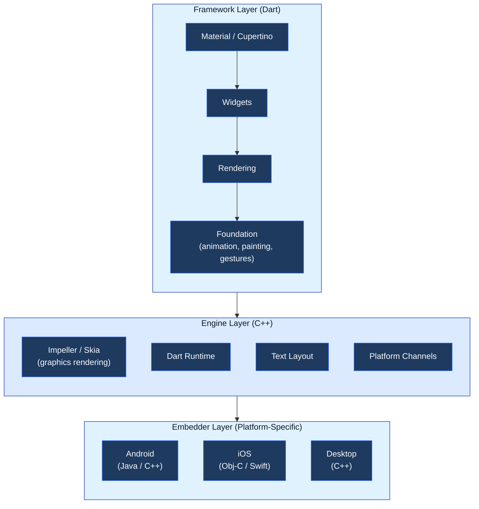
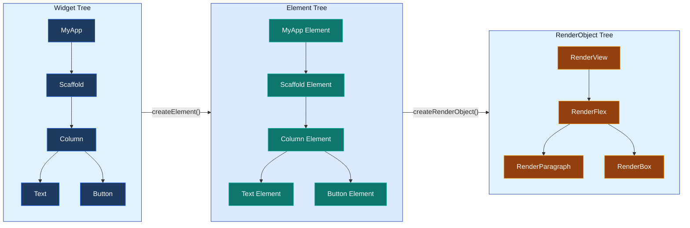
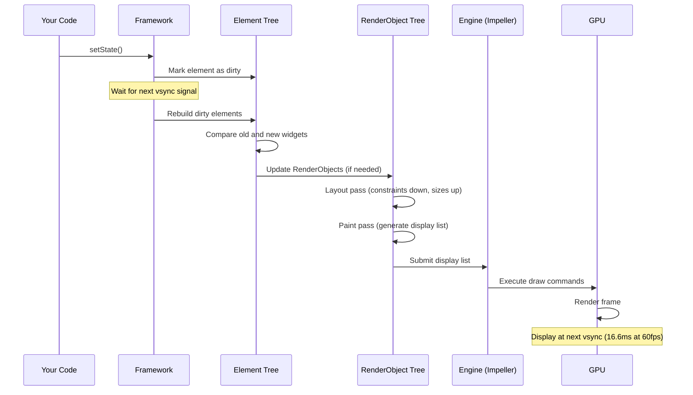
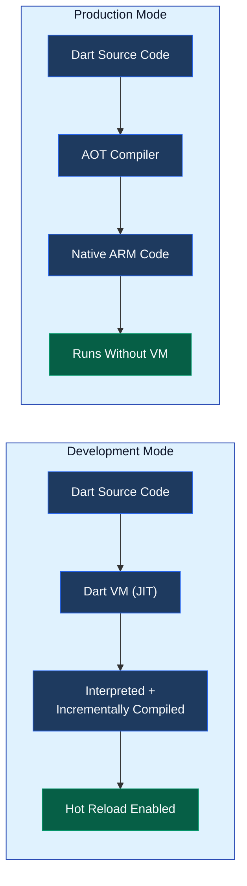
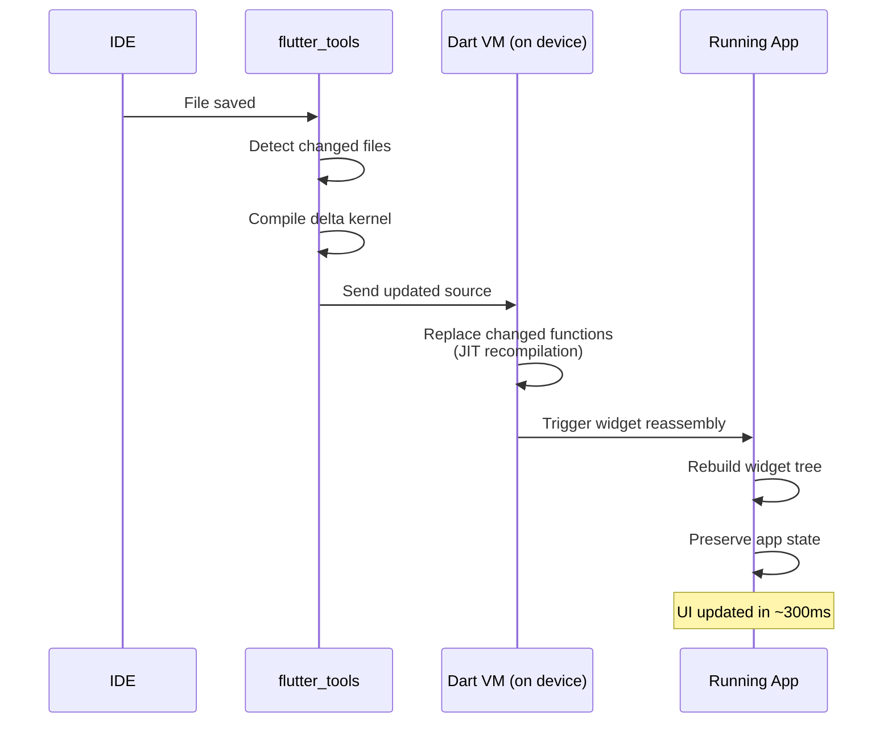
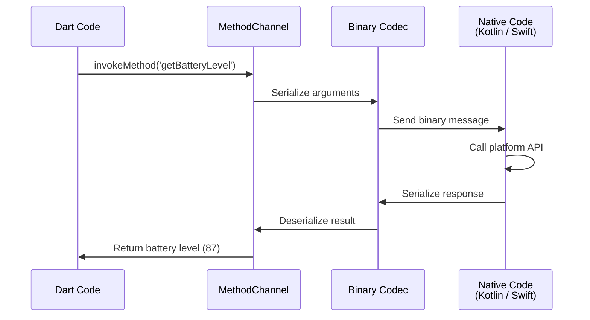
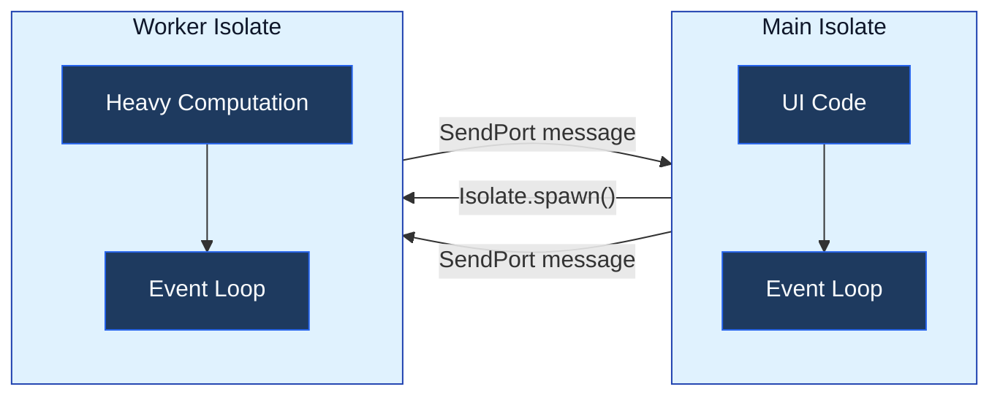
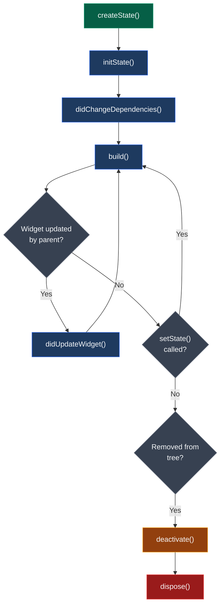
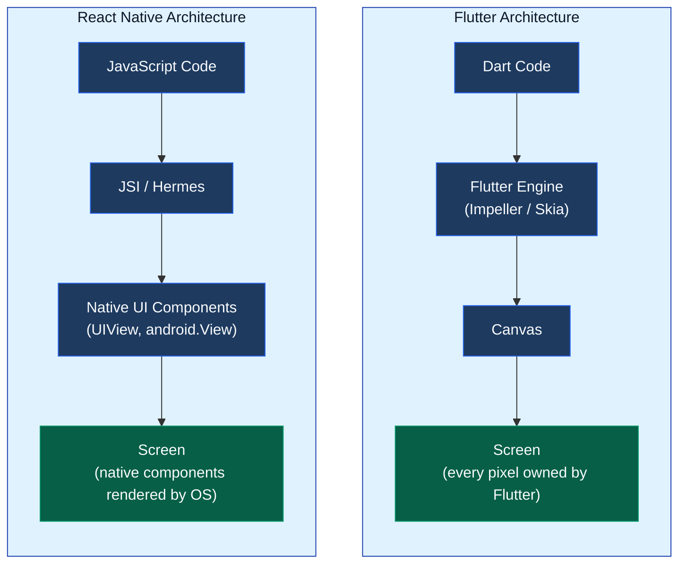

You write a few widgets in Dart, hit run, and your app shows up on both iOS and Android looking exactly the same. It feels like magic, but there is a lot happening between your code and those pixels on screen.

Understanding how Flutter works internally makes you a better mobile developer. You will know why some widgets cause performance issues, how hot reload actually preserves your state, why Flutter apps look identical across platforms, and how to debug rendering problems when they come up.

This post breaks down every layer of Flutter, from the framework you interact with daily to the C++ engine that talks to the GPU.

## Flutter Architecture Overview

Flutter is built as three distinct layers. Each layer has a clear job, and they communicate through well-defined boundaries.



Let's go through each one.

---

## The Framework Layer

This is the layer you work with every day. It is written entirely in Dart and contains everything from basic building blocks to the Material and Cupertino design libraries.

### Foundation

The foundation library provides the lowest-level utilities in the framework: animation primitives, painting helpers, and gesture recognizers. Think of it as the toolkit that the higher layers build on. If you have ever used `ChangeNotifier` or `ValueNotifier`, those come from here.

### Rendering

The rendering layer is an abstraction over layout and painting. It contains `RenderObject`, the class that actually knows how to size itself, position its children, and paint pixels. You rarely interact with this layer directly, but it is doing the heavy lifting behind every widget you write.

This layer runs a layout algorithm that is both clever and fast. Constraints flow down the tree from parent to child. Each child decides its size based on those constraints and reports geometry back up. The whole thing runs in a single pass, visiting each render object at most twice. This is why Flutter can handle thousands of widgets without slowing down.

### Widgets

The widget layer gives you all the building blocks for composing UI. Every piece of your layout, from a `Text` to a `Column` to a `GestureDetector`, is a widget. Even things that feel like properties (padding, alignment, opacity) are widgets in Flutter. This approach is called **aggressive composability**, and it is one of the reasons Flutter's API feels consistent.

Widgets are intentionally lightweight and immutable. They are descriptions of what the UI should look like, not the actual UI objects. Flutter throws them away and recreates them on every frame change. The real work happens in the Element and RenderObject trees underneath (more on that below).

### Material and Cupertino

These libraries take widgets and style them according to Google's Material Design or Apple's iOS design guidelines. When you use `ElevatedButton`, you are using a Material widget. When you use `CupertinoButton`, you are using the iOS equivalent. Both are built on the same widget and rendering primitives underneath.

---

## The Engine Layer

The engine is written in C++ and sits between your Dart code and the operating system. It handles everything the framework cannot do in Dart alone.

### Rendering Engine (Impeller and Skia)

This is where Flutter differs fundamentally from other cross-platform frameworks. Flutter does not use native UI components. It does not call `UIView` on iOS or `android.view.View` on Android. Instead, it renders every single pixel itself using a 2D graphics engine.

**Skia** was Flutter's original rendering engine. It is a battle-tested 2D graphics library also used by Chrome, Android, and Firefox. Skia works well, but it had one problem: it compiled shaders at runtime using JIT compilation. The first time a user encountered a new visual effect (a blur, a gradient, a shadow), Skia had to compile the corresponding shader on the fly. This caused visible frame drops, often called "shader compilation jank."

**Impeller** is Flutter's replacement for Skia on mobile. Its big idea is simple: compile all shaders ahead of time, at build time, not at runtime. No more first-time jank. Impeller also uses modern GPU APIs (Metal on iOS, Vulkan on Android) and supports concurrent rendering across multiple threads.

Here is how the two compare:

| | Skia | Impeller |
|---|---|---|
| **Shader compilation** | Runtime (JIT) | Build time (AOT) |
| **First-frame jank** | Yes, on new effects | No |
| **GPU APIs** | OpenGL | Metal, Vulkan |
| **Threading** | Single render thread | Multi-threaded |
| **iOS status** | Removed | Only option |
| **Android status** | Available as fallback | Default (API 29+) |





Real-world benchmarks on a Pixel 8 Pro show Impeller reducing GPU raster time by roughly 30% compared to Skia. At 120Hz refresh rates, 92% of Impeller frames met the 8.33ms deadline vs. only 67% for Skia. That is the difference between butter-smooth scrolling and noticeable stutters.

### Dart Runtime

The engine includes the Dart runtime, which executes your compiled Dart code on the device. In development, this is the Dart VM running JIT-compiled code. In production, it is a lean runtime executing AOT-compiled native code. The runtime also handles garbage collection, which uses a generational collector optimized for the short-lived objects that Flutter's widget rebuilds produce.

### Text Layout

Text rendering is surprisingly complex. The engine handles font loading, text shaping (converting characters to glyphs), line breaking, bidirectional text, and text measurement. This is done in C++ for performance because text operations happen on every single frame.

### Platform Channels

Platform channels are the communication bridge between Dart and native platform code. They allow your Flutter app to call native APIs for things like camera access, GPS, biometric authentication, or any platform-specific feature. We will cover how these work in detail later in this post.

---

## The Embedder Layer

The embedder is the platform-specific glue code that makes Flutter run on each operating system. It handles things that are inherently different across platforms:

- **App lifecycle** (foreground, background, suspended)
- **Rendering surface** (provides the canvas that the engine draws on)
- **Input events** (touch, mouse, keyboard)
- **Accessibility** (screen readers, semantic information)
- **Thread management** (setting up the threads the engine needs)

On Android, the embedder is written in Java and C++. On iOS, it is Objective-C and Swift. On desktop platforms (Windows, macOS, Linux), it is C++.

When a user opens a Flutter app, here is what happens:

1. The embedder code is the first thing that runs
2. It initializes the Flutter engine
3. It creates the rendering surface
4. It sets up the threads (UI thread, raster thread, I/O thread, platform thread)
5. The Dart runtime starts executing your compiled code

The compiled Dart code, the engine, and the embedder all get bundled into the final app binary (APK on Android, IPA on iOS).

---

## The Three-Tree System

This is the part of Flutter that most developers never see but that makes everything fast. When you write widgets, Flutter does not just build one tree. It builds three.



### Widget Tree (The Blueprint)

Widgets are the immutable descriptions of your UI. When you write `Text('Hello')`, you are creating a widget object that says "I want to display the text Hello." That is it. The widget does not know how to lay itself out or paint itself. It is just a configuration.

Because widgets are immutable, they get thrown away and recreated constantly. Call `setState()` and Flutter rebuilds the entire subtree of widgets. This sounds expensive, but it is not. Widgets are just small Dart objects. Creating them is cheap.

### Element Tree (The Manager)

The Element Tree is where the real lifecycle management happens. When Flutter first encounters a widget, it calls `createElement()` to create a corresponding element. That element lives as long as the widget's position in the tree remains valid.

When `setState()` triggers a rebuild, Flutter does not throw away the element. Instead, it compares the new widget with the old one. If the widget type and key match, Flutter updates the existing element with the new configuration. If they do not match, it removes the old element and creates a new one.

This is the same idea as React's virtual DOM diffing, but applied to a tree of elements rather than DOM nodes. The element decides the minimum amount of work needed to update the UI. If you have worked with React's reconciliation algorithm, this will feel familiar. The concept is also explained in the browser rendering section of [What Happens When You Type a URL](/what-happens-when-you-type-url-in-browser/), where the browser builds a DOM tree and diffs changes.

### RenderObject Tree (The Worker)

RenderObjects are the heavy objects. They know how to calculate their size given parent constraints, how to position their children, and how to paint themselves. Creating a new RenderObject is expensive, which is why Flutter reuses them whenever possible.

Not every widget creates a RenderObject. Only `RenderObjectWidget` subclasses do. A `Container` widget, for example, is actually a composition of several simpler widgets (Padding, DecoratedBox, ConstrainedBox), and only the leaf widgets create RenderObjects.

### Why Three Trees?

This separation is what makes Flutter fast. Widgets are cheap to create, so rebuilding them is not a problem. Elements are long-lived and handle the diffing. RenderObjects are expensive but get reused. The framework can rebuild thousands of widgets per frame while only touching a handful of RenderObjects.

---

## The Rendering Pipeline





When you call `setState()`, here is the full journey from that call to pixels on screen.



Let's break this down step by step.

### 1. Marking Dirty

When you call `setState()`, Flutter marks the corresponding element as "dirty." It does not rebuild immediately. Instead, it schedules a frame to be rendered on the next **vsync signal** (the display's refresh cycle).

If you call `setState()` multiple times before the next vsync, Flutter batches all the changes into a single rebuild. This is similar to how React batches state updates.

### 2. Build Phase

On the next vsync, Flutter walks the element tree and rebuilds only the dirty elements. Each dirty element calls its widget's `build()` method to get a new widget description. The element then compares the new widget with the old one to determine what changed.

### 3. Layout Phase

After rebuilding, Flutter runs the layout algorithm on the RenderObject tree. This is a single-pass algorithm:

- Constraints (maximum and minimum width/height) flow **down** from parent to child
- Each child decides its size based on those constraints
- Sizes flow **up** from child to parent

Because of how constraints work, each RenderObject is visited at most twice per frame. This keeps layout linear in the number of widgets, even for deeply nested trees.

### 4. Paint Phase

Once layout is done, Flutter paints each RenderObject that needs updating. Painting produces a list of draw commands (lines, rectangles, text, images) called a **display list**. Flutter does not paint directly to the screen. It builds up this list of commands.

### 5. Compositing and Rasterization

The display list is handed off to the engine (Impeller or Skia), which rasterizes it into actual pixels. Impeller handles this on a separate **raster thread** so it does not block the UI thread. The result is sent to the GPU, which composites the final image and displays it.

This whole pipeline needs to complete within 16.6ms for 60fps, or 8.33ms for 120fps. If any step takes too long, the frame gets dropped and the user sees jank.

---

## Dart Compilation: AOT vs JIT

Flutter uses two different compilation strategies, and understanding them explains a lot about how development and production differ.



### JIT Compilation (Development)

During development, your Dart code runs on the Dart Virtual Machine using JIT (Just-In-Time) compilation. The VM compiles code as it is needed, function by function. This has a few benefits:

- **Hot reload** works because the VM can accept new code and replace functions in memory without restarting
- **Debugging tools** work because the VM has full access to source maps and runtime type information
- **Startup is slower** because code gets compiled on demand

JIT mode includes extra overhead. The app binary is larger because it ships the Dart VM, and runtime performance is not as good as AOT. But none of that matters during development because the goal is fast iteration, not peak performance.

### AOT Compilation (Production)

For release builds, Flutter compiles Dart source code directly to native machine code. On mobile, this means ARM instructions. On desktop, x86_64. On web, JavaScript or WebAssembly.

AOT compilation removes the Dart VM entirely from the production app. The compiled code runs directly on the hardware, just like C or C++ code would. This gives you:

- **Faster startup** because there is no compilation step at launch
- **Better runtime performance** because the compiler can optimize the code without time pressure
- **Smaller binary** (no VM needed)
- **No hot reload** because the code is already compiled to fixed machine instructions

If you have worked with Android's compilation pipeline, this is a similar idea. Android compiles Java/Kotlin to bytecode and then converts it to native code via ART. Flutter skips the bytecode step entirely and produces native ARM code directly.

---

## How Hot Reload Works





Hot reload is one of Flutter's most useful features, and it works because of the JIT compilation setup during development. Here is what happens when you save a file:



1. **flutter_tools detects changes** since the last compilation
2. It compiles only the changed code into a delta kernel file
3. The updated source is sent to the Dart VM running on your device
4. The VM replaces only the changed functions in memory. Old code stays loaded for rollback
5. The framework reassembles all widgets, rebuilding the UI with the new code
6. Your app state (variables, scroll positions, animations) is preserved

The whole cycle takes about 300ms on a typical setup: roughly 70ms for recompilation, 100ms for VM source reload, and 110ms for reassembly.

There are cases where hot reload will not work and you need a full restart:

- Changes to `initState()` (already executed, will not re-run)
- Changes to global variables or static fields
- Changes to `main()` or the app's entry point
- Changes to enum definitions or generic types

---

## Platform Channels: Talking to Native Code

Flutter renders its own UI, but it still needs to talk to the platform for things like camera access, GPS, file system operations, or push notifications. Platform Channels handle this communication.



Here is a concrete example. Your Dart code wants to get the battery level:

```dart
// Dart side
final channel = MethodChannel('com.example/battery');
final int level = await channel.invokeMethod('getBatteryLevel');
```

On the Android side (Kotlin):

```kotlin
// Kotlin side
MethodChannel(flutterEngine.dartExecutor, "com.example/battery")
  .setMethodCallHandler { call, result ->
    if (call.method == "getBatteryLevel") {
      val level = getBatteryLevel() // call Android API
      result.success(level)
    }
  }
```

Messages are serialized using the `StandardMessageCodec`, which handles type conversion between Dart and native types (booleans, numbers, strings, lists, maps). The communication is **asynchronous**, so it never blocks the UI thread.

For projects that need a lot of native interop, the [Pigeon](https://pub.dev/packages/pigeon){:target="_blank"} package generates type-safe platform channel code from a simple schema definition. It eliminates the manual string-matching and casting.

---

## Dart Isolates and Concurrency

Dart does not have threads in the traditional sense. It has **isolates**. Each isolate has its own heap memory and event loop. Isolates cannot share memory. They can only communicate by sending messages.



By default, your entire Flutter app runs on a single isolate, the main isolate. This isolate has an event loop that processes events one at a time. Most code runs here: widget builds, network callbacks, gesture handlers.

For operations that take significant CPU time, you spawn a new isolate:

```dart
final result = await Isolate.run(() {
  // This runs on a separate isolate
  return parseHugeJsonFile(data);
});
```





Or use Flutter's convenience function:

```dart
final result = await compute(parseHugeJsonFile, data);
```

**When should you use a separate isolate?**

- Parsing large JSON files
- Image processing or compression
- Complex filtering or sorting of large datasets
- Encryption or hashing operations

The upside of the isolate model is that it eliminates race conditions entirely. Since isolates do not share memory, two isolates can never corrupt each other's state. The downside is that you need to serialize data when passing it between isolates, which adds some overhead.

If you have worked with [concurrent systems at scale](/role-of-queues-in-system-design/), you will recognize this as a message-passing architecture. It is the same idea used in systems like Erlang/OTP and Go's goroutines with channels.

---

## StatefulWidget Lifecycle

Understanding the lifecycle of a StatefulWidget helps you avoid common bugs like calling `setState()` after `dispose()`, or performing expensive work in `build()`.



| Method | Called When | Typical Use |
|--------|------------|-------------|
| `createState()` | Widget first inserted into tree | Return new State instance |
| `initState()` | State object created (once) | Initialize controllers, start listeners |
| `didChangeDependencies()` | Dependencies (InheritedWidget) change | Respond to theme/locale changes |
| `build()` | Every rebuild | Return widget tree (keep this fast) |
| `didUpdateWidget()` | Parent rebuilds with new config | Compare old/new widget, update state |
| `deactivate()` | Widget removed from tree | Clean up tree-dependent resources |
| `dispose()` | State permanently destroyed | Dispose controllers, cancel timers, close streams |

The most common mistake is doing expensive work in `build()`. That method gets called on every frame where the widget is dirty. Fetch data in `initState()`. Set up listeners in `initState()`. The `build()` method should only return widgets.

---

## Flutter vs React Native: How They Differ

Both Flutter and React Native solve the cross-platform problem, but they take fundamentally different approaches.



| Aspect | Flutter | React Native |
|--------|---------|-------------|
| **Language** | Dart | JavaScript / TypeScript |
| **UI rendering** | Custom engine draws every pixel | Uses actual native UI components |
| **Compilation** | AOT to native ARM code | JIT via Hermes (or V8) |
| **Bridge** | No bridge needed | JSI (replaced old async bridge) |
| **UI consistency** | Identical on all platforms | Looks different per platform |
| **Code reuse** | 90-95% across platforms | 70-85% across platforms |
| **Hot reload** | Sub-second (~300ms) | 1-2 seconds (Fast Refresh) |
| **Ecosystem** | Growing (pub.dev) | Mature (npm) |
| **Learning curve** | Need to learn Dart | Leverage existing JS skills |





**Flutter's advantage** is consistency and performance. Because it renders everything itself, your app looks and behaves exactly the same on iOS and Android. There is no bridge overhead, and complex animations run at a consistent 60-120fps.

**React Native's advantage** is ecosystem and hiring. JavaScript developers are abundant, npm has packages for everything, and React Native apps use actual platform components so they feel native by default.

Both frameworks have improved significantly. React Native's new architecture with JSI and Fabric eliminates the old bridge bottleneck. Flutter's Impeller engine eliminates shader jank. The gap is narrower than it was a few years ago.

---

## How Flutter Code Runs on a Device

Let's put it all together. From writing your Dart code to pixels on a user's phone, here is the complete journey:


**Build time:**

1. You write Dart code using the Flutter framework
2. The AOT compiler compiles your Dart code to native ARM code (or x86_64 for desktop, JS/Wasm for web)
3. The compiled code, along with the Flutter engine (C++) and the embedder, gets bundled into a platform-specific package (APK for Android, IPA for iOS)

**Runtime:**

4. The user installs and opens the app
5. The embedder initializes first, sets up threads, creates the rendering surface
6. The Flutter engine starts up, initializes the Dart runtime
7. Your AOT-compiled Dart code starts executing
8. Widgets are built, the three-tree system kicks in, and the rendering pipeline draws pixels to the screen at 60-120fps

If you are curious about how the Android side of packaging works (APK assembly, signing, R8 optimization), the [Android build process](/android-build-process/) post covers that in detail.

---

## Performance Tips from Flutter's Architecture

Understanding the internals gives you practical tools for writing faster Flutter apps.

### Keep build() Methods Cheap

The `build()` method runs on every frame where a widget is dirty. Do not fetch data, run computations, or create controllers here. Do that work in `initState()` and store the results.

### Use const Constructors

Widgets with `const` constructors are not recreated on rebuilds. Flutter can compare them by identity instead of value, skipping the diff entirely.

```dart
// Without const: new object created every rebuild
child: Text('Hello')

// With const: same object reused
child: const Text('Hello')
```

### Minimize RenderObject Rebuilds

Push `setState()` calls as far down the tree as possible. If only a counter label needs updating, wrap just that label in its own `StatefulWidget` instead of rebuilding the entire screen. This is similar to the idea of component-level state in React.

### Use RepaintBoundary

If part of your UI changes frequently (like an animation) but the rest stays static, wrap the animated part in a `RepaintBoundary`. This tells the engine to paint it on a separate layer, so changes there do not force a repaint of everything else.

### Offload Heavy Work to Isolates

If you are parsing JSON, processing images, or doing anything that takes more than a few milliseconds, use `Isolate.run()` or `compute()`. Blocking the main isolate causes dropped frames.

### Profile with DevTools

Flutter DevTools shows you exactly where time is spent in each frame. The timeline view breaks down build, layout, paint, and raster phases. If you see the raster thread taking too long, the problem is likely too many layers or complex paint operations. If the UI thread is slow, you are probably doing too much work in `build()`.

---

## Key Takeaways

1. **Flutter renders everything itself.** It does not use native UI components. The Impeller (or Skia) engine draws every pixel to a canvas. This is why Flutter apps look identical on every platform.

2. **Three trees make rebuilds fast.** Widgets are cheap and immutable. Elements are long-lived and handle diffing. RenderObjects are expensive and get reused. This separation lets Flutter rebuild thousands of widgets per frame without slowing down.

3. **AOT and JIT serve different purposes.** JIT compilation powers hot reload during development. AOT compilation gives you native-speed performance in production. Understanding when each is used explains why debug builds feel slower than release builds.

4. **Impeller fixed shader jank.** By pre-compiling all shaders at build time instead of runtime, Impeller eliminated the frame drops that plagued Skia on first-time effects. It is now the default on both iOS and Android.

5. **Platform channels bridge Dart and native code.** When you need camera access, GPS, or any platform-specific API, MethodChannels handle the communication asynchronously. For complex interop, use Pigeon for type-safe generated code.

6. **Isolates keep the UI responsive.** Heavy computations belong in a separate isolate. Dart's message-passing concurrency model eliminates race conditions but requires you to explicitly move expensive work off the main thread.

7. **The rendering pipeline has a strict time budget.** At 60fps, everything from `setState()` to pixels on screen needs to happen within 16.6ms. Knowing which phase is slow (build, layout, paint, raster) tells you exactly where to optimize.

---

## Further Reading

- [Flutter Architectural Overview](https://docs.flutter.dev/resources/architectural-overview){:target="_blank"} - Official documentation on Flutter's layered architecture
- [Inside Flutter](https://docs.flutter.dev/resources/inside-flutter){:target="_blank"} - Deep dive into Flutter's layout algorithm and aggressive composability
- [Impeller Rendering Engine](https://docs.flutter.dev/perf/impeller){:target="_blank"} - Official documentation on Impeller's design and status
- [Android Build Process](/android-build-process/) - How Android compiles, packages, and signs your app
- [What Happens When You Type a URL](/what-happens-when-you-type-url-in-browser/) - Another deep dive into rendering, from HTML parsing to pixels on screen
- [GitHub Actions for Android](/android-ci-cd-using-github-actions/) - Setting up CI/CD for mobile apps
- [Role of Queues in System Design](/role-of-queues-in-system-design/) - Message-passing architecture patterns that mirror Dart's isolate model
- [Gang of Four Design Patterns](/gang-of-four-design-patterns/) - Design patterns used throughout Flutter's framework
