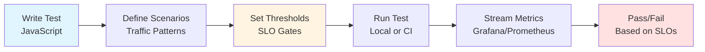
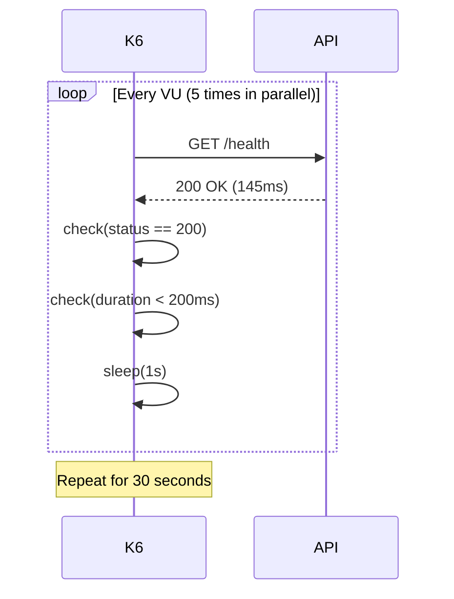

## 1. From Firefighting to Foresight

Your team just shipped a new personalization API. Marketing ran a campaign. Traffic spiked. Latency tripled. Dashboards lit up. Postmortem pain followed.

The root cause wasn’t a missing feature – it was missing **evidence**. No baseline, no capacity model, no load profile, no automated performance guardrails.

This week, you decide to change that. Enter **Grafana k6** – an open source, developer-centric performance testing tool that feels like writing integration tests, but for traffic at scale.

In this guide, we’ll rebuild performance confidence step‑by‑step – the same way a real team would.

---
## 2. Why k6?

Before diving into code, let's understand what makes k6 special:

| Need | k6 Solution |
|------|-------------|
| **Developer-friendly** | Write tests in JavaScript |
| **Shift-left testing** | Run locally, in CI, Docker, or k6 Cloud |
| **Production realism** | Model real traffic with scenarios, arrival-rate, ramping patterns |
| **Built-in validation** | Checks, thresholds, tags, custom metrics out of the box |
| **Real-time observability** | Native outputs to Prometheus, InfluxDB, Grafana |
| **CI/CD ready** | Deterministic exit codes based on SLO thresholds |
| **Extensible** | xk6 extensions for gRPC, Redis, Kafka, WebSockets, Browser testing |

**The k6 Philosophy:**



---
## 3. First Script: Baseline Request

Create `scripts/smoke.js`:

```javascript
import http from 'k6/http';
import { sleep, check } from 'k6';

export const options = {
  vus: 5,              // 5 virtual users
  duration: '30s',     // Run for 30 seconds
};

export default function () {
  const res = http.get('https://api.example.com/health');
  check(res, {
    'status is 200': r => r.status === 200,
    'response < 200ms': r => r.timings.duration < 200,
  });
  sleep(1);
}
```

**Run it:**

```bash
k6 run scripts/smoke.js
```

**What You'll See:**

```
     ✓ status is 200
     ✓ response < 200ms

     checks.........................: 100.00% ✓ 150       ✗ 0  
     http_req_duration..............: avg=145ms p(95)=178ms
     http_reqs......................: 150     5/s
     iterations.....................: 150     5/s
     vus............................: 5       min=5 max=5
```

**Understanding the Output:**

- **checks**: Your validation rules (100% pass rate = healthy)
- **http_req_duration**: Response time stats (p95 is your friend)
- **http_reqs**: Total requests and requests per second
- **iterations**: How many times each VU completed the function



**Congratulations!** You just ran your first load test. But we're not stopping here—let's add some teeth to it.

---
## 4. Add SLO Guardrails with Thresholds

Thresholds fail the test if SLOs degrade – perfect for CI.

```javascript
export const options = {
  vus: 10,
  duration: '1m',
  thresholds: {
    // Error rate must be < 1%
    http_req_failed: ['rate<0.01'],
    
    // P95 latency must be < 400ms AND average < 250ms
    http_req_duration: ['p(95)<400', 'avg<250'],
    
    // At least 99% of checks must pass
    checks: ['rate>0.99'],
  },
};
```

If violated, k6 exits with non‑zero status -> pipeline fails.

---
## 5. Realistic Scenarios: Spikes, Ramps & Constant Rate

`scenarios.js`:

```javascript
import http from 'k6/http';
import { check } from 'k6';

export const options = {
  scenarios: {
    ramp_up: {
      executor: 'ramping-vus',
      startVUs: 0,
      stages: [
        { duration: '1m', target: 50 },
        { duration: '2m', target: 50 },
        { duration: '30s', target: 0 },
      ],
      exec: 'browse',
    },
    sustained_api: {
      executor: 'constant-arrival-rate',
      rate: 100,               // requests per second
      timeUnit: '1s',
      duration: '3m',
      preAllocatedVUs: 60,
      maxVUs: 120,
      exec: 'api',
    },
    spike: {
      executor: 'per-vu-iterations',
      vus: 100,
      iterations: 1,
      gracefulStop: '30s',
      exec: 'login',
    },
  },
  thresholds: {
    'http_req_duration{type:api}': ['p(95)<500'],
    'checks{scenario:login}': ['rate>0.99'],
  },
};

export function browse () {
  http.get('https://example.com/');
}

export function api () {
  const res = http.get('https://api.example.com/v1/products');
  check(res, { '200': r => r.status === 200 });
}

export function login () {
  const payload = JSON.stringify({ user: 'test', pass: 'secret' });
  const headers = { 'Content-Type': 'application/json' };
  const res = http.post('https://api.example.com/login', payload, { headers, tags: { scenario: 'login' } });
  check(res, { 'login ok': r => r.status === 200 });
}
```

### Understanding the Three Scenarios

This test simulates three real-world traffic patterns running simultaneously:

| Scenario | What It Does | Why It Matters |
|----------|-------------|----------------|
| **ramp_up** | 0→50→50→0 users over 3.5 minutes | Tests warm-up, cache loading, connection pools |
| **sustained_api** | 100 requests/second for 3 minutes | Validates steady-state capacity and SLA compliance |
| **spike** | 100 users login simultaneously | Tests auth system under sudden traffic burst |

**Key Settings Explained:**

**1. Ramp-Up VUs (ramping-vus)**
```javascript
stages: [
  { duration: '1m', target: 50 },   // Gradual increase
  { duration: '2m', target: 50 },   // Hold steady
  { duration: '30s', target: 0 },   // Ramp down
]
```
- **Controls:** Number of virtual users
- **Use case:** Simulate gradual user growth (morning traffic, cache warm-up)
- **Example:** "Start with 0 users, grow to 50 over 1 minute, hold steady for 2 minutes"

**2. Constant Arrival Rate (constant-arrival-rate)**
```javascript
rate: 100,              // 100 requests per second
preAllocatedVUs: 60,    // Start with 60 VUs
maxVUs: 120,            // Scale up to 120 if needed
```
- **Controls:** Requests per second (RPS)
- **Use case:** Validate SLA at specific throughput
- **Example:** "Send exactly 100 requests/second regardless of response time"
- **Why it's powerful:** If your API slows down, k6 spins up more VUs to maintain the target RPS. This helps you spot when latency increases under load.

**3. Spike (per-vu-iterations)**
```javascript
vus: 100,         // 100 users
iterations: 1,    // Each runs once = instant burst
```
- **Controls:** Instant burst of users
- **Use case:** Test sudden traffic spikes (push notification, flash sale)
- **Example:** "100 users all login at exactly the same time"

---

### VUs vs. Arrival Rate: What's the Difference?

| Executor Type | What It Controls | When Latency Increases... | Best For |
|---------------|------------------|---------------------------|----------|
| **ramping-vus** | Number of concurrent users | RPS decreases | Simulating realistic user behavior |
| **constant-arrival-rate** | Requests per second (RPS) | k6 adds more VUs | SLA validation, capacity planning |
| **ramping-arrival-rate** | Gradually increase RPS | k6 adjusts VUs dynamically | Realistic ramp-up to peak RPS |

**Example Scenario:**

```javascript
// ramping-vus: "I want 50 users browsing the site"
{
  executor: 'ramping-vus',
  stages: [{ duration: '2m', target: 50 }],
}
// If API slows down: Users wait longer, RPS drops naturally

// constant-arrival-rate: "I want exactly 100 requests/second"
{
  executor: 'constant-arrival-rate',
  rate: 100,
  duration: '2m',
  preAllocatedVUs: 50,
  maxVUs: 200,
}
// If API slows down: k6 spins up more VUs to maintain 100 RPS

// ramping-arrival-rate: "Gradually increase from 10 to 100 requests/second"
{
  executor: 'ramping-arrival-rate',
  startRate: 10,
  timeUnit: '1s',
  stages: [
    { duration: '2m', target: 50 },   // Ramp to 50 RPS
    { duration: '3m', target: 100 },  // Ramp to 100 RPS
    { duration: '1m', target: 100 },  // Hold at 100 RPS
  ],
  preAllocatedVUs: 50,
  maxVUs: 200,
}
// Best of both worlds: Gradual RPS increase + fixed throughput
```

**When to Use Each:**

- **ramping-vus:** "How does my app handle growing user traffic?"
- **constant-arrival-rate:** "Can we handle 500 RPS within our SLA?"
- **ramping-arrival-rate:** "Gradually ramp to Black Friday traffic levels"
- **per-vu-iterations:** "What happens during a login storm?"

**Pro Tip:** Start with one scenario, validate it works, then add more. Don't try to build the perfect test on day one.

---
## 6. Data-Driven & Parameterized Tests

`data.js`:

```javascript
import http from 'k6/http';
import { check } from 'k6';
import { SharedArray } from 'k6/data';

const users = new SharedArray('users', () => JSON.parse(open('./users.json')));

export const options = { vus: 20, duration: '45s' };

export default function () {
  const user = users[__ITER % users.length];
  const res = http.get(`https://api.example.com/users/${user.id}`);
  check(res, { 'user fetched': r => r.status === 200 });
}
```

`users.json` example:

```json
[
  { "id": 101 },
  { "id": 102 },
  { "id": 103 }
]
```

Use environment variables for secrets:

```bash
API_BASE=https://api.example.com \
TOKEN=$(op read op://secrets/api_token) \
k6 run data.js
```

In script:
```javascript
const BASE = __ENV.API_BASE;
```

---
## 7. Checks vs Thresholds vs Assertions

| Concept | Scope | Purpose |
|--------|-------|---------|
| check() | Per response | Functional validation; contributes to `checks` metric |
| Threshold | Aggregated metric | Enforce SLOs; fails run on breach |
| Custom logic (throw) | Immediate | Hard stop for critical scenarios |

---
## 8. Custom & Trend Metrics

```javascript
import { Trend, Counter } from 'k6/metrics';

const queueDelay = new Trend('queue_delay_ms');
const authFailures = new Counter('auth_failures');

export default function () {
  const start = Date.now();
  // simulate internal queue wait
  sleep(Math.random() * 0.05);
  queueDelay.add(Date.now() - start);

  const res = http.get('https://api.example.com/auth/ping');
  if (res.status !== 200) authFailures.add(1);
}
```

Visualize custom metrics in Grafana (Prometheus / Influx pipeline described next).

---
## 9. Observability: Streaming to Grafana

### Option A: Prometheus Remote Write

Run k6 with output:
```bash
k6 run --out experimental-prometheus-rw --tag test=baseline scenarios.js \
  --address 0.0.0.0:6565 \
  -e API_BASE=https://api.example.com
```
Point to your Prometheus remote-write endpoint via env vars (`K6_PROMETHEUS_RW_SERVER_URL`).

### Option B: InfluxDB + Grafana

```bash
docker run -d --name influx -p 8086:8086 influxdb:2
export K6_INFLUXDB_ORGANIZATION=myorg
export K6_INFLUXDB_BUCKET=perf
export K6_INFLUXDB_TOKEN=secret
k6 run --out influxdb=http://localhost:8086 scenarios.js
```

Import a k6 Grafana dashboard (ID: 2587 or community variants) and correlate with application metrics.

### Correlation Workflow
1. Run k6 scenario tagged with `scenario`, `type`.
2. Use Grafana to filter: `http_req_duration{scenario="sustained_api"}`
3. Overlay with service latency & DB CPU.
4. Pin p95 regression panels.

---
## 10. GitHub Actions CI Integration

`.github/workflows/perf.yml`:

```yaml
name: performance
on:
  pull_request:
    paths: ['api/**']
  workflow_dispatch: {}

jobs:
  k6:
    runs-on: ubuntu-latest
    steps:
      - uses: actions/checkout@v4
      - name: Install k6
        uses: grafana/setup-k6-action@v1
      - name: Run smoke performance test
        run: k6 run scripts/smoke.js
      - name: Run gated scenario test
        run: |
          k6 run scenarios.js || echo "Performance regression detected" && exit 1
```

Failing thresholds stop merges: true shift‑left.

---
## 11. Scaling Beyond One Machine

| Need | Approach |
|------|----------|
| Higher concurrency | k6 Cloud (managed scaling) |
| Kubernetes-native | k6 Operator (CRDs define tests) |
| Protocol diversity | xk6 extensions (Kafka, Redis, Browser) |
| Browser + API mix | k6 Browser module (Chromium drive) |

**k6 Operator Example (CRD excerpt):**
```yaml
apiVersion: k6.io/v1alpha1
kind: K6
metadata:
  name: api-load
spec:
  parallelism: 4
  script:
    configMap:
      name: k6-script
      file: scenarios.js
```

---

## 12. Best Practices Checklist

- Start with **small smoke tests** on every PR.
- Define **SLO-aligned thresholds** (p95, error rate) early.
- Model **realistic traffic mix** (browsing vs API vs auth spike).
- Keep **scripts versioned** alongside code; treat as test artifacts.
- **Tag everything**: scenario, endpoint, version, commit SHA.
- Stream to **Grafana**; correlate with infra + APM traces.
- Use **arrival-rate executors** for RPS targets (not just VUs).
- Add **custom business metrics** (e.g., `orders_per_second`).
- Run **capacity tests** before major launches.
- Automate **regression gates** in CI.
- Periodically **refresh test data** to avoid caching distortion.

---
## 13. Resources

- [Official k6 Documentation](https://k6.io/docs/)
- [k6 Examples Repository](https://github.com/grafana/k6-examples)
- [xk6 Extensions Hub](https://github.com/grafana/xk6)
- [k6 Kubernetes Operator](https://github.com/grafana/k6-operator)
- [k6 Browser Module Guide](https://k6.io/docs/using-k6-browser/)
- [Prometheus Remote Write Output Guide](https://k6.io/docs/results-output/real-time/prometheus-remote-write/)
- [Grafana k6 Blog Articles](https://grafana.com/blog/tags/k6/)
- [Performance Test Thresholds Best Practices](https://k6.io/docs/using-k6/thresholds/)

---
**Final Thought:** Performance isn’t a phase, it’s a **habit**. k6 lets you encode that habit as code, observable data, and enforceable standards.

If you found this helpful, share it or adapt the snippets to your stack. Have a twist on these patterns? Drop a comment.
