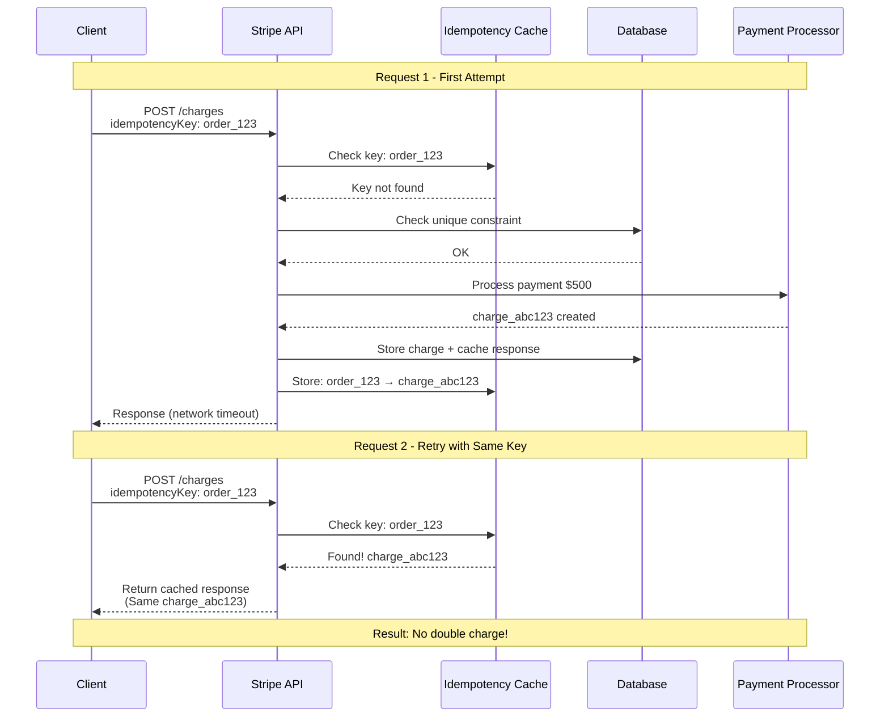
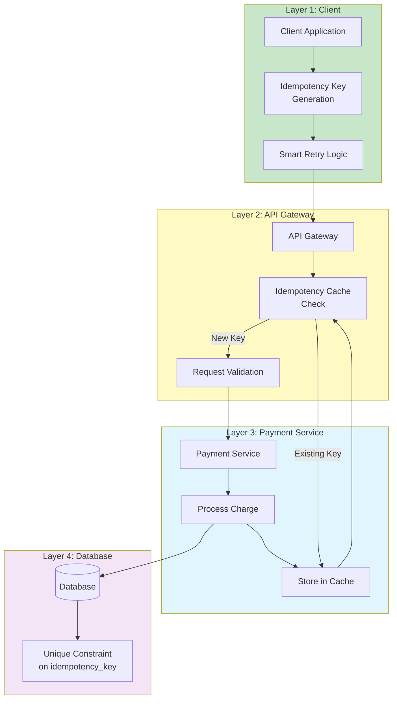

You're checking out online. Click "Pay Now". Nothing happens. Click again. Boom - charged twice.

We've all been there. But when you use Stripe, this rarely happens. Why? Because preventing double payments isn't just good UX - it's critical engineering that can make or break a business.

Let's dig into how Stripe's engineers solved this problem and what we can learn from it.

## The Problem is Real

Picture this: Your customer clicks "Buy Now" for a $500 course. Their network hiccups. They see a spinner for 10 seconds, then nothing. Naturally, they click again.

Without proper safeguards:
- Customer gets charged $1000
- You get an angry refund request  
- Your support team gets overwhelmed
- Trust in your product drops

Stripe processes billions of dollars annually. Even a 0.1% double charge rate would mean millions in customer disputes and refunds.

## How Networks Create Chaos

<div style="background: #f8f9fa; padding: 15px; border-radius: 8px; margin: 20px 0; border: 1px solid #e9ecef;">
<h3 style="margin-top: 0; color: #333; font-size: 18px;">Network Reality Check</h3>

<!-- Desktop Layout -->
<div style="display: flex; align-items: center; gap: 10px; margin: 20px 0;">
  <div style="min-width: 80px; height: 45px; background: #e3f2fd; border: 2px solid #2196f3; border-radius: 6px; display: flex; align-items: center; justify-content: center; font-weight: bold; font-size: 12px; color: #2196f3; text-align: center;">Client</div>
  
  <div style="flex: 1; position: relative; text-align: center; min-height: 50px;">
    <div style="height: 2px; background: #ddd; margin: 20px 0;"></div>
    <div style="position: absolute; top: -15px; left: 15%; background: #dc3545; color: white; padding: 3px 6px; border-radius: 3px; font-size: 10px; white-space: nowrap; transform: translateX(-50%);">Timeout</div>
    <div style="position: absolute; top: 25px; left: 70%; background: #dc3545; color: white; padding: 3px 6px; border-radius: 3px; font-size: 9px; white-space: nowrap; transform: translateX(-50%);">Connection Lost</div>
    <div style="margin-top: 10px; font-size: 11px; color: #666;">Network Issues</div>
  </div>
  
  <div style="min-width: 80px; height: 45px; background: #e8f5e8; border: 2px solid #28a745; border-radius: 6px; display: flex; align-items: center; justify-content: center; font-weight: bold; font-size: 12px; color: #28a745; text-align: center;">Stripe API</div>
</div>

<!-- Mobile Layout (Hidden on Desktop, Visible on Mobile) -->
<div style="display: none;">
  <div style="text-align: center; margin: 15px 0;">
    <div style="display: inline-block; width: 100px; height: 40px; background: #e3f2fd; border: 2px solid #2196f3; border-radius: 6px; display: flex; align-items: center; justify-content: center; font-weight: bold; font-size: 12px; color: #2196f3;">Client</div>
    <div style="margin: 10px 0; font-size: 12px; color: #666;">↓ Request</div>
    <div style="background: #dc3545; color: white; padding: 4px 8px; border-radius: 3px; font-size: 11px; margin: 5px; display: inline-block;">Network Timeout</div>
    <div style="background: #dc3545; color: white; padding: 4px 8px; border-radius: 3px; font-size: 11px; margin: 5px; display: inline-block;">Connection Lost</div>
    <div style="margin: 10px 0; font-size: 12px; color: #666;">↓ Issues</div>
    <div style="display: inline-block; width: 100px; height: 40px; background: #e8f5e8; border: 2px solid #28a745; border-radius: 6px; display: flex; align-items: center; justify-content: center; font-weight: bold; font-size: 12px; color: #28a745;">Stripe API</div>
  </div>
</div>

<div style="background: #fff3cd; border: 1px solid #ffeaa7; border-radius: 4px; padding: 12px; margin: 15px 0;">
  <strong style="color: #856404;">Reality Check:</strong> <span style="color: #856404;">Networks fail, connections drop, timeouts happen. Your payment system must handle this gracefully.</span>
</div>

<style>
@media (max-width: 768px) {
  .network-desktop { display: none !important; }
  .network-mobile { display: block !important; }
}
</style>
</div>

Here's what happens in the real world:

1. **Request sent** - Payment API call goes out
2. **Processing happens** - Stripe charges the card successfully  
3. **Response lost** - Network drops before client gets confirmation
4. **Client retries** - Sees no response, assumes failure, tries again
5. **Double charge** - Second request goes through

The tricky part? The first payment actually succeeded, but the client never knew.

## Stripe's Three-Layer Defense

Stripe doesn't rely on one solution. They use multiple layers of protection:

### Layer 1: Idempotency Keys

This is the star of the show. Every Stripe API request can include an idempotency key:

```javascript
// First request - goes through
await stripe.charges.create({
  amount: 500,
  currency: 'usd',
  source: 'tok_visa'
}, {
  idempotencyKey: 'order_12345_attempt_1'
});

// Retry with same key - returns cached result
await stripe.charges.create({
  amount: 500,
  currency: 'usd', 
  source: 'tok_visa'
}, {
  idempotencyKey: 'order_12345_attempt_1'  // Same key!
});
```

Here's exactly what happens step by step:

<div style="background: #f8f9fa; padding: 20px; border-radius: 8px; margin: 20px 0;">
<style>
  @media (max-width: 768px) {
    .mobile-idempotency-grid {
      grid-template-columns: 1fr !important;
      gap: 15px !important;
    }
    .mobile-idempotency-card {
      padding: 12px !important;
    }
    .mobile-idempotency-header {
      padding: 6px !important;
      font-size: 14px !important;
      margin: -12px -12px 8px !important;
    }
    .mobile-idempotency-content {
      font-size: 12px !important;
      margin: 4px 0 !important;
    }
    .mobile-idempotency-action {
      padding: 6px !important;
      font-size: 11px !important;
      margin-top: 8px !important;
    }
    .mobile-idempotency-detail {
      font-size: 10px !important;
      margin-top: 6px !important;
    }
    .mobile-idempotency-code {
      padding: 6px !important;
      font-size: 9px !important;
    }
  }
</style>

<h4 style="margin-top: 0;">Idempotency Flow: Step by Step</h4>

<div class="mobile-idempotency-grid" style="display: grid; grid-template-columns: 1fr 1fr 1fr; gap: 15px; margin: 20px 0;">
  
  <!-- Request 1 -->
  <div class="mobile-idempotency-card" style="background: white; border: 1px solid #ddd; border-radius: 6px; padding: 15px;">
    <div class="mobile-idempotency-header" style="background: #4caf50; color: white; padding: 8px; text-align: center; margin: -15px -15px 10px; border-radius: 6px 6px 0 0; font-weight: bold;">Request 1</div>
    <div class="mobile-idempotency-content" style="font-size: 13px; margin: 5px 0;"><strong>Key:</strong> order_12345_attempt_1</div>
    <div class="mobile-idempotency-content" style="font-size: 13px; margin: 5px 0;"><strong>Amount:</strong> $500</div>
    <div class="mobile-idempotency-action" style="background: #e8f5e8; padding: 8px; border-radius: 4px; text-align: center; font-size: 12px; margin-top: 10px;">✓ Process Payment</div>
    <div class="mobile-idempotency-detail" style="font-size: 11px; color: #666; margin-top: 8px; text-align: center;">Creates charge_abc123</div>
  </div>

  <!-- Database -->
  <div class="mobile-idempotency-card" style="background: white; border: 1px solid #ddd; border-radius: 6px; padding: 15px;">
    <div class="mobile-idempotency-header" style="background: #2196f3; color: white; padding: 8px; text-align: center; margin: -15px -15px 10px; border-radius: 6px 6px 0 0; font-weight: bold;">Database</div>
    <div class="mobile-idempotency-content" style="font-size: 12px; margin: 5px 0;">idempotency_keys</div>
    <div class="mobile-idempotency-code" style="background: #f5f5f5; padding: 8px; border-radius: 4px; font-family: monospace; font-size: 10px;">
      order_12345_attempt_1<br>
      ↓<br>
      charge_id: charge_abc123<br>
      status: succeeded<br>
      response: {cached}
    </div>
  </div>

  <!-- Request 2 -->
  <div class="mobile-idempotency-card" style="background: white; border: 1px solid #ddd; border-radius: 6px; padding: 15px;">
    <div class="mobile-idempotency-header" style="background: #ff9800; color: white; padding: 8px; text-align: center; margin: -15px -15px 10px; border-radius: 6px 6px 0 0; font-weight: bold;">Request 2</div>
    <div class="mobile-idempotency-content" style="font-size: 13px; margin: 5px 0;"><strong>Key:</strong> order_12345_attempt_1</div>
    <div class="mobile-idempotency-content" style="font-size: 13px; margin: 5px 0;"><strong>Amount:</strong> $500</div>
    <div class="mobile-idempotency-action" style="background: #fff3e0; padding: 8px; border-radius: 4px; text-align: center; font-size: 12px; margin-top: 10px;">↩ Return Cached Result</div>
    <div class="mobile-idempotency-detail" style="font-size: 11px; color: #666; margin-top: 8px; text-align: center;">Returns charge_abc123</div>
  </div>

</div>

<div style="background: #e3f2fd; padding: 15px; border-radius: 6px; border-left: 4px solid #2196f3;">
<strong>What happens here:</strong><br>
1. <strong>Request 1:</strong> Stripe sees new idempotency key → processes payment → stores result<br>
2. <strong>Database:</strong> Maps key to charge ID and caches the full response<br>
3. <strong>Request 2:</strong> Stripe sees existing key → skips processing → returns cached response<br><br>
<em>Result: Same charge object returned, no double payment!</em>
</div>

</div>

**Key insight**: The idempotency key acts like a unique fingerprint. If Stripe sees the same key twice, it returns the original result instead of processing again.



### Layer 2: Database Constraints

Even if idempotency keys fail, database-level constraints provide backup:

```sql
-- Unique constraint prevents duplicate charges
CREATE TABLE charges (
    id VARCHAR(255) PRIMARY KEY,
    idempotency_key VARCHAR(255) UNIQUE NOT NULL,
    amount INTEGER NOT NULL,
    currency VARCHAR(3) NOT NULL,
    created_at TIMESTAMP DEFAULT NOW(),
    UNIQUE INDEX idx_idempotency_key (idempotency_key)
);
```

If someone bypasses the application logic, the database will reject the duplicate:

```sql
-- First insert: Success
INSERT INTO charges (id, idempotency_key, amount, currency) 
VALUES ('ch_123', 'order_456', 500, 'usd');

-- Second insert with same key: ERROR
INSERT INTO charges (id, idempotency_key, amount, currency) 
VALUES ('ch_124', 'order_456', 500, 'usd');
-- Error: Duplicate entry 'order_456' for key 'idx_idempotency_key'
```

### Layer 3: Smart Retry Logic

Stripe's clients are built to handle retries intelligently. But not all failures should be retried - this is where smart logic comes in.

**When to Retry:**
- Network timeouts or connection errors
- Temporary server errors (5xx status codes)
- Rate limiting errors (when told to wait and retry)

**When NOT to Retry:**
- Card declined (the card simply doesn't have funds)
- Invalid request data (malformed payload)
- Authentication failures (wrong API key)
- Business logic errors (trying to charge $0)

**The Smart Approach:**

Instead of blindly retrying every failure, Stripe's system:

1. **Categorizes Errors**: Distinguishes between temporary network issues and permanent business failures
2. **Uses Exponential Backoff**: Waits 1 second, then 2 seconds, then 4 seconds between retries to avoid overwhelming servers
3. **Limits Retry Attempts**: Typically 3 attempts maximum to prevent infinite loops
4. **Preserves Idempotency**: Uses the same idempotency key across all retry attempts

**Real-World Example:**

Your customer clicks "Pay". The request times out after 30 seconds. Your frontend sees no response and assumes failure. Instead of immediately retrying, smart logic:

- Waits 1 second (maybe it was just a brief network hiccup)
- Retries with the same idempotency key
- If it fails again, waits 2 seconds
- Final retry after 4 seconds
- If all attempts fail, shows a meaningful error message

This prevents the "rapid-fire clicking" problem where frustrated users click the pay button 10 times in a row.


## The Architecture in Action

Here's how all three layers work together:



<div style="background: #f8f9fa; padding: 25px; border-radius: 8px; margin: 25px 0; border: 1px solid #e9ecef;">
<style>
  @media (max-width: 768px) {
    .mobile-arch-grid {
      grid-template-columns: repeat(2, 1fr) !important;
      gap: 10px !important;
    }
    .mobile-arch-component {
      padding: 12px !important;
      font-size: 14px !important;
    }
    .mobile-arch-title {
      font-size: 13px !important;
      margin-bottom: 8px !important;
    }
    .mobile-arch-feature {
      padding: 6px !important;
      font-size: 10px !important;
      margin: 4px 0 !important;
    }
    .mobile-arch-steps {
      display: flex !important;
      flex-wrap: wrap !important;
      justify-content: center !important;
      gap: 8px !important;
    }
    .mobile-arch-step-connector {
      display: none !important;
    }
    .mobile-flow-grid {
      grid-template-columns: repeat(2, 1fr) !important;
      gap: 10px !important;
      font-size: 11px !important;
    }
    .mobile-flow-step {
      margin-bottom: 3px !important;
    }
  }
  @media (max-width: 480px) {
    .mobile-arch-grid {
      grid-template-columns: 1fr !important;
    }
    .mobile-flow-grid {
      grid-template-columns: 1fr !important;
    }
  }
</style>

<h4 style="margin-top: 0; text-align: center; color: #333;">Stripe's Multi-Layer Defense System</h4>

<!-- Step flow -->
<div style="display: flex; justify-content: center; margin-bottom: 25px;">
  <div class="mobile-arch-steps" style="display: flex; align-items: center; gap: 15px;">
    <div style="background: #4CAF50; color: white; width: 24px; height: 24px; border-radius: 50%; display: flex; align-items: center; justify-content: center; font-weight: bold; font-size: 12px;">1</div>
    <div class="mobile-arch-step-connector" style="width: 30px; height: 2px; background: #ddd;"></div>
    <div style="background: #FF9800; color: white; width: 24px; height: 24px; border-radius: 50%; display: flex; align-items: center; justify-content: center; font-weight: bold; font-size: 12px;">2</div>
    <div class="mobile-arch-step-connector" style="width: 30px; height: 2px; background: #ddd;"></div>
    <div style="background: #2196F3; color: white; width: 24px; height: 24px; border-radius: 50%; display: flex; align-items: center; justify-content: center; font-weight: bold; font-size: 12px;">3</div>
    <div class="mobile-arch-step-connector" style="width: 30px; height: 2px; background: #ddd;"></div>
    <div style="background: #9C27B0; color: white; width: 24px; height: 24px; border-radius: 50%; display: flex; align-items: center; justify-content: center; font-weight: bold; font-size: 12px;">4</div>
  </div>
</div>

<!-- Main components -->
<div class="mobile-arch-grid" style="display: grid; grid-template-columns: repeat(4, 1fr); gap: 20px; margin: 20px 0;">
  
  <!-- Client -->
  <div class="mobile-arch-component" style="background: white; border: 2px solid #4CAF50; border-radius: 8px; padding: 18px; text-align: center;">
    <div class="mobile-arch-title" style="font-weight: bold; color: #4CAF50; margin-bottom: 12px; font-size: 16px;">CLIENT</div>
    <div class="mobile-arch-feature" style="background: #f1f8e9; padding: 8px; border-radius: 4px; margin: 6px 0; font-size: 12px; color: #333;">Payment Request</div>
    <div class="mobile-arch-feature" style="background: #f1f8e9; padding: 8px; border-radius: 4px; margin: 6px 0; font-size: 12px; color: #333;">Idempotency Key</div>
    <div class="mobile-arch-feature" style="background: #f1f8e9; padding: 8px; border-radius: 4px; margin: 6px 0; font-size: 12px; color: #333;">Smart Retry</div>
  </div>

  <!-- API Gateway -->
  <div class="mobile-arch-component" style="background: white; border: 2px solid #FF9800; border-radius: 8px; padding: 18px; text-align: center;">
    <div class="mobile-arch-title" style="font-weight: bold; color: #FF9800; margin-bottom: 12px; font-size: 16px;">API GATEWAY</div>
    <div class="mobile-arch-feature" style="background: #fff8e1; padding: 8px; border-radius: 4px; margin: 6px 0; font-size: 12px; color: #333;">Check Cache</div>
    <div class="mobile-arch-feature" style="background: #fff8e1; padding: 8px; border-radius: 4px; margin: 6px 0; font-size: 12px; color: #333;">Validate Request</div>
    <div class="mobile-arch-feature" style="background: #fff8e1; padding: 8px; border-radius: 4px; margin: 6px 0; font-size: 12px; color: #333;">Route to Service</div>
  </div>

  <!-- Payment Service -->
  <div class="mobile-arch-component" style="background: white; border: 2px solid #2196F3; border-radius: 8px; padding: 18px; text-align: center;">
    <div class="mobile-arch-title" style="font-weight: bold; color: #2196F3; margin-bottom: 12px; font-size: 16px;">PAYMENT SERVICE</div>
    <div class="mobile-arch-feature" style="background: #e3f2fd; padding: 8px; border-radius: 4px; margin: 6px 0; font-size: 12px; color: #333;">Check Idempotency</div>
    <div class="mobile-arch-feature" style="background: #e3f2fd; padding: 8px; border-radius: 4px; margin: 6px 0; font-size: 12px; color: #333;">Process Charge</div>
    <div class="mobile-arch-feature" style="background: #e3f2fd; padding: 8px; border-radius: 4px; margin: 6px 0; font-size: 12px; color: #333;">Store Result</div>
  </div>

  <!-- Database -->
  <div class="mobile-arch-component" style="background: white; border: 2px solid #9C27B0; border-radius: 8px; padding: 18px; text-align: center;">
    <div class="mobile-arch-title" style="font-weight: bold; color: #9C27B0; margin-bottom: 12px; font-size: 16px;">DATABASE</div>
    <div class="mobile-arch-feature" style="background: #f3e5f5; padding: 8px; border-radius: 4px; margin: 6px 0; font-size: 12px; color: #333;">Unique Constraints</div>
    <div class="mobile-arch-feature" style="background: #f3e5f5; padding: 8px; border-radius: 4px; margin: 6px 0; font-size: 12px; color: #333;">Transaction Logs</div>
    <div class="mobile-arch-feature" style="background: #f3e5f5; padding: 8px; border-radius: 4px; margin: 6px 0; font-size: 12px; color: #333;">Cached Responses</div>
  </div>

</div>

<!-- Flow explanation -->
<div style="background: #ffffff; border: 1px solid #e9ecef; border-radius: 6px; padding: 20px; margin: 20px 0;">
  <div style="text-align: center; margin-bottom: 15px;">
    <h5 style="color: #333; margin: 0;">How the Request Flows</h5>
  </div>
  <div class="mobile-flow-grid" style="display: grid; grid-template-columns: repeat(4, 1fr); gap: 15px; font-size: 13px; color: #555;">
    <div style="text-align: center;">
      <div class="mobile-flow-step" style="font-weight: bold; margin-bottom: 5px; color: #4CAF50;">Step 1</div>
      <div>Client sends payment request with unique idempotency key</div>
    </div>
    <div style="text-align: center;">
      <div class="mobile-flow-step" style="font-weight: bold; margin-bottom: 5px; color: #FF9800;">Step 2</div>
      <div>Gateway validates request and checks for cached response</div>
    </div>
    <div style="text-align: center;">
      <div class="mobile-flow-step" style="font-weight: bold; margin-bottom: 5px; color: #2196F3;">Step 3</div>
      <div>Service checks idempotency and processes if new</div>
    </div>
    <div style="text-align: center;">
      <div class="mobile-flow-step" style="font-weight: bold; margin-bottom: 5px; color: #9C27B0;">Step 4</div>
      <div>Database enforces constraints and caches result</div>
    </div>
  </div>
</div>

<div style="text-align: center; color: #666; font-size: 14px; margin-top: 15px;">
  <strong>Defense in Depth:</strong> Multiple layers ensure no single point of failure
</div>

</div>

## The Business Impact

Why does this matter beyond preventing double charges?

**Customer Trust**: Users know their payments are safe. They're more likely to complete purchases and return.

**Support Cost**: Fewer duplicate charge complaints means your support team can focus on real issues.

**Compliance**: Financial regulations often require preventing duplicate transactions.

**Scale**: As your business grows, network issues become more frequent. These patterns keep you reliable at scale.

## Key Takeaways

Stripe's approach teaches us:

1. **Defense in depth works** - Don't rely on one solution
2. **Make idempotency keys mandatory** - Treat them as first-class citizens in your API design  
3. **Database constraints are your safety net** - They catch what application logic misses
4. **Smart retries are better than dumb retries** - Know when to give up
5. **Cache responses** - Returning the same result for duplicate requests is faster than processing twice

---

*Want to dive deeper? Check out [Stripe's API documentation](https://stripe.com/docs/api/idempotent_requests) on idempotent requests. Their engineering blog also has great posts on building reliable financial systems.*
