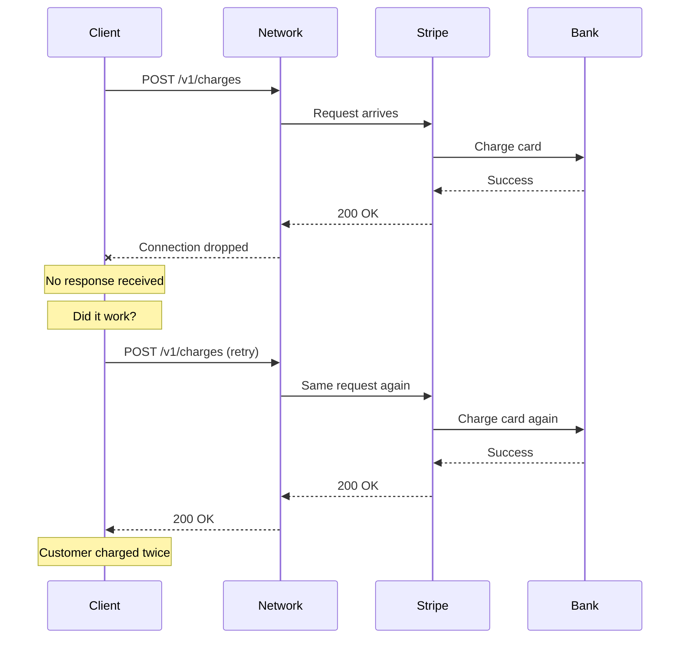
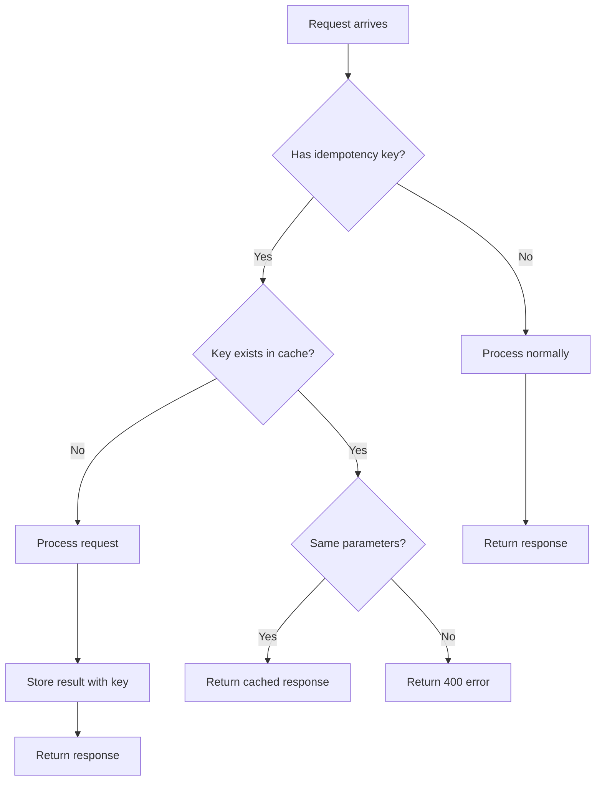
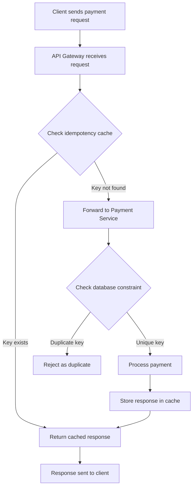
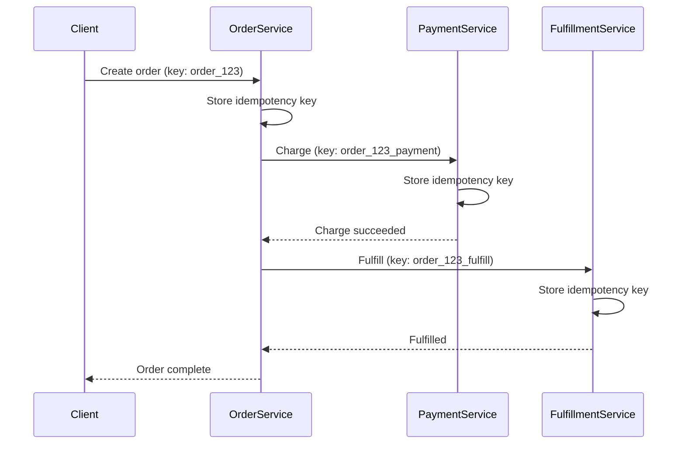

You are testing your payment integration. You send a charge request with `tok_visa`, your test token. The request times out. You are not sure if it went through. You send it again.

Now your test account shows two charges.

This is the duplicate payment problem. It happens in production too, and when real money is involved, it creates angry customers and support tickets.

Stripe processes billions of dollars in payments. They cannot afford duplicate charges. So they built a system to prevent them. Understanding how it works will make you a better developer, whether you use Stripe or build your own payment system.

## Why Duplicate Payments Happen

Networks are unreliable. This is the fundamental problem.

When you make a payment request, several things can go wrong:



The payment succeeded. The card was charged. But the response never made it back to your server. From your perspective, the request failed. So you retry. And now the customer is charged twice.

This is not a rare edge case. It happens constantly:

- Mobile users on flaky connections
- Servers restarting during deployments
- Load balancers timing out slow requests
- DNS issues causing connection failures

Any system that makes network requests needs to handle this problem.

## Stripe Idempotency Keys: The Core Solution

Stripe solves this with idempotency keys. An idempotency key is a unique string you include with your request. If Stripe receives the same key twice, it returns the result from the first request instead of processing the payment again.

Here is how it works:

```javascript
const stripe = require('stripe')('sk_test_...');

// Generate a unique key for this payment
const idempotencyKey = 'order_12345_payment_v1';

// First request
const charge = await stripe.charges.create({
  amount: 2000,
  currency: 'usd',
  source: 'tok_visa',
  description: 'Order #12345'
}, {
  idempotencyKey: idempotencyKey
});

console.log(charge.id); // ch_1abc...

// Network fails, you retry with the same key
const retryCharge = await stripe.charges.create({
  amount: 2000,
  currency: 'usd',
  source: 'tok_visa',
  description: 'Order #12345'
}, {
  idempotencyKey: idempotencyKey  // Same key
});

console.log(retryCharge.id); // ch_1abc... (same charge!)
```

The second request returns the same charge object. No duplicate payment.

### How Stripe Processes Idempotent Requests

When a request arrives with an idempotency key, Stripe follows this logic:



The key points:

1. **New key**: Process the request, store the result, return the response
2. **Existing key, same parameters**: Return the cached response without processing
3. **Existing key, different parameters**: Return an error (this is a bug in your code)

### The 24 Hour Window

Stripe stores idempotency keys for 24 hours. This is a practical tradeoff:

- **Long enough** to handle retries during extended outages
- **Short enough** to not consume infinite storage
- **Predictable** so you know when keys expire

After 24 hours, using the same key will process the request as new. For most applications, this is fine. If your system might retry after 24 hours, you need additional safeguards at your application layer.

## Implementing Idempotency in Different Languages

Here are practical examples for common languages. All examples use `tok_visa` for testing.

### Python

```python
import stripe
import uuid

stripe.api_key = 'sk_test_...'

def create_payment(order_id: str, amount: int) -> stripe.Charge:
    """Create a payment with idempotency protection."""
    
    # Generate a key tied to this specific order and amount
    idempotency_key = f"order_{order_id}_amount_{amount}"
    
    try:
        charge = stripe.Charge.create(
            amount=amount,
            currency='usd',
            source='tok_visa',
            description=f'Payment for order {order_id}',
            idempotency_key=idempotency_key
        )
        return charge
    except stripe.error.IdempotencyError as e:
        # Same key was used with different parameters
        # This indicates a bug in your code
        raise ValueError(f"Idempotency conflict: {e}")
    except stripe.error.StripeError as e:
        # Other Stripe errors - safe to retry with same key
        raise

# Usage
charge = create_payment("12345", 2000)
print(f"Charge created: {charge.id}")

# Safe to call again - returns same charge
charge_retry = create_payment("12345", 2000)
print(f"Same charge: {charge_retry.id}")
```

### Node.js

```javascript
const Stripe = require('stripe');
const stripe = Stripe('sk_test_...');

async function createPayment(orderId, amount) {
  // Key includes order ID and amount to prevent accidental reuse
  const idempotencyKey = `order_${orderId}_amount_${amount}`;
  
  try {
    const charge = await stripe.charges.create({
      amount: amount,
      currency: 'usd',
      source: 'tok_visa',
      description: `Payment for order ${orderId}`
    }, {
      idempotencyKey: idempotencyKey
    });
    
    return charge;
  } catch (error) {
    if (error.type === 'IdempotencyError') {
      // Same key used with different parameters
      throw new Error(`Idempotency conflict: ${error.message}`);
    }
    throw error;
  }
}

// Usage
const charge = await createPayment('12345', 2000);
console.log(`Charge: ${charge.id}`);

// Retry returns same charge
const retry = await createPayment('12345', 2000);
console.log(`Same: ${retry.id}`);
```

### Go

```go
package main

import (
    "fmt"
    "github.com/stripe/stripe-go/v74"
    "github.com/stripe/stripe-go/v74/charge"
)

func createPayment(orderID string, amount int64) (*stripe.Charge, error) {
    stripe.Key = "sk_test_..."
    
    // Build idempotency key from order details
    idempotencyKey := fmt.Sprintf("order_%s_amount_%d", orderID, amount)
    
    params := &stripe.ChargeParams{
        Amount:      stripe.Int64(amount),
        Currency:    stripe.String(string(stripe.CurrencyUSD)),
        Description: stripe.String(fmt.Sprintf("Payment for order %s", orderID)),
    }
    params.SetSource("tok_visa")
    params.SetIdempotencyKey(idempotencyKey)
    
    ch, err := charge.New(params)
    if err != nil {
        return nil, err
    }
    
    return ch, nil
}

func main() {
    ch, err := createPayment("12345", 2000)
    if err != nil {
        panic(err)
    }
    fmt.Printf("Charge: %s\n", ch.ID)
    
    // Retry returns same charge
    retry, _ := createPayment("12345", 2000)
    fmt.Printf("Same: %s\n", retry.ID)
}
```

### cURL (for testing)

```bash
# First request
curl https://api.stripe.com/v1/charges \
  -u sk_test_your_key: \
  -H "Idempotency-Key: order_12345_v1" \
  -d amount=2000 \
  -d currency=usd \
  -d source=tok_visa \
  -d description="Order 12345"

# Retry with same key returns same result
curl https://api.stripe.com/v1/charges \
  -u sk_test_your_key: \
  -H "Idempotency-Key: order_12345_v1" \
  -d amount=2000 \
  -d currency=usd \
  -d source=tok_visa \
  -d description="Order 12345"
```

## Beyond Idempotency Keys: Defense in Depth

Idempotency keys are the first line of defense. But Stripe uses multiple layers to prevent duplicate payments.

### Layer 1: Idempotency Keys (API Level)

The idempotency cache catches duplicate requests at the API gateway. Fast, simple, and handles most cases.

### Layer 2: Database Constraints

Even if the idempotency cache fails, the database prevents duplicates:

```sql
CREATE TABLE payments (
    id VARCHAR(255) PRIMARY KEY,
    idempotency_key VARCHAR(255) UNIQUE NOT NULL,
    amount INTEGER NOT NULL,
    currency VARCHAR(3) NOT NULL,
    status VARCHAR(50) NOT NULL,
    created_at TIMESTAMP DEFAULT CURRENT_TIMESTAMP,
    
    CONSTRAINT uk_idempotency_key UNIQUE (idempotency_key)
);
```

If you try to insert two payments with the same idempotency key, the database rejects the second one:

```sql
-- First insert succeeds
INSERT INTO payments (id, idempotency_key, amount, currency, status)
VALUES ('ch_abc', 'order_123', 2000, 'usd', 'succeeded');

-- Second insert fails
INSERT INTO payments (id, idempotency_key, amount, currency, status)
VALUES ('ch_def', 'order_123', 2000, 'usd', 'succeeded');
-- ERROR: Duplicate entry 'order_123' for key 'uk_idempotency_key'
```

This is your safety net. Even if there is a bug in the application logic, the database catches it.

### Layer 3: Smart Retry Logic

Not all errors should trigger a retry. Stripe categorizes errors and only retries when appropriate:

<div style="background: #f8f9fa; border-radius: 8px; padding: 20px; margin: 20px 0;">

<h4 style="margin-top: 0; display: flex; align-items: center; gap: 8px;">
<i class="fas fa-check-circle" style="color: #28a745;"></i> Safe to Retry
</h4>

<ul style="margin-bottom: 20px;">
<li>Network timeout (request may not have arrived)</li>
<li>Connection reset (server did not respond)</li>
<li>5xx errors (server had a temporary problem)</li>
<li>Rate limiting (wait and try again)</li>
</ul>

<h4 style="display: flex; align-items: center; gap: 8px;">
<i class="fas fa-times-circle" style="color: #dc3545;"></i> Do Not Retry
</h4>

<ul style="margin-bottom: 0;">
<li>Card declined (the card does not have funds)</li>
<li>Invalid card number (the input is wrong)</li>
<li>Authentication required (needs 3D Secure)</li>
<li>Invalid API key (configuration error)</li>
</ul>

</div>

Retrying a card decline will not magically add money to the card. It will just annoy the customer.

Here is how to implement smart retry logic:

```python
import time
import stripe

def create_payment_with_retry(order_id: str, amount: int, max_retries: int = 3):
    """Create payment with exponential backoff retry."""
    
    idempotency_key = f"order_{order_id}_amount_{amount}"
    
    for attempt in range(max_retries):
        try:
            return stripe.Charge.create(
                amount=amount,
                currency='usd',
                source='tok_visa',
                idempotency_key=idempotency_key
            )
        except stripe.error.RateLimitError:
            # Rate limited - wait and retry
            wait_time = (2 ** attempt) + 1  # Exponential backoff
            time.sleep(wait_time)
            continue
        except stripe.error.APIConnectionError:
            # Network error - safe to retry
            wait_time = (2 ** attempt) + 1
            time.sleep(wait_time)
            continue
        except stripe.error.CardError as e:
            # Card was declined - do not retry
            raise
        except stripe.error.InvalidRequestError as e:
            # Bad request - do not retry
            raise
    
    raise Exception(f"Failed after {max_retries} attempts")
```

## The Architecture

Here is how the three layers work together:



**How the layers protect you:**

| Layer | What it does | When it helps |
|-------|--------------|---------------|
| Idempotency Cache | Returns stored response for duplicate keys | Fast path for retries |
| Database Constraint | Rejects duplicate idempotency keys | Safety net if cache fails |
| Smart Retry Logic | Only retries appropriate errors | Prevents unnecessary duplicates |

Each layer catches what the previous layer might miss:

| Layer | Catches | Speed | Reliability |
|-------|---------|-------|-------------|
| Idempotency Cache | Most duplicates | Fast (ms) | Depends on cache |
| Database Constraints | Cache failures | Medium | Very high |
| Retry Logic | Inappropriate retries | N/A | Prevents issues |

## Generating Good Idempotency Keys

The quality of your idempotency keys matters. Bad keys cause problems.

### Good Patterns

```javascript
// Pattern 1: UUID (simple, always unique)
const key = crypto.randomUUID();
// "550e8400-e29b-41d4-a716-446655440000"

// Pattern 2: Order ID + version (traceable)
const key = `order_${orderId}_v${version}`;
// "order_12345_v1"

// Pattern 3: User + action + timestamp window (prevents rapid duplicates)
const window = Math.floor(Date.now() / 60000); // 1 minute window
const key = `user_${userId}_checkout_${window}`;
// "user_789_checkout_29574832"
```

### Bad Patterns

```javascript
// Bad: Just the order ID (what if order is modified and repaid?)
const key = `order_${orderId}`;

// Bad: Timestamp alone (two requests in same ms = collision)
const key = `${Date.now()}`;

// Bad: Random on every request (defeats the purpose)
const key = Math.random().toString();
```

### Key Storage

You need to store the idempotency key so retries use the same one:

```python
class PaymentService:
    def __init__(self, cache):
        self.cache = cache
    
    def get_or_create_idempotency_key(self, order_id: str) -> str:
        """Get existing key or create new one."""
        
        cache_key = f"idempotency:order:{order_id}"
        
        # Try to get existing key
        existing = self.cache.get(cache_key)
        if existing:
            return existing
        
        # Create new key and store it
        new_key = f"order_{order_id}_{uuid.uuid4()}"
        self.cache.set(cache_key, new_key, ttl=86400)  # 24 hours
        
        return new_key
    
    def create_payment(self, order_id: str, amount: int):
        key = self.get_or_create_idempotency_key(order_id)
        
        return stripe.Charge.create(
            amount=amount,
            currency='usd',
            source='tok_visa',
            idempotency_key=key
        )
```

## Common Mistakes and How to Avoid Them

### Mistake 1: Generating New Keys on Retry

```python
# Wrong: New key on every attempt defeats the purpose
for attempt in range(3):
    key = str(uuid.uuid4())  # New key each time!
    try:
        stripe.Charge.create(..., idempotency_key=key)
    except:
        continue

# Right: Same key across all attempts
key = str(uuid.uuid4())  # Generate once
for attempt in range(3):
    try:
        stripe.Charge.create(..., idempotency_key=key)
    except:
        continue
```

### Mistake 2: Reusing Keys for Different Operations

```python
# Wrong: Same key for different customers
key = "payment_key"
stripe.Charge.create(amount=1000, customer="cus_alice", idempotency_key=key)
stripe.Charge.create(amount=2000, customer="cus_bob", idempotency_key=key)  # Error!

# Right: Unique key per operation
stripe.Charge.create(amount=1000, customer="cus_alice", 
                     idempotency_key="alice_order_123")
stripe.Charge.create(amount=2000, customer="cus_bob", 
                     idempotency_key="bob_order_456")
```

### Mistake 3: Not Handling Idempotency Errors

```python
# Wrong: Ignoring the specific error type
try:
    stripe.Charge.create(...)
except Exception as e:
    log.error(e)
    return None

# Right: Handle idempotency conflicts specifically
try:
    stripe.Charge.create(...)
except stripe.error.IdempotencyError as e:
    # This is a bug - same key used with different params
    alert_engineering(f"Idempotency bug detected: {e}")
    raise
except stripe.error.CardError as e:
    # Card declined - show message to user
    return {"error": e.user_message}
except stripe.error.APIConnectionError as e:
    # Network issue - safe to retry
    return retry_payment()
```

## Building Your Own Idempotent API

The same patterns work for any API, not just payments.

```python
from functools import wraps
import hashlib
import json

class IdempotencyService:
    def __init__(self, cache, ttl=86400):
        self.cache = cache
        self.ttl = ttl
    
    def get_cached_response(self, key: str, request_hash: str):
        """Get cached response if key exists and request matches."""
        
        cached = self.cache.get(f"idempotency:{key}")
        if not cached:
            return None
        
        if cached['request_hash'] != request_hash:
            raise IdempotencyConflictError(
                "Same key used with different request parameters"
            )
        
        return cached['response']
    
    def cache_response(self, key: str, request_hash: str, response: dict):
        """Store response for this idempotency key."""
        
        self.cache.set(
            f"idempotency:{key}",
            {'request_hash': request_hash, 'response': response},
            ttl=self.ttl
        )

def idempotent(get_key):
    """Decorator to make an endpoint idempotent."""
    
    def decorator(func):
        @wraps(func)
        def wrapper(request, *args, **kwargs):
            key = get_key(request)
            if not key:
                return func(request, *args, **kwargs)
            
            # Hash the request body
            request_hash = hashlib.sha256(
                json.dumps(request.body, sort_keys=True).encode()
            ).hexdigest()
            
            # Check cache
            cached = idempotency_service.get_cached_response(key, request_hash)
            if cached:
                return cached
            
            # Process request
            response = func(request, *args, **kwargs)
            
            # Cache response
            idempotency_service.cache_response(key, request_hash, response)
            
            return response
        return wrapper
    return decorator

# Usage
@idempotent(lambda req: req.headers.get('Idempotency-Key'))
def create_order(request):
    # This will only execute once per idempotency key
    order = Order.create(request.body)
    return {"order_id": order.id}
```

## Real World Considerations

### Webhooks and Idempotency

Stripe sends webhooks that can also be duplicated. Handle them idempotently too:

```python
def handle_webhook(event):
    """Process Stripe webhook idempotently."""
    
    # Use event ID as idempotency key
    event_id = event['id']
    
    if already_processed(event_id):
        return {"status": "already_processed"}
    
    # Process the event
    if event['type'] == 'payment_intent.succeeded':
        fulfill_order(event['data']['object'])
    
    # Mark as processed
    mark_processed(event_id)
    
    return {"status": "processed"}
```

### Idempotency Across Microservices

When your payment flow spans multiple services, each service needs idempotency:



Each service derives its key from the original, maintaining the idempotency chain.

## Key Takeaways

**1. Always use idempotency keys for payment requests.** This is not optional. Network failures happen, and retries are inevitable.

**2. Generate keys once, reuse on retry.** Store the key before making the request so retries use the same one.

**3. Include enough context in your keys.** Order ID plus version or UUID. Not just timestamps or random values.

**4. Defense in depth works.** Idempotency keys, database constraints, and smart retry logic together catch more issues than any single solution.

**5. Not all errors should be retried.** Card declines and validation errors will not succeed on retry. Only retry network and server errors.

**6. Stripe keys expire after 24 hours.** This is usually fine, but know your system's retry windows.

**7. Handle idempotency conflicts as bugs.** If you get an IdempotencyError, your code is reusing keys incorrectly. Fix it.

---

*For more on building reliable systems, check out [CQRS Pattern Guide](/cqrs-pattern-guide/) for separating reads and writes, [Caching Strategies Explained](/caching-strategies-explained/) for response caching patterns, and [Snowflake ID Guide](/snowflake-id-guide/) for generating unique IDs at scale.*

*References: [Stripe Idempotency Keys Documentation](https://stripe.com/docs/api/idempotent_requests), [Stripe API Error Handling](https://stripe.com/docs/error-handling)*
