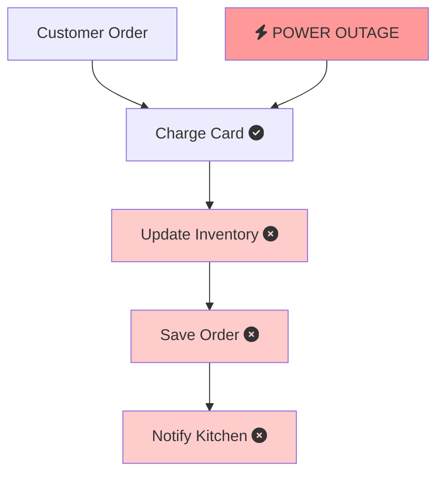
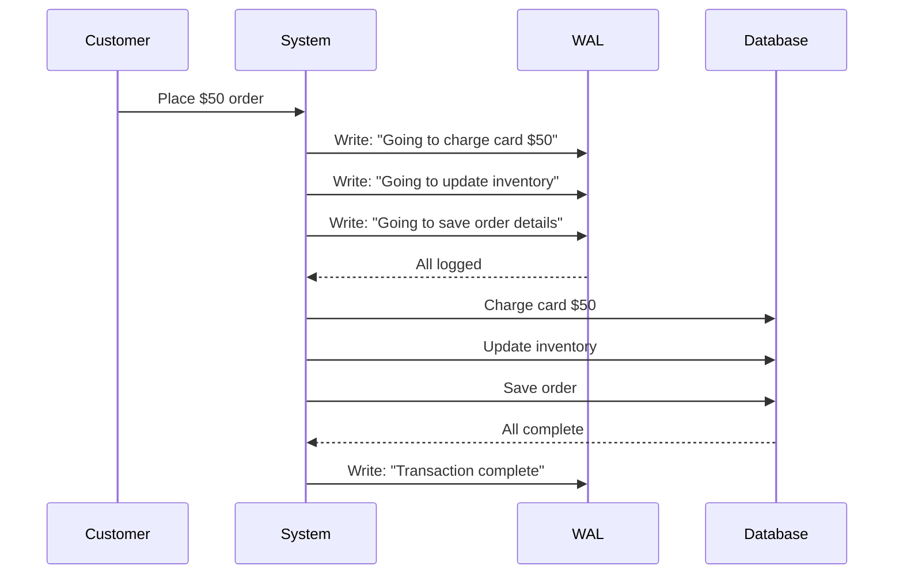
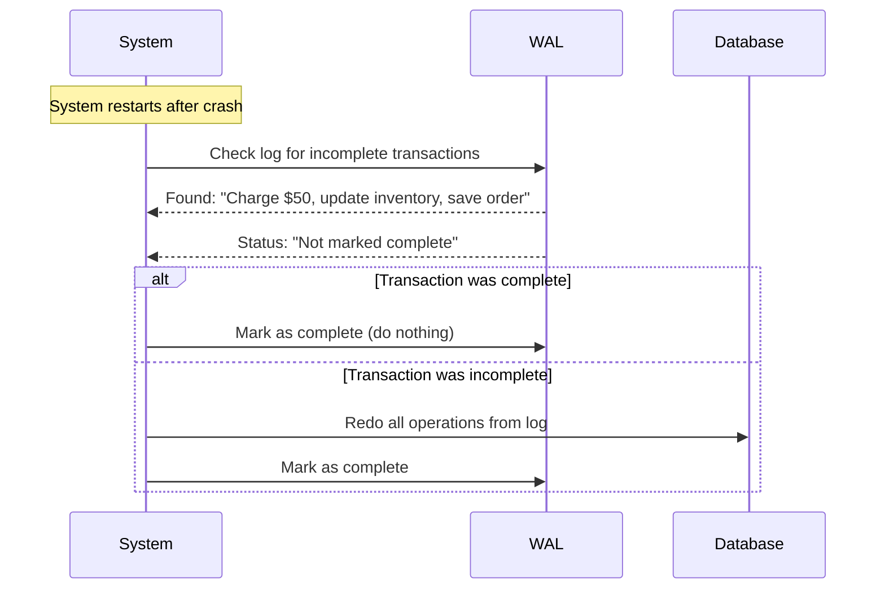
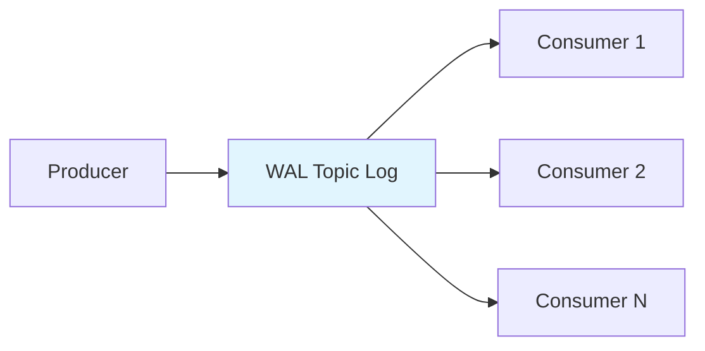
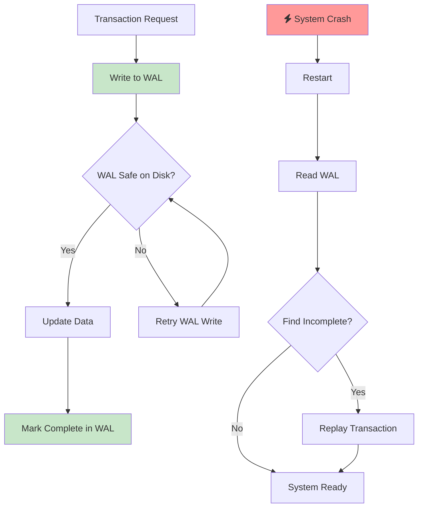
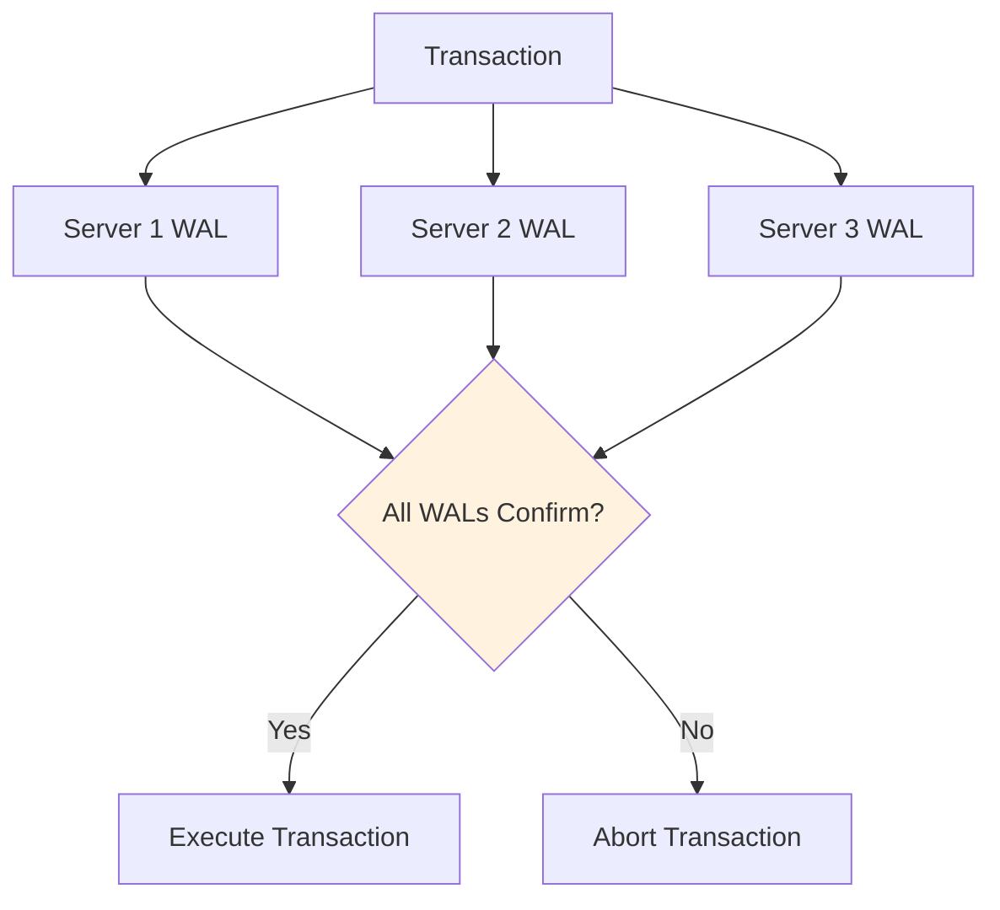
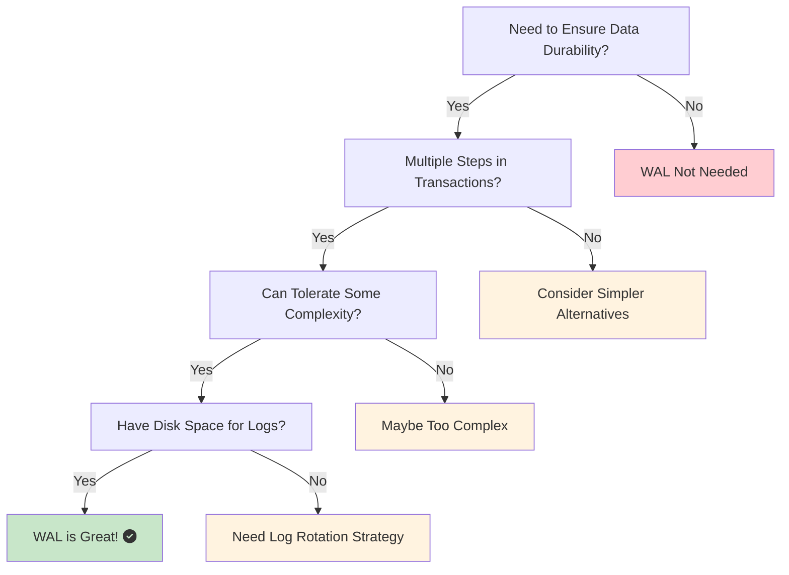

Picture this: You're transferring $500 to your friend through a banking app. You hit "Send," and your phone immediately dies. When you turn it back on, you check your account—the money is gone from your balance, but your friend never received it. 

That's a nightmare scenario, right? In the world of databases and distributed systems, this kind of data loss happens more often than you'd think. But there's a pattern that prevents these disasters: **Write-Ahead Log (WAL)**.

Today, we'll dive into what WAL is, why it exists, and how it keeps your data safe.

## The Problem: When Things Go Wrong at the Worst Time

Let's start with a story that'll make any developer's blood pressure spike.

### The Restaurant Ordering System Disaster

Imagine you're running a popular restaurant with an online ordering system. Orders are flying in during the dinner rush. Here's what happens behind the scenes:

1. Customer places an order for $50
2. System charges their credit card
3. System updates inventory (removes ingredients)
4. System saves the order details
5. Kitchen gets notified

Now, what if the power goes out right after step 2? The customer's card was charged, but there's no record of the order. The ingredients are still in stock, and the kitchen has no idea what to cook.

This is exactly the problem WAL solves.



### The Core Issue: Partial Updates

The real problem isn't power outages (though they're part of it). It's **partial updates**. In any system that does multiple things in sequence, there's always a chance that some steps complete while others don't.

Common causes include:
- Power failures
- Network issues
- Software crashes
- Hardware failures
- Out of memory errors

Without WAL, you end up with:
- <i class="fas fa-check-circle text-success"></i> Some changes saved
- <i class="fas fa-times-circle text-danger"></i> Other changes lost
- <i class="fas fa-dizzy text-warning"></i> Inconsistent data
- <i class="fas fa-angry text-danger"></i> Angry customers

## The Solution: Write-Ahead Log Explained

Write-Ahead Log is beautifully simple: **Write down what you're going to do before you actually do it.**

Think of it like this analogy:

### The Smart Chef Analogy

Imagine a chef who never wants to mess up an order. Before touching any ingredients, they write down every step of the recipe on a notepad:

1. "Going to use 2 tomatoes"
2. "Going to add 1 cup of rice"  
3. "Going to cook for 20 minutes"

Only after writing everything down do they start cooking. If something goes wrong (fire alarm, power outage, distraction), they can look at their notepad and either:
- Continue where they left off
- Undo what they already did
- Start over with confidence

That notepad is the Write-Ahead Log.

### How WAL Works in Practice

Here's what happens with WAL in our restaurant system:



If something goes wrong:



## Real-World Examples That'll Blow Your Mind

### PostgreSQL: The WAL Master

PostgreSQL uses WAL for every single write operation. Here's what actually happens when you run:

```sql
UPDATE users SET balance = balance - 100 WHERE id = 123;
```

Before PostgreSQL touches your actual data:

1. **WAL Record Created**: "Going to change user 123's balance from 500 to 400"
2. **WAL Record Written**: Safely stored on disk
3. **Data Updated**: Only now does it change the actual balance
4. **Checkpoint**: Later, marks the change as permanent

If PostgreSQL crashes between steps 2 and 4, it reads the WAL on restart and completes the operation. Your data is never lost.

### Apache Kafka: Streaming with WAL

Kafka is basically a giant Write-Ahead Log system. Every message you send goes into a log before anything else happens:



This is why Kafka is so reliable for streaming data. The log is the source of truth, and consumers can replay from any point.

## How WAL Guarantees Durability

WAL provides something called **durability**—one of the famous ACID properties. Here's how:

### The Three Pillars of WAL

1. **Write Before Change**: Log entries are written to disk before any data changes
2. **Sequential Writes**: Log entries are written in order (fast and reliable)
3. **Recovery Process**: On restart, replay incomplete transactions from the log

### Why This Works So Well



The key insight: **Disk writes are the bottleneck anyway**. WAL doesn't add much overhead because you're already writing to disk. It just changes the order and organization.

## When WAL Isn't Enough: Advanced Patterns

### Distributed WAL (Multi-Server)

What if your system runs on multiple servers? You need **distributed WAL**:



This is how systems like **Apache Cassandra** and **MongoDB** work in cluster mode.

## Who Uses It?

### Databases
- **PostgreSQL**: WAL for crash recovery and replication
- **MySQL**: Binary log (similar concept)
- **SQLite**: WAL mode for better concurrency
- **MongoDB**: Oplog (operations log)

### Message Queues  
- **Apache Kafka**: Topics are essentially WAL partitions
- **RabbitMQ**: Persistent queues use WAL
- **Apache Pulsar**: BookKeeper provides WAL storage

### Distributed Systems
- **Ethereum**: Every block is a WAL entry
- **Git**: Commit log is a type of WAL
- **Apache Cassandra**: Commit log before memtable

### Cloud Services
- **AWS RDS**: Uses WAL for automated backups
- **Google Cloud SQL**: WAL-based point-in-time recovery
- **Azure Database**: WAL for high availability

## The Tradeoffs: When WAL Might Not Be Right

WAL isn't magic. It comes with costs:

### Performance Impact
- **Extra Disk Writes**: Every operation writes twice (WAL + data)
- **Sequential I/O**: WAL is fast, but still I/O
- **Log Cleanup**: Need to manage log size

### Complexity
- **Recovery Logic**: Need robust replay mechanisms
- **Log Rotation**: Prevent logs from growing forever
- **Distributed Coordination**: Hard in multi-server setups

### Storage Overhead
- **Disk Space**: WAL logs take additional space
- **Network**: Replication sends WAL entries
- **Memory**: Recovery may need to load large logs

## When to Use WAL: A Decision Framework



**Use WAL when:**
- Data loss is unacceptable
- You have multi-step transactions
- You can handle the complexity
- You have adequate storage

**Skip WAL when:**
- Data is easily recreatable
- Single atomic operations only
- Extreme performance requirements
- Very simple systems

## Wrapping Up

Write-Ahead Log is like insurance for your data. You hope you'll never need it, but when disaster strikes, you're incredibly grateful it's there.

---

*What's your experience with WAL? Share your stories in the comments below!*
