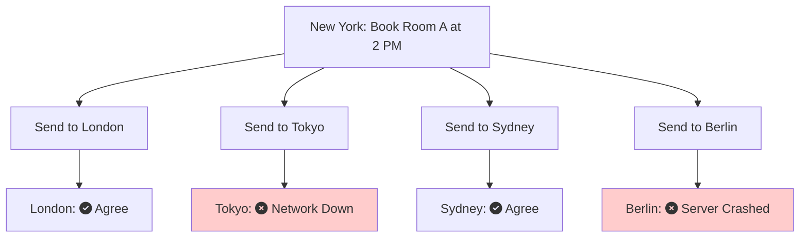
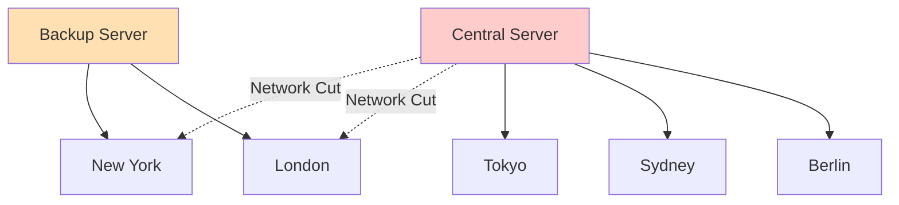
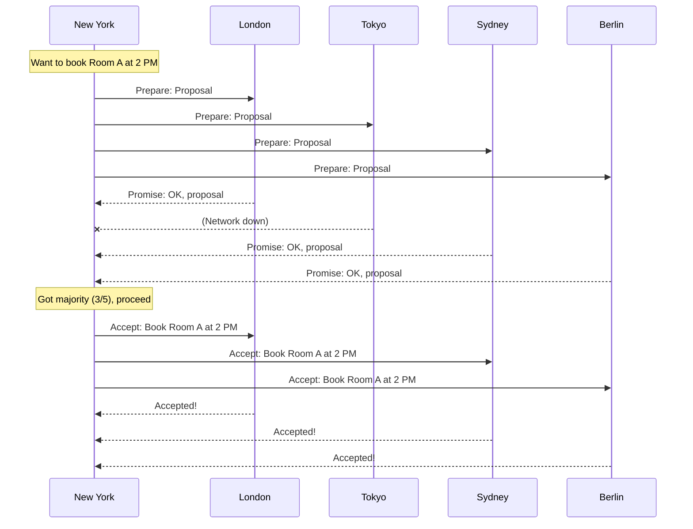
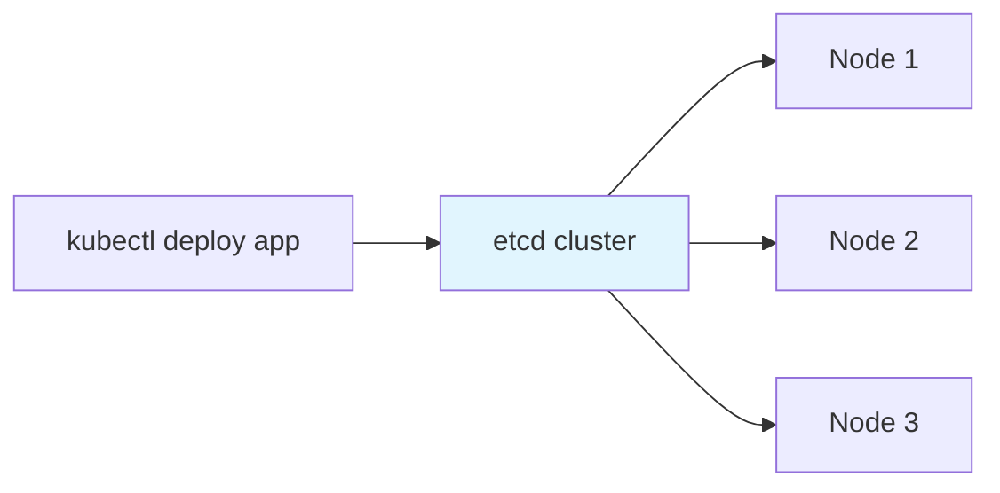
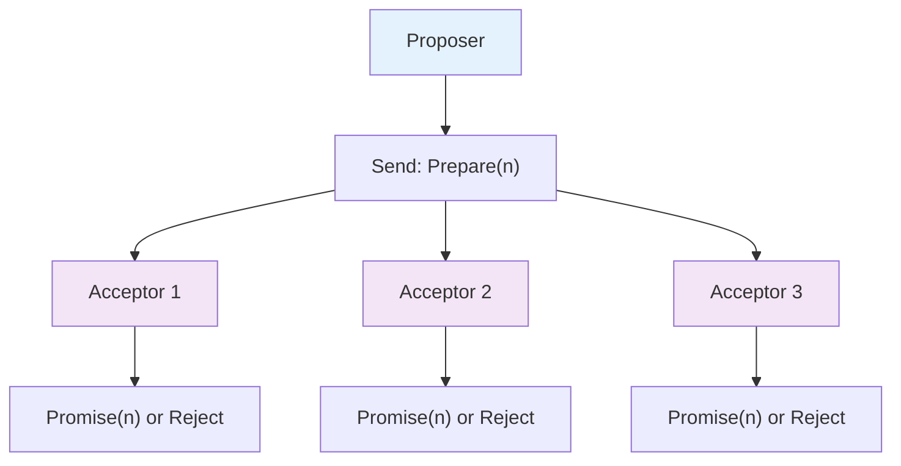
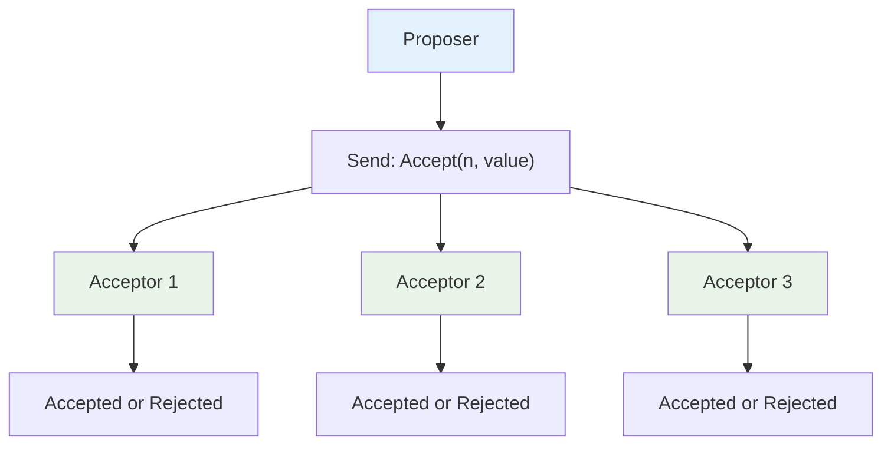
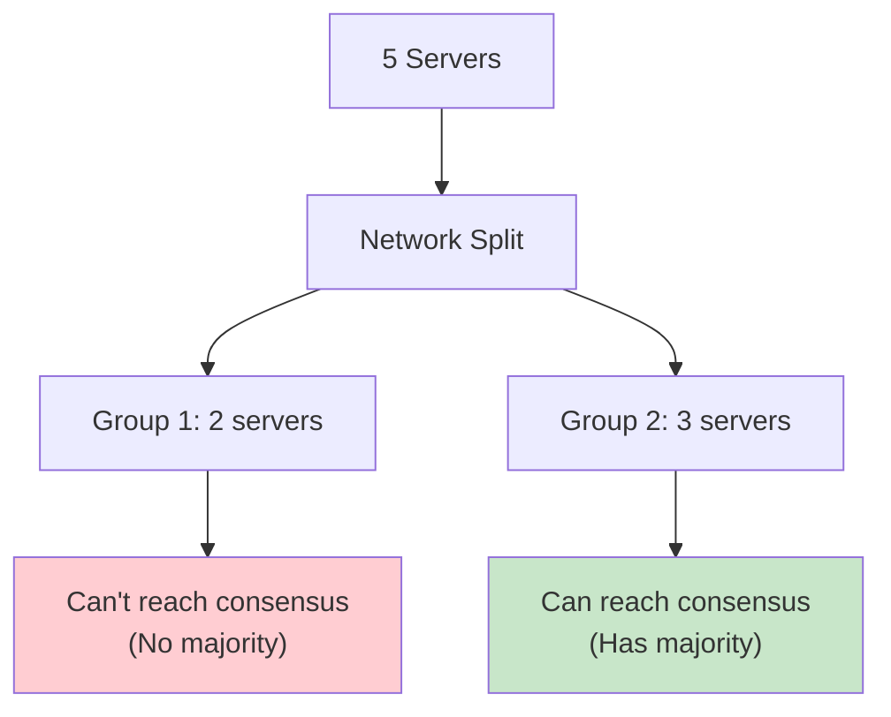
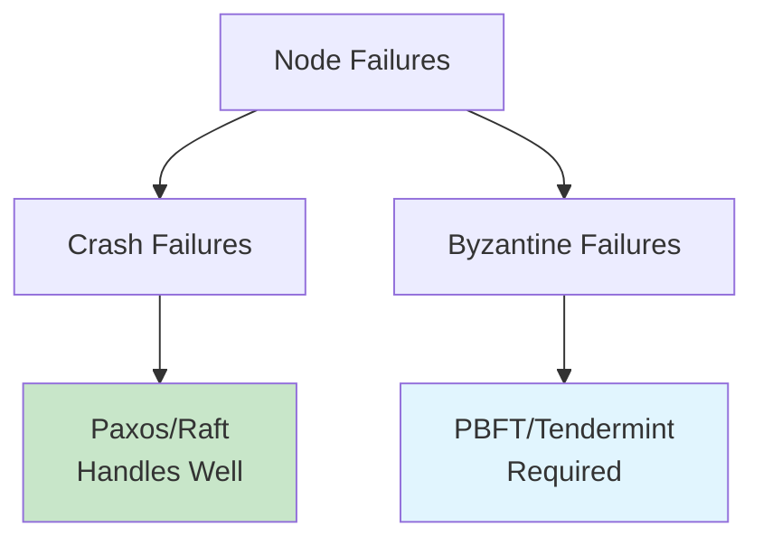

Imagine you're running a bank with branches in New York, London, and Tokyo. A customer has $1500 in their account. At the exact same moment, they walk into the New York branch asking to withdraw $1000, try to withdraw $1000 through the London ATM, and attempt another $1000 withdrawal via the Tokyo mobile app.

Here's the challenge: each branch only sees part of the story. All three systems think the account has the full $1500 available. Without coordination, all three withdrawals could go through, overdrawing the account by $1500.

This is the **distributed consensus problem**: getting multiple computers to agree on a single truth, even when they can't all talk to each other reliably. And there's an algorithm that solves this challenge elegantly: **Paxos**.

In this post, we'll explore how Paxos ensures that distributed systems stay consistent, even when networks fail and servers crash.

## The Problem: Getting Everyone to Agree is Hard

Let's start with a story that shows just how tricky consensus can be.

### The Meeting Room Booking Nightmare

Imagine you work at a company with 5 offices around the world. Each office has a system that manages meeting room bookings. When someone in New York books Conference Room A for 2 PM, that booking needs to be synchronized across all offices.

Here's what should happen:
1. New York office receives booking request
2. All 5 offices agree on the booking
3. Booking is confirmed and stored everywhere
4. No conflicts or double bookings

But what could go wrong?



Now you have a problem:
- New York, London, and Sydney think the booking is confirmed
- Tokyo and Berlin have no idea about the booking
- Someone in Tokyo might book the same room for the same time

This is the **distributed consensus problem**.

### Why Simple Solutions Don't Work

You might think, "Just have one central server handle all bookings!" But that creates new problems:

**Single Point of Failure**: If that server goes down, nobody can book anything anywhere.

**The Split Brain Problem**: What if the central server loses connection to some offices but not others? 



Now you have two servers both thinking they're in charge. Tokyo books Conference Room A through the main server, while New York books the same room through the backup server. Chaos ensues.

## The Solution: Paxos Explained

Paxos solves this by turning consensus into a **democratic voting process**. Instead of relying on one leader, it lets the servers vote on every decision.

Think of it like this analogy:

### The Group Chat Analogy

Imagine you and 4 friends are trying to decide where to go for dinner using a group chat. Here's how it works:

1. **Check Phase**: Someone asks "Can we decide on dinner now?" 
2. **Proposal Phase**: Once enough people respond "yes", they suggest "How about Pizza Palace?"

But there are rules to prevent chaos:
- Only one dinner decision at a time
- Once you say "yes, let's decide", you can't ignore that for an older suggestion
- You need majority agreement (3 out of 5) to confirm the restaurant. (This [majority quorum](/distributed-systems/majority-quorum/) principle is fundamental to distributed consensus.)
- If someone was offline, they see the final decision when they check their phone

That's essentially how Paxos works.

### How Paxos Works in Practice

Here's what happens when New York wants to book Conference Room A:



Even though Tokyo was down, the booking still went through because a majority (3 out of 5) agreed.

**What happens when Tokyo comes back online?**

When Tokyo's network connection is restored, it discovers that Conference Room A has already been booked for 2 PM. Tokyo learns about this decision by checking with the other offices. Since the majority already agreed and the booking is finalized, Tokyo simply updates its records to match the consensus. This ensures all offices stay synchronized, even if some were temporarily offline during the decision-making process.

## Real-World Examples

### Google Chubby: The Lock Service That Runs the Internet

Google uses Paxos in their Chubby lock service, which coordinates thousands of servers across their data centers. When you search on Google, Chubby helps ensure:

- Critical resources are properly coordinated across servers
- Search indexes stay consistent across data centers  
- No two servers try to update the same data simultaneously

Without Paxos, Google's search would be a mess of duplicate work and inconsistent results.

### Apache Cassandra: Database Consensus

Cassandra implements the Paxos algorithm for lightweight transactions to ensure consistency. When you run:

```sql
INSERT INTO users (id, email) VALUES (123, 'john@example.com') 
IF NOT EXISTS;
```

Cassandra uses Paxos to coordinate between nodes, ensuring that only one server can successfully insert that record, even if multiple clients attempt the same operation simultaneously across different data centers.

### etcd: Kubernetes' Brain

Kubernetes uses etcd to store cluster configuration, and etcd uses Raft (another consensus algorithm) for achieving agreement. Every time you deploy a new pod, decisions about cluster state and resource allocation are coordinated through consensus.



## The Paxos Algorithm: Under the Hood

Now let's dive into how Paxos actually works. Don't worry, I'll keep it simple.

### The Two Phases of Paxos

Paxos has two main phases that repeat for every decision:

#### Phase 1: Prepare (The "May I?" Phase)



The proposer asks: "May I propose value X with proposal number N?"

Acceptors respond: "Yes, but only if N is higher than any proposal number I've already promised to consider."

#### Phase 2: Accept (The "Here's My Proposal" Phase)



The proposer says: "I propose value X with proposal number N."

Acceptors respond: "I accept it" (if they haven't promised a higher numbered proposal).

### Why the Proposal Numbers Matter

Think of proposal numbers like timestamps. Here's why they're important:

Imagine Alice and Bob both want to plan the group dinner at the same time:

1. **Alice** asks the group: "Can we decide on dinner? (Proposal #1)"
2. **Bob** asks the group: "Can we decide on dinner? (Proposal #2)" 
3. The group says "yes" to both, but **Bob's request came later** (higher number)
4. **Alice** suggests: "Let's go to Pizza Palace (Proposal #1)"
5. **Bob** suggests: "Let's go to Burger Barn (Proposal #2)"

Since the group already committed to considering Bob's newer request (#2), they ignore Alice's older suggestion (#1) and go with Bob's choice.

**The rule is simple**: Once you promise to consider a newer proposal, you can't go back to an older one. This prevents confusion and ensures the group always moves forward with the most recent decision.

## The Tradeoffs: When Paxos Isn't Perfect

Paxos is powerful, but it comes with costs:

### Performance Impact
- **Latency**: Every decision needs multiple network round trips
- **Throughput**: Basic Paxos can only handle one decision at a time
- **Network Traffic**: Lots of messages flying around

### Complexity Costs
- **Implementation Difficulty**: Paxos is notoriously hard to implement correctly
- **Debugging Challenges**: Consensus bugs are subtle and hard to reproduce
- **Operational Overhead**: Need to monitor proposal numbers, leader elections, etc.

### Availability Limits
- **Needs Majority**: Cannot tolerate more than N/2 server failures
- **Network Partitions**: Small partitions can't make progress
- **Split Brain**: Careful design needed to prevent multiple leaders



## When to Use Paxos: A Decision Framework

**Use Paxos when:**
- Strong consistency is non-negotiable
- You have multiple servers/data centers
- You can handle the implementation complexity
- Availability under failures is critical

**Skip Paxos when:**
- Eventually consistent is good enough
- You have very low latency requirements  
- Simple single-master setup works
- Implementation resources are limited

## Paxos vs. Other Consensus Algorithms

### Raft: The Understandable Alternative

Raft was designed to be easier to understand than Paxos:

| Aspect | Paxos | Raft |
|--------|--------|------|
| **Complexity** | High | Medium |
| **Performance** | Excellent | Good |
| **Adoption** | Widespread | Growing |
| **Understanding** | Difficult | Easier |

### PBFT: For Byzantine Faults

Practical Byzantine Fault Tolerance (PBFT) handles malicious actors and arbitrary failures, while Paxos assumes nodes either work correctly or fail completely:



## Wrapping Up

Paxos is like democracy for distributed systems. It can be complex and sometimes slow, but it reliably achieves consensus even when networks fail and servers crash. While it's challenging to implement correctly, it's the foundation that keeps many of the world's largest systems running smoothly.


*Have you implemented Paxos in your systems? Share your experiences in the comments below!*
