Six months ago, you had one web app on one server. Today, you have 50 microservices that need to scale independently, find each other, and handle failures gracefully. Your deployment process went from "upload via FTP" to "run this 200 line script and pray."

This is exactly why Kubernetes exists.

Kubernetes is essentially **an operating system for distributed applications**. Just like Linux manages processes and memory on one machine, Kubernetes manages containers and resources across a cluster of machines.

Let's break down how it actually works and what you need to know as a developer.

## The Problem: Why We Need an Orchestrator

### How Google Ran Its Infrastructure

By the early 2000s, Google was running billions of containers across thousands of servers. They needed to manage services like Search, Gmail, Maps, and YouTube at massive scale. Manual deployment and management was impossible.

Google built internal systems to solve this:
- **Borg** (2003): Their first container orchestration system
- **Omega** (2013): An improved version with better scheduling

These systems handled:
- **Automated deployment**: Deploy thousands of containers without manual intervention
- **Resource efficiency**: Pack services tightly to maximize hardware utilization
- **Self healing**: Automatically restart failed containers
- **Zero downtime updates**: Deploy new versions without taking services offline
- **Global scale**: Coordinate containers across multiple datacenters

In 2014, Google open sourced **Kubernetes** - a reimagining of Borg for the wider world. They realized every company moving to microservices would face the same problems they solved internally.

The timing was perfect. Docker had made containers popular, but nobody had a good way to run them at scale.

## Kubernetes: The Big Picture

Kubernetes solves the orchestration problem by providing a **declarative API** for managing containerized applications. Instead of telling Kubernetes *how* to do something, you tell it *what* you want, and it figures out the how.

Here's the key insight: **Kubernetes treats your entire cluster as a single computer**. You don't deploy to specific servers - you deploy to "the cluster" and Kubernetes decides where things should run.


This abstraction is powerful because it lets developers focus on their applications instead of infrastructure management.

## The Architecture: Control Plane vs Worker Nodes

Kubernetes uses a **control plane and worker nodes architecture**. Think of it like a construction site:

- **Control Plane**: The project managers and architects who make decisions
- **Worker Nodes**: The construction workers who do the actual building

```mermaid
graph TB
    subgraph "Control Plane"
        API[kube-apiserver<br/>📡 API Gateway]
        ETCD[etcd<br/>🗄️ Cluster Database]
        SCHED[kube-scheduler<br/>📋 Pod Placement]
        CM[kube-controller-manager<br/>🎛️ State Management]
    end
    
    subgraph "Worker Node 1"
        KUBELET1[kubelet<br/>🤖 Node Agent]
        PROXY1[kube-proxy<br/>🌐 Network Proxy]
        RUNTIME1[Container Runtime<br/>📦 Docker/containerd]
        POD1[Pods<br/>🏠 Application Containers]
    end
    
    subgraph "Worker Node 2"
        KUBELET2[kubelet<br/>🤖 Node Agent]
        PROXY2[kube-proxy<br/>🌐 Network Proxy]
        RUNTIME2[Container Runtime<br/>📦 Docker/containerd]
        POD2[Pods<br/>🏠 Application Containers]
    end
    
    API --> KUBELET1
    API --> KUBELET2
    API --> ETCD
    API --> SCHED
    API --> CM
    
    KUBELET1 --> RUNTIME1
    KUBELET2 --> RUNTIME2
    RUNTIME1 --> POD1
    RUNTIME2 --> POD2
```



Let's dive into each component and understand what they actually do.

## Control Plane Components: The Brain of Kubernetes

### kube-apiserver: The Front Door

The API server is the **only component that talks to etcd** and the **only way** anything else communicates with the cluster. Every kubectl command, every internal component, every external tool - everything goes through the API server.

Think of it as the receptionist at a busy office. Every request comes to them first, they validate who you are, check if you're allowed to do what you're asking, and then either fulfill the request or pass it to the right person.

**Real world example**: When you run `kubectl apply -f deployment.yaml`, here's what happens:
1. kubectl sends the YAML to the API server
2. API server validates the YAML syntax
3. API server checks if you have permission to create deployments
4. API server stores the deployment spec in etcd
5. API server notifies other components that a new deployment exists

### etcd: The Single Source of Truth

etcd is a **distributed key-value store** that holds the entire state of your Kubernetes cluster. Every pod, service, secret, and configuration lives here. It's like the master database for your entire infrastructure.

**Why etcd and not a regular database?**
- **Consistency**: etcd uses the Raft consensus algorithm to ensure all nodes agree on the data
- **Watch API**: Components can subscribe to changes in real-time
- **Atomic operations**: Critical for maintaining cluster state integrity

**What's stored in etcd:**
```
/registry/pods/default/my-app-pod-123
/registry/services/default/my-app-service
/registry/deployments/default/my-app-deployment
/registry/secrets/default/database-credentials
```

### kube-scheduler: The Matchmaker

The scheduler's job is to **decide which node should run each pod**. It's like a really smart HR person matching job requirements with candidate qualifications.

The scheduling process:
1. **Filtering**: Remove nodes that can't run the pod (not enough CPU, wrong OS, etc.)
2. **Scoring**: Rank remaining nodes based on various factors
3. **Selection**: Pick the highest-scoring node

**Scheduling factors:**
- Resource requirements (CPU, memory, storage)
- Node affinity rules ("run on nodes with SSD storage")
- Pod affinity rules ("run near the database pods")
- Anti-affinity rules ("don't run two instances on the same node")
- Taints and tolerations (node restrictions)

### kube-controller-manager: The Autopilot

This is actually **multiple controllers** running in a single process. Each controller watches for changes and tries to make the actual state match the desired state.

**Key controllers:**
- **Deployment Controller**: Manages ReplicaSets for deployments
- **ReplicaSet Controller**: Ensures the right number of pod replicas
- **Node Controller**: Monitors node health and marks unhealthy nodes
- **Service Account Controller**: Creates default service accounts for namespaces

**Example**: If you have a deployment with 3 replicas but only 2 pods are running, the ReplicaSet controller will create a new pod to match the desired state.

## Worker Node Components: Where the Work Happens

### kubelet: The Node Manager

The kubelet is the **primary node agent** that runs on every worker node. It's responsible for:

- **Pod Lifecycle Management**: Starting, stopping, and monitoring containers
- **Health Checks**: Running liveness and readiness probes
- **Resource Monitoring**: Reporting node and pod resource usage
- **Volume Management**: Mounting and unmounting storage volumes

**How kubelet works:**
1. Watches the API server for pods assigned to its node
2. Pulls container images from registries
3. Starts containers using the container runtime
4. Monitors container health and restarts failed containers
5. Reports status back to the API server

### kube-proxy: The Network Plumber

kube-proxy handles **network routing** for services. When you create a Kubernetes service, kube-proxy sets up the networking rules to make it accessible.

**What kube-proxy does:**
- Creates iptables rules (or uses IPVS) for service routing
- Load balances traffic across pod replicas
- Handles service discovery within the cluster

**Example**: You have a service called "database" with 3 pod replicas. kube-proxy ensures that when any pod tries to connect to "database", the traffic gets routed to one of the healthy replicas.

### Container Runtime: The Engine

This is what actually **runs your containers**. Kubernetes supports multiple runtimes:

- **containerd**: The most common choice, used by major cloud providers
- **CRI-O**: Red Hat's container runtime
- **Docker**: Still supported but being phased out

The runtime handles:
- Pulling container images
- Creating and starting containers
- Managing container lifecycle
- Providing container logs and metrics

## How It All Works Together: A Pod's Journey

Let's trace what happens when you deploy a simple web application to understand how all these components work together.

### Step 1: You Submit a Deployment

```yaml
apiVersion: apps/v1
kind: Deployment
metadata:
  name: web-app
spec:
  replicas: 3
  selector:
    matchLabels:
      app: web-app
  template:
    metadata:
      labels:
        app: web-app
    spec:
      containers:
      - name: web
        image: nginx:1.21
        ports:
        - containerPort: 80
```

### Step 2: Control Plane Processes the Request


### Step 3: Worker Nodes Execute the Plan


## Real World Lessons: What Developers Need to Know

### 1. Kubernetes is Eventually Consistent

Unlike traditional systems where changes happen immediately, Kubernetes is **eventually consistent**. When you apply a change, it might take a few seconds (or longer) for the system to reach the desired state.

**Practical implication**: Don't expect immediate results. Use `kubectl wait` to monitor deployments.

### 2. Everything is Declarative

You don't tell Kubernetes "start 3 containers." You tell it "I want 3 replicas running." If containers crash, Kubernetes automatically restarts them to maintain your desired state.

**Practical implication**: Focus on describing what you want, not how to achieve it.

### 3. Labels are Everything

Kubernetes uses **labels and selectors** to connect resources. Services find pods using labels. Deployments manage ReplicaSets using labels. Network policies apply to pods using labels.

**Best practice**: Use consistent, meaningful labels across all your resources.

### 4. Resource Limits Matter

Without resource limits, a single pod can consume all node resources and crash other applications. Always set CPU and memory limits.

**Example**:
```yaml
resources:
  requests:
    cpu: 100m      # 100 millicores = 0.1 CPU core (10%)
    memory: 128Mi  # 128 Mebibytes ≈ 134 MB
  limits:
    cpu: 500m      # 500 millicores = 0.5 CPU core (50%)
    memory: 512Mi  # 512 Mebibytes ≈ 537 MB
```

**Not sure what these units mean?** Check out our [Kubernetes Resource Units Explained](/explainer/kubernetes-resource-units/) guide for a detailed breakdown of CPU and memory notation.

### 5. Health Checks are Critical

Kubernetes needs to know if your application is healthy. Configure probes to help Kubernetes make smart decisions about traffic routing and pod restarts.

```yaml
livenessProbe:    # "Is my container alive?" - Restarts if fails
  httpGet:
    path: /health
    port: 8080
  initialDelaySeconds: 30
  periodSeconds: 10
readinessProbe:   # "Ready for traffic?" - Removes from service if fails
  httpGet:
    path: /ready
    port: 8080
  initialDelaySeconds: 5
  periodSeconds: 5
startupProbe:     # "Finished starting?" - For slow-starting apps
  httpGet:
    path: /startup
    port: 8080
  failureThreshold: 30  # Allow 5 minutes to start
```

**Probe types:**
- **Liveness**: Restarts container when it fails (deadlock detection)
- **Readiness**: Controls traffic flow (startup/dependency checks)  
- **Startup**: Extended grace period for slow-starting applications

## Common Pitfalls and How to Avoid Them

### 1. Treating Pods Like VMs

**Wrong approach**: SSH into pods to debug issues, store data locally, manually configure pods.

**Right approach**: Treat pods as cattle, not pets. Use logs for debugging, external storage for data, and configuration through ConfigMaps and Secrets.

### 2. Misunderstanding Networking

Kubernetes networking can be complex. Pods can communicate with each other by default, but services provide stable endpoints and load balancing.

**Key concepts**:
- **Pod-to-Pod**: Direct communication using pod IPs
- **Service-to-Pod**: Stable endpoint with load balancing
- **External-to-Service**: Ingress controllers or LoadBalancer services

### 3. Ignoring Security

Running containers as root, using default service accounts, and storing secrets in plain text are common security mistakes.

**Security checklist**:
- Run containers as non-root users
- Use specific service accounts with minimal permissions
- Store sensitive data in Secrets, not ConfigMaps
- Enable network policies to restrict pod communication
- Regularly scan container images for vulnerabilities

## The Bigger Picture: Why Kubernetes Won

Kubernetes succeeded because it solved real problems that every organization faces when scaling applications:

1. **Standardization**: One API for all cloud providers
2. **Extensibility**: Custom resources and operators for complex applications
3. **Community**: Massive ecosystem of tools and integrations
4. **Declarative Management**: Infrastructure as code for applications
5. **Self-Healing**: Automatic recovery from failures

## Beyond Deployments: Other Workload Types

While this article focused on Deployments and Pods, Kubernetes supports other workload types:

- **StatefulSets**: For stateful applications like databases that need stable network identities
- **DaemonSets**: Run one pod per node (great for log collectors or monitoring agents)
- **Jobs**: Run tasks to completion (batch processing, migrations)
- **CronJobs**: Run Jobs on a schedule using [cron expressions](/tools/cron-expression/) (backups, reports, cleanup tasks)

## Conclusion

Kubernetes might seem complex at first, but its architecture is actually quite elegant. By separating concerns between the control plane (decision making) and worker nodes (execution), it creates a scalable, resilient platform for running distributed applications.

For practical commands and debugging workflows, check out the [Kubernetes Cheat Sheet](/kubernetes-cheat-sheet/).

---

*Want to dive deeper? Check out the [official Kubernetes documentation](https://kubernetes.io/docs/) and try running a local cluster with [kind](https://kind.sigs.k8s.io/) or [minikube](https://minikube.sigs.k8s.io/).*
