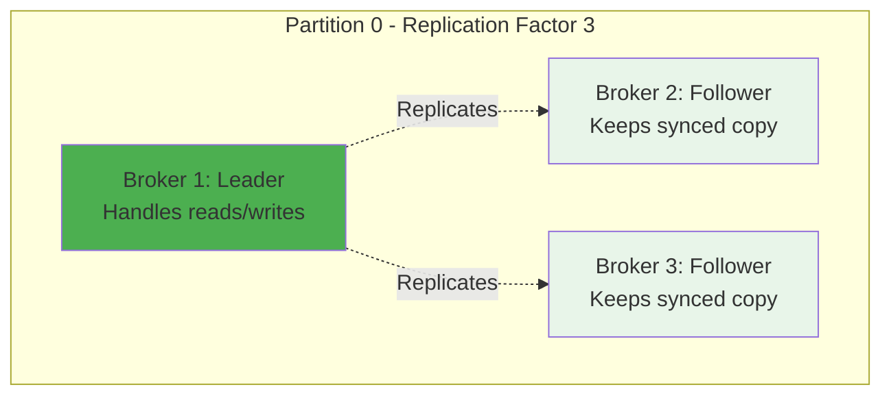

Your company just launched a new feature. Within seconds, millions of events start flooding in: user clicks, purchases, page views, API calls. Traditional databases are choking. Message queues are dropping data. Your monitoring dashboard shows error rates climbing.

This is the exact moment LinkedIn faced in 2010. They were processing billions of events daily, and nothing in the market could handle the load. So they built something new. Something that would eventually power systems at Netflix, Uber, Airbnb, and thousands of other companies.

They called it Kafka.

But here's the thing: **Kafka is not a message queue**. It's not a database. It's something far more interesting.

## The Problem: Why Traditional Systems Break

Before we talk about Kafka, let's understand why existing solutions failed.

### Traditional Message Queues: The Delivery Truck Problem

Think of RabbitMQ or ActiveMQ as delivery trucks. When you send a message:

1. Producer sends message to queue
2. Queue stores it in memory
3. Consumer reads and processes it
4. Message gets deleted

This works great for low volumes. But what happens when you need to:
- Process **millions of messages per second**?
- Let **multiple consumers** read the same data?
- **Replay** old messages for debugging?
- Keep messages for **days or weeks**?

Traditional queues struggle because they delete messages after delivery. Once it's gone, it's gone forever.

### Traditional Databases: The Filing Cabinet Problem

Databases are built for structured data with complex queries. But when you need to:
- Append millions of events per second
- Read in strict chronological order
- Scale horizontally without complex sharding

Databases become the bottleneck. They're solving the wrong problem.

## The Insight: Think Like a Log

Here's the key insight that makes Kafka different: **Everything is a log**.

Not a log file you grep through. Not application logs. We're talking about an **append-only sequence of records**. This is the same fundamental pattern behind the [Write-Ahead Log](/distributed-systems/write-ahead-log/) that databases use for durability.

This simple shift changes everything. With a log:
- **Producers append** at the end (blazing fast)
- **Consumers track their position** (called offset)
- **Multiple consumers** can read independently
- **Messages persist** for configurable retention
- **Replay** is just resetting your position

LinkedIn's Jay Kreps (Kafka's creator) realized that this pattern shows up everywhere:
- Database replication logs
- File systems
- Version control (Git commits)
- Event sourcing

Kafka took this universal pattern and built a distributed system around it.

## Kafka Architecture: The Core Components

Let's break down how Kafka actually works.

### Topics: The Category of Your Data

A **topic** is like a folder or channel where related events live. Examples:
- `user-clicks`
- `payment-transactions`
- `sensor-readings`
- `application-logs`

Each topic is completely independent. You can have thousands of topics in a single Kafka cluster.

### Partitions: The Secret to Scale

Here's where it gets interesting. Each topic is split into **partitions**. Think of partitions as lanes on a highway.


**Why partitions matter**:
- **Parallelism**: Different partitions on different servers
- **Ordering**: Messages within a partition are strictly ordered
- **Scalability**: Add more partitions to handle more load

**Key insight**: Kafka guarantees ordering **within a partition**, not across partitions. This is a crucial trade-off for performance.

### Brokers: The Workers

A **broker** is a Kafka server. It stores data and serves client requests. A Kafka cluster typically has multiple brokers (3, 5, 10, or even hundreds).


Each partition lives on one broker (called the **leader**) and is replicated to others (called **followers**). If a broker dies, followers take over.

### Producers: Writing Data

Producers send data to Kafka. Here's what happens:

1. Producer creates a record with a key and value
2. Producer decides which partition to send it to
3. Record gets appended to the partition's log
4. Kafka returns an acknowledgment

**Partition selection strategies**:
- **Key-based**: Same key always goes to same partition (order preserved for that key)
- **Round-robin**: Distribute evenly across partitions
- **Custom**: You define the logic

### Consumers: Reading Data

Consumers read data from Kafka. But here's the clever part: **consumers track their own position**.


**Consumer Groups**: Multiple consumers can work together. Kafka automatically distributes partitions among them.


**Key rule**: One partition is read by only one consumer in a group. This guarantees ordering and prevents duplicate processing.

## How Data Flows: A Complete Journey

Let's trace what happens when you send a message through Kafka.

### Step 1: Producer Sends Data


**Acknowledgment levels**:
- **acks=0**: Don't wait (fire and forget, fastest but risky)
- **acks=1**: Leader acknowledges (balanced)
- **acks=all**: All replicas acknowledge (safest but slower)

### Step 2: Data Gets Replicated

Each partition has a **replication factor** (typically 3). The data lives on multiple brokers for fault tolerance.



**ISR (In-Sync Replicas)**: Followers that are caught up with the leader. If the leader dies, Kafka promotes a follower from the ISR.

### Step 3: Consumer Reads Data


**Consumer commits** can be:
- **Automatic**: Kafka commits periodically
- **Manual**: You control when to commit (safer)

## The Write-Ahead Log: Kafka's Performance Secret

Kafka's speed comes from treating storage as a **sequential log**. Here's why this is brilliant:

### Sequential Disk I/O is Fast

Random disk access: ~100-200 IOPS (seeks kill performance)

Sequential disk access: ~500 MB/s (same as memory in some cases)

Kafka only appends to the end of log files. No random seeks. No updates. Just append.


**Real numbers from LinkedIn**:
- **2 million writes/second** per broker
- **Linear scaling**: Add more brokers for more throughput
- **Retention**: Can keep data for days with minimal performance impact

Similar to the [Write-Ahead Log pattern](/distributed-systems/write-ahead-log/) used in databases, Kafka's log-based architecture ensures durability and high performance.

### Zero-Copy: Skip the Application Layer

When consumers read data, Kafka uses **sendfile() system call** to transfer data directly from disk to network socket without copying through user space.


This eliminates expensive memory copies and context switches. It's one reason Kafka can saturate network bandwidth.

## Consumer Groups: The Coordination Magic

Consumer groups are Kafka's way of distributing work. Let's see how this works in practice.

### Scenario: Processing Orders

You have an `orders` topic with 6 partitions. You want to process orders as fast as possible.

**With 1 consumer**:


One consumer handles all partitions. Slow and no parallelism.

**With 3 consumers in same group**:


Each consumer gets 2 partitions. Processing happens in parallel. **3x faster**.

**With 6 consumers in same group**:


One partition per consumer. **Maximum parallelism** for this topic.

**With 8 consumers in same group**:


Two consumers sit idle. **More consumers than partitions** provides no benefit.

**Key takeaway**: Number of partitions = maximum parallelism for a consumer group.

### Rebalancing: When Things Change

When a consumer joins or leaves the group, Kafka **rebalances** partitions.


**Rebalancing can cause brief pauses**, so keep your consumer group stable when possible.

## Fault Tolerance: What Happens When Things Break

Kafka is built for failures. Let's walk through different failure scenarios.

### Broker Failure


**What happens**:
1. Broker 1 dies
2. Kafka detects the failure (via heartbeats)
3. Broker 2 (in-sync follower) becomes the new leader
4. Producers and consumers automatically switch to Broker 2
5. Total downtime: seconds or less

**No data loss** if you used `acks=all` because all replicas had the data.

### Consumer Failure


**No messages lost** because consumer commits its offset after processing. The new consumer picks up where the old one left off.

### Network Partition

This is the tricky one. What if a consumer loses connection but doesn't crash?


**Generation ID** prevents this consumer from committing stale offsets. Kafka tracks which generation of the consumer group you belong to.

## Real-World Use Cases: Where Kafka Shines

### Use Case 1: Activity Tracking at LinkedIn

**The problem**: Track every action users take (views, clicks, searches) for analytics and recommendations.

**Volume**: Billions of events per day

**Solution**:


**Why Kafka**:
- Handles millions of events/second
- Multiple teams consume the same data
- Can replay for debugging or new features
- Retention allows historical analysis

### Use Case 2: Log Aggregation at Uber

**The problem**: Collect logs from thousands of microservices running across multiple datacenters.

**Volume**: Petabytes per day

**Solution**:


**Why Kafka**:
- Buffers log spikes (prevents data loss)
- Decouples producers from consumers
- Easy to add new consumers (monitoring, alerting, etc.)
- Retention for debugging production issues

### Use Case 3: Event Sourcing at Netflix

**The problem**: Track every state change in the system for debugging and auditing.

**Solution**: Store all events in Kafka and rebuild current state by replaying events.


**Why Kafka**:
- Immutable event log
- Can rebuild state from any point in time
- Debugging is replaying events
- Multiple views from same events

Similar to how [CQRS separates reads and writes](/explainer/cqrs-design-pattern/), Kafka enables event-sourced architectures where the event log is the source of truth.

## The Coordination Problem: ZooKeeper vs KRaft

For years, Kafka depended on **Apache ZooKeeper** for coordination:
- Electing partition leaders
- Tracking cluster membership
- Storing metadata

But ZooKeeper adds operational complexity. In 2020, Kafka started replacing it with **KRaft** (Kafka Raft), a built-in consensus protocol.

```mermaid
graph TB
    subgraph "Old Architecture (ZooKeeper)"
        K1[Kafka Broker 1]
        K2[Kafka Broker 2]
        K3[Kafka Broker 3]
        Z1[ZooKeeper 1]
        Z2[ZooKeeper 2]
        Z3[ZooKeeper 3]
        
        K1 -.->|Metadata| Z1
        K2 -.->|Metadata| Z2
        K3 -.->|Metadata| Z3
    end
    
    subgraph "New Architecture (KRaft)"
        C1[Controller 1]
        C2[Controller 2]
        C3[Controller 3]
        B1[Broker 1]
        B2[Broker 2]
        
        B1 -.->|Metadata| C1
        B2 -.->|Metadata| C1
    end
    
    style Z1 fill:#ffcdd2
    style Z2 fill:#ffcdd2
    style Z3 fill:#ffcdd2
    style C1 fill:#4caf50
```

**Benefits of KRaft**:
- Simpler operations (one system instead of two)
- Faster metadata propagation
- Support for millions of partitions
- Easier to scale

If you're starting fresh, use KRaft mode. It's production-ready as of Kafka 3.3.

## Performance Tuning: Making Kafka Fly

### Producer Optimization

**Batching**: Don't send every message immediately. Batch them.

```java
// Good: High throughput
props.put("linger.ms", 10);        // Wait up to 10ms to batch
props.put("batch.size", 32768);    // 32KB batches
props.put("compression.type", "lz4");  // Compress batches
```

**Compression saves network bandwidth**:
- Text data: 5-10x compression
- JSON logs: 3-5x compression
- Binary data: 1-2x compression

**Idempotence prevents duplicates**:
```java
props.put("enable.idempotence", true);  // Exactly-once semantics
```

### Consumer Optimization

**Increase fetch size**:
```java
props.put("fetch.min.bytes", 50000);      // Wait for 50KB
props.put("fetch.max.wait.ms", 500);       // Or 500ms timeout
```

**Parallel processing**:
```java
// Use a thread pool to process messages
messages.forEach(msg -> threadPool.submit(() -> process(msg)));
```

**Commit strategy**:
```java
// Manual commits after processing
consumer.poll(Duration.ofMillis(100));
processMessages(messages);
consumer.commitSync();  // Only commit after successful processing
```

### Partition Design

**How many partitions?**

Too few: Can't scale consumption
Too many: Metadata overhead, slower leader elections

**Rule of thumb**:
```
partitions = max(target_throughput / producer_throughput,
                  target_throughput / consumer_throughput)
```

Example: Need 1 MB/s throughput, producer can do 100 KB/s, consumer can do 50 KB/s
```
partitions = max(1000/100, 1000/50) = max(10, 20) = 20 partitions
```

## Lessons from the Trenches

### Lesson 1: Partition Keys Matter

**Wrong approach**:
```java
// Random partitioning - breaks ordering
producer.send(new ProducerRecord<>("orders", orderId, orderData));
```

**Right approach**:
```java
// Use customer_id as key - all orders for a customer go to same partition
producer.send(new ProducerRecord<>("orders", customerId, orderData));
```

**Why**: If you care about order (and you probably do), use meaningful keys.

### Lesson 2: Monitor Consumer Lag

**Consumer lag** = how far behind your consumers are from the latest messages.

```mermaid
graph LR
    subgraph "Kafka Partition"
        M1[Offset 1000] --> M2[Offset 1500] --> M3[Latest: 2000]
    end
    
    Consumer[Consumer<br/>At offset 1200]
    
    M2 -.->|Lag: 800 messages| Consumer
    
    style Consumer fill:#fff3e0
```

**High lag means**:
- Consumers can't keep up
- Need more consumer instances
- Or consumers have bugs/slow processing

**Monitor with**:
```bash
kafka-consumer-groups --bootstrap-server localhost:9092 \
  --describe --group my-group
```

### Lesson 3: Retention is a Safety Net

Keep data longer than you think you need:

```java
// Retain for 7 days instead of 1 day
configs.put("retention.ms", "604800000");  // 7 days
```

**Real story**: A company had 1-day retention. They discovered a bug that corrupted data. But the bug was 2 days old. All correct data was already deleted. They couldn't recover.

With 7-day retention, they could replay from before the bug.

### Lesson 4: Replication Factor = 3

```java
// Always use replication factor of 3 in production
configs.put("replication.factor", "3");
configs.put("min.insync.replicas", "2");  // Require 2 replicas for ack
```

**Why 3?**
- Tolerates one broker failure (for maintenance)
- Tolerates another unexpected failure
- Industry standard

### Lesson 5: Design for Reprocessing

**Assume consumers will crash and reprocess messages**.

```java
// BAD: Not idempotent
void process(Message msg) {
    balance += msg.amount;  // Double-processing = wrong balance
    db.save(balance);
}

// GOOD: Idempotent
void process(Message msg) {
    if (!db.hasProcessed(msg.id)) {
        balance += msg.amount;
        db.save(balance);
        db.markProcessed(msg.id);
    }
}
```

Make your processing **idempotent** - processing the same message twice has the same effect as processing it once.

## When NOT to Use Kafka

Kafka is powerful but not always the right choice.

**Don't use Kafka when**:

1. **Low latency is critical** (< 1ms)
   - Kafka has millisecond latency, not microsecond
   - Use: In-memory message queues or Redis

2. **Small scale** (< 1000 messages/second)
   - Kafka's complexity isn't worth it
   - Use: RabbitMQ, AWS SQS, or simple pub/sub

3. **Request-reply patterns**
   - Kafka is for event streaming, not RPC
   - Use: REST APIs, gRPC

4. **Complex routing**
   - Kafka has simple topic-based routing
   - Use: RabbitMQ with topic exchanges

5. **Tiny messages** (< 10 bytes)
   - Kafka's per-message overhead is high
   - Use: Redis Streams or batch messages

## The Bigger Picture: Kafka in Modern Architecture

Kafka has become the **central nervous system** for data-driven companies.

```mermaid
graph TB
    subgraph "Data Sources"
        DB[(Databases)]
        API[APIs]
        Mobile[Mobile Apps]
        IoT[IoT Devices]
    end
    
    subgraph "Kafka as Data Hub"
        K[Apache Kafka<br/>Event Streaming Platform]
    end
    
    subgraph "Data Destinations"
        Analytics[Real-time Analytics]
        ML[ML Training]
        DW[Data Warehouse]
        Search[Search Index]
        Cache[Caches]
        Alerts[Alerting]
    end
    
    DB --> K
    API --> K
    Mobile --> K
    IoT --> K
    
    K --> Analytics
    K --> ML
    K --> DW
    K --> Search
    K --> Cache
    K --> Alerts
    
    style K fill:#4caf50
```

Instead of point-to-point connections (N systems talking to M systems = N*M connections), everything flows through Kafka.

**Benefits**:
- **Decoupling**: Add new data sources or destinations without changing existing systems
- **Replay**: Reprocess historical data for new use cases
- **Real-time**: All systems get data in real-time
- **Scalability**: One scalable platform instead of many queues

This is why companies like [LinkedIn built Kafka](https://engineering.linkedin.com/distributed-systems/log-what-every-software-engineer-should-know-about-real-time-datas-unifying) - they needed a universal data pipeline.

## Getting Started: Your First Kafka Application

Want to try Kafka? Here's a quick start:

**1. Run Kafka locally** (using Docker):
```bash
docker run -d --name kafka \
  -p 9092:9092 \
  apache/kafka:latest
```

**2. Create a topic**:
```bash
docker exec kafka /opt/kafka/bin/kafka-topics.sh \
  --create --topic my-topic \
  --bootstrap-server localhost:9092 \
  --partitions 3 \
  --replication-factor 1
```

**3. Send some data**:
```bash
docker exec -it kafka /opt/kafka/bin/kafka-console-producer.sh \
  --topic my-topic \
  --bootstrap-server localhost:9092
```

**4. Read the data**:
```bash
docker exec -it kafka /opt/kafka/bin/kafka-console-consumer.sh \
  --topic my-topic \
  --from-beginning \
  --bootstrap-server localhost:9092
```

For production, explore managed services like:
- **Confluent Cloud**: Kafka-as-a-Service by Kafka's creators
- **AWS MSK**: Managed Streaming for Kafka
- **Azure Event Hubs**: Kafka-compatible service

## Conclusion: Why Kafka Changed Everything

Kafka succeeded because it solved a fundamental problem: **how to move data between systems at scale**.

The key insights:
1. **Treat data as a log** - append-only, immutable, replayable
2. **Partition for parallelism** - scale horizontally
3. **Decouple producers and consumers** - let them scale independently
4. **Persist everything** - storage is cheap, lost data is expensive

What started as LinkedIn's internal tool became the backbone of modern data architecture. Companies process trillions of messages through Kafka daily.

The next time you order an Uber, stream on Netflix, or buy something online, there's a good chance Kafka is moving data behind the scenes.

---

*For more distributed systems patterns, check out our posts on [Write-Ahead Log](/distributed-systems/write-ahead-log/), [Paxos Consensus Algorithm](/distributed-systems/paxos/), and [Distributed Counter Architecture](/distributed-systems/distributed-counter/). Want to understand Kafka's deployment infrastructure? Read our [Kubernetes Architecture guide](/devops/kubernetes-architecture/).*

