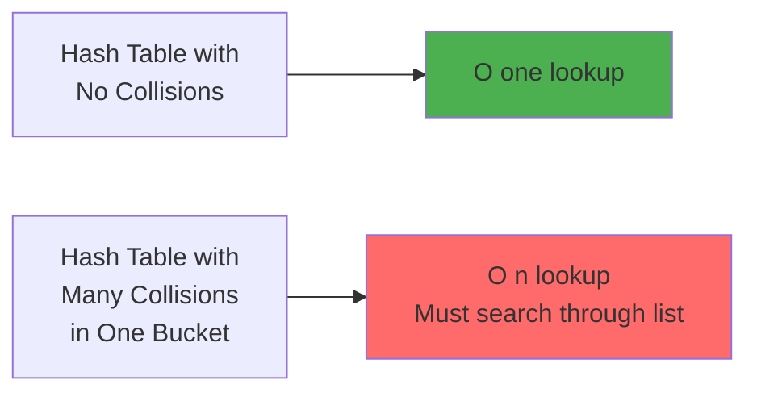
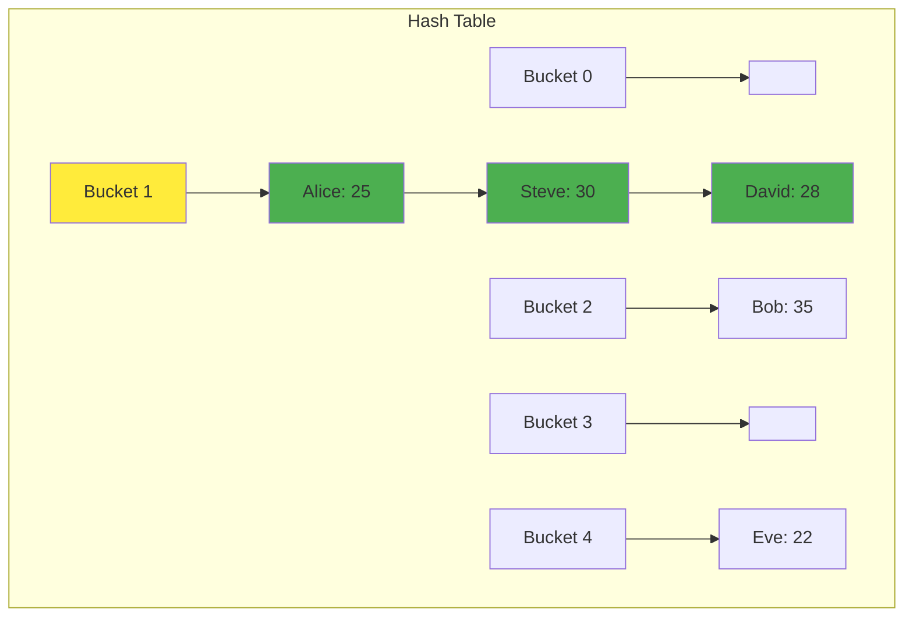
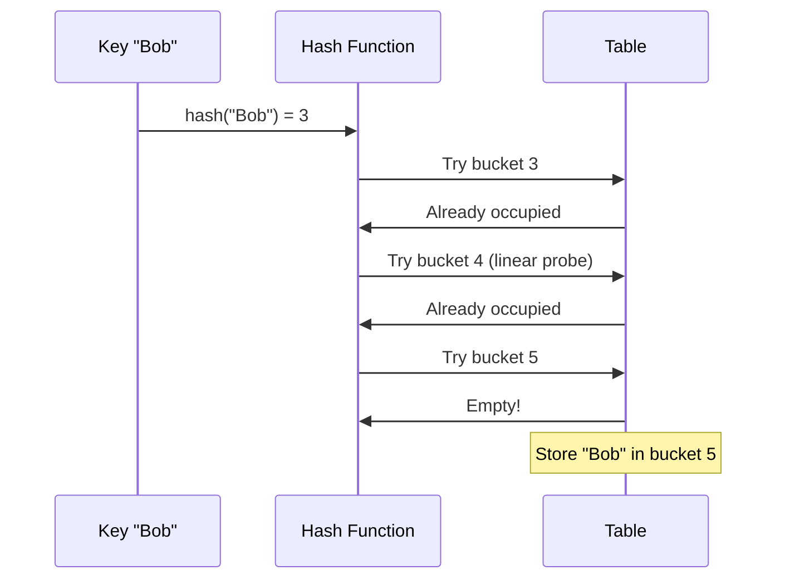
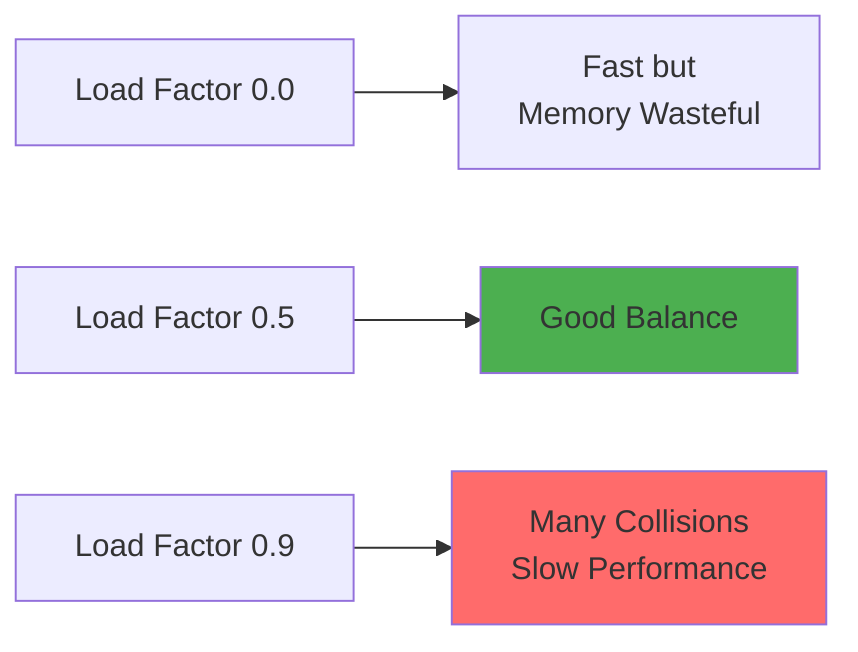
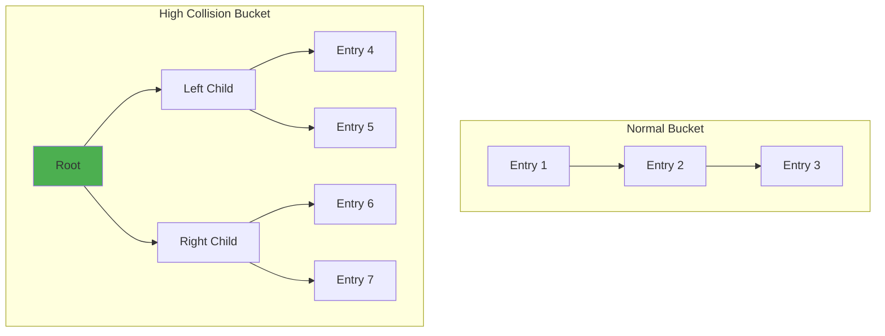
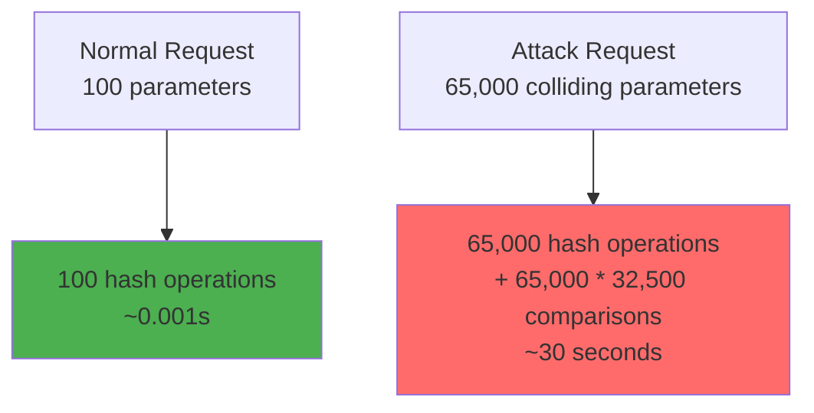

December 28th, 2011. Web servers across the internet started crashing. PHP, Java, Python, Ruby applications all fell like dominos. The culprit? A few carefully crafted HTTP POST requests with specific parameter names.

The attackers had found something interesting: they could send data that would hash to the same value repeatedly. Instead of O(1) lookups, hash tables degraded to O(n). **A single request with 65,000 parameters could take 30 seconds to process**, bringing servers to their knees.

This wasn't a buffer overflow or SQL injection. This was a **hash collision attack**. And it worked because of a fundamental property of hash tables that most developers don't fully understand.

Let's explore what hash collisions are, why they matter, and how to handle them properly.

## The Problem: When Two Keys End Up in the Same Bucket

Think of a hash table like an apartment building with 100 units. When someone wants to rent an apartment, you run their name through a function that tells you which unit to assign them to:

```javascript
function assignApartment(name) {
  return name.length % 100;  // Simple hash function
}
```

"Alice" (5 letters) gets apartment 5. "Charlie" (7 letters) gets apartment 7. This works great until "Steve" (5 letters) shows up. According to the function, Steve also gets apartment 5. But Alice is already there.

This is a **collision**: two different keys producing the same hash value.

In real hash tables, collisions are inevitable. Here's why:

```mermaid
graph TB
    subgraph "Infinite Possible Keys"
        K1[user@email.com]
        K2[another@email.com]
        K3[third@email.com]
        K4[fourth@email.com]
        K5[...]
        K6[billions of possible keys]
    end
    
    subgraph "Finite Hash Table"
        H1[Bucket 0]
        H2[Bucket 1]
        H3[Bucket 2]
        H4[Bucket 3]
        H5[...]
    end
    
    K1 --> H2
    K2 --> H2
    K3 --> H1
    K4 --> H2
    K6 --> H3
    
    style H2 fill:#ff6b6b
```

You have an infinite number of possible keys, but only a fixed number of buckets. By the **pigeonhole principle**, collisions are guaranteed to happen.

## Why Collisions Matter: From O(1) to O(n)

Hash tables promise O(1) average-case performance. But that "average case" assumes collisions are rare and distributed evenly.

When collisions pile up in the same bucket, performance degrades:



Let's see this in action:

A simple test shows the impact:

```python
# Bad hash: everything goes to bucket 0
def bad_hash(key):
    return 0

# Good hash: distributed evenly  
def good_hash(key):
    return hash(key) % 1000

# Result with 10,000 insertions:
# Good hash: 0.0023s
# Bad hash: 0.8912s
# Slowdown: 387.5x
```

The bad hash function causes a **387x slowdown**. This is why hash collisions matter.

## Collision Resolution: Two Main Approaches

Important: **No strategy prevents collisions**. They're mathematically inevitable (pigeonhole principle). What we can do is handle them gracefully when they occur.

When a collision happens, we need a strategy to deal with it. There are two main approaches:

### 1. Separate Chaining: The Linked List Approach

Separate chaining doesn't prevent collisions. Instead, it **accepts them gracefully** by storing multiple entries in the same bucket. Each bucket holds a linked list of all entries that hash to that location.



Notice Bucket 1: Alice, Steve, and David all hashed to the same bucket. Instead of overwriting each other, they form a chain.

**How it handles collisions:**

1. **Insert**: Hash the key to find the bucket. If something's already there, add to the end of the chain.
2. **Lookup**: Hash the key, go to that bucket, then walk through the chain comparing keys until you find a match.
3. **No data loss**: Every entry gets stored, even with collisions.

**Example of collision handling:**

```python
# Both "Alice" and "Steve" hash to bucket 1
hash("Alice") = 1
hash("Steve") = 1  # Collision!

# Step 1: Insert Alice
table[1] = [("Alice", 25)]

# Step 2: Insert Steve (collision occurs)
# Instead of overwriting, we add to the chain
table[1] = [("Alice", 25), ("Steve", 30)]

# Step 3: Lookup Steve
# Go to bucket 1, walk through chain:
#   - Check "Alice" != "Steve", continue
#   - Check "Steve" == "Steve", found it!
```

**Why this works:**

Collisions slow you down (you have to search the chain), but they don't break anything. With a good hash function, most buckets have 0-2 items, so chains stay short and searches stay fast.

**Pros:**
- Simple to implement
- Never runs out of space (chains can grow infinitely)
- Works well even with high load factors
- Every piece of data is preserved

**Cons:**
- Extra memory for storing linked list pointers
- Poor cache locality (list nodes scattered in memory)
- Long chains slow down lookups (but rare with good hash functions)

### 2. Open Addressing: The Probing Approach

Instead of chains, open addressing finds another empty spot in the table when a collision occurs.



**Three probing strategies:**

#### Linear Probing

Check the next bucket sequentially:

```python
class HashTableLinearProbing:
    def __init__(self, size=10):
        self.size = size
        self.table = [None] * size
        self.keys = [None] * size
    
    def insert(self, key, value):
        bucket = hash(key) % self.size
        # Linear probing: check next slots
        while self.keys[bucket] is not None:
            if self.keys[bucket] == key:
                self.table[bucket] = value
                return
            bucket = (bucket + 1) % self.size
        self.keys[bucket] = key
        self.table[bucket] = value
    
    def get(self, key):
        bucket = hash(key) % self.size
        while self.keys[bucket] is not None:
            if self.keys[bucket] == key:
                return self.table[bucket]
            bucket = (bucket + 1) % self.size
        raise KeyError(key)
```

**Problem: Primary clustering**

Linear probing creates clusters of occupied slots:

```
[X][X][X][X][ ][X][ ][ ][ ][ ]
 ↑
 Cluster: any key hashing here
 must probe through 4 slots
```

#### Quadratic Probing

Instead of checking the next slot, jump by quadratic distances (1², 2², 3²...). Reduces primary clustering but can cause secondary clustering.

#### Double Hashing

Use a second hash function to determine the step size. Best distribution, minimal clustering.

**Open Addressing Comparison:**

| Method | Clustering | Complexity | Best For |
|--------|-----------|------------|----------|
| Linear Probing | High (primary) | Simple | Cache-friendly, small tables |
| Quadratic Probing | Medium (secondary) | Moderate | General purpose |
| Double Hashing | Low | Complex | Large tables, high load |

**Pros of Open Addressing:**
- Better cache locality
- No extra memory for pointers
- Faster for small data types

**Cons:**
- Must keep load factor low (< 0.7)
- Deletion is tricky (can't just remove)
- Table can fill up

## Load Factor: The Critical Metric

The **load factor** is the ratio of stored entries to table size:

```
load_factor = n / m

n = number of entries
m = table size
```

**Impact on performance:**



**Performance impact:**

| Load Factor | Insert Time | Lookup Time |
|-------------|-------------|-------------|
| 0.25 | 0.0012s | 0.0008s |
| 0.50 | 0.0019s | 0.0013s |
| 0.75 | 0.0047s | 0.0039s |
| 0.90 | 0.0193s | 0.0187s |

At 90% load, operations are **16x slower** than at 25% load.

**Standard load factor thresholds:**
- **Separate chaining**: 1.0 (rehash when table is full)
- **Open addressing**: 0.7 (rehash at 70% full)

## Real-World Implementations

### Java HashMap: From Linked Lists to Trees

Java's HashMap uses separate chaining, but with a twist. When a bucket gets too many collisions, it switches from a linked list to a balanced tree.



**The logic:**

```java
// Simplified version of Java 8+ HashMap
static final int TREEIFY_THRESHOLD = 8;
static final int UNTREEIFY_THRESHOLD = 6;

// When a bucket has 8+ entries
if (binCount >= TREEIFY_THRESHOLD - 1) {
    treeifyBin(tab, hash);  // Convert to tree
}

// When entries drop below 6
if (node instanceof TreeNode) {
    if (size < UNTREEIFY_THRESHOLD) {
        // Convert back to list
    }
}
```

**Why this works:**
- Most buckets have 0-3 entries (good hash distribution)
- A few buckets might get many entries (collision attack)
- Trees limit worst-case lookup to O(log n) instead of O(n)

This change in Java 8 prevented the 2011-style hash collision attacks.

### Python Dictionary: Compact and Fast

Python uses open addressing with a sophisticated probing algorithm:

```python
# Python's probing (simplified)
def python_probe(hash_value, i, table_size):
    perturb = hash_value
    j = (5 * i + perturb + 1) % table_size
    perturb >>= 5  # Shift right by 5 bits
    return j
```

**Key innovations:**
1. **Compact layout**: Keys and values stored separately for better cache performance
2. **Perturbed probing**: Uses upper bits of hash to avoid clustering
3. **Dynamic resizing**: Grows at 67% load factor

## The 2011 Hash Collision Attack

On December 28, 2011, researchers revealed a vulnerability affecting most web frameworks. Here's how it worked:

### The Attack Mechanism

Attackers found keys that all hash to the same value:

```python
def simple_hash(s):
    """Vulnerable hash function"""
    h = 0
    for char in s:
        h = (h * 33) + ord(char)
    return h % 1000

# Attacker generates 65,000 keys that all hash to value 42
# Then sends them as HTTP POST parameters
# POST /?key_1=val&key_2=val&...&key_65000=val
```

**The impact:**



A single request could tie up a CPU core for 30 seconds. A few dozen requests would crash the server.

### The Fix: Randomized Hash Seeds

The solution was to add randomness to hash functions:

```python
import random

class SecureHashTable:
    def __init__(self, size=10):
        self.size = size
        self.table = [[] for _ in range(size)]
        self.seed = random.randint(0, 2**32 - 1)  # Random seed per instance
    
    def _hash(self, key):
        # Include seed in hash calculation
        return hash((key, self.seed)) % self.size
```

**Why this works:**
- Each server instance has a different seed
- Attacker can't predict which keys will collide
- Pre-computed collision sets become useless

Modern languages now use randomized hashing by default.

## Choosing a Good Hash Function

A good hash function should:
1. **Distribute keys uniformly**
2. **Be fast to compute**
3. **Minimize collisions**

### Bad Hash Function Example

```python
def bad_hash(s):
    """Only looks at first character"""
    return ord(s[0]) % 100

# All these collide:
bad_hash("apple")   # 97 % 100 = 97
bad_hash("avocado") # 97 % 100 = 97
bad_hash("apricot") # 97 % 100 = 97
```

### Better Hash Function

```python
def djb2_hash(s):
    """DJB2 hash - well-distributed"""
    h = 5381
    for char in s:
        h = ((h << 5) + h) + ord(char)  # h * 33 + c
    return h

# Much better distribution
djb2_hash("apple")   # 177573
djb2_hash("avocado") # 5860410
djb2_hash("apricot") # 5859955
```

### Production Hash Functions

| Function | Speed | Collision Rate | Use Case |
|----------|-------|----------------|----------|
| **MurmurHash3** | Very Fast | Low | General purpose, non-crypto |
| **xxHash** | Extremely Fast | Very Low | High performance apps |
| **CityHash** | Fast | Low | Google's general hasher |
| **SHA-256** | Slow | Cryptographic | Security-critical data |

## Practical Tips: Handling Collisions in Production

### 1. Monitor Your Load Factor

Track the ratio of entries to table size. Rehash when it exceeds 0.75 for chaining or 0.7 for open addressing.

```python
load_factor = entries / table_size
if load_factor > 0.75:
    resize_and_rehash()
```

### 2. Choose the Right Initial Size

```python
# If you expect 1000 entries, start with size 1333
initial_size = expected_entries / 0.75  # 1000 / 0.75 = 1333
```

### 3. Use Language Built-ins

Don't reinvent the wheel. Use built-in hash tables:
- **Python**: `dict`
- **Java**: `HashMap`
- **JavaScript**: `Map`
- **Rust**: `HashMap`

They handle optimal hash functions, load factor management, automatic resizing, and security (randomized hashing).

## When Collisions Become a Feature

Interestingly, hash collisions aren't always bad. Some data structures **intentionally** use collisions:

### Bloom Filters

Bloom filters use multiple hash functions and expect collisions. They can tell you "definitely not present" or "maybe present" with a small memory footprint.

Used by Chrome (malicious URLs), Cassandra (reducing disk reads), and Bitcoin wallets (checking transactions).

## Key Takeaways

**Hash collisions are inevitable, but manageable:**

1. **Choose the right collision resolution**
   - Separate chaining: Simple, handles high load
   - Open addressing: Faster, better cache performance

2. **Monitor load factor**
   - Chaining: < 1.0
   - Open addressing: < 0.7

3. **Use good hash functions**
   - Uniform distribution
   - Fast computation
   - Randomized for security

4. **Watch for performance degradation**
   - Profile your hash distribution
   - Rehash when load factor gets too high

5. **Trust modern implementations**
   - Java HashMap: Switches to trees at 8+ collisions
   - Python dict: Compact and fast open addressing
   - Modern languages: Randomized hashing prevents attacks

**Remember:** Your hash table's O(1) promise depends entirely on how well you handle collisions. Choose wisely, monitor closely, and rehash when needed.

---

*For more on data structures and algorithms, check out our posts on [Skip Lists](/data-structures/skip-list/) (when you need sorted data with O(log n) operations), [Distributed Systems](/distributed-systems/paxos/), [Write-Ahead Logs](/distributed-systems/write-ahead-log/), and [System Design at Scale](/whatsapp-scaling-secrets/).*

