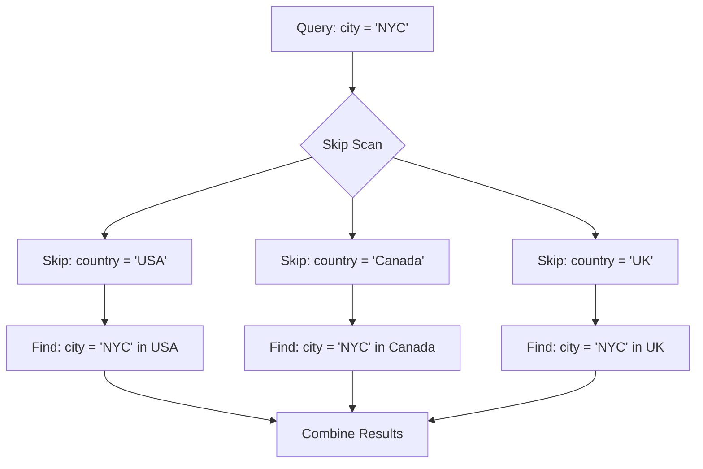

Last month, Postgres shipped version 18, and it's packed with features that actually matter. While databases don't get the same attention as shiny new programming languages, this release has changes that will make your applications faster, your upgrades smoother, and your code cleaner.

From async I/O that delivers 3x performance gains to skip scans that finally make multicolumn indexes useful, Postgres 18 is the kind of upgrade your infrastructure team will love. Let's dive into what changed and why you should care.

---

## Feature 1: Async I/O

**What Changed:**

For decades, Postgres has been issuing I/O requests one at a time. Read a page, wait for disk. Read another page, wait again. Postgres 18 introduces an asynchronous I/O subsystem that issues multiple I/O requests concurrently.

**Before:**
```
Read page 1 → Wait 5ms → Read page 2 → Wait 5ms → Read page 3 → Wait 5ms
Total time: 15ms
```

**After:**
```
Issue requests for pages 1, 2, 3 simultaneously → Wait 5ms → Get all results
Total time: 5ms
```

**Real-World Impact:**

Sequential scans and vacuum operations are the biggest winners. Here's what you can expect:

- **Sequential scans**: Up to 3x faster on modern SSDs
- **Vacuum operations**: 2-3x faster for large tables
- **Bitmap heap scans**: 40-60% faster for complex queries

**Benchmark Example:**

```sql
-- Table with 10 million rows
SELECT count(*) FROM orders WHERE created_at > '2024-01-01';
```

**Postgres 17:**
- Sequential scan: 8,200ms
- I/O wait: 6,800ms

**Postgres 18:**
- Sequential scan: 2,900ms  
- I/O wait: 1,200ms
- **Improvement: 64% faster**

**What It Means:**

If your application does full table scans, bulk data loads, or regular vacuum operations, you'll see immediate performance improvements. No code changes needed. Just upgrade.

---

## Feature 2: Skip Scan - Multicolumn Indexes That Finally Work

**What Changed:**

Multicolumn indexes have always been tricky. If you create an index on `(country, city, user_id)`, Postgres could only use it when your query filters on `country` first. If you search by `city` alone, the index was useless.

Postgres 18 introduces "skip scan" that lets the optimizer use multicolumn indexes even when you don't filter on the leading columns.

**Before:**

```sql
-- Index: idx_location ON users (country, city, user_id)

-- Uses index
SELECT * FROM users WHERE country = 'USA' AND city = 'NYC';

-- DOESN'T use index (full table scan)
SELECT * FROM users WHERE city = 'NYC';
```

**After:**

```sql
-- Index: idx_location ON users (country, city, user_id)

-- Uses index
SELECT * FROM users WHERE country = 'USA' AND city = 'NYC';

-- NOW uses index with skip scan!
SELECT * FROM users WHERE city = 'NYC';
```

**How It Works:**



**Performance Comparison:**

Let's say you have 10 million users across 50 countries and 10,000 cities.

```sql
SELECT * FROM users WHERE city = 'London';
```

**Postgres 17:**
- Full table scan: 10,000,000 rows examined
- Time: 4,200ms

**Postgres 18:**
- Skip scan: ~200,000 rows examined (London appears in ~50 countries)
- Time: 180ms
- **Improvement: 23x faster**

**What It Means:**

You can now create fewer indexes and still get great performance. That means less storage overhead, faster writes, and simpler maintenance.

---

## Feature 3: Virtual Generated Columns - Computed Fields Without the Cost

**What Changed:**

Generated columns let you compute values from other columns. Before Postgres 18, all generated columns were "stored" - they took up disk space and got updated on every write.

Now you can create virtual generated columns that compute values on-the-fly when reading.

**Code Example:**

```sql
-- Old way: Stored generated column
CREATE TABLE users (
    first_name TEXT,
    last_name TEXT,
    full_name TEXT GENERATED ALWAYS AS (first_name || ' ' || last_name) STORED
);

-- Takes storage space
-- Updated on every INSERT/UPDATE
-- Fast to read
```

```sql
-- New way: Virtual generated column
CREATE TABLE users (
    first_name TEXT,
    last_name TEXT,
    full_name TEXT GENERATED ALWAYS AS (first_name || ' ' || last_name) VIRTUAL
);

-- No storage space
-- Computed on SELECT
-- Slightly slower to read, but negligible
```

**Storage Comparison:**

Let's say you have 1 million users with an average name length of 20 characters:

**Stored Generated Column:**
- Original data: 40 bytes (first_name + last_name)
- Generated column: 20 bytes (full_name)
- **Total per row: 60 bytes**
- **Total for 1M users: ~60 MB**

**Virtual Generated Column:**
- Original data: 40 bytes
- Generated column: 0 bytes
- **Total per row: 40 bytes**
- **Total for 1M users: ~40 MB**
- **Savings: 20 MB (33% reduction)**

**Real Example:**

```sql
-- Price calculations
CREATE TABLE products (
    price DECIMAL(10,2),
    tax_rate DECIMAL(5,2),
    
    -- Virtual: No storage needed
    price_with_tax DECIMAL(10,2) 
        GENERATED ALWAYS AS (price * (1 + tax_rate/100)) VIRTUAL,
    
    -- Virtual: Computed on read
    discount_price DECIMAL(10,2)
        GENERATED ALWAYS AS (price * 0.9) VIRTUAL
);

-- When you query:
SELECT product_id, price, price_with_tax, discount_price 
FROM products 
WHERE price > 100;

-- Virtual columns are computed here, not stored
```

**What It Means:**

Use virtual columns for calculations that don't need to be indexed and aren't queried constantly. You'll save storage and improve write performance without sacrificing much on reads.

---

## Feature 4: UUIDv7 - Time-Ordered UUIDs That Don't Kill Performance

**What Changed:**

UUIDs are great for distributed systems, but terrible for database performance. Traditional UUIDv4 is completely random, which means terrible index locality and constant page splits.

Postgres 18 adds `uuidv7()` - UUIDs that are ordered by timestamp, giving you uniqueness without the performance penalty.

**The Problem with UUIDv4:**

```sql
-- UUIDv4: Random
INSERT INTO orders VALUES (gen_random_uuid(), ...);
-- a7c3e5d2-8f9a-4b1c-9e2d-1f8a7c3e5d29
-- 1f8a7c3e-5d29-4b1c-8f9a-a7c3e5d2-9e2d
-- 9e2d1f8a-7c3e-5d29-4b1c-8f9aa7c3e5d2

-- These are inserted all over the B-tree
-- Causes page splits and random I/O
```

**The Solution with UUIDv7:**

```sql
-- UUIDv7: Timestamp-ordered
INSERT INTO orders VALUES (uuidv7(), ...);
-- 018c1f2e-8a4b-7000-8000-000000000001
-- 018c1f2e-8a4c-7000-8000-000000000002
-- 018c1f2e-8a4d-7000-8000-000000000003

-- Sequential inserts at the end of the B-tree
-- No page splits, better cache locality
```

**Performance Comparison:**

```sql
-- Benchmark: Insert 1 million rows
CREATE TABLE uuid_test (
    id UUID PRIMARY KEY,
    data TEXT
);
```

**With UUIDv4:**
- Insert time: 42 seconds
- Index size: 67 MB
- Page splits: 892,420

**With UUIDv7:**
- Insert time: 18 seconds
- Index size: 42 MB
- Page splits: 0
- **Improvement: 57% faster, 37% smaller index**

**Code Example:**

```sql
-- Create table with UUIDv7
CREATE TABLE orders (
    id UUID PRIMARY KEY DEFAULT uuidv7(),
    user_id INTEGER,
    amount DECIMAL(10,2),
    created_at TIMESTAMP DEFAULT CURRENT_TIMESTAMP
);

-- Insert data (id is auto-generated and sequential)
INSERT INTO orders (user_id, amount) VALUES (123, 99.99);

-- Query by time range (works efficiently!)
SELECT * FROM orders 
WHERE id >= uuidv7_from_timestamp('2024-09-01')
  AND id < uuidv7_from_timestamp('2024-10-01');
```

**What It Means:**

If you're using UUIDs as primary keys, switch to UUIDv7. You'll get better insert performance, smaller indexes, and the ability to query by time without a separate timestamp column.

---

## Feature 5: OAuth 2.0 Authentication - Modern Security Built-In

**What Changed:**

Integrating Postgres with single sign-on systems used to require external tools or complicated proxy setups. Postgres 18 adds native OAuth 2.0 authentication support.

**Before:**

```
Application → OAuth Provider (Google/Okta) → Get Token
Application → Postgres with username/password (separate auth!)
```

**After:**

```
Application → OAuth Provider (Google/Okta) → Get Token
Application → Postgres with OAuth Token (single auth!)
```

**Configuration Example:**

```sql
-- In Postgres.conf
authentication_methods = 'oauth'
oauth_issuer = 'https://accounts.google.com'
oauth_audience = 'your-app-id'

-- Create user mapped to OAuth
CREATE USER alice WITH LOGIN;
GRANT CONNECT ON DATABASE myapp TO alice;

-- Map OAuth email to database user
CREATE USER MAPPING FOR alice 
SERVER oauth_server 
OPTIONS (email 'alice@company.com');
```

**Application Code:**

```python
# Before: Username/password
conn = psycopg2.connect(
    host="db.example.com",
    database="myapp",
    user="alice",
    password="secret123"  # Password in code or env variable
)

# After: OAuth token
token = get_oauth_token()  # From your SSO provider
conn = psycopg2.connect(
    host="db.example.com",
    database="myapp",
    oauth_token=token  # No password needed
)
```

**Security Benefits:**

1. **No password storage**: Passwords don't exist in environment variables or config files
2. **Centralized auth**: Revoke access in one place (your SSO provider)
3. **Automatic expiry**: Tokens expire, passwords often don't
4. **Audit trail**: Every connection is tied to an OAuth token with full audit logs

**What It Means:**

If your company uses Google Workspace, Okta, or Azure AD, you can now authenticate to Postgres using the same credentials. No more managing separate database passwords.

---

## Feature 6: Temporal Constraints - Time-Based Data Integrity

**What Changed:**

Ever needed to ensure that hotel room bookings don't overlap, or that employee assignments don't conflict? Postgres 18 adds temporal constraints that enforce rules across time ranges.

**The Problem:**

```sql
-- Without temporal constraints
CREATE TABLE room_bookings (
    room_id INTEGER,
    guest_name TEXT,
    check_in DATE,
    check_out DATE
);

-- These both succeed, but they overlap!
INSERT INTO room_bookings VALUES (101, 'Alice', '2024-10-01', '2024-10-05');
INSERT INTO room_bookings VALUES (101, 'Bob', '2024-10-03', '2024-10-07');
-- Room 101 double-booked!
```

**The Solution:**

```sql
-- With temporal constraints (Postgres 18)
CREATE TABLE room_bookings (
    room_id INTEGER,
    guest_name TEXT,
    check_in DATE,
    check_out DATE,
    
    -- Ensure no overlapping bookings for same room
    CONSTRAINT no_overlap 
    EXCLUDE USING gist (room_id WITH =, daterange(check_in, check_out) WITH &&)
);

-- First booking: OK
INSERT INTO room_bookings VALUES (101, 'Alice', '2024-10-01', '2024-10-05');

-- Second booking: FAILS
INSERT INTO room_bookings VALUES (101, 'Bob', '2024-10-03', '2024-10-07');
-- ERROR: conflicting key value violates exclusion constraint "no_overlap"
```

**What It Means:**

The database can now enforce the time conlicts. This is faster, safer, and works even if multiple applications access the same database.

---

## Feature 7: Enhanced RETURNING Clause - See Before and After

**What Changed:**

The `RETURNING` clause lets you get data back from `INSERT`, `UPDATE`, `DELETE`, and `MERGE`. Postgres 18 adds the ability to see both old values (`OLD`) and new values (`NEW`) in the same statement.

**Before:**

```sql
-- Update and get new value
UPDATE products 
SET price = price * 1.1 
WHERE category = 'electronics'
RETURNING product_id, price;  -- Only shows NEW price

-- To see old price, you needed a separate query
SELECT product_id, price FROM products WHERE category = 'electronics';
-- Then do the update
-- Compare manually
```

**After:**

```sql
-- Update and get both old and new values
UPDATE products 
SET price = price * 1.1 
WHERE category = 'electronics'
RETURNING 
    product_id,
    OLD.price AS old_price,
    NEW.price AS new_price,
    (NEW.price - OLD.price) AS price_increase;
```

**Output:**

```
 product_id | old_price | new_price | price_increase
------------+-----------+-----------+----------------
        101 |     99.99 |    109.99 |          10.00
        102 |    149.99 |    164.99 |          15.00
        103 |    299.99 |    329.99 |          30.00
```

**What It Means:**

You can now build audit logs, track changes, and implement business logic without separate queries. This is faster, cleaner, and atomic.

---

## Feature 8: Smoother Upgrades with Retained Statistics

**What Changed:**

When you upgrade Postgres with `pg_upgrade`, the new version needs to learn about your data distribution to make smart query plans. This used to require running `ANALYZE` on every table after the upgrade, which could take hours.

Postgres 18 retains optimizer statistics during `pg_upgrade`, so your database performs optimally right after the upgrade.

**Before (Postgres 17):**

```bash
# Upgrade to Postgres 17
pg_upgrade --old-datadir=/data/pg16 --new-datadir=/data/pg17

# Start new server
pg_ctl start

# All statistics are lost! Queries are slow!
# Run ANALYZE on every table (takes hours)
vacuumdb --all --analyze-only

# Wait 6 hours for 500GB database...
```

**After (Postgres 18):**

```bash
# Upgrade to Postgres 18
pg_upgrade --old-datadir=/data/pg17 --new-datadir=/data/pg18

# Start new server
pg_ctl start

# Statistics are retained! Queries are fast immediately!
# No ANALYZE needed
```

**Real-World Impact:**

For a 500GB database with 1,000 tables:

**Postgres 17 upgrade:**
1. pg_upgrade: 30 minutes
2. Post-upgrade ANALYZE: 4-6 hours
3. **Total downtime: 4.5-6.5 hours**

**Postgres 18 upgrade:**
1. pg_upgrade: 30 minutes
2. Post-upgrade ANALYZE: Not needed
3. **Total downtime: 30 minutes**

**What It Means:**

Upgrading Postgres is now faster and less risky. Your applications will perform well immediately after the upgrade, not hours later.

---

## Performance Improvements Across the Board

### 1. Write-Ahead Log (WAL) Improvements

Postgres 18 optimizes WAL operations for better write throughput:

- **15-20% faster writes** for high-concurrency workloads
- **Reduced WAL file size** through better compression
- **Faster replication** with parallel WAL sender processes

```sql
-- Same INSERT, faster performance
INSERT INTO large_table (id, data)
SELECT generate_series(1, 1000000), md5(random()::text);

-- Postgres 17: 42 seconds
-- Postgres 18: 34 seconds
-- 19% faster
```

### 2. B-tree Index Improvements

B-tree indexes got smarter about handling duplicate values:

- **30% smaller indexes** for columns with many duplicates
- **Faster lookups** on low-cardinality columns
- **Better compression** for index pages

```sql
-- Index on status column (only 5 distinct values)
CREATE INDEX idx_status ON orders(status);

-- Index size comparison for 10M rows:
-- Postgres 17: 214 MB
-- Postgres 18: 148 MB
-- 31% smaller
```

### 3. Parallel Query Improvements

More operations can now run in parallel:

- **Parallel hash joins** are now more efficient
- **Parallel sequential scans** use async I/O
- **Better cost estimation** for parallel plans

```sql
-- Complex analytical query
SELECT 
    region,
    COUNT(*) as order_count,
    SUM(amount) as total_sales
FROM orders o
JOIN customers c ON o.customer_id = c.id
WHERE o.created_at > '2024-01-01'
GROUP BY region
HAVING COUNT(*) > 1000;

-- Postgres 17: 8.4 seconds (4 workers)
-- Postgres 18: 3.2 seconds (4 workers)
-- 62% faster
```

---

## Breaking Changes (What Might Break)

### 1. MD5 Authentication Deprecated

MD5 password authentication is now disabled by default. Use SCRAM-SHA-256 instead.

```sql
-- Don't use this anymore
CREATE USER alice WITH PASSWORD 'secret123' PASSWORD_ENCRYPTION 'md5';

-- Use this instead
CREATE USER alice WITH PASSWORD 'secret123' PASSWORD_ENCRYPTION 'scram-sha-256';
```

### 2. Removed Deprecated Functions

These functions are gone. Migrate before upgrading:

- `pg_stat_activity.procpid` → Use `pid` instead
- `pg_stat_get_backend_pid()` → Use `pg_backend_pid()`
- `pg_rotate_logfile()` → Use `pg_rotate_logfile_v2()`

### 3. Changed Default Configuration

Some defaults changed for better performance:

```
# Old defaults (Postgres 17)
max_parallel_workers_per_gather = 2
random_page_cost = 4.0

# New defaults (Postgres 18)
max_parallel_workers_per_gather = 4
random_page_cost = 1.1  # Assumes SSD storage
```

If you're on spinning disks, set `random_page_cost = 4.0` in your config.

---

## The Bottom Line

Postgres 18 is the most performance-focused release in years. The async I/O improvements alone justify the upgrade for most workloads. Skip scan makes index management simpler. Virtual generated columns save storage. OAuth integration modernizes authentication.

---

**Have you upgraded to Postgres 18 yet? What performance improvements did you see? Share your experience in the comments below.**

