On October 20, 2025, Amazon Web Services experienced one of its most significant outages in recent years. A network load balancer bug in the US-East-1 region brought down Netflix, Snapchat, Reddit, Robinhood, Fortnite, and countless other services for 12 hours. Here's what happened and what developers need to learn.

---

## Timeline: 12 Hours of Chaos

All times in EDT (Eastern Daylight Time):

```mermaid
gantt
    dateFormat HH:mm
    axisFormat %I:%M %p
    
    section Detection
    Errors detected        :done, 03:11, 2h
    
    section Investigation
    Root cause found       :done, 05:00, 1.5h
    
    section Fix
    Issue resolved         :done, 06:35, 3h
    
    section Recovery
    Services returning     :done, 09:45, 5h
    
    section Complete
    Full resolution        :done, 15:00, 1h
```

**03:11 AM EDT** - AWS detected increased error rates and latencies across multiple services in US-East-1. Applications started timing out.

**05:00 AM EDT** - Root cause identified: DNS resolution failure affecting DynamoDB API endpoint. The network load balancer health check system malfunctioned, marking healthy servers as dead. DNS couldn't find targets, so applications couldn't connect to DynamoDB.

**06:35 AM EDT** - AWS fixed the monitoring system, but the fix needed hours to propagate through caching and routing layers.

**09:45 AM EDT** - Most services returning to normal, though high-traffic apps still saw delays.

**03:00 PM EDT** - Full resolution confirmed. Some systems still processing backlogged requests.

---

## What Broke

AWS network load balancers use a health check system to monitor if backend servers are working. That system malfunctioned - it marked healthy servers as dead. The load balancer stopped routing traffic, causing DNS queries to fail.

The cascade: DynamoDB became unreachable → Lambda functions timed out → API Gateway failed → CloudWatch logging broke → everything dependent on these services went down.

**Why US-East-1 matters:** It's AWS's oldest (2006), largest, and cheapest region. It's the default in AWS documentation. When it goes down, the impact is massive.

---

## Why This Keeps Happening

This isn't US-East-1's first outage. The region has a history of significant problems:

- **December 2021** - Network device issue caused multi-hour outage affecting AWS Lambda, RDS, and other services
- **November 2020** - Kinesis failure cascaded to CloudWatch, Cognito, and other dependent services
- **September 2015** - DynamoDB failure took down multiple AWS services
- **October 2012** - Power outage hit multiple availability zones

**Why companies still use it:**
- **Legacy Infrastructure** - Oldest region with most accumulated technical debt
- **Default Choice** - AWS documentation and tools default to US-East-1
- **Cost Savings** - Cheapest region, companies pick it to save money
- **Migration Difficulty** - Moving established infrastructure is expensive and risky
- **Network Effects** - More services available here first

Companies know US-East-1 is risky, but cost and convenience keep pulling them back.

---

## Impact

**Affected services:** Snapchat, Reddit, Fortnite, Roblox, Robinhood, Venmo, Netflix, Disney+, Prime Video, Canvas, Duolingo, and Amazon's retail services.

**The cost:** Millions of users affected, hundreds of thousands of applications down, potential revenue losses in hundreds of millions across all businesses.

---

## Key Lessons for Developers

### 1. Multi-Region Is Not Optional

Single region = single point of failure. Deploy across at least two regions with Route53 health checks and data replication. Test failover regularly. Yes, it costs more - but compare that to 12 hours of downtime.

### 2. Design for Failure

AWS's 99.99% uptime promise allows 52 minutes of downtime per year. We just saw 12 hours. Implement circuit breakers, retry logic, timeouts, and graceful degradation. Can you serve cached data when databases are down?

### 3. Monitor From Outside AWS

Use external monitoring (Datadog, New Relic) that doesn't depend on AWS. Many teams learned they were down from customers, not their monitoring.

### 4. Have an Incident Plan and Status Page

You need detection, communication, triage, mitigation, recovery, and post-mortem processes documented. During outages, silence kills trust - update customers regularly.

### 5. Test Your Disaster Recovery

Untested DR plans are wishful thinking. Run quarterly failover drills and chaos engineering experiments. Netflix's Chaos Monkey randomly kills servers - if you survive random failures, you can survive real ones.

---

## The Bottom Line

A network load balancer health check bug caused DNS failures that cascaded into a 12-hour outage affecting millions. The lesson: **single points of failure will fail.**

Build resilient systems with multi-region deployment, failure handling, external monitoring, incident plans, and regular testing. The next outage is coming. Will your application be ready?

---

**Resources:**
- [AWS Well-Architected Framework](https://aws.amazon.com/architecture/well-architected/)
- [Building Multi-Region Applications](https://aws.amazon.com/blogs/architecture/disaster-recovery-dr-architecture-on-aws-part-i-strategies-for-recovery-in-the-cloud/)
- [Chaos Engineering Principles](https://principlesofchaos.org/)

