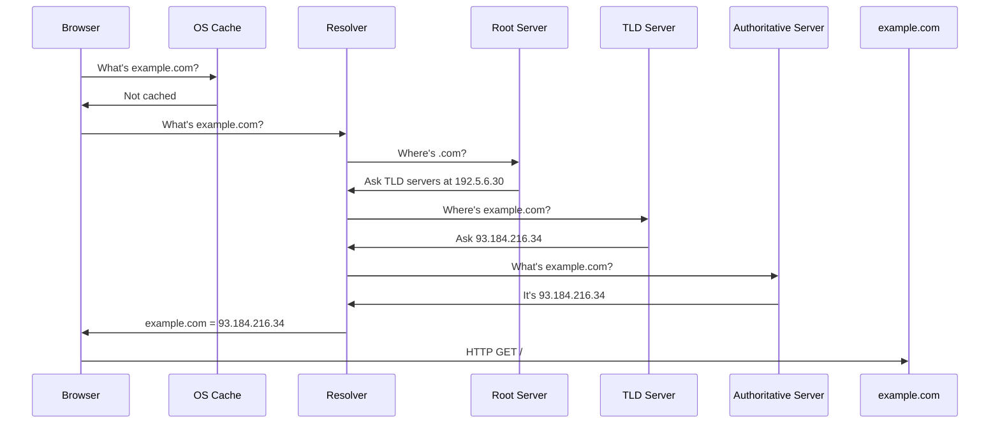
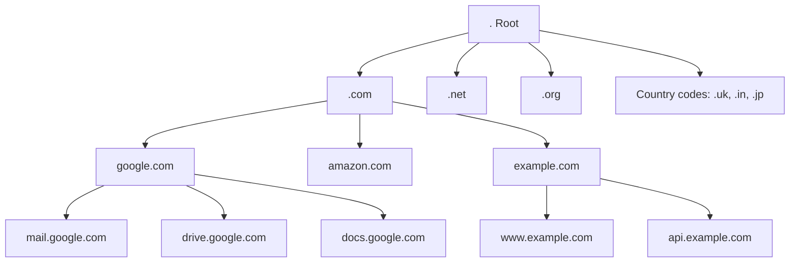
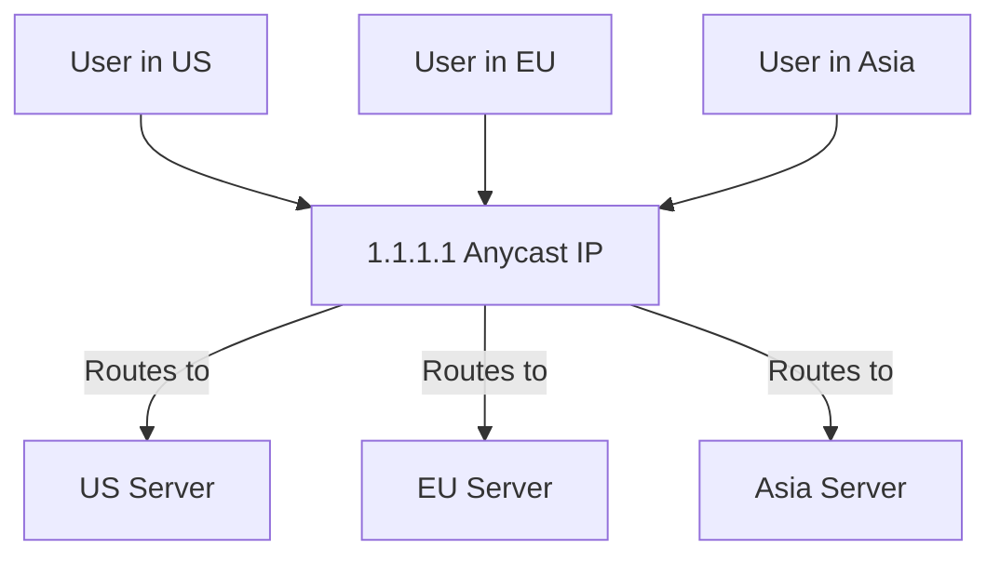

You type `google.com` into your browser. Half a second later, Google's homepage appears. Between those two moments, your computer talked to at least four different servers, checked multiple caches, and navigated a global distributed database with billions of records.

That's DNS. It's the phonebook of the internet, but calling it a phonebook is like calling a data center "a room with computers." Let's dig into how DNS actually works, why it matters for developers, and what goes wrong when it breaks.

---

## The Problem DNS Solves

Computers talk to each other using IP addresses. `142.250.185.46` is Google's server. But humans don't memorize numbers well. We remember names like `google.com`.

DNS translates names to numbers. That's it. Everything else is optimization, caching, security, and dealing with the internet's massive scale.

Without DNS, you'd need to maintain a text file mapping every domain to its IP address. That's exactly what the internet did in the early 1980s. The entire internet's domains fit in a single file called `HOSTS.TXT`, managed by Stanford Research Institute.

When the internet had a few hundred hosts, that worked fine. But by the early 1980s, managing this single file became impossible. Updates took days to propagate. The file was growing too large. We needed something distributed. DNS was designed in 1983, but the transition from `HOSTS.TXT` took several years. Many systems used both throughout the mid-1980s.

---

## DNS in 60 Seconds

Here's what happens when you visit `example.com`:



Five steps:
1. **OS Cache**: Check if we already know the answer
2. **Root Server**: Find who manages `.com` domains
3. **TLD Server**: Find who owns `example.com`
4. **Authoritative Server**: Get the actual IP address
5. **Return to Browser**: Connect to the IP

Now let's break down what's actually happening at each step.

---

## The DNS Hierarchy

DNS is a tree. At the top sits the root. Below that are top-level domains (TLDs) like `.com`, `.org`, `.net`. Below that are individual domains like `google.com`. Below that are subdomains like `mail.google.com`.



**Root servers** are the foundation. There are 13 of them, labeled A through M. Actually, there are hundreds of physical servers, but they share 13 IP addresses using anycast routing. When you query `a.root-servers.net`, you hit the closest one geographically.

**TLD servers** manage top-level domains. VeriSign runs the `.com` and `.net` servers. PIR runs `.org`. Each country runs its own (like `.uk` or `.in`).

**Authoritative servers** store the actual records. When you buy a domain from GoDaddy or Cloudflare, you're pointing the TLD servers to your authoritative nameserver.

---

## Step-by-Step: A Real DNS Query

Let's trace what happens when you visit `blog.example.com` for the first time. Your laptop has never seen this domain before.

### Step 1: Browser Cache

Your browser maintains its own DNS cache. Chrome keeps records for 60 seconds by default. If you visited `blog.example.com` in the last minute, the browser already knows the answer.

```javascript
// Chrome's internal DNS cache (simplified)
{
  "blog.example.com": {
    "ip": "93.184.216.34",
    "expires": 1634567890,
    "type": "A"
  }
}
```

Miss? Move to the next layer.

### Step 2: Operating System Cache

Your OS caches DNS lookups too. On Linux, this is handled by `systemd-resolved` or `nscd`. On macOS, it's `mDNSResponder`. On Windows, it's the DNS Client service.

```bash
# Check your OS cache on Linux
sudo systemd-resolve --statistics

# Clear OS cache on macOS
sudo dscacheutil -flushcache
sudo killall -HUP mDNSResponder

# Check OS cache on Windows
ipconfig /displaydns
```

Miss? Time to query a DNS resolver.

### Step 3: Recursive Resolver

Your computer sends a query to a recursive resolver. This is usually your ISP's DNS server, or a public one like:

- **Google Public DNS**: `8.8.8.8` and `8.8.4.4`
- **Cloudflare DNS**: `1.1.1.1` and `1.0.0.1`
- **Quad9**: `9.9.9.9`

The resolver's job is to do all the heavy lifting. You ask it once, and it handles the rest.

```bash
# Query a specific DNS server using dig
dig @8.8.8.8 blog.example.com

# See the full resolution path
dig +trace blog.example.com
```

The resolver checks its own cache first. If it recently looked up `blog.example.com` for another user, it returns the cached answer. Cache hit? Done. Cache miss? Start the real work.

### Step 4: Root Server Query

The resolver queries a root server: "Where can I find `.com` domains?"

```
Query: blog.example.com
Root Server Response:
  "I don't know blog.example.com, but .com domains are managed by these servers:
   - a.gtld-servers.net (192.5.6.30)
   - b.gtld-servers.net (192.33.14.30)
   - c.gtld-servers.net (192.26.92.30)"
```

Root servers don't know about specific domains. They only know about TLDs.

### Step 5: TLD Server Query

The resolver queries a `.com` TLD server: "Where can I find `example.com`?"

```
Query: blog.example.com
TLD Server Response:
  "example.com is managed by these authoritative nameservers:
   - ns1.example.com (93.184.216.34)
   - ns2.example.com (93.184.217.34)"
```

TLD servers don't know about subdomains. They only know which nameservers manage each domain.

### Step 6: Authoritative Server Query

The resolver queries the authoritative nameserver: "What's the IP for `blog.example.com`?"

```
Query: blog.example.com
Authoritative Server Response:
  "blog.example.com has these records:
   - A record: 93.184.216.34
   - TTL: 3600 seconds"
```

Finally! The authoritative server knows the answer. It returns the IP address along with a TTL (time to live) that tells the resolver how long to cache the answer.

### Step 7: Return to Client

The resolver returns the answer to your computer:

```
blog.example.com = 93.184.216.34
TTL: 3600 seconds
```

Your OS caches it. Your browser caches it. The resolver caches it. For the next hour, nobody needs to query the authoritative server again.

### Step 8: TCP Connection

Now your browser can finally connect:

```
TCP handshake to 93.184.216.34:443
TLS handshake
HTTP request: GET /index.html
```

The DNS part is done. The rest is standard HTTPS.

---

## DNS Record Types

DNS isn't just IP addresses. It stores different types of records for different purposes.

### A Record (IPv4 Address)

Maps a domain to an IPv4 address.

```
example.com.  A  93.184.216.34
```

### AAAA Record (IPv6 Address)

Maps a domain to an IPv6 address.

```
example.com.  AAAA  2606:2800:220:1:248:1893:25c8:1946
```

### CNAME Record (Alias)

Points one domain to another. Useful for subdomains.

```
www.example.com.  CNAME  example.com.
blog.example.com. CNAME  example.com.
```

When you query `www.example.com`, DNS returns the CNAME, then resolves `example.com` to its A record. This adds one extra lookup.

**Gotcha:** You can't use CNAME at the root domain. `example.com` can't be a CNAME. Only subdomains like `www.example.com` or `api.example.com` can.

### MX Record (Mail Server)

Tells email servers where to deliver mail.

```
example.com.  MX  10  mail.example.com.
example.com.  MX  20  backup-mail.example.com.
```

The number is priority. Lower = higher priority. Email goes to `mail.example.com` first, falls back to `backup-mail.example.com` if it's down.

### TXT Record (Arbitrary Text)

Stores text data. Used for verification and security.

```
example.com.  TXT  "v=spf1 include:_spf.google.com ~all"
example.com.  TXT  "google-site-verification=abc123xyz"
```

Common uses:
- **SPF**: Prevents email spoofing
- **DKIM**: Email signing
- **Domain verification**: Prove you own the domain

### NS Record (Nameserver)

Tells DNS where to find authoritative nameservers.

```
example.com.  NS  ns1.example.com.
example.com.  NS  ns2.example.com.
```

### SOA Record (Start of Authority)

Metadata about the DNS zone.

```
example.com.  SOA  ns1.example.com. admin.example.com. (
  2023101801  ; Serial number
  7200        ; Refresh (2 hours)
  3600        ; Retry (1 hour)
  1209600     ; Expire (2 weeks)
  3600        ; Minimum TTL (1 hour)
)
```

This tells secondary nameservers when to check for updates.

### SRV Record (Service Location)

Points to specific services on specific ports.

```
_http._tcp.example.com.  SRV  10  60  80  server.example.com.
```

Format: `priority weight port target`

Used for protocols like SIP, XMPP, and Minecraft server discovery.

---

## DNS Performance Optimization

DNS lookups add latency. Every extra lookup delays page load. Here's how to optimize.

### 1. Reduce DNS Lookups

Each unique hostname requires a DNS lookup.

```html
<!-- Bad: 5 different hostnames = 5 DNS lookups -->


<script src="https://analytics.example.com/track.js"></script>
<link href="https://fonts.googleapis.com/css?family=Roboto">
<link href="https://api.example.com/data">

<!-- Better: 2 hostnames = 2 DNS lookups -->


<script src="https://cdn.example.com/track.js"></script>
<link href="https://cdn.example.com/font.css">
<link href="https://api.example.com/data">
```

### 2. Use DNS Prefetching

Tell the browser to resolve DNS early, before the user clicks a link.

```html
<link rel="dns-prefetch" href="//api.example.com">
<link rel="dns-prefetch" href="//cdn.example.com">
```

This resolves DNS in parallel while the page loads. When the user clicks a link to `api.example.com`, the browser already knows the IP.

### 3. Use a Fast DNS Provider

Not all DNS providers are equal. Some are faster than others.

**Benchmark comparison (average query time):**

| Provider | Global Avg | US | Europe | Asia |
|----------|-----------|-----|--------|------|
| Cloudflare | 10ms | 8ms | 9ms | 13ms |
| Google Public DNS | 15ms | 12ms | 14ms | 18ms |
| Quad9 | 18ms | 15ms | 17ms | 22ms |
| ISP DNS | 35ms | 30ms | 32ms | 45ms |

Switching from your ISP's DNS to Cloudflare or Google can cut DNS lookup time by 60%.

### 4. Use Anycast

Anycast routes users to the nearest server. DNS providers use it to reduce latency.



One IP address (`1.1.1.1`), but it routes to hundreds of servers worldwide based on your location.

### 5. Set Appropriate TTL

Low TTL = flexibility but more queries. High TTL = fewer queries but slow changes.

**Recommendation:**

- **Active development**: 300s (5 minutes)
- **Stable production**: 3600s (1 hour)
- **Infrastructure records**: 86400s (24 hours)

### 6. Monitor DNS Performance

Use tools to track DNS lookup times and failures.

```bash
# Measure DNS lookup time
time dig example.com

# Check from multiple locations
curl https://www.dnsperf.com/
```

---

## Tools Every Developer Should Know

### 1. dig (Domain Information Groper)

The swiss army knife of DNS.

```bash
# Basic query
dig singhajit.com

# Query specific record type
dig singhajit.com MX
dig singhajit.com TXT

# Query specific DNS server
dig @8.8.8.8 singhajit.com

# Short answer only
dig +short singhajit.com

# Full trace (root → TLD → authoritative)
dig +trace singhajit.com

# Reverse DNS lookup (IP → domain)
dig -x 93.184.216.34
```

### 2. nslookup

Older but still useful.

```bash
# Basic query
nslookup singhajit.com

# Query specific server
nslookup singhajit.com 8.8.8.8

# Interactive mode
nslookup
> server 1.1.1.1
> singhajit.com
> exit
```

### 3. host

Simpler output than dig.

```bash
# Basic query
host singhajit.com

# All records
host -a singhajit.com

# Specific type
host -t MX singhajit.com
```

### 4. Online Tools

- **dnschecker.org**: Check DNS from multiple locations worldwide
- **whatsmydns.net**: See DNS propagation globally
- **mxtoolbox.com**: Check MX records and email configuration
- **dnssec-analyzer.verisignlabs.com**: Validate DNSSEC setup

---

## The Future of DNS

### DNS over HTTPS (DoH)

Traditional DNS sends queries in plaintext. Your ISP can see every website you visit. DoH encrypts DNS queries inside HTTPS.

```
Traditional DNS:
  Client → DNS Server (plaintext)
  ISP sees: "User is querying facebook.com"

DNS over HTTPS:
  Client → DNS Server (encrypted HTTPS)
  ISP sees: "User sent HTTPS to 1.1.1.1" (can't see the query)
```

**Support:**
- **Firefox**: Uses Cloudflare DoH by default
- **Chrome**: Supports DoH if enabled
- **Android**: Native DoH support since Android 9

**Trade-offs:**
- **Pros:** Privacy from ISP
- **Pros:** Protection from DNS spoofing
- **Cons:** Bypasses corporate DNS filters
- **Cons:** Slightly higher latency

### DNS over TLS (DoT)

Similar to DoH, but uses TLS on port 853 instead of HTTPS on port 443.

```bash
# Test DoT query
kdig -d @1.1.1.1 +tls example.com
```

### Encrypted Client Hello (ECH)

Even with DoH, the TLS handshake reveals the domain name in the SNI (Server Name Indication) field. ECH encrypts this too.

```
Before ECH:
  DNS query: encrypted (via DoH)
  TLS SNI: "facebook.com" (plaintext - visible to ISP)

After ECH:
  DNS query: encrypted
  TLS SNI: encrypted (hidden from ISP)
```

This is rolling out now. Cloudflare and Firefox support it.

---

## The Bottom Line

DNS is simple in concept: translate names to numbers. But the implementation is a complex distributed system with caching, security, performance optimization, and global coordination.

As a developer, you don't need to run a DNS server. But you do need to:

- Understand how DNS resolution works (caching, TTL, hierarchy)
- Choose the right DNS records (A, CNAME, MX, TXT)
- Optimize DNS performance (reduce lookups, use prefetching, pick fast providers)
- Debug DNS issues when they happen (dig, trace, monitor)

DNS breaks rarely, but when it does, the internet stops. When you see "DNS_PROBE_FINISHED_NXDOMAIN" or "This site can't be reached," you'll know what's happening.

---

**Have questions about DNS? Share them in the comments. I'll answer them.**

