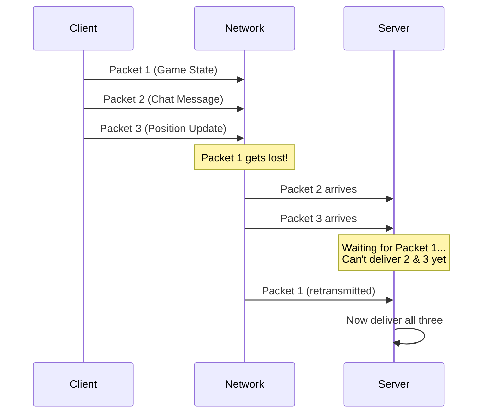
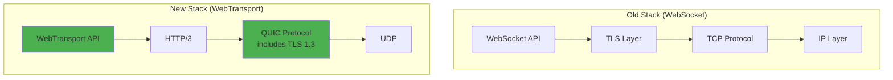
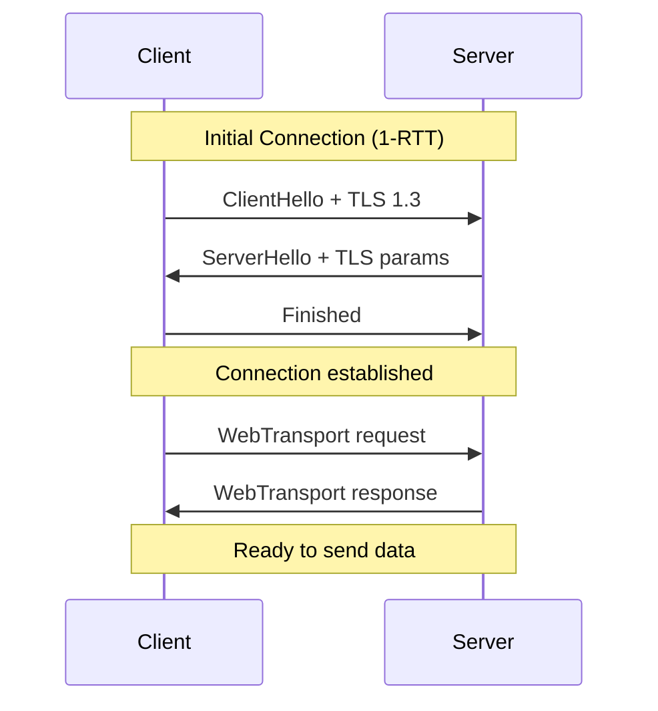
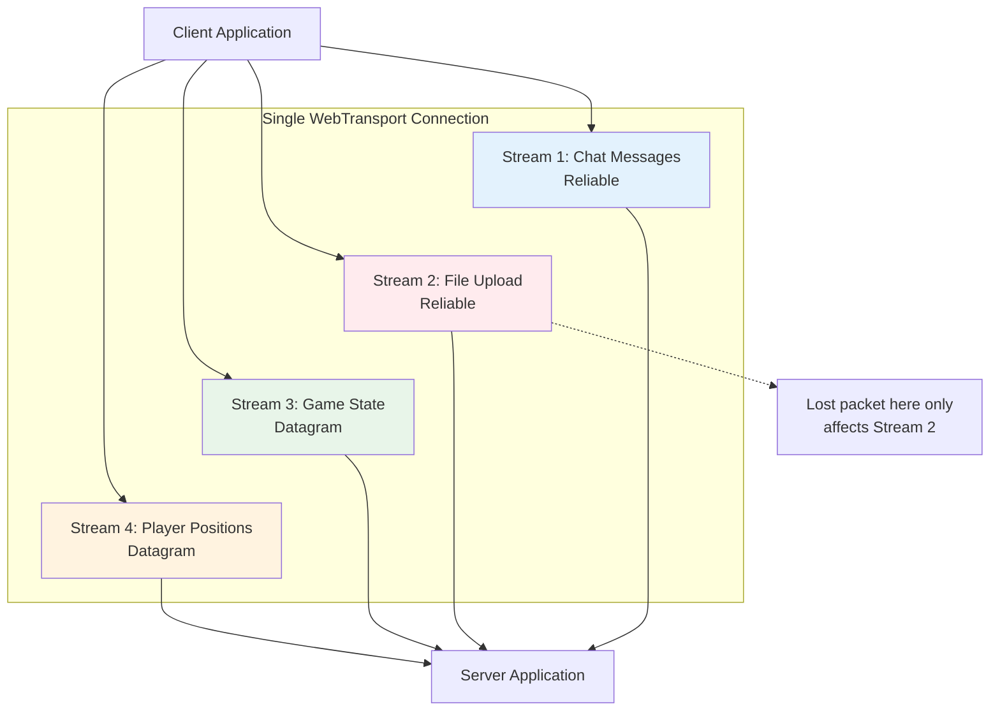
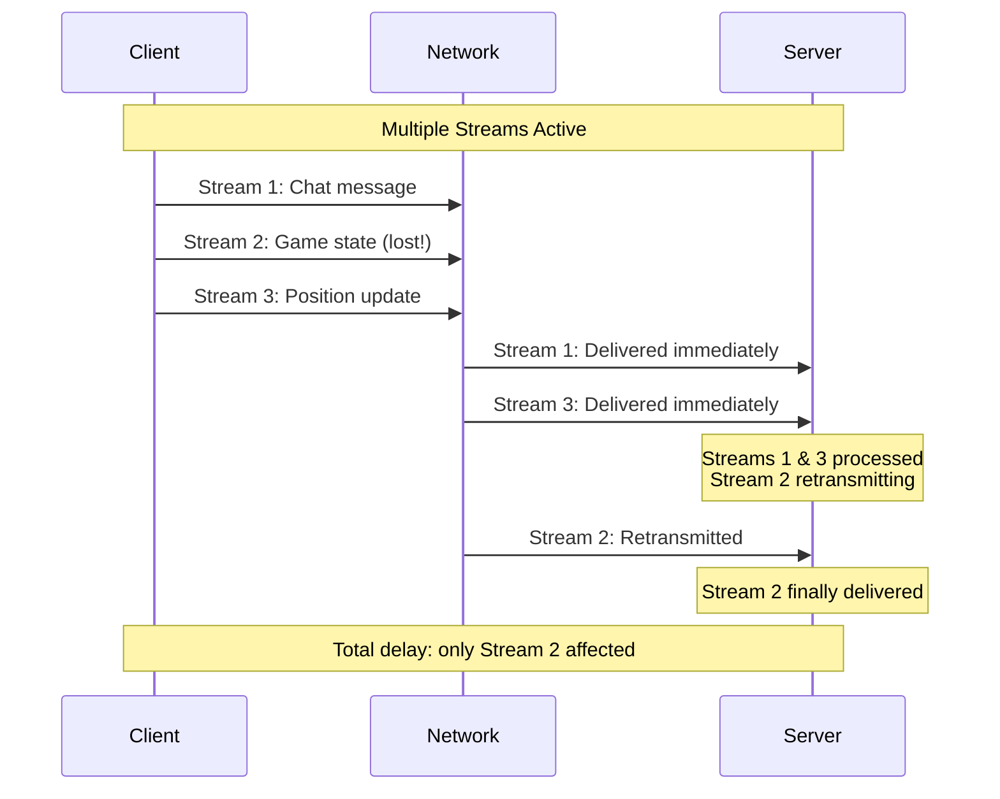

You're building a multiplayer game. Players are chatting, shooting, moving around. Your WebSocket connection works fine until one packet gets lost. 

Then everything stops. 

The chat freezes. Player positions freeze. Even though those packets arrived successfully, they're stuck waiting. Why? Because one lost packet is blocking everything behind it.

This is the WebSocket problem. For a decade, we've had no choice but to accept it.

WebTransport changes that.

Built on HTTP/3 and QUIC, it gives you independent streams that don't block each other. Lost a packet in your chat? Your game state keeps flowing. Need speed over reliability? Use unreliable delivery. Need guarantees? Use reliable streams. All in one connection.

Let's see how it works.

## The Problem: Why WebSockets Fall Short

WebSockets were revolutionary when they arrived in 2011. Finally, we had bidirectional communication without polling. But WebSockets have a fundamental limitation: **they run on TCP**.

### Head-of-Line Blocking: The Silent Killer

TCP guarantees ordered delivery. Sounds great, right? But here's the catch:



Even though Packets 2 and 3 arrived successfully, they sit in a buffer waiting for Packet 1. Your chat message is blocked by a lost game state update. This is **head-of-line blocking**.

**Real impact**: A single lost packet (1% loss rate is common on mobile networks) can add 100-200ms latency spikes to your entire application.

### No Unreliable Delivery Option

Sometimes you don't care if a packet arrives. Consider:

- **Live video streaming**: If frame 47 is lost, just show frame 48. Don't wait to retransmit.
- **Game position updates**: If a player's position from 50ms ago is lost, who cares? You have the current position.
- **Sensor data**: Temperature reading from 2 seconds ago? Useless if you have the latest one.

WebSockets give you **no choice**. Everything is reliable, ordered, and slow.

### Single Stream Design

A WebSocket connection is **one big pipe**. Everything flows through it together. You can't prioritize your chat messages over file uploads. You can't have independent streams that don't block each other.

## Enter WebTransport: Built for Modern Needs

WebTransport is the API that says "let's start fresh." It's built on **HTTP/3**, which runs on **QUIC**, which runs on **UDP**.

Wait, UDP? Isn't that the unreliable protocol?

Yes. And that's exactly why it's perfect.

### The QUIC Foundation

QUIC (Quick UDP Internet Connections) was developed by Google and is now an IETF standard. Think of it as "TCP reimagined with 20 years of hindsight."

**Key innovations**:

1. **Multiplexed streams**: Multiple independent streams in one connection
2. **No head-of-line blocking**: Lost packet only affects its own stream
3. **Built-in TLS 1.3**: Security is not optional
4. **Connection migration**: Survive IP address changes (WiFi to cellular handoff)
5. **Faster handshakes**: 0-RTT connection resumption

> **RTT (Round Trip Time)**: The time it takes for a message to go from client to server and back. Think of it as a "conversation turn." Fewer RTTs = faster connection setup.



### Three Ways to Send Data

WebTransport gives you three distinct communication patterns:

#### 1. Bidirectional Streams (Reliable, Ordered)

Perfect for request-response patterns where you need guaranteed delivery.

```javascript
// Open a bidirectional stream
const stream = await transport.createBidirectionalStream();
const writer = stream.writable.getWriter();
const reader = stream.readable.getReader();

// Send request
await writer.write(encoder.encode('GET /api/user/123'));

// Read response
const { value } = await reader.read();
console.log(decoder.decode(value));
```

**Use cases**: API calls, file transfers, database queries

#### 2. Unidirectional Streams (Reliable, Ordered, One-Way)

Server pushes data to client (or vice versa) with delivery guarantees.

```javascript
// Client creates a unidirectional stream to server
const stream = await transport.createUnidirectionalStream();
const writer = stream.writable.getWriter();

// Send data one way
await writer.write(encoder.encode('Log entry: User clicked button'));
await writer.close();
```

**Use cases**: Server-sent events, logging, telemetry

#### 3. Datagrams (Unreliable, Unordered)

Fast, lightweight messages where occasional loss is acceptable.

```javascript
// Send datagram (fire and forget)
const writer = transport.datagrams.writable.getWriter();
await writer.write(encoder.encode('player_pos:x=100,y=200'));

// Receive datagrams
const reader = transport.datagrams.readable.getReader();
while (true) {
    const { value, done } = await reader.read();
    if (done) break;
    handlePositionUpdate(decoder.decode(value));
}
```

**Use cases**: Gaming, live streaming, sensor data, real-time analytics

## How WebTransport Actually Works

Let's trace a complete connection lifecycle.

### Step 1: Connection Establishment



**On first connection**: 1 round trip (1-RTT)
**On subsequent connections**: 0 round trips (0-RTT)

Compare to WebSocket which needs:
1. TCP handshake (1-RTT)
2. TLS handshake (1-2 RTT)
3. WebSocket upgrade (1-RTT)

**Total**: 3-4 RTTs vs WebTransport's 0-1 RTT

### Step 2: Multiplexed Communication

This is where the magic happens. Multiple streams operate **independently**.



**Key insight**: A lost packet on Stream 2 (file upload) doesn't affect Stream 1 (chat), Stream 3 (game state), or Stream 4 (positions). Each stream is isolated.

### Step 3: Handling Packet Loss

This is where WebTransport shines compared to WebSockets.



**WebSocket behavior**: All three messages blocked until retransmission
**WebTransport behavior**: Only Stream 2 blocked, others flow freely

## Browser Support and Feature Detection

As of October 2025, WebTransport support is improving:

```javascript
// Feature detection
function supportsWebTransport() {
    return 'WebTransport' in window;
}

if (supportsWebTransport()) {
    console.log('WebTransport supported!');
    initWebTransport();
} else {
    console.log('Falling back to WebSocket');
    initWebSocket();
}
```

**Current support**:
- Chrome/Edge: <i class="fas fa-check-circle" style="color: #10b981;"></i> Since version 97
- Firefox: <i class="fas fa-check-circle" style="color: #10b981;"></i> Since version 114
- Safari: <i class="fas fa-clock" style="color: #f59e0b;"></i> In development
- Opera: <i class="fas fa-check-circle" style="color: #10b981;"></i> Since version 83

**Server support**:
- Node.js: Via `@fails-components/webtransport`
- Go: Via `quic-go` library
- Rust: Via `quinn` or `wtransport` crates
- Python: Via `aioquic` library

## WebTransport vs WebSocket: The Breakdown

Let's compare them side by side:

| Feature | WebSocket | WebTransport |
|---------|-----------|--------------|
| **Protocol** | TCP-based | UDP-based (QUIC) |
| **Latency** | 50-100ms typical | 20-50ms typical |
| **Head-of-line blocking** | Yes, always | No, isolated streams |
| **Multiple streams** | No, single connection | Yes, unlimited |
| **Unreliable delivery** | No option | Yes, via datagrams |
| **Connection migration** | No | Yes (WiFi to cellular) |
| **Security** | TLS 1.2+ (optional) | TLS 1.3 (mandatory) |
| **Handshake** | 3-4 RTTs | 0-1 RTTs |
| **Browser support** | Universal | Modern browsers |
| **Use case** | Chat, notifications | Gaming, streaming, IoT |

## Security Considerations

WebTransport is **TLS 1.3 by default**. But there are still things to watch:

### 1. Certificate Requirements

WebTransport requires **valid TLS certificates**. Self-signed certificates work for development but require user approval.

```javascript
// Development only
const transport = new WebTransport('https://localhost:4433/endpoint', {
    // Allow self-signed certs in dev
    serverCertificateHashes: [{
        algorithm: 'sha-256',
        value: 'certificate-hash-here'
    }]
});
```

### 2. Origin Restrictions

WebTransport follows same-origin policy. Use CORS for cross-origin:

```javascript
// Server side
response.setHeader('Access-Control-Allow-Origin', 'https://your-app.com');
response.setHeader('Access-Control-Allow-Methods', 'CONNECT');
```

### 3. Rate Limiting

Protect your server from abuse:

```javascript
const connections = new Map();

server.on('session', (session) => {
    const clientIP = session.remoteAddress;
    
    // Limit connections per IP
    if (connections.get(clientIP) > 10) {
        session.close({ closeCode: 429, reason: 'Too many connections' });
        return;
    }
    
    connections.set(clientIP, (connections.get(clientIP) || 0) + 1);
});
```

## Real-World Adoption

Companies using WebTransport in production:

**Google Meet**: Video conferencing with WebTransport for lower latency

**CloudFlare**: WebTransport support for edge computing use cases

**Discord**: Experimenting with WebTransport for voice channels

**Meta**: Testing for VR applications in metaverse projects

## What's Next for WebTransport

WebTransport is evolving with **WebCodecs integration** for direct video/audio encoding and **improved congestion control** for better network adaptation. The spec continues to mature as more companies adopt it in production.

## Getting Started: Your First WebTransport App

Here's a complete minimal example to get you started.

**Server** (Node.js):

```javascript
const { Http3Server } = require('@fails-components/webtransport');
const { readFileSync } = require('fs');

const server = new Http3Server({
    port: 4433,
    host: '0.0.0.0',
    secret: 'changeme',
    cert: readFileSync('./cert.pem'),
    privKey: readFileSync('./key.pem')
});

server.startServer();

server.on('session', (session) => {
    console.log('Session established');
    
    // Handle datagrams
    const datagramReader = session.datagrams.readable.getReader();
    (async () => {
        while (true) {
            const { value, done } = await datagramReader.read();
            if (done) break;
            
            const message = new TextDecoder().decode(value);
            console.log('Received:', message);
            
            // Echo back
            const writer = session.datagrams.writable.getWriter();
            await writer.write(value);
        }
    })();
});

console.log('Server listening on https://localhost:4433');
```

**Client** (Browser):

```html
<!DOCTYPE html>
<html>
<head>
    <title>WebTransport Demo</title>
</head>
<body>
    <h1>WebTransport Echo Test</h1>
    <input type="text" id="message" placeholder="Type a message">
    <button onclick="send()">Send</button>
    <div id="output"></div>
    
    <script>
        const encoder = new TextEncoder();
        const decoder = new TextDecoder();
        let transport, datagramWriter;
        
        async function init() {
            transport = new WebTransport('https://localhost:4433/echo');
            await transport.ready;
            console.log('Connected!');
            
            // Get datagram writer
            datagramWriter = transport.datagrams.writable.getWriter();
            
            // Read incoming datagrams
            const reader = transport.datagrams.readable.getReader();
            (async () => {
                while (true) {
                    const { value, done } = await reader.read();
                    if (done) break;
                    
                    const message = decoder.decode(value);
                    document.getElementById('output').innerHTML += 
                        `<p>Received: ${message}</p>`;
                }
            })();
        }
        
        async function send() {
            const input = document.getElementById('message');
            const message = input.value;
            
            await datagramWriter.write(encoder.encode(message));
            document.getElementById('output').innerHTML += 
                `<p>Sent: ${message}</p>`;
            
            input.value = '';
        }
        
        init();
    </script>
</body>
</html>
```

Run this and you have a working WebTransport echo server!

## Debugging WebTransport

Chrome DevTools has excellent support:

1. Open DevTools → Network tab
2. Filter by "WebTransport"
3. See connection details, streams, and datagrams
4. Monitor bandwidth and latency


## The Bottom Line

WebTransport fixes what's broken in WebSockets: head-of-line blocking, no stream isolation, and no reliability choices. Built on HTTP/3 and QUIC, it delivers lower latency and better congestion control.

For applications demanding low latency and high throughput, WebTransport is the clear winner. For simple use cases, WebSocket works fine. The question is: which parts of your app would benefit from WebTransport's capabilities?

---

*Interested in more web protocols and networking? Check out our posts on [How DNS Works](/how-dns-works-complete-guide/) and [WebSockets Explained](/explainer/websockets-explained/).*

*Building real-time systems at scale? Read [How Slack Handles 10+ Billion Messages](/slack-system-design/) and [How Cloudflare Supports 55M Requests Per Second](/how-cloudflare-supports-55-million-requests-per-second/).*

