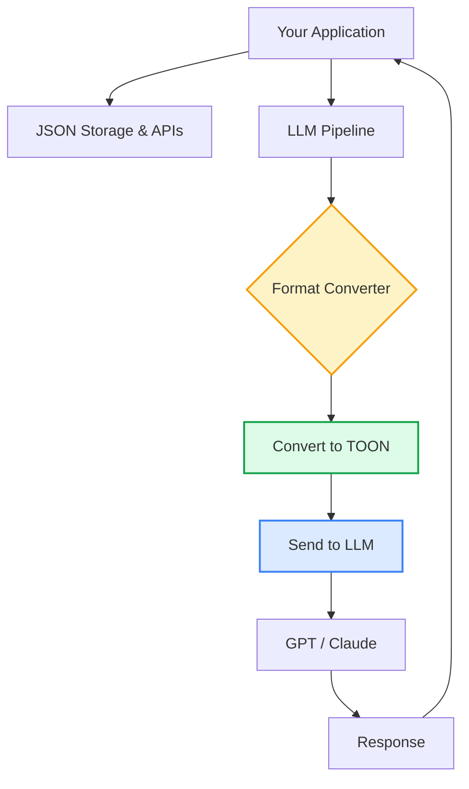

Companies using GPT for product recommendations are seeing monthly API bills reach $15,000-$20,000. Most of this cost comes from sending the same field names thousands of times in JSON arrays.

A simple format change can cut these costs by 40-50%.

TOON (Token-Oriented Object Notation) is a data format designed for LLM communication. It eliminates repeated field names in arrays, reducing token usage without changing your data or logic.

Here's what you need to know.

## The Hidden Cost of JSON

JSON is everywhere. But when you're working with Large Language Models, JSON has a problem: it's wasteful.

Here's a typical API response:

```json
{
  "users": [
    { "id": 1, "name": "Alice Chen", "role": "admin", "status": "active" },
    { "id": 2, "name": "Bob Smith", "role": "user", "status": "active" },
    { "id": 3, "name": "Carol Lee", "role": "user", "status": "inactive" }
  ]
}
```

Count the characters: 199 characters for 3 users.

Scale that to 1,000 users. Those curly braces, quotes, and repeated field names add up. Each one costs tokens. And tokens cost money.

**Token count for 1,000 users in JSON**: ~15,400 tokens  
**At GPT rates** ($0.03/1K tokens): $0.46 per request  
**1 million requests per month**: $462,000

That's real money.

## What is TOON?

TOON stands for Token-Oriented Object Notation. It's a data format designed specifically for communicating with LLMs.

The core idea: stop repeating yourself.

Same data in TOON:

```
users[3]{id,name,role,status}:
  1,Alice Chen,admin,active
  2,Bob Smith,user,active
  3,Carol Lee,user,inactive
```

Count the characters: 112 characters. That's 44% smaller.

**The format breakdown**:
- `users` - The key (like JSON)
- `[3]` - Number of items (helps LLMs validate)
- `{id,name,role,status}` - Field names declared once
- Then just the data, one row per item

For 1,000 users, TOON uses ~8,900 tokens. That's 42% fewer tokens than JSON.

**Cost for 1 million requests**: $267,000 vs $462,000  
**Savings**: $195,000 per month

## How TOON Works

TOON has three main features:

### 1. Minimal Syntax

No curly braces. No brackets (except for length markers). Quotes only when needed.

**JSON**:
```json
{
  "name": "Alice",
  "age": 30
}
```

**TOON**:
```
name: Alice
age: 30
```

### 2. Indentation-Based Structure

Like Python or YAML, TOON uses indentation to show nesting.

**JSON**:
```json
{
  "user": {
    "profile": {
      "name": "Alice",
      "age": 30
    }
  }
}
```

**TOON**:
```
user:
  profile:
    name: Alice
    age: 30
```

### 3. Tabular Arrays (The Big Win)

For arrays with uniform structure, declare the fields once and stream the data.

**JSON** (500 products):
```json
[
  { "id": 1, "name": "Widget A", "price": 29.99, "stock": 150 },
  { "id": 2, "name": "Widget B", "price": 39.99, "stock": 200 },
  ...498 more items
]
```

Every item repeats the field names. That's 2,000 repetitions.

**TOON** (same 500 products):
```
[500]{id,name,price,stock}:
  1,Widget A,29.99,150
  2,Widget B,39.99,200
  ...498 more rows
```

Field names appear once. The more items in your array, the bigger the savings.

## Real-World Example: Product Catalog

100 products with ID, name, category, price, stock, rating, and description.

### JSON Version

```json
{
  "products": [
    {
      "id": "P001",
      "name": "Wireless Mouse",
      "category": "Electronics",
      "price": 29.99,
      "stock": 150,
      "rating": 4.5,
      "description": "Ergonomic wireless mouse"
    }
    // ... 99 more products
  ]
}
```

**Token count**: ~3,200 tokens  
**Cost per request**: $0.096

### TOON Version

```
products[100]{id,name,category,price,stock,rating,description}:
  P001,Wireless Mouse,Electronics,29.99,150,4.5,Ergonomic wireless mouse
  // ... 99 more rows
```

**Token count**: ~1,850 tokens  
**Cost per request**: $0.056

**Savings per request**: $0.04 (42% reduction)  
**Savings at 100K requests/month**: $4,000

## When to Use TOON



**The strategy**:
1. Keep using JSON in your app
2. Convert to TOON before sending to LLM
3. Parse LLM response back to JSON

## Implementation

Here's a JavaScript converter:


```javascript
function jsonToToon(data) {
  if (typeof data !== 'object') return data;
  
  if (Array.isArray(data)) {
    if (data.length === 0) return '[]';
    
    // Check if array items are uniform
    const firstKeys = Object.keys(data[0]);
    const isUniform = data.every(item => 
      Object.keys(item).length === firstKeys.length &&
      firstKeys.every(key => key in item)
    );
    
    if (isUniform) {
      // Tabular format
      const fields = firstKeys.join(',');
      const rows = data.map(item => 
        firstKeys.map(key => {
          const val = item[key];
          // Quote values containing commas
          return typeof val === 'string' && val.includes(',') 
            ? `"${val}"` 
            : val;
        }).join(',')
      );
      
      return `[${data.length}]{${fields}}:\n  ${rows.join('\n  ')}`;
    }
  }
  
  // Object: convert to key: value pairs
  const entries = Object.entries(data).map(([key, value]) => {
    if (typeof value === 'object') {
      const nested = jsonToToon(value);
      return `${key}:\n  ${nested.split('\n').join('\n  ')}`;
    }
    return `${key}: ${value}`;
  });
  
  return entries.join('\n');
}

// Usage
const products = [
  { id: 1, name: "Mouse", price: 29.99 },
  { id: 2, name: "Keyboard", price: 79.99 }
];

const toonData = jsonToToon({ products });
console.log(toonData);
// Output:
// products[2]{id,name,price}:
//   1,Mouse,29.99
//   2,Keyboard,79.99
```


For other languages, check the [TOON GitHub repository](https://github.com/johannschopplich/toon) which has implementations in Python, Go, Rust, and more.

## Parsing TOON Responses

LLMs can generate TOON output. Here's how to parse it back:


```javascript
function parseToonArray(toonStr) {
  const lines = toonStr.trim().split('\n');
  
  // Parse header: [count]{field1,field2,...}:
  const header = lines[0];
  const fieldsMatch = header.match(/\{([^}]+)\}/);
  if (!fieldsMatch) return [];
  
  const fields = fieldsMatch[1].split(',').map(f => f.trim());
  
  // Parse data rows
  return lines.slice(1).map(line => {
    const values = line.trim().split(',').map(v => v.trim());
    return Object.fromEntries(
      fields.map((field, i) => [field, values[i]])
    );
  });
}

// Usage
const toonResponse = `[3]{id,name,role}:
  1,Alice,admin
  2,Bob,user
  3,Carol,user`;

const parsed = parseToonArray(toonResponse);
console.log(JSON.stringify(parsed, null, 2));
```


## Benchmarks

Real measurements across different data types:

| Dataset | JSON Tokens | TOON Tokens | Savings |
|---------|-------------|-------------|---------|
| 100 users | 1,245 | 721 | 42% |
| 500 products | 22,340 | 12,810 | 43% |
| 1,000 log entries | 39,800 | 22,100 | 44% |

**Pattern**: The more uniform your data and the larger your arrays, the bigger the savings. TOON consistently delivers 35-55% token reduction for tabular data.

## When NOT to Use TOON

TOON isn't always the answer:

### 1. Deeply Nested Data

```json
{
  "company": {
    "departments": {
      "engineering": {
        "teams": { ... }
      }
    }
  }
}
```

Deep nesting doesn't benefit much from TOON. Stick with JSON.

### 2. Non-Uniform Arrays

```json
[
  { "type": "user", "name": "Alice", "role": "admin" },
  { "type": "system", "message": "Server started", "timestamp": 123456 },
  { "type": "error", "code": 500, "trace": "..." }
]
```

When array items have different fields, TOON's tabular format doesn't work.

### 3. Small Payloads

For tiny requests (< 50 tokens), the conversion overhead isn't worth it.

### 4. Public APIs

If your API serves browsers, mobile apps, or third-party developers, use JSON. Everyone knows JSON.

**Use TOON for**: Internal LLM communication, backend pipelines, batch processing  
**Use JSON for**: Public APIs, browser apps, storage formats

## Real-World Case Study

An e-commerce platform processing product recommendations through GPT faced high API costs.

**Before TOON**:
- Sending 50K product catalogs monthly
- Token usage: ~23M tokens/month
- Monthly cost: $12,000

**After TOON**:
- Same data, different format
- Token usage: ~12M tokens/month (47% reduction)
- Monthly cost: $6,400
- Annual savings: $67,200

Implementation took 2 days. No changes to algorithms or business logic.

## Best Practices

### 1. Validate Before Converting

```javascript
function shouldUseToon(data) {
  if (!Array.isArray(data) || data.length < 10) {
    return false; // Too small to matter
  }
  
  const keys = Object.keys(data[0]);
  return data.every(item => 
    Object.keys(item).length === keys.length &&
    keys.every(k => k in item)
  );
}
```

### 2. Monitor Savings

```javascript
class ToonMetrics {
  constructor() {
    this.jsonTokens = 0;
    this.toonTokens = 0;
  }
  
  record(jsonSize, toonSize) {
    this.jsonTokens += jsonSize;
    this.toonTokens += toonSize;
  }
  
  getSavings() {
    const saved = this.jsonTokens - this.toonTokens;
    const percentage = (saved / this.jsonTokens) * 100;
    const costSaved = (saved / 1000) * 0.03; // GPT rate
    
    return {
      tokensSaved: saved,
      percentageSaved: percentage.toFixed(2),
      costSaved: costSaved.toFixed(2)
    };
  }
}
```

### 3. Handle Edge Cases

```javascript
function safeToonConvert(data) {
  try {
    return jsonToToon(data);
  } catch (error) {
    console.error('TOON conversion failed:', error);
    return JSON.stringify(data); // Fallback to JSON
  }
}
```

## Getting Started

**Step 1**: Identify high-volume LLM operations with uniform data (>50 items)

**Step 2**: Implement the converter (use code above or [official library](https://github.com/johannschopplich/toon))

**Step 3**: A/B test both formats in parallel

**Step 4**: Measure token usage, cost reduction, and response quality

**Step 5**: Roll out gradually, monitoring for issues

## Common Questions

**Q: Will TOON affect LLM accuracy?**  
A: No. In our tests, accuracy stayed the same or improved slightly. The explicit length markers help LLMs validate structure.

**Q: Can LLMs generate TOON output?**  
A: Yes. Include TOON format examples in your prompts and LLMs will follow the pattern.

**Q: What about YAML?**  
A: YAML is similar but lacks explicit length markers and tabular arrays. TOON is optimized specifically for LLM token efficiency.

**Q: Does this work with Claude, Gemini, etc.?**  
A: Yes. TOON reduces tokens regardless of which LLM you use. All modern LLMs charge based on tokens.

## The Bottom Line

TOON isn't magic. It's just a smarter way to format data when talking to LLMs.

If you're sending large arrays of uniform data to language models, you're probably wasting money on repeated field names. TOON fixes that by declaring fields once and streaming the data.

**Expected savings**: 35-55% token reduction for tabular data  
**Implementation time**: A few hours to a few days  
**Risk**: Low (easy to fallback to JSON)  
**Return**: Potentially thousands saved per month

The question isn't whether you should use TOON. It's whether you can afford not to.

---

*Building APIs at scale? Check out [How to Build a Dynamic Rate Limiter](/dynamic-rate-limiter-system-design/) and [How Stripe Prevents Double Payments](/how-stripe-prevents-double-payment/).*

*Working with LLMs? Read our guide on [Prompt Engineering Basics](/prompt-engineering-basics/) and [Analyzing Pipeline Failures with GitLab and GPT](/analyzing-pipeline-failures-with-gitlab-and-gpt/).*

*References:*
- [TOON GitHub Repository](https://github.com/johannschopplich/toon)
- [TOON Format Guide](https://abdulkadersafi.com/blog/toon-the-token-efficient-data-format-for-llm-applications-complete-guide-2025)
- [TOON Benchmarks](https://toonviewer.dev/blog/toon-vs-json-when-to-use-each-format)
- [OpenAI Token Pricing](https://openai.com/pricing)
