It's 2 AM. Your database cluster is running smoothly. Then, one server freezes. Not a clean crash. Not a network disconnect. Just frozen. Still listening on the network, still responding to pings, but completely unable to process requests.

Your users start seeing timeouts. Requests pile up. Other servers keep routing traffic to the frozen node because, technically, it's still "up." The whole system starts to degrade.

This is the nightmare scenario that heartbeat mechanisms prevent. Let me show you how.

## The Problem: How Do You Know If Something Is Dead?

In a single server application, failure is obvious. The process crashes, you get an exception, and you restart it. Simple.

In distributed systems, nothing is simple.

### The Hotel Room Problem

Imagine you're a hotel manager with 100 rooms across 5 floors. You need to know which rooms are occupied and which are empty. How do you check?

**Option 1: Ask each room once**  
You knock on each door at check-in time. If someone answers, you mark it occupied. But what if they checked out early without notifying the front desk? What if they're in the shower and don't hear the knock?

**Option 2: Wait for complaints**  
Only check when housekeeping reports an issue. By then, you might have a guest who's been stuck in a broken elevator for 20 minutes.

**Option 3: Regular check-ins (Heartbeat)**  
Every guest must call the front desk every hour to say "I'm still here." If you don't hear from a room for 2 hours, you send someone to check. This is the heartbeat approach.

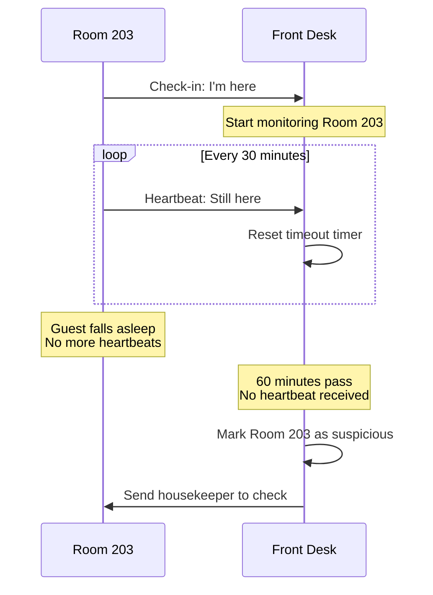

This is exactly how distributed systems track which servers are alive.

## What Is a Heartbeat?

A heartbeat is a **periodic signal** that a process sends to prove it's still alive and functioning. If the heartbeat stops, the system assumes something went wrong.

Think of it like a pulse. If you stop feeling a pulse, you don't wait around to see what happens. You act immediately.

### The Three Components

Every heartbeat system has three parts:

1. **Sender**: The node that sends periodic "I'm alive" signals
2. **Receiver**: The node that monitors for heartbeats
3. **Timeout**: How long to wait before declaring a node dead

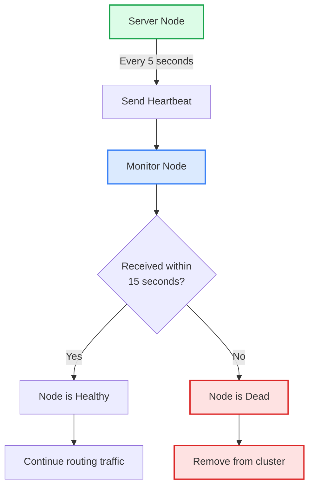

## Real-World Example: Kubernetes

Kubernetes uses heartbeats extensively to manage containers. Every pod must prove it's alive, or Kubernetes kills it and starts a new one.

### Liveness Probes

Kubernetes checks if your application is still running:

```yaml
apiVersion: v1
kind: Pod
metadata:
  name: payment-service
spec:
  containers:
  - name: app
    image: payment-service:latest
    livenessProbe:
      httpGet:
        path: /health
        port: 8080
      initialDelaySeconds: 30
      periodSeconds: 10
      timeoutSeconds: 5
      failureThreshold: 3
```

**What this does:**
- Wait 30 seconds after container starts (give it time to boot)
- Every 10 seconds, send an HTTP GET to `/health`
- If the request takes longer than 5 seconds, mark it failed
- After 3 consecutive failures, kill the container and restart it

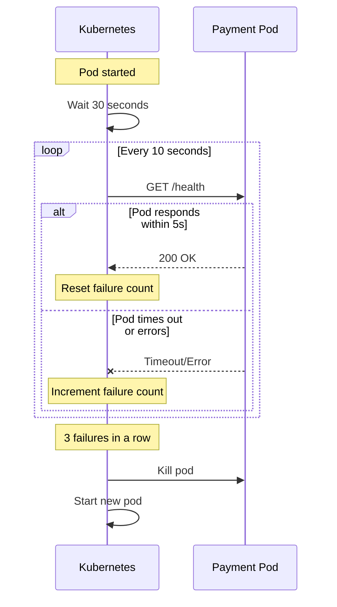

### Readiness Probes

Separate from liveness, Kubernetes also checks if your application is ready to receive traffic:

```yaml
readinessProbe:
  httpGet:
    path: /ready
    port: 8080
  initialDelaySeconds: 10
  periodSeconds: 5
  failureThreshold: 2
```

**The difference:**
- **Liveness**: Is the process alive? If not, restart it.
- **Readiness**: Is the process ready to handle requests? If not, stop sending traffic but don't restart.

This matters when your app is temporarily overloaded or waiting for a database connection.

## The Math: Choosing Timeout Values

Getting the timeout right is critical. Too short and you get false positives (killing healthy nodes). Too long and you leave dead nodes in your cluster.

### The Formula

Here's the key relationship:

```
Failure Detection Time = (Heartbeat Interval × Failure Threshold) + Network Latency
```

**Example:**
- Heartbeat every 5 seconds
- Failure threshold of 3 missed heartbeats
- Network latency of 100ms

**Minimum detection time:** (5s × 3) + 0.1s = **15.1 seconds**

That's how long it takes to detect a failure in the best case.


## Pattern 1: Push-Based Heartbeat

The node actively sends "I'm alive" messages to a central monitor.

**How it works:**

Each node runs a background process that periodically sends heartbeat messages to a monitoring service. The monitor tracks when it last heard from each node and marks nodes as failed if heartbeats stop arriving.

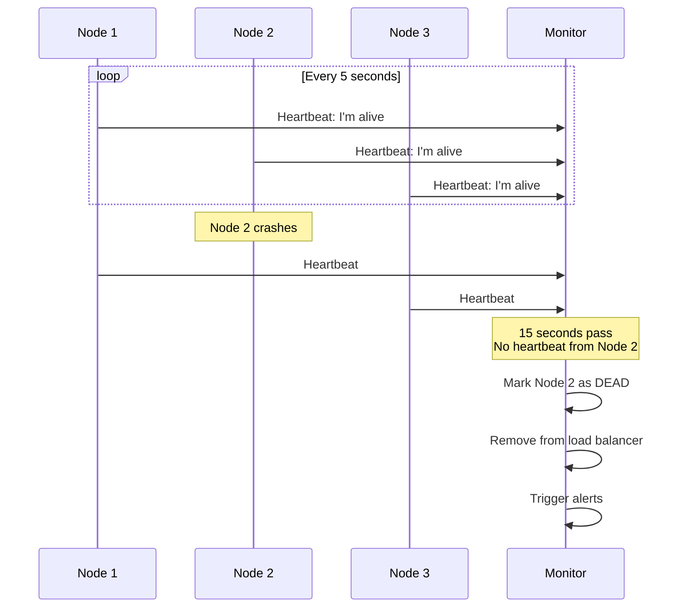

**The flow:**

1. **Node startup**: Each node starts a background thread that sends heartbeats
2. **Periodic send**: Every 5 seconds, node sends POST request to monitor with node ID and timestamp
3. **Monitor updates**: Monitor records the last seen time for each node
4. **Monitor checks**: Background process checks if any node hasn't sent heartbeat within timeout (15 seconds)
5. **Failure action**: If timeout exceeded, mark node as dead and trigger failover

**Real-world example:**

AWS Auto Scaling uses push-based heartbeats. EC2 instances send heartbeats to the Auto Scaling service. If an instance stops sending heartbeats, AWS terminates it and launches a replacement.

**Pros:**
- <i class="fas fa-check-circle text-success"></i> Simple to implement
- <i class="fas fa-check-circle text-success"></i> Sender controls frequency
- <i class="fas fa-check-circle text-success"></i> Works well with central monitors
- <i class="fas fa-check-circle text-success"></i> Nodes can include rich metadata in heartbeats

**Cons:**
- <i class="fas fa-times-circle text-danger"></i> Monitor becomes a single point of failure
- <i class="fas fa-times-circle text-danger"></i> Network overhead scales with nodes (1000 nodes = 1000 heartbeat messages)
- <i class="fas fa-times-circle text-danger"></i> Monitor can be overwhelmed with many nodes

## Pattern 2: Pull-Based Health Check

The monitor actively polls each node to check if it's alive.

**How it works:**

Instead of nodes sending heartbeats, a central monitor reaches out to each node on a regular schedule and asks "Are you healthy?" Each node exposes a health check endpoint that returns its current status.

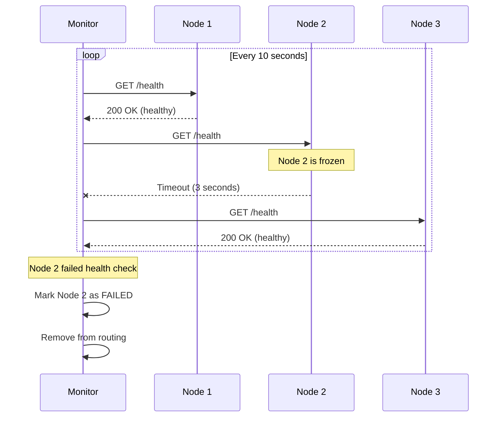

**The flow:**

1. **Monitor maintains list**: Monitor knows all nodes it needs to check (from configuration or service registry)
2. **Periodic polling**: Every 10 seconds, monitor sends HTTP GET to `/health` endpoint on each node
3. **Parallel checks**: Monitor checks all nodes in parallel to avoid delays
4. **Timeout handling**: If node doesn't respond within 3 seconds, mark as timeout
5. **Failure detection**: After 3 consecutive timeouts, mark node as failed

**Real-world example:**

Docker Swarm uses pull-based health checks. The manager node regularly polls worker nodes by sending health check requests. If a worker doesn't respond, it's removed from the cluster.

**Pros:**
- <i class="fas fa-check-circle text-success"></i> Monitor has full control over check frequency
- <i class="fas fa-check-circle text-success"></i> Nodes don't need heartbeat logic (just expose an endpoint)
- <i class="fas fa-check-circle text-success"></i> Can perform sophisticated health checks (database connectivity, disk space, etc.)
- <i class="fas fa-check-circle text-success"></i> Easy to add custom health validations

**Cons:**
- <i class="fas fa-times-circle text-danger"></i> Monitor must know all nodes upfront
- <i class="fas fa-times-circle text-danger"></i> More network traffic (monitor initiates all connections)
- <i class="fas fa-times-circle text-danger"></i> Scales poorly with many nodes (1000 nodes = monitor makes 1000 requests)
- <i class="fas fa-times-circle text-danger"></i> Monitor becomes a bottleneck

## Pattern 3: Gossip Protocol (Peer-to-Peer)

Nodes talk to each other directly, spreading information like rumors. No central monitor needed.

This is how **Apache Cassandra** and **Consul** detect failures without a central monitor.

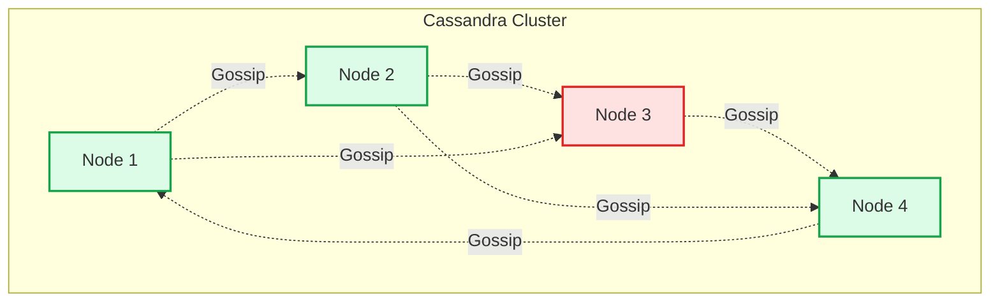

**How it works:**

Each node maintains a table of all other nodes and their status. Nodes randomly exchange this information with peers, spreading knowledge through the cluster like gossip spreads through a social network.

**The gossip cycle:**

1. **Pick random peers**: Every second, Node 1 randomly picks 3 other nodes (say Node 2, Node 5, Node 8)
2. **Send state**: Node 1 sends them its view: "I'm alive. Node 3 is alive (last seen 2s ago). Node 4 is suspicious (last seen 12s ago)."
3. **Receive state**: Node 2 replies: "I'm alive. Node 3 is dead (last seen 35s ago). Node 6 is alive."
4. **Merge views**: Node 1 updates its knowledge. Since Node 2's info about Node 3 is more recent, Node 1 marks Node 3 as dead
5. **Propagate**: Next round, Node 1 tells others that Node 3 is dead. Within a few rounds, everyone knows

**Failure detection timeline:**

- **0-10 seconds**: Node hasn't gossiped, status remains "alive"
- **10-30 seconds**: No gossip heard (directly or indirectly), mark as "suspicious"
- **30+ seconds**: Still no information, mark as "dead"

**Why this works:**

Even if Node 1 can't reach Node 3 directly, if Node 2 recently heard from Node 3, Node 1 learns that Node 3 is alive. Information spreads exponentially fast across the cluster.

**Real-world example:**

Apache Cassandra uses gossip to maintain cluster membership. Each Cassandra node gossips with 3 random peers every second. Even in a 1000-node cluster, failure information propagates to all nodes within seconds.

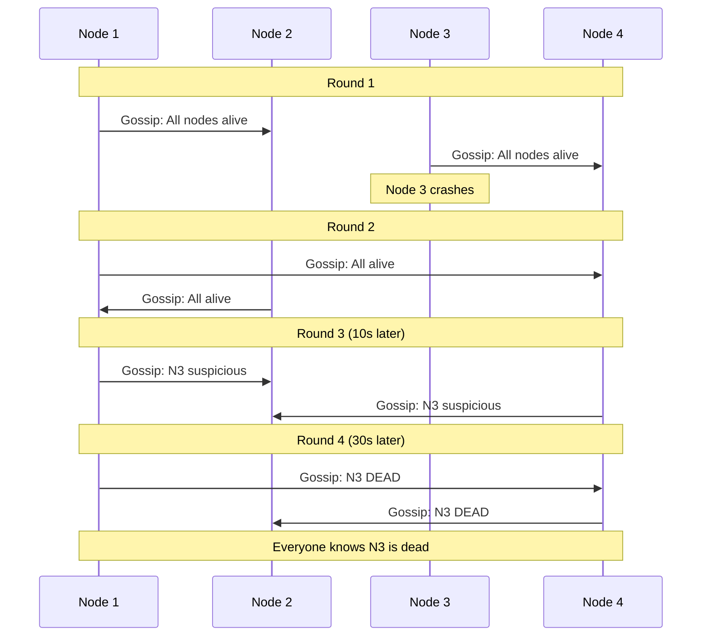

**Pros:**
- <i class="fas fa-check-circle text-success"></i> No single point of failure (fully distributed)
- <i class="fas fa-check-circle text-success"></i> Scales to thousands of nodes efficiently
- <i class="fas fa-check-circle text-success"></i> Self-healing and resilient to network partitions
- <i class="fas fa-check-circle text-success"></i> New nodes can join by gossiping with any existing node

**Cons:**
- <i class="fas fa-times-circle text-danger"></i> More complex to implement correctly
- <i class="fas fa-times-circle text-danger"></i> Eventual consistency (not immediate detection)
- <i class="fas fa-times-circle text-danger"></i> Higher network overhead (every node talks to multiple peers)
- <i class="fas fa-times-circle text-danger"></i> Requires careful tuning of gossip intervals and failure thresholds

## The False Positive Problem

The biggest challenge with heartbeats: **How do you know if a node is really dead, or just slow?**

### The Split Brain Scenario

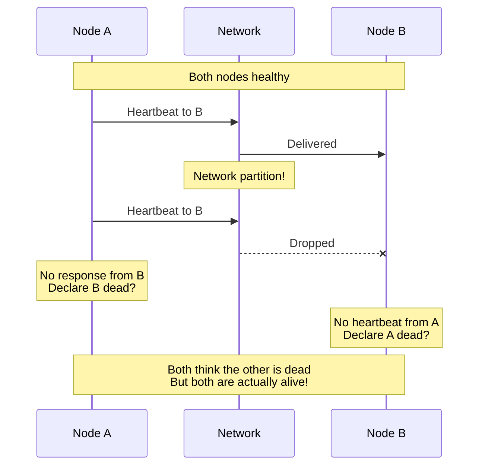

This is called **split brain**, and it's dangerous. Both nodes think they're the only survivor, so both try to be the leader. You end up with two leaders making conflicting decisions.

### Solutions to Split Brain

#### 1. Quorum-Based Decision

Don't declare a node dead unless a [majority of nodes agree](/distributed-systems/majority-quorum/). This prevents isolated nodes from making unilateral decisions.

**How it works:**

In a 5-node cluster, you need 3 nodes (majority) to agree that a node is dead before marking it as failed. This ensures that only the side of the network partition with majority can make decisions.

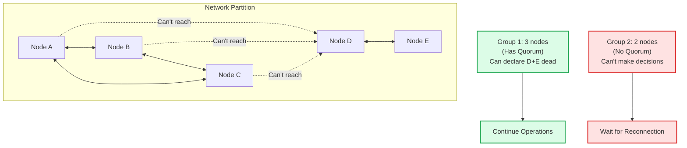

**Why this prevents split brain:** Only one side of the partition can have a majority, so only one side continues operating. The minority side stops making changes and waits for the network to heal.

#### 2. Fencing

When you suspect a node is dead, actively prevent it from doing anything harmful. This is like revoking someone's access badges when they leave the building.

**Fencing actions include:**

- <i class="fas fa-key"></i> **Revoke credentials**: API keys, tokens, certificates become invalid
- <i class="fas fa-ban"></i> **Block network access**: Firewall rules prevent the node from reaching critical resources
- <i class="fas fa-database"></i> **Revoke database permissions**: Node can no longer write to shared data
- <i class="fas fa-network-wired"></i> **Remove from DNS**: Traffic stops routing to the suspected node
- <i class="fas fa-plug"></i> **Power off (STONITH)**: In extreme cases, physically power off the machine

**Example scenario:**

A primary database server loses network connectivity but is still running. Without fencing, it might keep accepting local writes. With fencing, the moment it's declared dead, its database credentials are revoked and firewall rules block its access. Even if it comes back online, it can't cause data corruption.

This is how **Paxos** and similar consensus algorithms prevent split brain. (Check out [my post on Paxos](/distributed-systems/paxos/) for more details.)

#### 3. Multiple Heartbeat Channels

Use multiple independent channels for heartbeats instead of relying on a single network path.

**Different channels:**

- <i class="fas fa-wifi"></i> **Primary network**: Regular TCP/IP heartbeats
- <i class="fas fa-hdd"></i> **Shared storage**: Write timestamps to a shared disk
- <i class="fas fa-database"></i> **Database**: Update a heartbeat table
- <i class="fas fa-network-wired"></i> **Secondary network**: Separate physical network interface

**Decision logic:**

A node is considered alive if it's responsive on **at least 2 out of 3 channels**. This way, if the primary network fails but the node can still write to shared storage and update the database, you know it's alive and just network-isolated.

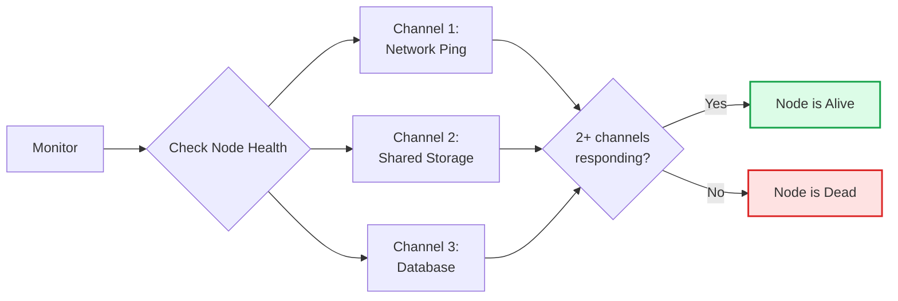

**Why this works:** If the network fails but the node can still write to shared storage, you know it's alive even though network heartbeats failed. This dramatically reduces false positives.

## Real-World Examples Deep Dive

### Cassandra: Gossip + Phi Accrual

Cassandra uses a sophisticated failure detector called **Phi Accrual**. Instead of a binary "dead or alive," it calculates a suspicion level on a continuous scale.

**The Core Concept:**

Instead of saying "if no heartbeat in 10 seconds, node is dead," Phi Accrual asks: "Given the historical pattern of heartbeats, how suspicious is this delay?"

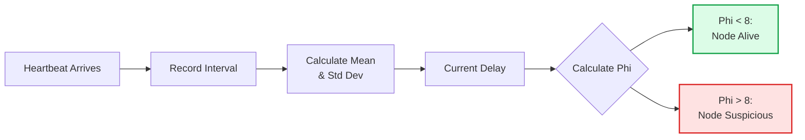

**How it works:**

1. **Track historical intervals**: Record the time between each heartbeat (e.g., 1.1s, 0.9s, 1.0s, 1.2s)
2. **Calculate statistics**: Compute the mean and standard deviation of these intervals
3. **Measure suspicion**: When a heartbeat is late, calculate how many standard deviations away from normal it is
4. **Convert to Phi value**: The formula is `Phi = -log10(probability of seeing this delay if node was alive)`
5. **Declare failure**: If Phi > 8 (default threshold), mark the node as down

**Why this is better:**

- <i class="fas fa-check-circle text-success"></i> **Adapts automatically**: If your network usually has 1-second heartbeats, a 2-second delay is suspicious. But if heartbeats are typically irregular, it's more forgiving
- <i class="fas fa-check-circle text-success"></i> **No hard timeouts**: Instead of arbitrary timeouts, it learns from actual patterns
- <i class="fas fa-check-circle text-success"></i> **Gradual suspicion**: Phi increases gradually, so you can take preventive action before fully declaring a node dead
- <i class="fas fa-check-circle text-success"></i> **Fewer false positives**: Accounts for natural network variance

**Real-world behavior:**
- Regular heartbeats at 1s: If heartbeat is 3s late, Phi jumps to 10 (node marked dead)
- Irregular heartbeats (0.5-2s): Same 3s delay might only give Phi of 6 (node still considered alive)

### HAProxy: Health Checks with Circuit Breaker

HAProxy (load balancer) combines heartbeats with a circuit breaker pattern.

```
# HAProxy config
backend web_servers
    balance roundrobin
    
    # Health check settings
    option httpchk GET /health
    http-check expect status 200
    
    # Circuit breaker settings
    server web1 192.168.1.10:80 check inter 2s fall 3 rise 2
    server web2 192.168.1.11:80 check inter 2s fall 3 rise 2
```

**What this means:**
- `inter 2s`: Check every 2 seconds
- `fall 3`: Mark down after 3 failures
- `rise 2`: Mark up after 2 successes

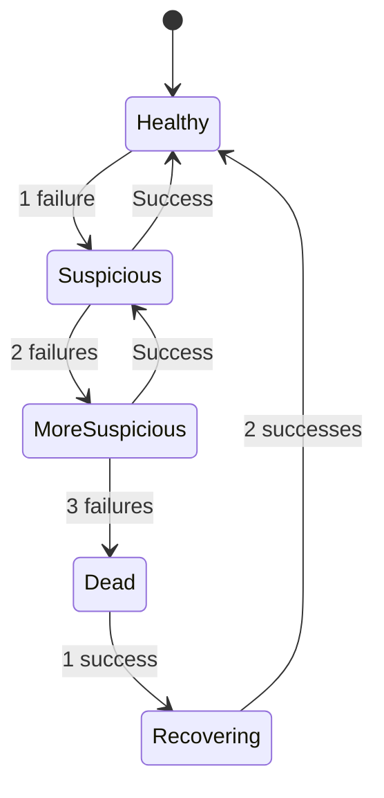

This prevents flapping (node rapidly switching between up and down).

### etcd: Lease-Based Heartbeat

etcd uses a clever lease mechanism. Nodes hold leases that expire unless renewed.

```go
// Go code for etcd lease-based heartbeat
client, _ := clientv3.New(clientv3.Config{
    Endpoints: []string{"localhost:2379"},
})

// Create a lease that expires in 10 seconds
lease, _ := client.Grant(context.TODO(), 10)

// Keep the lease alive with periodic heartbeats
keepAlive, _ := client.KeepAlive(context.TODO(), lease.ID)

// Register this node with the lease
client.Put(context.TODO(), "/nodes/server-1", "alive", clientv3.WithLease(lease.ID))

// As long as we send heartbeats, the key stays in etcd
// If we die, after 10 seconds the key disappears automatically
for {
    select {
    case <-keepAlive:
        // Heartbeat sent successfully
    case <-time.After(5 * time.Second):
        // No heartbeat in 5 seconds, something's wrong
        log.Fatal("Lost connection to etcd")
    }
}
```

**Why this is elegant:**

- If the node crashes, it stops sending heartbeats
- The lease expires automatically in etcd
- Other nodes watching that key get notified immediately
- No need for a separate failure detection mechanism

## The Heartbeat Hierarchy

In production systems, you often have multiple layers of heartbeats:

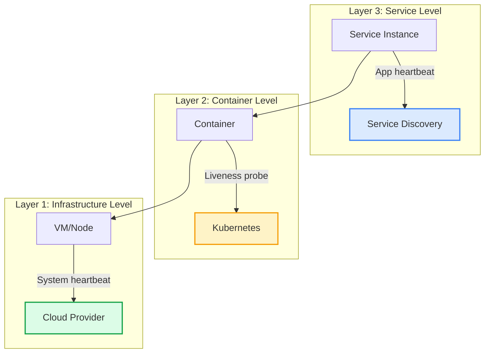

**Layer 1: Infrastructure**
- AWS: EC2 instance status checks every minute
- Azure: VM health monitoring
- If the VM is dead, restart it

**Layer 2: Container Orchestration**
- Kubernetes: Liveness and readiness probes
- If the container is dead, restart it

**Layer 3: Application**
- Service discovery: Consul, etcd health checks
- If the service is dead, remove from routing

Each layer has different failure detection times and responses.

## Monitoring Your Heartbeat System

### Key Metrics to Track

```python
from prometheus_client import Counter, Histogram, Gauge

# Counters
heartbeat_sent = Counter('heartbeat_sent_total', 'Total heartbeats sent')
heartbeat_failed = Counter('heartbeat_failed_total', 'Failed heartbeat attempts')
node_marked_dead = Counter('node_marked_dead_total', 'Nodes marked as dead')
node_recovered = Counter('node_recovered_total', 'Nodes that recovered')

# Histograms
heartbeat_latency = Histogram('heartbeat_latency_seconds', 'Heartbeat round-trip time')
failure_detection_time = Histogram('failure_detection_seconds', 'Time to detect failure')

# Gauges
active_nodes = Gauge('active_nodes', 'Number of active nodes')
suspicious_nodes = Gauge('suspicious_nodes', 'Number of suspicious nodes')
dead_nodes = Gauge('dead_nodes', 'Number of dead nodes')
```

### Dashboards

Create dashboards that show:

1. **Heartbeat success rate**: Should be 99.9%+
2. **Failure detection time**: How fast do you detect failures?
3. **False positive rate**: How often do you mark healthy nodes as dead?
4. **Recovery time**: How long until a recovered node is back in service?

## Wrapping Up

Heartbeat mechanisms are the pulse of distributed systems. They answer the fundamental question: "Is this thing still alive?"

The key insights:

1. **Dead vs slow is hard to distinguish**: Use adaptive timeouts and multiple signals
2. **False positives are expensive**: Conservative thresholds prevent split brain
3. **Different layers need different heartbeats**: Infrastructure, container, and application levels
4. **Metadata makes better decisions**: Send more than just "alive"
5. **Test failure scenarios**: Your heartbeat system is useless if it doesn't work when you need it

Whether you're using Kubernetes health probes, building a custom gossip protocol, or implementing lease-based detection like etcd, the principles are the same: regular signals, sensible timeouts, and graceful handling of failures.

Remember: in distributed systems, things will fail. Heartbeat mechanisms ensure you know about it quickly and can respond appropriately.

---

*Want to dive deeper into distributed systems? Check out [Paxos: The Democracy of Distributed Systems](/distributed-systems/paxos/) and [Write-Ahead Log: The Golden Rule of Durable Systems](/distributed-systems/write-ahead-log/).*

*Building reliable systems? Read [Stop Blocking Your Paying Customers: Build a Smart Rate Limiter](/dynamic-rate-limiter-system-design/).*

