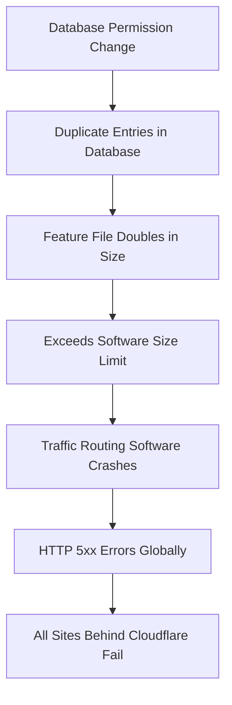

On November 18, 2025, Cloudflare experienced a global outage that took down ChatGPT, X (formerly Twitter), Spotify, Dropbox, Coinbase, and millions of websites. A seemingly simple database permission change cascaded into a 6-hour nightmare. Here's the technical breakdown and what developers need to learn.

---

## Timeline: 6 Hours of Global Disruption

All times in EST (Eastern Standard Time):

```mermaid
gantt
    dateFormat HH:mm
    axisFormat %I:%M %p
    
    section Detection
    HTTP 5xx errors start :done, 06:20, 10m
    
    section Acknowledgment
    Public statement       :done, 06:30, 33m
    
    section Investigation
    Impact confirmed       :done, 07:03, 57m
    
    section Recovery
    Partial recovery       :done, 08:00, 1.5h
    
    section Restoration
    Core traffic restored  :done, 09:30, 2h36m
    
    section Complete
    Full resolution        :done, 12:06, 1h
```

**06:20 AM EST** - Cloudflare's network began experiencing widespread failures. Users accessing sites behind Cloudflare started seeing HTTP 500 and 502 errors. Traffic routing systems started failing globally.

**06:30 AM EST** - Cloudflare publicly acknowledged the issue as "internal service degradation" affecting multiple services. Social media lit up with reports of major sites being down.

**07:03 AM EST** - Status page updated: multiple customers experiencing 500 errors, dashboard/API failures confirmed. The impact was global - every Cloudflare data center affected.

**08:00-08:30 AM EST** - Partial recoveries observed. Cloudflare Access and WARP error rates dropped. Some services started returning to normal, but many major sites still down.

**09:30 AM EST** - Core network traffic largely restored. Most routing systems recovered, though some regions still experiencing issues.

**12:06 PM EST** - Full resolution confirmed. All systems functioning normally. Total duration: approximately 6 hours.

---

## What Broke: The Feature File Cascade

Cloudflare's Bot Management system uses a "feature file" to identify and block bots. This file gets read by software on every Cloudflare machine that routes traffic. Here's what happened:

**The cascade:**

1. **Database permission change** - Someone modified permissions on Cloudflare's database system that generates the Bot Management feature file.

2. **Duplicate entries** - The permission change caused the database to output multiple duplicate entries into the feature file. The file ballooned from its normal size to double.

3. **Size limit exceeded** - The traffic routing software had a hard limit on the feature file size. The doubled size exceeded this limit.

4. **Software crashes** - When the routing software tried to load the oversized file, it failed. This happened on machines across Cloudflare's entire global network.

5. **Global impact** - Because this affected the core traffic routing layer, every site behind Cloudflare started returning errors.

**Why this is worse than the AWS outage:**

The AWS US-East-1 outage was regional. This was global. Every Cloudflare data center in every country was affected simultaneously. When your CDN is down globally, there's no failover - you're just down everywhere.

---

## Cloudflare's Critical Role in the Internet

**The numbers:**
- Cloudflare handles **55 million requests per second** on average
- Protects over **20% of all websites** globally
- Routes traffic through **330+ data centers** in 120+ countries
- Processes **1+ trillion DNS queries daily**

**Why this single point of failure matters:**

When companies use Cloudflare for:
- DDoS protection
- CDN and caching
- DNS resolution
- Bot management
- SSL/TLS termination
- Web Application Firewall

...and Cloudflare goes down, there's often no fallback. Your site is just offline globally. Unlike AWS where you can deploy multi-region, you can't easily have multiple CDN providers handling the same traffic simultaneously.

---

## Who Got Hit

**Major services affected:**
- **ChatGPT** - Millions couldn't access OpenAI's chatbot
- **X (Twitter)** - Social media platform experienced significant downtime
- **Spotify** - Music streaming disrupted worldwide
- **Canva** - Design platform inaccessible
- **Dropbox** - File storage and sharing down
- **Coinbase** - Crypto trading platform offline
- **Discord** - Gaming/chat platform affected
- **Shopify stores** - Thousands of e-commerce sites down

**Public infrastructure affected:**
- **New Jersey Transit** - Ticketing and information systems down
- **SNCF (France's railway)** - Booking and scheduling systems disrupted

**The cost:** Millions of users affected, hundreds of thousands of businesses offline, potential revenue losses in the hundreds of millions across all impacted services.

---

## Key Lessons for Developers

### 1. Validate Configuration Changes

The root cause was a database permission change. This should have been caught.

**What you need:**
- **Staging environments** - Test permission changes in non-production first
- **Configuration validation** - Automated checks for config changes before deployment
- **Gradual rollouts** - Canary deployments for infrastructure changes
- **Rollback plans** - Ability to instantly revert configuration changes

A permission change shouldn't be able to take down your entire global infrastructure. If it can, your change management process is broken.

### 2. Implement Size Limits with Headroom

The software had a size limit, but it was too close to the normal file size. When the file doubled, it exceeded the limit and crashed.

**Design principle:**
- Set limits at **3-5x normal size**, not 1.5x
- Monitor file sizes and alert on unusual growth
- Fail gracefully - truncate or reject, don't crash
- Load test with oversized inputs

Your system should handle unexpected data growth without failing catastrophically.

### 3. Prevent Duplicate Data at the Source

The permission change caused duplicate entries. Why didn't the database have constraints to prevent duplicates?

**Database best practices:**
- **Unique constraints** on columns that shouldn't have duplicates
- **Foreign key constraints** to maintain referential integrity
- **Check constraints** to validate data on insert
- **Triggers** to catch and prevent bad data

Relying on application logic alone isn't enough. Databases should enforce data integrity.

### 4. Have Circuit Breakers for Critical Systems

When the Bot Management system failed, it took down all traffic routing. This should have degraded gracefully.

**Resilience patterns:**
- **Circuit breakers** - Stop calling failing services, use fallback behavior
- **Graceful degradation** - If bot detection fails, allow traffic through anyway
- **Fallback modes** - Have a "safe mode" that works without optional features
- **Bulkheads** - Isolate failures to prevent cascade

Bot management is important, but it shouldn't be able to take down your entire network. Core traffic routing should work even if bot detection fails.

### 5. Have CDN Redundancy

This is hard, but not impossible. Some high-availability setups use:

**Multi-CDN strategies:**
- **DNS-based failover** - Route53/Cloudflare Load Balancer to switch between CDNs
- **Origin-based routing** - Your origin can route to backup CDN on primary failure
- **Edge workers** - Logic at the edge to handle failover
- **Multi-CDN management platforms** - Tools like Cedexis/NS1 that manage multiple CDNs

Yes, it's expensive. But compare that cost to 6 hours of global downtime.

---

## The Bottom Line

A database permission change caused duplicate entries in a feature file, which doubled in size, exceeded a hard limit, and crashed traffic routing software globally for 6 hours. Millions of users couldn't access critical services.

**The lessons:**
1. **Validate configuration changes** before production
2. **Set size limits with headroom** - 3-5x normal, not 1.5x
3. **Enforce data integrity** at the database level
4. **Design for graceful degradation** - optional features shouldn't break core functionality
5. **Monitor configuration files** for unexpected changes
6. **Test failure scenarios** regularly
7. **Consider CDN redundancy** for critical services

**The harsh reality:** Single points of failure will fail. The question is whether your system fails gracefully or catastrophically.

Build resilient systems that expect failure, handle it gracefully, and recover quickly. Test those failure modes. Have rollback plans. Monitor everything.

The next outage is coming. Will your application handle it?

---

**Resources:**
- [Cloudflare Incident Report](https://blog.cloudflare.com/18-november-2025-outage/)

