On December 5, 2025, Cloudflare experienced another global outage, just 17 days after the November 18 incident. This time, approximately 28% of all HTTP traffic served by Cloudflare was affected for 25 minutes. The root cause was a Lua nil value exception that had been hiding in their codebase for years, waiting for exactly the right combination of inputs to surface.

---

## Timeline: 25 Minutes of Disruption

All times in UTC:


**08:47 UTC** - A configuration change was deployed and began propagating across Cloudflare's global network. Unlike their gradual deployment system, this change used the global configuration system that propagates within seconds.

**08:48 UTC** - The change fully propagated. HTTP 500 errors started appearing globally for affected customers.

**08:50 UTC** - Automated alerts triggered. The incident was declared.

**09:11 UTC** - The configuration change was reverted. Propagation of the fix began.

**09:12 UTC** - All traffic restored. Total impact duration: approximately 25 minutes.

---

## What Broke: The Security Fix That Backfired

This incident started with good intentions. Cloudflare was working to protect customers from CVE-2025-55182, a critical vulnerability in React Server Components. Here is how a security measure turned into a global outage:

```mermaid
graph TB
    A[CVE-2025-55182 Disclosed] --> B[WAF Buffer Size Increase: 128KB → 1MB]
    B --> C[Gradual Rollout Begins]
    C --> D[Internal WAF Testing Tool Incompatible]
    D --> E[Decision: Disable Testing Tool]
    E --> F[Global Config System Used - Instant Propagation]
    F --> G[FL1 Proxy Hits Nil Value Bug]
    G --> H[HTTP 500 Errors for 28% of Traffic]
```



**The sequence of events:**

1. **React vulnerability disclosure** - CVE-2025-55182, a critical vulnerability in React Server Components, was disclosed. Cloudflare needed to act fast.

2. **Buffer size increase** - Cloudflare's WAF buffers HTTP request body content for analysis. The default was 128KB. To properly protect Next.js applications (which allow 1MB by default), they started rolling out a buffer size increase.

3. **Gradual rollout working** - The buffer size change was being deployed through their gradual deployment system with proper health validation.

4. **Testing tool incompatibility** - During the rollout, they discovered their internal WAF testing tool did not support the increased buffer size.

5. **The fateful decision** - Since the testing tool was not needed at that moment and had no effect on customer traffic, they decided to turn it off.

6. **Wrong deployment system** - The testing tool was disabled using the global configuration system. This system does not perform gradual rollouts. It propagates changes within seconds to the entire fleet.

7. **The hidden bug surfaces** - In their FL1 proxy, under specific circumstances, disabling the testing tool caused a code path that had never been exercised before.

---

## The Bug: A Nil Value Waiting to Strike

Cloudflare's rulesets system evaluates rules for each incoming request. A rule has a filter (which traffic to match) and an action (what to do with it). Actions include `block`, `log`, `skip`, and `execute`. The `execute` action triggers evaluation of another ruleset.

Their internal logging system uses `execute` to evaluate test rules before making them public. It was this test rule system they were trying to disable.

Cloudflare has a killswitch subsystem for quickly disabling misbehaving rules. They have used it many times before with a well-defined Standard Operating Procedure. But they had never applied a killswitch to a rule with an `execute` action.

Here is the problematic code:

```lua
if rule_result.action == "execute" then
  rule_result.execute.results = ruleset_results[tonumber(rule_result.execute.results_index)]
end
```

**The assumption:** If `action` equals `execute`, then `rule_result.execute` must exist.

**The reality:** When the killswitch was applied, the code correctly skipped the evaluation of the execute action. But then it tried to access `rule_result.execute`, which was `nil` because the rule had been skipped.

The Lua interpreter threw an exception:

```
[lua] Failed to run module rulesets callback late_routing: 
/usr/local/nginx-fl/lua/modules/init.lua:314: 
attempt to index field 'execute' (a nil value)
```

This bug had existed undetected for many years. It required a very specific combination of inputs: a killswitch applied to an execute action rule. That combination had never occurred until December 5, 2025.

---

## Who Got Hit

Not everyone was affected. The impact was limited to customers meeting specific criteria:

**Affected:**
- Web assets served by Cloudflare's older FL1 proxy
- **AND** had the Cloudflare Managed Ruleset deployed

**Not affected:**
- Customers on the newer FL2 proxy
- Customers without the Managed Ruleset
- Traffic served by Cloudflare's China network
- Some test endpoints like `/cdn-cgi/trace`

For affected customers, all requests returned HTTP 500 errors. There was no partial degradation. It was all or nothing.

---

## The Type System Angle

Here is where it gets interesting for developers. From Cloudflare's post:

> "This type of code error is prevented by languages with strong type systems. In our replacement for this code in our new FL2 proxy, which is written in Rust, the error did not occur."

The same logic in Rust would look something like this:

```rust
if let Some(execute) = &rule_result.execute {
    // Only runs if execute is Some
    execute.results = ruleset_results[execute.results_index];
}
```

The Rust compiler would force you to handle the `None` case. You cannot accidentally access a field that might not exist. The FL2 proxy, written in Rust, was not affected by this incident because the strong type system made this class of bugs impossible.

This is not just academic. A runtime nil value exception in Lua brought down 28% of HTTP traffic. A compile-time check in Rust prevented the same issue in FL2.

---

## Two Outages, Same Root Cause

This was Cloudflare's second major outage in 17 days. Both incidents share a common pattern:

| Aspect | November 18 | December 5 |
|--------|-------------|------------|
| Trigger | Database permission change | WAF testing tool disabled |
| Deployment | Global config system | Global config system |
| Rollout | Instant, no gradual | Instant, no gradual |
| Impact | 6 hours, global | 25 minutes, 28% of traffic |

The global configuration system is the common thread. It propagates changes within seconds to the entire fleet. No health validation. No gradual rollout. No blast radius control.

After the November 18 outage, Cloudflare announced they were working on fixes. From their December 5 post:

> "We believe these changes would have helped prevent the impact of today's incident but, unfortunately, we have not finished deploying them yet."

The fix was in progress. The next incident arrived first.

---

## Key Lessons for Developers

### 1. Feature Flags Need Test Coverage for All Code Paths

Cloudflare's killswitch had been used many times. But never on an `execute` action. The first time it was used that way, it triggered a bug.

**The principle:** Your feature flags and killswitches affect code paths. Those code paths need test coverage.

- Test enabling AND disabling for every flag
- Test every combination of flags that can occur together
- Test edge cases: what happens when a flag disables something that other code assumes exists?

A killswitch that has never been tested is a bug waiting to happen.

### 2. Gradual Rollouts Are Not Just for Code

Cloudflare had two deployment systems:

1. **Gradual rollout** - Used for the buffer size increase. Proper health validation.
2. **Global config** - Used to disable the testing tool. Instant propagation everywhere.

The buffer size change was going fine. The instant config change caused the outage.

**Apply gradual rollouts to:**
- Code deployments
- Configuration changes
- Feature flag changes
- Infrastructure changes
- Database migrations

If a change can break production, it needs gradual rollout with health validation. Period.

### 3. Nil/Null Access is a Reliability Problem, Not Just a Code Quality Issue

This was not a minor bug. A nil value exception took down 28% of a global CDN. Runtime null pointer exceptions are one of the most common causes of production incidents.

**Mitigation strategies:**
- **Use languages with strong type systems** (Rust, TypeScript with strict mode, Kotlin, Swift)
- **Use Option/Maybe types** instead of nullable references
- **Enable strict null checking** in languages that support it
- **Static analysis tools** that catch potential null dereferences

Cloudflare's migration to Rust for FL2 is not just about performance. It is about eliminating entire classes of runtime errors.

### 4. Assume Every Bug is Dormant

This bug existed for years. It was just waiting for the right combination of inputs.

**The reality of dormant bugs:**
- Your codebase has bugs you do not know about
- They are waiting for specific inputs you have never tested
- Edge cases in production are more common than you think
- "It has always worked" means nothing

**What helps:**
- Fuzz testing to find edge cases
- Property-based testing
- Chaos engineering
- Comprehensive test coverage for feature flag combinations

### 5. Fail-Open for Non-Critical Features

Cloudflare is now implementing "fail-open" error handling:

> "If a configuration file is corrupt or out-of-range, the system will log the error and default to a known-good state or pass traffic without scoring, rather than dropping requests."

The WAF testing tool was not critical for customer traffic. Its failure should not have caused HTTP 500 errors. A non-essential feature should degrade gracefully, not take down the entire system.

**Design principle:** Classify your features as critical or non-critical. Non-critical features should fail-open. Critical features should have fallback behavior.

---

## The Bottom Line

A security fix triggered a killswitch that was applied to an `execute` action for the first time. This exposed a nil value bug that had been dormant for years. The global config system propagated the bug to the entire fleet in seconds. 28% of HTTP traffic returned 500 errors for 25 minutes.

**The lessons:**

1. **Test your feature flags thoroughly** - Every flag, every combination, every code path affected
2. **Gradual rollouts for everything** - Config changes are just as dangerous as code changes
3. **Null/nil safety is a reliability issue** - Strong type systems prevent entire classes of production incidents
4. **Dormant bugs are everywhere** - Your code has bugs waiting for the right inputs
5. **Fail-open for non-critical features** - Optional components should not break core functionality
6. **Fast propagation is dangerous** - Instant global deployment has no blast radius control

**The pattern:** A deployment system that propagates changes instantly to the entire fleet, without health validation, has now caused two major outages in 17 days.

The problem is not the individual bugs. Those will always exist. The problem is the deployment system that turns a single bug into a global incident. Cloudflare knows this. The fix is in progress. The question is whether it will be ready before the next incident.

Build systems that assume failure. Deploy with gradual rollouts. Validate health before expanding. Have rollback ready. These are not optional practices. They are the difference between a localized issue and a global outage.

---

**Resources:**
- [Cloudflare Incident Report - December 5, 2025](https://blog.cloudflare.com/5-december-2025-outage/)
- [Cloudflare Incident Report - November 18, 2025](https://blog.cloudflare.com/18-november-2025-outage/)
- [Previous analysis: November 2025 Cloudflare Outage](/cloudflare-outage-november-2025/)


