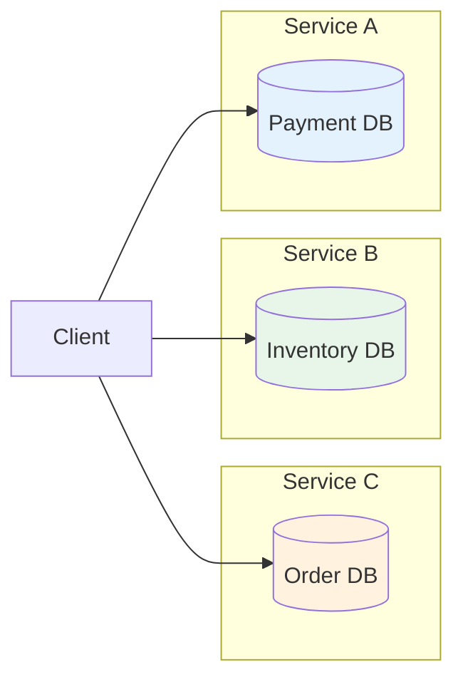
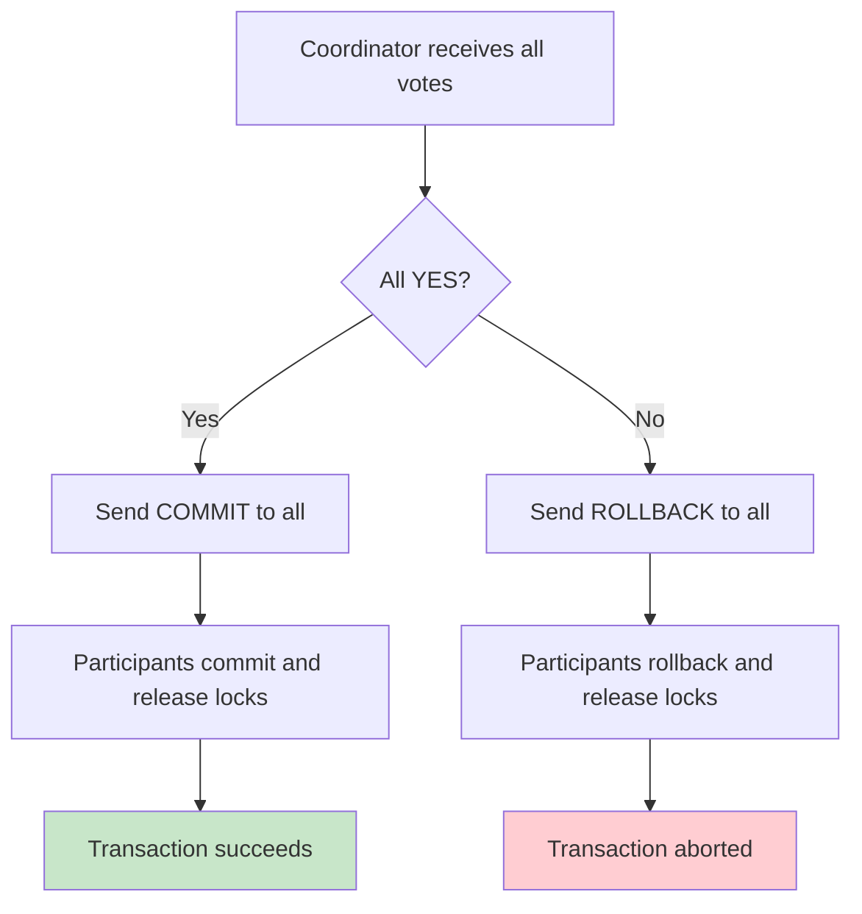
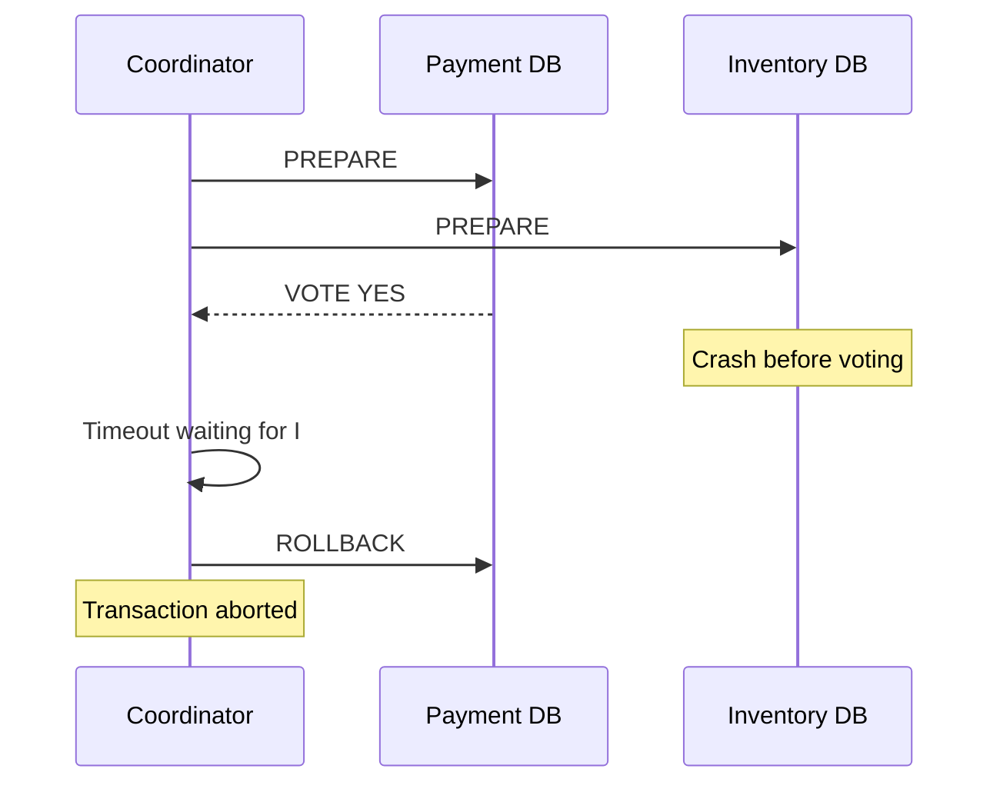
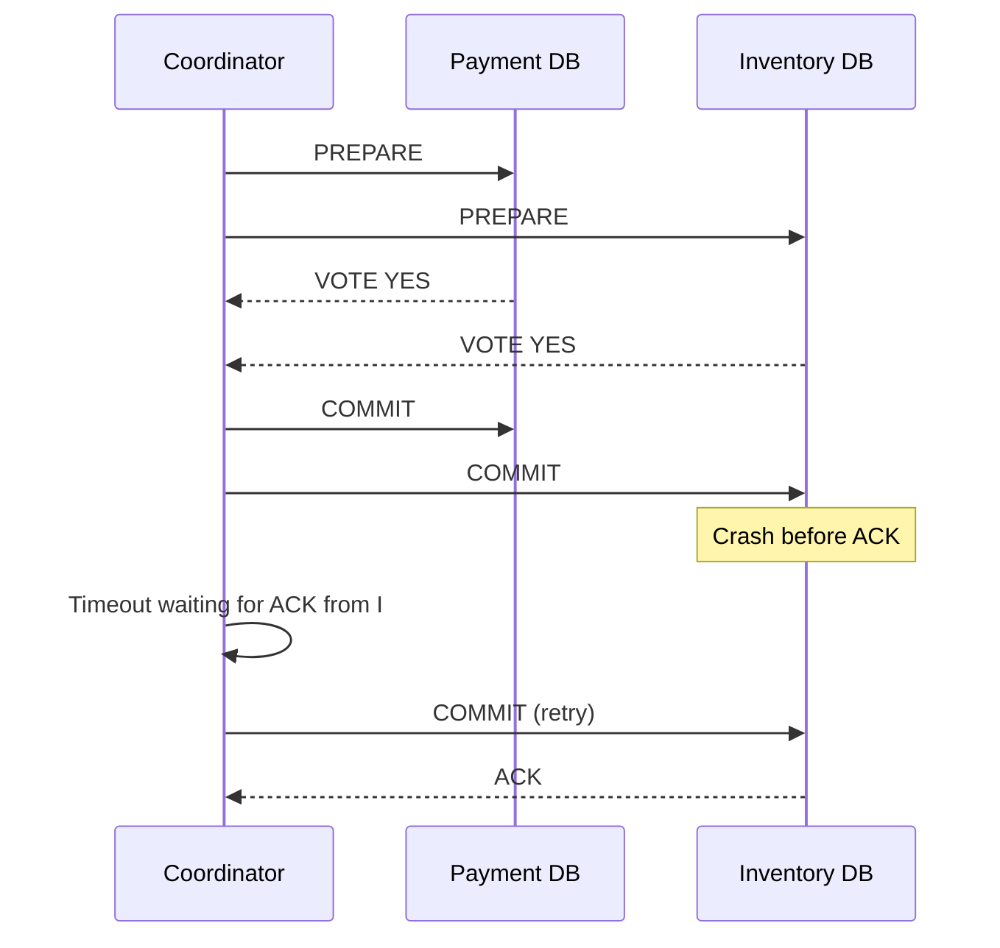
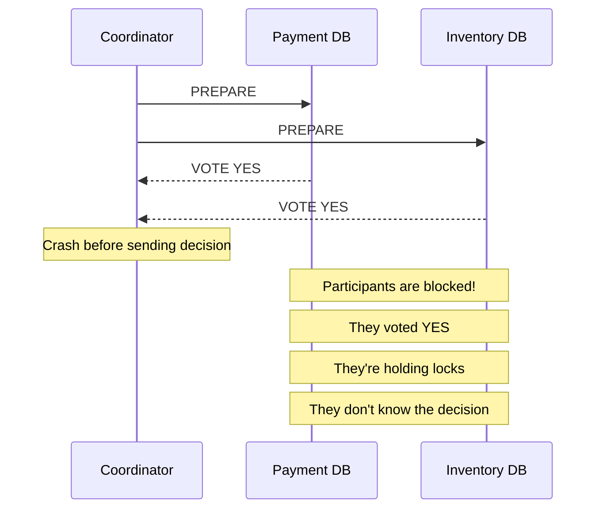
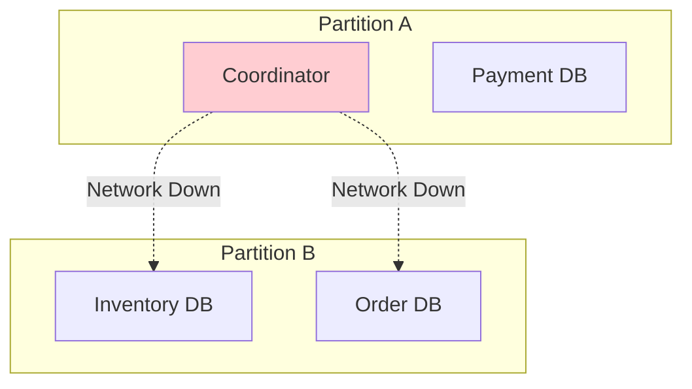
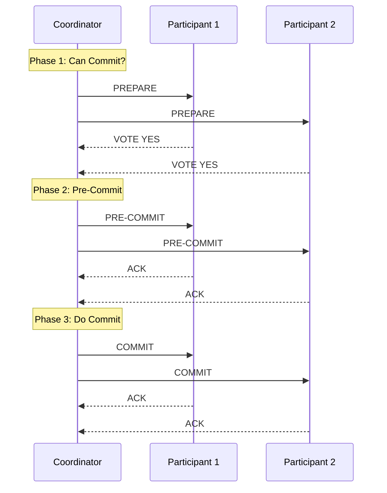
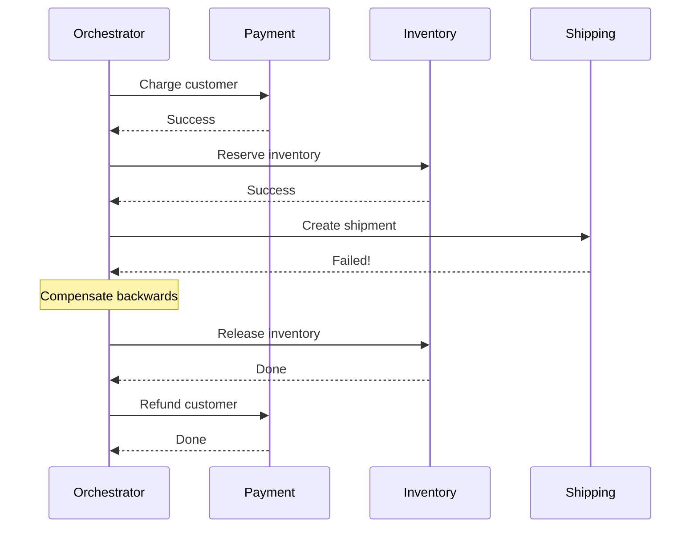

**Two-Phase Commit (2PC)** is one of the oldest and most fundamental protocols in distributed systems. But why do we need it?

You're building an e-commerce system. A customer places an order. Three things need to happen:
1. Deduct $100 from the customer's wallet (Payment Service)
2. Reserve 1 item from inventory (Inventory Service)
3. Create the order record (Order Service)

Each service has its own database. The customer clicks "Buy Now." Payment goes through. Inventory gets reserved. But right before the order gets created, the Order Service crashes.

Now you have a problem: the customer paid $100, one item is locked in inventory, but there's no order. The customer sees nothing in their order history. Your support team gets a furious call.

This is the **distributed transaction problem**. And it's been haunting developers since the 1970s. The solution? **Two-Phase Commit**, a protocol that coordinates commits across multiple databases to ensure atomicity.

## Why Single Database Transactions Don't Help

In a single database, transactions are elegant:

```sql
BEGIN TRANSACTION;
UPDATE wallets SET balance = balance - 100 WHERE user_id = 123;
UPDATE inventory SET quantity = quantity - 1 WHERE product_id = 456;
INSERT INTO orders (user_id, product_id, amount) VALUES (123, 456, 100);
COMMIT;
```

If anything fails, the database rolls everything back. ACID properties guarantee consistency. Life is good.

But what happens when your data lives in three different databases across three different services?



Each database has its own transaction. They don't talk to each other. If one commits and another fails, you're stuck with partial data.

This is where Two-Phase Commit steps in.

## Two-Phase Commit: The Core Idea

The name gives it away. Two-Phase Commit (2PC) splits the commit process into two distinct phases:

1. **Prepare Phase**: Ask everyone "Can you commit?"
2. **Commit Phase**: Tell everyone "Go ahead and commit"

Think of it like organizing a group dinner reservation.

**Phase 1 (Prepare)**: You call each friend and ask "Can you make it Friday at 7pm?" You wait for everyone to confirm.

**Phase 2 (Commit)**: Once everyone says yes, you call them again: "Great, we're confirmed for Friday at 7pm." Now everyone shows up.

If even one friend says "Sorry, I can't make it" during Phase 1, you call everyone back and cancel the whole thing. Nobody shows up to an empty restaurant.

## The Protocol in Detail

Let's trace through what happens in a 2PC transaction:


### Phase 1: The Prepare Phase

The coordinator sends a `PREPARE` message to all participants. Each participant must:

1. **Execute the transaction locally** (but don't commit yet)
2. **Write to the Write-Ahead Log** (so it can recover after a crash)
3. **Lock all resources** involved in the transaction
4. **Vote YES or NO**

A participant votes YES only if it can guarantee it will commit if asked. Once it votes YES, it has made a promise. Breaking that promise means data corruption.

A participant votes NO if:
- It can't acquire necessary locks
- A constraint would be violated
- It's overloaded or unhealthy

### Phase 2: The Commit Phase

The coordinator collects all votes. Then:

**If all votes are YES**: Send `COMMIT` to everyone. Each participant makes changes permanent and releases locks.

**If any vote is NO**: Send `ROLLBACK` to everyone. Each participant undoes changes and releases locks.



## The Coordinator's Log: The Source of Truth

The coordinator keeps a transaction log. This log is critical for recovery:

```
Transaction T1: STARTED
Transaction T1: PREPARED (P, I, O all voted YES)
Transaction T1: COMMITTING
Transaction T1: COMMITTED
```

If the coordinator crashes, it reads this log on restart:
- If it logged `COMMITTING`, it resends `COMMIT` to all participants
- If it only logged `PREPARED`, it can either commit or abort (implementation dependent)
- If it logged nothing, it sends `ROLLBACK`

Similar to how the [Write-Ahead Log pattern](/distributed-systems/write-ahead-log/) ensures durability in single databases, the coordinator's log ensures recovery in distributed transactions.

## What Happens When Things Go Wrong

2PC must handle several failure scenarios. Let's walk through each one.

### Scenario 1: Participant Fails Before Voting



**What happens**: Coordinator times out waiting for a vote. Since not all participants voted YES, it sends ROLLBACK to those that did vote.

**Recovery**: When the failed participant comes back online, it has no record of this transaction (it crashed before writing to its log), so nothing to clean up.

### Scenario 2: Participant Fails After Voting YES



**What happens**: Participant I voted YES, received COMMIT, but crashed before acknowledging. The coordinator retries COMMIT until it gets an ACK.

**Recovery**: When I comes back, it reads its log, sees it voted YES but never committed. It contacts the coordinator (or waits for retry) to find out the decision.

### Scenario 3: Coordinator Fails After Collecting Votes

This is the tricky one:



**What happens**: Both participants voted YES and are now holding locks. They can't commit (they don't know if the other participant voted YES). They can't rollback (they promised to commit if asked). They're stuck.

**This is the Achilles heel of 2PC.** Participants remain blocked until the coordinator recovers or a timeout mechanism kicks in.

### Scenario 4: Network Partition



If the network splits after votes but before decision, participants in the isolated partition are blocked. They voted YES but can't reach the coordinator to learn the outcome.

## The Blocking Problem: 2PC's Fatal Flaw

The coordinator failure scenario reveals 2PC's biggest weakness: **it's a blocking protocol**.

When participants vote YES, they enter an uncertain state where they:
- Hold locks on resources
- Can't unilaterally decide to commit or abort
- Must wait for the coordinator

If the coordinator dies at the wrong moment, participants can be blocked indefinitely. In a busy system, this means:
- Transactions pile up waiting for locks
- Timeouts cascade through the system
- Users see errors and delays

This is why 2PC alone isn't used in modern high-availability systems without additional mechanisms like [heartbeat detection](/distributed-systems/heartbeat/) for coordinator failures.

## Understanding XA: The Standard for Distributed Transactions

Before we look at implementations, let's understand XA, the industry standard that makes 2PC work across different databases and systems.

### What is XA?

XA stands for "eXtended Architecture" and was developed by X/Open (now The Open Group) in 1991. It defines a standard interface between a Transaction Manager (the coordinator) and Resource Managers (the participants like databases, message queues, etc.).

Think of XA as a common language. Without it, every database would have its own way of doing 2PC. Your PostgreSQL database wouldn't know how to coordinate with your MySQL database. XA solves this by defining:

- **Transaction Manager (TM)**: The coordinator that drives the 2PC protocol
- **Resource Manager (RM)**: Any system that can participate in transactions (databases, JMS queues, etc.)
- **XA Interface**: The API that RMs must implement to participate in distributed transactions


### The XA Interface Methods

XA defines specific methods that Resource Managers must implement:

| Method | Phase | Purpose |
|--------|-------|---------|
| `xa_start` | Begin | Associate the current thread with a transaction branch |
| `xa_end` | Begin | Disassociate the thread from the transaction branch |
| `xa_prepare` | Phase 1 | Ask the RM to prepare to commit |
| `xa_commit` | Phase 2 | Tell the RM to make changes permanent |
| `xa_rollback` | Phase 2 | Tell the RM to undo all changes |
| `xa_recover` | Recovery | List transactions that are in prepared state (for crash recovery) |

### The Global Transaction ID (XID)

Every XA transaction has a unique identifier called an XID, which consists of:

- **Format ID**: Identifies the transaction manager
- **Global Transaction ID**: Unique identifier for the overall distributed transaction
- **Branch Qualifier**: Identifies a specific branch within the transaction

This allows multiple databases to know they're part of the same distributed transaction.

### XA in Java (JTA)

In Java, XA is exposed through the Java Transaction API (JTA). Application servers like WildFly, WebLogic, and frameworks like Spring provide transaction managers that handle the coordination:

```java
// Using JTA with Spring
@Transactional
public void transferMoney(long fromAccount, long toAccount, BigDecimal amount) {
    // Spring's JtaTransactionManager coordinates XA behind the scenes
    accountRepository.debit(fromAccount, amount);   // Goes to Database 1
    accountRepository.credit(toAccount, amount);     // Goes to Database 2
    auditService.logTransfer(fromAccount, toAccount, amount);  // Goes to Database 3
}
```

The `@Transactional` annotation with a JTA transaction manager handles all the XA coordination automatically.

## Real-World Implementations

### XA Transactions in Practice

Here's what XA looks like when you need fine-grained control:

```java
// Java example using XA transactions
import javax.transaction.xa.*;
import javax.sql.*;

// Get XA connections from different databases
XAConnection xaConn1 = xaDataSource1.getXAConnection();
XAConnection xaConn2 = xaDataSource2.getXAConnection();

XAResource xaRes1 = xaConn1.getXAResource();
XAResource xaRes2 = xaConn2.getXAResource();

// Create a global transaction ID
Xid xid = new MyXid(1, new byte[]{0x01}, new byte[]{0x02});

try {
    // Phase 1: Prepare
    xaRes1.start(xid, XAResource.TMNOFLAGS);
    // ... do work on connection 1 ...
    xaRes1.end(xid, XAResource.TMSUCCESS);
    
    xaRes2.start(xid, XAResource.TMNOFLAGS);
    // ... do work on connection 2 ...
    xaRes2.end(xid, XAResource.TMSUCCESS);
    
    int vote1 = xaRes1.prepare(xid);
    int vote2 = xaRes2.prepare(xid);
    
    // Phase 2: Commit or Rollback
    if (vote1 == XAResource.XA_OK && vote2 == XAResource.XA_OK) {
        xaRes1.commit(xid, false);
        xaRes2.commit(xid, false);
    } else {
        xaRes1.rollback(xid);
        xaRes2.rollback(xid);
    }
} catch (XAException e) {
    // Handle failure, rollback both
    xaRes1.rollback(xid);
    xaRes2.rollback(xid);
}
```

### PostgreSQL's PREPARE TRANSACTION

PostgreSQL has native 2PC support:

```sql
-- On database 1: Prepare the transaction
BEGIN;
UPDATE accounts SET balance = balance - 100 WHERE id = 1;
PREPARE TRANSACTION 'transfer_123';

-- On database 2: Prepare the transaction
BEGIN;
UPDATE accounts SET balance = balance + 100 WHERE id = 2;
PREPARE TRANSACTION 'transfer_123';

-- If both succeed, commit everywhere
COMMIT PREPARED 'transfer_123';

-- If any fails, rollback everywhere
ROLLBACK PREPARED 'transfer_123';
```

**Important**: Prepared transactions hold locks until committed or rolled back. If your application crashes without completing Phase 2, you'll have orphaned prepared transactions blocking other operations.

```sql
-- Check for orphaned prepared transactions
SELECT * FROM pg_prepared_xacts;

-- Clean up manually if needed
ROLLBACK PREPARED 'abandoned_transaction_id';
```

### MySQL's XA Implementation

MySQL also supports XA:

```sql
-- Start XA transaction
XA START 'transfer_123';
UPDATE accounts SET balance = balance - 100 WHERE id = 1;
XA END 'transfer_123';

-- Prepare
XA PREPARE 'transfer_123';

-- Commit (or ROLLBACK)
XA COMMIT 'transfer_123';
```

### XA Limitations and Gotchas

XA isn't perfect. Here are common issues developers face:

**1. Not All Databases Support XA Equally**

While PostgreSQL, MySQL, Oracle, and SQL Server support XA, the implementations vary:
- MySQL had bugs with XA and replication until version 5.7
- Some NoSQL databases don't support XA at all
- Cloud managed databases may have restrictions (e.g., AWS RDS has XA limitations)

**2. Connection Pool Complications**

XA connections behave differently from regular connections:

```java
// Regular connection: returned to pool after use
Connection conn = dataSource.getConnection();
// ... use connection ...
conn.close();  // Returns to pool immediately

// XA connection: can't be reused until transaction completes
XAConnection xaConn = xaDataSource.getXAConnection();
// ... transaction in progress ...
// Connection is "stuck" until xa_commit or xa_rollback
```

This means you need larger connection pools for XA workloads.

**3. Performance Overhead**

XA adds latency at multiple points:
- Extra round trips for prepare and commit phases
- Logging overhead for transaction recovery
- Lock holding time is longer

Benchmarks typically show 30-40% throughput reduction compared to local transactions.

**4. Heuristic Decisions**

When the coordinator is down too long, database admins might force a decision:

```sql
-- DBA forces a commit after coordinator dies
XA COMMIT 'stuck_transaction' ONE PHASE;
```

This is called a "heuristic decision" and can cause data inconsistency if the coordinator later tries to rollback.

**5. Recovery Requires Manual Intervention**

When things go wrong, you often need to clean up manually:

```sql
-- Find stuck XA transactions in MySQL
XA RECOVER;

-- Force rollback of orphaned transaction
XA ROLLBACK 'orphaned_xid';
```

## Three-Phase Commit: Fixing the Blocking Problem

To address 2PC's blocking issue, researchers developed Three-Phase Commit (3PC). It adds a pre-commit phase:



The pre-commit phase ensures that if a participant is in pre-commit state and the coordinator fails, the participant can safely commit. The protocol guarantees that if any participant received pre-commit, all participants that voted YES will eventually receive it.

**The catch**: 3PC doesn't work with network partitions. If the network splits, different partitions might make different decisions. This is why 3PC is rarely used in practice.

## Why Modern Systems Avoid 2PC

Despite being the "correct" solution, 2PC has fallen out of favor for several reasons:

### 1. Latency

Every transaction requires multiple round trips:
- Coordinator to participants: PREPARE
- Participants to coordinator: VOTE
- Coordinator to participants: COMMIT
- Participants to coordinator: ACK

In a geo-distributed system, this adds hundreds of milliseconds per transaction.

### 2. Availability

2PC requires all participants to be available. If one database is down, no transactions can complete. This violates the "A" in the CAP theorem.

### 3. Lock Contention

Locks are held from the start of Phase 1 until the end of Phase 2. In a slow network, this can be seconds. Other transactions waiting for these locks pile up.

### 4. Coordinator as Single Point of Failure

If the coordinator dies at the wrong time, participants are blocked. You need coordinator replication, which adds more complexity.

## Alternatives to 2PC

Modern distributed systems often use different approaches:

### Saga Pattern

Instead of one big transaction, break it into a sequence of local transactions with compensating actions:



Each step has a compensating transaction. If step 3 fails, run compensations for steps 2 and 1. This provides eventual consistency without distributed locking.

### Event Sourcing with Outbox Pattern

Store events in an outbox table within the same database transaction:

```sql
BEGIN;
UPDATE accounts SET balance = balance - 100 WHERE id = 1;
INSERT INTO outbox (event_type, payload) 
VALUES ('payment_completed', '{"amount": 100, "user_id": 1}');
COMMIT;
```

A separate process reads the outbox and publishes events to other services. This ensures the event is only published if the local transaction commits.

This approach aligns well with how [Kafka handles event streaming](/distributed-systems/how-kafka-works/) and how [CQRS separates reads from writes](/explainer/cqrs-design-pattern/).

### TCC (Try-Confirm-Cancel)

Similar to 2PC but at the application level:

1. **Try**: Reserve resources (but don't commit)
2. **Confirm**: Finalize all reservations
3. **Cancel**: Release all reservations

The difference from 2PC is that "Try" doesn't hold database locks. It reserves at the application level (like marking inventory as "reserved" in a status field).

## When Should You Actually Use 2PC?

Despite its problems, 2PC is the right choice in certain scenarios:

**Use 2PC when:**
- You need strong consistency across databases
- Transaction duration is short (milliseconds)
- All participants are within the same data center
- Availability can tolerate brief coordinator failures
- You're using databases that support XA well (PostgreSQL, MySQL, Oracle)

**Avoid 2PC when:**
- Services are geo-distributed (latency kills performance)
- High availability is non-negotiable
- Transactions are long-running
- You're working with services that don't support XA
- You can tolerate eventual consistency

## 2PC in the Wild

### Google Spanner

Google Spanner uses a variant of 2PC combined with Paxos consensus for replication. The coordinator isn't a single server but a Paxos group, eliminating the single point of failure. TrueTime (GPS-synchronized clocks) helps with lock-free reads.

This is similar to how [Paxos achieves consensus](/distributed-systems/paxos/) in distributed systems.

### CockroachDB

CockroachDB implements a modified 2PC where the transaction record itself is replicated via Raft consensus. This ensures the coordinator state survives node failures.

### Amazon DynamoDB Transactions

DynamoDB supports transactions across multiple items using an optimistic 2PC variant. It checks for conflicts at commit time rather than holding locks during prepare.

## The Trade-offs

| Aspect | 2PC | Saga | Eventually Consistent |
|--------|-----|------|----------------------|
| **Consistency** | Strong | Eventual with compensations | Eventual |
| **Availability** | Lower (all participants needed) | Higher | Highest |
| **Latency** | Higher (multiple round trips) | Medium | Lowest |
| **Complexity** | Database-level | Application-level | Application-level |
| **Recovery** | Automatic (with good coordinator) | Manual compensations | Reconciliation |
| **Use Case** | Financial transactions | E-commerce orders | Analytics, caching |

## Frequently Asked Questions

### What is Two-Phase Commit in simple terms?

Two-Phase Commit (2PC) is a protocol that ensures all databases in a distributed system either commit a transaction together or rollback together. Phase 1 asks all participants "Can you commit?" and Phase 2 tells them "Go ahead and commit" only if everyone said yes.

### Why is 2PC called a blocking protocol?

2PC is blocking because participants who voted YES must wait for the coordinator's decision. If the coordinator crashes after collecting votes but before sending the commit/rollback decision, participants are stuck holding locks indefinitely until the coordinator recovers.

### What is the difference between 2PC and Saga pattern?

2PC uses distributed locking to achieve strong consistency, requiring all participants to be available. Saga breaks the transaction into local transactions with compensating actions, providing eventual consistency with better availability. 2PC is database-level; Saga is application-level.

### When should I use Two-Phase Commit?

Use 2PC when you need strong consistency across databases, transactions are short (milliseconds), all services are in the same data center, and you're using databases with good XA support like PostgreSQL, MySQL, or Oracle.

### What is XA in distributed transactions?

XA is a standard interface defined by X/Open (now The Open Group) that allows different databases to participate in the same distributed transaction. It defines methods like xa_prepare, xa_commit, and xa_rollback that all XA-compliant databases must implement.

### Can Two-Phase Commit handle network partitions?

No, 2PC struggles with network partitions. If the network splits after participants vote but before receiving the commit decision, participants in the isolated partition remain blocked. This is why modern geo-distributed databases use consensus protocols like Paxos or Raft instead.

## Wrapping Up

Two-Phase Commit is like a seatbelt for distributed transactions. It's not always comfortable, it adds overhead, and sometimes you wish you didn't need it. But when you need guaranteed consistency across multiple databases, it's the protocol that keeps your data honest.

The key lessons:
1. **2PC guarantees atomicity** across distributed resources
2. **The blocking problem is real** and can cause cascading failures
3. **Modern systems often prefer Sagas** for better availability
4. **XA is the standard** for database-level 2PC
5. **Keep transactions short** to minimize lock contention
6. **Monitor and timeout** prepared transactions aggressively

Understanding 2PC isn't just academic. It's the foundation for understanding why modern distributed databases work the way they do, and why patterns like Sagas and event sourcing have become popular alternatives.

---

*For more on distributed systems patterns, check out our posts on [Write-Ahead Log](/distributed-systems/write-ahead-log/), [Paxos Consensus](/distributed-systems/paxos/), [How Kafka Works](/distributed-systems/how-kafka-works/), and [Distributed Counter Architecture](/distributed-counter-architecture-guide/). Building payment systems? See [How Stripe Prevents Double Payment](/how-stripe-prevents-double-payment/) for idempotency patterns.*

*References: [Gray & Reuter's Transaction Processing](https://www.amazon.com/Transaction-Processing-Concepts-Techniques-Management/dp/1558601902), [Martin Kleppmann's Designing Data-Intensive Applications](https://dataintensive.net/), [PostgreSQL PREPARE TRANSACTION docs](https://www.postgresql.org/docs/current/sql-prepare-transaction.html)*

