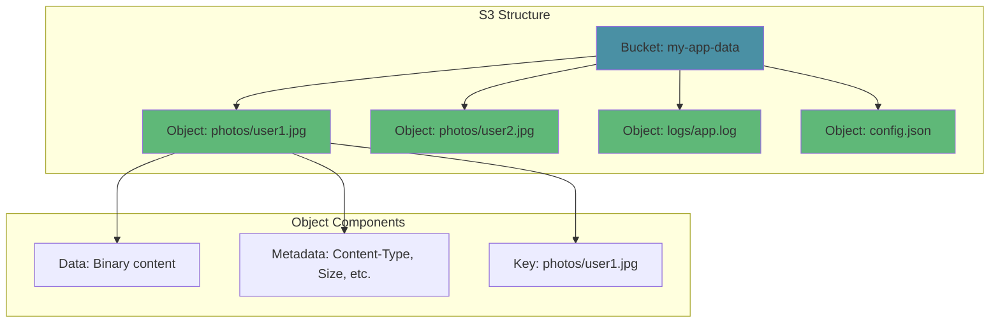
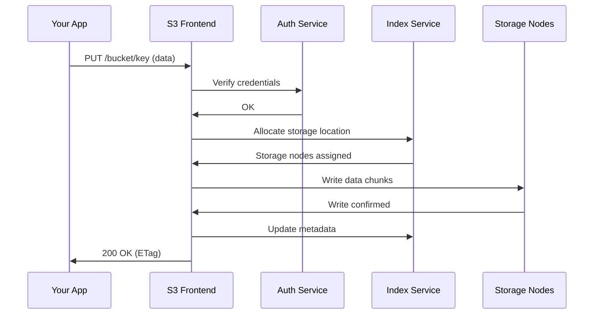
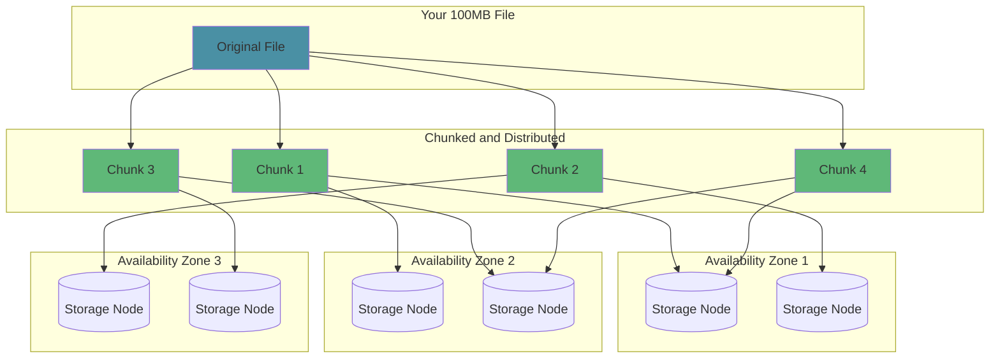
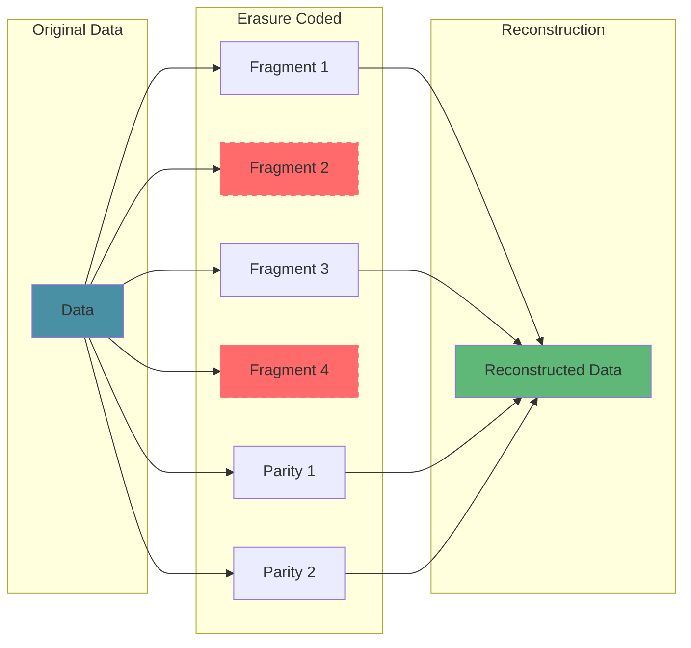
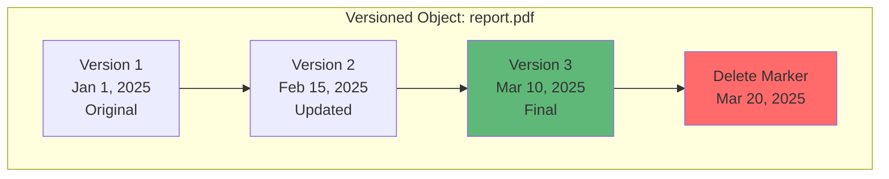
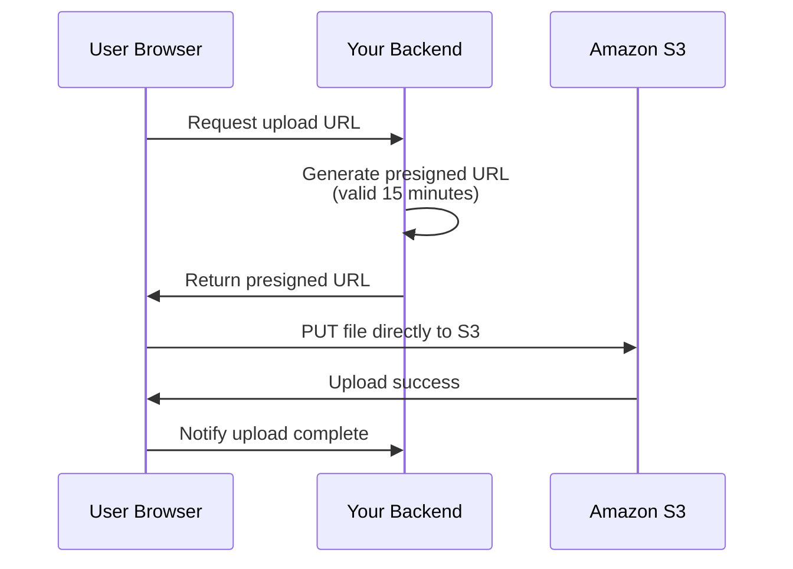
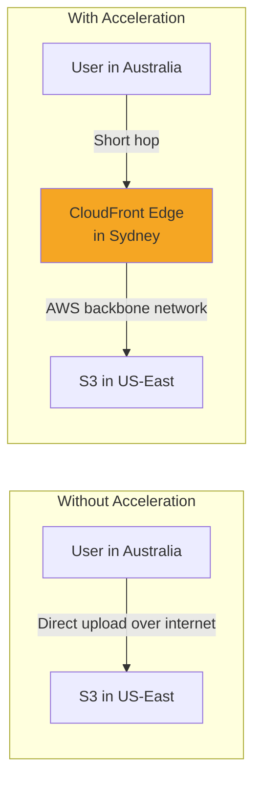
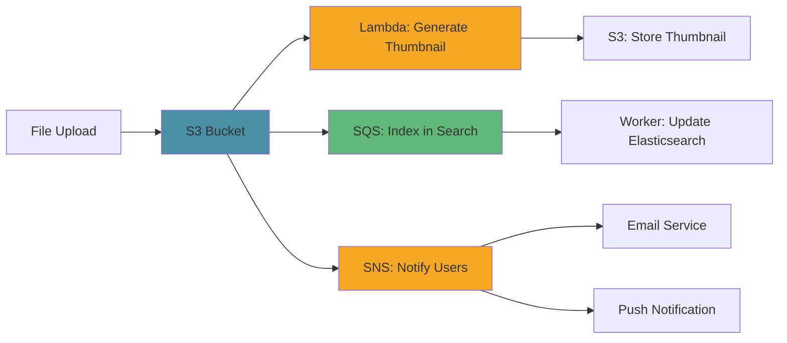
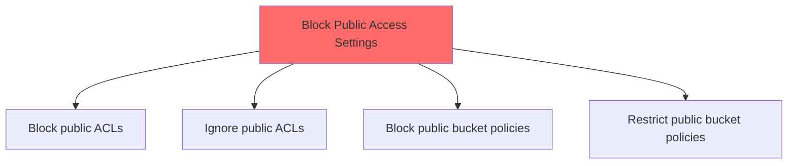
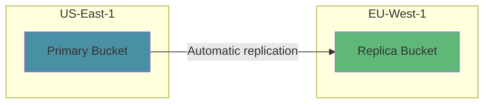

Every second, millions of files land in Amazon S3. Photos, database backups, ML models, application logs. By the time you finish this paragraph, S3 handled another million requests. And it barely noticed.

Netflix streams from it. Airbnb stores photos on it. Slack backs up messages to it. Your favorite apps probably use it too. S3 holds over **100 trillion objects** and delivers 99.999999999% durability. That means if you store 10 million files, you might lose one every 10,000 years.

S3 launched in 2006 with a bold promise: store anything, any size, retrieve it anytime. Almost 20 years later, that promise holds. But how does it actually work?

## What Makes S3 Different

Before S3, if you wanted to store files, you had two options:

1. **Buy hard drives** and manage them yourself
2. **Rent servers** with attached storage

Both approaches had the same problem: capacity planning. You had to guess how much storage you'd need. Guess too low, and you run out of space at 3 AM on a Friday. Guess too high, and you're paying for empty drives.

S3 changed the game. You don't provision storage. You just upload files. Need 1 GB? Fine. Need 1 PB? Also fine. The storage expands automatically. You pay only for what you use.

But "infinite storage" is just the beginning. The real magic is in the guarantees:

- **99.999999999% durability** (11 nines). If you store 10 million objects, you might lose one every 10,000 years.
- **99.99% availability**. Your data is accessible 99.99% of the time.
- **Strong consistency**. Read what you wrote, immediately.

These aren't marketing numbers. They're engineering achievements backed by some clever distributed systems design.

## The Building Blocks: Buckets, Objects, Keys

S3's model is simple. You have three concepts to understand:

### Buckets

A bucket is a container for your data. Think of it as a top-level folder. Every bucket has a globally unique name across all of AWS. If someone named their bucket `my-bucket`, you can't use that name.

```
my-company-prod-assets
my-company-dev-logs
user-uploads-2025
```

Buckets live in a specific AWS region. Your data stays in that region unless you explicitly copy it elsewhere. This matters for latency and compliance.

### Objects

An object is your actual data plus some metadata. It could be:

- A 10 KB JSON config file
- A 50 MB user profile photo
- A 5 TB video file

Each object consists of:

- **Data**: The actual bytes
- **Key**: A unique identifier within the bucket
- **Metadata**: System and user-defined attributes

Objects can be up to 5 TB. For anything over 100 MB, you should use multipart uploads (more on this later).

### Keys

A key is just a string that identifies your object within a bucket. It looks like a file path, but S3 is actually a flat key-value store.

```
photos/2025/january/profile.jpg
logs/app-server/2025-12-08.log
raw-data/customer-123/transactions.json
```

The slashes are just characters. S3 doesn't actually have folders. But the console and most tools display them as folders for convenience.



## How S3 Handles Your Upload

Let's trace what happens when you upload a file to S3.

### Step 1: Your Request Hits the Frontend

You call the S3 API with your bucket name, object key, and data. The request arrives at an S3 frontend server in your region.



### Step 2: Authentication and Authorization

S3 verifies your credentials and checks if you have permission to write to this bucket. This happens on every request. There's no session state.

S3 supports multiple authentication methods:

- **IAM credentials**: For AWS services and applications
- **Presigned URLs**: For temporary access without credentials
- **Bucket policies**: For cross-account access

### Step 3: Data Gets Split and Distributed

Here's where it gets interesting. S3 doesn't store your file as a single blob. It breaks it into chunks and distributes them across multiple storage nodes in multiple data centers.



Why split the data? Two reasons:

1. **Parallelism**: Multiple nodes can serve your read request simultaneously
2. **Fault tolerance**: If one node dies, others have the data

### Step 4: Metadata Gets Indexed

S3 maintains a distributed index that maps your key to the physical locations of your data. This index is replicated across multiple servers for durability.

The index stores:
- Object key
- Object size
- Content type
- Storage locations
- Version information
- Custom metadata

### Step 5: Confirmation

Once the data is safely written to multiple storage nodes and the index is updated, S3 returns success. You get an ETag (a hash of your object) that you can use to verify the upload.

## The 11 Nines: How S3 Achieves Durability

Everyone quotes S3's "11 nines" durability, but few understand what it means or how it's achieved.

**99.999999999% durability** means if you store 10 billion objects, you might lose one per year. Put another way: your hard drive at home has about 1-2% annual failure rate. S3's is 0.000000001%.

How? Through multiple redundancy layers:

### Layer 1: Erasure Coding

S3 doesn't just copy your data three times (that would be wasteful). It uses erasure coding, a technique borrowed from RAID systems.

Your data gets split into fragments, and additional "parity" fragments are computed. Even if several original fragments are lost, the data can be reconstructed from the remaining fragments plus parity.



This is more storage-efficient than simple replication while providing similar durability.

### Layer 2: Multiple Availability Zones

Each AWS region has multiple Availability Zones (AZs). These are separate data centers with independent power, cooling, and networking. They're close enough for low-latency replication but far enough that a local disaster won't affect multiple zones.

S3 Standard stores your data across at least 3 AZs. Even if an entire data center burns down, your data survives.

### Layer 3: Continuous Verification

S3 doesn't just store your data and forget about it. Background processes continuously:

- Verify checksums to detect bit rot
- Replace failed drives before data is lost
- Re-replicate data if a storage node becomes unhealthy

This proactive approach catches problems before they become data loss.

### Layer 4: Versioning

Even with all this redundancy, human error is still a risk. Someone might accidentally delete important files.

S3 versioning keeps every version of every object. Delete something? It's just marked as deleted; previous versions remain. Overwrite something? The old version is preserved.



## Strong Consistency: The 2020 Update

For years, S3 had a quirky consistency model. New objects were immediately visible (read-after-write consistency), but updates and deletes were eventually consistent. You might read stale data for a few seconds after an update.

This caused real problems:

```python
# The old problem
s3.put_object(Bucket='my-bucket', Key='config.json', Body=new_config)
config = s3.get_object(Bucket='my-bucket', Key='config.json')
# Might return OLD config!
```

In December 2020, AWS made S3 strongly consistent. Now, after a successful write, any subsequent read returns the latest data. No waiting. No retries. No application-level caching to work around eventual consistency.

How did they do this without sacrificing performance?

The key insight: S3's index layer was already maintaining strong consistency internally. The eventual consistency was a design choice, not a technical limitation. By propagating index updates synchronously before returning success, they eliminated the window where stale reads could happen.

This was a massive change affecting trillions of objects, and they rolled it out without downtime or any API changes. Existing applications just got better guarantees automatically.

## Storage Classes: Pay for What You Need

Not all data is created equal. Some files are accessed constantly; others sit untouched for years. S3's storage classes let you optimize costs based on access patterns.

| Storage Class | Best For | Cost/GB | Retrieval Time |
|---------------|----------|---------|----------------|
| **S3 Standard** | Frequently accessed data | $0.023 | Instant |
| **S3 Intelligent-Tiering** | Unknown access patterns | Auto-optimized | Instant |
| **S3 Standard-IA** | Monthly access | $0.0125 | Instant |
| **S3 One Zone-IA** | Reproducible data | $0.01 | Instant |
| **S3 Glacier Instant Retrieval** | Quarterly access | $0.004 | Milliseconds |
| **S3 Glacier Flexible Retrieval** | Annual access | $0.0036 | Minutes to hours |
| **S3 Glacier Deep Archive** | Compliance archives | $0.00099 | 12+ hours |


### S3 Standard
For data you access frequently. Highest cost per GB but lowest retrieval cost.

### S3 Intelligent-Tiering
S3 monitors access patterns and moves objects between tiers automatically. Great when you don't know your access patterns.

### S3 Standard-IA (Infrequent Access)
Same durability as Standard but lower storage cost. There's a retrieval fee, so use this for data accessed less than once a month.

### S3 One Zone-IA
Like Standard-IA but stored in only one AZ. 20% cheaper but less resilient. Good for data you can recreate if lost.

### S3 Glacier Instant Retrieval
Archive storage with millisecond retrieval. Good for backups you rarely access but need quickly when you do.

### S3 Glacier Flexible Retrieval
Archive storage with retrieval times from minutes to hours. Much cheaper than Instant Retrieval.

### S3 Glacier Deep Archive
The cheapest option. Retrieval takes 12+ hours. For compliance archives you hope you never need.

### Lifecycle Policies

You don't have to manually move objects between classes. Lifecycle policies automate this:

```json
{
  "Rules": [
    {
      "ID": "Archive old logs",
      "Status": "Enabled",
      "Filter": {
        "Prefix": "logs/"
      },
      "Transitions": [
        {
          "Days": 30,
          "StorageClass": "STANDARD_IA"
        },
        {
          "Days": 90,
          "StorageClass": "GLACIER"
        }
      ],
      "Expiration": {
        "Days": 365
      }
    }
  ]
}
```

This policy moves logs to cheaper storage as they age and deletes them after a year.

## Multipart Uploads: Handling Large Files

Uploading a 5 GB file in a single request is asking for trouble. Network hiccups happen. Timeouts happen. Starting over from scratch is painful.

Multipart upload solves this by breaking large files into chunks:

{: .center-image }
*S3 multipart upload breaks large files into chunks for parallel, resumable uploads*

Benefits:

1. **Parallel uploads**: Upload multiple parts simultaneously for faster transfers
2. **Resumable**: If a part fails, retry just that part
3. **Large file support**: Required for objects over 5 GB
4. **Better throughput**: AWS can optimize routing for each part

Each part can be 5 MB to 5 GB. For most cases, 100 MB parts work well.

```python
import boto3
from boto3.s3.transfer import TransferConfig

s3 = boto3.client('s3')

# Configure multipart upload
config = TransferConfig(
    multipart_threshold=100 * 1024 * 1024,  # 100MB
    multipart_chunksize=100 * 1024 * 1024,  # 100MB
    max_concurrency=10
)

# Upload automatically uses multipart for large files
s3.upload_file(
    'large_file.zip',
    'my-bucket',
    'uploads/large_file.zip',
    Config=config
)
```

## Presigned URLs: Secure Temporary Access

You want users to upload files directly to S3, but you don't want to expose your AWS credentials. Presigned URLs solve this elegantly.

A presigned URL is a regular S3 URL with authentication baked in. Anyone with the URL can perform the specified action until it expires.



```python
import boto3
from datetime import datetime

s3 = boto3.client('s3')

# Generate URL for upload
upload_url = s3.generate_presigned_url(
    'put_object',
    Params={
        'Bucket': 'user-uploads',
        'Key': f'uploads/{user_id}/{filename}',
        'ContentType': 'image/jpeg'
    },
    ExpiresIn=900  # 15 minutes
)

# Generate URL for download
download_url = s3.generate_presigned_url(
    'get_object',
    Params={
        'Bucket': 'user-uploads',
        'Key': 'uploads/123/photo.jpg'
    },
    ExpiresIn=3600  # 1 hour
)
```

This pattern offloads bandwidth from your servers to S3 and simplifies your architecture.

## Request Routing and Performance

S3 handles massive scale through intelligent request routing. Understanding this helps you optimize performance.

### The Partition Key

S3 automatically partitions data based on the object key prefix. Each partition can handle about 3,500 PUT/COPY/POST/DELETE requests and 5,500 GET/HEAD requests per second.

**Bad key design**:
```
logs/2025-12-08-00-00-00.log
logs/2025-12-08-00-00-01.log
logs/2025-12-08-00-00-02.log
```

All these keys have the same prefix (`logs/2025-12-08`), so they hit the same partition. Under high load, you'll get throttled.

**Better key design**:
```
a1b2/logs/2025-12-08-00-00-00.log
c3d4/logs/2025-12-08-00-00-01.log
e5f6/logs/2025-12-08-00-00-02.log
```

Adding a random prefix (like a hash) distributes requests across partitions.

However, S3 has gotten smarter about this. It now automatically analyzes access patterns and repartitions data that becomes hot. For most use cases, you don't need to worry about key design anymore. But for extremely high-throughput scenarios (10,000+ requests/second to similar keys), it still matters.

### S3 Transfer Acceleration

For uploads from far away, S3 Transfer Acceleration routes data through CloudFront's edge locations:



Instead of your data traversing the public internet, it takes a short hop to the nearest edge location and then travels over AWS's optimized backbone. This can improve transfer speeds by 50-500% for distant users.

## Event Notifications: S3 as an Event Source

S3 isn't just storage. It's an event source. When objects are created, deleted, or modified, S3 can trigger:

- **Lambda functions**: Process files immediately after upload
- **SQS queues**: Queue processing jobs
- **SNS topics**: Fan out to multiple subscribers
- **EventBridge**: Complex event routing



This enables powerful serverless patterns. Upload an image, and within seconds a Lambda resizes it, another Lambda runs ML classification, and a worker indexes it for search.

## Security: Defense in Depth

S3 security has multiple layers:

### Bucket Policies
Define who can access what at the bucket level:

```json
{
  "Version": "2012-10-17",
  "Statement": [
    {
      "Sid": "PublicRead",
      "Effect": "Allow",
      "Principal": "*",
      "Action": "s3:GetObject",
      "Resource": "arn:aws:s3:::my-public-website/*"
    }
  ]
}
```

### IAM Policies
Control access based on user identity:

```json
{
  "Version": "2012-10-17",
  "Statement": [
    {
      "Effect": "Allow",
      "Action": [
        "s3:GetObject",
        "s3:PutObject"
      ],
      "Resource": "arn:aws:s3:::my-bucket/uploads/${aws:username}/*"
    }
  ]
}
```

Users can only access their own folder.

### Encryption

**Server-side encryption (SSE)**:
- **SSE-S3**: AWS manages the keys
- **SSE-KMS**: You control keys via AWS KMS
- **SSE-C**: You provide the encryption key with each request

**Client-side encryption**: You encrypt before uploading. S3 never sees plaintext.

### Block Public Access

A safety net that prevents accidental public exposure:



Even if someone misconfigures a bucket policy, these settings prevent public access.

## Real-World Patterns

### Pattern 1: Static Website Hosting

S3 can serve static websites directly:

```
my-website-bucket/
  index.html
  error.html
  css/
    style.css
  js/
    app.js
  images/
    logo.png
```

Add CloudFront in front for HTTPS and caching. This costs pennies compared to traditional hosting.

### Pattern 2: Data Lake

Store raw data in S3, query with Athena or Spark:

```
data-lake/
  raw/
    year=2025/month=12/day=08/
      events-001.parquet
      events-002.parquet
  processed/
    user-sessions/
      year=2025/month=12/
        sessions.parquet
```

The partition structure (`year=2025/month=12/`) enables efficient queries. Athena understands this format.

### Pattern 3: Backup and Archive

Use lifecycle policies to optimize backup costs:

1. Recent backups: S3 Standard
2. 30+ days: S3 Standard-IA
3. 90+ days: S3 Glacier
4. 1+ year: S3 Glacier Deep Archive
5. 7+ years: Delete

### Pattern 4: Cross-Region Replication

For disaster recovery or compliance, replicate to another region:



Every object written to the primary bucket automatically appears in the replica, usually within 15 minutes.

## The Bigger Picture

S3 isn't just a storage service. It's a foundation that other services build on:

- **Athena**: Query S3 data with SQL
- **EMR**: Run Spark/Hadoop on S3 data
- **Lake Formation**: Manage data lakes on S3
- **Macie**: Discover sensitive data in S3
- **CloudFront**: Cache and deliver S3 content globally

Understanding S3 deeply makes you better at all of these.

## Conclusion

S3 appears simple: upload files, download files. But underneath is a marvel of distributed systems engineering. It handles scale, durability, and consistency problems that would break most systems.

The next time you call `s3.put_object()`, you'll know what's happening. Your file gets chunked, erasure coded, distributed across multiple data centers, indexed, and verified. All in a few hundred milliseconds.

That's not magic. That's engineering.

---

*Want to learn more about distributed storage? Check out our posts on [How Kafka Works](/distributed-systems/how-kafka-works/) for log-based storage, [Write-Ahead Log](/distributed-systems/write-ahead-log/) for durability patterns, and [Kubernetes Architecture](/devops/kubernetes-architecture/) for container orchestration. For understanding distributed consensus, see [Paxos Consensus Algorithm](/distributed-systems/paxos/).*

**Further Reading**:
- [Amazon S3 Documentation](https://docs.aws.amazon.com/s3/)
- [S3 Strong Consistency Announcement (AWS Blog)](https://aws.amazon.com/blogs/aws/amazon-s3-update-strong-read-after-write-consistency/)

