Your checkout page just went viral on Twitter. Orders are flooding in. The payment service is getting hammered. Database connections are maxing out. Your monitoring dashboard is screaming red.

This is the moment when most systems break. But well designed systems? They stay calm. They use queues.

Message queues are one of those patterns that separate systems that scale from systems that crash. Yet many developers treat queues as an afterthought. They bolt them on when things start breaking.

Let's fix that. By the end of this post, you'll understand exactly when to use queues, which queue technology to pick, and how companies like Uber, Slack, and Stripe use them to handle millions of requests.

## The Problem: Tight Coupling Breaks Systems

Picture a simple e-commerce checkout flow:

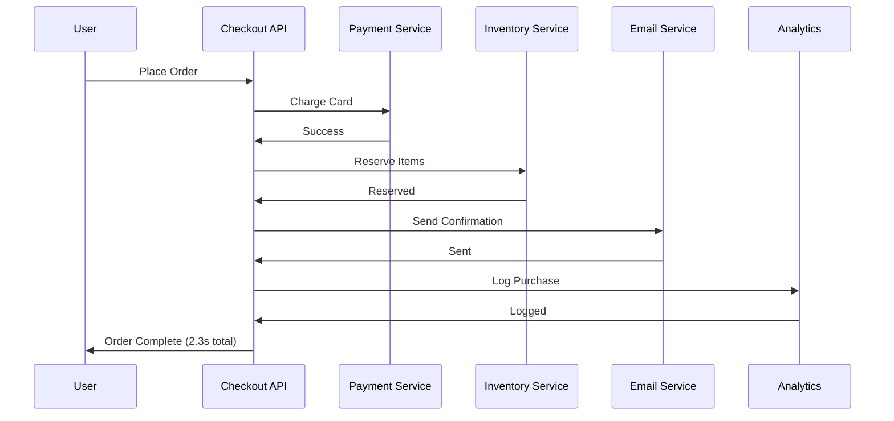

This works fine with 10 users. But what happens at scale?

**Problem 1: Latency adds up**. Each service call takes 200-500ms. Chain four services together and your checkout takes 2+ seconds. Users abandon carts.

**Problem 2: One slow service blocks everything**. If the email service takes 3 seconds because of a spam filter check, your entire checkout waits 3 seconds.

**Problem 3: One failing service kills the whole flow**. Analytics service is down? Checkout fails. Even though analytics isn't critical to completing an order.

**Problem 4: No way to handle traffic spikes**. Black Friday hits, orders spike 10x. All your downstream services must handle 10x load simultaneously. If any one of them can't, the whole system falls over.

This is what we call tight coupling. Every component depends on every other component being fast and available.

## The Solution: Decouple with Queues

A queue sits between services. Instead of calling services directly, you drop a message on the queue. The service picks it up when it's ready.

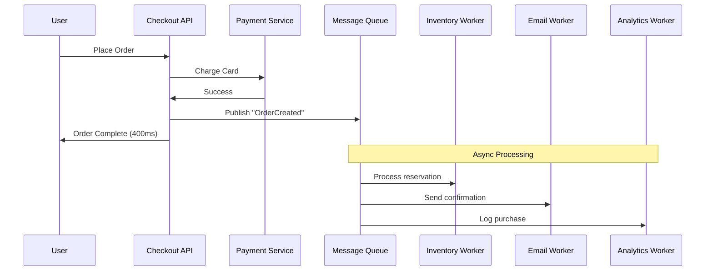

Now your checkout is fast. The user gets a response in 400ms instead of 2.3 seconds. Everything else happens in the background.

**Benefit 1: Faster responses**. Only critical operations block the user. Everything else is async.

**Benefit 2: Fault isolation**. Email service down? Messages pile up in the queue. When it recovers, it processes the backlog. Users never notice.

**Benefit 3: Traffic smoothing**. A sudden spike of 10,000 orders doesn't hit your services all at once. The queue absorbs the burst, and workers process at their own pace.

**Benefit 4: Independent scaling**. Your email worker is slow? Add more email workers. No need to scale the entire system.

## Core Concepts Every Developer Should Know

### Producers and Consumers

The two actors in any queue system:

- **Producer**: Creates messages and puts them on the queue
- **Consumer**: Reads messages from the queue and processes them

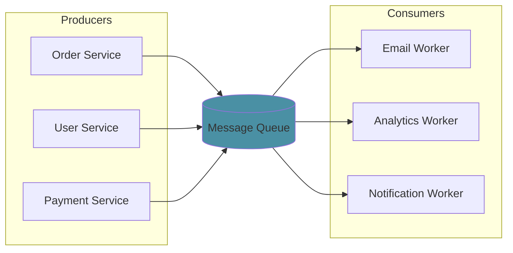

This pattern is called **producer-consumer** or **point-to-point messaging**. One producer sends a message, one consumer receives it.

### Publish-Subscribe (Pub/Sub)

Sometimes multiple consumers need the same message. This is where pub/sub comes in.

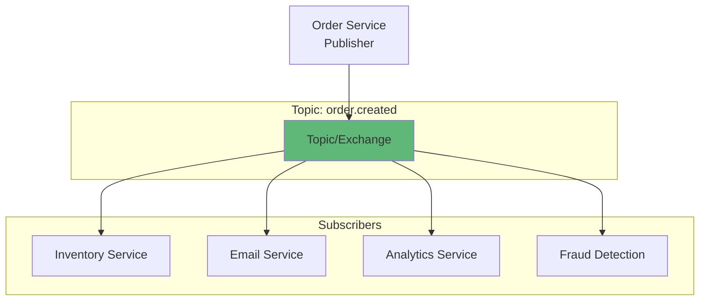

With pub/sub:
- Publisher doesn't know (or care) about subscribers
- Each subscriber gets its own copy of the message
- Adding new subscribers requires no changes to the publisher

This is how event-driven architectures work. Services publish events about what happened. Other services subscribe to events they care about.

### Message Acknowledgment

What happens when a consumer crashes mid-processing? Without proper acknowledgment, you either:
- **Lose the message forever** (bad for payments)
- **Process it twice** (bad for charges)

Queues solve this with acknowledgments (acks):

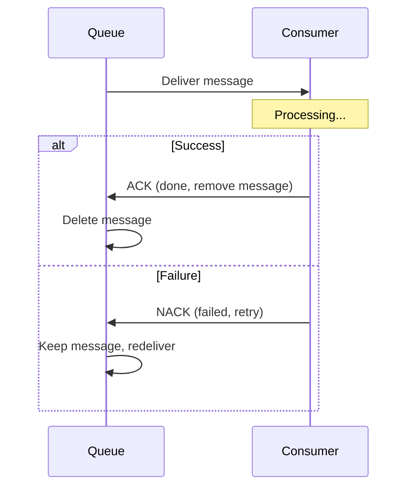

The message stays in the queue until the consumer explicitly acknowledges it. If the consumer crashes, the queue assumes failure and redelivers to another consumer.

### Dead Letter Queues (DLQ)

What if a message keeps failing? Maybe it's malformed. Maybe it triggers a bug. You don't want it blocking other messages forever.

Enter the Dead Letter Queue:

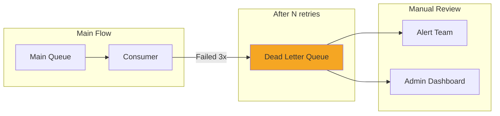

After a configurable number of retries, the message moves to the DLQ. This keeps your main queue healthy while preserving problematic messages for investigation.

**Real story**: A payment processor had a bug where certain currency codes caused JSON parsing to fail. Without a DLQ, those messages would retry forever. With a DLQ, they caught the issue, fixed the bug, and replayed the messages from the DLQ.

## Popular Queue Technologies Compared

### RabbitMQ

**Best for**: Traditional message queuing, complex routing, enterprise integration

RabbitMQ implements the AMQP protocol. It's great when you need sophisticated routing:


**Pros**:
- Flexible routing with exchanges (direct, topic, fanout, headers)
- Built-in management UI
- Supports multiple protocols (AMQP, MQTT, STOMP)
- Low latency for small messages

**Cons**:
- Not designed for high throughput log streaming
- Messages are deleted after consumption (not replayable)
- Scaling beyond single cluster is tricky

**Use RabbitMQ when**: You need complex routing rules, request-reply patterns, or traditional work queue semantics.

### Apache Kafka

**Best for**: High throughput streaming, event sourcing, log aggregation

Kafka isn't a traditional queue. It's a distributed commit log. Messages persist and can be replayed.

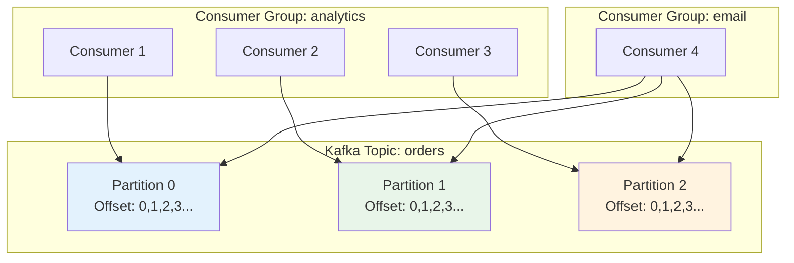

**Pros**:
- Incredible throughput (millions of messages/second)
- Messages persist for days/weeks (replayable)
- Multiple consumer groups can read independently
- Ordering guaranteed within partition

**Cons**:
- Higher latency than RabbitMQ (batching)
- Complex to operate (ZooKeeper dependency, though KRaft mode helps)
- Overkill for simple use cases

**Use Kafka when**: You need high throughput, event sourcing, stream processing, or multiple teams consuming the same events.

For a deeper dive, check out [How Kafka Works](/distributed-systems/how-kafka-works/).

### Amazon SQS

**Best for**: Simple queuing on AWS, serverless architectures

SQS is a fully managed queue. Zero infrastructure to manage.

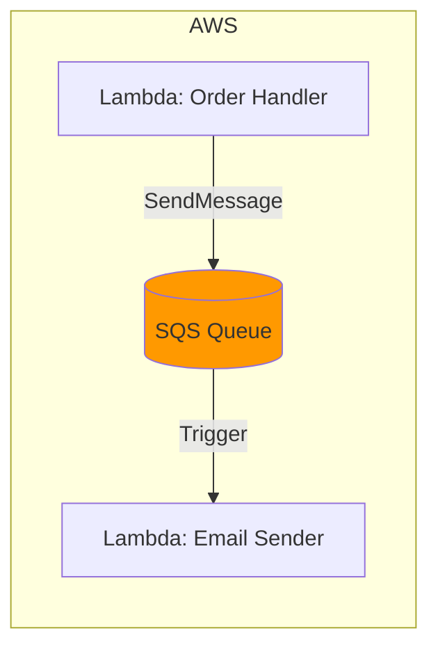

**Two flavors**:
- **Standard**: Nearly unlimited throughput, at-least-once delivery, best-effort ordering
- **FIFO**: Exactly-once delivery, strict ordering, but limited to 3,000 messages/second

**Pros**:
- Zero ops (AWS manages everything)
- Pay per use (no idle costs)
- Native integration with Lambda, SNS, S3
- 14-day message retention

**Cons**:
- AWS vendor lock-in
- Standard queues don't guarantee order
- Maximum message size of 256KB

**Use SQS when**: You're on AWS and want zero ops, or building serverless with Lambda.

### Redis (as a Queue)

**Best for**: Simple queues, real-time features, when you already have Redis

Redis isn't a dedicated queue, but Redis Streams provides queue-like functionality.

```python
# Producer
redis.xadd('orders', {'order_id': '12345', 'amount': '99.99'})

# Consumer
messages = redis.xread({'orders': '0'}, block=5000)
for message in messages:
    process(message)
    redis.xack('orders', 'worker-group', message['id'])
```

**Pros**:
- Sub-millisecond latency
- Already in your stack (probably)
- Simple to set up

**Cons**:
- Limited durability (depends on persistence config)
- No sophisticated routing
- Scaling is harder than dedicated systems

**Use Redis when**: You need simple, fast queuing and Redis is already in your infrastructure.

## Real-World Patterns

### Pattern 1: Work Queue (Task Distribution)

Distribute work across multiple workers. Classic use case: image processing.

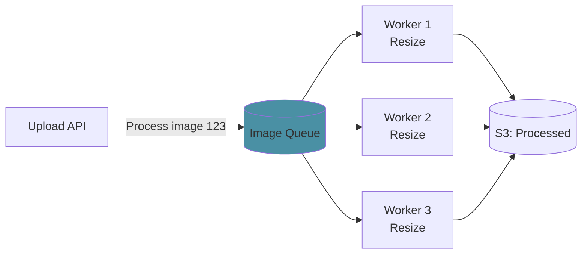

**How Slack does it**: When you upload an image, Slack's API drops a message on a queue. Worker pools pick up messages and generate thumbnails, previews, and virus-scanned copies. The chat UI shows a placeholder until processing completes.

**Implementation tips**:
- Set visibility timeout longer than processing time
- Use message deduplication to handle retries
- Monitor queue depth to auto-scale workers

### Pattern 2: Event-Driven Microservices

Services communicate through events, not direct calls.

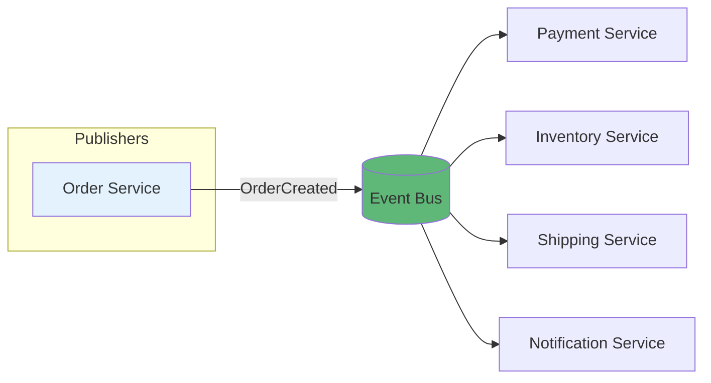

Each service publishes events about what happened. Other services subscribe to events they care about:

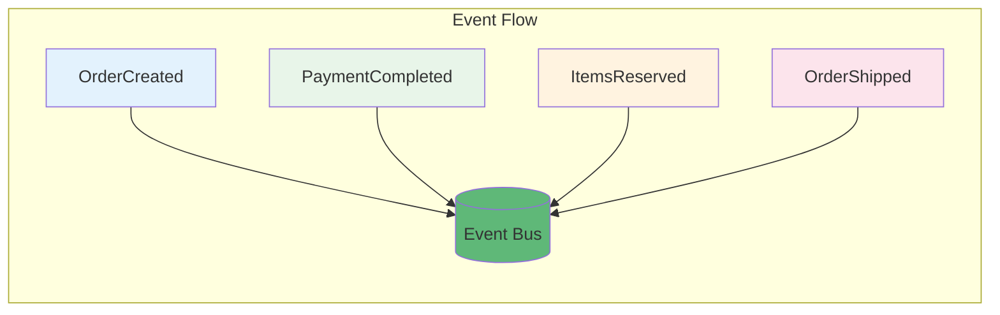

**How Uber works**: When you request a ride, the Ride Service publishes a "RideRequested" event. The Matching Service subscribes and finds drivers. The Notification Service subscribes and sends push notifications. The Pricing Service subscribes and locks the fare. Each service is independent.

**Benefits**:
- Services are loosely coupled
- Easy to add new features (just subscribe to existing events)
- Clear audit trail of what happened

### Pattern 3: Request Buffering (Traffic Smoothing)

Protect your database from traffic spikes.


Your database can handle 1,000 writes/second. Black Friday brings 10,000/second. Instead of crashing, the queue absorbs the spike. Workers process at a sustainable rate. Some operations are delayed, but nothing fails.

**How Stripe handles webhooks**: Your webhook endpoint might be slow or down. Stripe queues webhook events and retries with exponential backoff over 72 hours. Your temporary outage doesn't mean lost payment notifications.

### Pattern 4: Saga Pattern for Distributed Transactions

Need to coordinate actions across services with rollback? Use event choreography.

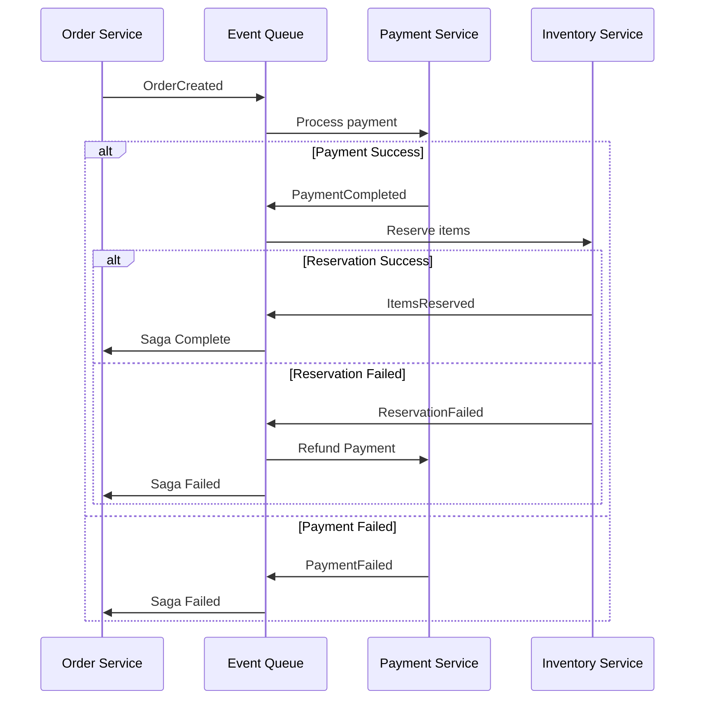

Each service handles its step and publishes the result. If any step fails, compensating actions run to undo previous steps.

For more on this pattern, see [Two-Phase Commit](/distributed-systems/two-phase-commit-distributed-systems/).

### Pattern 5: CQRS with Event Sourcing

Separate read and write models using events.

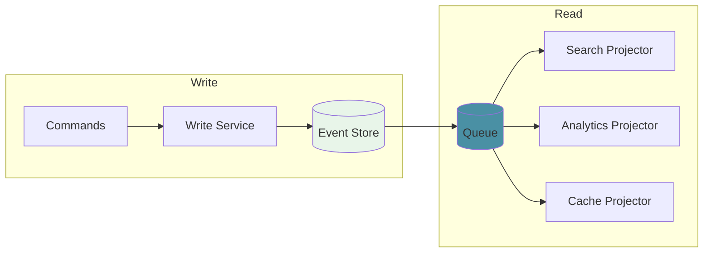

Events flow through the queue to multiple projectors. Each projector builds an optimized read model for its use case.

Learn more about this in [CQRS Design Pattern](/explainer/cqrs-design-pattern/).

## Practical Implementation: Order Processing

Let's build a simple order processing system with proper queue patterns.

**Architecture**:


**Producer (Order API)**:

```python
import json
import boto3

sqs = boto3.client('sqs')
QUEUE_URL = 'https://sqs.us-east-1.amazonaws.com/123456789/order-events'

def create_order(order_data):
    # Sync: Validate and charge
    validate_order(order_data)
    payment_result = charge_payment(order_data)
    
    # Sync: Save to database
    order = save_order(order_data, payment_result)
    
    # Async: Publish event for background processing
    event = {
        'event_type': 'OrderCreated',
        'order_id': order.id,
        'user_id': order.user_id,
        'items': order.items,
        'total': order.total,
        'timestamp': datetime.utcnow().isoformat()
    }
    
    sqs.send_message(
        QueueUrl=QUEUE_URL,
        MessageBody=json.dumps(event),
        MessageAttributes={
            'EventType': {
                'DataType': 'String',
                'StringValue': 'OrderCreated'
            }
        }
    )
    
    # Return immediately, don't wait for email/inventory
    return {'order_id': order.id, 'status': 'processing'}
```

**Consumer (Email Worker)**:

```python
import json
import boto3

sqs = boto3.client('sqs')
QUEUE_URL = 'https://sqs.us-east-1.amazonaws.com/123456789/order-events'
DLQ_URL = 'https://sqs.us-east-1.amazonaws.com/123456789/order-events-dlq'

def process_messages():
    while True:
        response = sqs.receive_message(
            QueueUrl=QUEUE_URL,
            MaxNumberOfMessages=10,
            WaitTimeSeconds=20,  # Long polling
            MessageAttributeNames=['All']
        )
        
        for message in response.get('Messages', []):
            try:
                event = json.loads(message['Body'])
                
                # Check if already processed (idempotency)
                if is_processed(event['order_id']):
                    delete_message(message)
                    continue
                
                # Process the event
                send_order_confirmation_email(event)
                mark_processed(event['order_id'])
                
                # Acknowledge success
                delete_message(message)
                
            except Exception as e:
                handle_failure(message, e)

def handle_failure(message, error):
    receive_count = int(message.get('ApproximateReceiveCount', 0))
    
    if receive_count >= 3:
        # Move to DLQ after 3 retries
        sqs.send_message(
            QueueUrl=DLQ_URL,
            MessageBody=message['Body'],
            MessageAttributes={
                'Error': {
                    'DataType': 'String',
                    'StringValue': str(error)
                },
                'OriginalMessageId': {
                    'DataType': 'String',
                    'StringValue': message['MessageId']
                }
            }
        )
        delete_message(message)
        alert_team(f"Message moved to DLQ: {error}")
    else:
        # Let visibility timeout expire for automatic retry
        log_error(f"Processing failed, will retry: {error}")

def delete_message(message):
    sqs.delete_message(
        QueueUrl=QUEUE_URL,
        ReceiptHandle=message['ReceiptHandle']
    )
```

## Key Takeaways

1. **Queues decouple services**. The producer doesn't wait for the consumer. They scale independently.

2. **Use queues for the right reasons**: async processing, traffic smoothing, fault isolation, and fan-out messaging.

3. **Make consumers idempotent**. Messages will be delivered twice. Handle it gracefully.

4. **Always have a DLQ**. Poison messages shouldn't block your queue forever.

5. **Choose the right tool**:
   - High throughput/replay: Kafka
   - Complex routing: RabbitMQ  
   - Serverless/AWS: SQS
   - Simple/fast: Redis Streams

6. **Monitor queue depth**. If it keeps growing, you have a problem.

7. **Don't over-engineer**. Start without queues. Add them when you need async processing or are hitting scalability limits.

---

*Want to learn more about distributed systems patterns? Check out the [System Design Cheat Sheet](/system-design-cheat-sheet/) for a complete reference, [How Kafka Works](/distributed-systems/how-kafka-works/) for log-based messaging, [Two-Phase Commit](/distributed-systems/two-phase-commit-distributed-systems/) for distributed transactions, and [How Stripe Prevents Double Payment](/how-stripe-prevents-double-payment/) for idempotency patterns.*

**Further Reading**:
- [RabbitMQ Tutorials](https://www.rabbitmq.com/getstarted.html)
- [Amazon SQS Developer Guide](https://docs.aws.amazon.com/sqs/)
- [Designing Data-Intensive Applications by Martin Kleppmann](https://dataintensive.net/)
- [Enterprise Integration Patterns](https://www.enterpriseintegrationpatterns.com/)

