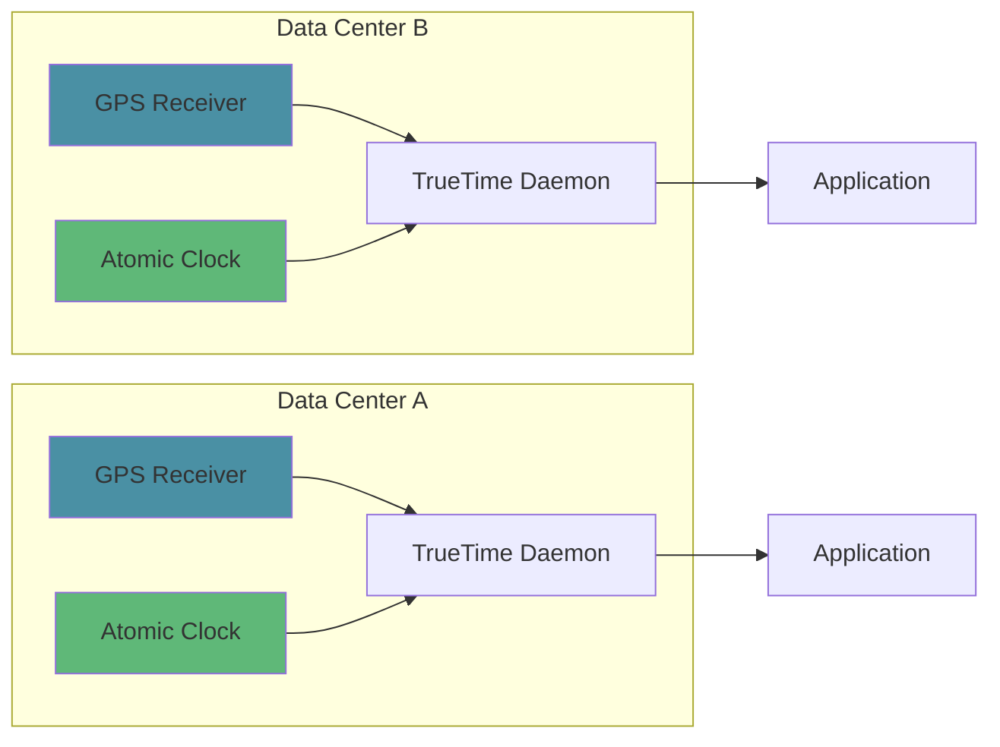
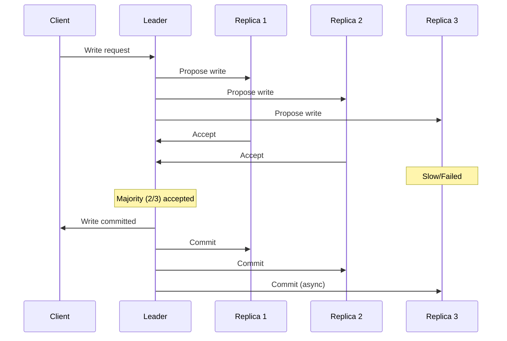
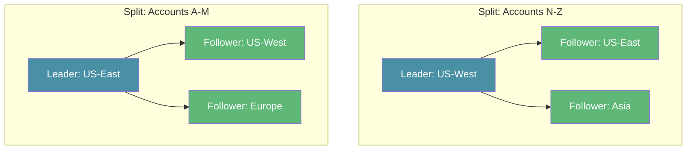
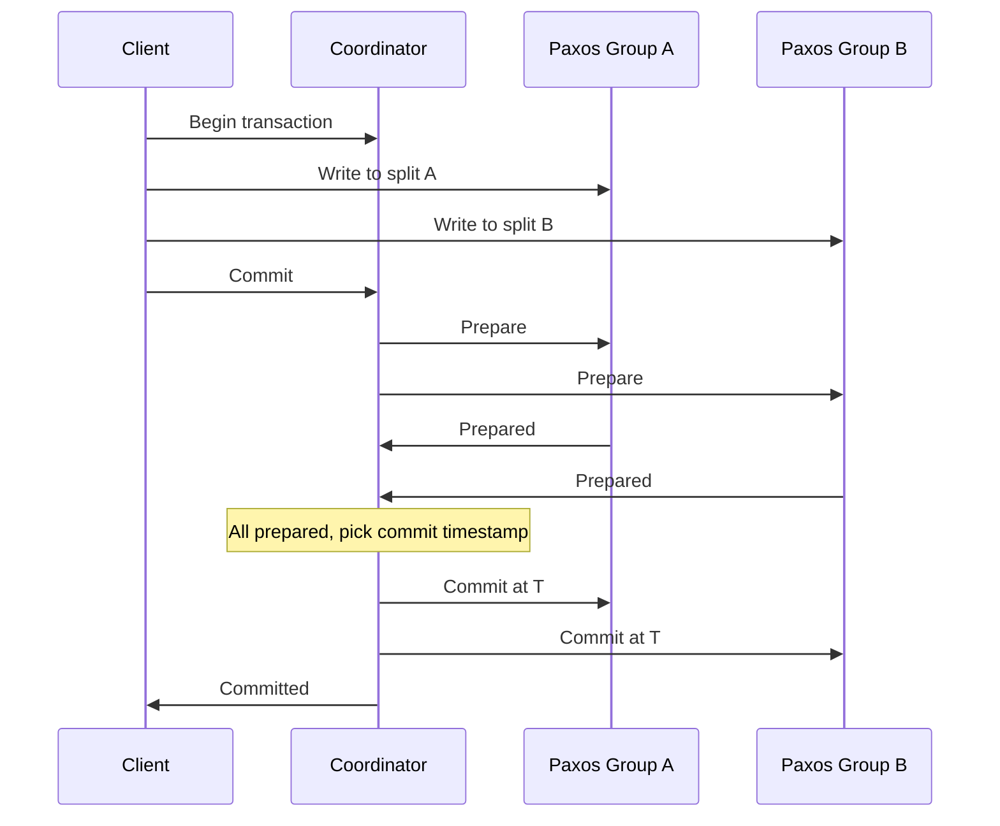
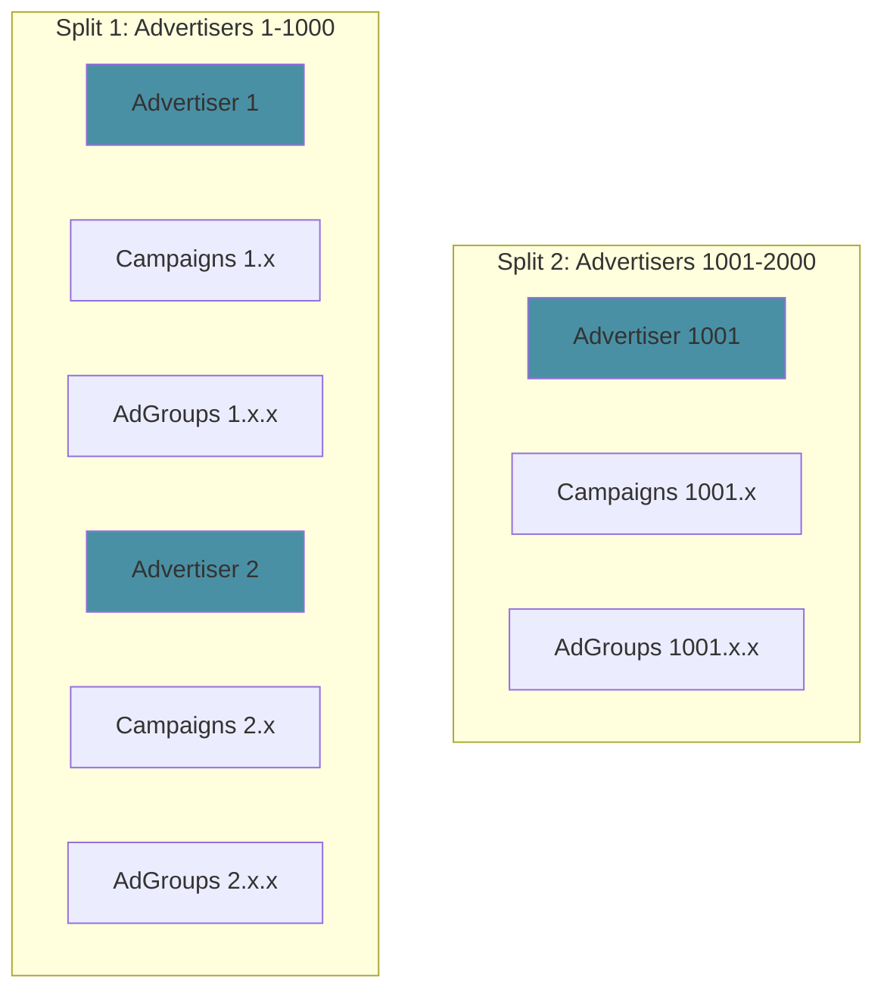
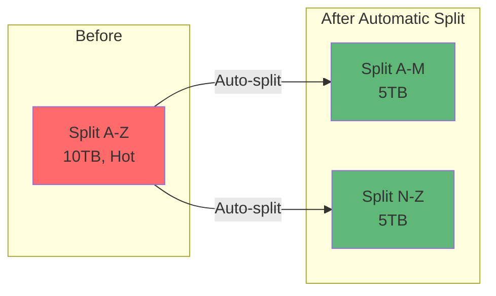
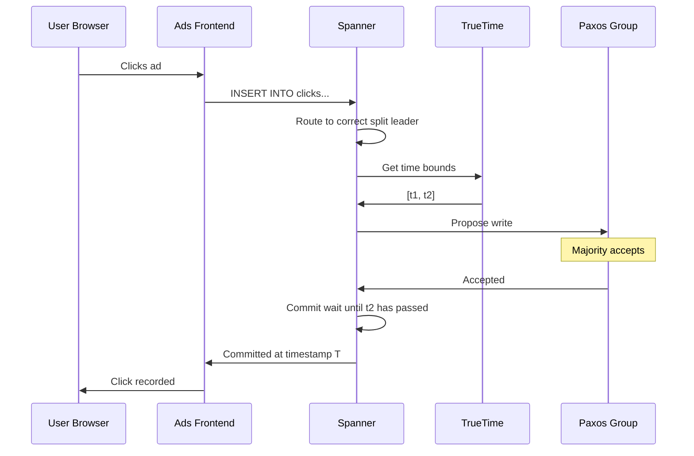

Everyone knows the rule: you can't have both strong consistency and global scale in a database. Pick one.

Google looked at that rule and said, "We'll take both."

The result is Spanner. A globally distributed SQL database that powers Google Ads, serving 4.8 billion users. Thats 90% of all internet users on the planet. Every ad impression, every click, every bid runs through it.

This is the story of how they pulled it off. And what you can learn from it.

## The Problem Google Faced

Before Spanner, Google Ads ran on a sharded MySQL setup. It worked, but it had problems.

**Problem 1: Manual sharding is painful.** When you outgrow one shard, you need to split it. That means downtime, complex data migration, and application changes. At Google scale, this was happening constantly.

**Problem 2: Cross-shard transactions are hard.** An advertiser updates their campaign budget. That write needs to hit multiple shards. Either you build complex two-phase commit logic, or you accept inconsistency.

**Problem 3: No SQL flexibility.** Many sharded systems push you toward key-value access patterns. But Google Ads needed complex queries. Joins. Secondary indexes. Aggregations.

Google needed a database that could:

- Scale horizontally across the globe
- Provide strong consistency (not eventual consistency)
- Support full SQL with ACID transactions
- Handle millions of operations per second

That database didn't exist. So they built it.

## What Makes Spanner Different

Most distributed databases make you choose. Either you get consistency (like traditional databases) or you get scale (like NoSQL). This tradeoff is described by the CAP theorem. During a network partition, you must choose between consistency and availability.

Spanner doesn't break CAP. It just makes partitions extremely rare. And when they do happen, it chooses consistency.

But the real innovation is how Spanner achieves strong consistency at global scale. It comes down to three ideas:

1. Synchronized time across every server
2. Consensus for every write
3. Automatic data distribution

Let's break each one down.

## TrueTime: Solving the Clock Problem

Distributed systems have a fundamental problem: clocks lie.

Your laptop thinks it's 10:00:00.000. A server in Singapore thinks it's 10:00:00.005. Another in London thinks it's 09:59:59.998. Who's right?

This matters because transaction ordering depends on time. If Transaction A commits "before" Transaction B, every replica needs to agree on what "before" means.

Most distributed databases use logical clocks (like Lamport timestamps) or accept eventual consistency. Spanner took a different approach: make physical clocks accurate enough to rely on.

### How TrueTime Works

Google installed atomic clocks and GPS receivers in every data center. Not one per data center. Multiple per data center for redundancy.

TrueTime doesn't give you a single timestamp. It gives you a time interval.

```
TrueTime.now() returns [earliest, latest]
```

For example:

```
TrueTime.now() = [10:00:00.001, 10:00:00.007]
```

This means: the actual time is definitely between these two values. The gap (6 milliseconds in this example) is called epsilon. Google keeps epsilon under 7ms, usually around 4ms.



### The Commit Wait

Here's the clever part. When a transaction commits, Spanner waits until it's certain the commit timestamp is in the past for all servers worldwide.


This wait is called "commit wait." It adds latency (typically a few milliseconds), but it guarantees something powerful: if transaction A commits before transaction B starts, A's timestamp is smaller than B's timestamp. Globally. Without any coordination.

This property is called external consistency. It's stronger than serializability. It means the database behaves as if there's one global timeline, even though data is spread across continents.

## Paxos: Consensus for Every Write

TrueTime handles time. But how does Spanner ensure all replicas agree on what data exists?

The answer is Paxos, a consensus algorithm. Every write goes through Paxos, which means a majority of replicas must agree before the write is committed.



### How Spanner Uses Paxos

Spanner organizes data into "splits" (like shards). Each split has multiple replicas. One replica is the leader; others are followers.



- **Writes** always go to the leader, which coordinates Paxos
- **Reads** can go to any replica if you accept slightly stale data
- **Strong reads** go to the leader

The leader holds a "lease" (typically 10 seconds) during which it can serve reads without consulting other replicas. This makes reads fast while maintaining consistency.

### Multi-Shard Transactions

What about transactions that touch multiple splits? Spanner uses two-phase commit on top of Paxos.



Because each participant is a Paxos group (not a single server), the transaction survives individual server failures. This is a key difference from traditional two-phase commit.

For more on two-phase commit, see [Two-Phase Commit in Distributed Systems](/distributed-systems/two-phase-commit/).

## Automatic Sharding

Spanner doesn't make you think about shards. You define your schema, and it handles distribution.

Data is organized hierarchically. Tables can be "interleaved" with parent tables, which means related rows are stored together.

```sql
CREATE TABLE Advertisers (
  advertiser_id INT64 NOT NULL,
  name STRING(256),
  budget FLOAT64
) PRIMARY KEY (advertiser_id);

CREATE TABLE Campaigns (
  advertiser_id INT64 NOT NULL,
  campaign_id INT64 NOT NULL,
  name STRING(256),
  daily_budget FLOAT64
) PRIMARY KEY (advertiser_id, campaign_id),
  INTERLEAVE IN PARENT Advertisers;

CREATE TABLE AdGroups (
  advertiser_id INT64 NOT NULL,
  campaign_id INT64 NOT NULL,
  adgroup_id INT64 NOT NULL,
  name STRING(256)
) PRIMARY KEY (advertiser_id, campaign_id, adgroup_id),
  INTERLEAVE IN PARENT Campaigns;
```

With this schema, all campaigns and ad groups for an advertiser are stored together. Queries that join these tables are fast because data is co-located.



### Automatic Resharding

As data grows or access patterns change, Spanner automatically splits and moves data. No downtime. No manual intervention.



The system monitors each split for:
- Size (splits that are too large)
- Load (splits that are too hot)
- Geography (keeping replicas close to users)

When it detects an imbalance, it moves data in the background.

## Putting It Together: A Write in Spanner

Let's trace what happens when Google Ads records an ad click.



Total time: 10-50ms depending on geography. For that latency, you get:

- Strong consistency across the globe
- Automatic replication to 3+ data centers
- Survival of any single data center failure
- Full ACID transaction support

## How Google Ads Uses Spanner

Google Ads has some unique requirements that Spanner was designed to handle.

### Advertiser Data

Every advertiser has:
- Account settings
- Campaigns (often hundreds or thousands)
- Ad groups within campaigns
- Individual ads
- Targeting criteria
- Budgets and bids

All of this needs ACID transactions. When an advertiser updates their budget, it must be consistent across all their campaigns.

### Real-Time Bidding

When you load a webpage with ads, an auction happens in milliseconds. Multiple advertisers bid for that impression. The winning bid is recorded, the advertiser is charged, and the ad is served.

This requires:
- Low-latency reads (to fetch campaign settings)
- Consistent writes (to deduct budget)
- High throughput (millions of auctions per second)

### Reporting

Advertisers want to see their spend, impressions, and clicks. This data aggregates across millions of events. Spanner's SQL support makes these queries possible without moving data to a separate analytics system.

## What Developers Can Learn

You probably don't have atomic clocks in your data center. But Spanner's design offers lessons for any distributed system.

### Lesson 1: Embrace Consistency

The NoSQL era convinced many that eventual consistency is fine. Sometimes it is. But for financial transactions, inventory systems, and anything where correctness matters, strong consistency saves you from subtle bugs.

Don't accept eventual consistency because someone told you it's the only way to scale. It isn't.

### Lesson 2: Colocate Related Data

Spanner's interleaved tables show the power of data locality. When related data lives together, joins are fast and transactions are cheap.

Think about your access patterns. If you always query a user's orders together, store them together.

### Lesson 3: Let the Database Handle Distribution

Manual sharding is error-prone. If your database supports automatic sharding (like Spanner, CockroachDB, or TiDB), use it. Spend your time on application logic, not shard management.

### Lesson 4: Design for Failure

Spanner uses Paxos so that any minority of replicas can fail without affecting availability. Design your systems the same way. Every component should be replaceable without downtime.

### Lesson 5: Measure and Automate

Spanner constantly monitors load and automatically rebalances. Build similar feedback loops in your systems. Don't wait for problems. Detect hotspots and fix them before users notice.

## Open Source Alternatives

You can't run Spanner yourself (unless you're on Google Cloud), but several open-source databases use similar ideas.

| Database | TrueTime Alternative | Consistency | Best For |
|----------|---------------------|-------------|----------|
| **CockroachDB** | Hybrid Logical Clocks | Serializable | General-purpose, PostgreSQL compatible |
| **TiDB** | Timestamp Oracle | Snapshot Isolation | MySQL compatible, HTAP workloads |
| **YugabyteDB** | Hybrid Logical Clocks | Serializable | PostgreSQL/Cassandra compatible |
| **Cloud Spanner** | TrueTime | External | Google Cloud customers |

### CockroachDB

Built by ex-Googlers who worked on Spanner. Uses hybrid logical clocks instead of TrueTime. This means slightly weaker consistency guarantees (serializable instead of external consistency), but it works without specialized hardware.

### TiDB

A MySQL-compatible distributed database from PingCAP. Uses a central timestamp oracle instead of distributed clocks. This creates a single point of contention but simplifies the design.

### YugabyteDB

Offers both SQL (PostgreSQL-compatible) and NoSQL (Cassandra-compatible) APIs. Uses a design similar to Spanner with Raft consensus instead of Paxos.

## The Tradeoffs

Spanner isn't free lunch. Here's what you give up:

**Latency**: Commit wait adds a few milliseconds to every write. For most applications, this is fine. For ultra-low-latency trading systems, it might not be.

**Cost**: Running synchronized atomic clocks isn't cheap. Cloud Spanner pricing reflects this.

**Complexity**: Understanding and operating a globally distributed database requires expertise. There are more failure modes than a single PostgreSQL instance.

**Write throughput**: Because every write goes through Paxos, there's a limit to writes per second on a single row. Hot rows need careful design.

## Conclusion

Google Spanner represents a shift in what's possible with distributed databases. For decades, we accepted that global scale meant giving up consistency. Spanner proved otherwise.

The key innovations were:
- TrueTime for globally synchronized clocks
- Paxos for consensus on every write
- Automatic sharding for zero-ops scaling
- Interleaved tables for data locality

These ideas have spread. CockroachDB, TiDB, and YugabyteDB bring Spanner-like capabilities to everyone. Even if you never use Spanner directly, understanding its design makes you better at building distributed systems.

The next time someone tells you that you can't have consistency at scale, you'll know better.

---

*Want to learn more about distributed systems? Check out [Two-Phase Commit](/distributed-systems/two-phase-commit/) for distributed transactions, [Paxos Consensus Algorithm](/distributed-systems/paxos/) for consensus, and [How Amazon S3 Works](/how-amazon-s3-works/) for distributed storage. For database internals, see [Write-Ahead Log](/distributed-systems/write-ahead-log/) and [How Kafka Works](/distributed-systems/how-kafka-works/).*

**Further Reading**:
- [Spanner: Google's Globally-Distributed Database (Original Paper)](https://research.google.com/archive/spanner-osdi2012.pdf)
- [Spanner: Becoming a SQL System](https://research.google.com/pubs/archive/46103.pdf)
- [Cloud Spanner Documentation](https://cloud.google.com/spanner)
- [CockroachDB Architecture](https://www.cockroachlabs.com/docs/stable/architecture/overview.html)

