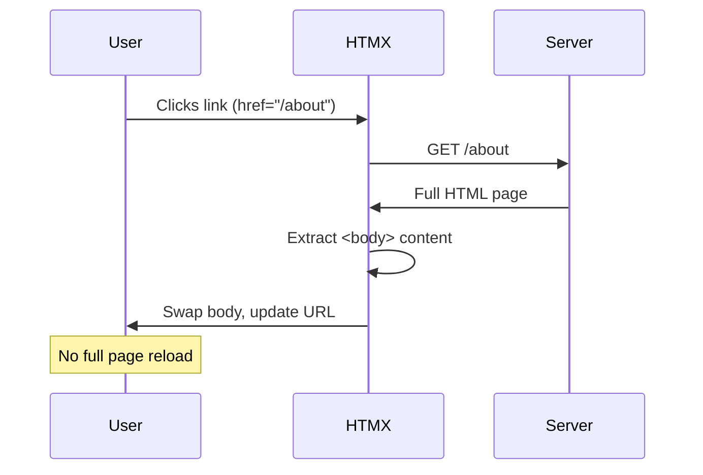

For years, the default assumption was that building modern web applications required React, Vue, or Angular. That frontend development meant writing JavaScript, managing state, and shipping large bundles to the browser.

HTMX offers a different path. One that makes you wonder if all that complexity was necessary in the first place.

HTMX is a small JavaScript library (14KB gzipped) that lets you build dynamic web applications using HTML attributes. No build step. No node_modules folder with 500MB of dependencies. No virtual DOM. Just HTML talking to your server.

This is what web development felt like before we made it complicated.

## What is HTMX?

HTMX extends HTML with attributes that let any element make HTTP requests and update the page. That's it. That's the whole idea.

In traditional HTML, only `<a>` tags and `<form>` elements can talk to the server. HTMX removes that limitation. A button, a div, a span, anything can now make GET, POST, PUT, or DELETE requests.

```html
<button hx-post="/like" hx-target="#like-count" hx-swap="innerHTML">
  Like
</button>
<span id="like-count">42</span>
```

Click the button. It sends a POST to `/like`. The server returns just the new like count (say, "43"). HTMX swaps that into `#like-count`. No full page reload. No JavaScript to write.

The server returns HTML, not JSON. This is the key insight. Your backend renders HTML fragments and sends them to the browser. HTMX puts them where you tell it to.

## How HTMX Works

Let's trace through what happens when you interact with an HTMX element:


1. User interacts with an element (click, input, hover, etc.)
2. HTMX intercepts the event
3. HTMX makes an AJAX request based on the `hx-*` attributes
4. Server processes the request and returns an HTML fragment
5. HTMX swaps the response into the DOM
6. User sees the update instantly

The server does the heavy lifting. The browser just displays what it receives. This is how the web worked for decades, and it worked fine.

## The Core Attributes

HTMX has a small set of attributes that cover most use cases. Here are the ones you'll use every day:

### Making Requests

| Attribute | What it does |
|-----------|--------------|
| `hx-get` | Makes a GET request |
| `hx-post` | Makes a POST request |
| `hx-put` | Makes a PUT request |
| `hx-patch` | Makes a PATCH request |
| `hx-delete` | Makes a DELETE request |

Here's how they look in practice:

```html
<button hx-get="/users">Load Users</button>
<button hx-post="/users" hx-include="#user-form">Create User</button>
<button hx-delete="/users/123">Delete User</button>
```

<br>

### Controlling Where Content Goes

| Attribute | What it does |
|-----------|--------------|
| `hx-target` | CSS selector for where to put the response |
| `hx-swap` | How to insert the content (innerHTML, outerHTML, beforeend, etc.) |

Example usage:

```html
<button hx-get="/notifications" 
        hx-target="#notification-panel" 
        hx-swap="innerHTML">
  Check Notifications
</button>
```

The `hx-swap` attribute has several options:

- `innerHTML` - Replace the target's inner content (default)
- `outerHTML` - Replace the entire target element
- `beforebegin` - Insert before the target
- `afterbegin` - Insert at the start of target's content
- `beforeend` - Insert at the end of target's content
- `afterend` - Insert after the target
- `delete` - Delete the target element
- `none` - Don't swap anything

<br>

### Controlling When Requests Happen

| Attribute | What it does |
|-----------|--------------|
| `hx-trigger` | What event triggers the request |

The trigger attribute is powerful. Here are some common patterns:

```html
<!-- Trigger on input with 500ms debounce -->
<input type="text" 
       hx-get="/search" 
       hx-trigger="keyup changed delay:500ms"
       hx-target="#results">

<!-- Trigger when element enters viewport -->
<div hx-get="/more-content" 
     hx-trigger="revealed" 
     hx-swap="afterend">
  Loading...
</div>

<!-- Trigger on load -->
<div hx-get="/initial-data" hx-trigger="load">
  Loading...
</div>
```

<br>

## Real Examples

Let's build some actual features you'd need in a web application.

### Live Search

This is the classic HTMX demo. Type in a search box, results appear instantly.

```html
<input type="text" 
       name="q"
       placeholder="Search users..."
       hx-get="/search"
       hx-trigger="keyup changed delay:300ms"
       hx-target="#search-results">

<div id="search-results"></div>
```

Your server endpoint returns HTML:

```python
# Flask example
@app.route('/search')
def search():
    query = request.args.get('q', '')
    users = User.query.filter(User.name.ilike(f'%{query}%')).limit(10)
    return render_template('partials/user_list.html', users=users)
```

The partial template:


```html
<!-- partials/user_list.html -->

<div class="user-card">
  
  <span>{{ user.name }}</span>
</div>


<p>No users found</p>

```


That's it. Live search with debouncing. No React. No state management. No useEffect with dependency arrays.

### Infinite Scroll

Load more content as the user scrolls:


```html
<div id="posts">
  
    
  
  
  <div hx-get="/posts?page={{ next_page }}"
       hx-trigger="revealed"
       hx-swap="outerHTML">
    <span class="loading">Loading more...</span>
  </div>
</div>
```


When the loading div enters the viewport (`revealed`), HTMX fetches the next page. The server returns more posts plus a new loading div with the updated page number.

```html
<!-- Server response for /posts?page=2 -->
<div class="post">Post 11...</div>
<div class="post">Post 12...</div>
<!-- ... more posts ... -->
<div hx-get="/posts?page=3"
     hx-trigger="revealed"
     hx-swap="outerHTML">
  <span class="loading">Loading more...</span>
</div>
```

The new loading div replaces the old one. Scroll more, load more. No intersection observer callbacks. No scroll event handlers.

### Modal Forms

Pop up a modal, submit a form, close it on success:

```html
<button hx-get="/users/new" 
        hx-target="#modal-container"
        hx-swap="innerHTML">
  Add User
</button>

<div id="modal-container"></div>
```

Server returns the modal HTML:

```html
<!-- Response from /users/new -->
<div class="modal" id="user-modal">
  <div class="modal-content">
    <h2>New User</h2>
    <form hx-post="/users" 
          hx-target="#modal-container"
          hx-swap="innerHTML">
      <input type="text" name="name" placeholder="Name" required>
      <input type="email" name="email" placeholder="Email" required>
      <button type="submit">Create</button>
      <button type="button" onclick="this.closest('.modal').remove()">Cancel</button>
    </form>
  </div>
</div>
```

On successful submission, the server can return an empty div (closing the modal) or a success message:

```html
<!-- Response from POST /users on success -->
<div class="success-message" hx-swap-oob="true">
  User created successfully!
</div>
```

The `hx-swap-oob` attribute lets you update elements outside the main target. We'll get to that.

### Delete with Confirmation

Delete an item and remove it from the list:

```html
<div id="user-42" class="user-row">
  <span>John Doe</span>
  <button hx-delete="/users/42"
          hx-target="#user-42"
          hx-swap="outerHTML"
          hx-confirm="Are you sure you want to delete John?">
    Delete
  </button>
</div>
```

Click delete, browser shows native confirm dialog, if confirmed, the row vanishes. The server returns an empty response or a 200 status.

## Out of Band Swaps

Sometimes you need to update multiple parts of the page. That's what `hx-swap-oob` is for.

Say you have a shopping cart. When you add an item, you want to:
1. Show a success message
2. Update the cart count in the header
3. Update the cart total

```html
<!-- Main page structure -->
<header>
  <span id="cart-count">3 items</span>
</header>

<main>
  <button hx-post="/cart/add/123" hx-target="#product-message">
    Add to Cart
  </button>
  <div id="product-message"></div>
  
  <div id="cart-total">$99.00</div>
</main>
```

Your server can return:

```html
<!-- Primary response (goes to #product-message) -->
<div class="success">Added to cart!</div>

<!-- Out of band updates -->
<span id="cart-count" hx-swap-oob="true">4 items</span>
<div id="cart-total" hx-swap-oob="true">$129.00</div>
```

HTMX looks for elements with `hx-swap-oob="true"` and swaps them into matching elements on the page. One request, multiple updates.

## The Architecture: Hypermedia Driven Applications

HTMX is built on a philosophy called Hypermedia Driven Applications (HDA). The idea is simple: let the server drive the UI.


In a typical SPA:

1. Browser requests JSON from an API
2. Client JavaScript transforms JSON into HTML
3. JavaScript manages state, handles updates

In an HTMX app:

1. Browser requests HTML from the server
2. Server returns ready to use HTML
3. HTMX puts it in the DOM

The client is thin. Really thin. All the logic is on the server where it belongs.

### Where State Lives

Here's what trips up developers coming from React: there's no client side state.

| SPA Approach | HTMX Approach |
|--------------|---------------|
| useState, Redux, Zustand | Server database + session |
| Client side routing | Traditional URLs |
| JSON APIs | HTML templates |
| Virtual DOM diffing | Replace HTML fragments |
| Build step with bundler | Just serve HTML |

Your "state" is your database. Your "re-render" is a new request. Your "hydration" is clicking a link.

This sounds limiting until you realize most applications don't need client side state. They need to show data from a database. HTMX does that well.

## Integrating with Your Backend

HTMX works with any backend that can return HTML. Here's what it looks like in various frameworks:

### Python (Flask)

```python
from flask import Flask, render_template, request

app = Flask(__name__)

@app.route('/users')
def list_users():
    users = User.query.all()
    
    # Check if this is an HTMX request
    if request.headers.get('HX-Request'):
        return render_template('partials/user_list.html', users=users)
    
    # Full page for direct navigation
    return render_template('users.html', users=users)

@app.route('/users/<int:id>', methods=['DELETE'])
def delete_user(id):
    user = User.query.get_or_404(id)
    db.session.delete(user)
    db.session.commit()
    return '', 200  # Empty response, element gets removed
```

### Node.js (Express)

```javascript
const express = require('express');
const app = express();

app.get('/users', (req, res) => {
  const users = getUsersFromDB();
  
  if (req.headers['hx-request']) {
    res.render('partials/user-list', { users });
  } else {
    res.render('users', { users });
  }
});

app.delete('/users/:id', (req, res) => {
  deleteUserFromDB(req.params.id);
  res.send(''); // Empty response
});
```

### Go

```go
func listUsers(w http.ResponseWriter, r *http.Request) {
    users := getUsersFromDB()
    
    if r.Header.Get("HX-Request") != "" {
        tmpl.ExecuteTemplate(w, "partials/user-list", users)
    } else {
        tmpl.ExecuteTemplate(w, "users", users)
    }
}

func deleteUser(w http.ResponseWriter, r *http.Request) {
    id := chi.URLParam(r, "id")
    deleteUserFromDB(id)
    w.WriteHeader(http.StatusOK)
}
```

HTMX sends an `HX-Request` header with every request. Use it to distinguish between HTMX requests (return partial HTML) and regular requests (return full page).

## Boosting Existing Pages

You have a traditional server rendered application. You want to make it feel faster without rewriting everything. `hx-boost` is for you.

```html
<body hx-boost="true">
  <nav>
    <a href="/">Home</a>
    <a href="/about">About</a>
    <a href="/contact">Contact</a>
  </nav>
  
  <main id="content">
    <!-- Page content -->
  </main>
</body>
```

With `hx-boost="true"`, clicks on links within that element become AJAX requests. HTMX fetches the new page, extracts the content, and swaps it in. No full page reload.

Your application feels like a SPA, but you didn't write any JavaScript. Your existing routes, your existing templates, they all keep working.



## When HTMX Shines

HTMX is excellent for:

**CRUD applications**: Admin panels, dashboards, content management. Lots of forms, lots of lists. This is where HTMX is most comfortable.

**Progressive enhancement**: Start with working HTML forms. Add HTMX attributes. Now they submit without reloading.

**Teams with backend strength**: If your team is strong in Python, Ruby, Go, or Java and weaker in JavaScript, HTMX lets you stay in your comfort zone.

**Server rendered apps**: If you're already using Django, Rails, Laravel, or Phoenix, HTMX is a natural fit. You're already returning HTML.

**Simpler deployment**: No build step. No static file hosting. One server serves everything.

## When to Think Twice

HTMX isn't the right tool for everything:

**Heavy client side interaction**: Drawing apps, spreadsheets, real time collaborative editing. If the user is manipulating complex state that doesn't need server persistence on every action, a client side framework makes more sense.

**Offline support**: HTMX needs a server. No server, no HTMX. If you need offline capabilities, you need client side state.

**Complex component state**: If a single component has deeply nested state with complex transformations, managing it on the server for every change might be overkill.

**Very high interaction frequency**: Dragging, real time games, anything with dozens of events per second. Round tripping to the server for each event adds latency.

The honest answer: most web applications are CRUD apps with forms and lists. Those are exactly what HTMX handles well.

## Performance Considerations

People ask: isn't making requests for every interaction slow?

It can be. But consider:

1. **Network is fast**: Modern networks have 50ms round trips. Users won't notice 50ms.

2. **HTML is small**: A partial returning 10 rows of data is a few KB. Smaller than a React bundle.

3. **No client side processing**: No JSON parsing, no virtual DOM diffing, no re renders. The browser just inserts HTML.

4. **Server can cache**: CDNs understand HTTP. Cache your partials.

5. **Database is close**: Your server is on the same network as your database. Client side apps still need to fetch that data anyway.

The real bottleneck is usually the database, not the network. That's true whether you're returning JSON or HTML.

### Minimizing Request Size

Return only what changes:

```html
<!-- Don't return the whole table -->
<table>
  <tr><td>Name</td><td>Email</td></tr>
  <tr><td>John</td><td>john@example.com</td></tr>
  <!-- ... 100 more rows ... -->
</table>

<!-- Return just the new row -->
<tr><td>Jane</td><td>jane@example.com</td></tr>
```

Use `beforeend` or `afterend` swaps to append rather than replace.

## HTMX vs React, Vue, Angular

Let's be direct about the tradeoffs:

| Aspect | HTMX | React/Vue/Angular |
|--------|------|-------------------|
| Bundle size | ~14KB | 100KB+ (React alone is 40KB) |
| Build step | None | Required |
| State management | Server | Client (Redux, Pinia, etc.) |
| Learning curve | Low (it's HTML) | Moderate to High |
| Offline support | Limited | Strong |
| Real time updates | Server push (SSE, WS) | Client managed |
| SEO | Built in | Requires SSR setup |
| Team skills | Backend developers | Frontend specialists |
| Debugging | Network tab + server logs | React DevTools + console |

HTMX isn't better or worse. It's different. It's optimized for a different set of problems.

If you're building the next Figma, use React. If you're building an admin dashboard, HTMX might save you months.

## Combining HTMX with Other Tools

HTMX plays well with others.

**Alpine.js**: Need some client side state? Alpine.js handles things like dropdown toggles, tab switching, and form validation. Use Alpine for UI state, HTMX for server communication.

```html
<div x-data="{ open: false }">
  <button @click="open = !open">Toggle Menu</button>
  <nav x-show="open">
    <a hx-get="/settings" hx-target="#main">Settings</a>
    <a hx-get="/profile" hx-target="#main">Profile</a>
  </nav>
</div>
```

**Tailwind CSS**: Style your HTMX applications the same way you'd style anything else. Nothing special needed.

**Hyperscript**: Made by the same team as HTMX. A scripting language for adding behavior directly in HTML. If you need more than HTMX provides but don't want to write JavaScript.

## Getting Started

Add HTMX to your page:

```html
<script src="https://unpkg.com/htmx.org@2.0.0"></script>
```

Or install via npm:

```bash
npm install htmx.org
```

Then import it:

```javascript
import 'htmx.org';
```

Start small. Take one form on your existing application. Add `hx-post`, `hx-target`, and `hx-swap`. Make it submit without reloading. Feel the satisfaction.

Then do another. And another.

## Common Patterns

### Loading Indicators

Show a spinner while loading:

```html
<button hx-get="/slow-endpoint" hx-target="#result">
  <span class="htmx-indicator">Loading...</span>
  Load Data
</button>
```

Add CSS:

```css
.htmx-indicator {
  display: none;
}
.htmx-request .htmx-indicator {
  display: inline;
}
.htmx-request.htmx-request {
  opacity: 0.5;
}
```

HTMX adds `htmx-request` class during requests.

### Error Handling

Listen for errors and handle them:

```html
<div hx-get="/might-fail" 
     hx-target="#content"
     hx-on:htmx:responseError="alert('Something went wrong')">
  Load Content
</div>
```

Or handle globally:

```javascript
document.body.addEventListener('htmx:responseError', function(evt) {
  console.error('Request failed:', evt.detail.xhr.status);
});
```

### Polling

Update content periodically:

```html
<div hx-get="/notifications/count" 
     hx-trigger="every 30s"
     hx-swap="innerHTML">
  3 notifications
</div>
```

The `every Xs` trigger polls at the specified interval.

## The Philosophy Behind HTMX

Carson Gross, the creator of HTMX, has strong opinions about web development. The core idea: HTML is a perfectly good application format. We just forgot how to use it.

The web was hypermedia from the start. Links and forms. Click a link, get a new page. Submit a form, get a result. Simple. It worked.

Then we decided that wasn't good enough. We built JavaScript frameworks that treat the browser as an application runtime and the server as a dumb API. We ship megabytes of code to recreate what the browser already does.

HTMX says: what if we just made HTML better instead of replacing it?

It's not about being anti JavaScript. It's about using the right tool for the job. And for most web applications, enhanced HTML is the right tool.

## Conclusion

HTMX won't replace React everywhere. It shouldn't. Complex interactive applications benefit from sophisticated client side frameworks.

But most applications aren't that complex. Most are forms, lists, and CRUD operations. For those, HTMX offers something powerful: simplicity.

No build step. No state management library. No bundle optimization. No hydration errors. Just HTML that talks to your server.

Try it on your next project. Or add it to an existing one. Make one form submit without reloading. See how it feels.

You might find, like many developers have, that the complexity you thought you needed was optional all along.

---

**Further Reading**:

- [HTMX Official Documentation](https://htmx.org/) - The official docs, which are excellent
- [Hypermedia Systems (Free Book)](https://hypermedia.systems/) - By the creator of HTMX, deep dive into hypermedia architecture
- [HTMX Essays](https://htmx.org/essays/) - Thoughtful essays on web development philosophy
- [HTMX Examples](https://htmx.org/examples/) - Interactive examples covering common patterns
- [Awesome HTMX](https://github.com/rajasegar/awesome-htmx) - Community curated list of HTMX resources

*Looking for more web development content? Check out [How WebTransport Works](/how-webtransport-works/) for real time communication, [Long Polling Explained](/long-polling-explained/) for understanding push patterns, and [Server Sent Events Explained](/server-sent-events-explained/) for one way server push.*

