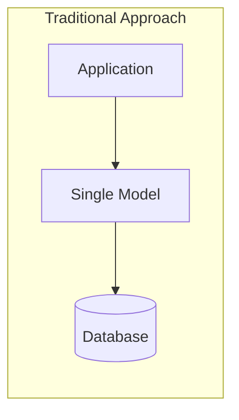
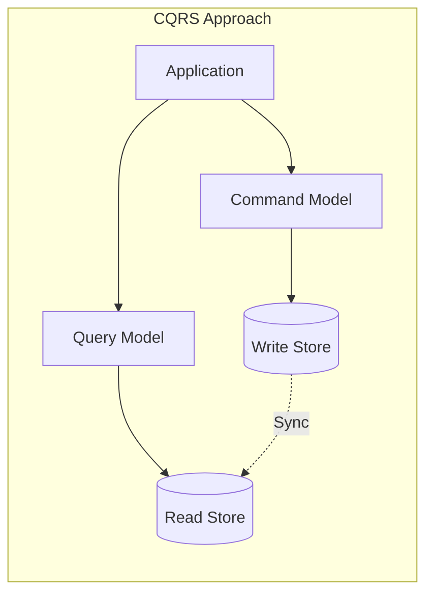
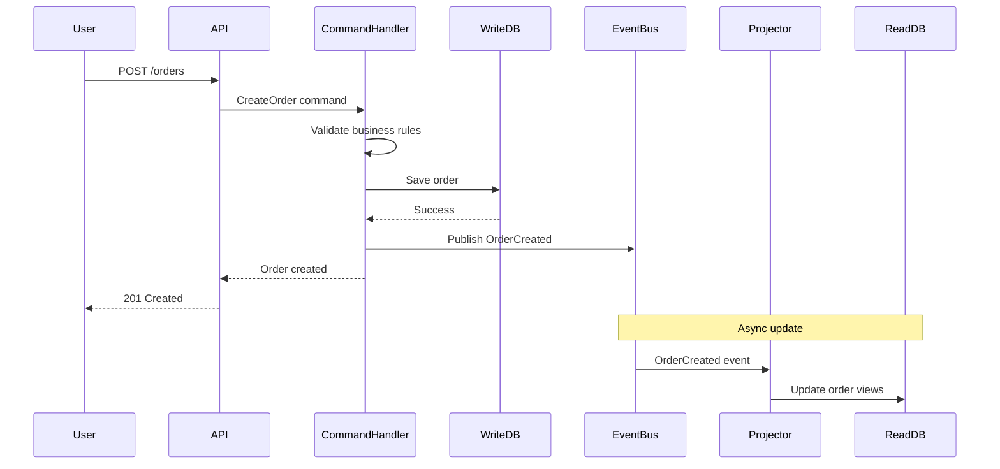
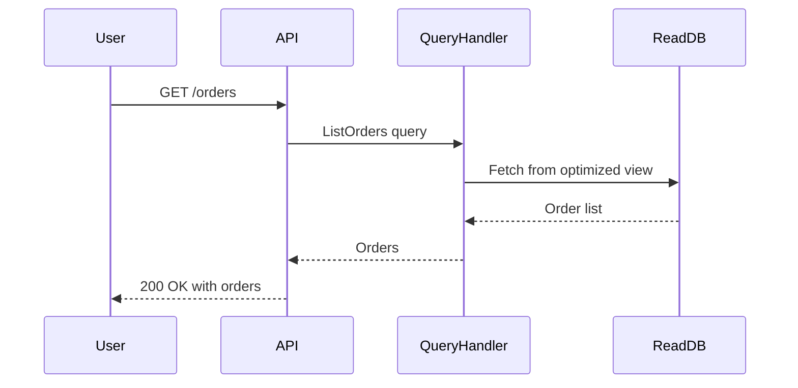
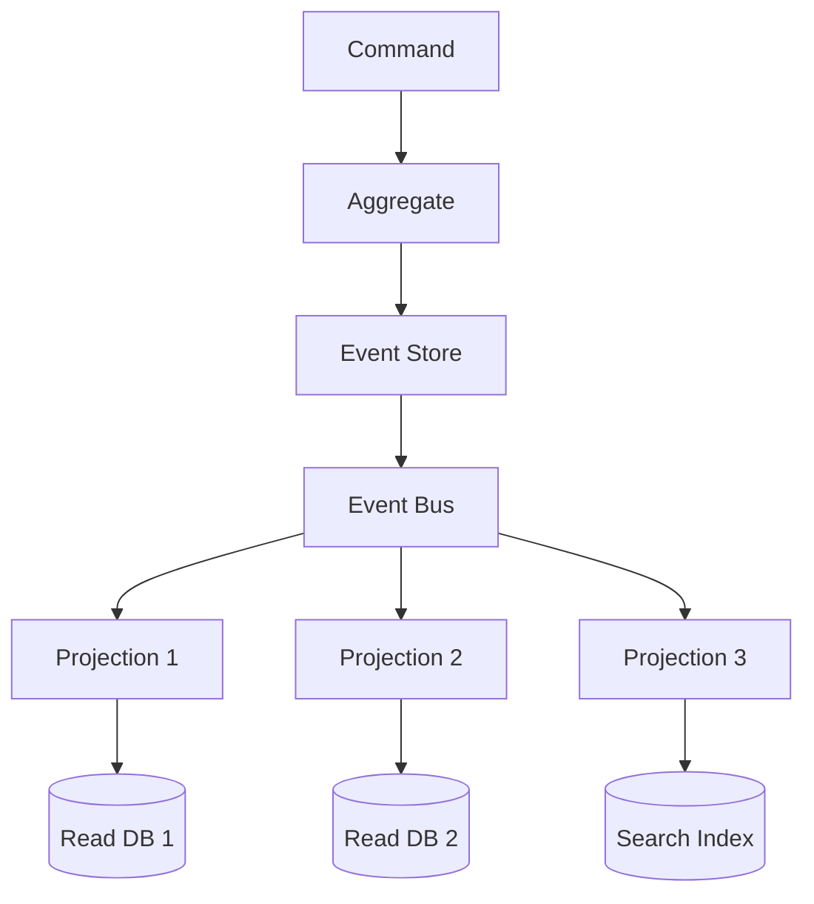

Your analytics dashboard is crawling. Users are complaining that the checkout page takes forever. You look at the database and realize the same tables serving real time reports are also handling order transactions. Every complex query for the dashboard locks rows that the checkout process needs.

This is the problem CQRS was designed to solve.

## What is CQRS?

CQRS stands for Command Query Responsibility Segregation. The name sounds intimidating, but the idea is simple: use separate models for reading and writing data.

In a traditional application, you have one model that handles everything. The same `Order` class that saves orders to the database also retrieves them for display. This works fine until it doesn't.

CQRS splits this into two parts:

- **Commands** handle writes. They change the state of your system. Create an order. Update a user. Delete a product.
- **Queries** handle reads. They return data without changing anything. Get order details. List all users. Search products.





The separation lets you optimize each side for what it does best. Your write model can focus on business rules and data integrity. Your read model can be denormalized and tuned for fast queries.

## A Concrete Example

Let's say you're building an order management system. Here's what the traditional approach looks like:

```python
class OrderService:
    def create_order(self, order_data):
        order = Order(**order_data)
        order.validate()
        order.calculate_totals()
        self.db.save(order)
        return order
    
    def get_order(self, order_id):
        return self.db.query(Order).filter_by(id=order_id).first()
    
    def list_orders_with_stats(self, user_id):
        # This query joins 5 tables and runs aggregations
        # It's slow and blocks write operations
        return self.db.query(Order).join(User).join(Product)...
```

The `list_orders_with_stats` method is killing your database. It runs complex joins and aggregations on tables that are also handling writes.

With CQRS, you split this:

```python
# Command side - handles writes
class CreateOrderHandler:
    def handle(self, command):
        order = Order(
            user_id=command.user_id,
            items=command.items
        )
        order.validate()
        order.calculate_totals()
        self.write_db.save(order)
        
        # Publish event for the read side to pick up
        self.event_bus.publish(OrderCreated(order))

# Query side - handles reads
class OrderQueryService:
    def get_order_summary(self, order_id):
        # Reads from a denormalized view optimized for this query
        return self.read_db.query(OrderSummaryView).get(order_id)
    
    def list_orders_with_stats(self, user_id):
        # Pre-computed stats, no joins needed
        return self.read_db.query(UserOrderStats).filter_by(user_id=user_id)
```

The read database has pre-computed views. No complex joins at query time. The write database handles transactions without being slowed down by reporting queries.

## How the Pieces Fit Together

Here's what happens when a user places an order:



The user gets a fast response. The read model updates in the background. This is eventual consistency in action.

When someone queries their order list:



No complex joins. No locking. Just a simple fetch from a pre-built view.

## When CQRS Makes Sense

CQRS adds complexity. You're maintaining two models instead of one. Don't add it unless you have a good reason.

| Use CQRS When | Skip CQRS When |
|---------------|----------------|
| Read and write workloads are very different | Simple CRUD with similar read/write patterns |
| Complex queries are slowing down writes | Small application with low traffic |
| You need to scale reads and writes independently | Team is small and needs to move fast |
| Different teams own read vs write logic | Strong consistency is a hard requirement |
| You're already doing event sourcing | You're prototyping or building an MVP |

The clearest signal is when your read patterns look nothing like your write patterns. If your write model is normalized (third normal form, foreign keys everywhere) but your UI needs denormalized data with computed fields, CQRS might help.

## CQRS vs Traditional CRUD

In a CRUD application, you typically have:

```python
# Traditional CRUD
class ProductController:
    def create(self, data):
        product = Product(**data)
        self.repo.save(product)
        return product
    
    def read(self, id):
        return self.repo.find(id)
    
    def update(self, id, data):
        product = self.repo.find(id)
        product.update(**data)
        self.repo.save(product)
        return product
    
    def delete(self, id):
        self.repo.delete(id)
```

With CQRS, your commands are explicit:

```python
# CQRS approach
class ProductCommandHandler:
    def handle_create(self, cmd: CreateProduct):
        product = Product.create(cmd.name, cmd.price, cmd.category)
        self.repo.save(product)
        self.events.publish(ProductCreated(product.id))
    
    def handle_update_price(self, cmd: UpdateProductPrice):
        product = self.repo.find(cmd.product_id)
        product.change_price(cmd.new_price, cmd.reason)
        self.repo.save(product)
        self.events.publish(ProductPriceChanged(product.id, cmd.new_price))
    
    def handle_discontinue(self, cmd: DiscontinueProduct):
        product = self.repo.find(cmd.product_id)
        product.discontinue()
        self.repo.save(product)
        self.events.publish(ProductDiscontinued(product.id))

class ProductQueryHandler:
    def get_product_details(self, product_id):
        return self.read_db.get_product_view(product_id)
    
    def search_products(self, filters):
        return self.read_db.search(filters)
```

Notice the difference. CRUD has generic `update`. CQRS has specific commands like `UpdateProductPrice` and `DiscontinueProduct`. Each command captures intent. This makes the code easier to understand and audit.

## Common Mistakes to Avoid

After reading discussions on forums and seeing real implementations go wrong, here are the pitfalls that keep showing up:

### 1. Using CQRS for Simple Apps

If your app is basically forms over data with straightforward queries, CQRS is overkill. You'll spend more time maintaining sync between read and write models than you'll save on query performance.

Start with a traditional approach. Refactor to CQRS when you hit real scaling problems.

### 2. Sharing Models Between Command and Query

This defeats the purpose. If your query handler uses the same `Order` entity as your command handler, you're not doing CQRS. You're just adding indirection.

```python
# Wrong - sharing the same model
class OrderQueryHandler:
    def get_order(self, order_id):
        return self.db.query(Order).get(order_id)  # Same Order entity as write side

# Right - separate read model
class OrderQueryHandler:
    def get_order(self, order_id):
        return self.read_db.query(OrderReadModel).get(order_id)  # Different model
```

### 3. Synchronous Updates to Read Model

If you update the read model synchronously after every write, you lose most of the performance benefits. The write operation now waits for the read model update.

```python
# Wrong - synchronous update
def handle_create_order(self, command):
    order = Order(...)
    self.write_db.save(order)
    self.read_db.update_order_view(order)  # Blocking!
    return order

# Right - async update via events
def handle_create_order(self, command):
    order = Order(...)
    self.write_db.save(order)
    self.event_bus.publish(OrderCreated(order))  # Non-blocking
    return order
```

### 4. Not Handling Eventual Consistency

Your read model will be slightly behind the write model. Users might create an order and not see it immediately in their order list. You need to design for this.

Options include:
- Return the created resource directly in the command response
- Show optimistic updates in the UI
- Use read-your-writes consistency where the user's next query includes their recent writes

## CQRS and Event Sourcing

You'll often see CQRS mentioned alongside event sourcing. They're related but different patterns.

**Event sourcing** means storing all changes as a sequence of events instead of just the current state. Instead of updating a row, you append an event: `OrderPlaced`, `ItemAdded`, `OrderShipped`.

**CQRS** means separating read and write models. You can do CQRS without event sourcing (just use two databases) and event sourcing without CQRS (rebuild current state from events for both reads and writes).

They work well together because:
- Events from the write side naturally feed into read model projections
- You get a complete audit trail
- You can rebuild read models from the event history



But event sourcing adds significant complexity. Don't adopt it just because you're using CQRS. Use it when you actually need:
- Complete audit history
- Ability to replay events
- Time travel debugging
- Complex event-driven workflows

## Tools and Frameworks

If you decide to implement CQRS, these tools can help:

**Axon Framework** (Java) - Full featured framework for CQRS and event sourcing. Handles command routing, event storage, and saga management. Popular in enterprise Java shops.

**MediatR** (.NET) - Lightweight library that implements the mediator pattern. Good for CQRS command and query handling without the full event sourcing overhead.

**EventStoreDB** - Purpose-built database for event sourcing. Works with any language. Handles event persistence and subscriptions.

**Marten** (.NET) - Document database and event store built on PostgreSQL. Good if you want event sourcing without adding another database.

For a visual overview of how CQRS works, check out the [CQRS Explainer](/explainer/cqrs-design-pattern/) on this site.

## Getting Started

If you're convinced CQRS is right for your situation, here's how to start:

**Start with logical separation.** You don't need separate databases on day one. Use the same database but different models for reads and writes. This gives you the architectural benefits without the operational complexity.

```python
# Same database, different models
class WriteRepository:
    def save_order(self, order: Order):
        self.session.add(order)
        self.session.commit()

class ReadRepository:
    def get_order_summary(self, order_id) -> OrderSummary:
        # Query that builds a different shape than the write model
        result = self.session.execute("""
            SELECT o.id, o.total, u.name as customer_name, 
                   COUNT(i.id) as item_count
            FROM orders o
            JOIN users u ON o.user_id = u.id
            JOIN items i ON i.order_id = o.id
            WHERE o.id = :order_id
            GROUP BY o.id, o.total, u.name
        """, {"order_id": order_id})
        return OrderSummary(**result.first())
```

**Identify your read hot spots.** Profile your queries. Find the ones that are complex, slow, or blocking writes. These are candidates for separate read models.

**Add physical separation when needed.** Once you've proven the pattern works, you can move the read model to a separate database, add caching, or use a search index like Elasticsearch.

## Wrapping Up

CQRS is not a silver bullet. It's a pattern that trades simplicity for scalability and flexibility. The key is knowing when that trade makes sense.

If your reads and writes look similar, stick with CRUD. If your dashboard queries are killing your transaction throughput, if you need to scale reads independently, if your business logic on writes is complex but your queries need simple flat data, then CQRS might be worth the investment.

Start with logical separation. Prove it works. Then add the infrastructure complexity only when you need it.

---

**Further Reading:**

- [CQRS by Martin Fowler](https://martinfowler.com/bliki/CQRS.html) - The foundational article on CQRS
- [Microsoft CQRS Pattern Documentation](https://learn.microsoft.com/en-us/azure/architecture/patterns/cqrs) - Detailed guide with Azure examples
- [Greg Young on CQRS](https://cqrs.files.wordpress.com/2010/11/cqrs_documents.pdf) - From the person who coined the term

*For a quick visual summary, see the [CQRS Pattern Explainer](/explainer/cqrs-design-pattern/).*

