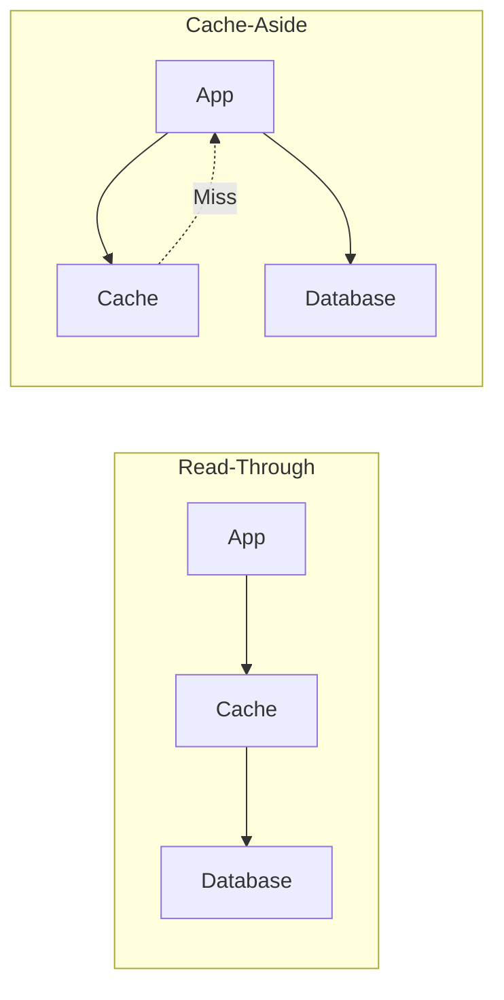
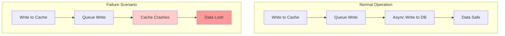
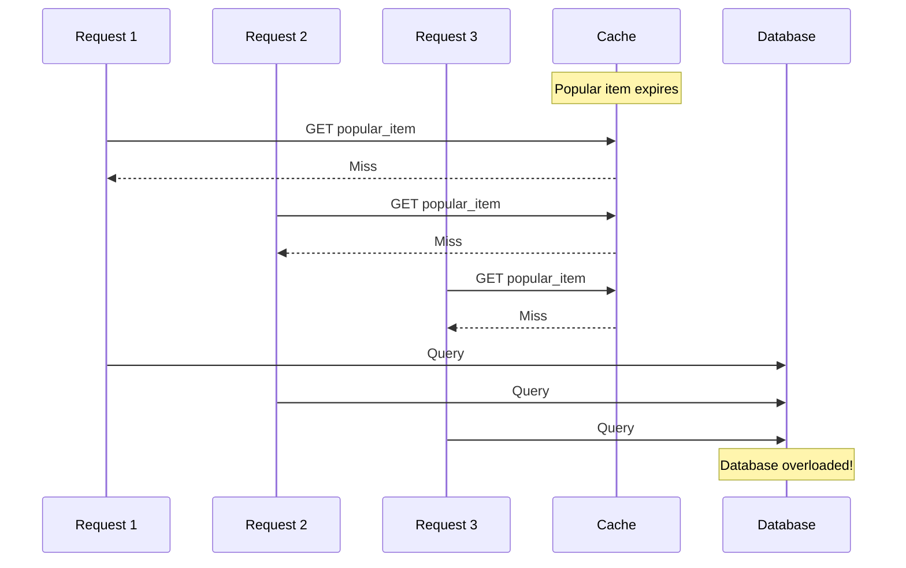

Caching is not optional. If you are building any application that needs to scale, you will deal with caching. But here is the thing: most developers throw Redis at the problem without thinking about which caching strategy fits their use case.

The result? Cache inconsistencies, stale data bugs, or systems that are slower than they should be.

This guide covers the core caching strategies that every backend developer needs to understand. No fluff, just the patterns, when to use them, and the tradeoffs you should know about.

## Why Caching Matters

Before diving into strategies, let us quickly establish why caching exists.

**The Problem**: Database queries are slow. Even with indexes, reading from disk takes milliseconds. At scale, those milliseconds add up to seconds.

**The Solution**: Keep frequently accessed data in memory. Memory access is 100,000 times faster than disk access.

| Storage Type | Access Time | Relative Speed |
|-------------|-------------|----------------|
| L1 Cache (CPU) | 0.5 ns | 1x |
| RAM | 100 ns | 200x slower |
| SSD | 100 μs | 200,000x slower |
| HDD | 10 ms | 20,000,000x slower |
| Network DB | 50 ms+ | 100,000,000x slower |

A cache hit that takes 1ms vs a database query that takes 50ms makes a huge difference when you are handling thousands of requests per second.

## The Six Caching Strategies

There are six main caching strategies. Each has its place depending on your read/write patterns and consistency requirements.

| Strategy | How It Works | Best For |
|----------|--------------|----------|
| **Cache-Aside** | Application manages cache directly | General purpose, most control |
| **Read-Through** | Cache fetches from DB on miss | Read-heavy workloads, simpler code |
| **Write-Through** | Writes go to cache and DB synchronously | Consistency critical (financial data) |
| **Write-Behind** | Writes to cache first, async to DB | Write-heavy, high throughput |
| **Write-Around** | Writes bypass cache, go to DB only | Write-once data (logs, events) |
| **Refresh-Ahead** | Proactively refresh before expiry | Predictable access patterns |

Let us dive into each one.

---

## 1. Cache-Aside (Lazy Loading)

Cache-Aside is the most common caching pattern. The application code is responsible for managing the cache.

### How It Works

1. Application checks the cache first
2. If data exists (cache hit), return it
3. If data does not exist (cache miss), query the database
4. Store the result in cache for future requests
5. Return the data


### Code Example

```python
def get_user(user_id):
    # Step 1: Check cache first
    cache_key = f"user:{user_id}"
    cached_user = cache.get(cache_key)
    
    if cached_user:
        return cached_user  # Cache hit
    
    # Step 2: Cache miss - query database
    user = db.query("SELECT * FROM users WHERE id = ?", user_id)
    
    # Step 3: Populate cache for next time
    cache.set(cache_key, user, ttl=3600)  # 1 hour TTL
    
    return user


def update_user(user_id, data):
    # Update database
    db.execute("UPDATE users SET ... WHERE id = ?", data, user_id)
    
    # Invalidate cache
    cache.delete(f"user:{user_id}")
```

### When to Use Cache-Aside

<i class="fas fa-check-circle" style="color: #28a745;"></i> **Read-heavy workloads** where data is read more often than written

<i class="fas fa-check-circle" style="color: #28a745;"></i> **You need fine-grained control** over what gets cached

<i class="fas fa-check-circle" style="color: #28a745;"></i> **Cache failures should not break the application** (graceful degradation)

<i class="fas fa-check-circle" style="color: #28a745;"></i> **General purpose caching** when you are not sure which pattern to use

### Tradeoffs

| Pros | Cons |
|------|------|
| Simple to implement | Application must manage cache |
| Cache failure does not break reads | First request is always slow (cold cache) |
| Only caches data that is actually read | Potential for stale data |
| Works with any cache backend | Cache and DB can get out of sync |

### Real World Usage

**Facebook** uses Cache-Aside with Memcached for user profile data. Applications check Memcached first, fall back to MySQL on miss, and populate the cache after fetching.

---

## 2. Read-Through Cache

Read-Through is like Cache-Aside, but the cache itself handles the database lookup on a miss. The application only talks to the cache.

### How It Works

1. Application requests data from cache
2. If cache hit, return data
3. If cache miss, cache fetches from database automatically
4. Cache stores the data and returns it


### The Key Difference from Cache-Aside



In Cache-Aside, your application fetches from the database on a miss. In Read-Through, the cache handles that automatically.

### Code Example

With Read-Through, your application code is simpler:

```python
# Read-Through - Application code is simple
def get_user(user_id):
    # Cache handles everything
    # On miss, it fetches from DB automatically
    return cache.get(f"user:{user_id}")
```

The cache is configured with a loader function:

```python
# Cache configuration
cache = ReadThroughCache(
    loader=lambda key: db.query("SELECT * FROM users WHERE id = ?", 
                                 key.split(":")[1]),
    ttl=3600
)
```

### When to Use Read-Through

<i class="fas fa-check-circle" style="color: #28a745;"></i> **You want simpler application code** without cache management logic

<i class="fas fa-check-circle" style="color: #28a745;"></i> **Read-heavy workloads** with predictable data access patterns

<i class="fas fa-check-circle" style="color: #28a745;"></i> **Using a cache that supports it** (like AWS DAX for DynamoDB)

### Tradeoffs

| Pros | Cons |
|------|------|
| Simpler application code | Less control over caching logic |
| Cache manages its own data | Cache must know how to load data |
| Consistent cache population | Not all caches support this pattern |
| Reduces code duplication | Harder to debug cache behavior |

### Real World Usage

**AWS DynamoDB Accelerator (DAX)** is a Read-Through cache for DynamoDB. Your application queries DAX, and it automatically handles fetching from DynamoDB on cache misses.

---

## 3. Write-Through Cache

Write-Through ensures the cache and database are always in sync. Every write goes to both the cache and database before returning success.

### How It Works

1. Application writes to cache
2. Cache synchronously writes to database
3. Only after both succeed, return success to application


### Code Example

```python
def update_user(user_id, data):
    cache_key = f"user:{user_id}"
    
    # Write-Through: cache handles both updates
    # This is atomic - both succeed or both fail
    cache.write_through(cache_key, data)
```

Behind the scenes, the cache implementation:

```python
class WriteThroughCache:
    def write_through(self, key, value):
        # Write to database first
        self.db.write(key, value)
        
        # Then update cache
        self.cache.set(key, value)
        
        # If either fails, the operation fails
```

### When to Use Write-Through

<i class="fas fa-check-circle" style="color: #28a745;"></i> **Data consistency is critical** (financial transactions, inventory counts)

<i class="fas fa-check-circle" style="color: #28a745;"></i> **You cannot afford stale reads** after a write

<i class="fas fa-check-circle" style="color: #28a745;"></i> **Combined with Read-Through** for a complete caching solution

### Tradeoffs

| Pros | Cons |
|------|------|
| Cache and DB always in sync | Higher write latency |
| No stale data after writes | Writes are only as fast as DB |
| Simple consistency model | Not suitable for write-heavy workloads |
| Easy to reason about | Cache failures can block writes |

### Real World Usage

**Banking systems** often use Write-Through for account balances. When you transfer money, both the cache and database are updated synchronously to ensure you never see inconsistent balances.

---

## 4. Write-Behind (Write-Back) Cache

Write-Behind prioritizes write performance over immediate consistency. Writes go to the cache first and are asynchronously persisted to the database later.

### How It Works

1. Application writes to cache
2. Cache immediately returns success
3. Cache queues the write
4. Background process writes to database asynchronously


### Code Example

```python
class WriteBehindCache:
    def __init__(self):
        self.write_queue = Queue()
        self.start_background_writer()
    
    def set(self, key, value):
        # Update cache immediately
        self.cache.set(key, value)
        
        # Queue for async database write
        self.write_queue.put((key, value))
        
        return True  # Return immediately
    
    def background_writer(self):
        while True:
            batch = []
            
            # Collect writes for batching
            while len(batch) < 100 and not self.write_queue.empty():
                batch.append(self.write_queue.get())
            
            if batch:
                # Batch write to database
                self.db.batch_write(batch)
            
            time.sleep(0.1)  # Write every 100ms
```

### When to Use Write-Behind

<i class="fas fa-check-circle" style="color: #28a745;"></i> **Write-heavy workloads** where write performance is critical

<i class="fas fa-check-circle" style="color: #28a745;"></i> **You can tolerate eventual consistency** (data will sync, but not immediately)

<i class="fas fa-check-circle" style="color: #28a745;"></i> **Batching writes provides benefit** (reduces database load)

<i class="fas fa-check-circle" style="color: #28a745;"></i> **Short bursts of high write volume** (absorb spikes in cache)

### The Risk: Data Loss



**If the cache fails before syncing to the database, you lose data.** This is the main risk of Write-Behind.

### Tradeoffs

| Pros | Cons |
|------|------|
| Fastest write performance | Risk of data loss on cache failure |
| Reduces database load | Complex failure handling |
| Can batch multiple writes | Eventual consistency only |
| Absorbs traffic spikes | Harder to debug data issues |

### Real World Usage

**Netflix** uses Write-Behind for view history. When you watch something, it immediately updates in cache. The database is updated asynchronously. If cache fails before sync, you might lose a few seconds of viewing history, which is acceptable.

---

## 5. Write-Around Cache

Write-Around skips the cache entirely for writes. Data is written directly to the database, and the cache is only populated on reads.

### How It Works

1. Application writes directly to database (cache is bypassed)
2. Cache is not updated
3. On next read, data is loaded into cache


### Code Example

```python
def create_log_entry(log_data):
    # Write directly to database, skip cache
    db.execute("INSERT INTO logs ...", log_data)
    # Cache is not updated


def get_user(user_id):
    # Normal Cache-Aside for reads
    cached = cache.get(f"user:{user_id}")
    if cached:
        return cached
    
    user = db.query("SELECT * FROM users WHERE id = ?", user_id)
    cache.set(f"user:{user_id}", user)
    return user
```

### When to Use Write-Around

<i class="fas fa-check-circle" style="color: #28a745;"></i> **Data is written once but rarely read** (logs, audit trails)

<i class="fas fa-check-circle" style="color: #28a745;"></i> **You do not want writes to pollute the cache** with data that may never be read

<i class="fas fa-check-circle" style="color: #28a745;"></i> **Bulk data imports** where you are loading lots of data but only some will be accessed

### Tradeoffs

| Pros | Cons |
|------|------|
| Cache only stores actually-read data | First read after write is slow |
| Prevents cache pollution | Cache and DB can be inconsistent |
| Good for write-once-read-maybe data | Not suitable for read-after-write scenarios |
| Simple to implement | Requires careful invalidation |

### Real World Usage

**Logging systems** often use Write-Around. Log entries are written to the database, but only recent or searched logs are cached. This prevents the cache from filling up with old logs that nobody reads.

---

## 6. Refresh-Ahead Cache

Refresh-Ahead proactively refreshes cache entries before they expire. Instead of waiting for a cache miss, the cache predicts which data will be needed and refreshes it in the background.

### How It Works

1. Cache tracks access patterns
2. Before expiration, cache refreshes frequently accessed data
3. User requests always hit warm cache


### Code Example

```python
class RefreshAheadCache:
    def __init__(self, ttl=60, refresh_threshold=0.75):
        self.ttl = ttl
        self.refresh_threshold = refresh_threshold  # Refresh at 75% of TTL
    
    def get(self, key):
        entry = self.cache.get_with_metadata(key)
        
        if not entry:
            # Cache miss - load synchronously
            return self.load_and_cache(key)
        
        # Check if we should refresh
        age = time.now() - entry.created_at
        threshold = self.ttl * self.refresh_threshold
        
        if age > threshold:
            # Trigger background refresh
            self.refresh_async(key)
        
        return entry.value
    
    def refresh_async(self, key):
        # Non-blocking refresh
        thread = Thread(target=self.load_and_cache, args=[key])
        thread.start()
```

### When to Use Refresh-Ahead

<i class="fas fa-check-circle" style="color: #28a745;"></i> **Predictable access patterns** where you know what data will be accessed

<i class="fas fa-check-circle" style="color: #28a745;"></i> **Low latency is critical** and you cannot afford cache misses

<i class="fas fa-check-circle" style="color: #28a745;"></i> **Session data** or user preferences that are accessed frequently

<i class="fas fa-check-circle" style="color: #28a745;"></i> **Configuration data** that should always be fresh

### Tradeoffs

| Pros | Cons |
|------|------|
| Eliminates cache misses for hot data | Uses more resources (proactive fetches) |
| Consistent low latency | Complex to implement correctly |
| Keeps cache warm | May refresh data that is not needed |
| Good for predictable workloads | Prediction accuracy matters |

### Real World Usage

**CDNs** like Cloudflare use Refresh-Ahead for popular content. They track which resources are frequently accessed and proactively refresh them before the cache expires, ensuring users always get fast responses.

---

## Cache Eviction Policies

No matter which strategy you use, your cache has limited memory. When it is full, something has to go. Eviction policies decide what gets removed.

### The Main Eviction Policies

| Policy | Full Name | What It Does | Best For |
|--------|-----------|--------------|----------|
| **LRU** | Least Recently Used | Evicts items not accessed recently | General purpose, most common |
| **LFU** | Least Frequently Used | Evicts items with lowest access count | Stable access patterns |
| **FIFO** | First In First Out | Evicts oldest items regardless of access | Simple use cases |
| **TTL** | Time To Live | Evicts items after fixed time period | Time-sensitive data |
| **Random** | Random Eviction | Evicts random items | Testing, fallback |

### LRU (Least Recently Used)

Removes items that have not been accessed for the longest time.

```python
# LRU Cache behavior
cache.set("A", 1)  # Cache: [A]
cache.set("B", 2)  # Cache: [A, B]
cache.set("C", 3)  # Cache: [A, B, C]

cache.get("A")     # Access A, moves to end: [B, C, A]

cache.set("D", 4)  # Cache full, evict B (least recent): [C, A, D]
```

**Best for**: General purpose caching, most common choice

### LFU (Least Frequently Used)

Removes items with the lowest access count.

```python
# LFU Cache behavior
cache.set("A", 1)  # A: count=1
cache.get("A")     # A: count=2
cache.get("A")     # A: count=3

cache.set("B", 2)  # B: count=1

# When evicting, B goes first (lower count)
```

**Best for**: Data with stable access patterns, CDN caching

### TTL (Time To Live)

Items expire after a fixed time, regardless of access.

```python
cache.set("session", data, ttl=3600)  # Expires in 1 hour

# After 1 hour, item is automatically removed
```

**Best for**: Session data, temporary tokens, data that must be fresh

### Comparison Table

| Policy | Best For | Pros | Cons |
|--------|----------|------|------|
| LRU | General use | Simple, effective | Scan resistance issues |
| LFU | Stable patterns | Keeps truly hot items | Slow to adapt to changes |
| FIFO | Simple needs | Very simple | Ignores access patterns |
| TTL | Time-sensitive data | Guarantees freshness | May evict hot items |
| Random | Testing/fallback | No overhead | Unpredictable |

---

## Cache Invalidation: The Hard Part

There is a famous quote in computer science:

> "There are only two hard things in Computer Science: cache invalidation and naming things."
> — Phil Karlton

Cache invalidation is deciding when and how to remove stale data from the cache.

### Invalidation Strategies

| Strategy | How It Works | Tradeoff |
|----------|--------------|----------|
| **TTL-based** | Expire after fixed time | Simple but allows stale window |
| **Event-based** | Invalidate on data write | Immediate but requires tracking |
| **Version-based** | Include version in cache key | No stale data but higher cache miss |
| **Manual Purge** | Explicit invalidation call | Full control but manual effort |

### TTL-based Invalidation

Set an expiration time. Accept that data may be stale within that window.

```python
# Data may be up to 5 minutes stale
cache.set("user:123", user_data, ttl=300)
```

**When to use**: When you can tolerate some staleness

### Event-based Invalidation

Invalidate cache when the underlying data changes.

```python
def update_user(user_id, data):
    db.update("users", user_id, data)
    cache.delete(f"user:{user_id}")  # Invalidate immediately

def update_product(product_id, data):
    db.update("products", product_id, data)
    
    # Invalidate all related caches
    cache.delete(f"product:{product_id}")
    cache.delete(f"category:{data['category_id']}")
    cache.delete("featured_products")
```

**When to use**: When consistency is important

### Version-based Invalidation

Include a version in the cache key. When data changes, increment version.

```python
def get_user(user_id):
    version = db.get_version("user", user_id)
    cache_key = f"user:{user_id}:v{version}"
    
    cached = cache.get(cache_key)
    if cached:
        return cached
    
    user = db.query("SELECT * FROM users WHERE id = ?", user_id)
    cache.set(cache_key, user)
    return user


def update_user(user_id, data):
    db.update("users", user_id, data)
    db.increment_version("user", user_id)
    # Old cache key becomes irrelevant
```

**When to use**: When you cannot easily track all cache dependencies

---

## Common Caching Mistakes

### Mistake 1: Caching Everything

Not all data benefits from caching. Cache data that is:
- Read frequently
- Expensive to compute or fetch
- Relatively stable

```python
# Bad: Caching rarely accessed data wastes memory
cache.set(f"user:{user_id}:login_history", history)  # Who reads this?

# Good: Cache frequently accessed, stable data
cache.set(f"user:{user_id}:profile", profile)
```

### Mistake 2: No TTL

Without TTL, stale data lives forever.

```python
# Bad: No expiration
cache.set("exchange_rates", rates)

# Good: Appropriate TTL
cache.set("exchange_rates", rates, ttl=300)  # 5 minutes
```

### Mistake 3: Cache Stampede

When a popular cache entry expires, hundreds of requests hit the database simultaneously.



**Solution**: Use locking or probabilistic early expiration.

```python
def get_with_lock(key):
    data = cache.get(key)
    if data:
        return data
    
    # Try to acquire lock
    if cache.set(f"lock:{key}", 1, nx=True, ttl=5):
        # We have the lock, fetch data
        data = db.query(...)
        cache.set(key, data)
        cache.delete(f"lock:{key}")
        return data
    else:
        # Someone else is fetching, wait and retry
        time.sleep(0.1)
        return get_with_lock(key)
```

### Mistake 4: Not Handling Cache Failures

Cache is not your database. It can fail.

```python
# Bad: Crash if cache fails
def get_user(user_id):
    return cache.get(f"user:{user_id}")  # What if cache is down?

# Good: Fall back to database
def get_user(user_id):
    try:
        cached = cache.get(f"user:{user_id}")
        if cached:
            return cached
    except CacheError:
        pass  # Cache is down, continue to database
    
    return db.query("SELECT * FROM users WHERE id = ?", user_id)
```

---

## Choosing the Right Strategy

Here is a quick reference:

| Scenario | Recommended Strategy |
|----------|---------------------|
| General purpose caching | Cache-Aside |
| Read-heavy, simple code | Read-Through |
| Data consistency critical | Write-Through |
| High write throughput | Write-Behind |
| Write-once, read-maybe | Write-Around |
| Predictable access, low latency | Refresh-Ahead |

### Combining Strategies

Most production systems combine multiple strategies:

**Read-Through + Write-Through**: Full consistency, simple application code

**Cache-Aside + Write-Around**: Control over reads, skip cache for bulk writes

**Read-Through + Write-Behind**: Simple reads, high write performance

---

## Real World Implementations

### Redis

Redis supports multiple patterns through its command set:

```python
import redis

r = redis.Redis()

# Cache-Aside
def get_user(user_id):
    key = f"user:{user_id}"
    user = r.get(key)
    if user:
        return json.loads(user)
    
    user = db.query(user_id)
    r.setex(key, 3600, json.dumps(user))  # TTL of 1 hour
    return user

# Write-Through (application managed)
def update_user(user_id, data):
    db.update(user_id, data)
    r.setex(f"user:{user_id}", 3600, json.dumps(data))
```

### Memcached

Memcached is optimized for simple key-value caching:

```python
import memcache

mc = memcache.Client(['127.0.0.1:11211'])

# Simple Cache-Aside
def get_user(user_id):
    key = f"user:{user_id}"
    user = mc.get(key)
    if user:
        return user
    
    user = db.query(user_id)
    mc.set(key, user, time=3600)
    return user
```

### CDN Caching

CDNs like Cloudflare implement caching at the edge:

```
# Cache-Control header for CDN caching
Cache-Control: public, max-age=3600, s-maxage=86400

# max-age: Browser cache for 1 hour
# s-maxage: CDN cache for 24 hours
```

---

## Key Takeaways

1. **Cache-Aside is the default choice**. Start here unless you have specific requirements.

2. **Write-Through for consistency**. When you cannot afford stale reads after writes.

3. **Write-Behind for performance**. When write speed matters more than immediate consistency.

4. **Always set TTL**. Stale data is often worse than no cache.

5. **Handle cache failures gracefully**. The cache is not your source of truth.

6. **Cache invalidation is hard**. Plan your invalidation strategy before implementing caching.

7. **Measure before optimizing**. Cache what actually needs caching based on real access patterns.

---

**Further Reading**:

- [How Meta Achieves Cache Consistency](/meta-cache-consistency/) - Deep dive into Facebook's caching architecture
- [Redis Documentation](https://redis.io/docs/) - Official Redis caching patterns
- [AWS ElastiCache Best Practices](https://docs.aws.amazon.com/AmazonElastiCache/latest/mem-ug/BestPractices.html) - Production caching guidance
- [Memcached Wiki](https://github.com/memcached/memcached/wiki) - Memcached patterns and usage

*Building a high-traffic system? Check out [How Stripe Prevents Double Payments](/how-stripe-prevents-double-payment/) for idempotency patterns and [Write-Ahead Log](/distributed-systems/write-ahead-log/) for durability patterns that complement caching.*

