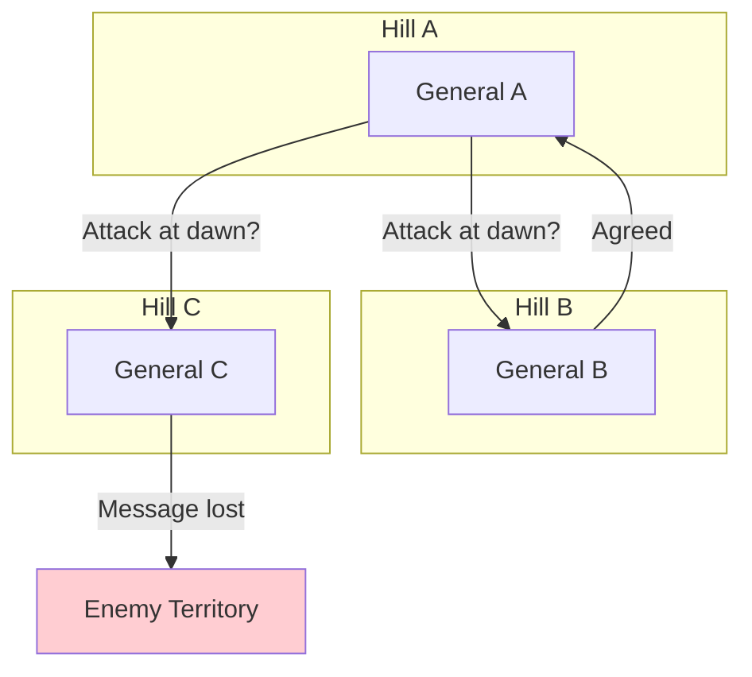
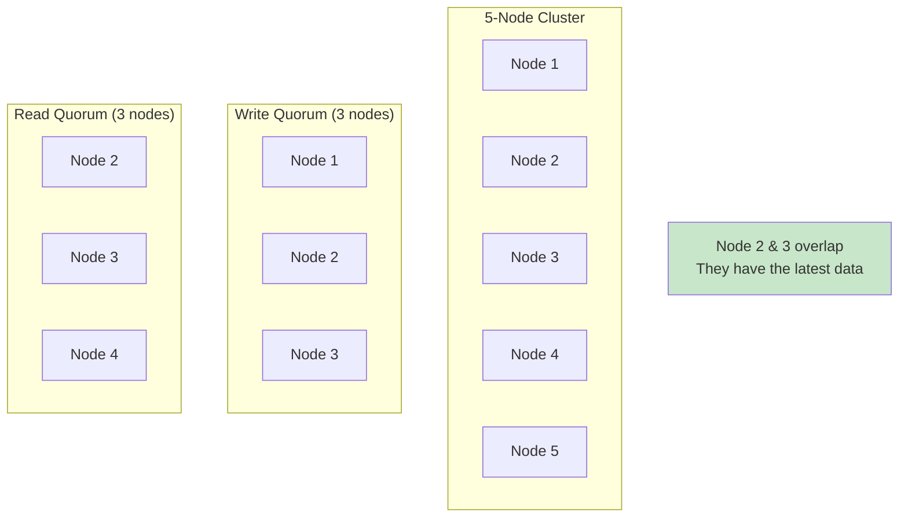
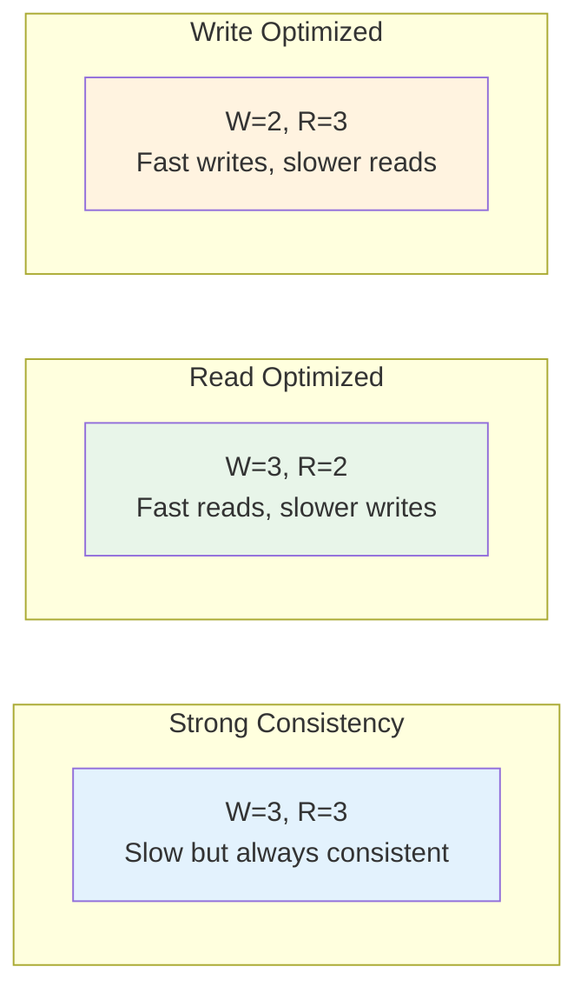
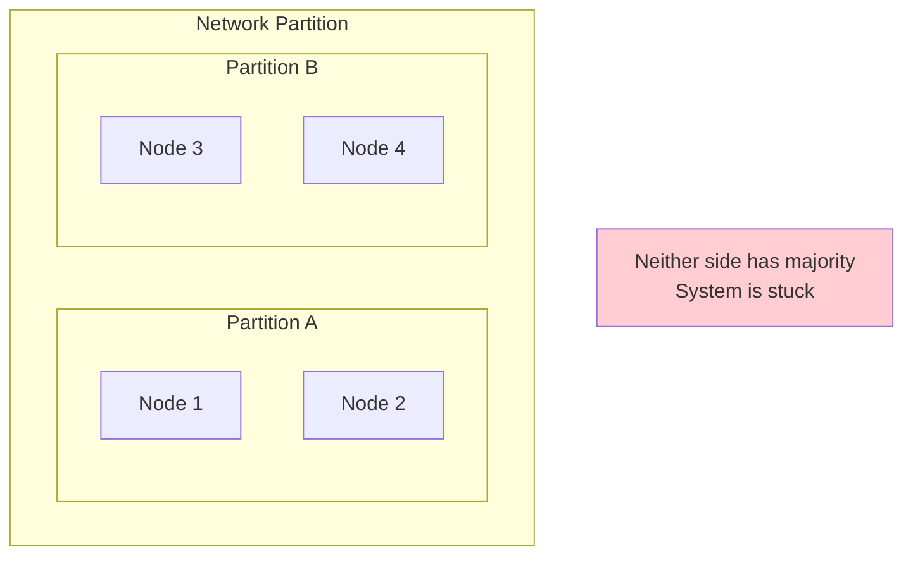
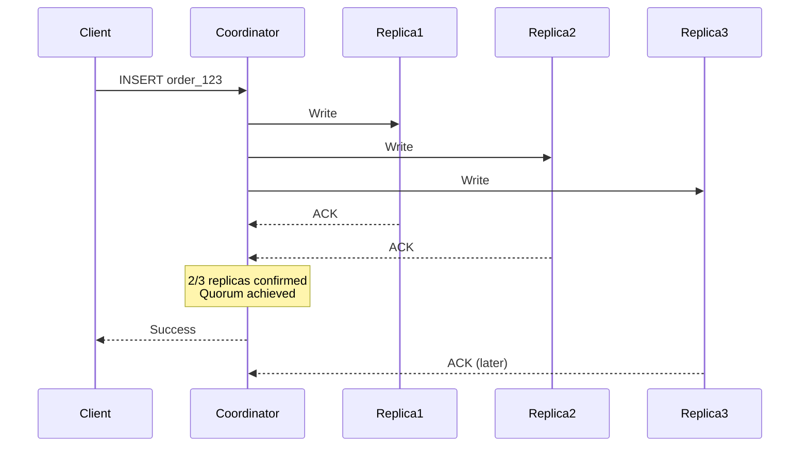
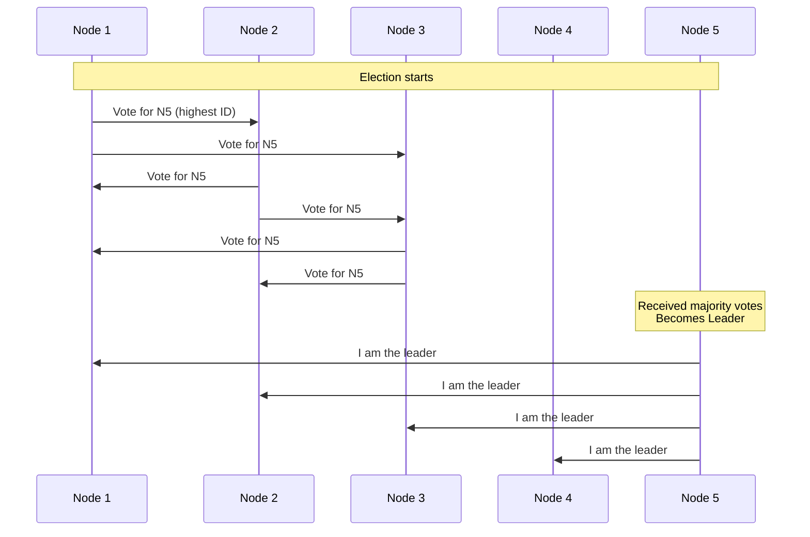
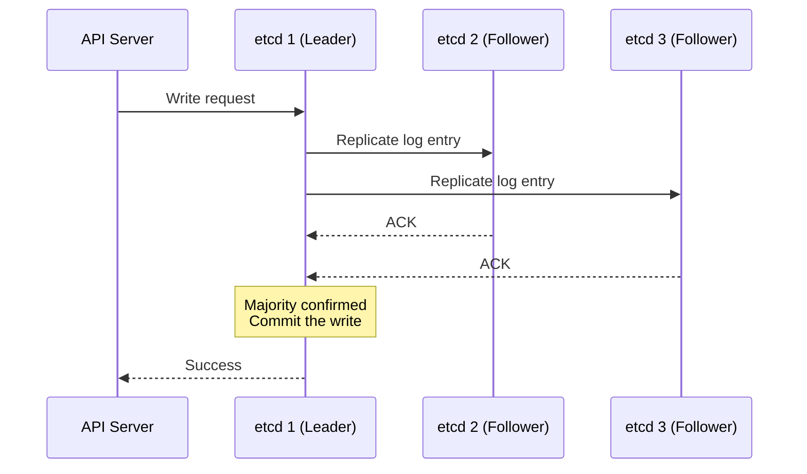
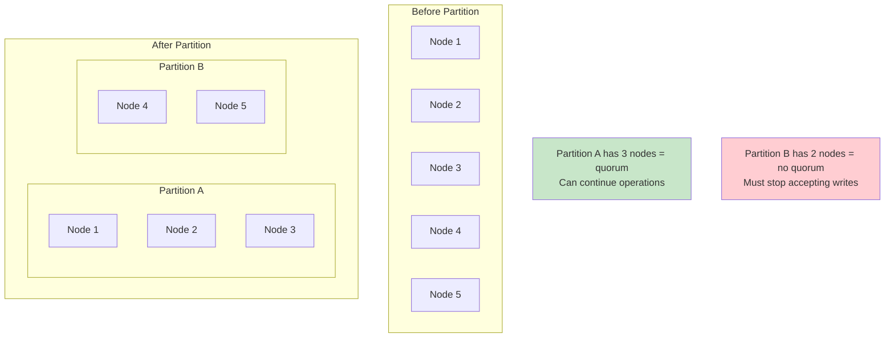
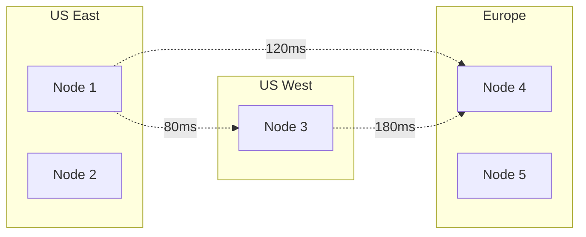

You have five servers running your e-commerce database. Orders are flowing in. A customer places an order at 10:15:03 AM. Server 1 records it. Servers 2 and 3 get the update. But servers 4 and 5? They were busy handling other requests and haven't received the update yet.

Now the customer refreshes their order history page. The request lands on server 5. It has no record of the order. The customer panics: "Where's my order? Did I get charged for nothing?"

This is the distributed systems nightmare. When data lives on multiple servers, how do you make sure everyone agrees on what's true?

The answer is a pattern called **Majority Quorum**, and it's the reason your distributed databases don't descend into chaos.

## The Problem: When Servers Disagree

Let's start with why this is hard.

### The Three Generals Problem

Imagine three generals in ancient times, each commanding an army on different hilltops. They need to coordinate an attack. If all three attack together, they win. If only one or two attack, they lose.

The generals communicate by sending messengers. But messengers can be captured. Messages can be delayed. How do the generals coordinate?



General A thinks everyone agreed. General C never got the message. What happens at dawn?

This is exactly what happens in distributed systems. Servers send messages. Messages get delayed or lost. Servers crash. Networks partition. And somehow, the system needs to keep making decisions.

## The Solution: Majority Rules

Here's the insight that changes everything: **If a majority agrees, we have a decision**.

Think about it. In a room of 5 people, if 3 agree on pizza for dinner, you're getting pizza. The 2 who wanted sushi can object, but they're outnumbered. The decision is made.

More importantly, you can never have two different majorities. If 3 people agree on pizza, the remaining 2 can't form a majority for sushi. There's only one winning group.

This is the **Majority Quorum** pattern.

### The Math

For a cluster of N nodes, the quorum size is:

```
Quorum = floor(N/2) + 1
```

Or in simpler terms: **more than half**.

| Cluster Size | Quorum Size | Can Tolerate Failures |
|--------------|-------------|----------------------|
| 3 nodes | 2 nodes | 1 failure |
| 5 nodes | 3 nodes | 2 failures |
| 7 nodes | 4 nodes | 3 failures |
| 9 nodes | 5 nodes | 4 failures |

Notice the pattern: to tolerate F failures, you need 2F + 1 nodes.

Why? Because even if F nodes fail, you still have F + 1 nodes left, which is still a majority.

## How Majority Quorum Works

Let's trace through what happens when you write and read data in a quorum-based system.

### Write Operations

When a client writes data, the system sends the write to all nodes but only waits for a majority to acknowledge.


The client doesn't wait for nodes 4 and 5. Once 3 nodes confirm, the write is successful. This is the **write quorum** in action.

### Read Operations

For reads, the client queries multiple nodes and takes the most recent value.


Node 3 had stale data, but the majority had the correct value. The client gets the right answer.

### The Overlap Guarantee

Here's the key insight: if you write to a majority and read from a majority, **at least one node will have the latest data**.



Any two majorities in a group **must overlap**. That overlap node guarantees you read the latest write.

## The Read/Write Formula

Different systems tune their quorums differently. The key constraint is:

```
W + R > N
```

Where:
- W = Write quorum (nodes that must acknowledge a write)
- R = Read quorum (nodes to query for a read)
- N = Total nodes

As long as this inequality holds, you're guaranteed to read your own writes.

### Different Configurations

**Strong Consistency (W=3, R=3, N=5)**
- Every write waits for 3 nodes
- Every read queries 3 nodes
- Always get latest data
- Slower operations

**Read-Heavy Workload (W=3, R=2, N=5)**  
- Writes still need majority (3)
- Reads only need 2 nodes
- Reads are faster
- Still consistent (3 + 2 > 5)

**Write-Heavy Workload (W=2, R=3, N=5)**
- Writes need only 2 nodes
- Reads must query 3 nodes
- Writes are faster
- Still consistent (2 + 3 > 5)



## Why Odd Numbers Matter

Ever notice that distributed systems often run on 3, 5, or 7 nodes? There's a reason.

Consider a 4-node cluster:
- Quorum = floor(4/2) + 1 = 3
- You can tolerate only 1 failure

Now consider a 5-node cluster:
- Quorum = floor(5/2) + 1 = 3
- You can tolerate 2 failures

Both require 3 nodes for quorum, but 5 nodes gives you better fault tolerance. The extra node is "free" resilience.

With even numbers, you also risk tie situations:



With 4 nodes split 2-2, neither side can form a quorum. The system halts. With 5 nodes, one side will always have 3 and can continue.

**Rule of thumb**: Always use odd numbers for your cluster size.

## Real-World Examples

### Apache Cassandra: Tunable Consistency

Cassandra lets you choose your consistency level per query. Here's what happens when you write with `QUORUM` consistency:

```sql
-- Write with quorum consistency
INSERT INTO orders (id, amount, status) 
VALUES (123, 50.00, 'pending')
USING CONSISTENCY QUORUM;
```

Behind the scenes:



Cassandra offers these consistency levels:

| Level | What it means |
|-------|---------------|
| ONE | Wait for 1 replica |
| QUORUM | Wait for majority |
| ALL | Wait for all replicas |
| LOCAL_QUORUM | Majority in local data center |

Most production systems use `LOCAL_QUORUM` for writes and `LOCAL_QUORUM` for reads. This gives you consistency within a data center while tolerating cross-datacenter latency.

### ZooKeeper: Leader Election

ZooKeeper uses quorum for something even more fundamental: electing a leader.

When ZooKeeper starts, nodes vote for a leader:



The leader is elected by quorum. All writes go through the leader. The leader only acknowledges a write when a quorum of followers confirm it.

This is why ZooKeeper clusters are always odd-sized. Their documentation explicitly recommends 3 or 5 nodes.

### etcd and Kubernetes: Raft Consensus

etcd, the brain of Kubernetes, uses the Raft consensus algorithm. Raft relies heavily on majority quorum. (For a deeper look at consensus algorithms, see [Paxos: The Democracy of Distributed Systems](/distributed-systems/paxos/).)

Every Kubernetes cluster state change (pod created, service updated, deployment scaled) goes through etcd:



When the leader commits a log entry, it must be replicated to a majority first. This is why production Kubernetes clusters run 3 or 5 etcd nodes.

**Fun fact**: Kubernetes can survive losing minority of etcd nodes. Lose 2 out of 5, and your cluster keeps running. Lose 3, and it freezes until you recover nodes.

## The Split-Brain Problem

The biggest threat to distributed systems is the **split-brain** scenario. This happens when a network partition divides your cluster, and both sides think they're in charge.



Majority quorum prevents split-brain by design. Only one partition can have a majority. The minority partition **must** stop accepting writes.

This is a tradeoff. The minority partition becomes unavailable. But the alternative (two partitions making conflicting updates) is worse. You'd end up with divergent data that's nearly impossible to reconcile.

This is the core tension in the CAP theorem. Majority quorum chooses **Consistency** over **Availability** during a partition.

## Practical Considerations

### Latency Impact

Quorum operations are only as fast as the slowest node in your quorum.

```mermaid
gantt
    dateFormat X
    axisFormat %L ms
    
    section Node 1
    Response    :done, 0, 50
    
    section Node 2
    Response    :done, 0, 30
    
    section Node 3
    Response    :done, 0, 200
    
    section Quorum
    Wait for 2 fastest :crit, 0, 50
```



If you need 2 out of 3 nodes, you wait for the 2nd response. In this case, 50ms instead of 200ms. The slowest node doesn't hurt you (unless all your nodes are slow).

**Optimization**: Place nodes in different availability zones but same region. You get fault isolation without cross-region latency.

### Monitoring Quorum Health

In production, monitor these metrics:

1. **Quorum available**: Can you reach a majority of nodes?
2. **Write latency percentiles**: Are quorum writes slowing down?
3. **Replication lag**: How far behind are non-quorum nodes?
4. **Node health**: How many nodes are actually healthy?

Set alerts when you're close to losing quorum:

```
Alert: Only 3 of 5 nodes healthy
Severity: Warning
Message: One more node failure will break quorum
```

This gives you time to investigate before an outage.

### Handling Node Failures

When a node fails, the system keeps running as long as quorum is maintained. But you should:

1. **Replace failed nodes quickly**: Running at minimum quorum is risky
2. **Don't add too many nodes at once**: Large membership changes can destabilize the cluster
3. **Use rolling restarts**: Never restart more than one node at a time

Some systems like etcd have explicit membership change protocols to handle this safely.

## When Quorum Gets Tricky

### Geographic Distribution

Quorum across data centers introduces latency challenges:



If quorum requires cross-region communication, every write pays the latency cost. Solutions include:

- **Local quorum**: Achieve quorum within a region first, replicate asynchronously
- **Witness nodes**: Place small witness nodes in a third location to break ties
- **Leader placement**: Put the leader in the region with most traffic

### Dynamic Membership

Adding or removing nodes from a quorum cluster is tricky. If you're not careful, you can end up with two groups both thinking they have quorum.

Safe approach (used by Raft):

1. Propose the membership change as a log entry
2. Wait for it to commit (requires current quorum)
3. New configuration takes effect
4. Old members step down if no longer part of cluster

Never jump directly from 3 to 5 nodes. Add one at a time and let the cluster stabilize.

## When to Use Majority Quorum

**Use quorum-based systems when:**
- You need strong consistency
- You can tolerate some unavailability during partitions
- Your cluster size is reasonably small (3 to 7 nodes typically)
- Operations can wait for multiple responses

**Avoid quorum when:**
- Availability is more important than consistency
- You have very large clusters (quorum of 50 nodes is slow)
- Single-node latency is already a bottleneck
- You're doing read-heavy workloads where eventual consistency is acceptable

## The Tradeoffs

| Aspect | With Quorum | Without Quorum |
|--------|-------------|----------------|
| **Consistency** | Strong | Eventual |
| **Availability** | Reduced during partitions | Higher |
| **Latency** | Higher (wait for majority) | Lower (single node) |
| **Complexity** | Moderate | Lower |
| **Split-brain risk** | Eliminated | Possible |

## Wrapping Up

Majority Quorum is one of the most fundamental patterns in distributed systems. It solves the core problem of getting multiple servers to agree without a central authority.

The key insights:

1. **Majority agreement prevents conflicts**: Two majorities always overlap
2. **Odd numbers maximize fault tolerance**: 5 nodes tolerates 2 failures with same quorum as 4
3. **W + R > N guarantees consistency**: Your reads will see your writes
4. **Quorum trades availability for consistency**: Minority partitions stop accepting writes
5. **Real systems use quorum everywhere**: Cassandra, ZooKeeper, etcd, Raft

Understanding quorum is essential because it shows up in so many places. Leader election, log replication, distributed transactions, and consensus algorithms all build on this foundation.

The next time your database says "quorum achieved," you'll know exactly what it means: more than half agreed, and that's enough to make a decision.

---

*For more on distributed systems patterns, check out [Replicated Log](/distributed-systems/replicated-log/), [Gossip Dissemination](/distributed-systems/gossip-dissemination/), [Heartbeat: Detecting Failures](/distributed-systems/heartbeat/), [Paxos Consensus Algorithm](/distributed-systems/paxos/), [Write-Ahead Log](/distributed-systems/write-ahead-log/), and [Two-Phase Commit](/distributed-systems/two-phase-commit/). Building high-availability systems? See [How Kafka Works](/distributed-systems/how-kafka-works/) for durable message queuing.*

*References: [Martin Kleppmann's Designing Data-Intensive Applications](https://dataintensive.net/), [Raft Consensus Algorithm](https://raft.github.io/), [Apache Cassandra Documentation](https://cassandra.apache.org/doc/latest/cassandra/architecture/dynamo.html), [etcd Design](https://etcd.io/docs/v3.5/learning/design-learner/)*


