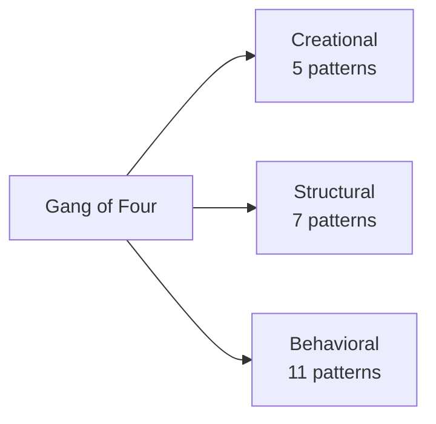
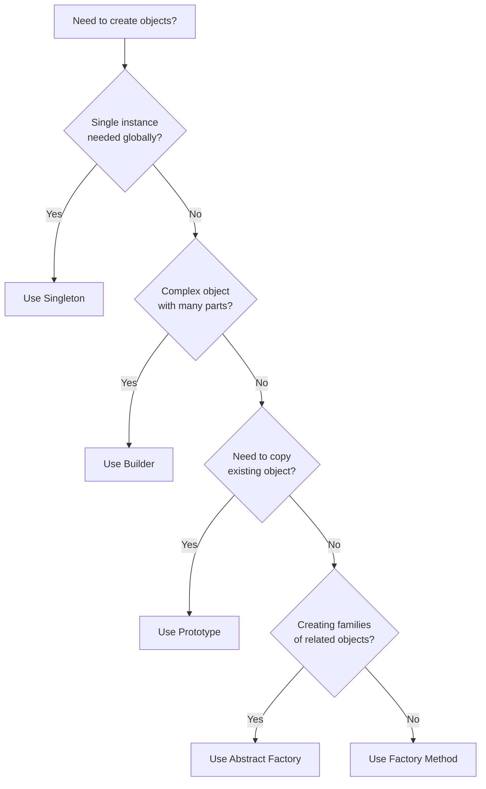
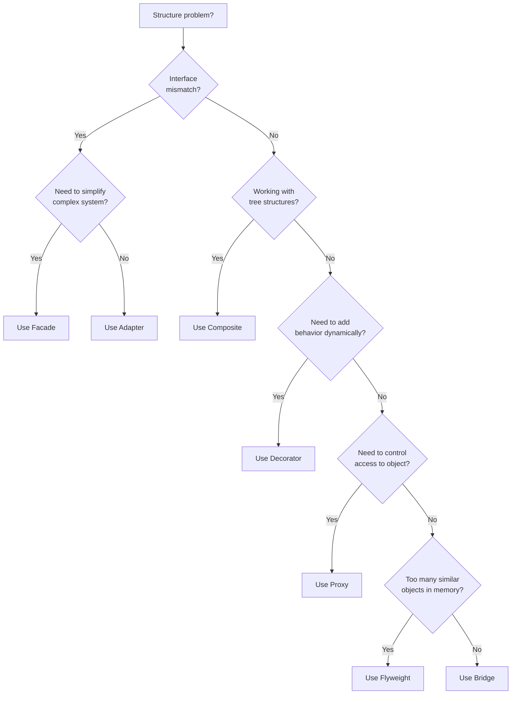
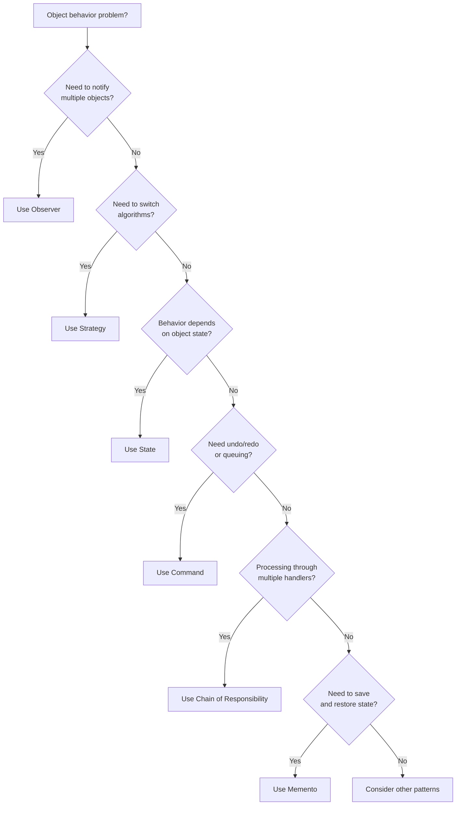

In 1994, four software engineers published a book that changed how developers think about code. Erich Gamma, Richard Helm, Ralph Johnson, and John Vlissides documented 23 design patterns that kept appearing in well designed software. The book became a classic. The authors became known as the Gang of Four.

Three decades later, these patterns still matter. Not because they are old, but because the problems they solve keep showing up. You will find these patterns in the Java SDK, Spring Framework, Android, React, and pretty much every major codebase.

This guide covers all 23 patterns. What they do, when to use them, and where you have probably already seen them without knowing it.

## What Are Design Patterns?

Design patterns are proven solutions to recurring problems in software design. They are not code you copy and paste. They are templates that describe how to solve a problem in different situations.

Think of patterns like architectural blueprints. An architect does not reinvent the floor plan for every building. They use proven layouts that work. Design patterns are the same idea applied to software.

| What Patterns Are | What Patterns Are Not |
|------------------|----------------------|
| Reusable solutions to common problems | Finished code you copy paste |
| Communication tools between developers | Rules you must always follow |
| Templates you adapt to your context | The only way to solve a problem |
| Documented best practices | A silver bullet for all design issues |

The real value is communication. When you say "we used the Observer pattern here", every developer who knows patterns immediately understands the structure without reading the code.

## The Three Categories of Must-Know Gang of Four Patterns

The Gang of Four organized their 23 patterns into three categories based on what they do:

| Category | Purpose | Pattern Count |
|----------|---------|---------------|
| **Creational** | Control how objects are created | 5 |
| **Structural** | Define how objects are composed | 7 |
| **Behavioral** | Define how objects communicate | 11 |

---

## <i class="fas fa-cube"></i> Creational Patterns

Creational patterns deal with object creation. They abstract the instantiation process, making your system independent of how objects are created, composed, and represented.

### Overview

| Pattern | Intent | Real World Example |
|---------|--------|-------------------|
| [Singleton](/design-patterns/singleton/) | Ensure only one instance exists | Database connection pool |
| [Factory Method](/design-patterns/factory-method/) | Let subclasses decide which class to instantiate | Document creation in editors |
| [Abstract Factory](/design-patterns/abstract-factory/) | Create families of related objects | UI component kits |
| [Builder](/design-patterns/builder/) | Construct complex objects step by step | SQL query builders |
| [Prototype](/design-patterns/prototype/) | Clone existing objects | Object copying in games |

### When to Use Which

### Quick Examples

**[Singleton](/design-patterns/singleton/)** ensures a class has only one instance. Use it for shared resources like configuration managers, connection pools, or logging systems. But be careful. Singletons introduce global state and make testing harder. Consider dependency injection as an alternative.

**[Factory Method](/design-patterns/factory-method/)** defines an interface for creating objects but lets subclasses decide which class to instantiate. You see this in frameworks that need to create objects without knowing their concrete types. The `Calendar.getInstance()` method in Java is a classic example.

**[Abstract Factory](/design-patterns/abstract-factory/)** takes Factory Method further by creating families of related objects. Think UI toolkits where you need buttons, checkboxes, and text fields that all match the same visual style (Windows, Mac, or Linux).

**[Builder](/design-patterns/builder/)** separates the construction of complex objects from their representation. When you have objects with many optional parameters, Builder prevents the telescoping constructor problem. StringBuilder, HttpRequest.Builder, and SQL query builders all use this pattern.

**[Prototype](/design-patterns/prototype/)** creates new objects by copying existing ones. This is useful when object creation is expensive or when you need to create objects that are similar to existing ones with small variations.

---

## <i class="fas fa-sitemap"></i> Structural Patterns

Structural patterns explain how to assemble objects and classes into larger structures while keeping those structures flexible and efficient.

### Overview

| Pattern | Intent | Real World Example |
|---------|--------|-------------------|
| [Adapter](/design-patterns/adapter/) | Convert interface to one clients expect | Power plug adapters |
| [Bridge](/design-patterns/bridge/) | Separate abstraction from implementation | Device drivers |
| [Composite](/design-patterns/composite/) | Treat individual and composite objects uniformly | File system directories |
| [Decorator](/design-patterns/decorator/) | Add responsibilities dynamically | Java I/O streams |
| [Facade](/design-patterns/facade/) | Simple interface to complex subsystem | Home theater remote |
| [Flyweight](/design-patterns/flyweight/) | Share common state between objects | Character rendering in editors |
| [Proxy](/design-patterns/proxy/) | Control access to another object | Lazy loading images |

### When to Use Which

### Quick Examples

**[Adapter](/design-patterns/adapter/)** lets classes work together that could not otherwise because of incompatible interfaces. You have a legacy system with one interface and a new library expecting another. Adapter sits in the middle and translates. Java's `Arrays.asList()` adapts arrays to the List interface.

**[Bridge](/design-patterns/bridge/)** decouples an abstraction from its implementation so both can vary independently. Think of how JDBC works: you write code against the JDBC API (abstraction), and the actual database driver (implementation) can change without affecting your code.

**[Composite](/design-patterns/composite/)** composes objects into tree structures and lets clients treat individual objects and compositions uniformly. File systems are the classic example: files and folders are treated the same way, and folders can contain other folders.

**[Decorator](/design-patterns/decorator/)** attaches additional responsibilities to objects dynamically. Java I/O is the textbook example. You wrap a `FileInputStream` with `BufferedInputStream` to add buffering, then with `DataInputStream` to read primitives. Each wrapper adds behavior without changing the original class.

**[Facade](/design-patterns/facade/)** provides a simplified interface to a complex subsystem. When you have many classes working together, Facade offers a single entry point. Think of a compiler with lexer, parser, optimizer, and code generator. A `Compiler.compile()` method is a facade hiding the complexity.

**[Flyweight](/design-patterns/flyweight/)** minimizes memory usage by sharing as much data as possible with similar objects. Text editors use this for characters. Instead of storing font and style with every character, they share common data and only store the character code per instance.

**[Proxy](/design-patterns/proxy/)** provides a placeholder for another object to control access. Virtual proxies delay expensive operations (lazy loading images). Protection proxies control access rights. Remote proxies represent objects in different address spaces (RPC, RMI).

---

## <i class="fas fa-exchange-alt"></i> Behavioral Patterns

Behavioral patterns are concerned with algorithms and the assignment of responsibilities between objects. They describe patterns of communication between objects.

### Overview

| Pattern | Intent | Real World Example |
|---------|--------|-------------------|
| [Chain of Responsibility](/design-patterns/chain-of-responsibility/) | Pass request along a chain of handlers | Middleware in web frameworks |
| [Command](/design-patterns/command/) | Encapsulate request as an object | Undo/redo operations |
| [Interpreter](/design-patterns/interpreter/) | Define grammar and interpret sentences | SQL parsers, regex engines |
| [Iterator](/design-patterns/iterator/) | Access elements sequentially | For each loops |
| [Mediator](/design-patterns/mediator/) | Centralize complex communications | Chat rooms, air traffic control |
| [Memento](/design-patterns/memento/) | Capture and restore object state | Save/load game state |
| [Observer](/design-patterns/observer/) | Notify dependents of state changes | Event listeners, pub/sub |
| [State](/design-patterns/state/) | Alter behavior when state changes | TCP connection states |
| [Strategy](/design-patterns/strategy/) | Encapsulate interchangeable algorithms | Sorting algorithms, payment methods |
| [Template Method](/design-patterns/template-method/) | Define algorithm skeleton, defer steps | Framework hooks |
| [Visitor](/design-patterns/visitor/) | Add operations without changing classes | AST traversal |

### Behavioral Pattern Selection

### Quick Examples

**[Chain of Responsibility](/design-patterns/chain-of-responsibility/)** passes requests along a chain of handlers. Each handler decides whether to process the request or pass it along. Middleware in Express.js or Spring Security filters work exactly this way.

**[Command](/design-patterns/command/)** encapsulates a request as an object. This lets you parameterize clients with different requests, queue or log requests, and support undo operations. Every button click handler, menu action, and keyboard shortcut in a GUI is typically a Command.

**[Interpreter](/design-patterns/interpreter/)** defines a representation for a grammar and an interpreter for sentences in that language. Regular expressions, SQL parsers, and mathematical expression evaluators use this pattern.

**[Iterator](/design-patterns/iterator/)** provides a way to access elements of a collection sequentially without exposing its underlying representation. Every for each loop in modern languages uses iterators. Java's `Iterator` interface and Python's iteration protocol are implementations of this pattern.

**[Mediator](/design-patterns/mediator/)** defines an object that encapsulates how a set of objects interact. Instead of objects referring to each other directly, they communicate through the mediator. Chat rooms, air traffic control systems, and event buses use this pattern.

**[Memento](/design-patterns/memento/)** captures and externalizes an object's internal state so the object can be restored later. Save game functionality, undo mechanisms in text editors, and database transaction rollback all use Memento concepts.

**[Observer](/design-patterns/observer/)** defines a subscription mechanism to notify multiple objects about events that happen to the object they are observing. Event listeners in JavaScript, RxJava observables, and publish subscribe systems all implement Observer.

**[State](/design-patterns/state/)** allows an object to alter its behavior when its internal state changes. The object appears to change its class. TCP connections (LISTEN, SYN_SENT, ESTABLISHED, CLOSED), order processing (PENDING, SHIPPED, DELIVERED), and media players (PLAYING, PAUSED, STOPPED) all use State.

**[Strategy](/design-patterns/strategy/)** defines a family of algorithms, encapsulates each one, and makes them interchangeable. Payment processing systems with multiple payment methods, sorting with different algorithms, and compression with different codecs all use Strategy.

**[Template Method](/design-patterns/template-method/)** defines the skeleton of an algorithm in a method, deferring some steps to subclasses. Framework hooks use this extensively. JUnit's setUp and tearDown, servlet lifecycle methods, and React class component lifecycle methods follow this pattern.

**[Visitor](/design-patterns/visitor/)** lets you add new operations to existing object structures without modifying them. Compilers use Visitor to perform operations on abstract syntax trees. Document processors visiting different element types use it too.

---

## Pattern Combinations That Work Well

Patterns often work together. Here are combinations you will see frequently:

| Combination | How They Work Together |
|-------------|----------------------|
| Factory + Singleton | Factory itself is a singleton that creates objects |
| Strategy + Factory | Factory creates appropriate strategy based on context |
| Decorator + Composite | Decorator wraps composite elements to add behavior |
| Observer + Mediator | Mediator notifies observers about changes in the system |
| Command + Memento | Memento stores state for Command undo operations |
| Facade + Adapter | Facade uses adapters to integrate legacy subsystems |
| Builder + Prototype | Builder creates prototype that gets cloned |

## Patterns in Real Codebases

### Java SDK

| Pattern | Example |
|---------|---------|
| Singleton | `Runtime.getRuntime()` |
| Factory Method | `Calendar.getInstance()` |
| Builder | `StringBuilder`, `Stream.builder()` |
| Adapter | `Arrays.asList()` |
| Decorator | `BufferedInputStream` wrapping `FileInputStream` |
| Iterator | `Iterator` interface, enhanced for loop |
| Observer | `java.util.Observer` (deprecated), `PropertyChangeListener` |
| Strategy | `Comparator` for sorting |

### Spring Framework

| Pattern | Example |
|---------|---------|
| Singleton | Default bean scope |
| Factory | `BeanFactory`, `ApplicationContext` |
| Proxy | AOP proxies for transactions, security |
| Template Method | `JdbcTemplate`, `RestTemplate` |
| Observer | Application events, `@EventListener` |
| Strategy | `AuthenticationProvider` implementations |

### Android SDK

| Pattern | Example |
|---------|---------|
| Builder | `AlertDialog.Builder`, `Notification.Builder` |
| Adapter | `RecyclerView.Adapter` |
| Observer | `LiveData`, `OnClickListener` |
| Factory | `LayoutInflater` |
| Composite | `ViewGroup` containing `View` elements |

## Common Mistakes to Avoid

**Over engineering**: Not every problem needs a pattern. If a simple if statement works, use it. Patterns add abstraction and complexity. Use them when the benefit outweighs the cost.

**Pattern hammering**: When you learn patterns, everything looks like a nail. Do not force patterns where they do not fit. The code should be simpler with the pattern than without it.

**Wrong pattern choice**: Strategy and State look similar but solve different problems. Factory Method and Abstract Factory have different use cases. Study the intent of each pattern, not just the structure.

**Ignoring language features**: Many patterns exist because older languages lacked certain features. Closures replace some uses of Strategy and Command. First class functions reduce the need for some patterns. Use what your language provides.

**Premature abstraction**: Do not add patterns "just in case" you need flexibility later. Wait until you actually need the flexibility. It is easier to add abstraction to simple code than to simplify over abstracted code.

## Learning Path

If you are new to design patterns, here is a practical order to learn them:

**Start here (most common)**:
1. [Singleton](/design-patterns/singleton/) - understand the concept and its controversies
2. [Factory Method](/design-patterns/factory-method/) - object creation without coupling to concrete classes
3. [Strategy](/design-patterns/strategy/) - swapping algorithms at runtime
4. [Observer](/design-patterns/observer/) - the foundation of event driven programming

**Next level**:
5. [Decorator](/design-patterns/decorator/) - adding behavior without inheritance
6. [Adapter](/design-patterns/adapter/) - making incompatible interfaces work together
7. [Builder](/design-patterns/builder/) - constructing complex objects
8. [Command](/design-patterns/command/) - encapsulating actions as objects

**Then expand to (important patterns to know)**:
9. [Facade](/design-patterns/facade/) - simplifying complex systems
10. [Template Method](/design-patterns/template-method/) - frameworks and hooks
11. [State](/design-patterns/state/) - behavior that changes with state
12. [Composite](/design-patterns/composite/) - tree structures

**Advanced patterns**:
The rest of the patterns (Proxy, Bridge, Flyweight, Chain of Responsibility, Mediator, Memento, Visitor, Interpreter, Prototype, Abstract Factory, Iterator) are less frequently used but valuable when you encounter the specific problems they solve.

## Wrapping Up

Design patterns are tools, not rules. The Gang of Four gave us a vocabulary to describe common solutions. That vocabulary helps us communicate, learn from existing code, and avoid reinventing wheels.

These patterns form the foundation of modern software design. Whether you are working with Java, Python, JavaScript, or any other language, understanding these patterns will help you recognize solutions in frameworks, libraries, and existing codebases.

But patterns are means, not ends. The goal is working software that is easy to understand and maintain. Sometimes that means using patterns. Sometimes it means keeping things simple.

Learn the patterns. Understand when they apply. Then use your judgment.

---

**Further Reading:**

- [Design Patterns: Elements of Reusable Object-Oriented Software](https://www.oreilly.com/library/view/design-patterns-elements/0201633612/) by Gamma, Helm, Johnson, Vlissides (the original GoF book)
- [Head First Design Patterns](https://www.oreilly.com/library/view/head-first-design/0596007124/) by Freeman and Robson (more approachable introduction)
- [Refactoring Guru: Design Patterns](https://refactoring.guru/design-patterns) (excellent online reference with examples in multiple languages)
- [Source Making: Design Patterns](https://sourcemaking.com/design_patterns) (another solid online reference)

