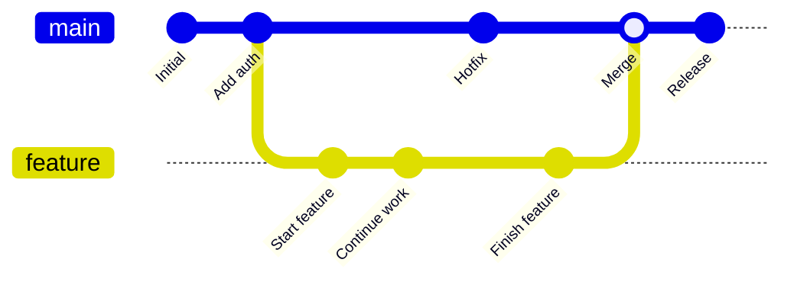
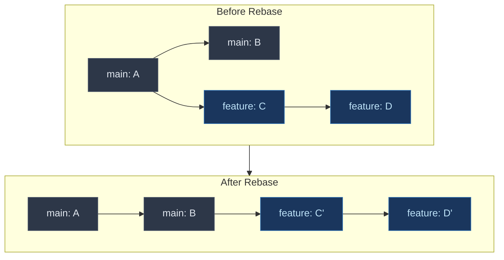
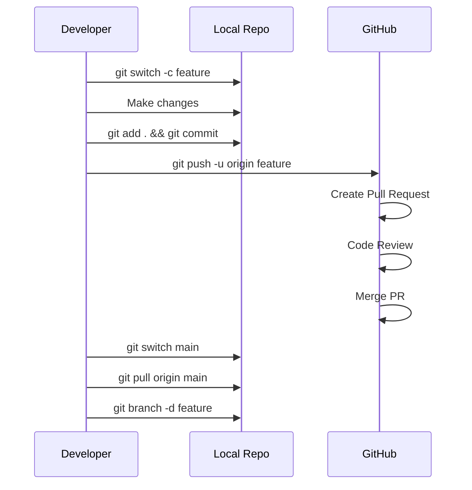

I keep a text file on my desktop with Git commands I use daily. Every time I forget something, I add it to the list. This post is that list, organized properly.

This is not a complete reference. It is the commands you will actually use at work, with examples that make sense.

## Table of Contents

- [Setting Up Git](#setting-up-git)
- [Starting a Project](#starting-a-project)
- [The Basic Workflow](#the-basic-workflow)
- [Branching](#branching)
- [Merging](#merging)
- [Rebasing](#rebasing)
- [Undoing Things](#undoing-things)
- [Stashing](#stashing)
- [Viewing History](#viewing-history)
- [Remote Repositories](#remote-repositories)
- [Cherry Picking](#cherry-picking)
- [Tags](#tags)
- [Cleaning Up](#cleaning-up)
- [Common Workflows](#common-workflows)
- [Git Aliases](#git-aliases)
- [Quick Reference Table](#quick-reference-table)

## Setting Up Git

Before you start, configure your identity. This is what shows up in your commits.

```bash
git config --global user.name "Your Name"
git config --global user.email "you@example.com"
```

Check your current configuration:

```bash
git config --list
```

Set your default branch name to main (instead of master):

```bash
git config --global init.defaultBranch main
```

These are just the basics. For a complete guide covering aliases, credentials, editor setup, and more, see the [Git Config Guide](/git-config-guide/).

## Starting a Project

You have two options: start fresh or clone an existing repository.

**Start a new repository:**

```bash
git init
```

This creates a `.git` folder in your current directory. You now have a Git repository.

**Clone an existing repository:**

```bash
git clone https://github.com/user/repo.git
```

To clone into a specific folder:

```bash
git clone https://github.com/user/repo.git my-folder
```

## The Basic Workflow

Here is what you will do a hundred times a day:


1. Make changes to files
2. Stage the changes you want to commit
3. Commit the staged changes
4. Push to the remote repository

### Check What Changed

See which files have been modified:

```bash
git status
```

See the actual changes line by line:

```bash
git diff
```

See changes that are already staged:

```bash
git diff --staged
```

### Stage Changes

Stage a specific file:

```bash
git add filename.txt
```

Stage all changes in current directory:

```bash
git add .
```

Stage all changes in the entire repository:

```bash
git add -A
```

Stage parts of a file interactively:

```bash
git add -p filename.txt
```

This is useful when you have multiple logical changes in one file and want to commit them separately.

### Commit Changes

Commit with a message:

```bash
git commit -m "Add user authentication"
```

Commit all tracked files (skip staging):

```bash
git commit -am "Fix login bug"
```

Note: The `-am` flag only works for files Git is already tracking. New files still need `git add` first.

### Push to Remote

Push to the remote repository:

```bash
git push origin main
```

If the branch does not exist on remote yet:

```bash
git push -u origin feature-branch
```

The `-u` flag sets up tracking so you can just use `git push` next time.

### Pull from Remote

Get the latest changes and merge:

```bash
git pull origin main
```

Pull with rebase instead of merge (cleaner history):

```bash
git pull --rebase origin main
```

I wrote more about the difference between pull and pull with rebase in [Git Command Line Basics](/git-command-line-basics/).

## Branching

Branches let you work on features without affecting the main codebase.



### Create and Switch Branches

List all branches:

```bash
git branch
```

List all branches including remote:

```bash
git branch -a
```

Create a new branch:

```bash
git branch feature-login
```

Switch to a branch:

```bash
git switch feature-login
```

Or the older way:

```bash
git checkout feature-login
```

Create and switch in one command:

```bash
git switch -c feature-login
```

Or:

```bash
git checkout -b feature-login
```

### Delete Branches

Delete a local branch (only if merged):

```bash
git branch -d feature-login
```

Force delete a local branch:

```bash
git branch -D feature-login
```

Delete a remote branch:

```bash
git push origin --delete feature-login
```

### Rename a Branch

Rename the current branch:

```bash
git branch -m new-name
```

Rename a different branch:

```bash
git branch -m old-name new-name
```

## Merging

Merge brings changes from one branch into another.

### Basic Merge

Switch to the target branch first:

```bash
git switch main
git merge feature-login
```

This creates a merge commit if there are divergent changes.

### Fast Forward Merge

If main has not changed since you branched, Git just moves the pointer forward. No merge commit is created.

To always create a merge commit:

```bash
git merge --no-ff feature-login
```

### Squash Merge

Combine all commits from a branch into a single commit:

```bash
git merge --squash feature-login
git commit -m "Add login feature"
```

This is useful when a feature branch has messy commit history.

### Abort a Merge

If things go wrong during a merge:

```bash
git merge --abort
```

This takes you back to before the merge started.

## Rebasing

Rebase moves your commits on top of another branch, creating a linear history.



### Rebase onto main

```bash
git switch feature-branch
git rebase main
```

### Interactive Rebase

Edit, squash, or reorder commits:

```bash
git rebase -i HEAD~3
```

This opens an editor showing the last 3 commits. You can:
- `pick` - keep the commit as is
- `reword` - change the commit message
- `squash` - combine with previous commit
- `drop` - remove the commit

### Abort a Rebase

If things go wrong:

```bash
git rebase --abort
```

### Continue After Fixing Conflicts

After resolving conflicts during rebase:

```bash
git add .
git rebase --continue
```

**Warning:** Never rebase commits that have been pushed to a shared branch. It rewrites history and will cause problems for anyone else working on that branch.

## Undoing Things

Everyone makes mistakes. Git has your back.

### Unstage Files

Remove a file from staging (keep the changes):

```bash
git restore --staged filename.txt
```

Or:

```bash
git reset HEAD filename.txt
```

### Discard Changes

Throw away changes to a file:

```bash
git restore filename.txt
```

Or:

```bash
git checkout -- filename.txt
```

Throw away all uncommitted changes:

```bash
git restore .
```

### Undo Commits

**Undo the last commit, keep changes staged:**

```bash
git reset --soft HEAD~1
```

**Undo the last commit, keep changes unstaged:**

```bash
git reset HEAD~1
```

**Undo the last commit, throw away changes:**

```bash
git reset --hard HEAD~1
```

**Undo a commit that was already pushed:**

```bash
git revert HEAD
```

This creates a new commit that undoes the changes. Safe to use on shared branches.

For reverting multiple commits, check out my post on [reverting multiple commits in Git](/git-revert-multiple-commits/).

### Recover Deleted Commits

If you accidentally reset and lost commits, they are not gone yet:

```bash
git reflog
```

This shows all recent HEAD positions. Find the commit hash you need and:

```bash
git reset --hard abc1234
```

Reflog entries expire after about 90 days.

## Stashing

Stash saves your uncommitted changes temporarily.

```bash
git stash
```

This is useful when you need to switch branches but are not ready to commit.

See all stashes:

```bash
git stash list
```

Apply the most recent stash:

```bash
git stash pop
```

Apply without removing from stash list:

```bash
git stash apply
```

Apply a specific stash:

```bash
git stash apply stash@{2}
```

Stash with a message:

```bash
git stash push -m "Work in progress on login"
```

Delete a stash:

```bash
git stash drop stash@{0}
```

Clear all stashes:

```bash
git stash clear
```

## Viewing History

### Basic Log

```bash
git log
```

One line per commit:

```bash
git log --oneline
```

Show a graph of branches:

```bash
git log --oneline --graph --all
```

This is one of my favorite commands. You can see the entire branch structure.

### Search Commits

Find commits by message:

```bash
git log --grep="login"
```

Find commits that changed a specific file:

```bash
git log -- filename.txt
```

Find commits by author:

```bash
git log --author="John"
```

Find commits in a date range:

```bash
git log --since="2024-01-01" --until="2024-12-31"
```

### Show Commit Details

See what changed in a commit:

```bash
git show abc1234
```

See who changed each line of a file:

```bash
git blame filename.txt
```

## Remote Repositories

### View Remotes

```bash
git remote -v
```

### Add a Remote

```bash
git remote add origin https://github.com/user/repo.git
```

### Change Remote URL

```bash
git remote set-url origin https://github.com/user/new-repo.git
```

### Fetch vs Pull

**Fetch** downloads changes but does not merge:

```bash
git fetch origin
```

This updates your remote tracking branches (like `origin/main`) but leaves your local branches unchanged. Useful when you want to see what others have done before merging.

**Pull** fetches and merges:

```bash
git pull origin main
```

This is equivalent to:

```bash
git fetch origin
git merge origin/main
```

### Clean Up Stale References

Remote branches that no longer exist:

```bash
git fetch --prune
```

Or set it to happen automatically:

```bash
git config --global fetch.prune true
```

## Cherry Picking

Copy a specific commit from one branch to another:

```bash
git cherry-pick abc1234
```

Cherry pick without committing:

```bash
git cherry-pick abc1234 --no-commit
```

This is useful when you need a bug fix from another branch but do not want to merge everything.

## Tags

Tags mark specific points in history, typically releases.

### Create Tags

Lightweight tag:

```bash
git tag v1.0.0
```

Annotated tag (recommended for releases):

```bash
git tag -a v1.0.0 -m "Version 1.0.0 release"
```

Tag a specific commit:

```bash
git tag -a v1.0.0 abc1234 -m "Version 1.0.0"
```

### Push Tags

Push a single tag:

```bash
git push origin v1.0.0
```

Push all tags:

```bash
git push origin --tags
```

### Delete Tags

Delete local tag:

```bash
git tag -d v1.0.0
```

Delete remote tag:

```bash
git push origin --delete v1.0.0
```

## Cleaning Up

### Remove Untracked Files

See what would be removed:

```bash
git clean -n
```

Actually remove:

```bash
git clean -f
```

Remove directories too:

```bash
git clean -fd
```

Remove ignored files as well:

```bash
git clean -fdx
```

Be careful with `-x`. It removes everything not tracked, including build artifacts and dependencies.

## Common Workflows

### Feature Branch Workflow

This is how most teams work:



1. Create a feature branch
2. Make commits
3. Push the branch
4. Open a pull request
5. Get review and approval
6. Merge into main
7. Delete the feature branch
8. Pull the latest main

### Keeping a Fork Updated

When you fork a repository, you need to keep it in sync with the original:

```bash
# Add the original repo as upstream
git remote add upstream https://github.com/original/repo.git

# Fetch changes from upstream
git fetch upstream

# Merge into your main branch
git switch main
git merge upstream/main

# Push to your fork
git push origin main
```

### Fixing a Mistake in Production

When you need to fix something fast:

```bash
# Create a hotfix branch from main
git switch main
git pull origin main
git switch -c hotfix-login-bug

# Fix the bug
# ...

# Commit and push
git commit -am "Fix login timeout issue"
git push -u origin hotfix-login-bug

# After PR is merged, delete the branch
git switch main
git pull origin main
git branch -d hotfix-login-bug
```

## Git Aliases

Save typing with aliases. Add these to your `.gitconfig`:

```bash
git config --global alias.co checkout
git config --global alias.br branch
git config --global alias.ci commit
git config --global alias.st status
git config --global alias.last "log -1 HEAD"
git config --global alias.lg "log --oneline --graph --all"
```

Now you can use:

```bash
git st       # instead of git status
git co main  # instead of git checkout main
git lg       # pretty log graph
```

## Quick Reference Table

| Task | Command |
|------|---------|
| Initialize repository | `git init` |
| Clone repository | `git clone <url>` |
| Check status | `git status` |
| Stage all changes | `git add .` |
| Commit with message | `git commit -m "message"` |
| Push to remote | `git push origin main` |
| Pull from remote | `git pull origin main` |
| Create branch | `git switch -c branch-name` |
| Switch branch | `git switch branch-name` |
| Merge branch | `git merge branch-name` |
| Delete branch | `git branch -d branch-name` |
| Stash changes | `git stash` |
| Apply stash | `git stash pop` |
| Undo last commit (keep changes) | `git reset --soft HEAD~1` |
| Undo last commit (discard changes) | `git reset --hard HEAD~1` |
| Revert pushed commit | `git revert HEAD` |
| View commit history | `git log --oneline` |
| Show commit details | `git show <commit>` |
| Cherry pick commit | `git cherry-pick <commit>` |

## Next Steps

Once you are comfortable with these commands, look into:

- [Git hooks](/print-custom-messages-after-executing-git-commands/) for automating tasks
- [GitHub Actions](/github-actions-basics-cicd-automation/) for CI/CD automation
- Signed commits for security

The best way to learn Git is to use it. Make mistakes, undo them, and learn from the process.

---

**Further Reading:**

- [Git Command Line Basics](/git-command-line-basics/) - More detail on essential commands
- [Git Revert Multiple Commits](/git-revert-multiple-commits/) - When you need to undo a lot of changes
- [Official Git Documentation](https://git-scm.com/doc) - The complete reference
- [GitHub Git Cheat Sheet](https://training.github.com/downloads/github-git-cheat-sheet/) - Printable PDF version
- [Atlassian Git Tutorials](https://www.atlassian.com/git/tutorials) - Deep dives into specific topics
