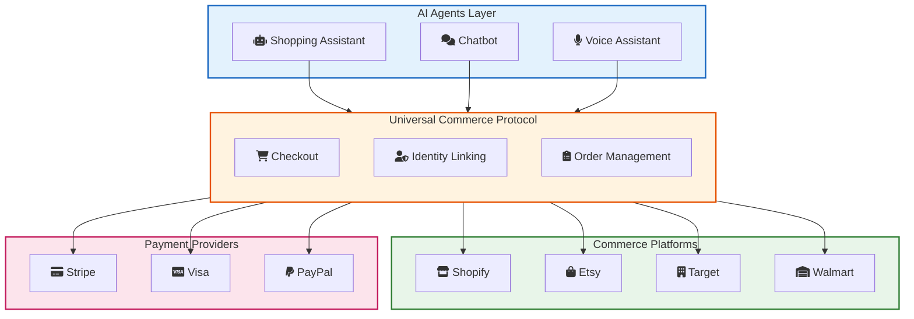
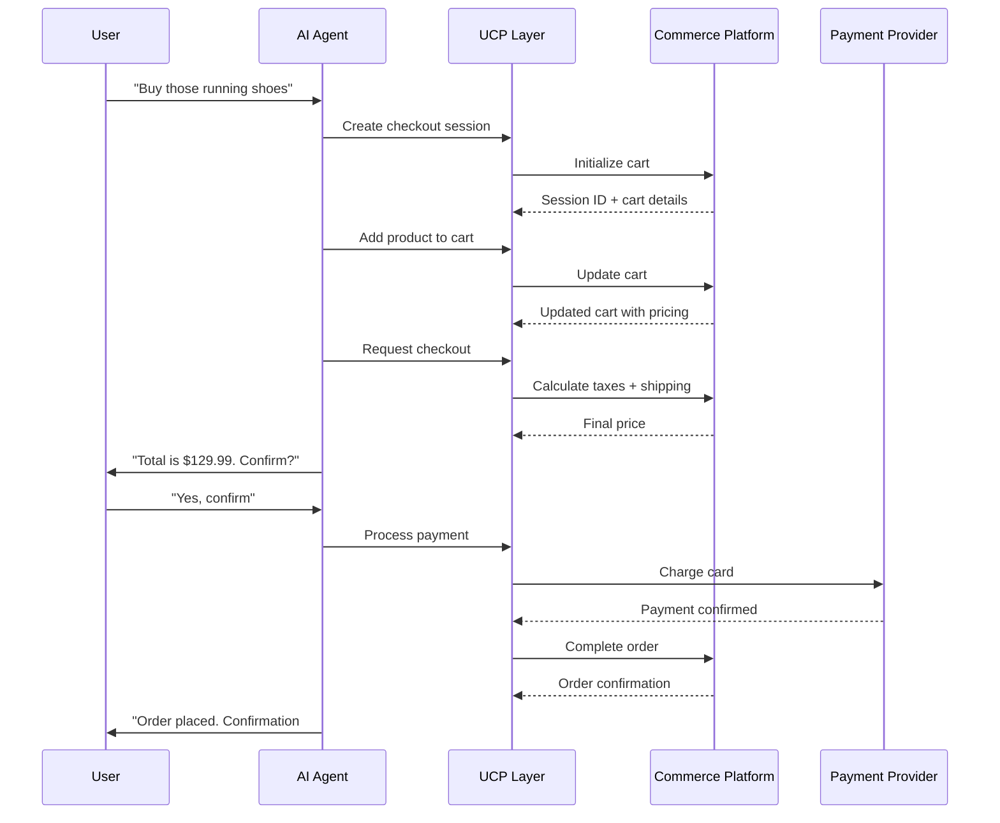
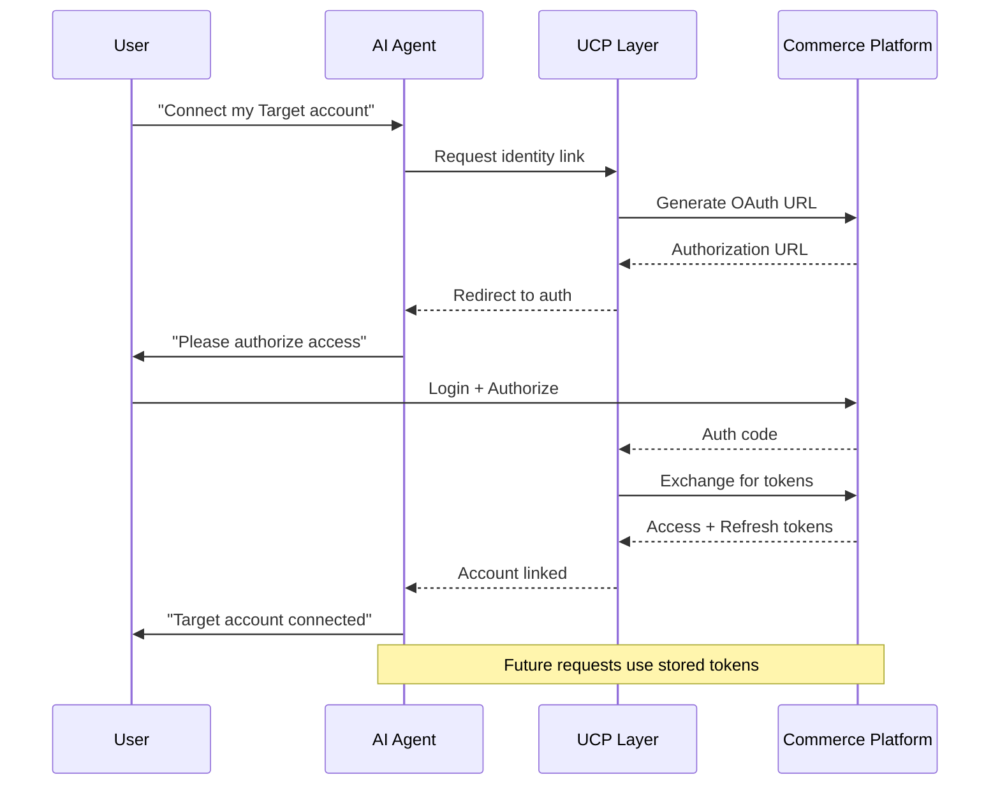
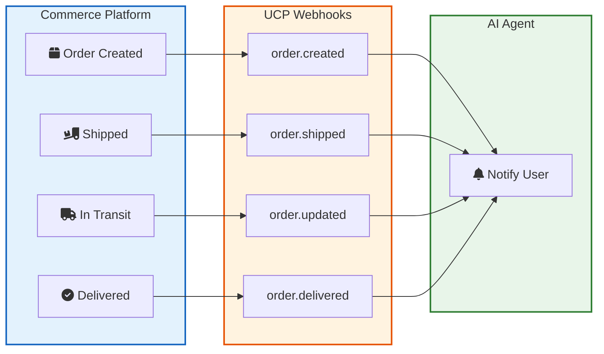
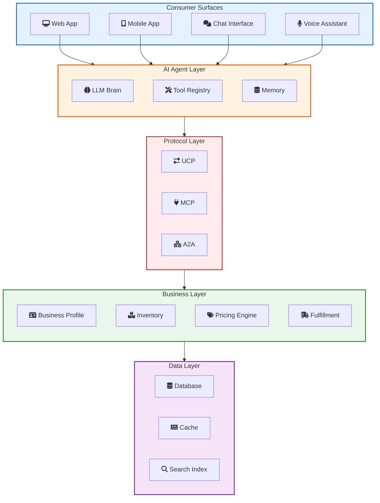
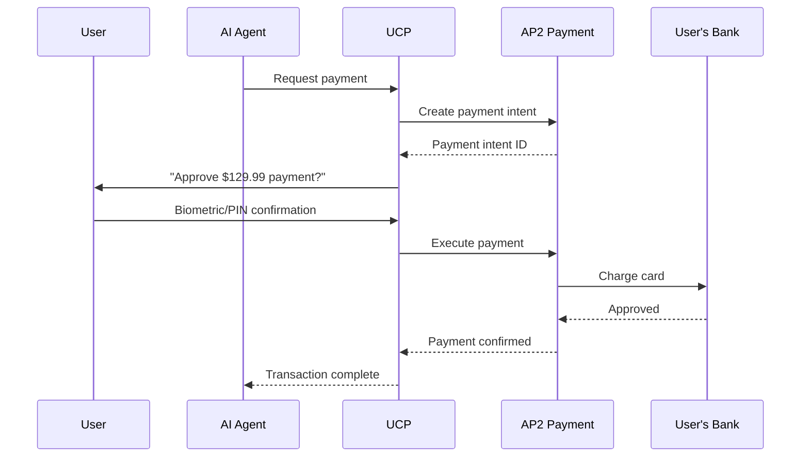

Last week, Google announced Universal Commerce Protocol (UCP) at the NRF 2026 conference. Shopify, Etsy, Wayfair, Target, and Walmart are all on board. If you build ecommerce applications or work with AI agents, this matters.

Here is what UCP actually is, why it exists, and how to integrate it into your systems.

> **TL;DR**: UCP is an open standard that lets AI agents shop on behalf of users. It standardizes checkout, identity linking, and order management across platforms. Built on REST and OAuth 2.0. Works with existing AI protocols like MCP and A2A. If you build ecommerce, you should start planning for this now.

## The Problem UCP Solves

Right now, AI shopping is a mess.

Imagine you are building an AI assistant that helps users buy products. You want it to search for running shoes, compare prices, and complete the purchase. Sounds simple until you realize every store works differently.

| Store | API Style | Auth Method | Checkout Flow |
|-------|-----------|-------------|---------------|
| Shopify | GraphQL | OAuth 2.0 | Storefront API |
| Magento | REST | Token | Custom checkout |
| WooCommerce | REST | Basic Auth | Plugin dependent |
| Custom stores | Varies | Varies | All different |

Your AI agent needs custom code for each platform. When Shopify changes their API, you update your integration. When a new platform becomes popular, you build another integration from scratch.

This is the same problem we had with payment processing before Stripe. Everyone reinvented the wheel.

UCP fixes this by creating a single standard that all platforms can implement.

## How UCP Works

UCP sits between AI agents and commerce platforms. It defines a common language for shopping interactions.



The key insight: AI agents only need to speak UCP. They do not need to know the specifics of each platform.

## Core Capabilities

UCP defines three core capabilities that every implementation must support.

### <i class="fas fa-shopping-cart"></i> Checkout

The checkout capability handles everything from cart management to payment processing.



What the checkout capability handles:
- Cart creation and management
- Dynamic pricing and discounts
- Tax calculations
- Shipping options
- Payment processing
- Order confirmation

The beauty is that the AI agent does not need to understand how Shopify calculates taxes versus how Target does it. UCP abstracts that complexity away.

### <i class="fas fa-user-shield"></i> Identity Linking

Before an AI agent can make purchases, it needs permission. Identity Linking uses OAuth 2.0 to securely connect user accounts.



Why this matters:
- Users control which stores their AI can access
- No sharing of passwords
- Tokens can be revoked anytime
- Supports granular permissions (read orders vs. make purchases)

### <i class="fas fa-clipboard-list"></i> Order Management

After a purchase, users want updates. Order Management provides real-time status through webhooks.



Order Management capabilities:
- Real-time order status updates
- Shipment tracking
- Return and refund processing
- Order history retrieval
- Cancellation handling

## Extensions: Going Beyond the Basics

Core capabilities cover the basics. Extensions add specialized functionality.

| Extension | Purpose | Example |
|-----------|---------|---------|
| Discounts | Apply coupons and promotions | "Apply code SAVE20" |
| Loyalty | Handle rewards programs | "Use my Target Circle points" |
| Subscriptions | Recurring purchases | "Reorder every month" |
| Gift Cards | Payment with store credit | "Pay with my $50 gift card" |
| AP2 Mandates | Pre-authorized payments | "Buy when price drops below $100" |

Extensions are optional. A basic UCP implementation only needs the three core capabilities. But if you want to support loyalty programs or subscription commerce, extensions provide the standard way to do it.

## The Architecture: How It All Fits Together

Let me show you the full picture of how UCP integrates with existing systems.



### Transport Protocols

UCP is transport-agnostic. It works over:

**REST API**: The default. Standard HTTP requests with JSON payloads.

```json
POST /ucp/v1/checkout/sessions
Content-Type: application/json
Authorization: Bearer <token>

{
  "cart": {
    "items": [
      {
        "product_id": "shoe-123",
        "quantity": 1,
        "variant_id": "size-10"
      }
    ]
  },
  "currency": "USD"
}
```

**Model Context Protocol (MCP)**: For AI systems that already use Anthropic's MCP standard. UCP capabilities become MCP tools.

**Agent2Agent (A2A)**: For multi-agent systems where AI agents communicate with each other.

If you have already built [AI agents using MCP](/explainer/mcp-explained/), adding UCP support is straightforward. Your existing tools can call UCP endpoints.

## Integrating UCP: A Developer Guide

Here is how to add UCP support to your ecommerce platform.

### Step 1: Implement the Profile Endpoint

The profile endpoint tells AI agents what your business supports.

```json
GET /ucp/v1/profile

{
  "business": {
    "name": "Acme Shoes",
    "description": "Premium running shoes",
    "supported_currencies": ["USD", "EUR", "GBP"],
    "supported_countries": ["US", "CA", "UK", "DE"]
  },
  "capabilities": [
    {
      "name": "checkout",
      "version": "1.0",
      "endpoint": "/ucp/v1/checkout"
    },
    {
      "name": "identity_linking",
      "version": "1.0",
      "endpoint": "/ucp/v1/identity"
    },
    {
      "name": "order_management",
      "version": "1.0",
      "endpoint": "/ucp/v1/orders"
    }
  ],
  "extensions": [
    {
      "name": "discounts",
      "version": "1.0"
    }
  ],
  "payment_methods": [
    "card",
    "paypal",
    "apple_pay",
    "google_pay"
  ]
}
```

AI agents query this endpoint to discover what your store can do.

### Step 2: Implement Checkout Sessions

The checkout capability requires these endpoints:

```
POST   /ucp/v1/checkout/sessions      # Create session
GET    /ucp/v1/checkout/sessions/:id  # Get session
PATCH  /ucp/v1/checkout/sessions/:id  # Update cart
POST   /ucp/v1/checkout/sessions/:id/complete  # Complete purchase
DELETE /ucp/v1/checkout/sessions/:id  # Cancel
```

Here is a simplified implementation:

```python
from flask import Flask, request, jsonify
from dataclasses import dataclass
from typing import List, Optional
import uuid

app = Flask(__name__)

@dataclass
class CartItem:
    product_id: str
    variant_id: str
    quantity: int
    price: float
    
@dataclass
class CheckoutSession:
    id: str
    status: str  # "open", "complete", "cancelled"
    items: List[CartItem]
    subtotal: float
    tax: float
    shipping: float
    total: float
    currency: str

# In-memory store (use a real database in production)
sessions = {}

@app.route('/ucp/v1/checkout/sessions', methods=['POST'])
def create_session():
    data = request.json
    session_id = str(uuid.uuid4())
    
    session = CheckoutSession(
        id=session_id,
        status="open",
        items=[],
        subtotal=0,
        tax=0,
        shipping=0,
        total=0,
        currency=data.get('currency', 'USD')
    )
    
    sessions[session_id] = session
    
    return jsonify({
        "session_id": session_id,
        "status": "open",
        "expires_at": "2026-01-12T12:00:00Z"
    }), 201

@app.route('/ucp/v1/checkout/sessions/<session_id>', methods=['PATCH'])
def update_session(session_id):
    if session_id not in sessions:
        return jsonify({"error": "Session not found"}), 404
    
    session = sessions[session_id]
    data = request.json
    
    # Add items to cart
    if 'add_items' in data:
        for item_data in data['add_items']:
            # Fetch product details and validate
            product = get_product(item_data['product_id'])
            
            item = CartItem(
                product_id=item_data['product_id'],
                variant_id=item_data.get('variant_id'),
                quantity=item_data['quantity'],
                price=product['price']
            )
            session.items.append(item)
    
    # Recalculate totals
    session.subtotal = sum(item.price * item.quantity for item in session.items)
    session.tax = calculate_tax(session.subtotal, data.get('shipping_address'))
    session.shipping = calculate_shipping(session.items, data.get('shipping_address'))
    session.total = session.subtotal + session.tax + session.shipping
    
    return jsonify({
        "session_id": session_id,
        "items": [vars(item) for item in session.items],
        "subtotal": session.subtotal,
        "tax": session.tax,
        "shipping": session.shipping,
        "total": session.total,
        "currency": session.currency
    })

@app.route('/ucp/v1/checkout/sessions/<session_id>/complete', methods=['POST'])
def complete_session(session_id):
    if session_id not in sessions:
        return jsonify({"error": "Session not found"}), 404
    
    session = sessions[session_id]
    data = request.json
    
    # Process payment
    payment_result = process_payment(
        amount=session.total,
        currency=session.currency,
        payment_method=data['payment_method']
    )
    
    if not payment_result['success']:
        return jsonify({"error": "Payment failed"}), 400
    
    # Create order
    order = create_order(session, payment_result)
    
    session.status = "complete"
    
    return jsonify({
        "order_id": order['id'],
        "status": "confirmed",
        "confirmation_number": order['confirmation_number'],
        "estimated_delivery": order['estimated_delivery']
    })
```

### Step 3: Set Up Identity Linking

Use OAuth 2.0 for account linking. If you already support OAuth for third-party apps, this is familiar territory.

```python
@app.route('/ucp/v1/identity/authorize', methods=['GET'])
def authorize():
    """Generate OAuth authorization URL"""
    client_id = request.args.get('client_id')
    redirect_uri = request.args.get('redirect_uri')
    scope = request.args.get('scope', 'read_orders write_checkout')
    state = request.args.get('state')
    
    # Validate client and redirect URI
    if not validate_client(client_id, redirect_uri):
        return jsonify({"error": "Invalid client"}), 400
    
    # Generate authorization URL
    auth_code = generate_auth_code(client_id, scope)
    
    return jsonify({
        "authorization_url": f"https://yourstore.com/oauth/authorize?code={auth_code}&state={state}"
    })

@app.route('/ucp/v1/identity/token', methods=['POST'])
def token():
    """Exchange authorization code for tokens"""
    data = request.json
    
    if data.get('grant_type') == 'authorization_code':
        # Validate auth code
        auth_data = validate_auth_code(data['code'])
        if not auth_data:
            return jsonify({"error": "Invalid code"}), 400
        
        # Generate tokens
        access_token = generate_access_token(auth_data)
        refresh_token = generate_refresh_token(auth_data)
        
        return jsonify({
            "access_token": access_token,
            "refresh_token": refresh_token,
            "token_type": "Bearer",
            "expires_in": 3600,
            "scope": auth_data['scope']
        })
    
    elif data.get('grant_type') == 'refresh_token':
        # Refresh the access token
        new_access_token = refresh_access_token(data['refresh_token'])
        
        return jsonify({
            "access_token": new_access_token,
            "token_type": "Bearer",
            "expires_in": 3600
        })
```

### Step 4: Implement Order Webhooks

Send updates when order status changes.

```python
import requests
from datetime import datetime

def send_order_webhook(order, event_type):
    """Send webhook notification to registered AI agents"""
    
    webhook_payload = {
        "event": event_type,
        "timestamp": datetime.utcnow().isoformat(),
        "order": {
            "id": order.id,
            "status": order.status,
            "tracking_number": order.tracking_number,
            "tracking_url": order.tracking_url,
            "estimated_delivery": order.estimated_delivery,
            "items": [
                {
                    "product_id": item.product_id,
                    "title": item.title,
                    "quantity": item.quantity
                }
                for item in order.items
            ]
        }
    }
    
    # Get all registered webhooks for this merchant
    webhooks = get_registered_webhooks(order.merchant_id, event_type)
    
    for webhook in webhooks:
        try:
            response = requests.post(
                webhook.url,
                json=webhook_payload,
                headers={
                    "Content-Type": "application/json",
                    "X-UCP-Signature": sign_payload(webhook_payload, webhook.secret)
                },
                timeout=10
            )
            
            log_webhook_delivery(webhook.id, response.status_code)
            
        except Exception as e:
            log_webhook_failure(webhook.id, str(e))

# Webhook event types
WEBHOOK_EVENTS = [
    "order.created",
    "order.confirmed",
    "order.shipped",
    "order.out_for_delivery",
    "order.delivered",
    "order.cancelled",
    "order.refunded"
]
```

## Security Considerations

UCP handles real money. Security is not optional.

### Payment Security with AP2

Agent Payments Protocol (AP2) ensures safe transactions.



Key security features:
- **Explicit user consent**: No purchases without confirmation
- **Biometric authentication**: Fingerprint or face ID for mobile
- **Amount limits**: Cap how much agents can spend
- **Merchant verification**: Only approved merchants can receive payments

### Token Management

```python
# Good: Short-lived tokens with refresh
ACCESS_TOKEN_EXPIRY = 3600  # 1 hour
REFRESH_TOKEN_EXPIRY = 86400 * 30  # 30 days

# Good: Scope limitations
SCOPES = {
    "read_products": "View product catalog",
    "read_orders": "View order history",
    "write_checkout": "Create and complete purchases",
    "manage_returns": "Process returns and refunds"
}

# Good: Token revocation
def revoke_token(token):
    """Allow users to disconnect AI agents anytime"""
    token_data = decode_token(token)
    add_to_revocation_list(token_data['jti'])
    return True
```

### Rate Limiting

Protect your endpoints from abuse.

```python
from functools import wraps
from flask import request, jsonify
import time

# Simple rate limiter
rate_limits = {}

def rate_limit(max_requests=100, window=60):
    def decorator(f):
        @wraps(f)
        def wrapped(*args, **kwargs):
            client_id = request.headers.get('X-Client-ID')
            key = f"{client_id}:{f.__name__}"
            
            now = time.time()
            window_start = now - window
            
            # Clean old entries
            rate_limits[key] = [
                t for t in rate_limits.get(key, [])
                if t > window_start
            ]
            
            if len(rate_limits.get(key, [])) >= max_requests:
                return jsonify({
                    "error": "Rate limit exceeded",
                    "retry_after": window
                }), 429
            
            rate_limits.setdefault(key, []).append(now)
            return f(*args, **kwargs)
        return wrapped
    return decorator

@app.route('/ucp/v1/checkout/sessions', methods=['POST'])
@rate_limit(max_requests=50, window=60)
def create_session():
    # ... implementation
    pass
```

## Real World Example: Building a Shopping Agent

Let me show you how an AI agent uses UCP in practice.

```python
import openai
from ucp_client import UCPClient

# Initialize UCP client
ucp = UCPClient(
    base_url="https://store.example.com/ucp/v1",
    access_token="user_access_token"
)

# Define tools for the AI agent
tools = [
    {
        "type": "function",
        "function": {
            "name": "search_products",
            "description": "Search for products by query",
            "parameters": {
                "type": "object",
                "properties": {
                    "query": {"type": "string"},
                    "category": {"type": "string"},
                    "max_price": {"type": "number"}
                },
                "required": ["query"]
            }
        }
    },
    {
        "type": "function",
        "function": {
            "name": "add_to_cart",
            "description": "Add a product to the shopping cart",
            "parameters": {
                "type": "object",
                "properties": {
                    "product_id": {"type": "string"},
                    "quantity": {"type": "integer"}
                },
                "required": ["product_id"]
            }
        }
    },
    {
        "type": "function",
        "function": {
            "name": "checkout",
            "description": "Complete the purchase",
            "parameters": {
                "type": "object",
                "properties": {
                    "confirm": {"type": "boolean"}
                },
                "required": ["confirm"]
            }
        }
    }
]

def search_products(query, category=None, max_price=None):
    """Search products via UCP"""
    products = ucp.products.search(
        query=query,
        category=category,
        max_price=max_price
    )
    return products

def add_to_cart(product_id, quantity=1):
    """Add item to cart via UCP"""
    if not hasattr(ucp, 'current_session'):
        ucp.current_session = ucp.checkout.create_session()
    
    ucp.checkout.add_item(
        session_id=ucp.current_session['id'],
        product_id=product_id,
        quantity=quantity
    )
    
    return ucp.checkout.get_session(ucp.current_session['id'])

def checkout(confirm):
    """Complete purchase via UCP"""
    if not confirm:
        return {"status": "cancelled", "message": "User did not confirm"}
    
    # Get user's saved payment method
    payment_method = ucp.identity.get_default_payment_method()
    
    # Complete the order
    result = ucp.checkout.complete(
        session_id=ucp.current_session['id'],
        payment_method=payment_method
    )
    
    return result

# Agent loop
def run_shopping_agent(user_request):
    messages = [
        {"role": "system", "content": """You are a shopping assistant. 
        Help users find and purchase products. Always confirm before checkout.
        Be concise and helpful."""},
        {"role": "user", "content": user_request}
    ]
    
    while True:
        response = openai.chat.completions.create(
            model="gpt-4o",
            messages=messages,
            tools=tools,
            tool_choice="auto"
        )
        
        message = response.choices[0].message
        
        if message.tool_calls:
            for tool_call in message.tool_calls:
                func_name = tool_call.function.name
                args = json.loads(tool_call.function.arguments)
                
                # Execute the function
                if func_name == "search_products":
                    result = search_products(**args)
                elif func_name == "add_to_cart":
                    result = add_to_cart(**args)
                elif func_name == "checkout":
                    result = checkout(**args)
                
                messages.append({
                    "role": "tool",
                    "tool_call_id": tool_call.id,
                    "content": json.dumps(result)
                })
        else:
            return message.content

# Example usage
response = run_shopping_agent("Find me running shoes under $150 and add the best one to cart")
print(response)
```

## Comparing UCP to Existing Standards

How does UCP fit with other protocols you might already use?

| Protocol | Purpose | UCP Relationship |
|----------|---------|------------------|
| MCP | Connect LLMs to tools | UCP capabilities can be MCP tools |
| A2A | Agent-to-agent communication | UCP supports A2A transport |
| OpenAPI | API specification | UCP uses REST with OpenAPI specs |
| OAuth 2.0 | Authorization | UCP uses OAuth for identity linking |
| Stripe Connect | Payment processing | UCP can use Stripe as payment provider |

If you already use MCP for your [AI agent architecture](/building-ai-agents/), adding UCP is straightforward. UCP capabilities become MCP tools:

```python
# MCP server exposing UCP capabilities as tools
from mcp import Server

server = Server()

@server.tool
def ucp_search_products(query: str, max_price: float = None):
    """Search products on connected stores via UCP"""
    return ucp_client.search(query, max_price=max_price)

@server.tool
def ucp_create_checkout(product_id: str, quantity: int):
    """Create a checkout session via UCP"""
    session = ucp_client.checkout.create_session()
    ucp_client.checkout.add_item(session['id'], product_id, quantity)
    return session

@server.tool
def ucp_complete_purchase(session_id: str, confirm: bool):
    """Complete a purchase via UCP (requires user confirmation)"""
    if not confirm:
        return {"error": "User must confirm purchase"}
    return ucp_client.checkout.complete(session_id)
```

## What This Means for Developers

If you work in ecommerce, here is what you should be thinking about.

### For Ecommerce Platforms

**Start planning now.** Even if UCP is new, the direction is clear. AI-driven shopping is coming. Platforms that support UCP will be where AI agents send their users.

**Begin with the basics.** Implement the three core capabilities: Checkout, Identity Linking, and Order Management. Extensions can come later.

**Secure everything.** AI agents will be making real purchases. Your security has to be bulletproof.

### For AI Agent Developers

**UCP simplifies your life.** Instead of building integrations for every platform, you build one integration with UCP.

**Focus on user experience.** The protocol handles the plumbing. You can focus on making shopping actually helpful.

**Test thoroughly.** Money is involved. Test your checkout flows extensively before going live.

### For Business Owners

**Early adoption matters.** Stores that support UCP will be accessible to AI assistants. Those that do not will be invisible.

**Keep control.** UCP is designed so you keep control of your business rules, pricing, and customer relationships. The AI agent is just another channel.

## Key Takeaways

1. **UCP standardizes AI shopping.** One protocol instead of dozens of custom integrations.

2. **Three core capabilities.** Checkout, Identity Linking, and Order Management cover the shopping lifecycle.

3. **Built on proven standards.** REST APIs, OAuth 2.0, and webhooks. Nothing exotic.

4. **Compatible with existing protocols.** Works alongside MCP and A2A for AI systems.

5. **Security is built in.** AP2 for payments, OAuth for identity, explicit user consent for purchases.

6. **Big players are on board.** Google, Shopify, Walmart, Target, Etsy, and Wayfair from day one.

7. **Open and extensible.** Anyone can implement UCP. Extensions add specialized functionality.

8. **The future of shopping.** AI agents will increasingly handle purchases. UCP makes that possible at scale.

---

**Further Reading:**

- [UCP Official Documentation](https://ucp.dev/) - Technical specifications and SDKs
- [How to Build AI Agents](/building-ai-agents/) - Learn the fundamentals of AI agent architecture
- [MCP Explained](/explainer/mcp-explained/) - Understanding Model Context Protocol
- [Shopify System Design](/shopify-system-design/) - How Shopify architected their platform (and why they joined UCP)
- [Google Developers Blog on UCP](https://developers.googleblog.com/under-the-hood-universal-commerce-protocol-ucp/) - Technical deep dive from Google

*Building AI agents that need to interact with commerce platforms? UCP is the protocol you will want to know. Start experimenting with the [UCP GitHub repository](https://github.com/anthropics/ucp) today.*
