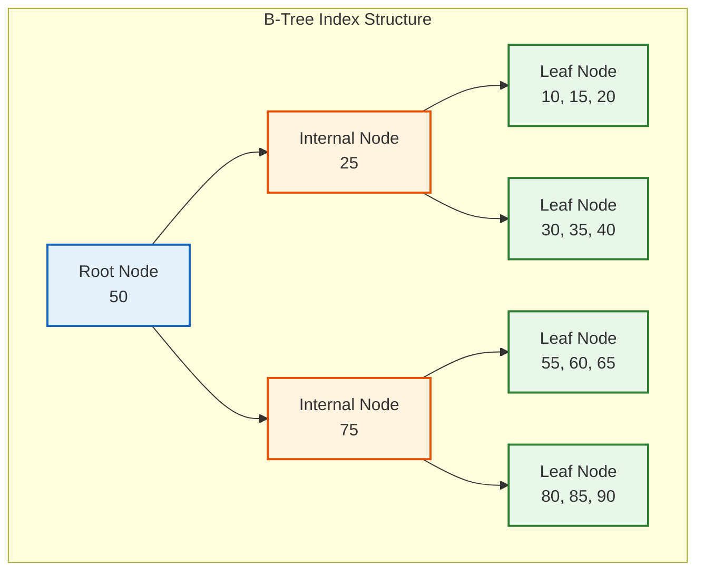
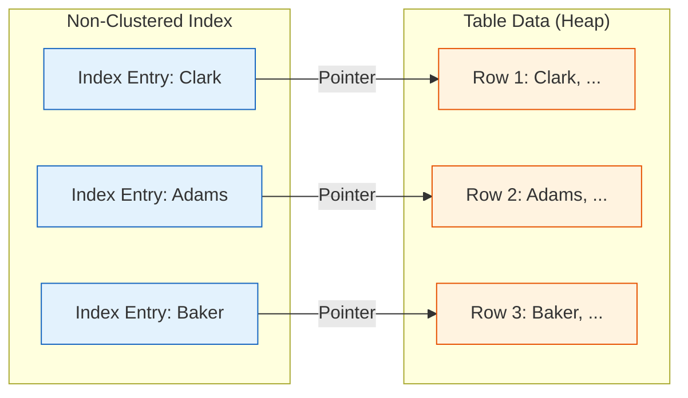

Your application is slow. Users are complaining. You run a query and it takes 8 seconds. The table has 10 million rows, and your WHERE clause is filtering on a column with no index.

You add an index. The same query now takes 15 milliseconds.

That is the power of database indexing. But knowing that indexes make things faster is not enough. You need to understand how they work, when to use them, and when they can actually hurt performance.

This guide covers everything a software developer needs to know about database indexing. No fluff. Just the practical stuff that will help you build faster applications.

> **TL;DR**: Database indexes are data structures (usually B-trees) that speed up data retrieval by avoiding full table scans. Use indexes on columns in WHERE, JOIN, and ORDER BY clauses. Composite indexes must follow the leftmost prefix rule. Too many indexes slow down writes. Use EXPLAIN to verify your queries are using indexes correctly.

## What is a Database Index?

Think of a database index like the index at the back of a textbook. If you want to find information about "B-trees", you do not read the entire book. You go to the index, find "B-trees", and it tells you the exact page numbers.

A database index works the same way. Instead of scanning every row in a table to find matching data, the database looks up the value in the index and jumps directly to the relevant rows.

| Without Index | With Index |
|---------------|------------|
| Scan all 10 million rows | Look up value in index |
| O(n) time complexity | O(log n) time complexity |
| 8 seconds | 15 milliseconds |

The difference is dramatic, especially as tables grow larger.

## How Indexes Work: The B-Tree

Most database indexes use a B-tree (balanced tree) data structure. Understanding B-trees helps you understand why indexes behave the way they do.

### <i class="fas fa-sitemap"></i> B-Tree Structure

A B-tree organizes data in a hierarchical structure:



**Root Node**: The starting point. Contains keys that divide the data into ranges.

**Internal Nodes**: Guide the search by pointing to child nodes based on key comparisons.

**Leaf Nodes**: Contain the actual indexed values and pointers to the table rows.

### How a Lookup Works

When you search for a value, the database:

1. Starts at the root node
2. Compares your search value with the keys
3. Follows the appropriate pointer to the next level
4. Repeats until reaching a leaf node
5. Uses the pointer in the leaf node to fetch the actual row

For a table with 10 million rows, a B-tree index typically has 3 to 4 levels. That means finding any row requires only 3 to 4 comparisons instead of 10 million.

### Why B-Trees Are Efficient

| Metric | Full Table Scan | B-Tree Index |
|--------|-----------------|--------------|
| Time Complexity | O(n) | O(log n) |
| 1,000 rows | 1,000 comparisons | ~10 comparisons |
| 1,000,000 rows | 1,000,000 comparisons | ~20 comparisons |
| 10,000,000 rows | 10,000,000 comparisons | ~24 comparisons |

The logarithmic scaling is what makes indexes so powerful for large tables.

## Types of Indexes

Different types of indexes serve different purposes. Here is what you need to know about each.

### <i class="fas fa-database"></i> Single Column Index

The simplest type. One index on one column.

```sql
CREATE INDEX idx_users_email ON users(email);
```

**Best for**: Queries that filter on a single column.

```sql
SELECT * FROM users WHERE email = 'john@example.com';
```

### <i class="fas fa-layer-group"></i> Composite Index (Multi-Column)

An index on multiple columns. Column order matters.

```sql
CREATE INDEX idx_orders_customer_date ON orders(customer_id, order_date);
```

**Best for**: Queries that filter on multiple columns together.

```sql
-- Uses the index
SELECT * FROM orders WHERE customer_id = 123 AND order_date > '2025-01-01';

-- Also uses the index (leftmost prefix)
SELECT * FROM orders WHERE customer_id = 123;

-- Does NOT use the index efficiently
SELECT * FROM orders WHERE order_date > '2025-01-01';
```

This is called the **leftmost prefix rule**. A composite index on (A, B, C) can be used for:
- Queries on A
- Queries on A and B
- Queries on A, B, and C
- But NOT queries on just B or just C

### <i class="fas fa-fingerprint"></i> Unique Index

Ensures all values in the column are unique. Also provides fast lookups.

```sql
CREATE UNIQUE INDEX idx_users_email ON users(email);
```

**Best for**: Columns that must have unique values (email, username, etc.). Primary keys automatically get a unique index.

### <i class="fas fa-sort-amount-down"></i> Clustered Index

A clustered index determines the physical order of data in the table. There can only be one per table because data can only be sorted one way.

In MySQL InnoDB, the primary key is always the clustered index. In PostgreSQL, you can specify a clustered index explicitly, but the data is not automatically maintained in that order.

**Best for**: Range queries on the clustered column, because physically adjacent rows can be read together.

### <i class="fas fa-link"></i> Non-Clustered Index

A non-clustered index is a separate structure that points to the actual data rows. You can have many non-clustered indexes per table.



The index entries are sorted alphabetically, but they point to rows in the table that are stored in a different order.

### <i class="fas fa-book-open"></i> Covering Index

A covering index includes all columns needed by a query. The database can return results directly from the index without accessing the table.

```sql
-- PostgreSQL
CREATE INDEX idx_orders_covering 
ON orders(customer_id) 
INCLUDE (order_date, total_amount);

-- MySQL (include all columns in the index)
CREATE INDEX idx_orders_covering 
ON orders(customer_id, order_date, total_amount);
```

Now this query can be satisfied entirely from the index:

```sql
SELECT order_date, total_amount 
FROM orders 
WHERE customer_id = 123;
```

**Best for**: Read-heavy queries where you want to eliminate the table lookup entirely.

### <i class="fas fa-filter"></i> Partial Index

A partial index only includes rows that match a condition. This creates a smaller, more efficient index.

```sql
-- PostgreSQL
CREATE INDEX idx_active_users ON users(email) WHERE active = true;

-- Only indexes active users
```

**Best for**: When you only query a subset of the data (active records, recent orders, etc.).

### <i class="fas fa-search"></i> Full-Text Index

Designed for searching text content. Supports natural language queries, stemming, and relevance ranking.

```sql
-- PostgreSQL
CREATE INDEX idx_articles_content ON articles USING gin(to_tsvector('english', content));

-- MySQL
CREATE FULLTEXT INDEX idx_articles_content ON articles(content);
```

**Best for**: Search functionality where users search for words or phrases in text columns.

### <i class="fas fa-hashtag"></i> Hash Index

Uses a hash function for exact equality lookups. Very fast for equality but cannot handle range queries.

```sql
-- PostgreSQL
CREATE INDEX idx_users_id ON users USING hash(id);
```

**Best for**: Exact match lookups where you never need range queries. However, B-tree is usually preferred because it is more versatile.

## Clustered vs Non-Clustered: A Deeper Look

This distinction confuses many developers. The key difference is where the actual data lives.

### Clustered Index

With a clustered index, the data is stored directly in the index leaf nodes. The index IS the table.


One lookup. Data is found directly at the leaf node.

### Non-Clustered Index

With a non-clustered index, the leaf nodes contain pointers to the actual data. You need an extra lookup.


Two lookups. First find the pointer in the non-clustered index, then follow it to get the actual data.

**Clustered Index**: The index IS the table. Data rows are stored in index order. When you search by the clustered index key, you find the data directly.

**Non-Clustered Index**: A separate structure. Contains index keys plus pointers back to the clustered index (or row location). Searching requires two steps: find the pointer in the non-clustered index, then look up the actual row.

| Feature | Clustered | Non-Clustered |
|---------|-----------|---------------|
| Number per table | 1 | Many |
| Data storage | Index contains data | Index contains pointers |
| Range queries | Very efficient | Requires lookups |
| Insert performance | Slower (data must be ordered) | Faster |

## Analyzing Query Performance with EXPLAIN

Before adding indexes, you need to understand how your queries execute. The EXPLAIN command shows the query execution plan.

### MySQL EXPLAIN

```sql
EXPLAIN SELECT * FROM orders WHERE customer_id = 123;
```

Output:
```
+----+-------------+--------+------+---------------+------+---------+------+-------+-------------+
| id | select_type | table  | type | possible_keys | key  | key_len | ref  | rows  | Extra       |
+----+-------------+--------+------+---------------+------+---------+------+-------+-------------+
|  1 | SIMPLE      | orders | ALL  | NULL          | NULL | NULL    | NULL | 50000 | Using where |
+----+-------------+--------+------+---------------+------+---------+------+-------+-------------+
```

**Red flags**:
- `type: ALL` means full table scan
- `key: NULL` means no index is being used
- `rows: 50000` means scanning all rows

After adding an index:

```sql
CREATE INDEX idx_orders_customer ON orders(customer_id);
EXPLAIN SELECT * FROM orders WHERE customer_id = 123;
```

```
+----+-------------+--------+------+---------------------+---------------------+---------+-------+------+-------+
| id | select_type | table  | type | possible_keys       | key                 | key_len | ref   | rows | Extra |
+----+-------------+--------+------+---------------------+---------------------+---------+-------+------+-------+
|  1 | SIMPLE      | orders | ref  | idx_orders_customer | idx_orders_customer | 4       | const |   50 |       |
+----+-------------+--------+------+---------------------+---------------------+---------+-------+------+-------+
```

Now it is scanning only 50 rows instead of 50,000.

### PostgreSQL EXPLAIN ANALYZE

PostgreSQL's EXPLAIN ANALYZE actually runs the query and shows real execution times.

```sql
EXPLAIN ANALYZE SELECT * FROM orders WHERE customer_id = 123;
```

```
Seq Scan on orders  (cost=0.00..1234.00 rows=50000 width=100) (actual time=0.015..45.123 rows=50000 loops=1)
  Filter: (customer_id = 123)
Planning Time: 0.085 ms
Execution Time: 52.456 ms
```

After adding an index:

```
Index Scan using idx_orders_customer on orders  (cost=0.29..8.31 rows=50 width=100) (actual time=0.025..0.089 rows=50 loops=1)
  Index Cond: (customer_id = 123)
Planning Time: 0.102 ms
Execution Time: 0.112 ms
```

Execution time dropped from 52ms to 0.1ms.

## Indexing Best Practices

### <i class="fas fa-check-circle" style="color: #28a745;"></i> Do Index These Columns

1. **Columns in WHERE clauses** that filter large tables
2. **Columns in JOIN conditions** (especially foreign keys)
3. **Columns in ORDER BY** for sorted results
4. **Columns with high selectivity** (many unique values)

### <i class="fas fa-times-circle" style="color: #dc3545;"></i> Avoid Indexing These

1. **Small tables** (full scan is fast enough)
2. **Low selectivity columns** (boolean, status with few values)
3. **Frequently updated columns** (index maintenance overhead)
4. **Columns rarely used in queries**

### <i class="fas fa-exclamation-triangle" style="color: #ffc107;"></i> Watch Out For

**Function calls on indexed columns**:

```sql
-- BAD: Index on created_at will NOT be used
SELECT * FROM orders WHERE YEAR(created_at) = 2025;

-- GOOD: Index on created_at WILL be used
SELECT * FROM orders 
WHERE created_at >= '2025-01-01' AND created_at < '2026-01-01';
```

**Implicit type conversions**:

```sql
-- BAD: If user_id is INT but you pass a string
SELECT * FROM users WHERE user_id = '123';

-- GOOD: Match the type
SELECT * FROM users WHERE user_id = 123;
```

**Leading wildcards**:

```sql
-- BAD: Index cannot be used
SELECT * FROM users WHERE email LIKE '%@gmail.com';

-- GOOD: Index can be used
SELECT * FROM users WHERE email LIKE 'john%';
```

## Common Indexing Mistakes

### Mistake 1: Over-Indexing

Every index:
- Consumes storage space
- Slows down INSERT, UPDATE, DELETE operations
- Requires maintenance

**Solution**: Only create indexes that actually improve query performance. Monitor index usage and drop unused indexes.

```sql
-- PostgreSQL: Find unused indexes
SELECT schemaname, tablename, indexname, idx_scan
FROM pg_stat_user_indexes
WHERE idx_scan = 0;
```

### Mistake 2: Wrong Column Order in Composite Indexes

```sql
-- You create this index
CREATE INDEX idx_orders ON orders(order_date, customer_id);

-- But your query filters like this
SELECT * FROM orders WHERE customer_id = 123;
-- Index is NOT efficiently used because customer_id is not first
```

**Solution**: Put the most selective column first, or the column most commonly used alone.

### Mistake 3: Not Indexing Foreign Keys

Foreign keys without indexes cause slow joins and cascade operations.

```sql
-- Orders table has customer_id foreign key
-- Without an index, joining orders to customers scans all orders
CREATE INDEX idx_orders_customer_id ON orders(customer_id);
```

### Mistake 4: Ignoring Index Maintenance

Over time, indexes become fragmented as data is inserted, updated, and deleted.

```sql
-- PostgreSQL: Rebuild an index
REINDEX INDEX idx_orders_customer_id;

-- PostgreSQL: Rebuild all indexes on a table
REINDEX TABLE orders;
```

### Mistake 5: Duplicate Indexes

Having multiple indexes that cover the same queries wastes space.

```sql
-- These are redundant if you have both
CREATE INDEX idx_customer ON orders(customer_id);
CREATE INDEX idx_customer_date ON orders(customer_id, order_date);
-- The second index can handle all queries the first index handles
```

## Real-World Example: Optimizing a Slow Query

Let me walk through optimizing an actual slow query.

**The Problem**: An e-commerce dashboard query takes 12 seconds.

```sql
SELECT o.id, o.order_date, o.total, c.name, c.email
FROM orders o
JOIN customers c ON o.customer_id = c.id
WHERE o.status = 'completed'
  AND o.order_date > '2025-01-01'
ORDER BY o.order_date DESC
LIMIT 100;
```

**Step 1: Check the execution plan**

```sql
EXPLAIN ANALYZE ...
```

Result shows:
- Sequential scan on orders (2 million rows)
- No indexes being used
- 12 seconds execution time

**Step 2: Identify what needs indexing**

The query filters on:
- `status` (low cardinality, but combined with date)
- `order_date` (high cardinality)
- `customer_id` (for the join)

**Step 3: Create appropriate indexes**

```sql
-- Composite index for the WHERE clause
CREATE INDEX idx_orders_status_date ON orders(status, order_date DESC);

-- Index on foreign key
CREATE INDEX idx_orders_customer ON orders(customer_id);
```

**Step 4: Verify the improvement**

```sql
EXPLAIN ANALYZE ...
```

New result:
- Index scan on idx_orders_status_date
- 50 rows scanned instead of 2 million
- 15ms execution time

**Improvement**: 12 seconds down to 15 milliseconds. 800x faster.

## Key Takeaways

1. **Indexes are B-trees** that provide O(log n) lookups instead of O(n) table scans.

2. **Composite index column order matters**. The leftmost prefix rule determines which queries can use the index.

3. **Clustered indexes store data in order**. There is only one per table. Non-clustered indexes are separate structures with pointers.

4. **Covering indexes eliminate table lookups** by including all needed columns in the index itself.

5. **Use EXPLAIN to verify** that your queries are using indexes. Look for "Index Scan" instead of "Seq Scan".

6. **Do not over-index**. Each index slows down writes and consumes storage. Only index what you actually query.

7. **Index foreign keys**. Missing indexes on foreign keys cause slow joins and cascade operations.

8. **Avoid functions on indexed columns**. They prevent index usage. Rewrite queries to keep the column bare.

9. **Monitor and maintain indexes**. Rebuild fragmented indexes. Drop unused indexes.

10. **Selectivity matters**. Index high-cardinality columns. Low-cardinality columns rarely benefit from indexing.

---

**Further Reading**:

- [N+1 Query Problem](/explainer/n-plus-one-query-problem/) - Another common database performance killer
- [Caching Strategies](/caching-strategies-explained/) - When even indexes are not fast enough
- [PostgreSQL Documentation: Indexes](https://www.postgresql.org/docs/current/indexes.html)
- [MySQL Documentation: Optimization and Indexes](https://dev.mysql.com/doc/refman/8.0/en/optimization-indexes.html)
- [Use The Index, Luke](https://use-the-index-luke.com/) - Excellent free resource on SQL indexing

*Building a high-traffic application? Understanding indexing is just the start. Check out [How Uber Finds Nearby Drivers](/how-uber-finds-nearby-drivers-1-million-requests-per-second/) to see how geospatial indexing works at massive scale.*
