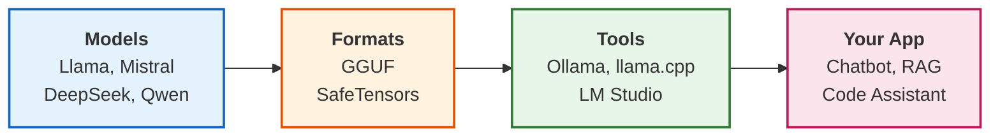
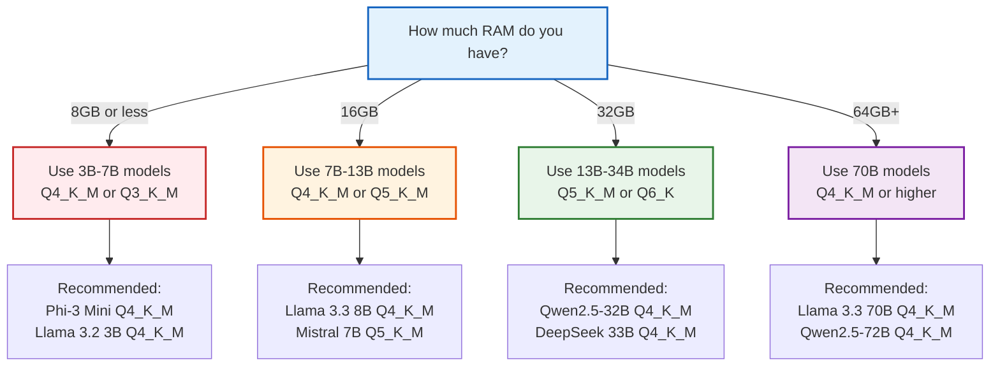
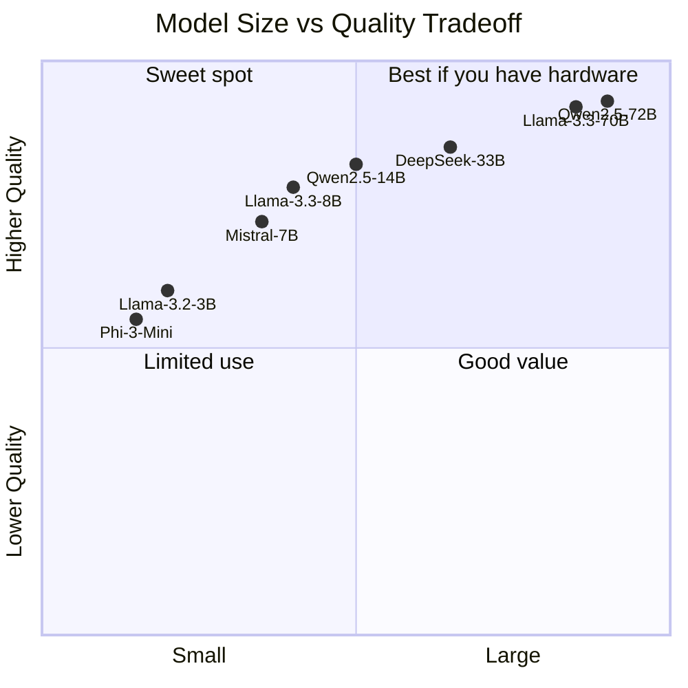

Something changed in the past year. Open source models caught up. Quantization got better. The gap between "cloud only" and "runs on my laptop" disappeared for most use cases.

If you have not tried running LLMs locally recently, you should. Your data stays on your machine. No API limits. No costs after the initial setup. And the performance is better than you might expect.

This guide covers everything you need to get started. No fluff. Just the practical stuff that works.

> **TL;DR**: Use Ollama for the easiest setup. Install it, run `ollama run llama3.3`, and you have a local LLM with an OpenAI-compatible API. For better performance, use quantized models (Q4_K_M is the sweet spot). You need at least 8GB RAM for 7B models, 16GB for 13B, and 32GB+ for 70B models.

## Why Run LLMs Locally?

Before diving into the how, let us talk about why you would want to do this.

### <i class="fas fa-shield-alt"></i> Privacy and Security

When you use cloud APIs, your prompts go to external servers. For many use cases, that is fine. But sometimes it is not:

- Proprietary source code
- Customer data
- Medical or financial records
- Confidential business documents
- Anything covered by compliance regulations

With local LLMs, data never leaves your machine. Period.

### <i class="fas fa-dollar-sign"></i> Cost Savings

Let us do some math. If you make 1000 API calls per day with GPT-4, you are spending roughly $50-100 per day depending on token usage. That is $1500-3000 per month.

A decent GPU costs $500-1500 once. After that, running local models is free.

| Approach | Monthly Cost | Annual Cost |
|----------|-------------|-------------|
| GPT-4 API (heavy usage) | $1000-3000 | $12,000-36,000 |
| Claude API (heavy usage) | $800-2500 | $9,600-30,000 |
| Local LLM | $0* | $0* |

*After initial hardware investment

### <i class="fas fa-wifi-slash"></i> Offline Access

Cloud APIs require internet. Local LLMs do not. This matters when:

- You are on a plane or in a remote area
- Your network is unreliable
- You want to avoid latency
- You need guaranteed uptime

### <i class="fas fa-sliders-h"></i> Full Control

No rate limits. No terms of service changes. No model deprecations. No sudden pricing changes. You control everything.

## Understanding the Landscape

The local LLM ecosystem has three main components: models, formats, and tools.



**Models**: The actual neural networks trained on text data. Llama, Mistral, DeepSeek, etc.

**Formats**: How models are stored. GGUF is the most common for local inference because it supports quantization.

**Tools**: Software that loads models and runs inference. Ollama, llama.cpp, LM Studio, etc.

## Quick Glossary

Before diving in, here are a few terms you will see throughout this guide:

| Term | What It Means |
|------|---------------|
| **Parameters** | The "size" of a model. A 7B model has 7 billion parameters (weights). Bigger usually means smarter but needs more memory. |
| **Quantization** | Compressing a model by reducing the precision of its weights. Instead of storing each weight as a 16-bit number, you store it as 4-bit or 8-bit. Smaller file, less RAM needed, slightly lower quality. |
| **GGUF** | A file format for quantized models. Most local LLM tools use GGUF files. |
| **VRAM** | Video RAM. The memory on your graphics card (GPU). More VRAM means you can run bigger models faster. |
| **Tokens** | Pieces of text (roughly 4 characters or 3/4 of a word). Models process text as tokens. Speed is measured in tokens per second. |
| **Inference** | Running a model to get output. When you ask a question and get an answer, that is inference. |
| **Hugging Face** | The "GitHub for AI models." A platform where researchers and companies publish models, datasets, and demos. When you download a local LLM, you are usually getting it from Hugging Face. |

## Hardware Requirements

Let us be realistic about what hardware you need.

### The RAM Formula

Here is a rough formula for estimating RAM requirements:

```
RAM (GB) = Parameters (billions) × Bits per weight / 8 + Overhead
```

For a 7B model with 4-bit quantization:
```
RAM = 7 × 4 / 8 + 2GB overhead = 5.5 GB
```

In plain English: a 7 billion parameter model, compressed to 4 bits per weight, needs about 5.5 GB of RAM.

### Hardware Recommendations by Model Size

| Model Size | Quantization | RAM Needed | GPU VRAM | Example Models |
|------------|--------------|------------|----------|----------------|
| 1-3B | Q4_K_M | 2-4 GB | 2-4 GB | Phi-3 Mini, Qwen2.5-1.5B |
| 7-8B | Q4_K_M | 4-6 GB | 6-8 GB | Llama 3.1 8B, Mistral 7B |
| 13-14B | Q4_K_M | 8-10 GB | 10-12 GB | Llama 2 13B, Qwen2.5-14B |
| 32-34B | Q4_K_M | 18-22 GB | 20-24 GB | DeepSeek 33B, Qwen2.5-32B |
| 70-72B | Q4_K_M | 35-42 GB | 40-48 GB | Llama 3.1 70B, Qwen2.5-72B |

### CPU vs GPU

You can run LLMs on CPU alone, but it is slow. GPUs are designed for the parallel math that LLMs need, so they are much faster.

For reference, 20+ tokens per second feels responsive in a chat. Below 10 tokens per second feels sluggish.

| Hardware | 7B Model Speed | 70B Model Speed |
|----------|---------------|-----------------|
| CPU only (8 cores) | 5-15 tokens/sec | 0.5-2 tokens/sec |
| Apple M1/M2/M3 | 20-40 tokens/sec | 5-15 tokens/sec |
| NVIDIA RTX 3080 | 40-80 tokens/sec | 10-25 tokens/sec |
| NVIDIA RTX 4090 | 80-150 tokens/sec | 25-50 tokens/sec |

**Why Apple Silicon is great for local LLMs:** On most computers, the CPU and GPU have separate memory. A GPU with 8GB VRAM can only load 8GB of model data, even if you have 32GB of system RAM. Apple Silicon uses "unified memory" where CPU and GPU share the same RAM pool. A Mac with 32GB RAM can use all 32GB for the model.

### My Recommendations

**Budget friendly (under $1000)**:
- MacBook Air M2 with 16GB RAM
- Can run 7B-13B models comfortably

**Mid range ($1000-2000)**:
- MacBook Pro M3 with 32GB RAM
- Or PC with RTX 4070 (12GB VRAM)
- Can run 13B-34B models

**Serious local inference ($2000+)**:
- Mac Studio M2 Ultra with 64GB+ RAM
- Or PC with RTX 4090 (24GB VRAM)
- Can run 70B models

## Method 1: Ollama (Easiest)

Ollama is the Docker of LLMs. One command to install, one command to run.

### Installation

**macOS**:
```bash
curl -fsSL https://ollama.com/install.sh | sh
```

**Linux**:
```bash
curl -fsSL https://ollama.com/install.sh | sh
```

**Windows**:
Download the installer from [ollama.com](https://ollama.com)

### Running Your First Model

```bash
# Run Llama 3.3 (8B parameters)
ollama run llama3.3

# Run Mistral 7B
ollama run mistral

# Run DeepSeek Coder for programming
ollama run deepseek-coder:6.7b

# Run a larger model if you have the RAM
ollama run llama3.3:70b
```

The first run downloads the model. After that, it starts instantly.

### The Ollama API

Ollama runs an API server on port 11434. It is OpenAI-compatible, so you can use it as a drop-in replacement.

```python
import requests
import json

def chat(prompt, model="llama3.3"):
    response = requests.post(
        "http://localhost:11434/api/generate",
        json={
            "model": model,
            "prompt": prompt,
            "stream": False
        }
    )
    return response.json()["response"]

# Use it
answer = chat("Explain the difference between a mutex and a semaphore")
print(answer)
```

### Using with OpenAI SDK

Since the API is compatible, you can use the OpenAI Python library:

```python
from openai import OpenAI

# Point to local Ollama server
client = OpenAI(
    base_url="http://localhost:11434/v1",
    api_key="ollama"  # Required but not used
)

response = client.chat.completions.create(
    model="llama3.3",
    messages=[
        {"role": "system", "content": "You are a helpful assistant."},
        {"role": "user", "content": "Write a Python function to reverse a linked list"}
    ]
)

print(response.choices[0].message.content)
```

This means any code that works with OpenAI can work with local models by changing two lines.

### Useful Ollama Commands

```bash
# List downloaded models
ollama list

# Pull a model without running it
ollama pull codellama:13b

# Remove a model
ollama rm mistral

# Show model info
ollama show llama3.3

# Run with specific parameters
ollama run llama3.3 --verbose

# Create a custom model with a system prompt
cat << 'EOF' > Modelfile
FROM llama3.3
SYSTEM "You are a senior software engineer. Give concise, practical advice."
EOF
ollama create coding-assistant -f Modelfile
ollama run coding-assistant
```

## Method 2: llama.cpp (Most Control)

llama.cpp is the engine that powers Ollama and most local LLM tools. Using it directly gives you maximum control.

### Installation

```bash
# Clone the repository
git clone https://github.com/ggerganov/llama.cpp
cd llama.cpp

# Build (CPU only)
make

# Build with CUDA support (NVIDIA GPUs)
make LLAMA_CUDA=1

# Build with Metal support (Apple Silicon)
make LLAMA_METAL=1
```

### Download a Model

Get GGUF models from Hugging Face. TheBloke and other quantizers provide pre-quantized versions:

```bash
# Example: Download Llama 3.1 8B quantized
wget https://huggingface.co/bartowski/Meta-Llama-3.1-8B-Instruct-GGUF/resolve/main/Meta-Llama-3.1-8B-Instruct-Q4_K_M.gguf
```

### Run Inference

```bash
# Simple prompt
./llama-cli -m Meta-Llama-3.1-8B-Instruct-Q4_K_M.gguf \
    -p "Write a haiku about debugging" \
    -n 100

# Interactive chat mode
./llama-cli -m Meta-Llama-3.1-8B-Instruct-Q4_K_M.gguf \
    --interactive \
    --color \
    -n 512

# With system prompt
./llama-cli -m Meta-Llama-3.1-8B-Instruct-Q4_K_M.gguf \
    --system "You are a helpful coding assistant" \
    -p "How do I handle errors in Go?" \
    -n 256
```

### Run as API Server

llama.cpp includes a server mode:

```bash
./llama-server -m Meta-Llama-3.1-8B-Instruct-Q4_K_M.gguf \
    --host 0.0.0.0 \
    --port 8080 \
    -c 4096  # Context length
```

Now you have an OpenAI-compatible API at `http://localhost:8080`.

### Performance Tuning

```bash
# Specify number of GPU layers to offload
./llama-cli -m model.gguf -ngl 35  # Offload 35 layers to GPU

# Set number of threads for CPU inference
./llama-cli -m model.gguf -t 8  # Use 8 CPU threads

# Adjust context size (affects memory usage)
./llama-cli -m model.gguf -c 2048  # 2048 token context

# Batch size for parallel prompt processing
./llama-cli -m model.gguf -b 512
```

## Method 3: LM Studio (Best GUI)

LM Studio provides a desktop application for running local LLMs. Good for experimentation and non-technical users.

### Features

- Browse and download models from Hugging Face
- Automatic hardware detection
- Chat interface with conversation history
- Local API server
- Model comparison tools

### Installation

Download from [lmstudio.ai](https://lmstudio.ai). Available for macOS, Windows, and Linux.

### Using LM Studio

1. Open the app and go to the Models tab
2. Search for a model (e.g., "llama 3.1 8b gguf")
3. Download the quantization that fits your hardware
4. Go to the Chat tab and select your model
5. Start chatting

For API access, go to the Server tab and start the server. It runs on port 1234 by default.

## Understanding Quantization

Quantization is how we fit large models on consumer hardware. It reduces the precision of model weights.

### Quantization Levels

| Format | Bits | Size Reduction | Quality Loss | Use Case |
|--------|------|----------------|--------------|----------|
| F16 | 16 | 1x | None | Full quality, needs lots of RAM |
| Q8_0 | 8 | 2x | Minimal | Quality focused |
| Q6_K | 6 | 2.7x | Very small | Good balance |
| Q5_K_M | 5 | 3.2x | Small | Popular choice |
| Q4_K_M | 4 | 4x | Noticeable but acceptable | Best balance |
| Q4_0 | 4 | 4x | More than K variants | Smaller but lower quality |
| Q3_K_M | 3 | 5.3x | Significant | When RAM is very limited |
| Q2_K | 2 | 8x | Large | Experimental |

### My Recommendation

**Q4_K_M** is the sweet spot for most users. It provides:
- 4x size reduction
- Acceptable quality loss
- Good inference speed

If you have extra RAM, go with **Q5_K_M** or **Q6_K** for better quality. If you are RAM constrained, try **Q3_K_M**.

### How to Choose



## Choosing the Right Model

Not all models are equal. Here is what works best for different tasks:

### Best Models by Use Case (January 2026)

| Use Case | Best Models | Why |
|----------|------------|-----|
| General chat | Llama 3.3, Qwen2.5 | Best overall quality |
| Coding | DeepSeek Coder, Qwen2.5-Coder, CodeLlama | Trained on code |
| Instruction following | Mistral Instruct, Llama 3.3 Instruct | Fine-tuned for instructions |
| Creative writing | Llama 3.3, Mixtral | Good at long-form content |
| Small and fast | Phi-3, Qwen2.5-1.5B | Designed for efficiency |
| Math and reasoning | DeepSeek-R1, Qwen2.5-Math | Specialized training |

### Model Comparison



### Quick Recommendations

**Just getting started?** Use `ollama run llama3.3`

**Need something faster?** Use `ollama run phi3`

**Writing code?** Use `ollama run deepseek-coder:6.7b`

**Have lots of RAM?** Use `ollama run llama3.3:70b`

## Practical Use Cases

Here are real ways developers use local LLMs.

### Use Case 1: Local Coding Assistant

Build a CLI tool that helps with coding:

```python
#!/usr/bin/env python3
import sys
import requests

def ask_code(question, code_context=""):
    prompt = f"""You are a senior software engineer. Answer concisely.

Context:
{code_context}

Question: {question}

Answer:"""
    
    response = requests.post(
        "http://localhost:11434/api/generate",
        json={
            "model": "deepseek-coder:6.7b",
            "prompt": prompt,
            "stream": False,
            "options": {
                "temperature": 0.1,  # Low temperature for code
                "num_predict": 500
            }
        }
    )
    
    return response.json()["response"]

if __name__ == "__main__":
    question = " ".join(sys.argv[1:])
    print(ask_code(question))
```

Usage:
```bash
./ask "How do I parse JSON in Go?"
./ask "What's wrong with this code?" < buggy_file.py
```

### Use Case 2: Private Document Q&A

Combine local LLMs with RAG for private document search:

```python
from langchain.embeddings import OllamaEmbeddings
from langchain.vectorstores import Chroma
from langchain.llms import Ollama
from langchain.chains import RetrievalQA
from langchain.document_loaders import DirectoryLoader
from langchain.text_splitter import RecursiveCharacterTextSplitter

# Load documents
loader = DirectoryLoader("./docs", glob="**/*.md")
documents = loader.load()

# Split into chunks
splitter = RecursiveCharacterTextSplitter(chunk_size=1000, chunk_overlap=200)
chunks = splitter.split_documents(documents)

# Create embeddings and vector store (all local)
embeddings = OllamaEmbeddings(model="nomic-embed-text")
vectorstore = Chroma.from_documents(chunks, embeddings, persist_directory="./db")

# Create QA chain
llm = Ollama(model="llama3.3")
qa = RetrievalQA.from_chain_type(
    llm=llm,
    chain_type="stuff",
    retriever=vectorstore.as_retriever()
)

# Query
result = qa.run("What is our refund policy?")
print(result)
```

Everything runs locally. Your documents never leave your machine.

### Use Case 3: Git Commit Message Generator

```bash
#!/bin/bash
# Save as: git-ai-commit

DIFF=$(git diff --cached)

if [ -z "$DIFF" ]; then
    echo "No staged changes"
    exit 1
fi

PROMPT="Generate a concise git commit message for these changes. Use conventional commit format (feat:, fix:, docs:, etc). Only output the commit message, nothing else.

Changes:
$DIFF"

MESSAGE=$(curl -s http://localhost:11434/api/generate \
    -d "{\"model\": \"llama3.3\", \"prompt\": \"$PROMPT\", \"stream\": false}" \
    | jq -r '.response')

echo "Suggested commit message:"
echo "$MESSAGE"
echo ""
read -p "Use this message? (y/n) " -n 1 -r
echo
if [[ $REPLY =~ ^[Yy]$ ]]; then
    git commit -m "$MESSAGE"
fi
```

### Use Case 4: API Server for Team Use

Run a local LLM server that your whole team can use:

```python
from fastapi import FastAPI
from pydantic import BaseModel
import requests

app = FastAPI()

class ChatRequest(BaseModel):
    message: str
    system_prompt: str = "You are a helpful assistant."
    model: str = "llama3.3"

@app.post("/chat")
def chat(request: ChatRequest):
    response = requests.post(
        "http://localhost:11434/api/generate",
        json={
            "model": request.model,
            "system": request.system_prompt,
            "prompt": request.message,
            "stream": False
        }
    )
    
    return {
        "response": response.json()["response"],
        "model": request.model
    }

@app.get("/models")
def list_models():
    response = requests.get("http://localhost:11434/api/tags")
    return response.json()
```

Run with:
```bash
uvicorn server:app --host 0.0.0.0 --port 8000
```

Now anyone on your network can use the LLM at `http://your-ip:8000/chat`.

## Performance Optimization

Get the most out of your hardware.

### Memory Optimization

```bash
# Use mmap for memory-mapped files (reduces RAM usage)
./llama-cli -m model.gguf --mmap

# Set a lower context size if you don't need long conversations
./llama-cli -m model.gguf -c 2048  # Instead of default 4096

# Use smaller quantization
# Q3_K_M uses ~25% less RAM than Q4_K_M
```

### Speed Optimization

```bash
# Offload layers to GPU (adjust based on your VRAM)
./llama-cli -m model.gguf -ngl 35

# Use flash attention (if supported)
./llama-cli -m model.gguf --flash-attn

# Increase batch size for faster prompt processing
./llama-cli -m model.gguf -b 512

# Use more CPU threads (don't exceed physical cores)
./llama-cli -m model.gguf -t 8
```

### Apple Silicon Specific

```bash
# Enable Metal acceleration (default on macOS builds)
./llama-cli -m model.gguf -ngl 1  # Even 1 offloads to GPU

# Apple Silicon can use unified memory
# A Mac with 32GB RAM can run 70B Q4 models
```

### NVIDIA Specific

```bash
# Build with CUDA
make LLAMA_CUDA=1

# Offload as many layers as VRAM allows
# 24GB VRAM can offload most of a 70B Q4 model
./llama-cli -m model.gguf -ngl 60

# For multi-GPU setups
./llama-cli -m model.gguf -ngl 99 --split-mode layer
```

## Troubleshooting Common Issues

### "Out of Memory" Error

**Cause**: Model too large for available RAM/VRAM

**Solutions**:
1. Use a smaller quantization (Q4 instead of Q8)
2. Use a smaller model (7B instead of 13B)
3. Reduce context length (`-c 2048`)
4. Offload fewer layers to GPU (`-ngl 20`)

### Slow Inference

**Cause**: Running on CPU or suboptimal settings

**Solutions**:
1. Enable GPU acceleration (`-ngl` flag)
2. Use more CPU threads (`-t` flag)
3. Use a smaller model or quantization
4. Close other applications using GPU

### Model Not Found

**Cause**: Incorrect model path or not downloaded

**Solutions**:
```bash
# Ollama
ollama pull llama3.3  # Download first

# llama.cpp
# Make sure you have the .gguf file
ls -la *.gguf
```

### Garbled Output

**Cause**: Wrong chat template or system prompt format

**Solutions**:
1. Use the correct template for your model
2. Check the model's documentation on Hugging Face
3. Use tools like Ollama that handle templates automatically

## Key Takeaways

1. **Start with Ollama.** It handles all the complexity. One command to install, one command to run.

2. **Q4_K_M quantization is the sweet spot.** 4x smaller than full precision with acceptable quality loss.

3. **Match model size to your RAM.** 7B models need 8GB, 13B needs 16GB, 70B needs 64GB.

4. **Apple Silicon is great for local LLMs.** Unified memory means all your RAM is available.

5. **The OpenAI-compatible API makes integration easy.** Change two lines of code to switch from cloud to local.

6. **Privacy is the killer feature.** Your data never leaves your machine. No logs, no training on your data.

7. **It is free after hardware costs.** No per-token fees, no rate limits, no subscriptions.

8. **Choose models based on your use case.** DeepSeek for coding, Llama for general use, Phi for speed.

---

**Further Reading:**

- [Ollama Documentation](https://ollama.com) - Official Ollama docs and model library
- [llama.cpp GitHub](https://github.com/ggerganov/llama.cpp) - The engine behind most local LLM tools
- [Hugging Face Open LLM Leaderboard](https://huggingface.co/spaces/open-llm-leaderboard/open_llm_leaderboard) - Compare model performance
- [Building AI Agents](/building-ai-agents/) - Use local LLMs to power your own AI agents
- [Context Engineering](/context-engineering/) - Get better results from your local models

*Running into issues or have questions? The local LLM community is active on Reddit ([r/LocalLLaMA](https://reddit.com/r/LocalLLaMA)) and Discord. Start experimenting. You might be surprised how capable these local models have become.*
