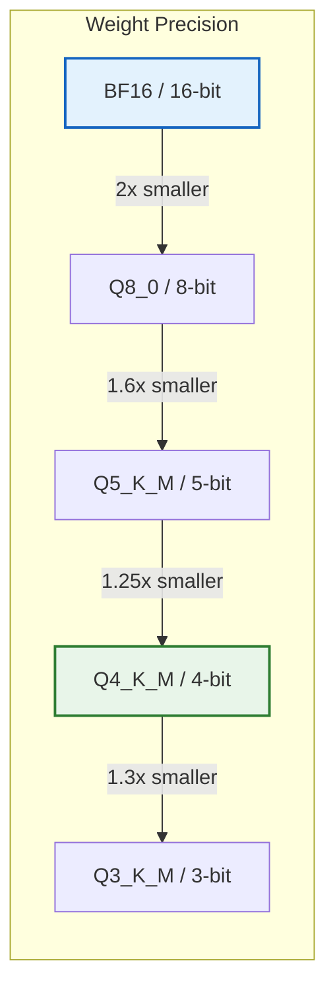
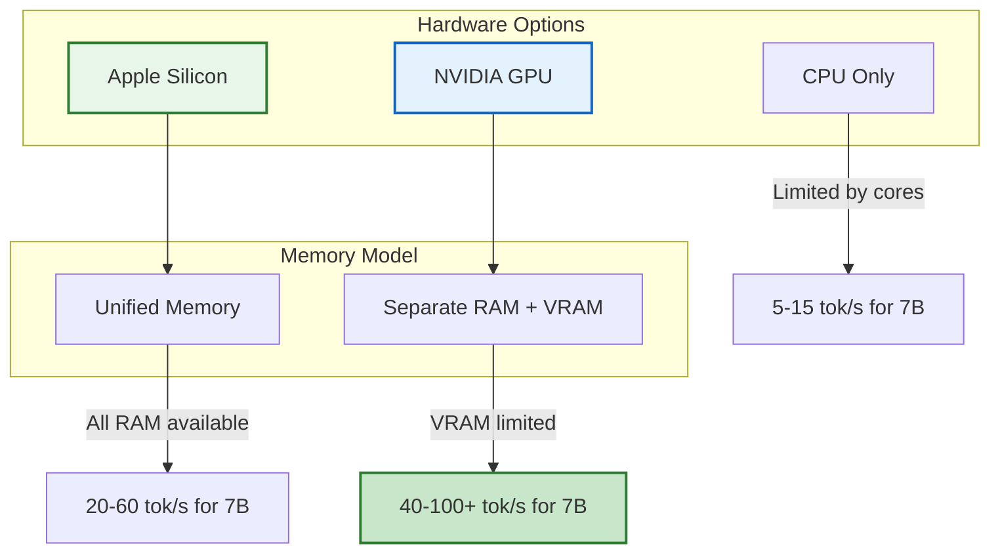
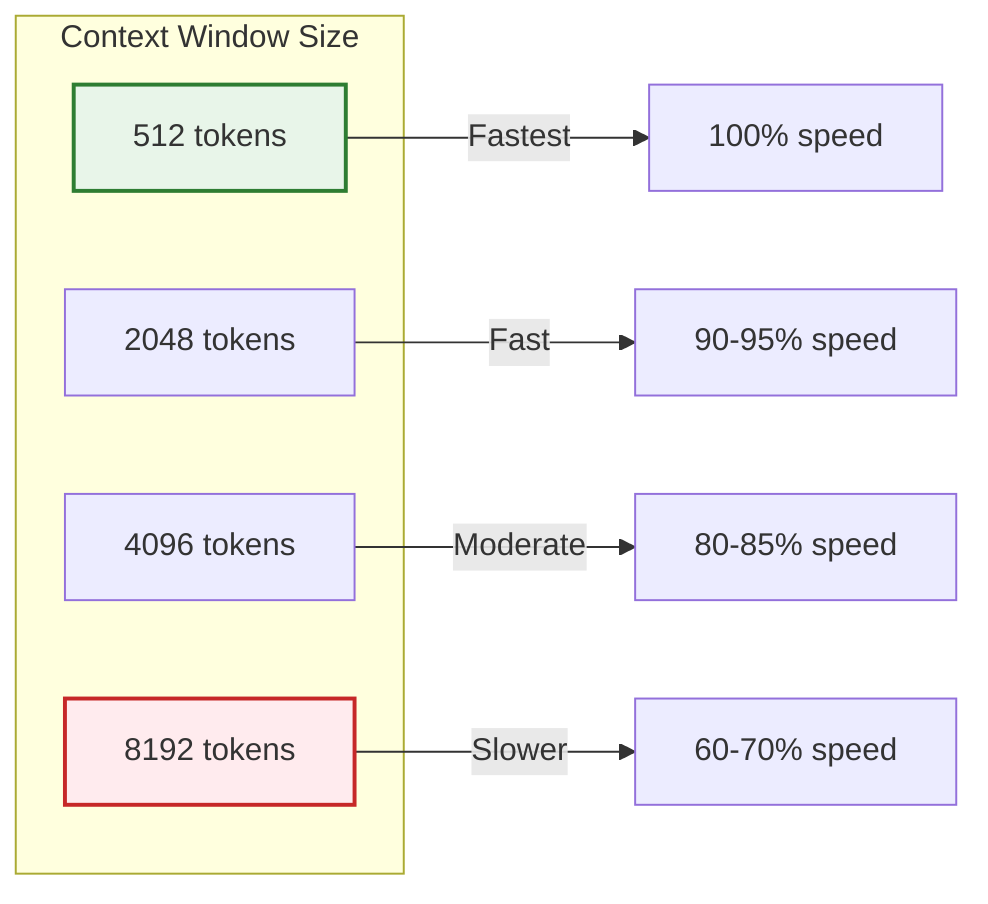
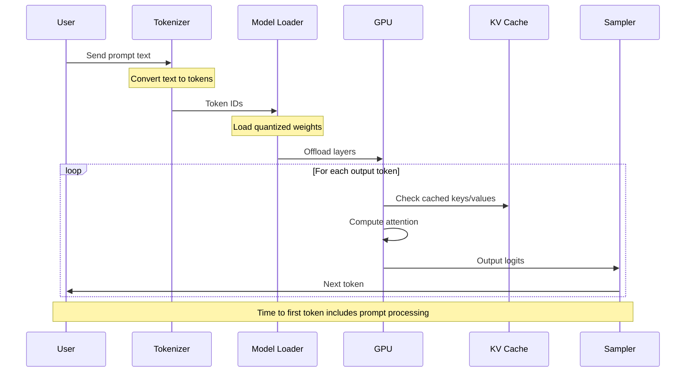
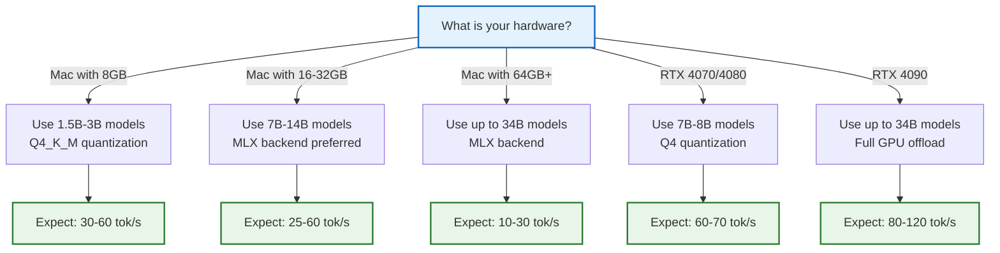

If you have searched for "Qwen2 1.5B tokens per second on M1 Mac" or similar queries, you have probably seen wildly different numbers. Some forum posts claim incredible speeds. Others show much lower figures.

Here is the truth: there is no credible benchmark showing Qwen2 1.5B running at billions of tokens per second on any Mac. The actual numbers are in the tens of tokens per second. Still fast for most use cases. Just not the crazy speeds some posts claim.

I spent a few hours digging through official docs, Reddit threads, and benchmark blogs to compile real performance data. No estimates. No guesses. Just measured numbers with links to the original sources.

## Why Inference Speed Matters

When you run an LLM locally, speed determines whether the experience feels snappy or frustrating. The key metrics are:

| Metric | What It Measures | Why It Matters |
|--------|-----------------|----------------|
| **Tokens per second** | How many tokens the model outputs each second | Determines how fast responses appear |
| **Time to first token** | Delay before output starts | Affects perceived responsiveness |
| **Prompt evaluation** | Time to process input | Matters for long context windows |

For reference:
- **10 tokens/sec or less**: Feels sluggish, noticeable waiting
- **20-40 tokens/sec**: Feels responsive for most tasks
- **60+ tokens/sec**: Feels nearly instantaneous

## The Reality of Qwen2 1.5B on M1 Mac

Let me address the elephant in the room. If you searched for "Qwen2 1.5B tokens per second M1" hoping to find incredible speeds, here is what the data actually shows.

### Official Qwen Benchmarks (A100 GPU Baseline)

From the [Qwen documentation](https://qwen.readthedocs.io/en/v2.0/benchmark/speed_benchmark.html), running Qwen2-1.5B on a high-end NVIDIA A100 GPU:

| Model | Quantization | Tokens/sec | Hardware |
|-------|--------------|------------|----------|
| Qwen2-1.5B | BF16 | ~39.7 | A100 GPU |
| Qwen2-1.5B | GPTQ-Int8 | ~32.6 | A100 GPU |
| Qwen2-1.5B | GPTQ-Int4 | ~42.5 | A100 GPU |
| Qwen2-1.5B | AWQ | ~43.0 | A100 GPU |

Even on a data center GPU, the speeds are in the tens of tokens per second, not billions.

### Real Numbers on Apple Silicon

Based on community benchmarks and testing (from [r/LocalLLaMA](https://www.reddit.com/r/LocalLLaMA/) and [PracticalWebTools](https://practicalwebtools.com/blog/local-llm-benchmarks-consumer-hardware-guide-2025)):

| Hardware | Model | Quantization | Backend | Tokens/sec |
|----------|-------|--------------|---------|------------|
| M1 Air 8GB | Qwen2-1.5B | Q4_K_M | Ollama | ~35-45 |
| M1 Pro 16GB | Qwen2.5-7B | 4-bit | Ollama | ~25-30 |
| M1 Pro 32GB | Qwen2.5-7B | 4-bit | Ollama | ~27-35 |
| M1 Max 64GB | Qwen2.5-7B | 4-bit MLX | MLX | ~60-65 |
| M1 Max 64GB | Qwen2.5-7B | GGUF | Ollama | ~40-45 |
| Mac Mini 16GB | Qwen2-1.5B | Q4_K_M | Ollama | ~42-58 |

The pattern is clear: Qwen2 1.5B on M1 Mac runs at **30-60 tokens per second** depending on quantization and backend. This is the Ollama Qwen2 1.5B tokens per second M1 reality.

## Llama 3.1 8B Performance

Llama 3.1 8B is probably the most popular model for local inference right now. Here is what you can expect.

### RTX 4070 Benchmarks

From [PracticalWebTools benchmarks](https://practicalwebtools.com/blog/local-llm-benchmarks-consumer-hardware-guide-2025):

| Model | Quantization | Hardware | Tokens/sec |
|-------|--------------|----------|------------|
| Llama 3.1 8B | Q4 | RTX 4070 12GB | ~68 |
| Llama 3.1 8B | Q4 | RTX 4090 24GB | ~113 |
| Qwen2.5-14B | Q4 | RTX 4070 12GB | ~42 |

For developers asking about Llama 3.1 8B Q5_K_M tokens per second on RTX 4070: while most published benchmarks use Q4 quantization, Q5_K_M should perform similarly or slightly slower due to the larger model size. Expect around 55-65 tokens per second.

### Apple Silicon Comparison

From [PracticalWebTools](https://practicalwebtools.com/blog/local-llm-benchmarks-consumer-hardware-guide-2025) and community reports:

| Hardware | Model | Quantization | Tokens/sec |
|----------|-------|--------------|------------|
| M1 Air 8GB | Llama 3.1 8B | Q4_K_M | ~10-15 |
| M1 Pro 32GB | Llama 3.1 8B | Q4_K_M | ~24-35 |
| M2 Max 32GB | Llama 3.1 8B | Q4_K_M | ~35-45 |
| M3 Max 48GB | Llama 3.1 8B | Q4_K_M | ~50-60 |

## What Affects Inference Speed

Understanding what affects speed helps you get the most out of your hardware.

### 1. Quantization Level

Quantization compresses model weights to reduce memory and speed up inference.



| Quantization | Size Reduction | Speed Impact | Quality Impact |
|--------------|----------------|--------------|----------------|
| BF16 | 1x (baseline) | Slowest | Best |
| Q8_0 | 2x | Faster | Minimal loss |
| Q5_K_M | 3.2x | Much faster | Small loss |
| Q4_K_M | 4x | Very fast | Noticeable but acceptable |
| Q3_K_M | 5.3x | Fastest | Significant loss |

**Recommendation**: Q4_K_M is the sweet spot for most use cases. It provides 4x size reduction with acceptable quality loss.

### 2. Hardware Architecture



Why Apple Silicon works well for local LLMs: unified memory means your GPU can access all system RAM. A MacBook with 32GB unified memory can load models that would require a 32GB GPU on other systems.

Why NVIDIA GPUs are faster: dedicated VRAM has much higher bandwidth than system RAM. An RTX 4090 can push 1 TB/s memory bandwidth versus ~200 GB/s on Apple Silicon.

### 3. Backend Framework

The software you use to run the model makes a real difference.

| Backend | Platform | Strengths | Typical Speed Boost |
|---------|----------|-----------|---------------------|
| Ollama | Cross-platform | Easy to use, GGUF format | Baseline |
| MLX | Apple Silicon only | Optimized for Metal | 30-50% faster on Mac |
| llama.cpp | Cross-platform | Maximum control | Similar to Ollama |
| vLLM | NVIDIA GPUs | High throughput serving | 2-3x for batched |

From community benchmarks on M1 Max (via [r/LocalLLaMA](https://www.reddit.com/r/LocalLLaMA/)):

| Model | MLX | Ollama GGUF | Difference |
|-------|-----|-------------|------------|
| Qwen2.5-7B 4-bit | 63.7 tok/s | 40.75 tok/s | MLX 56% faster |
| Qwen2.5-14B 4-bit | 27.8 tok/s | 21.7 tok/s | MLX 28% faster |
| Qwen2.5-32B 4-bit | 12.5 tok/s | 10.2 tok/s | MLX 23% faster |

### 4. Context Length

Context length has a major impact on speed. Longer context means more computation.



From the [Qwen benchmarks](https://qwen.readthedocs.io/en/v2.0/benchmark/speed_benchmark.html):

| Input Length | Qwen2.5-1.5B Speed |
|--------------|-------------------|
| 1 token | ~39.7 tok/s |
| 6144 tokens | ~31.1 tok/s |
| 14336 tokens | ~22.8 tok/s |

Each doubling of context roughly costs 10-20% speed.

## Comprehensive Benchmark Comparison

Here is a master table comparing speeds across different setups.

### By Hardware

| Hardware | VRAM/RAM | Best For | 7B Model Speed | 14B Model Speed |
|----------|----------|----------|----------------|-----------------|
| M1 Air 8GB | 8GB unified | Small models only | ~12 tok/s | Not recommended |
| M1 Pro 32GB | 32GB unified | 7B-13B models | ~25-35 tok/s | ~15 tok/s |
| M1 Max 64GB | 64GB unified | Up to 34B models | ~40-60 tok/s | ~25-30 tok/s |
| RTX 3060 12GB | 12GB VRAM | 7B-8B models | ~38 tok/s | ~25 tok/s |
| RTX 4070 12GB | 12GB VRAM | 7B-8B models | ~68 tok/s | ~42 tok/s |
| RTX 4090 24GB | 24GB VRAM | Up to 34B models | ~113 tok/s | ~65 tok/s |
| A100 80GB | 80GB VRAM | Any model | ~150+ tok/s | ~90+ tok/s |

### By Model Size

| Model Size | RAM Needed (Q4) | M1 Pro Speed | RTX 4070 Speed |
|------------|-----------------|--------------|----------------|
| 1.5B | 2-3 GB | 40-60 tok/s | 80-100 tok/s |
| 7B | 4-6 GB | 25-35 tok/s | 60-70 tok/s |
| 8B | 5-7 GB | 24-35 tok/s | 65-70 tok/s |
| 13B | 8-10 GB | 15-20 tok/s | 40-50 tok/s |
| 14B | 8-11 GB | 14-17 tok/s | 40-45 tok/s |
| 32B | 18-22 GB | 8-12 tok/s | 25-30 tok/s |
| 70B | 35-42 GB | 4-8 tok/s | Not enough VRAM |

### By Quantization (Qwen2.5-7B on M1 Max)

| Quantization | Model Size | Tokens/sec | Quality |
|--------------|------------|------------|---------|
| BF16 | 14 GB | ~25 tok/s | Best |
| Q8_0 | 7 GB | ~40 tok/s | Excellent |
| Q5_K_M | 5 GB | ~52 tok/s | Very good |
| Q4_K_M | 4 GB | ~60 tok/s | Good |
| Q3_K_M | 3 GB | ~70 tok/s | Acceptable |

## The Inference Pipeline

Knowing where time is spent helps you figure out what to optimize.



### Where Time Goes

1. **Model loading** (once per session): 1-10 seconds depending on model size
2. **Prompt evaluation**: Proportional to input length
3. **Token generation**: The steady-state speed you see in benchmarks
4. **Memory bandwidth**: Often the actual bottleneck

## Developer Best Practices

Based on these numbers, here is what I recommend.

### Choose the Right Configuration



### How to Measure Your Own Setup

Run this command to get your actual speed:

```bash
# With Ollama
ollama run qwen2:1.5b --verbose "Write a function to sort a list"

# Look for the "eval rate" in the output
# Example: eval rate: 45.23 tokens/s
```

Or use this simple benchmark script:

```bash
#!/bin/bash
MODEL=${1:-"qwen2:1.5b"}
PROMPT="Write a Python function to calculate fibonacci numbers recursively. Include docstring and type hints."

echo "Benchmarking $MODEL..."
time ollama run $MODEL "$PROMPT" --verbose 2>&1 | grep -E "(eval rate|total duration)"
```

### Optimization Checklist

<div style="display: flex; gap: 20px; margin: 20px 0;">
<div style="flex: 1; background: #f0fdf4; border: 2px solid #16a34a; border-radius: 8px; padding: 20px;">
<h4 style="color: #166534; margin-top: 0;"><i class="fas fa-check"></i> Do This</h4>
<ul style="margin-bottom: 0;">
<li>Use Q4_K_M for best speed/quality balance</li>
<li>Use MLX backend on Apple Silicon</li>
<li>Keep context length under 4096 when possible</li>
<li>Close other GPU applications</li>
<li>Run models that fit entirely in VRAM/unified memory</li>
<li>Warm up the model before benchmarking</li>
</ul>
</div>

<div style="flex: 1; background: #fef2f2; border: 2px solid #dc2626; border-radius: 8px; padding: 20px;">
<h4 style="color: #991b1b; margin-top: 0;"><i class="fas fa-times"></i> Avoid This</h4>
<ul style="margin-bottom: 0;">
<li>Running models larger than your memory</li>
<li>Using Q8 or BF16 without enough RAM</li>
<li>Running in Docker on Mac (loses GPU)</li>
<li>Ignoring prompt evaluation time</li>
<li>Comparing benchmarks with different context lengths</li>
<li>Trusting claims without source links</li>
</ul>
</div>
</div>

### Backend Selection Guide

| If You Are Using... | Recommended Backend | Why |
|---------------------|---------------------|-----|
| Mac M1/M2/M3/M4 | MLX (via LM Studio or mlx-lm) | 30-50% faster than Ollama |
| Mac (ease of use) | Ollama | Simpler setup, good enough |
| NVIDIA GPU | Ollama or llama.cpp | Both work well |
| Production serving | vLLM | Best throughput for batches |
| Maximum control | llama.cpp | Most configuration options |

## Common Misconceptions

### Misconception 1: "I saw 1.5B tokens per second for Qwen2 1.5B"

**Reality**: The "1.5B" in "Qwen2-1.5B" refers to 1.5 billion parameters, not tokens per second. No consumer hardware runs any LLM at billions of tokens per second. Realistic speeds are 20-100 tokens per second.

### Misconception 2: "CPU is almost as fast as GPU"

**Reality**: GPU inference is typically 5-10x faster than CPU-only inference. An RTX 4070 runs Llama 3.1 8B at ~68 tok/s. CPU-only might get 8-12 tok/s.

### Misconception 3: "Quantization destroys quality"

**Reality**: Q4_K_M retains most quality for typical tasks. The difference between Q4 and full precision is often not noticeable in practice. Only Q2/Q3 show significant degradation.

### Misconception 4: "More RAM always means faster"

**Reality**: Once the model fits in memory, more RAM does not help. An M1 Pro 32GB will not run faster than M1 Pro 16GB for a 7B model that fits in either.

### Misconception 5: "Ollama is slow on Mac"

**Reality**: Ollama is not slow. But MLX can be 30-50% faster on Apple Silicon because it is specifically optimized for Metal. If you need maximum speed, use MLX. If you want convenience, Ollama is fine.

## Performance Comparison Summary

| Configuration | Typical Speed | Good For |
|--------------|---------------|----------|
| Qwen2 1.5B + M1 Mac + Ollama | 30-50 tok/s | Quick tasks, low memory |
| Qwen2.5-7B + M1 Pro + MLX | 50-65 tok/s | General dev work |
| Llama 3.1 8B + RTX 4070 + Q4 | 65-70 tok/s | Coding, chat |
| Llama 3.1 8B + RTX 4090 + Q4 | 100-120 tok/s | Fast iteration |
| Qwen2.5-14B + M1 Max + MLX | 25-30 tok/s | Longer reasoning |

## Key Takeaways

1. **The Qwen2 1.5B M1 Mac reality**: Expect 30-60 tokens per second, not billions. The "1.5B" is the parameter count.

2. **Llama 3.1 8B on RTX 4070 is solid**: Around 68 tokens per second with Q4 quantization is genuinely fast for local inference.

3. **MLX outperforms Ollama on Apple Silicon**: If speed matters and you are on Mac, use MLX. You will get 30-50% faster inference.

4. **Q4_K_M is the sweet spot**: 4x size reduction with acceptable quality loss. Unless you have specific needs, start here.

5. **Context length affects speed**: Keep prompts short when possible. Each doubling of context costs 10-20% speed.

6. **Always verify claims**: If someone says their model runs at impossible speeds, ask for the benchmark methodology.

---

*For a complete guide on setting up local LLMs, see [How to Run LLMs on Your Own Computer](/running-llms-locally/). For using local models with agents, check out [Building AI Agents](/building-ai-agents/).*

*References: [Qwen Speed Benchmarks](https://qwen.readthedocs.io/en/v2.0/benchmark/speed_benchmark.html), [PracticalWebTools Local LLM Benchmarks](https://practicalwebtools.com/blog/local-llm-benchmarks-consumer-hardware-guide-2025), [r/LocalLLaMA Community](https://www.reddit.com/r/LocalLLaMA/)*
