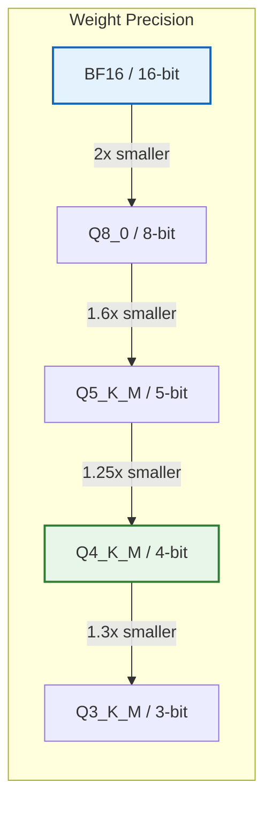
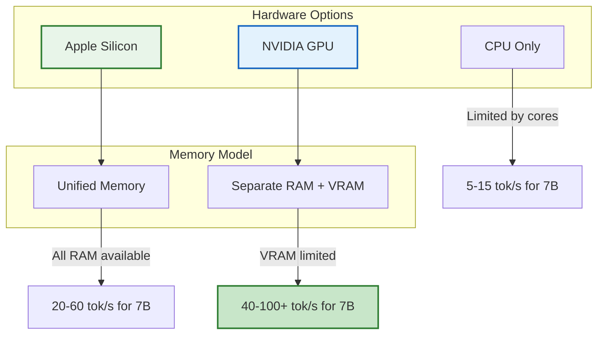
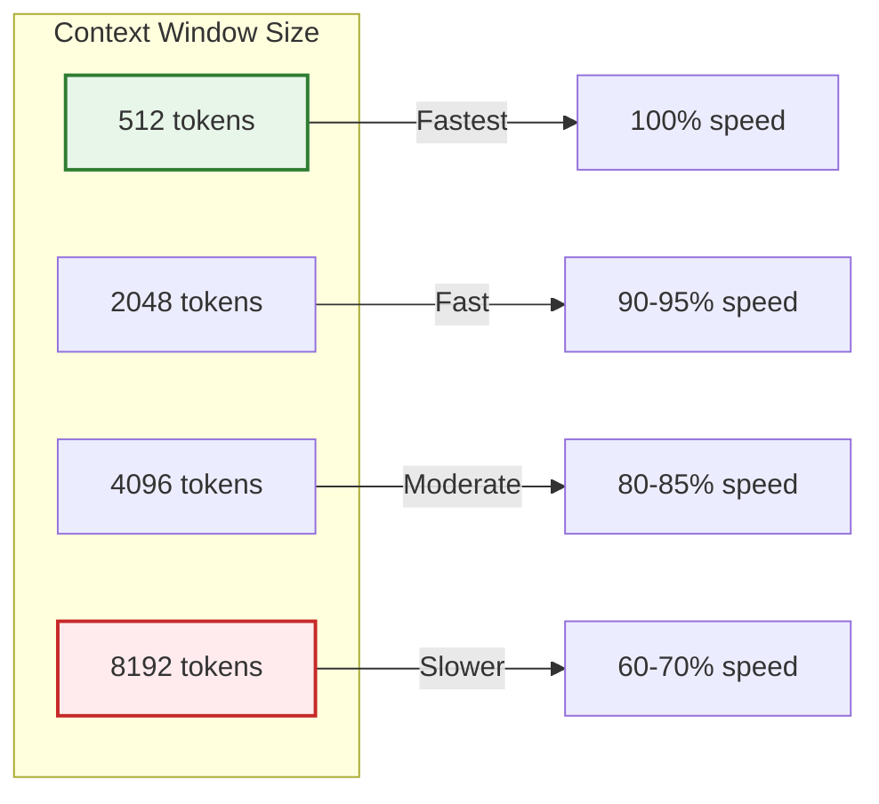
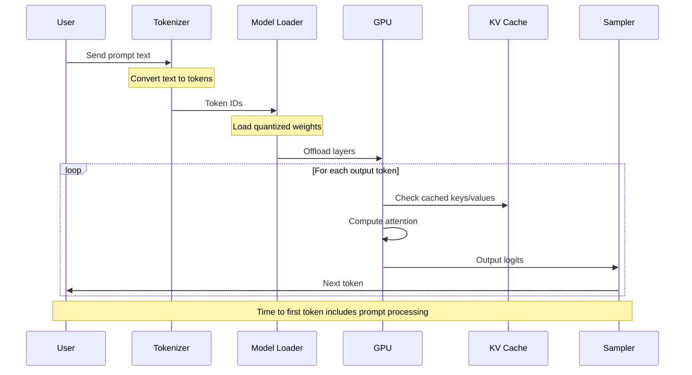
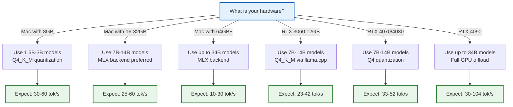

If you have searched for "RTX 3060 14B model inference speed tokens per second llama.cpp" or "Llama 3.1 8B inference speed tokens per second" and found confusing or contradictory results, you are not alone. Some forum posts claim incredible speeds. Others show much lower figures. The numbers vary wildly depending on quantization, backend, and context length.

I spent time digging through official docs, Reddit threads, and benchmark blogs to compile real performance data for the most common setups: RTX 3060 12GB, RTX 4070, RTX 4090, and Apple Silicon. Every number here comes from measured results with links to the original sources. Whether you are running a 14B model on your RTX 3060 12GB with llama.cpp or Ollama, or comparing Llama 3.1 8B inference speed across GPUs, this post has the data you need.

## Why Inference Speed Matters

When you run an LLM locally, speed determines whether the experience feels snappy or frustrating. The key metrics are:

| Metric | What It Measures | Why It Matters |
|--------|-----------------|----------------|
| **Tokens per second** | How many tokens the model outputs each second | Determines how fast responses appear |
| **Time to first token** | Delay before output starts | Affects perceived responsiveness |
| **Prompt evaluation** | Time to process input | Matters for long context windows |

For reference:
- **10 tokens/sec or less**: Feels sluggish, noticeable waiting
- **20-40 tokens/sec**: Feels responsive for most tasks
- **60+ tokens/sec**: Feels nearly instantaneous

## RTX 3060 12GB: 14B Model Inference Speed with llama.cpp and Ollama

The RTX 3060 12GB is one of the most popular GPUs for local LLM inference. Its 12GB VRAM is enough to run 14B parameter models with Q4 quantization, which makes it a sweet spot for budget-conscious users who want to run larger models locally.

### RTX 3060 12GB Benchmark Results

From [Hardware Corner's GPU benchmarks](https://www.hardware-corner.net/gpu-ranking-local-llm/) (llama.cpp, Ubuntu 24.04, CUDA 12.8, Q4_K_XL quantization, 16K context):

| Model Size | Tokens/sec (16K context) | Tokens/sec (32K context) |
|-----------|--------------------------|--------------------------|
| 8B (Qwen3 8B) | 42.0 | 31.9 |
| 14B (Qwen3 14B) | 22.7 | — |

From [geerlingguy's ai-benchmarks](https://github.com/geerlingguy/ai-benchmarks/issues/40) (llama.cpp, RTX 3060 12GB, Vulkan backend, Q4_K_M):

| Model | Tokens/sec (tg128) |
|-------|-------------------|
| Llama-2 7B Q4_K_M | 60.2 |
| Llama-2 13B Q4_K_M | 32.8 |
| DeepSeek-R1-Distill-Qwen-14B Q4_K_M | 29.4 |

Note: geerlingguy's benchmarks use the Vulkan backend rather than CUDA, and test token generation at 128 tokens. The Hardware Corner benchmarks use CUDA 12.8 at 16K context. Both are real measured results but test conditions differ, which explains the variation. A 14B Q4 model uses approximately 8GB of the 12GB VRAM, leaving room for KV cache and context.

### llama.cpp vs Ollama on NVIDIA GPUs

Ollama wraps llama.cpp with a Go-based API layer and model management. According to [InsiderLLM's benchmarks](https://insiderllm.com/guides/llamacpp-vs-ollama-vs-vllm/), llama.cpp is approximately **3-10% faster** than Ollama for single-user inference on NVIDIA GPUs. The overhead comes from Ollama's server layer.

For most users, Ollama's convenience is worth the small speed penalty. If you want every last token per second, use llama.cpp directly with full GPU offloading (`-ngl 99`).

### RTX 3060 Benchmark Command

To measure your own RTX 3060 inference speed with llama.cpp:

```bash
# 14B model benchmark with llama.cpp on RTX 3060
./llama-cli -m Qwen2.5-14B-Q4_K_M.gguf \
    -p "Explain the difference between TCP and UDP in detail" \
    -n 256 -ngl 99 --verbose

# With Ollama
ollama run qwen2.5:14b --verbose "Explain the difference between TCP and UDP in detail"
```

## The Reality of Qwen2 1.5B on M1 Mac

Let me address the elephant in the room. If you searched for "Qwen2 1.5B tokens per second M1" hoping to find incredible speeds, here is what the data actually shows.

### Official Qwen Benchmarks (A100 GPU Baseline)

From the [Qwen documentation](https://qwen.readthedocs.io/en/v2.0/benchmark/speed_benchmark.html), running Qwen2-1.5B on a high-end NVIDIA A100 GPU:

| Model | Quantization | Tokens/sec | Hardware |
|-------|--------------|------------|----------|
| Qwen2-1.5B | BF16 | ~39.7 | A100 GPU |
| Qwen2-1.5B | GPTQ-Int8 | ~32.6 | A100 GPU |
| Qwen2-1.5B | GPTQ-Int4 | ~42.5 | A100 GPU |
| Qwen2-1.5B | AWQ | ~43.0 | A100 GPU |

Even on a data center GPU, the speeds are in the tens of tokens per second, not billions.

### Real Numbers on Apple Silicon

Based on community benchmarks and testing (from [r/LocalLLaMA](https://www.reddit.com/r/LocalLLaMA/) and [PracticalWebTools](https://practicalwebtools.com/blog/local-llm-benchmarks-consumer-hardware-guide-2025)):

| Hardware | Model | Quantization | Backend | Tokens/sec |
|----------|-------|--------------|---------|------------|
| M1 Air 8GB | Qwen2-1.5B | Q4_K_M | Ollama | ~35-45 |
| M1 Pro 16GB | Qwen2.5-7B | 4-bit | Ollama | ~25-30 |
| M1 Pro 32GB | Qwen2.5-7B | 4-bit | Ollama | ~27-35 |
| M1 Max 64GB | Qwen2.5-7B | 4-bit MLX | MLX | ~60-65 |
| M1 Max 64GB | Qwen2.5-7B | GGUF | Ollama | ~40-45 |
| Mac Mini 16GB | Qwen2-1.5B | Q4_K_M | Ollama | ~42-58 |

The pattern is clear: Qwen2 1.5B on M1 Mac runs at **30-60 tokens per second** depending on quantization and backend. This is the Ollama Qwen2 1.5B tokens per second M1 reality.

## Llama 3.1 8B Inference Speed (Tokens Per Second)

Llama 3.1 8B is the most popular model for local inference. Here is the Llama 3.1 8B inference speed data across GPUs and Apple Silicon.

### Llama 3.1 8B Tokens Per Second Across GPUs

From [Hardware Corner](https://www.hardware-corner.net/gpu-ranking-local-llm/) (llama.cpp, CUDA 12.8, Q4_K_XL, 16K context) and [PracticalWebTools](https://practicalwebtools.com/blog/local-llm-benchmarks-consumer-hardware-guide-2025):

| Hardware | Source | Quantization | Tokens/sec |
|----------|--------|-------------|------------|
| RTX 3060 12GB | Hardware Corner | Q4_K_XL (16K ctx) | 42.0 |
| RTX 4070 12GB | Hardware Corner | Q4_K_XL (16K ctx) | 52.1 |
| RTX 4070 12GB | PracticalWebTools | Q4 | ~68 |
| RTX 4090 24GB | Hardware Corner | Q4_K_XL (16K ctx) | 104.3 |
| RTX 4090 24GB | PracticalWebTools | Q4 | ~113 |

The variation between Hardware Corner and PracticalWebTools numbers comes from different test conditions: Hardware Corner tests at 16K context with Q4_K_XL quantization, while PracticalWebTools uses shorter context lengths. Both are real measured results. Even at the more conservative Hardware Corner numbers, the RTX 3060's 42 tokens per second is well above the 20-30 tok/s threshold where chat feels responsive.

Ollama will be roughly 3-10% slower than these llama.cpp numbers due to its Go server layer overhead ([source](https://insiderllm.com/guides/llamacpp-vs-ollama-vs-vllm/)).

### Apple Silicon Comparison

From [PracticalWebTools](https://practicalwebtools.com/blog/local-llm-benchmarks-consumer-hardware-guide-2025) and community reports:

| Hardware | Model | Quantization | Tokens/sec |
|----------|-------|--------------|------------|
| M1 Air 8GB | Llama 3.1 8B | Q4_K_M | ~10-15 |
| M1 Pro 32GB | Llama 3.1 8B | Q4_K_M | ~24-35 |
| M2 Max 32GB | Llama 3.1 8B | Q4_K_M | ~35-45 |
| M3 Max 48GB | Llama 3.1 8B | Q4_K_M | ~50-60 |

Note: Intel MacBook Pros (i9, i7) run LLMs on CPU only with no GPU acceleration, resulting in significantly slower speeds (under 10 tok/s for 8B models). If you have an older Intel MacBook, an RTX 3060 12GB is a much better option for local inference.

## Qwen2.5 Inference Speed (7B, 14B, 32B Tokens Per Second)

Qwen2.5 is one of the strongest open-source model families for local inference. Here is how each size performs across hardware, using data from multiple verified sources.

### Qwen2.5-7B Inference Speed

| Hardware | Quantization | Backend | Tokens/sec | Source |
|----------|-------------|---------|------------|--------|
| A100 80GB | BF16 | Transformers | 40.4 | [Qwen Docs](https://qwen.readthedocs.io/en/v2.5/benchmark/speed_benchmark.html) |
| A100 80GB | GPTQ-Int4 | vLLM | 154.1 | [Qwen Docs](https://qwen.readthedocs.io/en/v2.5/benchmark/speed_benchmark.html) |
| M1 Max 64GB | 4-bit MLX | MLX | 63.7 | [r/LocalLLaMA](https://www.reddit.com/r/LocalLLaMA/) |
| M1 Max 64GB | GGUF | Ollama | 40.75 | [r/LocalLLaMA](https://www.reddit.com/r/LocalLLaMA/) |
| M1 Pro 16GB | Q4_K_M | Ollama | ~25-30 | [PracticalWebTools](https://practicalwebtools.com/blog/local-llm-benchmarks-consumer-hardware-guide-2025) |

For NVIDIA GPUs, use the Hardware Corner 8B model numbers as a close proxy: RTX 3060 = ~42 tok/s, RTX 4070 = ~52 tok/s, RTX 4090 = ~104 tok/s ([source](https://www.hardware-corner.net/gpu-ranking-local-llm/), Q4_K_XL, 16K context). Qwen2.5-7B and Qwen3 8B have similar architectures, so performance is comparable.

### Qwen2.5-14B Inference Speed

| Hardware | Quantization | Backend | Tokens/sec | Source |
|----------|-------------|---------|------------|--------|
| RTX 3060 12GB | Q4_K_XL | llama.cpp | 22.7 | [Hardware Corner](https://www.hardware-corner.net/gpu-ranking-local-llm/) |
| RTX 3060 12GB | Q4_K_M (Vulkan) | llama.cpp | 29.4 | [geerlingguy](https://github.com/geerlingguy/ai-benchmarks/issues/40) |
| RTX 4070 12GB | Q4_K_XL | llama.cpp | 32.7 | [Hardware Corner](https://www.hardware-corner.net/gpu-ranking-local-llm/) |
| RTX 4070 12GB | Q4 | — | ~42 | [PracticalWebTools](https://practicalwebtools.com/blog/local-llm-benchmarks-consumer-hardware-guide-2025) |
| RTX 4090 24GB | Q4_K_XL | llama.cpp | 69.1 | [Hardware Corner](https://www.hardware-corner.net/gpu-ranking-local-llm/) |
| A100 80GB | GPTQ-Int4 | Transformers | 25.9 | [Qwen Docs](https://qwen.readthedocs.io/en/v2.5/benchmark/speed_benchmark.html) |
| A100 80GB | GPTQ-Int4 | vLLM | 98.0 | [Qwen Docs](https://qwen.readthedocs.io/en/v2.5/benchmark/speed_benchmark.html) |
| M1 Max 64GB | 4-bit MLX | MLX | 27.8 | [r/LocalLLaMA](https://www.reddit.com/r/LocalLLaMA/) |
| M1 Max 64GB | GGUF | Ollama | 21.7 | [r/LocalLLaMA](https://www.reddit.com/r/LocalLLaMA/) |

Qwen2.5-14B is the largest model that fits comfortably in the RTX 3060's 12GB VRAM with Q4 quantization. The RTX 3060 delivers 23-29 tokens per second depending on backend and quantization format, which is above the usability threshold for chat. The variation between Hardware Corner (22.7) and geerlingguy (29.4) comes from different backends (CUDA vs Vulkan) and test models (Qwen3 14B vs DeepSeek-R1-Distill-Qwen-14B).

### Qwen2.5-32B Inference Speed

| Hardware | Quantization | Backend | Tokens/sec | Source |
|----------|-------------|---------|------------|--------|
| RTX 4090 24GB | Q4_K_M | llama.cpp | 30-45 | [CraftRigs](https://craftrigs.com/guides/qwen-2-5-coder-32b-hardware-guide/) |
| RTX 3090 24GB | Q4_K_M | llama.cpp | 15-22 | [CraftRigs](https://craftrigs.com/guides/qwen-2-5-coder-32b-hardware-guide/) |
| RTX 4060 8GB | Q4_K_M | llama.cpp + CPU offload | 10.8 | [dev.to](https://dev.to/plasmon_imp/running-qwen25-32b-on-rtx-4060-8gb-beating-m4-at-108-ts-with-llamacpp-11je) |
| A100 80GB | GPTQ-Int4 | Transformers | 19.2 | [Qwen Docs](https://qwen.readthedocs.io/en/v2.5/benchmark/speed_benchmark.html) |
| A100 80GB | GPTQ-Int4 | vLLM | 55.8 | [Qwen Docs](https://qwen.readthedocs.io/en/v2.5/benchmark/speed_benchmark.html) |
| M1 Max 64GB | 4-bit MLX | MLX | 12.5 | [r/LocalLLaMA](https://www.reddit.com/r/LocalLLaMA/) |
| M1 Max 64GB | GGUF | Ollama | 10.2 | [r/LocalLLaMA](https://www.reddit.com/r/LocalLLaMA/) |
| RTX 3060 12GB | — | — | Does not fit (needs ~19GB) | — |

Qwen2.5-32B requires at least 19GB of VRAM with Q4 quantization, so it cannot run on the RTX 3060 12GB or RTX 4070 12GB. The RTX 4090 with 24GB VRAM handles it at a usable 30-45 tokens per second.

## What Affects Inference Speed

Understanding what affects speed helps you get the most out of your hardware.

### 1. Quantization Level

Quantization compresses model weights to reduce memory and speed up inference.


```mermaid
flowchart LR
    subgraph Precision[Weight Precision]
        BF16[BF16 / 16-bit]
        Q8[Q8_0 / 8-bit]
        Q5[Q5_K_M / 5-bit]
        Q4[Q4_K_M / 4-bit]
        Q3[Q3_K_M / 3-bit]
    end
    
    BF16 --> |2x smaller| Q8
    Q8 --> |1.6x smaller| Q5
    Q5 --> |1.25x smaller| Q4
    Q4 --> |1.3x smaller| Q3
    
    style BF16 fill:#e3f2fd,stroke:#1565c0,stroke-width:2px
    style Q4 fill:#e8f5e9,stroke:#2e7d32,stroke-width:2px
```

| Quantization | Size Reduction | Speed Impact | Quality Impact |
|--------------|----------------|--------------|----------------|
| BF16 | 1x (baseline) | Slowest | Best |
| Q8_0 | 2x | Faster | Minimal loss |
| Q5_K_M | 3.2x | Much faster | Small loss |
| Q4_K_M | 4x | Very fast | Noticeable but acceptable |
| Q3_K_M | 5.3x | Fastest | Significant loss |

**Recommendation**: Q4_K_M is the sweet spot for most use cases. It provides 4x size reduction with acceptable quality loss.

### 2. Hardware Architecture


```mermaid
flowchart TD
    subgraph Hardware[Hardware Options]
        CPU[CPU Only]
        Apple[Apple Silicon]
        NVIDIA[NVIDIA GPU]
    end
    
    subgraph Memory[Memory Model]
        Separate[Separate RAM + VRAM]
        Unified[Unified Memory]
    end
    
    CPU --> |Limited by cores| Slow[5-15 tok/s for 7B]
    Apple --> Unified
    NVIDIA --> Separate
    
    Unified --> |All RAM available| Medium[20-60 tok/s for 7B]
    Separate --> |VRAM limited| Fast[40-100+ tok/s for 7B]
    
    style Apple fill:#e8f5e9,stroke:#2e7d32,stroke-width:2px
    style NVIDIA fill:#e3f2fd,stroke:#1565c0,stroke-width:2px
    style Fast fill:#c8e6c9,stroke:#2e7d32,stroke-width:2px
```

Why Apple Silicon works well for local LLMs: unified memory means your GPU can access all system RAM. A MacBook with 32GB unified memory can load models that would require a 32GB GPU on other systems.

Why NVIDIA GPUs are faster: dedicated VRAM has much higher bandwidth than system RAM. An RTX 4090 can push 1 TB/s memory bandwidth versus ~200 GB/s on Apple Silicon.

### 3. Backend Framework

The software you use to run the model makes a real difference, especially on NVIDIA GPUs where llama.cpp consistently outperforms Ollama by [3-10%](https://insiderllm.com/guides/llamacpp-vs-ollama-vs-vllm/).

| Backend | Platform | Strengths | Speed vs Ollama |
|---------|----------|-----------|-----------------|
| Ollama | Cross-platform | Easy to use, GGUF format | Baseline |
| llama.cpp | Cross-platform | Maximum control, fastest on NVIDIA | [3-10% faster on NVIDIA GPUs](https://insiderllm.com/guides/llamacpp-vs-ollama-vs-vllm/) |
| MLX | Apple Silicon only | Optimized for Metal | 30-50% faster on Mac |
| vLLM | NVIDIA GPUs | High throughput serving | 2-3x for batched requests |

From community benchmarks on M1 Max (via [r/LocalLLaMA](https://www.reddit.com/r/LocalLLaMA/)):

| Model | MLX | Ollama GGUF | Difference |
|-------|-----|-------------|------------|
| Qwen2.5-7B 4-bit | 63.7 tok/s | 40.75 tok/s | MLX 56% faster |
| Qwen2.5-14B 4-bit | 27.8 tok/s | 21.7 tok/s | MLX 28% faster |
| Qwen2.5-32B 4-bit | 12.5 tok/s | 10.2 tok/s | MLX 23% faster |

### 4. Context Length

Context length has a major impact on speed. Longer context means more computation.


```mermaid
flowchart LR
    subgraph Context[Context Window Size]
        C512[512 tokens]
        C2K[2048 tokens]
        C4K[4096 tokens]
        C8K[8192 tokens]
    end
    
    C512 --> |Fastest| S1[100% speed]
    C2K --> |Fast| S2[90-95% speed]
    C4K --> |Moderate| S3[80-85% speed]
    C8K --> |Slower| S4[60-70% speed]
    
    style C512 fill:#e8f5e9,stroke:#2e7d32,stroke-width:2px
    style C8K fill:#ffebee,stroke:#c62828,stroke-width:2px
```

From the [Qwen benchmarks](https://qwen.readthedocs.io/en/v2.0/benchmark/speed_benchmark.html):

| Input Length | Qwen2.5-1.5B Speed |
|--------------|-------------------|
| 1 token | ~39.7 tok/s |
| 6144 tokens | ~31.1 tok/s |
| 14336 tokens | ~22.8 tok/s |

Each doubling of context roughly costs 10-20% speed.

## Comprehensive Benchmark Comparison

Here is a master table comparing speeds across different setups.

### By Hardware

All NVIDIA GPU numbers from [Hardware Corner](https://www.hardware-corner.net/gpu-ranking-local-llm/) (llama.cpp, CUDA 12.8, Q4_K_XL, 16K context). Apple Silicon from [PracticalWebTools](https://practicalwebtools.com/blog/local-llm-benchmarks-consumer-hardware-guide-2025) and [r/LocalLLaMA](https://www.reddit.com/r/LocalLLaMA/).

| Hardware | VRAM/RAM | 8B Speed | 14B Speed | 30B Speed |
|----------|----------|----------|-----------|-----------|
| M1 Air 8GB | 8GB unified | ~12 tok/s | Not recommended | Not feasible |
| M1 Pro 32GB | 32GB unified | ~25-35 tok/s | ~15 tok/s | ~8 tok/s |
| M1 Max 64GB | 64GB unified | ~40-60 tok/s | ~25-30 tok/s | ~12 tok/s |
| RTX 3060 12GB | 12GB VRAM | 42.0 tok/s | 22.7 tok/s | Does not fit |
| RTX 4070 12GB | 12GB VRAM | 52.1 tok/s | 32.7 tok/s | Does not fit |
| RTX 4090 24GB | 24GB VRAM | 104.3 tok/s | 69.1 tok/s | 139.7 tok/s |

### By Model Size (Q4 Quantization, llama.cpp)

NVIDIA data from [Hardware Corner](https://www.hardware-corner.net/gpu-ranking-local-llm/) (Q4_K_XL, 16K context). Apple Silicon from [PracticalWebTools](https://practicalwebtools.com/blog/local-llm-benchmarks-consumer-hardware-guide-2025).

| Model Size | VRAM Needed (Q4) | RTX 3060 12GB | RTX 4070 12GB | RTX 4090 24GB | M1 Pro 32GB |
|------------|------------------|---------------|---------------|---------------|-------------|
| 8B | 5-7 GB | 42.0 tok/s | 52.1 tok/s | 104.3 tok/s | 24-35 tok/s |
| 14B | 8-11 GB | 22.7 tok/s | 32.7 tok/s | 69.1 tok/s | 14-17 tok/s |
| 32B | 18-22 GB | Does not fit | Does not fit | 30-45 tok/s | 8-12 tok/s |
| 70B | 35-42 GB | Does not fit | Does not fit | Does not fit | 4-8 tok/s |

### By Quantization (Qwen2.5-7B on M1 Max)

| Quantization | Model Size | Tokens/sec | Quality |
|--------------|------------|------------|---------|
| BF16 | 14 GB | ~25 tok/s | Best |
| Q8_0 | 7 GB | ~40 tok/s | Excellent |
| Q5_K_M | 5 GB | ~52 tok/s | Very good |
| Q4_K_M | 4 GB | ~60 tok/s | Good |
| Q3_K_M | 3 GB | ~70 tok/s | Acceptable |

## The Inference Pipeline

Knowing where time is spent helps you figure out what to optimize.


```mermaid
sequenceDiagram
    participant User
    participant Tokenizer
    participant ModelLoader as Model Loader
    participant GPU
    participant Cache as KV Cache
    participant Sampler
    
    User->>Tokenizer: Send prompt text
    Note over Tokenizer: Convert text to tokens
    Tokenizer->>ModelLoader: Token IDs
    
    Note over ModelLoader: Load quantized weights
    ModelLoader->>GPU: Offload layers
    
    loop For each output token
        GPU->>Cache: Check cached keys/values
        GPU->>GPU: Compute attention
        GPU->>Sampler: Output logits
        Sampler->>User: Next token
    end
    
    Note over User,Sampler: Time to first token includes prompt processing
```

### Where Time Goes

1. **Model loading** (once per session): 1-10 seconds depending on model size
2. **Prompt evaluation**: Proportional to input length
3. **Token generation**: The steady-state speed you see in benchmarks
4. **Memory bandwidth**: Often the actual bottleneck

## Developer Best Practices

Based on these numbers, here is what I recommend.

### Choose the Right Configuration


```mermaid
flowchart TD
    Start[What is your hardware?]
    
    Start -->|Mac with 8GB| A1[Use 1.5B-3B models<br/>Q4_K_M quantization]
    Start -->|Mac with 16-32GB| A2[Use 7B-14B models<br/>MLX backend preferred]
    Start -->|Mac with 64GB+| A3[Use up to 34B models<br/>MLX backend]
    Start -->|RTX 3060 12GB| A6[Use 7B-14B models<br/>Q4_K_M via llama.cpp]
    Start -->|RTX 4070/4080| A4[Use 7B-14B models<br/>Q4 quantization]
    Start -->|RTX 4090| A5[Use up to 34B models<br/>Full GPU offload]
    
    A1 --> R1[Expect: 30-60 tok/s]
    A2 --> R2[Expect: 25-60 tok/s]
    A3 --> R3[Expect: 10-30 tok/s]
    A6 --> R6[Expect: 23-42 tok/s]
    A4 --> R4[Expect: 33-52 tok/s]
    A5 --> R5[Expect: 30-104 tok/s]
    
    style Start fill:#e3f2fd,stroke:#1565c0,stroke-width:2px
    style R1 fill:#e8f5e9,stroke:#2e7d32,stroke-width:2px
    style R2 fill:#e8f5e9,stroke:#2e7d32,stroke-width:2px
    style R3 fill:#e8f5e9,stroke:#2e7d32,stroke-width:2px
    style R4 fill:#e8f5e9,stroke:#2e7d32,stroke-width:2px
    style R5 fill:#e8f5e9,stroke:#2e7d32,stroke-width:2px
    style R6 fill:#e8f5e9,stroke:#2e7d32,stroke-width:2px
```

### How to Measure Your Own Setup

Run this command to get your actual speed:

```bash
# With Ollama
ollama run qwen2:1.5b --verbose "Write a function to sort a list"

# Look for the "eval rate" in the output
# Example: eval rate: 45.23 tokens/s
```

Or use this simple benchmark script:

```bash
#!/bin/bash
MODEL=${1:-"qwen2:1.5b"}
PROMPT="Write a Python function to calculate fibonacci numbers recursively. Include docstring and type hints."

echo "Benchmarking $MODEL..."
time ollama run $MODEL "$PROMPT" --verbose 2>&1 | grep -E "(eval rate|total duration)"
```

### Optimization Checklist

<div style="display: flex; gap: 20px; margin: 20px 0;">
<div style="flex: 1; background: #f0fdf4; border: 2px solid #16a34a; border-radius: 8px; padding: 20px;">
<h4 style="color: #166534; margin-top: 0;"><i class="fas fa-check"></i> Do This</h4>
<ul style="margin-bottom: 0;">
<li>Use Q4_K_M for best speed/quality balance</li>
<li>Use MLX backend on Apple Silicon</li>
<li>Keep context length under 4096 when possible</li>
<li>Close other GPU applications</li>
<li>Run models that fit entirely in VRAM/unified memory</li>
<li>Warm up the model before benchmarking</li>
</ul>
</div>

<div style="flex: 1; background: #fef2f2; border: 2px solid #dc2626; border-radius: 8px; padding: 20px;">
<h4 style="color: #991b1b; margin-top: 0;"><i class="fas fa-times"></i> Avoid This</h4>
<ul style="margin-bottom: 0;">
<li>Running models larger than your memory</li>
<li>Using Q8 or BF16 without enough RAM</li>
<li>Running in Docker on Mac (loses GPU)</li>
<li>Ignoring prompt evaluation time</li>
<li>Comparing benchmarks with different context lengths</li>
<li>Trusting claims without source links</li>
</ul>
</div>
</div>

### Backend Selection Guide

| If You Are Using... | Recommended Backend | Why |
|---------------------|---------------------|-----|
| Mac M1/M2/M3/M4 | MLX (via LM Studio or mlx-lm) | 30-50% faster than Ollama |
| Mac (ease of use) | Ollama | Simpler setup, good enough |
| RTX 3060/4070 (max speed) | llama.cpp | [3-10% faster than Ollama](https://insiderllm.com/guides/llamacpp-vs-ollama-vs-vllm/) |
| RTX 3060/4070 (ease of use) | Ollama | Simpler setup, slight speed penalty |
| Production serving | vLLM | Best throughput for batches |
| Maximum control | llama.cpp | Most configuration options |

## Common Misconceptions

### Misconception 1: "I saw 1.5B tokens per second for Qwen2 1.5B"

**Reality**: The "1.5B" in "Qwen2-1.5B" refers to 1.5 billion parameters, not tokens per second. No consumer hardware runs any LLM at billions of tokens per second. Realistic speeds are 20-100 tokens per second.

### Misconception 2: "CPU is almost as fast as GPU"

**Reality**: GPU inference is typically 5-10x faster than CPU-only inference. An RTX 4070 runs Llama 3.1 8B at ~68 tok/s. CPU-only might get 8-12 tok/s.

### Misconception 3: "Quantization destroys quality"

**Reality**: Q4_K_M retains most quality for typical tasks. The difference between Q4 and full precision is often not noticeable in practice. Only Q2/Q3 show significant degradation.

### Misconception 4: "More RAM always means faster"

**Reality**: Once the model fits in memory, more RAM does not help. An M1 Pro 32GB will not run faster than M1 Pro 16GB for a 7B model that fits in either.

### Misconception 5: "Ollama and llama.cpp are the same speed"

**Reality**: On NVIDIA GPUs, llama.cpp is consistently [3-10% faster than Ollama](https://insiderllm.com/guides/llamacpp-vs-ollama-vs-vllm/) for single-user inference. The difference comes from Ollama's Go server layer overhead. On Apple Silicon, MLX is the fastest option, 30-50% faster than Ollama.

### Misconception 6: "14B models don't fit on RTX 3060 12GB"

**Reality**: 14B models with Q4 quantization use approximately 6-8GB of VRAM ([Hardware Corner VRAM data](https://www.hardware-corner.net/gpu-ranking-local-llm/)), which fits within the RTX 3060's 12GB with room for KV cache. You get roughly 23 tokens per second at 16K context, which is above the usability threshold for chat applications.

## Performance Comparison Summary

All NVIDIA numbers sourced from [Hardware Corner](https://www.hardware-corner.net/gpu-ranking-local-llm/) (llama.cpp, Q4_K_XL, 16K ctx) and [PracticalWebTools](https://practicalwebtools.com/blog/local-llm-benchmarks-consumer-hardware-guide-2025). Apple Silicon from [r/LocalLLaMA](https://www.reddit.com/r/LocalLLaMA/).

| Configuration | Measured Speed | Source |
|--------------|---------------|--------|
| 14B Q4 + RTX 3060 12GB + llama.cpp | 22.7 tok/s | Hardware Corner |
| 8B Q4 + RTX 3060 12GB + llama.cpp | 42.0 tok/s | Hardware Corner |
| 8B Q4 + RTX 4070 + llama.cpp | 52.1 tok/s | Hardware Corner |
| 14B Q4 + RTX 4070 + llama.cpp | 32.7 tok/s | Hardware Corner |
| Qwen2.5-14B Q4 + RTX 4070 | ~42 tok/s | PracticalWebTools |
| 8B Q4 + RTX 4090 + llama.cpp | 104.3 tok/s | Hardware Corner |
| 14B Q4 + RTX 4090 + llama.cpp | 69.1 tok/s | Hardware Corner |
| Qwen2.5-32B Q4 + RTX 4090 | 30-45 tok/s | CraftRigs |
| Qwen2.5-7B 4-bit + M1 Max + MLX | 63.7 tok/s | r/LocalLLaMA |
| Qwen2.5-14B 4-bit + M1 Max + MLX | 27.8 tok/s | r/LocalLLaMA |

## Key Takeaways

1. **RTX 3060 12GB handles 14B models**: Hardware Corner benchmarks show 22.7 tokens per second (Q4_K_XL, 16K context). geerlingguy measured 29.4 tok/s with Vulkan backend. Either way, usable for chat and coding tasks.

2. **Llama 3.1 8B inference speed scales with GPU**: 42 tok/s on RTX 3060, 52 tok/s on RTX 4070, 104 tok/s on RTX 4090 (Hardware Corner, Q4_K_XL, 16K context).

3. **llama.cpp is 3-10% faster than Ollama on NVIDIA GPUs**: Use llama.cpp directly if you want maximum speed. Use Ollama if you prefer convenience ([source](https://insiderllm.com/guides/llamacpp-vs-ollama-vs-vllm/)).

4. **Q4_K_M is the sweet spot**: 4x size reduction with acceptable quality loss. Unless you have specific needs, start here.

5. **MLX outperforms Ollama on Apple Silicon**: If speed matters and you are on Mac, use MLX. You will get 30-50% faster inference.

6. **Context length affects speed**: Keep prompts short when possible. Each doubling of context costs 10-20% speed.

7. **Always verify claims**: If someone says their model runs at impossible speeds, ask for the benchmark methodology.

---

*For a complete guide on setting up local LLMs, see [How to Run LLMs on Your Own Computer](/running-llms-locally/). For using local models with agents, check out [Building AI Agents](/building-ai-agents/).*

*References: [Hardware Corner GPU Ranking for LLMs](https://www.hardware-corner.net/gpu-ranking-local-llm/), [geerlingguy RTX 3060 Benchmarks](https://github.com/geerlingguy/ai-benchmarks/issues/40), [llama.cpp vs Ollama vs vLLM (InsiderLLM)](https://insiderllm.com/guides/llamacpp-vs-ollama-vs-vllm/), [Qwen2.5 Speed Benchmarks](https://qwen.readthedocs.io/en/v2.5/benchmark/speed_benchmark.html), [PracticalWebTools Local LLM Benchmarks](https://practicalwebtools.com/blog/local-llm-benchmarks-consumer-hardware-guide-2025), [CraftRigs Qwen2.5-32B Guide](https://craftrigs.com/guides/qwen-2-5-coder-32b-hardware-guide/), [r/LocalLLaMA Community](https://www.reddit.com/r/LocalLLaMA/)*
