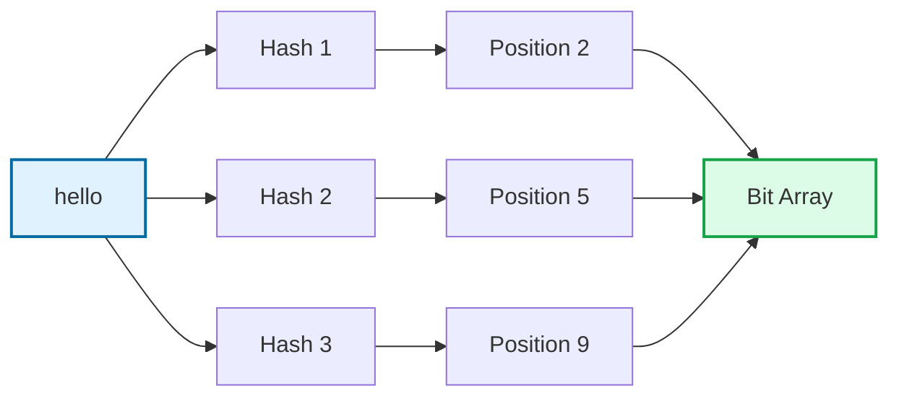
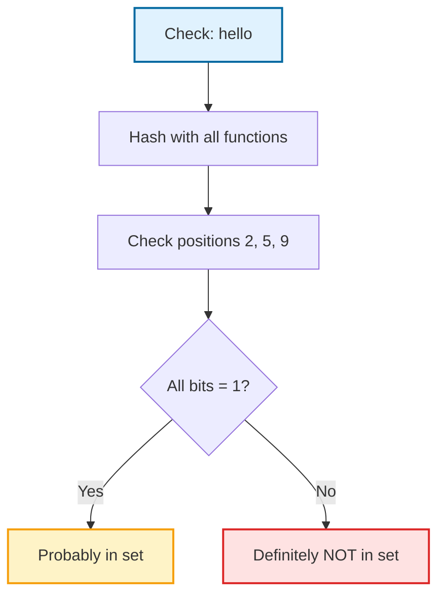
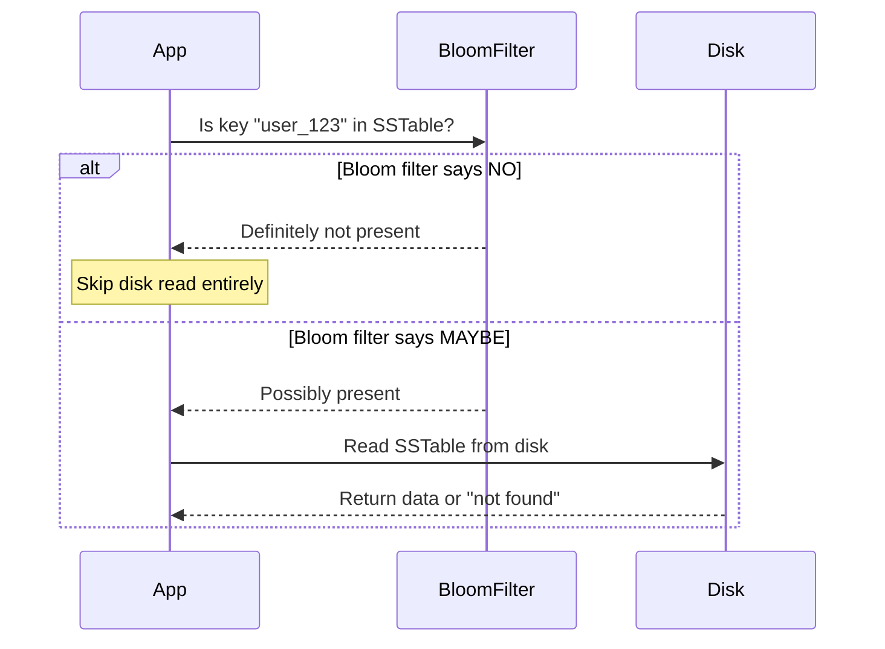

You are building a system that needs to check if a username is already taken. You have 100 million users. Storing all usernames in memory would use gigabytes of RAM.

But what if you could answer "is this username taken?" using only 120 MB of memory? And the check takes constant time, regardless of how many users you have?

That is what Bloom filters do. They trade perfect accuracy for massive memory savings. And for many use cases, that trade-off is worth it.

## What is a Bloom Filter?

A Bloom filter is a data structure that answers one question: **"Is this element in the set?"**

The answer is either:
- **Definitely NO** - the element is not in the set
- **Probably YES** - the element might be in the set

That "probably" is important. Bloom filters can have false positives. They might say "yes" when the answer is actually "no". But they never have false negatives. If they say "no", the element is definitely not there.

Think of it like a bouncer with a fuzzy memory. He never forgets someone who is actually on the guest list. But occasionally he lets in someone who just looks familiar.

## Why Would You Accept False Positives?

Because the memory savings are dramatic.

Let's say you want to track 1 billion usernames. A traditional hash set would need to store all those strings. With an average username of 15 characters, that's at least 15 GB just for the strings, plus hash table overhead. Call it 20 GB or more.

A Bloom filter for the same 1 billion items with 1% false positive rate needs about 1.2 GB. That's 16x less memory.

| Approach | Memory for 1 Billion Items |
|----------|---------------------------|
| Hash Set (storing strings) | ~20 GB |
| Bloom Filter (1% false positive) | ~1.2 GB |
| Bloom Filter (0.1% false positive) | ~1.8 GB |

The trick is that a Bloom filter does not store the actual elements. It just stores enough information to answer "maybe" or "definitely not".

## How Bloom Filters Work

A Bloom filter has two components:

1. **A bit array** - a fixed-size array of bits, all initialized to 0
2. **Multiple hash functions** - functions that map any input to a position in the array

### Adding an Element

To add "hello" to the filter:

1. Hash "hello" with each hash function
2. Each hash gives you a position in the bit array
3. Set all those positions to 1



After adding "hello", positions 2, 5, and 9 are set to 1:

```
Index:  0  1  2  3  4  5  6  7  8  9  10 11
Bits:   0  0  1  0  0  1  0  0  0  1  0  0
```

### Checking for an Element

To check if "hello" exists:

1. Hash "hello" with the same hash functions
2. Check if ALL those positions are 1
3. If any position is 0, "hello" was never added
4. If all positions are 1, "hello" was probably added



### Where False Positives Come From

Let's add another element, "world":

```
Before adding "world":
Index:  0  1  2  3  4  5  6  7  8  9  10 11
Bits:   0  0  1  0  0  1  0  0  0  1  0  0

Hash("world") → positions 2, 7, 10

After adding "world":
Index:  0  1  2  3  4  5  6  7  8  9  10 11
Bits:   0  0  1  0  0  1  0  1  0  1  1  0
```

Notice that position 2 was already set by "hello". No problem, it stays at 1.

Now imagine we check for "foo", which was never added:

```
Hash("foo") → positions 2, 5, 9
```

We check positions 2, 5, and 9. They are all 1 (set by "hello"). The Bloom filter says "probably yes" even though "foo" was never added. That is a false positive.

The more elements you add, the more bits get set to 1, and the higher the chance of false positives.

## The Math Behind Bloom Filters

The false positive probability depends on three things:

- **m** = size of the bit array
- **n** = number of elements inserted
- **k** = number of hash functions

The false positive probability is approximately:

```
p = (1 - e^(-kn/m))^k
```

To achieve a target false positive rate p with n elements, the optimal settings are:

```
m = -(n × ln(p)) / (ln(2)^2)
k = (m/n) × ln(2)
```

In plain English:

| Elements | Target False Positive | Bit Array Size | Hash Functions |
|----------|----------------------|----------------|----------------|
| 10,000 | 1% | ~12 KB | 7 |
| 100,000 | 1% | ~120 KB | 7 |
| 1,000,000 | 1% | ~1.2 MB | 7 |
| 1,000,000 | 0.1% | ~1.8 MB | 10 |
| 10,000,000 | 1% | ~12 MB | 7 |

For most applications, 7 hash functions with 10 bits per element gives about 1% false positive rate.

## Where Bloom Filters Are Used

Bloom filters show up everywhere in production systems.

### Databases: Avoiding Disk Reads

Google Bigtable, Apache HBase, Apache Cassandra, and LevelDB all use Bloom filters.

When you query for a row that does not exist, the database could search the entire data file on disk. That is slow. Instead, it checks a Bloom filter first:



Cassandra reports that Bloom filters typically prevent 90%+ of unnecessary disk reads. For workloads with many queries for non-existent keys, this is a massive performance win.

### Web Browsers: Malicious URL Checking

Google Chrome needs to check if a URL is in the list of known malicious sites. The full list is too large to download to every browser. Instead, Chrome uses a Bloom filter:

1. A compact Bloom filter is distributed with the browser
2. When you visit a URL, Chrome checks the local Bloom filter
3. If it says "no", the URL is safe
4. If it says "maybe", Chrome checks the full list on Google's servers

This keeps most URL checks fast and local while catching dangerous sites.

### CDNs: Preventing Cache Pollution

Akamai uses Bloom filters to avoid caching "one-hit wonders" - content that is requested once and never again. Caching everything would fill the cache with useless data.

Their approach:

1. First request for content: add URL to Bloom filter, do not cache
2. Second request: check Bloom filter, it says "maybe", now cache it

Content needs at least two requests before it gets cached. The Bloom filter tracks what has been seen without storing every URL.

### Content Platforms: Tracking User History

Medium uses Bloom filters to track which articles a user has already seen. Instead of storing a list of article IDs per user, they store a Bloom filter per user.

When generating recommendations, they check the filter to avoid showing the same content twice. A false positive just means occasionally hiding an article the user has not seen. That is acceptable.

## Implementation Example

Here is a simple Bloom filter in Python:

```python
import hashlib
import math

class BloomFilter:
    def __init__(self, expected_elements, false_positive_rate):
        # Calculate optimal size and hash count
        self.size = self._optimal_size(expected_elements, false_positive_rate)
        self.hash_count = self._optimal_hash_count(self.size, expected_elements)
        self.bit_array = [0] * self.size
        
    def _optimal_size(self, n, p):
        """Calculate optimal bit array size."""
        m = -(n * math.log(p)) / (math.log(2) ** 2)
        return int(m)
    
    def _optimal_hash_count(self, m, n):
        """Calculate optimal number of hash functions."""
        k = (m / n) * math.log(2)
        return int(k)
    
    def _get_hash_positions(self, item):
        """Get all hash positions for an item."""
        positions = []
        for i in range(self.hash_count):
            # Create different hashes by appending seed
            hash_input = f"{item}:{i}".encode()
            hash_value = int(hashlib.sha256(hash_input).hexdigest(), 16)
            position = hash_value % self.size
            positions.append(position)
        return positions
    
    def add(self, item):
        """Add an item to the filter."""
        for position in self._get_hash_positions(item):
            self.bit_array[position] = 1
    
    def might_contain(self, item):
        """Check if item might be in the filter."""
        for position in self._get_hash_positions(item):
            if self.bit_array[position] == 0:
                return False  # Definitely not present
        return True  # Possibly present


# Usage
bf = BloomFilter(expected_elements=1000, false_positive_rate=0.01)

# Add some items
bf.add("hello")
bf.add("world")
bf.add("foo")

# Check membership
print(bf.might_contain("hello"))  # True (correct)
print(bf.might_contain("world"))  # True (correct)
print(bf.might_contain("bar"))    # False (correct)
print(bf.might_contain("baz"))    # Might be True (false positive possible)
```

For production use, use established libraries:

- **Python**: `pybloom-live`, `python-bloomfilter`
- **Java**: Guava's `BloomFilter`
- **Go**: `willf/bloom`
- **Redis**: Built-in Bloom filter module

## Bloom Filter Variants

The standard Bloom filter has limitations. Several variants address them.

### Counting Bloom Filter

**Problem**: Standard Bloom filters do not support deletion. You cannot set a bit back to 0 because other elements might share that position.

**Solution**: Instead of bits (0 or 1), use counters. Increment when adding, decrement when deleting.

```
Standard:  [0, 0, 1, 0, 0, 1, 0, 1, 0, 1, 0, 0]
Counting:  [0, 0, 2, 0, 0, 1, 0, 1, 0, 3, 0, 0]
```

Trade-off: 3-4x more memory because each position needs multiple bits to store a count.

### Scalable Bloom Filter

**Problem**: Standard Bloom filters have a fixed size. If you add more elements than expected, the false positive rate increases.

**Solution**: Start with a small filter. When it gets too full, add another filter on top. Check all filters when querying.

This is useful when you do not know the final size upfront.

### Cuckoo Filter

**Problem**: Standard Bloom filters do not support deletion and can have high false positive rates.

**Solution**: Use a different approach based on cuckoo hashing. Store fingerprints (short hashes) in buckets. Supports deletion and often has better performance than Bloom filters for the same memory.

Trade-off: More complex implementation.

## When to Use Bloom Filters

<div style="display: flex; gap: 20px; margin: 20px 0;">
<div style="flex: 1; background: #f0fdf4; border: 2px solid #16a34a; border-radius: 8px; padding: 20px;">
<h4 style="color: #166534; margin-top: 0;"><i class="fas fa-check"></i> Good Use Cases</h4>
<ul style="margin-bottom: 0;">
<li>Pre-filtering before expensive operations</li>
<li>Checking if a key exists before disk read</li>
<li>Tracking what a user has already seen</li>
<li>Detecting duplicate events in streaming data</li>
<li>Spell checkers and dictionary lookups</li>
<li>Network routers checking packet membership</li>
</ul>
</div>

<div style="flex: 1; background: #fef2f2; border: 2px solid #dc2626; border-radius: 8px; padding: 20px;">
<h4 style="color: #991b1b; margin-top: 0;"><i class="fas fa-times"></i> Avoid When</h4>
<ul style="margin-bottom: 0;">
<li>You need to retrieve the actual elements</li>
<li>False positives are not acceptable</li>
<li>You need to delete elements frequently</li>
<li>The dataset is small enough for a hash set</li>
<li>Security decisions depend on the result</li>
<li>You need exact counts</li>
</ul>
</div>
</div>

**The key question**: Can your application tolerate false positives?

If "yes" means triggering a secondary check (like reading from disk), that is usually fine. The Bloom filter is just an optimization.

If "yes" means letting someone into a system they should not access, do not use a Bloom filter.

## Performance Comparison

| Operation | Bloom Filter | Hash Set | Sorted Array |
|-----------|-------------|----------|--------------|
| Add | O(k) | O(1) average | O(n) |
| Lookup | O(k) | O(1) average | O(log n) |
| Space (1M items) | ~1.2 MB | ~20 MB | ~15 MB |
| False Positives | Yes (configurable) | No | No |
| Delete | No (standard) | Yes | Yes |

**What does O(k) mean?** It means the operation takes time proportional to k, the number of hash functions. To add an element, you compute k hashes and set k bits. To check membership, you compute k hashes and check k bits. Since k is small and fixed (typically 7-10), this is effectively constant time. Whether you have 1,000 or 1 billion elements, lookups still take the same number of operations.

## Key Takeaways

1. **Bloom filters trade accuracy for memory.** They can tell you if something is "definitely not" or "probably yes" in the set.

2. **False positives are possible, false negatives are not.** If the filter says no, the element was never added.

3. **Memory savings are massive.** 16x or more compared to storing actual elements.

4. **Real systems use them everywhere.** Cassandra, HBase, Bigtable, Chrome, Akamai, Medium, and many more.

5. **Choose parameters based on your tolerance.** More memory means fewer false positives.

6. **Standard Bloom filters do not support deletion.** Use Counting Bloom Filters if you need to remove elements.

7. **They are a building block, not a complete solution.** Bloom filters work best as a first-line check before more expensive operations.

---

*For more on probabilistic data structures, check out [HyperLogLog Explained](/data-structures/hyperloglog/) for cardinality estimation, [Count-Min Sketch Explained](/data-structures/count-min-sketch/) for frequency counting, and [Skip List Explained](/data-structures/skip-list/) for probabilistic sorted data. For related topics, see [Hash Table Collisions Explained](/data-structures/hashtable-collisions/) and [Database Indexing Explained](/database-indexing-explained/).*

*References: [Bloom Filter on Wikipedia](https://en.wikipedia.org/wiki/Bloom_filter), [Apache Cassandra Bloom Filters](https://cassandra.apache.org/doc/4.1/cassandra/operating/bloom_filters.html), [Redis Bloom Filter](https://redis.io/docs/latest/develop/data-types/probabilistic/bloom-filter/)*
