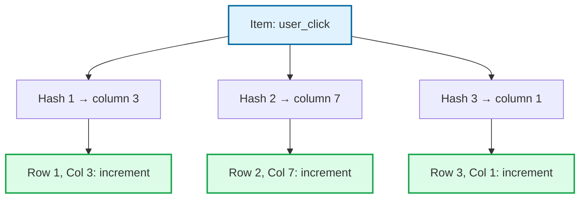
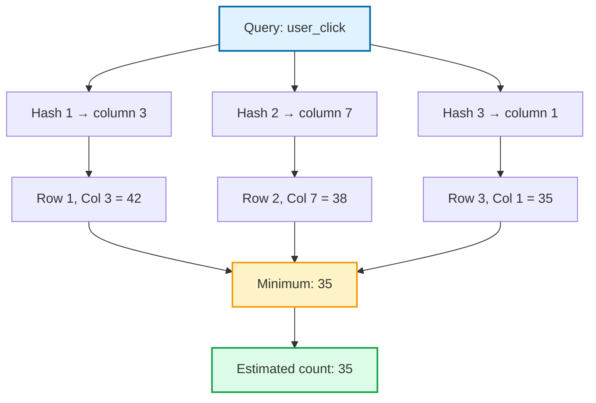

You are processing a stream of 1 billion events. You want to know which events occur most frequently. Storing a counter for every unique event would need gigabytes of memory.

But what if you could track frequencies using just a few megabytes? And still identify the top 100 most common events accurately?

That is what Count-Min Sketch does. It gives you approximate frequency counts using fixed memory, no matter how large the stream.

## What is Count-Min Sketch?

Count-Min Sketch is a data structure that answers: **"How many times has this item appeared?"**

It tracks frequencies in a data stream without storing every item. You can ask "how many times did event X happen?" and get an approximate answer.

The key trade-off: it might overestimate, but it never underestimates. If it says an item appeared 1000 times, the true count is at most 1000 (usually less due to collisions).

## How It Works

Count-Min Sketch uses a 2D array with **d rows** and **w columns**. Each row has its own hash function.

### Adding an Item

When an item arrives:

1. Hash it with each of the d hash functions
2. Each hash gives a column index for that row
3. Increment the counter at each (row, column) position



### Querying a Count

To estimate how many times an item appeared:

1. Hash it with all d hash functions (same as insert)
2. Look up the counter at each (row, column) position
3. Return the **minimum** of all those counters

Why the minimum? Because collisions can only increase counters. Other items might have incremented some of the same counters. But at least one counter (the minimum) is likely to have fewer collisions, giving a better estimate.



## Visual Example

Let's trace through a small example with a 3x8 sketch (3 rows, 8 columns):

```
Initial state (all zeros):
Row 1: [0, 0, 0, 0, 0, 0, 0, 0]
Row 2: [0, 0, 0, 0, 0, 0, 0, 0]
Row 3: [0, 0, 0, 0, 0, 0, 0, 0]

Add "apple" (hashes to columns 2, 5, 1):
Row 1: [0, 0, 1, 0, 0, 0, 0, 0]
Row 2: [0, 0, 0, 0, 0, 1, 0, 0]
Row 3: [0, 1, 0, 0, 0, 0, 0, 0]

Add "banana" (hashes to columns 4, 5, 6):
Row 1: [0, 0, 1, 0, 1, 0, 0, 0]
Row 2: [0, 0, 0, 0, 0, 2, 0, 0]  <- collision with apple!
Row 3: [0, 1, 0, 0, 0, 0, 1, 0]

Add "apple" again (same columns 2, 5, 1):
Row 1: [0, 0, 2, 0, 1, 0, 0, 0]
Row 2: [0, 0, 0, 0, 0, 3, 0, 0]
Row 3: [0, 2, 0, 0, 0, 0, 1, 0]

Query "apple":
Row 1, col 2 = 2
Row 2, col 5 = 3  <- overestimate due to banana collision
Row 3, col 1 = 2
Minimum = 2 ✓ (correct!)

Query "banana":
Row 1, col 4 = 1
Row 2, col 5 = 3  <- overestimate
Row 3, col 6 = 1
Minimum = 1 ✓ (correct!)
```

Even with collisions, the minimum gives the correct answer in this case. With larger sketches, collisions become less likely.

## Choosing Parameters

The sketch has two parameters:

- **Width (w)**: Number of columns. More columns = fewer collisions = better accuracy
- **Depth (d)**: Number of rows/hash functions. More depth = higher probability of accuracy

The error guarantees are:

```
With probability at least (1 - delta):
  estimated_count <= true_count + epsilon * total_stream_count

Where:
  epsilon = e / w  (e ≈ 2.718)
  delta = e^(-d)
```

In practice:

| Width | Depth | Memory | Error Bound | Confidence |
|-------|-------|--------|-------------|------------|
| 272 | 5 | 5 KB | ~1% | 99.3% |
| 2,718 | 5 | 54 KB | ~0.1% | 99.3% |
| 2,718 | 7 | 76 KB | ~0.1% | 99.9% |
| 27,183 | 5 | 544 KB | ~0.01% | 99.3% |

For most applications, a few hundred KB gives excellent results.

## Why It Never Underestimates

This is a key property of Count-Min Sketch.

Every time an item is added, its counters are incremented. Other items might also increment those counters (collisions), but nothing ever decrements them.

So when you query:
- The true count is the number of times we incremented for this specific item
- Each counter holds that count plus possibly some extra from collisions
- The minimum is at least the true count
- Therefore: **estimate >= true count**, always

This makes Count-Min Sketch useful when overestimating is safer than underestimating. For example, detecting abuse: better to flag some false positives than miss real abusers.

## Finding Heavy Hitters

A common use case is finding "heavy hitters": items that appear more than a threshold percentage of the stream.

Simple approach:
1. Maintain a Count-Min Sketch and a total count
2. Also maintain a heap of candidate items
3. When adding an item, check if its estimated count exceeds threshold
4. If so, add it to the candidate heap
5. Periodically prune the heap

```python
class HeavyHitterTracker:
    def __init__(self, threshold_pct, width, depth):
        self.cms = CountMinSketch(width, depth)
        self.threshold = threshold_pct / 100
        self.total = 0
        self.candidates = {}  # item -> last known count
    
    def add(self, item):
        self.cms.add(item)
        self.total += 1
        
        estimate = self.cms.query(item)
        threshold_count = self.total * self.threshold
        
        if estimate >= threshold_count:
            self.candidates[item] = estimate
    
    def get_heavy_hitters(self):
        threshold_count = self.total * self.threshold
        return {
            item: count 
            for item, count in self.candidates.items()
            if self.cms.query(item) >= threshold_count
        }
```

## Where Count-Min Sketch is Used

### Network Traffic Analysis

Track byte counts per IP address to detect DDoS attacks or bandwidth hogs:

```python
# Every packet
cms.add(source_ip, packet_size)

# Find IPs using most bandwidth
for ip in suspected_ips:
    bytes_sent = cms.query(ip)
    if bytes_sent > threshold:
        flag_for_review(ip)
```

### Click Tracking

Count clicks on URLs or ads without storing every URL:

```python
# Record click
cms.add(clicked_url)

# Get click count for a URL
clicks = cms.query("/product/123")
```

### Database Query Optimization

Track which values appear frequently in a column to improve query planning:

```sql
-- PostgreSQL uses sketches internally for statistics
ANALYZE my_table;

-- Query planner uses frequency estimates
EXPLAIN SELECT * FROM my_table WHERE status = 'active';
```

### Natural Language Processing

Count word frequencies in large text corpora:

```python
for document in corpus:
    for word in document.words():
        cms.add(word)

# Estimate frequency of any word
freq = cms.query("the")
```

### Redis

Redis has built-in Count-Min Sketch support:

```bash
# Create sketch with error rate and probability
CMS.INITBYPROB my_sketch 0.001 0.01

# Add items
CMS.INCRBY my_sketch item1 1 item2 5

# Query counts
CMS.QUERY my_sketch item1 item2
```

## Implementation Example

Here is a simple Count-Min Sketch in Python:

```python
import hashlib

class CountMinSketch:
    def __init__(self, width, depth):
        self.width = width
        self.depth = depth
        self.table = [[0] * width for _ in range(depth)]
    
    def _hash(self, item, seed):
        """Generate hash for item with given seed."""
        h = hashlib.sha256(f"{seed}:{item}".encode()).hexdigest()
        return int(h, 16) % self.width
    
    def add(self, item, count=1):
        """Add item to the sketch."""
        for i in range(self.depth):
            j = self._hash(item, i)
            self.table[i][j] += count
    
    def query(self, item):
        """Estimate count of item."""
        estimates = []
        for i in range(self.depth):
            j = self._hash(item, i)
            estimates.append(self.table[i][j])
        return min(estimates)
    
    def merge(self, other):
        """Merge another sketch into this one."""
        for i in range(self.depth):
            for j in range(self.width):
                self.table[i][j] += other.table[i][j]


# Usage
cms = CountMinSketch(width=1000, depth=5)

# Simulate a stream
import random
items = ["apple"] * 1000 + ["banana"] * 500 + ["cherry"] * 100
random.shuffle(items)

for item in items:
    cms.add(item)

# Query
print(f"apple: {cms.query('apple')}")   # Should be ~1000
print(f"banana: {cms.query('banana')}") # Should be ~500
print(f"cherry: {cms.query('cherry')}") # Should be ~100
print(f"grape: {cms.query('grape')}")   # Should be 0 or small (collisions)
```

For production use, consider `redis-py` with Redis's CMS commands, or the `datasketches` library.

## Merging Sketches

Like HyperLogLog, Count-Min Sketches are mergeable:

```python
def merge(cms1, cms2):
    result = CountMinSketch(cms1.width, cms1.depth)
    for i in range(cms1.depth):
        for j in range(cms1.width):
            result.table[i][j] = cms1.table[i][j] + cms2.table[i][j]
    return result
```

This is addition, not max (unlike HyperLogLog). The merged sketch tracks the combined counts from both streams.

Use case: each server tracks local events, then you merge periodically to get global counts.

## When to Use Count-Min Sketch

<div style="display: flex; gap: 20px; margin: 20px 0;">
<div style="flex: 1; background: #f0fdf4; border: 2px solid #16a34a; border-radius: 8px; padding: 20px;">
<h4 style="color: #166534; margin-top: 0;"><i class="fas fa-check"></i> Good Use Cases</h4>
<ul style="margin-bottom: 0;">
<li>Finding heavy hitters in streams</li>
<li>Approximate frequency counts</li>
<li>Tracking popular items in real-time</li>
<li>Network traffic analysis</li>
<li>Rate limiting by frequency</li>
<li>Any "top K" or "most frequent" problem</li>
</ul>
</div>

<div style="flex: 1; background: #fef2f2; border: 2px solid #dc2626; border-radius: 8px; padding: 20px;">
<h4 style="color: #991b1b; margin-top: 0;"><i class="fas fa-times"></i> Avoid When</h4>
<ul style="margin-bottom: 0;">
<li>You need exact counts</li>
<li>Underestimation would be a problem</li>
<li>You need to list all items</li>
<li>The dataset fits in memory</li>
<li>You need to delete items</li>
</ul>
</div>
</div>

## Comparison with Other Structures

| Structure | Question It Answers | Error Type | Memory |
|-----------|-------------------|------------|--------|
| Hash Map | Exact count of item | None (exact) | O(n) unique items |
| Count-Min Sketch | Approximate count | Overestimate only | O(w * d), fixed |
| Bloom Filter | Is item in set? | False positives | O(n), fixed |
| HyperLogLog | How many unique items? | +/- error | O(1), fixed |

Use Count-Min Sketch when you need frequencies. Use Bloom Filter for membership. Use HyperLogLog for cardinality.

## Key Takeaways

1. **Count-Min Sketch tracks frequencies** in streams using fixed memory.

2. **It uses multiple hash functions** and takes the minimum count as the estimate.

3. **It never underestimates** but can overestimate due to hash collisions.

4. **Perfect for heavy hitters**: finding the most frequent items in large streams.

5. **Mergeable by addition**: combine sketches from distributed nodes.

6. **Choose width and depth** based on your acceptable error and confidence requirements.

7. **Real systems use it**: network monitoring, database statistics, rate limiting, and more.

---

*For more on probabilistic data structures, check out [Bloom Filters Explained](/data-structures/bloom-filter/) for membership testing and [HyperLogLog Explained](/data-structures/hyperloglog/) for cardinality estimation. For related topics, see [Hash Table Collisions Explained](/data-structures/hashtable-collisions/) and [Database Indexing Explained](/database-indexing-explained/).*

*References: [Count-Min Sketch on Wikipedia](https://en.wikipedia.org/wiki/Count%E2%80%93min_sketch), [Original Paper by Cormode and Muthukrishnan](http://dimacs.rutgers.edu/~graham/pubs/papers/cm-full.pdf), [Redis Count-Min Sketch](https://redis.io/docs/latest/develop/data-types/probabilistic/count-min-sketch/)*
