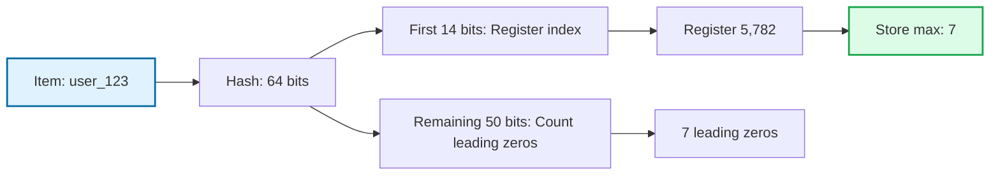
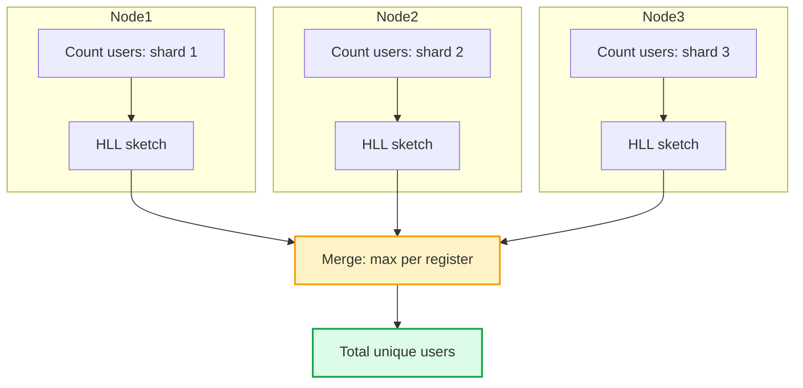

You are building an analytics dashboard. You need to show "unique visitors today" for a site with 100 million page views. Storing every visitor ID to count uniques would need gigabytes of memory.

But what if you could get that unique count with only 12 KB of memory? And the answer would be accurate within 1%?

That is what HyperLogLog does. It trades a tiny bit of accuracy for massive memory savings. And for analytics, that trade-off is almost always worth it.

## What is HyperLogLog?

HyperLogLog is an algorithm that answers one question: **"How many unique items are in this set?"**

This is called cardinality estimation. You want to count distinct elements without storing all of them.

The key insight is that you do not need to remember every item to estimate how many unique items you have seen. You just need to track a statistical property of the data that correlates with cardinality.

## The Core Idea: Leading Zeros

Here is the intuition behind HyperLogLog.

When you hash items uniformly, about half the hashes will start with 0, about a quarter will start with 00, about an eighth will start with 000, and so on.

If you see a hash starting with 10 leading zeros, you have probably seen around 2^10 = 1024 unique items. Seeing that many leading zeros is rare, and it only happens when you have processed enough items.

```
Leading zeros:  Probability of seeing at least one
0               100% (half of all hashes start with 0)
5               ~3% (need ~32 items on average)
10              ~0.1% (need ~1024 items on average)
20              ~0.0001% (need ~1 million items)
```

By tracking the maximum number of leading zeros you have ever seen, you get an estimate of how many unique items have passed through.

## Why Multiple Registers?

Using just one maximum is too noisy. You might get lucky (or unlucky) and see an unusually high or low leading zero count.

HyperLogLog fixes this by using many "registers" (buckets). It:

1. Hashes each item
2. Uses some bits of the hash to pick a register
3. Uses remaining bits to count leading zeros
4. Stores the maximum leading zero count in that register

With 16,384 registers, you get 16,384 independent samples. Combining them with a harmonic mean smooths out the noise.



## How the Algorithm Works

Here is the step-by-step process:

### Adding an Element

```
1. Hash the element to get a 64-bit value
2. Use first b bits to select register index (0 to 2^b - 1)
3. Look at remaining bits, count leading zeros + 1 = rho
4. Update: register[index] = max(register[index], rho)
```

### Estimating Cardinality

```
1. Compute harmonic mean: Z = 1 / sum(2^(-register[i]))
2. Raw estimate: E = alpha * m^2 * Z
   (alpha is a bias correction constant, m is register count)
3. Apply small/large range corrections if needed
4. Return the estimate
```

The harmonic mean is used instead of arithmetic mean because it is less sensitive to outliers. One register with an unusually high value will not skew the entire estimate.

## Visual Example

Let's trace through adding three items to a tiny HyperLogLog with 8 registers (m=8, using 3 bits for register selection):

```
Add "apple":
  hash("apple") = 0b 101 00001...  (binary)
  Register index = 101 = 5
  Leading zeros in remaining bits = 4
  registers[5] = max(0, 4+1) = 5

Add "banana":
  hash("banana") = 0b 011 00000001...
  Register index = 011 = 3
  Leading zeros = 7
  registers[3] = max(0, 7+1) = 8

Add "apple" again:
  Same hash as before
  Register index = 5
  Leading zeros = 4
  registers[5] = max(5, 5) = 5  (no change, duplicate!)

Registers after: [0, 0, 0, 8, 0, 5, 0, 0]
```

The duplicate "apple" did not change anything. HyperLogLog naturally handles duplicates because the same item always hashes to the same register with the same leading zero count.

## Memory and Accuracy Trade-off

The beauty of HyperLogLog is the predictable trade-off:

| Registers (m) | Memory | Standard Error |
|---------------|--------|----------------|
| 16 | 80 bytes | 26% |
| 64 | 320 bytes | 13% |
| 256 | 1.3 KB | 6.5% |
| 1,024 | 5 KB | 3.25% |
| 16,384 | 12 KB | 0.81% |
| 65,536 | 48 KB | 0.41% |

The error formula is: **standard error = 1.04 / sqrt(m)**

Redis uses 16,384 registers by default, giving about 0.81% error with 12 KB of memory. This means if the true count is 1,000,000, HyperLogLog will typically report between 991,900 and 1,008,100.

For most analytics, that is plenty accurate.

## Merging HyperLogLog Sketches

One of the best features of HyperLogLog is mergeability. If you have two HyperLogLog sketches tracking different data, you can combine them:

```python
def merge(hll1, hll2):
    result = HyperLogLog()
    for i in range(num_registers):
        result.registers[i] = max(hll1.registers[i], hll2.registers[i])
    return result
```

The merged sketch gives the cardinality of the union of both sets.

This is perfect for distributed systems:



Each node counts locally, then you merge at the end. No need to send raw data around.

## Where HyperLogLog is Used

### Redis

Redis has built-in HyperLogLog support:

```bash
# Add elements
PFADD visitors user_1 user_2 user_3

# Get unique count
PFCOUNT visitors
# Returns: 3

# Merge multiple keys
PFMERGE all_visitors visitors_today visitors_yesterday
```

Redis uses only 12 KB per key, regardless of how many elements you add.

### Google BigQuery

BigQuery's `APPROX_COUNT_DISTINCT` uses HyperLogLog:

```sql
SELECT APPROX_COUNT_DISTINCT(user_id) AS unique_users
FROM events
WHERE date = '2024-01-15'
```

This is much faster than exact `COUNT(DISTINCT user_id)` on large tables.

### Apache Spark

Spark's `approx_count_distinct` function:

```python
from pyspark.sql.functions import approx_count_distinct

df.agg(approx_count_distinct("user_id", 0.05))  # 5% error
```

### Other Systems

- **Presto/Trino**: `approx_distinct()`
- **PostgreSQL**: `hll` extension
- **Druid**: Built-in HyperLogLog aggregator
- **Elasticsearch**: `cardinality` aggregation

## Implementation Example

Here is a simplified HyperLogLog in Python:

```python
import hashlib
import math

class HyperLogLog:
    def __init__(self, b=14):  # b=14 means 2^14 = 16384 registers
        self.b = b
        self.m = 1 << b  # number of registers
        self.registers = [0] * self.m
        
        # Bias correction constant
        if self.m >= 128:
            self.alpha = 0.7213 / (1 + 1.079 / self.m)
        elif self.m == 64:
            self.alpha = 0.709
        elif self.m == 32:
            self.alpha = 0.697
        else:
            self.alpha = 0.673
    
    def _hash(self, item):
        """Hash item to 64-bit integer."""
        h = hashlib.sha256(str(item).encode()).hexdigest()
        return int(h[:16], 16)  # Use first 64 bits
    
    def _leading_zeros(self, value, max_bits=50):
        """Count leading zeros in binary representation."""
        if value == 0:
            return max_bits
        count = 0
        for i in range(max_bits - 1, -1, -1):
            if value & (1 << i):
                break
            count += 1
        return count
    
    def add(self, item):
        """Add an item to the HyperLogLog."""
        x = self._hash(item)
        
        # First b bits determine the register
        j = x >> (64 - self.b)
        
        # Remaining bits used for leading zero count
        w = x & ((1 << (64 - self.b)) - 1)
        rho = self._leading_zeros(w, 64 - self.b) + 1
        
        # Update register with max
        self.registers[j] = max(self.registers[j], rho)
    
    def count(self):
        """Estimate the cardinality."""
        # Harmonic mean
        Z = sum(2.0 ** (-r) for r in self.registers)
        E = self.alpha * self.m * self.m / Z
        
        # Small range correction (linear counting)
        if E <= 2.5 * self.m:
            V = self.registers.count(0)  # Empty registers
            if V > 0:
                E = self.m * math.log(self.m / V)
        
        return int(E)
    
    def merge(self, other):
        """Merge another HyperLogLog into this one."""
        for i in range(self.m):
            self.registers[i] = max(self.registers[i], other.registers[i])


# Usage
hll = HyperLogLog()

# Add 1 million items
for i in range(1_000_000):
    hll.add(f"user_{i}")

print(f"Estimated: {hll.count()}")
print(f"Actual: 1,000,000")
print(f"Error: {abs(hll.count() - 1_000_000) / 1_000_000 * 100:.2f}%")
```

For production, use established libraries like `redis-py`, `datasketch`, or your database's built-in functions.

## When to Use HyperLogLog

<div style="display: flex; gap: 20px; margin: 20px 0;">
<div style="flex: 1; background: #f0fdf4; border: 2px solid #16a34a; border-radius: 8px; padding: 20px;">
<h4 style="color: #166534; margin-top: 0;"><i class="fas fa-check"></i> Good Use Cases</h4>
<ul style="margin-bottom: 0;">
<li>Counting unique visitors to a website</li>
<li>Distinct user counts in analytics</li>
<li>Unique IP addresses in network logs</li>
<li>Cardinality estimation before joins</li>
<li>Deduplication estimates in data pipelines</li>
<li>Any "how many unique X" question at scale</li>
</ul>
</div>

<div style="flex: 1; background: #fef2f2; border: 2px solid #dc2626; border-radius: 8px; padding: 20px;">
<h4 style="color: #991b1b; margin-top: 0;"><i class="fas fa-times"></i> Avoid When</h4>
<ul style="margin-bottom: 0;">
<li>You need exact counts (billing, compliance)</li>
<li>You need to know which items are unique</li>
<li>Small datasets that fit in memory</li>
<li>You need per-item frequencies</li>
<li>Error of 1% is not acceptable</li>
</ul>
</div>
</div>

## Comparison with Alternatives

| Approach | Memory for 1B uniques | Accuracy | Notes |
|----------|----------------------|----------|-------|
| Hash Set | ~8 GB | Exact | Stores all items |
| Sorted Set | ~8 GB | Exact | Slower than hash set |
| Bitmap | 125 MB | Exact | Only for integer IDs in range |
| HyperLogLog | 12 KB | ~1% error | Cannot list items |
| Bloom Filter | ~1.2 GB | Membership only | Cannot count |

HyperLogLog is the clear winner when you only need the count and can tolerate small error.

## Key Takeaways

1. **HyperLogLog estimates unique counts** using fixed memory, regardless of dataset size.

2. **It works by tracking leading zeros** in hashed values across many registers.

3. **Standard error is about 1%** with 12 KB of memory. More memory means less error.

4. **Sketches are mergeable** by taking the max per register. Perfect for distributed counting.

5. **Major systems use it**: Redis (PFADD/PFCOUNT), BigQuery, Spark, Presto, and more.

6. **Use it for analytics** where approximate answers are fine. Avoid it when you need exact counts or the actual items.

---

*For more on probabilistic data structures, check out [Bloom Filters Explained](/data-structures/bloom-filter/) for membership testing and [Count-Min Sketch Explained](/data-structures/count-min-sketch/) for frequency counting. For related topics, see [Hash Table Collisions Explained](/data-structures/hashtable-collisions/) and [Database Indexing Explained](/database-indexing-explained/).*

*References: [HyperLogLog on Wikipedia](https://en.wikipedia.org/wiki/HyperLogLog), [Redis HyperLogLog](https://redis.io/docs/latest/develop/data-types/probabilistic/hyperloglogs/), [HyperLogLog in Practice (Google)](https://research.google/pubs/pub40671/)*
