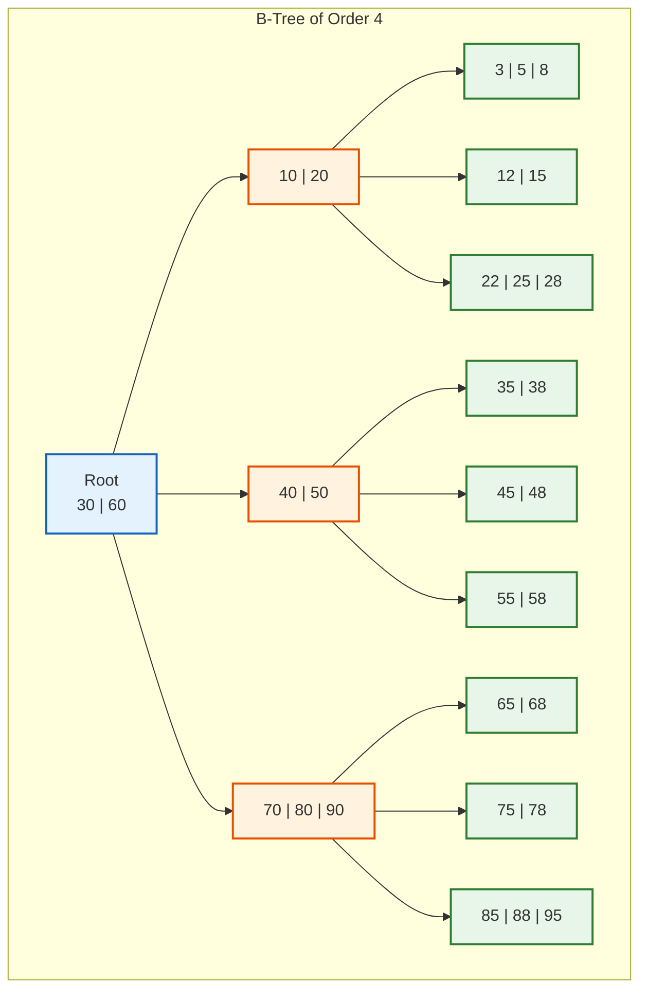
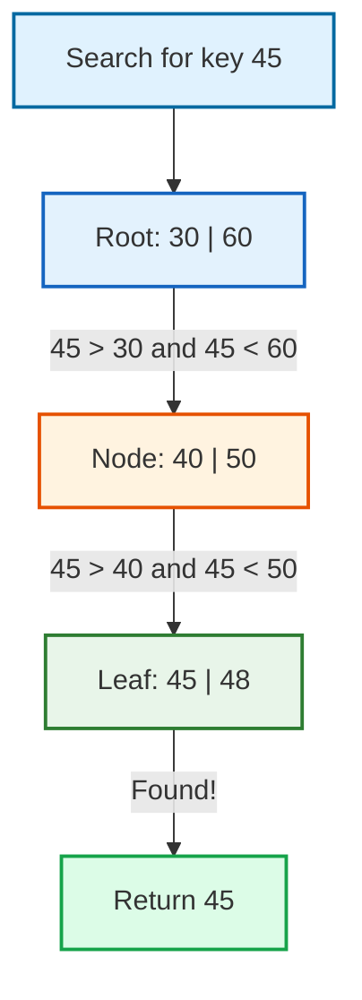
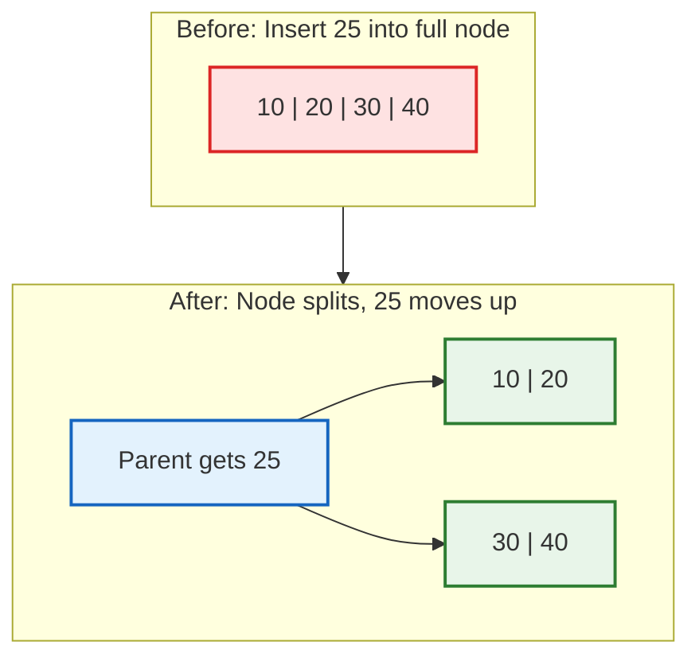
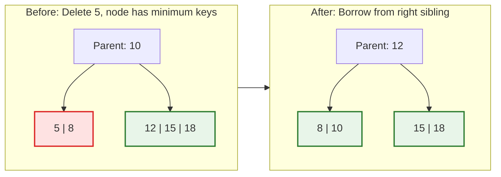
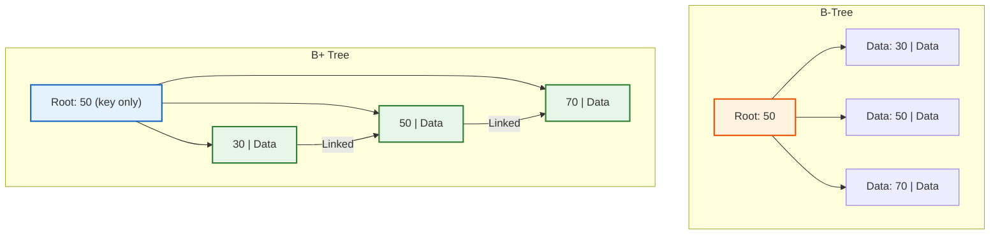
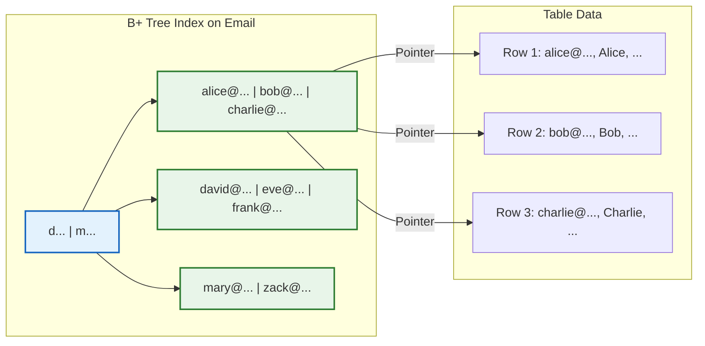

Every time you run a database query, a B-tree is doing the heavy lifting. That SELECT statement that returns in 2 milliseconds from a table with 50 million rows? A B-tree made that possible.

B-trees are one of those data structures that every software developer should understand. Not because you will implement one from scratch (you probably will not), but because knowing how they work helps you write better queries, design better schemas, and understand why your database does what it does.

This guide covers everything you need to know about B-trees as a software developer. No academic jargon. Just practical knowledge that will help you build faster systems.

## What is a B-Tree?

A B-tree is a self-balancing tree data structure designed for systems that read and write large blocks of data. It was invented in 1970 by Rudolf Bayer and Edward McCreight at Boeing Research Labs.

The key insight behind B-trees: disk access is slow. Reading from a hard drive or SSD is thousands of times slower than reading from RAM. B-trees minimize disk access by keeping the tree very shallow and packing many keys into each node.

Here is what makes B-trees different from binary search trees:

| Property | Binary Search Tree | B-Tree |
|----------|-------------------|--------|
| Children per node | At most 2 | Many (often hundreds) |
| Tree height for 1 billion keys | ~30 levels | ~3-4 levels |
| Disk reads per search | ~30 | ~3-4 |
| Optimized for | Memory | Disk storage |

A binary search tree with 1 billion records would require about 30 disk reads to find any key. A B-tree with the same data needs just 3 or 4. That difference is why every major database uses B-trees.

## B-Tree Structure

A B-tree node contains multiple keys and multiple child pointers. The keys divide the child pointers into ranges.



In this B-tree:
- The root node has 2 keys (30, 60) and 3 children
- Keys less than 30 are in the left subtree
- Keys between 30 and 60 are in the middle subtree
- Keys greater than 60 are in the right subtree

### <i class="fas fa-list-ol"></i> B-Tree Properties

For a B-tree of order **m** (also called degree or branching factor):

1. **Maximum children per node**: m
2. **Maximum keys per node**: m - 1
3. **Minimum children for internal nodes**: ⌈m/2⌉
4. **Minimum keys for internal nodes**: ⌈m/2⌉ - 1
5. **All leaf nodes are at the same level**
6. **Keys within a node are sorted**

For example, a B-tree of order 5:
- Each node can have at most 5 children and 4 keys
- Internal nodes must have at least 3 children and 2 keys
- The root can have as few as 2 children (or be a leaf)

### Why These Properties Matter

These rules keep the tree balanced and efficient:

| Property | Purpose |
|----------|---------|
| Max children = m | Limits node size to fit in one disk block |
| Min children = ⌈m/2⌉ | Prevents tree from becoming too sparse |
| All leaves at same level | Guarantees O(log n) search time |
| Sorted keys | Enables binary search within nodes |

## How B-Tree Search Works

Searching in a B-tree starts at the root and works down to a leaf.



**Algorithm**:
1. Start at the root node
2. Use binary search to find the key or determine which child to visit
3. If key is found, return it
4. If at a leaf and key not found, return "not found"
5. Otherwise, follow the appropriate child pointer and repeat

**Time Complexity**: O(log n)

More precisely, the number of disk reads is O(log_m n) where m is the order. For a B-tree of order 1000 with 1 billion keys:
- Height = log_1000(1,000,000,000) ≈ 3

Three disk reads to find any key among a billion. That is the power of B-trees.

```python
def search(node, key):
    """Search for a key in a B-tree."""
    i = 0
    
    # Find the first key greater than or equal to search key
    while i < len(node.keys) and key > node.keys[i]:
        i += 1
    
    # If key is found in this node
    if i < len(node.keys) and key == node.keys[i]:
        return (node, i)
    
    # If this is a leaf node, key is not present
    if node.is_leaf:
        return None
    
    # Go to the appropriate child
    return search(node.children[i], key)
```

## How B-Tree Insertion Works

Insertion in a B-tree maintains balance by splitting nodes when they become too full.

### Step 1: Find the Correct Leaf

First, search for where the key should go. Insertions always happen at leaf nodes.

### Step 2: Insert if Room

If the leaf has fewer than m-1 keys, just insert the key in sorted order. Done.

### Step 3: Split if Full

If the leaf has m-1 keys (full), we need to split:

1. Insert the new key (node now has m keys temporarily)
2. Split the node into two nodes
3. Move the middle key up to the parent
4. If the parent is also full, split it too
5. Repeat up to the root if necessary



### How Tree Height Increases

The only way a B-tree gets taller is when the root splits. When this happens:

1. The root splits into two nodes
2. A new root is created with one key (the middle key)
3. The new root has two children (the split nodes)

This is different from binary search trees where height increases at the leaves. B-trees grow upward from the root.

```python
def insert(root, key):
    """Insert a key into a B-tree."""
    if root.is_full():
        # Tree grows in height
        new_root = BTreeNode()
        new_root.children.append(root)
        split_child(new_root, 0)
        insert_non_full(new_root, key)
        return new_root
    else:
        insert_non_full(root, key)
        return root

def insert_non_full(node, key):
    """Insert key into a node that is not full."""
    i = len(node.keys) - 1
    
    if node.is_leaf:
        # Insert key in sorted position
        node.keys.append(None)
        while i >= 0 and key < node.keys[i]:
            node.keys[i + 1] = node.keys[i]
            i -= 1
        node.keys[i + 1] = key
    else:
        # Find child to insert into
        while i >= 0 and key < node.keys[i]:
            i -= 1
        i += 1
        
        if node.children[i].is_full():
            split_child(node, i)
            if key > node.keys[i]:
                i += 1
        
        insert_non_full(node.children[i], key)
```

## How B-Tree Deletion Works

Deletion is the most complex B-tree operation because we must maintain the minimum key requirement.

### Case 1: Key in Leaf with Extra Keys

If the leaf has more than the minimum keys, just remove the key. Simple.

### Case 2: Key in Leaf with Minimum Keys

If the leaf has exactly the minimum keys, we need to borrow or merge:

**Borrow from sibling**: If a sibling has extra keys, rotate a key through the parent.



**Merge with sibling**: If both siblings have minimum keys, merge the node with a sibling and pull down the parent key.

### Case 3: Key in Internal Node

If the key is in an internal node:

1. **If left child has extra keys**: Replace key with predecessor (largest key in left subtree) and delete predecessor
2. **If right child has extra keys**: Replace key with successor (smallest key in right subtree) and delete successor
3. **If both children have minimum keys**: Merge children and delete key from merged node

Deletion can cause merges to cascade up to the root. If the root ends up with zero keys, the tree shrinks in height.

## B-Tree vs B+ Tree

Most databases actually use B+ trees, not plain B-trees. The difference matters.



| Feature | B-Tree | B+ Tree |
|---------|--------|---------|
| Data storage | All nodes | Leaf nodes only |
| Internal nodes | Keys + data | Keys only |
| Leaf linking | Not linked | Linked list |
| Range queries | Slower | Fast (follow leaf links) |
| Duplicate keys | Harder | Easier (all in leaves) |
| Space for keys | Less (data takes room) | More (internal nodes smaller) |

**Why B+ trees win for databases**:

1. **More keys per node**: Since internal nodes store only keys (no data), they can fit more keys. More keys = fewer levels = fewer disk reads.

2. **Faster range queries**: All data is in leaves, and leaves are linked. To get all values between 10 and 50, find 10 in a leaf, then follow links until you pass 50.

3. **More predictable performance**: Every search goes to a leaf. No lucky early matches in internal nodes.

PostgreSQL, MySQL InnoDB, SQLite, and most other databases use B+ trees.

## B-Trees in Databases

Understanding how databases use B-trees helps you write better queries.

### <i class="fas fa-database"></i> How Indexes Work

When you create an index in a database, it builds a B-tree (or B+ tree):

```sql
CREATE INDEX idx_users_email ON users(email);
```

This creates a B-tree where:
- Keys are email addresses (sorted)
- Values are pointers to the actual rows (row IDs or primary keys)



### Why Index Order Matters for Composite Indexes

For a composite index on (last_name, first_name, age):

```sql
CREATE INDEX idx_name_age ON users(last_name, first_name, age);
```

The B-tree sorts by last_name first, then first_name, then age. This means:

```sql
-- Uses the index (leftmost prefix)
SELECT * FROM users WHERE last_name = 'Smith';

-- Uses the index (first two columns)
SELECT * FROM users WHERE last_name = 'Smith' AND first_name = 'John';

-- Uses the full index
SELECT * FROM users WHERE last_name = 'Smith' AND first_name = 'John' AND age = 30;

-- Does NOT use the index efficiently (skips last_name)
SELECT * FROM users WHERE first_name = 'John';
```

This is called the **leftmost prefix rule**. The B-tree can only be traversed from left to right in the key order.

For more on database indexing, check out [Database Indexing Explained](/database-indexing-explained/) guide.

### <i class="fas fa-search"></i> How Range Queries Work

B+ trees excel at range queries because of leaf linking:

```sql
SELECT * FROM orders WHERE order_date BETWEEN '2025-01-01' AND '2025-12-31';
```

The database:
1. Uses the B-tree to find the first matching leaf (order_date = '2025-01-01')
2. Follows leaf links until order_date > '2025-12-31'
3. Returns all matching rows

No need to traverse back up and down the tree. Just follow the chain.

## B-Tree Time Complexity

All B-tree operations have logarithmic time complexity:

| Operation | Time Complexity | Disk Reads |
|-----------|----------------|------------|
| Search | O(log n) | O(log_m n) |
| Insert | O(log n) | O(log_m n) |
| Delete | O(log n) | O(log_m n) |
| Range query | O(log n + k) | O(log_m n + k/m) |

Where:
- n = number of keys
- m = order of the tree (max children)
- k = number of keys in range

**Space Complexity**: O(n)

### Real Numbers

For a B-tree of order 500 (common in databases):

| Keys | Tree Height | Max Disk Reads |
|------|-------------|----------------|
| 1,000 | 2 | 2 |
| 1,000,000 | 3 | 3 |
| 1,000,000,000 | 4 | 4 |

A billion keys, 4 disk reads. This is why B-trees dominate database systems.

## When to Use B-Trees

<div style="display: flex; gap: 20px; margin: 20px 0;">
<div style="flex: 1; background: #f0fdf4; border: 2px solid #16a34a; border-radius: 8px; padding: 20px;">
<h4 style="color: #166534; margin-top: 0;"><i class="fas fa-check"></i> Good Use Cases</h4>
<ul style="margin-bottom: 0;">
<li>Database indexes</li>
<li>File systems (NTFS, HFS+, ext4)</li>
<li>Key-value stores with disk storage</li>
<li>Range queries on sorted data</li>
<li>Systems requiring sorted traversal</li>
<li>Any large dataset on secondary storage</li>
</ul>
</div>

<div style="flex: 1; background: #fef2f2; border: 2px solid #dc2626; border-radius: 8px; padding: 20px;">
<h4 style="color: #991b1b; margin-top: 0;"><i class="fas fa-times"></i> Consider Alternatives</h4>
<ul style="margin-bottom: 0;">
<li>Small datasets (array or hash table is simpler)</li>
<li>In-memory only (red-black tree may be faster)</li>
<li>No range queries needed (hash table is O(1))</li>
<li>Write-heavy workloads (LSM trees might be better)</li>
<li>Full-text search (inverted index is better)</li>
</ul>
</div>
</div>

## Real World Examples

### SQLite

SQLite uses B+ trees for everything. Tables are stored as B+ trees with the rowid as the key. Indexes are separate B+ trees with the indexed column as key and rowid as value.

### PostgreSQL

PostgreSQL's default index type is a B-tree. It also supports other types (hash, GiST, GIN), but B-tree covers most use cases. The implementation is described in [PostgreSQL's B-tree documentation](https://www.postgresql.org/docs/current/btree.html).

### MySQL InnoDB

InnoDB uses B+ trees for both the clustered index (primary key) and secondary indexes. The clustered index stores the actual row data in leaf nodes. Secondary index leaf nodes store the primary key, requiring a second B-tree lookup to get the row.

### File Systems

NTFS, HFS+, ext4, and most modern file systems use B-trees or variants to organize directory entries and file metadata. This allows quick file lookups even in directories with thousands of files.

## Common Interview Questions

**Q: Why use B-trees instead of binary search trees?**

B-trees minimize disk access by packing many keys per node, reducing tree height. A binary tree needs log_2(n) levels while a B-tree needs log_m(n) levels where m can be hundreds or thousands.

**Q: What is the minimum and maximum height of a B-tree?**

Minimum height: ⌈log_m(n + 1)⌉
Maximum height: ⌊log_{⌈m/2⌉}((n + 1)/2)⌋ + 1

In practice, B-trees stay very shallow.

**Q: Why do all leaves have to be at the same level?**

This guarantees that every search takes the same number of steps (worst case = height). It is what makes B-trees predictable and balanced.

**Q: Can B-trees have duplicate keys?**

In standard B-trees, no. But databases handle duplicates by either:
1. Storing multiple row pointers per key
2. Appending a unique identifier to make keys unique
3. Using a B+ tree variation that allows duplicates in leaves

**Q: What happens during high write loads?**

Many insertions can cause frequent splits. Deletions can cause merges. This is why some systems use LSM trees (Log-Structured Merge Trees) for write-heavy workloads. LSM trees batch writes and are faster for inserts, though slower for reads.

## Key Takeaways

1. **B-trees minimize disk access.** By packing many keys per node, they keep tree height low. 3-4 disk reads to find any key among billions.

2. **All operations are O(log n).** Search, insert, and delete all maintain logarithmic performance.

3. **Most databases use B+ trees.** Data only in leaves + leaf linking = faster range queries.

4. **Understand the leftmost prefix rule.** Composite indexes can only be traversed left to right. Design indexes based on your query patterns.

5. **Insertions split nodes upward.** The tree grows from the root, keeping all leaves at the same level.

6. **Deletions may require borrowing or merging.** Maintaining minimum keys can cascade changes up the tree.

7. **Order matters for performance.** Higher order = fewer levels = fewer disk reads, but larger nodes.

8. **B-trees are everywhere.** Databases, file systems, key-value stores. Understanding them helps you work with these systems effectively.

---

**Further Reading**:

- [Database Indexing Explained](/database-indexing-explained/) - How indexes use B-trees in practice
- [Skip List Explained](/data-structures/skip-list/) - A simpler alternative for in-memory sorted data (used by Redis and LevelDB)
- [Graph Data Structure Explained](/data-structures/graph/) - Another fundamental data structure
- [Bloom Filter Explained](/data-structures/bloom-filter/) - When you need fast membership testing
- [Use The Index, Luke](https://use-the-index-luke.com/) - Excellent resource on SQL indexing and B-trees
- [PostgreSQL B-tree Documentation](https://www.postgresql.org/docs/current/btree.html)
- [SQLite B-tree Implementation](https://www.sqlite.org/fileformat.html#btree)

*Building systems that handle large datasets? Understanding B-trees is just the start. Check out [How Kafka Works](/distributed-systems/how-kafka-works/) to learn about handling high-throughput data streams, or [Caching Strategies Explained](/caching-strategies-explained/) to reduce database load.*
