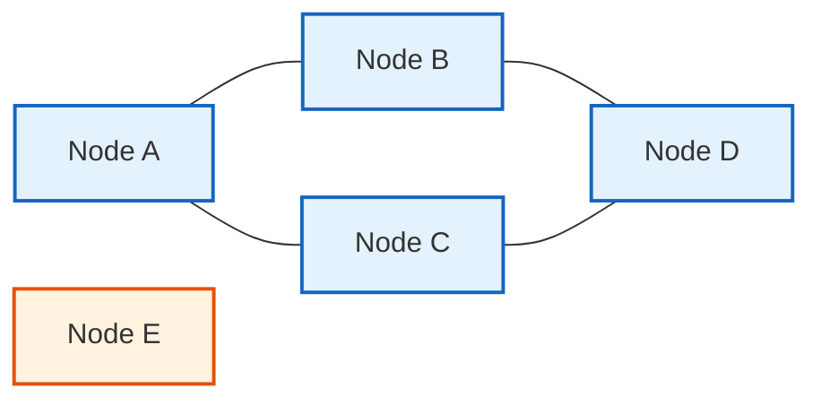
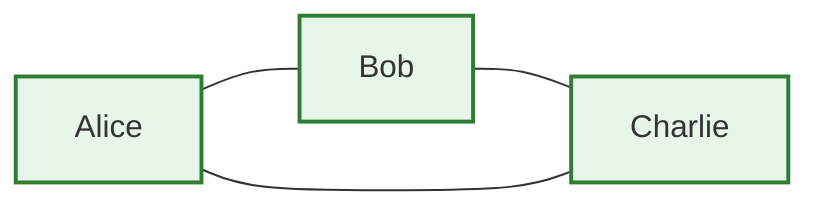
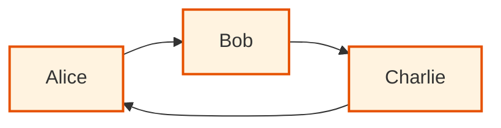
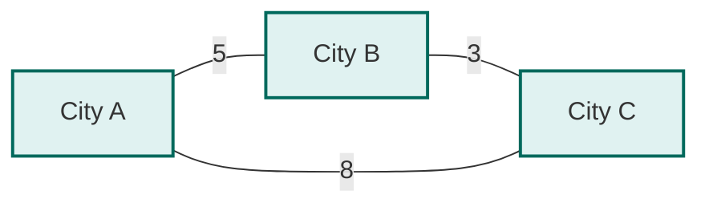
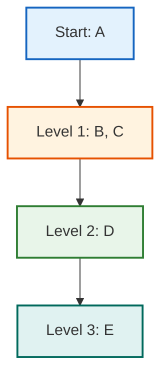
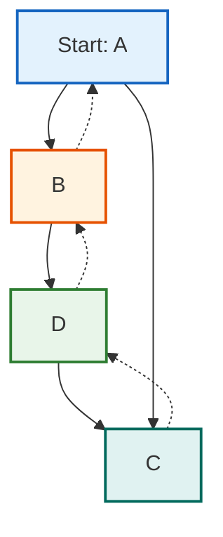
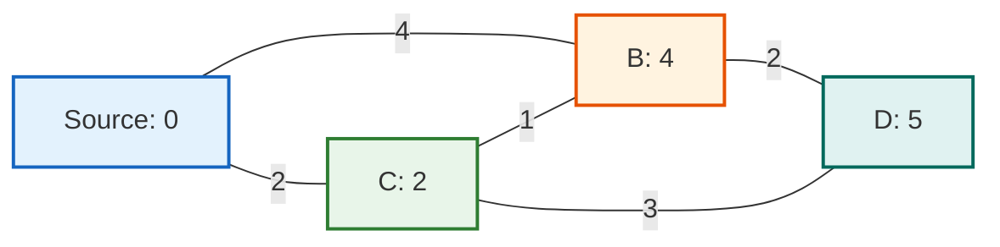

Graphs model relationships between entities. Whether you're building a social network, navigation app, or package manager, graphs are the data structure that connects everything.

This guide covers graph data structure fundamentals and core algorithms. Learn how to represent graphs, traverse them, and solve problems using 20+ essential algorithms with complete implementations.

> **TL;DR**: This is your complete guide to graph data structure fundamentals and core algorithms. Learn BFS, DFS, Dijkstra, Union-Find, Kruskal's, Prim's, and 20+ essential graph algorithms. Each algorithm includes complete implementations, time complexity analysis, and use cases. Master the core algorithms that power social networks, navigation systems, and recommendation engines.

### Core Algorithms Covered in This Guide

**Traversal Algorithms**: BFS, DFS  
**Shortest Path Algorithms**: Dijkstra, Bellman-Ford, Floyd-Warshall, A*  
**Minimum Spanning Tree**: Kruskal's, Prim's  
**Connectivity Algorithms**: Union-Find, Connected Components  
**Topological Algorithms**: Topological Sort (DFS)  
**Cycle Detection**: Undirected, Directed, Negative Cycles

**Total: 20+ core graph algorithms with complete implementations, complexity analysis, and use cases.**

## Table of Contents

1. [What is a Graph Data Structure?](#what-is-a-graph-data-structure)
2. [Types of Graphs](#types-of-graphs)
3. [Graph Representations](#graph-representations-adjacency-list-vs-adjacency-matrix)
4. [BFS and DFS in Data Structure](#bfs-and-dfs-in-data-structure)
5. [Shortest Path Algorithms](#shortest-path-algorithms)
6. [Union-Find (Disjoint Set)](#union-find-disjoint-set)
7. [Minimum Spanning Tree](#minimum-spanning-tree-mst)
8. [Common Graph Problems and Solutions](#common-graph-problems-and-solutions)
9. [Real-World Applications](#real-world-applications)
10. [Common Graph Problem Patterns](#common-graph-problem-patterns)
11. [Interview Problem Templates](#interview-problem-templates)
12. [Interview Tips and Strategies](#interview-tips-and-strategies)
13. [Complexity Cheat Sheet](#complexity-cheat-sheet)
14. [Further Reading](#further-reading)
15. [Conclusion](#conclusion)

## What is a Graph Data Structure?

A **graph data structure** is a collection of nodes (also called vertices) connected by edges. That's it. Simple concept, powerful applications. The graph data structure is one of the most important data structures in computer science, used to model relationships and connections between entities.

Think of it like this:



In this graph:
- Nodes A, B, C, D are connected to each other
- Node E is isolated (not connected to anyone)
- A is connected to B and C
- B is connected to A and D
- C is connected to A and D

Formally, a graph G = (V, E) where:
- **V** is the set of vertices (nodes)
- **E** is the set of edges (connections)

### Why Graphs Matter

Graphs model relationships naturally. Here are some examples:

**Social Network**: Nodes are users, edges are friendships or follows. You can find mutual friends, suggest connections, or calculate how many degrees of separation exist between two users.

**Road Map**: Nodes are intersections or locations, edges are roads. You can find the shortest route, calculate travel time, or find alternative paths.

**Dependency Graph**: Nodes are packages or modules, edges are dependencies. You can determine installation order, detect circular dependencies, or find what breaks if you remove a package.

**Web Pages**: Nodes are pages, edges are links. Search engines use this to rank pages and crawl the web.

The list goes on. If your problem involves relationships, connections, or networks, graphs are likely the right tool.

## Types of Graphs

Not all graphs are the same. Understanding the different types helps you choose the right representation and algorithms.

### Directed vs Undirected

**Undirected Graph**: Edges have no direction. If A is connected to B, then B is connected to A.



Think Facebook friendships. If Alice is friends with Bob, Bob is friends with Alice.

**Directed Graph**: Edges have direction. An edge from A to B does not mean B is connected to A.



Think Twitter follows. Alice follows Bob, but Bob might not follow Alice back.

### Weighted vs Unweighted

**Unweighted Graph**: Edges have no associated value. They just represent a connection.

**Weighted Graph**: Edges have weights (costs, distances, capacities, etc.).



The numbers represent distances or costs. Useful for navigation, network routing, or any problem where connections have different costs.

### Special Graph Types

**Tree**: A connected graph with no cycles. Every tree is a graph, but not every graph is a tree. Trees have exactly V - 1 edges.

**Directed Acyclic Graphs (DAG)**: A **directed acyclic graph** (DAG) is a directed graph with no cycles. Directed acyclic graphs are fundamental in computer science and used extensively in task scheduling, dependency resolution, and data processing pipelines. The absence of cycles makes DAGs perfect for problems requiring a topological ordering of nodes.

**Complete Graph**: Every node is connected to every other node. Has V(V-1)/2 edges for undirected graphs.

**Bipartite Graph**: Nodes can be divided into two sets such that edges only connect nodes from different sets. Useful for matching problems.

## Graph Representations: Adjacency List vs Adjacency Matrix

How you store a graph in memory affects both space usage and operation speed. There are two main approaches: **adjacency list** and **adjacency matrix**. Understanding the difference between adjacency list and adjacency matrix is crucial for choosing the right representation for your graph data structure.

### Adjacency List in Data Structure

The **adjacency list** is one of the most common ways to represent a graph data structure. The **adjacency list representation of graph** stores, for each vertex, a list of all vertices adjacent to it. This makes the adjacency list graph representation ideal for sparse graphs.

When implementing an **adjacency list in data structure**, you create a data structure where each node maps to a list of its neighbors. The **adjacency list graph** representation is space-efficient and allows fast iteration over neighbors.

```python
graph = {
    'A': ['B', 'C'],
    'B': ['A', 'D'],
    'C': ['A', 'D'],
    'D': ['B', 'C'],
    'E': []
}
```

**Space Complexity**: O(V + E)

**Pros**:
- Space efficient for sparse graphs (few edges)
- Easy to iterate over all neighbors of a node
- Easy to add or remove edges

**Cons**:
- Checking if an edge exists takes O(degree) time
- Not cache-friendly (pointers scattered in memory)

**Best for**: Sparse graphs, graphs where you iterate over neighbors frequently.

**Interview Tip**: The adjacency list is the preferred representation for most graph problems in coding interviews because real-world graphs are typically sparse. When asked about graph representation, always mention that the **adjacency list in data structure** is more space-efficient for sparse graphs.

### Adjacency Matrix Representation

The **adjacency matrix** is another way to represent a graph data structure. Unlike the adjacency list representation of graph, the adjacency matrix uses a 2D array where `matrix[i][j]` indicates if there is an edge between nodes i and j. The adjacency matrix representation is better for dense graphs or when you need O(1) edge lookups.

```python
# Undirected graph
graph = [
    [0, 1, 1, 0, 0],  # A: connected to B, C
    [1, 0, 0, 1, 0],  # B: connected to A, D
    [1, 0, 0, 1, 0],  # C: connected to A, D
    [0, 1, 1, 0, 0],  # D: connected to B, C
    [0, 0, 0, 0, 0]   # E: no connections
]
```

For weighted graphs, store the weight instead of 1.

**Space Complexity**: O(V²)

**Pros**:
- O(1) edge existence check
- Cache-friendly (contiguous memory)
- Easy to implement

**Cons**:
- Uses O(V²) space even for sparse graphs
- Iterating over neighbors requires checking all V nodes

**Best for**: Dense graphs, graphs where you frequently check edge existence.

**Interview Tip**: Adjacency matrix uses O(V²) space, which is wasteful for sparse graphs. Only use it when you need O(1) edge lookups or when the graph is dense.

### Adjacency List vs Adjacency Matrix: Comparison

When choosing between adjacency list and adjacency matrix, consider your use case:

| Operation | Adjacency List | Adjacency Matrix |
|-----------|----------------|------------------|
| Check edge exists | O(degree) | O(1) |
| Iterate neighbors | O(degree) | O(V) |
| Add edge | O(1) | O(1) |
| Remove edge | O(degree) | O(1) |
| Space | O(V + E) | O(V²) |

For most real-world graphs (which are sparse), **adjacency list representation of graph** is the better choice. The adjacency list graph representation is space-efficient and allows fast iteration over neighbors. Social networks, road networks, and dependency graphs all have far fewer edges than the maximum possible, making **adjacency list in data structure** the preferred representation.

When implementing a graph data structure, you'll most commonly use an adjacency list. The **adjacency list representation of graph** stores, for each vertex, a list of all vertices adjacent to it, making it ideal for sparse graphs where the number of edges is much less than V². The **adjacency list graph** approach uses O(V + E) space compared to O(V²) for adjacency matrix.

## BFS and DFS in Data Structure

**BFS and DFS in data structure** are the two fundamental graph traversal algorithms. Understanding BFS and DFS is essential for solving graph problems. Traversal means visiting all nodes in a graph, and these two approaches form the foundation of most graph algorithms.

### Breadth-First Search (BFS) in Data Structure

**BFS (Breadth-First Search)** is a graph traversal algorithm that explores level by level. Start at a node, visit all its neighbors, then visit all their neighbors, and so on. BFS in data structure is particularly useful for finding shortest paths in unweighted graphs.



**Implementation**:

```python
from collections import deque

def bfs(graph, start):
    visited = set()
    queue = deque([start])
    visited.add(start)
    
    while queue:
        node = queue.popleft()
        print(node)  # Process node
        
        for neighbor in graph[node]:
            if neighbor not in visited:
                visited.add(neighbor)
                queue.append(neighbor)
```

**Use Cases**:
- Finding shortest path in unweighted graphs
- Level-order traversal
- Finding all nodes at a certain distance
- Web crawling with breadth-first strategy

**Time Complexity**: O(V + E)
**Space Complexity**: O(V) for the queue and visited set

### Depth-First Search (DFS) in Data Structure

**DFS (Depth-First Search)** is another fundamental graph traversal algorithm. DFS goes deep before going wide. Start at a node, follow one path as far as possible, then backtrack. DFS in data structure is essential for cycle detection, topological sorting, and exploring all paths in a graph.



**Implementation (Recursive)**:

```python
def dfs_recursive(graph, node, visited):
    visited.add(node)
    print(node)  # Process node
    
    for neighbor in graph[node]:
        if neighbor not in visited:
            dfs_recursive(graph, neighbor, visited)
```

**Implementation (Iterative)**:

```python
def dfs_iterative(graph, start):
    visited = set()
    stack = [start]
    
    while stack:
        node = stack.pop()
        if node not in visited:
            visited.add(node)
            print(node)  # Process node
            
            for neighbor in graph[node]:
                if neighbor not in visited:
                    stack.append(neighbor)
```

**Use Cases**:
- Cycle detection
- Topological sorting
- Finding connected components
- Solving mazes
- Path finding (when you need any path, not necessarily shortest)

**Time Complexity**: O(V + E)
**Space Complexity**: O(V) for the stack/recursion and visited set

### BFS vs DFS in Data Structure: When to Use Which

Understanding when to use BFS vs DFS in data structure is crucial for solving graph problems efficiently.

| Scenario | Use BFS | Use DFS |
|----------|---------|---------|
| Shortest path (unweighted) | Yes | No |
| Cycle detection | Possible but complex | Yes, easier |
| Topological sort | No | Yes |
| Memory constraints | More memory (queue) | Less memory (stack) |
| Finding all nodes at distance k | Yes | No |
| Exploring all paths | No | Yes |

In practice, DFS is more commonly used because it uses less memory and is easier to implement recursively. Use BFS when you specifically need the shortest path or level-by-level exploration. Both BFS and DFS in data structure have O(V + E) time complexity, making them efficient for most graph problems.

## Shortest Path Algorithms

Finding the shortest path between two nodes is one of the most common graph problems. The algorithm you choose depends on whether edges have weights and whether weights can be negative.

### Dijkstra's Algorithm

Finds shortest paths from a source node to all other nodes in a weighted graph with non-negative weights.

**How it works**:
1. Start with distance 0 for the source, infinity for all others
2. Use a priority queue to always process the closest unvisited node
3. For each neighbor, update distance if a shorter path is found
4. Repeat until all nodes are processed



**Implementation**:

```python
import heapq

def dijkstra(graph, start):
    distances = {node: float('inf') for node in graph}
    distances[start] = 0
    pq = [(0, start)]
    visited = set()
    
    while pq:
        current_dist, node = heapq.heappop(pq)
        
        if node in visited:
            continue
            
        visited.add(node)
        
        for neighbor, weight in graph[node]:
            distance = current_dist + weight
            
            if distance < distances[neighbor]:
                distances[neighbor] = distance
                heapq.heappush(pq, (distance, neighbor))
    
    return distances
```

**Time Complexity**: O((V + E) log V) with binary heap, O(V log V + E) with Fibonacci heap
**Space Complexity**: O(V)

**Use Cases**:
- GPS navigation (shortest route)
- Network routing protocols
- Social networks (degrees of separation with weights)
- Resource allocation

**Limitation**: Does not work with negative edge weights. Use Bellman-Ford for that.

**Interview Tip**: Dijkstra is asked frequently. Be ready to explain why it doesn't work with negative weights (it assumes once a node is processed, its shortest distance is found, which breaks with negative edges).

### Bellman-Ford Algorithm

Handles graphs with negative weights and can detect negative cycles.

**How it works**:
1. Initialize distances: source = 0, all others = infinity
2. Relax all edges V-1 times (V = number of vertices)
3. Check for negative cycles by relaxing edges one more time

```python
def bellman_ford(graph, start):
    distances = {node: float('inf') for node in graph}
    distances[start] = 0
    
    # Relax edges V-1 times
    for _ in range(len(graph) - 1):
        for u in graph:
            for v, weight in graph[u]:
                if distances[u] + weight < distances[v]:
                    distances[v] = distances[u] + weight
    
    # Check for negative cycles
    for u in graph:
        for v, weight in graph[u]:
            if distances[u] + weight < distances[v]:
                return None  # Negative cycle detected
    
    return distances
```

**Time Complexity**: O(VE)
**Space Complexity**: O(V)

**Use Cases**: Currency exchange rates, detecting arbitrage opportunities, network routing with negative costs.

**Interview Tip**: Less common than Dijkstra, but good to know for negative weight scenarios.

### Floyd-Warshall Algorithm

Finds shortest paths between all pairs of nodes. Works with negative weights (but not negative cycles).

```python
def floyd_warshall(graph):
    n = len(graph)
    dist = [[float('inf')] * n for _ in range(n)]
    
    # Initialize distances
    for i in range(n):
        dist[i][i] = 0
        for j, weight in graph[i]:
            dist[i][j] = weight
    
    # Update distances
    for k in range(n):
        for i in range(n):
            for j in range(n):
                dist[i][j] = min(dist[i][j], dist[i][k] + dist[k][j])
    
    return dist
```

**Time Complexity**: O(V³)
**Space Complexity**: O(V²)

**Use Cases**: All-pairs shortest path, transitive closure, network analysis.

### A* Algorithm

An informed search algorithm that uses heuristics to find the shortest path faster. Used in game AI and pathfinding.

```python
import heapq

def astar(graph, start, goal, heuristic):
    pq = [(0, start)]
    g_score = {start: 0}
    f_score = {start: heuristic(start, goal)}
    came_from = {}
    
    while pq:
        current = heapq.heappop(pq)[1]
        
        if current == goal:
            # Reconstruct path
            path = []
            while current in came_from:
                path.append(current)
                current = came_from[current]
            return [start] + path[::-1]
        
        for neighbor, weight in graph[current]:
            tentative_g = g_score[current] + weight
            
            if neighbor not in g_score or tentative_g < g_score[neighbor]:
                came_from[neighbor] = current
                g_score[neighbor] = tentative_g
                f_score[neighbor] = tentative_g + heuristic(neighbor, goal)
                heapq.heappush(pq, (f_score[neighbor], neighbor))
    
    return None  # No path found
```

**Time Complexity**: O(b^d) where b is branching factor, d is depth (worst case), but much better with good heuristic
**Best for**: When you have a good heuristic function (like Manhattan distance for grid problems)

## Union-Find (Disjoint Set)

Union-Find is a data structure that tracks disjoint sets. It's essential for many graph problems, especially those involving connectivity.

### How It Works

Union-Find supports two operations:
- **Find**: Determine which set an element belongs to
- **Union**: Merge two sets

```python
class UnionFind:
    def __init__(self, n):
        self.parent = list(range(n))
        self.rank = [0] * n
    
    def find(self, x):
        if self.parent[x] != x:
            self.parent[x] = self.find(self.parent[x])  # Path compression
        return self.parent[x]
    
    def union(self, x, y):
        root_x = self.find(x)
        root_y = self.find(y)
        
        if root_x == root_y:
            return False  # Already in same set
        
        # Union by rank
        if self.rank[root_x] < self.rank[root_y]:
            self.parent[root_x] = root_y
        elif self.rank[root_x] > self.rank[root_y]:
            self.parent[root_y] = root_x
        else:
            self.parent[root_y] = root_x
            self.rank[root_x] += 1
        
        return True
```

**Time Complexity**: 
- Find: O(α(n)) amortized (almost constant due to path compression)
- Union: O(α(n)) amortized
- α(n) is the inverse Ackermann function, effectively constant for practical purposes

**Space Complexity**: O(V)

**Use Cases**:
- Detecting cycles in undirected graphs
- Finding connected components
- Kruskal's MST algorithm
- Network connectivity problems
- Friend circles in social networks

**Interview Tip**: Union-Find is frequently asked. Practice implementing it from scratch. The path compression and union by rank optimizations are crucial.

## Minimum Spanning Tree (MST)

A Minimum Spanning Tree connects all nodes in a graph with minimum total edge weight. Two main algorithms: Kruskal's and Prim's.

### Kruskal's Algorithm

Sort edges by weight, add them if they don't form a cycle (use Union-Find).

```python
def kruskal(edges, n):
    edges.sort(key=lambda x: x[2])  # Sort by weight
    uf = UnionFind(n)
    mst = []
    total_weight = 0
    
    for u, v, weight in edges:
        if uf.union(u, v):
            mst.append((u, v, weight))
            total_weight += weight
            if len(mst) == n - 1:
                break
    
    return mst, total_weight
```

**Time Complexity**: O(E log E) due to sorting
**Space Complexity**: O(V)

### Prim's Algorithm

Start from a node, always add the minimum weight edge connecting the MST to a new node.

```python
import heapq

def prim(graph, start):
    mst = []
    visited = {start}
    pq = []
    
    # Add edges from start node
    for neighbor, weight in graph[start]:
        heapq.heappush(pq, (weight, start, neighbor))
    
    while pq and len(visited) < len(graph):
        weight, u, v = heapq.heappop(pq)
        
        if v in visited:
            continue
        
        visited.add(v)
        mst.append((u, v, weight))
        
        # Add edges from v
        for neighbor, w in graph[v]:
            if neighbor not in visited:
                heapq.heappush(pq, (w, v, neighbor))
    
    return mst
```

**Time Complexity**: O(E log V) with binary heap, O(E + V log V) with Fibonacci heap
**Space Complexity**: O(V)

**Interview Tip**: Know both algorithms. Kruskal's is simpler to implement. Prim's is better for dense graphs.

## Common Graph Problems and Solutions

### Cycle Detection

**Undirected Graph**: Use DFS. If you encounter an already visited node that is not the parent, there is a cycle.

```python
def has_cycle_undirected(graph):
    visited = set()
    
    def dfs(node, parent):
        visited.add(node)
        for neighbor in graph[node]:
            if neighbor not in visited:
                if dfs(neighbor, node):
                    return True
            elif neighbor != parent:
                return True
        return False
    
    for node in graph:
        if node not in visited:
            if dfs(node, None):
                return True
    return False
```

**Directed Graph**: Use DFS with a recursion stack to track nodes in the current path.

```python
def has_cycle_directed(graph):
    visited = set()
    rec_stack = set()
    
    def dfs(node):
        visited.add(node)
        rec_stack.add(node)
        
        for neighbor in graph[node]:
            if neighbor not in visited:
                if dfs(neighbor):
                    return True
            elif neighbor in rec_stack:
                return True
        
        rec_stack.remove(node)
        return False
    
    for node in graph:
        if node not in visited:
            if dfs(node):
                return True
    return False
```

### Topological Sort in Directed Acyclic Graphs

Topological sort orders nodes in a **directed acyclic graph** (DAG) such that all dependencies come before dependents. This is only possible in directed acyclic graphs because cycles would create circular dependencies. Used in build systems, task scheduling, and course prerequisites. Directed acyclic graphs are essential for problems requiring a valid ordering of nodes.

```python
def topological_sort(graph):
    visited = set()
    result = []
    
    def dfs(node):
        visited.add(node)
        for neighbor in graph[node]:
            if neighbor not in visited:
                dfs(neighbor)
        result.append(node)  # Add after processing all dependencies
    
    for node in graph:
        if node not in visited:
            dfs(node)
    
    return result[::-1]  # Reverse to get correct order
```

**Time Complexity**: O(V + E)

### Detect Negative Cycle

Detect if a graph contains a negative weight cycle using Bellman-Ford.

```python
def has_negative_cycle(graph, start):
    n = len(graph)
    distances = [float('inf')] * n
    distances[start] = 0
    
    # Relax edges V-1 times
    for _ in range(n - 1):
        for u in range(n):
            for v, weight in graph[u]:
                if distances[u] + weight < distances[v]:
                    distances[v] = distances[u] + weight
    
    # Check for negative cycle
    for u in range(n):
        for v, weight in graph[u]:
            if distances[u] + weight < distances[v]:
                return True  # Negative cycle detected
    
    return False
```

**Time Complexity**: O(VE)  
**Space Complexity**: O(V)

### Connected Components

Find all groups of nodes that are connected to each other.

```python
def connected_components(graph):
    visited = set()
    components = []
    
    def dfs(node, component):
        visited.add(node)
        component.append(node)
        for neighbor in graph[node]:
            if neighbor not in visited:
                dfs(neighbor, component)
    
    for node in graph:
        if node not in visited:
            component = []
            dfs(node, component)
            components.append(component)
    
    return components
```

## Real-World Applications

### Social Networks

Graphs model user connections naturally. Facebook uses undirected graphs (mutual friendships), Twitter uses directed graphs (one-way follows).

**Problems solved**:
- Finding mutual friends
- Friend suggestions (friends of friends)
- Degrees of separation
- Community detection
- Influencer identification

### Navigation and Routing

GPS apps, delivery services, and network routing all use graphs.

**Problems solved**:
- Shortest path (Dijkstra's algorithm)
- Alternative routes
- Traffic-aware routing
- Multi-stop optimization

### Dependency Resolution

Package managers (npm, pip, Maven) use graphs to resolve dependencies.

**Problems solved**:
- Installation order (topological sort)
- Circular dependency detection
- Impact analysis (what breaks if we remove this package?)
- Version conflict resolution

### Recommendation Systems

E-commerce and content platforms use graphs to model user-item relationships.

**Problems solved**:
- "Users who bought this also bought"
- Content recommendations based on viewing patterns
- Collaborative filtering

### Compiler Design

Compilers use graphs for control flow analysis, data flow analysis, and optimization.

**Graph types used**:
- Control flow graph
- Call graph
- Dependency graph

## When to Use Graphs

Use graphs when:

1. **Relationships are central**: Your data is about connections, not just entities
2. **You need to traverse relationships**: Queries involve "friends of friends" or "related items"
3. **The structure is dynamic**: Connections change frequently
4. **You need pathfinding**: Shortest path, all paths, or path existence queries
5. **The data is highly connected**: Entities have many relationships

Consider alternatives when:

1. **Simple relationships**: If relationships are simple (one-to-many), a relational database might be simpler
2. **Tabular data**: If your data fits naturally in tables, use a relational database
3. **No relationship queries**: If you never query based on relationships, graphs add unnecessary complexity

## Graph Databases

For applications where relationships are central, consider a graph database instead of implementing graphs on top of a relational database.

**Popular graph databases**:
- **Neo4j**: Most popular, ACID compliant, Cypher query language
- **Amazon Neptune**: Managed service, supports both property graph and RDF
- **ArangoDB**: Multi-model (document, graph, key-value)
- **TigerGraph**: High-performance, distributed

**When to use a graph database**:
- Complex relationship queries (multiple hops)
- Real-time relationship analysis
- When relationships are as important as the data
- When you need graph algorithms built-in

**When a relational database is fine**:
- Simple relationships
- Mostly CRUD operations
- Team is more familiar with SQL
- Existing infrastructure uses relational databases

## Performance Considerations

### Space Complexity

- **Adjacency List**: O(V + E) - good for sparse graphs
- **Adjacency Matrix**: O(V²) - only for dense graphs

Most real-world graphs are sparse (E << V²), so adjacency lists are usually better.

### Time Complexity

- **Traversal (BFS/DFS)**: O(V + E)
- **Dijkstra**: O((V + E) log V)
- **Cycle Detection**: O(V + E)
- **Topological Sort**: O(V + E)

### Optimization Tips

1. **Choose the right representation**: Adjacency list for sparse, matrix for dense
2. **Use appropriate data structures**: Priority queues for Dijkstra, sets for visited nodes
3. **Cache results**: If you query the same paths repeatedly, cache them
4. **Consider graph databases**: For complex relationship queries, a specialized database might be faster
5. **Parallel processing**: Some graph algorithms can be parallelized (BFS levels, independent components)

## Common Mistakes

1. **Using adjacency matrix for sparse graphs**: Wastes space unnecessarily
2. **Not handling cycles**: Infinite loops in DFS if you do not track visited nodes
3. **Wrong algorithm choice**: Using DFS for shortest path, or BFS when you need deep exploration
4. **Ignoring edge cases**: Disconnected graphs, single node, empty graph
5. **Not considering weights**: Using BFS on weighted graphs (gives wrong answer)

## Common Graph Problem Patterns

Recognizing patterns helps you solve interview problems faster. Here are the most common ones:

### Pattern 1: Matrix as Graph

Many 2D matrix problems are actually graph problems in disguise.

**Key Insight**: Each cell is a node, adjacent cells are edges.

**Example Applications**:
- Counting connected regions in a grid
- Finding paths in mazes
- Flood fill algorithms
- Region detection in images

**Template**:
```python
def matrix_bfs(matrix, start):
    rows, cols = len(matrix), len(matrix[0])
    directions = [(0, 1), (1, 0), (0, -1), (-1, 0)]
    queue = deque([start])
    visited = set([start])
    
    while queue:
        r, c = queue.popleft()
        # Process cell (r, c)
        
        for dr, dc in directions:
            nr, nc = r + dr, c + dc
            if 0 <= nr < rows and 0 <= nc < cols:
                if (nr, nc) not in visited:
                    visited.add((nr, nc))
                    queue.append((nr, nc))
```

### Pattern 2: Shortest Path in Unweighted Graph

Use BFS with distance tracking.

**Template**:
```python
def shortest_path_bfs(graph, start, end):
    queue = deque([(start, 0)])
    visited = {start}
    
    while queue:
        node, distance = queue.popleft()
        
        if node == end:
            return distance
        
        for neighbor in graph[node]:
            if neighbor not in visited:
                visited.add(neighbor)
                queue.append((neighbor, distance + 1))
    
    return -1  # No path
```

### Pattern 3: Cycle Detection

**Undirected**: DFS with parent tracking
**Directed**: DFS with recursion stack

### Pattern 4: Topological Sort

Use DFS or Kahn's algorithm (BFS-based).

**Kahn's Algorithm (BFS-based)**:
```python
def topological_sort_kahn(graph):
    in_degree = {node: 0 for node in graph}
    
    # Calculate in-degrees
    for node in graph:
        for neighbor in graph[node]:
            in_degree[neighbor] += 1
    
    # Start with nodes having 0 in-degree
    queue = deque([node for node in graph if in_degree[node] == 0])
    result = []
    
    while queue:
        node = queue.popleft()
        result.append(node)
        
        for neighbor in graph[node]:
            in_degree[neighbor] -= 1
            if in_degree[neighbor] == 0:
                queue.append(neighbor)
    
    return result if len(result) == len(graph) else []  # Cycle detected
```

### Pattern 5: Connected Components

Use DFS or Union-Find.

### Pattern 6: Bipartite Graph

Use BFS/DFS with coloring.

```python
def is_bipartite(graph):
    color = {}
    
    for node in graph:
        if node not in color:
            queue = deque([node])
            color[node] = 0
            
            while queue:
                curr = queue.popleft()
                
                for neighbor in graph[curr]:
                    if neighbor not in color:
                        color[neighbor] = 1 - color[curr]
                        queue.append(neighbor)
                    elif color[neighbor] == color[curr]:
                        return False
    
    return True
```

## Interview Problem Templates

### Template 1: BFS for Shortest Path

```python
from collections import deque

def bfs_template(graph, start, target):
    queue = deque([(start, 0)])  # (node, distance/level)
    visited = {start}
    
    while queue:
        node, dist = queue.popleft()
        
        # Check if target found
        if node == target:
            return dist
        
        # Process neighbors
        for neighbor in graph[node]:
            if neighbor not in visited:
                visited.add(neighbor)
                queue.append((neighbor, dist + 1))
    
    return -1  # Not found
```

### Template 2: DFS for Path Finding

```python
def dfs_template(graph, start, target, visited=None, path=None):
    if visited is None:
        visited = set()
    if path is None:
        path = []
    
    visited.add(start)
    path.append(start)
    
    if start == target:
        return path[:]  # Return copy of path
    
    for neighbor in graph[start]:
        if neighbor not in visited:
            result = dfs_template(graph, neighbor, target, visited, path)
            if result:
                return result
    
    path.pop()  # Backtrack
    return None
```

### Template 3: DFS for Cycle Detection (Directed)

```python
def has_cycle_directed_template(graph):
    WHITE, GRAY, BLACK = 0, 1, 2
    color = {node: WHITE for node in graph}
    
    def dfs(node):
        color[node] = GRAY
        
        for neighbor in graph[node]:
            if color[neighbor] == GRAY:
                return True  # Cycle found
            if color[neighbor] == WHITE and dfs(neighbor):
                return True
        
        color[node] = BLACK
        return False
    
    for node in graph:
        if color[node] == WHITE:
            if dfs(node):
                return True
    
    return False
```

## Interview Tips and Strategies

### Before the Interview

1. **Master the Fundamentals**: Be able to implement BFS, DFS, Dijkstra, and Union-Find from scratch without looking.

2. **Understand Algorithm Patterns**: Most graph algorithms follow predictable patterns. Understand when to use BFS vs DFS, when to use Union-Find, and when to use topological sort.

3. **Know Your Complexities**: Be ready to explain time and space complexity for every algorithm you use.

### Common Interview Questions

**Q: When would you use BFS vs DFS?**
- BFS: Shortest path, level-order traversal, finding nodes at distance k
- DFS: Cycle detection, topological sort, path finding, backtracking

**Q: Why doesn't Dijkstra work with negative weights?**
- Dijkstra assumes once a node is processed, its shortest distance is final
- With negative weights, a shorter path might be found later through a negative edge
- This breaks the greedy assumption

**Q: What's the difference between Union-Find and DFS for connected components?**
- Union-Find: O(α(n)) per operation, better for dynamic connectivity
- DFS: O(V + E) for all components, simpler to implement

**Q: How do you detect cycles in a directed graph?**
- Use DFS with a recursion stack (or color coding: white/gray/black)
- Gray nodes are in current path, if we revisit gray = cycle

## Complexity Cheat Sheet

| Algorithm | Time Complexity | Space Complexity | Notes |
|-----------|----------------|------------------|-------|
| BFS | O(V + E) | O(V) | Queue + visited set |
| DFS | O(V + E) | O(V) | Stack/recursion + visited |
| Dijkstra | O((V + E) log V) | O(V) | With binary heap |
| Bellman-Ford | O(VE) | O(V) | Works with negative weights |
| Floyd-Warshall | O(V³) | O(V²) | All-pairs shortest path |
| A* | O(b^d) worst | O(b^d) | Heuristic search |
| Kruskal's MST | O(E log E) | O(V) | Union-Find based |
| Prim's MST | O(E log V) | O(V) | Priority queue based |
| Topological Sort (DFS) | O(V + E) | O(V) | DFS based |
| Cycle Detection (Undirected) | O(V + E) | O(V) | DFS with parent |
| Cycle Detection (Directed) | O(V + E) | O(V) | DFS with recursion stack |
| Negative Cycle Detection | O(VE) | O(V) | Bellman-Ford variant |
| Union-Find | O(α(n)) amortized | O(V) | Per operation |
| Connected Components | O(V + E) | O(V) | DFS or Union-Find |
| Bipartite Check | O(V + E) | O(V) | BFS/DFS with coloring |

**Key Insights**:
- Most graph algorithms are O(V + E) for sparse graphs
- Dense graphs (E ≈ V²) make some algorithms slower
- Space is usually O(V) for visited/queue/stack
- Union-Find is nearly constant time per operation

## Learning Resources

**Books**:
- **Introduction to Algorithms (CLRS)**: Rigorous graph theory and algorithm analysis
- **Algorithm Design Manual**: Practical approach with real-world examples

**Online Resources**:
- **GeeksforGeeks**: Comprehensive graph algorithm tutorials with implementations
- **Wikipedia**: Detailed explanations of graph algorithms and their history
- **Visualgo**: Interactive visualizations of graph algorithms

**Libraries for Practice**:
- **NetworkX (Python)**: Great for experimentation and graph visualization
- **JGraphT (Java)**: Comprehensive graph library with many algorithms implemented
- **Boost Graph Library (C++)**: High-performance graph algorithms

## Further Reading

If you found this guide helpful, check out these related topics to deepen your understanding:

**Related Data Structures**:
- [Hash Table Collisions Explained](/data-structures/hashtable-collisions/) - Essential for implementing adjacency lists efficiently
- [Skip List Explained](/data-structures/skip-list/) - Probabilistic sorted data structure used by Redis and LevelDB
- [Bloom Filter Explained](/data-structures/bloom-filter/) - Probabilistic data structure for membership testing
- [HyperLogLog Explained](/data-structures/hyperloglog/) - Cardinality estimation in large graphs
- [Count-Min Sketch Explained](/data-structures/count-min-sketch/) - Frequency estimation for graph analytics

**System Design & Architecture**:
- [Database Indexing Explained](/database-indexing-explained/) - B-trees and graph-based indexes
- [Caching Strategies Explained](/caching-strategies-explained/) - Cache graph query results efficiently
- [How Kafka Works](/distributed-systems/how-kafka-works/) - Event streaming for graph updates
- [Write-Ahead Log](/distributed-systems/write-ahead-log/) - Durability patterns used in graph databases

**Design Patterns**:
- [Gang of Four Design Patterns](/gang-of-four-design-patterns/) - Software design patterns including Visitor (used for graph traversal)
- [CQRS Pattern Guide](/cqrs-pattern-guide/) - Separate read/write models for graph queries

**External Resources**:
- [MIT OpenCourseWare: Introduction to Algorithms](https://ocw.mit.edu/courses/6-006-introduction-to-algorithms-spring-2020/) - Free lectures on graph algorithms
- [Stanford CS161: Design and Analysis of Algorithms](https://web.stanford.edu/class/cs161/) - Advanced algorithm analysis
- [Competitive Programming Handbook](https://cses.fi/book/book.pdf) - Graph algorithms for competitive programming

## Complete Algorithm Reference

Quick reference for all algorithms covered in this guide:

### Traversal Algorithms
- **BFS**: Level-by-level exploration, shortest path in unweighted graphs
- **DFS**: Deep exploration, cycle detection, topological sort

### Shortest Path Algorithms
- **Dijkstra**: Single-source shortest path, non-negative weights
- **Bellman-Ford**: Handles negative weights, detects negative cycles
- **Floyd-Warshall**: All-pairs shortest path
- **A***: Heuristic-based shortest path

### Minimum Spanning Tree
- **Kruskal's**: Sort edges, use Union-Find
- **Prim's**: Greedy, priority queue based

### Connectivity Algorithms
- **Union-Find**: Disjoint set operations
- **Connected Components**: DFS or Union-Find

### Topological Algorithms
- **Topological Sort (DFS)**: Post-order DFS

### Cycle Detection
- **Undirected Graph**: DFS with parent tracking
- **Directed Graph**: DFS with recursion stack
- **Negative Cycle**: Bellman-Ford variant

### When to Use Which Algorithm

| Problem Type | Algorithm | Time Complexity |
|--------------|-----------|----------------|
| Shortest path (unweighted) | BFS | O(V + E) |
| Shortest path (weighted, no negatives) | Dijkstra | O((V + E) log V) |
| Shortest path (with negatives) | Bellman-Ford | O(VE) |
| All-pairs shortest path | Floyd-Warshall | O(V³) |
| Minimum spanning tree | Kruskal's or Prim's | O(E log E) or O(E log V) |
| Cycle detection (undirected) | DFS | O(V + E) |
| Cycle detection (directed) | DFS | O(V + E) |
| Topological sort | DFS | O(V + E) |
| Connected components | DFS or Union-Find | O(V + E) |
| Bipartite check | BFS/DFS | O(V + E) |

## Conclusion

Graph algorithms form the foundation of many computer science problems. Focus on understanding the core principles: why each algorithm works, when to use it, and its time and space complexity.

Start with the fundamentals: BFS, DFS, and graph representations. Master these before moving to more complex algorithms like Dijkstra and MST algorithms. Each algorithm builds on previous concepts, so a solid foundation is essential.

Keep learning, keep practicing, and most importantly, understand the "why" behind each algorithm.
