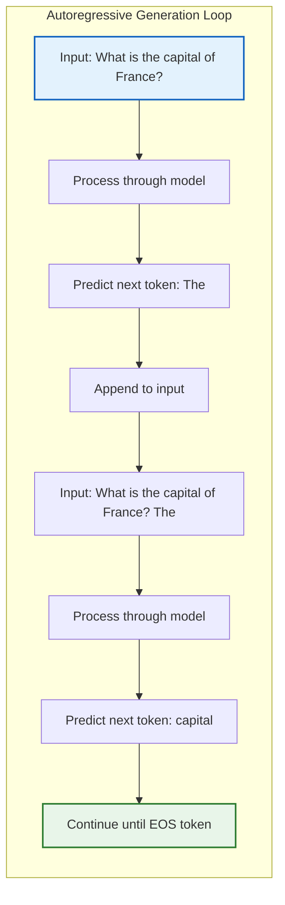
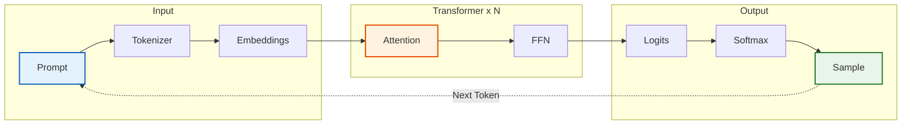
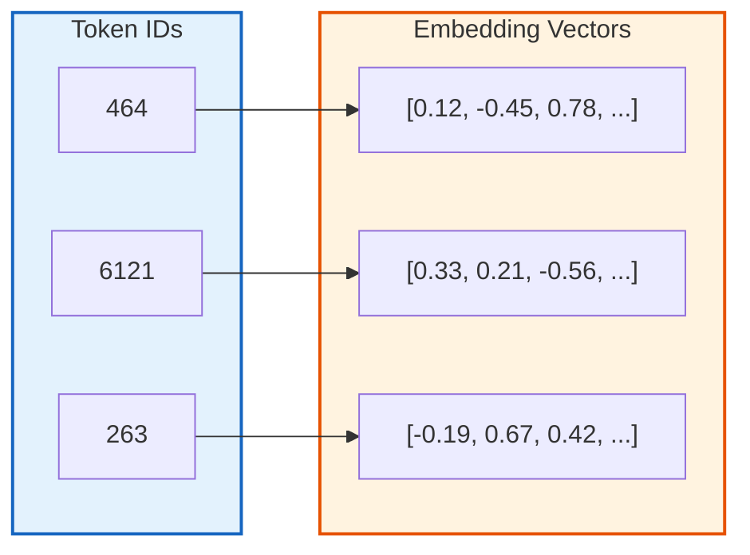
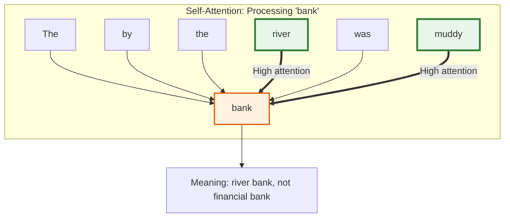
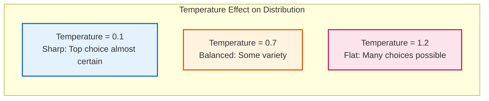
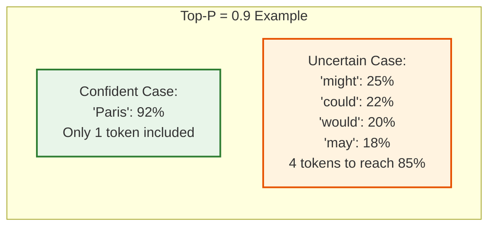
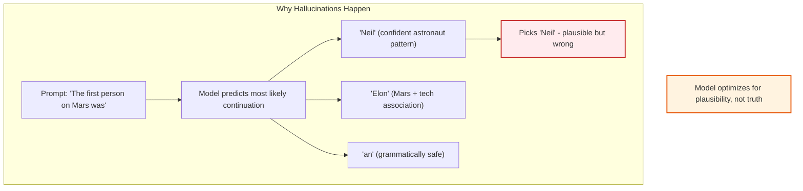
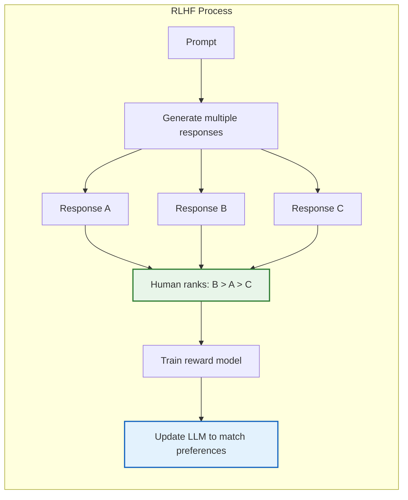

Most developers use LLMs every day. We send prompts to ChatGPT, Claude, or Copilot and get back useful responses. But what actually happens in those few seconds between hitting enter and seeing text appear?

Understanding how LLMs generate text will make you a better developer. You will write better prompts. You will debug strange model behaviors. You will know when to use different temperature settings. And you will understand why these models sometimes confidently say things that are completely wrong.

This guide breaks down the entire process. No deep learning background required. Just the practical knowledge you need.

> **TL;DR**: LLMs generate text one token at a time by repeatedly predicting the most likely next token. Your text gets split into tokens, converted to numbers, processed through attention layers that understand context, and turned into probabilities for every possible next token. The model picks one, appends it to the input, and repeats. Temperature and sampling strategies control how it picks from the probability distribution.

## The Core Loop: Next Token Prediction

Here is the fundamental thing to understand: LLMs do not generate entire responses at once. They predict one token at a time in a loop.

When you ask "What is the capital of France?", the model does not think "Paris" and output it. Instead, it:

1. Processes your entire prompt
2. Predicts the next token (maybe "The")
3. Appends "The" to the prompt
4. Processes the whole thing again
5. Predicts the next token ("capital")
6. Repeats until done

This is called **autoregressive generation**. Each token prediction uses the full context of everything that came before it, including the tokens the model just generated.



This explains why longer responses take longer to generate. The model literally runs its entire neural network for every single token it outputs. A 100 token response means 100 full passes through the model.

## The Text Generation Pipeline

Let me walk you through every step, from your text input to the generated response.



Let us break down each step.

## Step 1: Tokenization

LLMs do not read text the way humans do. They cannot see individual letters or words directly. First, your text must be converted into **tokens**.

### <i class="fas fa-cut"></i> What Are Tokens?

A token is the atomic unit an LLM processes. It can be:
- A whole word: "apple" = 1 token
- Part of a word: "unhappiness" = "un" + "happiness" = 2 tokens
- A single character: unusual symbols might be 1 character = 1 token
- Multiple words: common phrases might be combined

Most modern LLMs use about 50,000 to 100,000 unique tokens in their vocabulary.

### Why Subwords?

Using whole words would require millions of tokens to handle every possible word in every language. Using characters would make sequences too long to process. Subwords are the sweet spot.

Algorithms like **Byte Pair Encoding (BPE)** learn common subword patterns from training data. Frequent words stay whole. Rare words get split into recognizable pieces.

```python
# Example tokenization (simplified)
text = "The transformer architecture is powerful"

# Possible tokenization:
tokens = ["The", " transform", "er", " architecture", " is", " powerful"]
token_ids = [464, 6121, 263, 10959, 318, 3665]
```

### Why This Matters for Developers

Many strange LLM behaviors come from tokenization:

| Behavior | Tokenization Explanation |
|----------|-------------------------|
| Bad at spelling | "strawberry" is one token. The model cannot see individual letters inside it. |
| Struggles with math | "1234" might become "12" + "34". Number boundaries get lost. |
| Worse at some languages | Languages not well represented in training have inefficient tokenization. |
| Counts wrong | Cannot count characters in a word if the word is a single token. |
| Code style issues | Inconsistent whitespace tokenization affects formatting. |

As Andrej Karpathy puts it in his [tokenizer deep dive](https://www.fast.ai/posts/2025-10-16-karpathy-tokenizers), if you see an LLM doing something strange, it is worth checking how that input gets tokenized.

### Token Counting in Practice

Since you pay for tokens with most APIs, understanding token counts matters:

| Text | Approximate Tokens |
|------|-------------------|
| 1 word | 1-2 tokens |
| 1 sentence | 15-25 tokens |
| 1 paragraph | 50-100 tokens |
| 1 page | 500-700 tokens |
| 1 average code file | 500-1500 tokens |

The rule of thumb: 1 token is roughly 4 characters or 0.75 words in English.

## Step 2: Embeddings

Once text is tokenized into IDs, those IDs get converted into **embeddings**. An embedding is a list of numbers (a vector) that represents the "meaning" of a token.



### <i class="fas fa-vector-square"></i> The Magic of Vector Space

In this high-dimensional space (GPT-5 uses 16,384 dimensions), tokens with similar meanings are mathematically close to each other.

- "Python" and "Java" are close (both programming languages)
- "Python" and "snake" are somewhat close (same word, different meaning)
- "Python" and "happiness" are far apart (unrelated concepts)

This learned representation is what allows the model to understand that "The cat sat on the mat" and "The feline rested on the rug" mean similar things, even though they share no tokens.

### Positional Encoding

There is a problem: embeddings alone do not capture word order. "Dog bites man" and "Man bites dog" would have the same embeddings, just in different order.

To fix this, the model adds **positional encodings** to embeddings. These are patterns that encode where each token appears in the sequence. Now the model knows that "Dog" is first and "man" is last.

## Step 3: The Transformer and Attention

The embeddings enter the transformer, which is where the actual "thinking" happens. A transformer is a stack of identical layers, each containing two main components:

1. **Self-Attention**: Figures out how tokens relate to each other
2. **Feed-Forward Network**: Processes each token independently

GPT-4 has 120+ layers. GPT-5 and Claude 4 have even more. Each layer refines the representation.

### <i class="fas fa-eye"></i> Self-Attention Explained

Self-attention is the key innovation that made modern LLMs possible. It answers the question: for each token, which other tokens should I pay attention to?

Consider the sentence: "The bank by the river was muddy."

When processing "bank", the attention mechanism looks at all other words and learns that "river" and "muddy" are relevant. This tells the model that "bank" means the land beside water, not a financial institution.



The attention mechanism computes attention scores for every pair of tokens. High scores mean strong relationships. Low scores mean weak relationships.

This is also why LLMs have a **context window limit**. Attention computation scales quadratically with sequence length. Doubling the context length quadruples the computation. A 128K context window is expensive.

### Multi-Head Attention

In practice, transformers use multiple attention "heads" running in parallel. Each head can learn different types of relationships:

- One head might track subject-verb agreement
- Another might track pronoun references
- Another might track syntactic structure

The outputs of all heads get combined for a richer understanding.

### Feed-Forward Networks

After attention, each token passes through a feed-forward network independently. This is where the model applies learned "rules" to transform the representation.

Think of attention as "gathering information from context" and feed-forward as "processing that information."

## Step 4: Generating Output Probabilities

After passing through all transformer layers, the model has a rich representation of the entire input sequence. Now it needs to predict the next token.

The final hidden state goes through a projection layer that maps it to the vocabulary size. If the vocabulary has 50,000 tokens, the output is 50,000 numbers, one for each possible next token.

### <i class="fas fa-chart-bar"></i> Softmax: Converting to Probabilities

These raw numbers (called **logits**) are converted to probabilities using the **softmax** function. After softmax:

- All values are between 0 and 1
- All values sum to 1
- Higher logits become higher probabilities

| Token | Raw Logit | After Softmax |
|-------|-----------|---------------|
| "the" | 8.2 | **0.42** |
| "a" | 6.1 | 0.18 |
| "Paris" | 5.9 | 0.15 |
| "is" | 4.2 | 0.08 |
| "apple" | -2.1 | 0.0001 |
| ... | ... | ... |
| **Total** | - | **1.00** |

The model does not just output the top token. It gives you a full probability distribution. What you do with that distribution is where sampling strategies come in.

## Step 5: Sampling Strategies

The model has produced probabilities for 50,000+ possible next tokens. How do we pick one?

### <i class="fas fa-bullseye"></i> Greedy Decoding

The simplest approach: always pick the token with the highest probability.

**Pros**: Deterministic, fast, consistent
**Cons**: Boring, repetitive, can get stuck in loops

Greedy decoding often produces text like: "The best way to learn programming is to practice. Practice is the best way to learn. Learning is the best way to practice..."

### <i class="fas fa-thermometer-half"></i> Temperature Sampling

Temperature is a parameter that controls randomness. It scales the logits before softmax.

```
adjusted_logits = logits / temperature
```

| Temperature | Effect |
|-------------|--------|
| 0 | Same as greedy (deterministic) |
| 0.1 - 0.3 | Very focused, good for code and factual answers |
| 0.5 - 0.7 | Balanced, good for general use |
| 0.8 - 1.0 | Creative, good for brainstorming and writing |
| > 1.0 | Chaotic, often incoherent |

**Low temperature** sharpens the distribution. The top tokens get even higher probabilities.

**High temperature** flattens the distribution. Lower-probability tokens get a better chance.



### <i class="fas fa-filter"></i> Top-K Sampling

Top-k limits the model to only consider the k most likely tokens. If k=50, the model ignores everything except the top 50 options, then samples from those.

**Problem**: k is fixed. Sometimes only 2 tokens make sense, sometimes 500 do. A fixed cutoff does not adapt.

### <i class="fas fa-percentage"></i> Top-P (Nucleus) Sampling

Top-p is smarter. Instead of a fixed count, it takes the smallest set of tokens whose probabilities sum to p (e.g., 0.9).

If the model is confident and the top token has 95% probability, only that token is considered. If the model is uncertain and probabilities are spread out, many tokens are included.



**Typical settings**:
- Code generation: temperature 0.2, top_p 0.95
- Chat/conversation: temperature 0.7, top_p 0.9
- Creative writing: temperature 0.9, top_p 0.95

### Combining Parameters

Most APIs let you set multiple parameters:

```python
response = client.chat.completions.create(
    model="gpt-4",
    messages=[{"role": "user", "content": "Write a poem about coding"}],
    temperature=0.8,  # Creative
    top_p=0.9,        # Nucleus sampling
    max_tokens=200    # Limit response length
)
```

The model applies temperature first, then top_p filtering, then samples from what remains.

## Why LLMs Hallucinate

Now you understand why hallucinations happen. The model is not trying to be truthful. It is trying to predict the most **plausible** next token.

If your prompt is "The first person to walk on Mars was", the model looks for tokens that:
- Are grammatically correct
- Sound confident
- Match patterns from training data

It might output "Neil Armstrong" because that pattern (first person + space + was + famous astronaut name) appears frequently in training data. The model has no way to verify facts. It just predicts likely tokens.



### Reducing Hallucinations

As a developer, you can reduce hallucinations by:

1. **Providing context**: Use [RAG](/explainer/vector-databases-and-rag/) to give the model actual facts
2. **Lowering temperature**: More deterministic outputs are often more accurate
3. **Asking for sources**: If the model cites specific sources, you can verify them
4. **Breaking down questions**: Smaller, focused questions hallucinate less than broad ones
5. **Using newer models**: Larger models trained with more RLHF tend to say "I don't know" more often

## How LLMs Learn: Training Pipeline

Understanding training helps you understand model behavior. There are three main stages.

### <i class="fas fa-database"></i> Stage 1: Pre-training

The model reads a massive amount of text (hundreds of billions of tokens from the internet, books, code, etc.) and learns to predict the next token.

This stage teaches:
- Grammar and syntax
- Facts and knowledge
- Reasoning patterns
- Code structure
- Multiple languages

After pre-training, the model can continue any text you give it. But it is not yet good at following instructions.

### <i class="fas fa-graduation-cap"></i> Stage 2: Supervised Fine-Tuning (SFT)

The model is trained on curated prompt-response pairs. Human contractors write ideal responses to various prompts.

```
Prompt: "Write a Python function to reverse a string"
Response: "Here's a Python function that reverses a string:

def reverse_string(s):
    return s[::-1]

This uses Python's slice notation..."
```

This teaches the model to:
- Follow instructions
- Format responses appropriately
- Explain its reasoning
- Stay on topic

### <i class="fas fa-users"></i> Stage 3: RLHF (Reinforcement Learning from Human Feedback)

Humans rank multiple model outputs for the same prompt. A separate "reward model" learns these preferences. Then the LLM is trained to maximize the reward model's score.



RLHF teaches the model to:
- Be helpful
- Avoid harmful content
- Admit uncertainty
- Match human communication style

This is why ChatGPT and Claude "feel" helpful. They have been optimized for human preferences, not just next-token accuracy.

## The Context Window

Every LLM has a maximum context window, measured in tokens. This is the limit on how much text it can process at once.

| Model | Context Window |
|-------|---------------|
| GPT-4.1 | 128K tokens |
| GPT-5 | 256K tokens |
| Claude 4 Sonnet | 200K tokens |
| Gemini 3 Pro | 2M+ tokens |
| Llama 4 | 256K tokens |

### <i class="fas fa-exclamation-triangle"></i> The "Lost in the Middle" Problem

Bigger is not always better. Research shows that LLMs pay more attention to information at the beginning and end of the context. Details in the middle can be "lost."

For optimal results:
- Put critical instructions at the start
- Put important reference information at the end
- Keep less critical content in the middle

This is part of [context engineering](/context-engineering/), which is becoming as important as prompt engineering.

### Context and Memory

LLMs have no persistent memory. Each request starts fresh. When you chat with ChatGPT, it is not "remembering" your previous messages. The application is sending the entire conversation history with each request.

This is why very long conversations start to degrade. Once you hit the context limit, old messages get truncated or summarized.

## Practical Implications for Developers

Understanding this pipeline has real implications for building with LLMs.

### <i class="fas fa-code"></i> For Code Generation

| Setting | Why |
|---------|-----|
| Low temperature (0.1-0.3) | Code needs to be correct, not creative |
| Higher top_p (0.95) | Still want some variety in solutions |
| Clear specifications | Reduce ambiguity that leads to hallucination |
| Include examples | In-context learning through examples works well |

### <i class="fas fa-comments"></i> For Chat Applications

| Setting | Why |
|---------|-----|
| Medium temperature (0.7) | Balance between coherence and engagement |
| Moderate top_p (0.9) | Natural conversational variety |
| System prompt | Define persona and constraints upfront |
| Manage history | Summarize or truncate to stay in context limits |

### <i class="fas fa-file-alt"></i> For Content Generation

| Setting | Why |
|---------|-----|
| Higher temperature (0.8-0.9) | Creative output benefits from variety |
| Top_p around 0.9 | Prevents completely random outputs |
| Iterate | Generate multiple versions and select best |
| Seed for consistency | Some APIs let you set a seed for reproducible output |

### Token Cost Optimization

Since you pay per token:

1. **Be concise in prompts**: Every word costs money
2. **Use shorter system prompts**: These get sent with every request
3. **Limit max_tokens**: Set reasonable limits to avoid runaway responses
4. **Cache common prompts**: Some APIs offer prompt caching discounts
5. **Use smaller models when possible**: A 7B model is much cheaper than GPT-5

## Quick Reference: Key Concepts

| Concept | What It Is | Why It Matters |
|---------|-----------|----------------|
| Tokenization | Breaking text into subword units | Explains many strange behaviors |
| Embeddings | Numeric representations of meaning | How models understand similarity |
| Attention | Mechanism to relate tokens | How models understand context |
| Softmax | Converts scores to probabilities | Creates the distribution we sample from |
| Temperature | Controls randomness | Tune for your use case |
| Top-p | Dynamic probability cutoff | Better than fixed top-k |
| Autoregressive | One token at a time | Why longer outputs are slower |
| Context window | Maximum input length | Plan for this limit |
| RLHF | Training from human preferences | Why models feel "helpful" |

## Key Takeaways

1. **LLMs are next-token predictors.** Everything else emerges from this simple objective. They do not "understand" or "think" in the human sense. They predict plausible continuations.

2. **Tokenization explains a lot.** When an LLM does something strange with spelling, math, or specific phrases, check how it tokenizes that input. Many puzzling behaviors are tokenization artifacts.

3. **Attention is the key innovation.** The ability to relate tokens across the entire input is what makes transformers so powerful. It is also why context windows exist and are expensive.

4. **Sampling is where you have control.** Temperature, top-p, and top-k let you tune the tradeoff between consistency and creativity. Use them deliberately.

5. **Hallucinations are a feature, not a bug.** From the model's perspective, it is doing exactly what it was trained to do: predict likely text. It has no concept of truth. Design your systems accordingly.

6. **Context is precious.** You have limited tokens. Use them wisely. Put important things first and last. Consider what really needs to be in context.

7. **Understanding internals helps debugging.** When your AI application behaves unexpectedly, knowing the pipeline helps you diagnose whether it is a tokenization issue, a context issue, a sampling issue, or something else.

---

**Further Reading:**

- [Attention Is All You Need](https://arxiv.org/abs/1706.03762) - The original transformer paper
- [Let's Build the GPT Tokenizer](https://www.fast.ai/posts/2025-10-16-karpathy-tokenizers) - Andrej Karpathy's deep dive
- [Running LLMs Locally](/running-llms-locally/) - Run models on your own hardware
- [Building AI Agents](/building-ai-agents/) - Use LLMs as the brain for autonomous agents
- [Context Engineering](/context-engineering/) - Master what you put in the context window
- [LLM Inference Speed Comparison](/llm-inference-speed-comparison/) - Benchmark data for local models

*References: [Towards AI](https://pub.towardsai.net/how-does-an-llm-generate-text-fd9c57781217), [Google Developers](https://developers.google.com/machine-learning/crash-course/llm), [Ves Ivanov](https://vesivanov.com/how-llms-work/), [Ashutosh.dev](https://ashutosh.dev/llms-decoded-architecture-training-and-how-large-language-models-really-work)*
