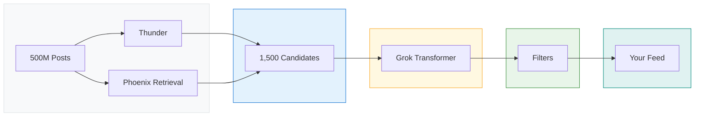
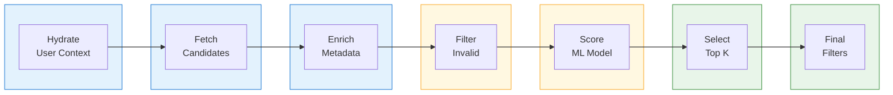
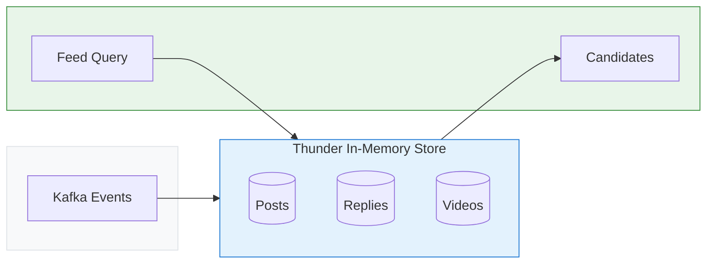
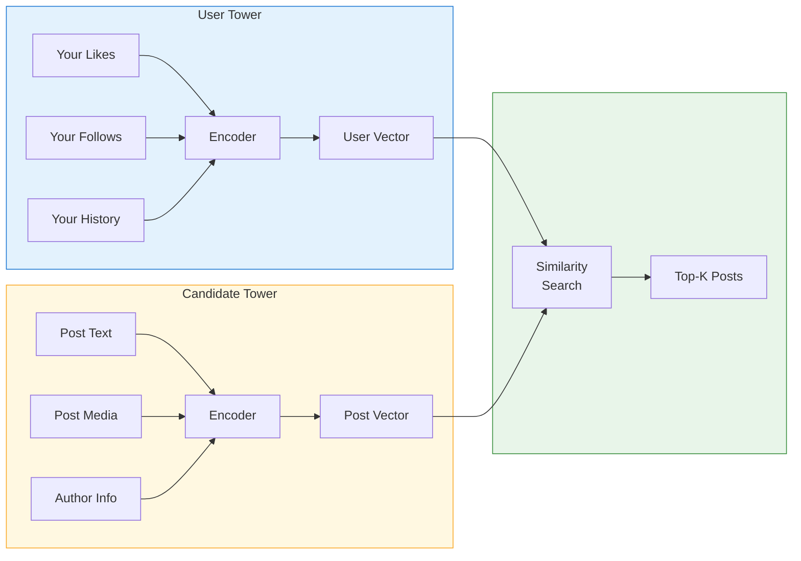
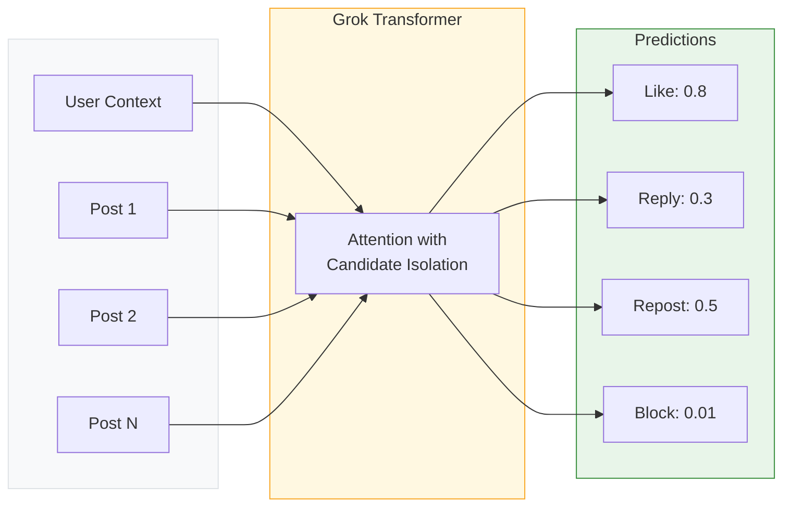
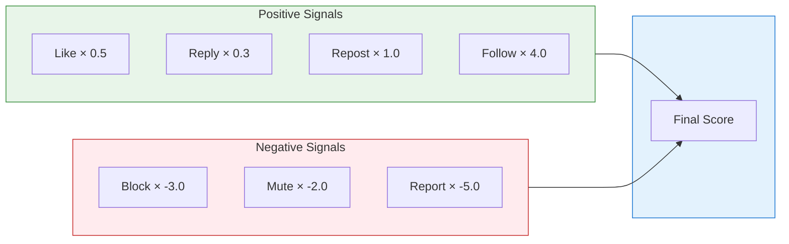
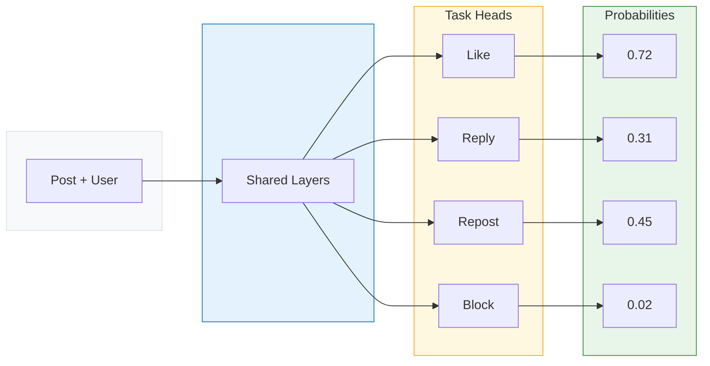

X just did something rare in the tech industry. They published the complete source code for their For You feed algorithm. Not a simplified version. Not a whitepaper. The actual production code that decides what 500 million daily active users see.

For engineers, this is a goldmine. We can finally see how a platform at this scale builds a recommendation system. The choices they made. The trade-offs they accepted. The patterns they invented.

I spent the last few days going through the [xai-org/x-algorithm](https://github.com/xai-org/x-algorithm) repository. Here's everything I learned.

## The Problem X Had to Solve

Every time you open X and see the For You tab, the platform faces an impossible problem:

- **500 million posts** are created daily
- **Millions of users** are requesting their feed simultaneously
- Each feed must be **personalized** in real-time
- The response time must be **under 200 milliseconds**

Traditional approaches break at this scale. You cannot run a neural network on 500 million posts for every user. You cannot even run it on 10 million. The computational cost would be astronomical.

So X built a funnel. A multi-stage pipeline that progressively narrows down candidates until only the most relevant survive.

## System Architecture: The 10,000 Foot View

The algorithm follows a simple funnel. Start with millions of posts, narrow down to thousands, score them, and return the best ones:



The four main components:

| Component | Role | Code |
|-----------|------|------|
| **Home Mixer** | Orchestrates the entire pipeline | [home-mixer/](https://github.com/xai-org/x-algorithm/tree/main/home-mixer) |
| **Thunder** | In-memory store for posts from people you follow | [thunder/](https://github.com/xai-org/x-algorithm/tree/main/thunder) |
| **Phoenix** | ML system for retrieval and ranking | [phoenix/](https://github.com/xai-org/x-algorithm/tree/main/phoenix) |
| **Candidate Pipeline** | Reusable framework connecting everything | [candidate-pipeline/](https://github.com/xai-org/x-algorithm/tree/main/candidate-pipeline) |

Let me break down each component.

## Home Mixer: The Orchestration Layer
<small>[View source on GitHub](https://github.com/xai-org/x-algorithm/tree/main/home-mixer)</small>

Home Mixer is the brain that coordinates everything. When a request comes in, it runs through a well-defined pipeline:



<br>

| Stage | What It Does |
|-------|--------------|
| Query Hydrators | Fetch user context (engagement history, following list) |
| Sources | Retrieve candidates from Thunder and Phoenix |
| Hydrators | Enrich candidates with metadata (author info, media) |
| Filters | Remove ineligible posts before scoring |
| Scorers | Predict engagement and compute final scores |
| Selector | Sort by score and select top K candidates |
| Post-Selection Filters | Final visibility and deduplication checks |
| Side Effects | Cache data for future requests |

The clever part is the separation between what gets fetched and what gets scored. You can change the scoring model without touching the data layer. You can add new data sources without rewriting the scorer.

This is the **Candidate Pipeline** pattern ([source](https://github.com/xai-org/x-algorithm/tree/main/candidate-pipeline)). X built it as a reusable framework with clear interfaces:

```rust
// Simplified version of the pipeline traits
trait Source {
    fn fetch_candidates(query: &Query) -> Vec<Candidate>;
}

trait Hydrator {
    fn enrich(candidate: &mut Candidate);
}

trait Filter {
    fn should_include(candidate: &Candidate) -> bool;
}

trait Scorer {
    fn score(candidates: &[Candidate]) -> Vec<ScoredCandidate>;
}

trait Selector {
    fn select(scored: Vec<ScoredCandidate>, limit: usize) -> Vec<Candidate>;
}
```

Each trait has a single responsibility. The framework handles parallel execution, error handling, and monitoring. This is textbook [SOLID principles](/gang-of-four-design-patterns/) applied at scale.

## Thunder: The In-Network Post Store
<small>[View source on GitHub](https://github.com/xai-org/x-algorithm/tree/main/thunder)</small>

Thunder is an in-memory post store. It tracks recent posts from all users and serves them at sub-millisecond latency.



When you ask for your feed, Thunder looks at who you follow and returns their recent posts. No database queries. No network hops. Everything lives in memory, partitioned by user.

**Key design choice**: Thunder maintains separate stores for different post types. Original posts, replies, reposts, and videos each have their own storage. This allows different retention policies and query patterns for each type.

The retention period is configurable. Posts older than the threshold get automatically trimmed. This keeps memory usage bounded while ensuring fresh content is always available.

## Phoenix: The ML Powerhouse
<small>[View source on GitHub](https://github.com/xai-org/x-algorithm/tree/main/phoenix)</small>

Phoenix is where the machine learning happens. It has two main jobs:

### 1. Retrieval (Two-Tower Model)

Finding relevant out-of-network posts is a needle-in-a-haystack problem. Phoenix solves it with a **Two-Tower** architecture:



The User Tower encodes your features and engagement history into a 512-dimensional vector. The Candidate Tower does the same for all posts. Finding relevant posts becomes a similarity search: which post embeddings are closest to your user embedding?

This is the same pattern used in [vector databases and RAG systems](/explainer/vector-databases-and-rag/). The difference is scale. X runs this across billions of posts in real-time.

### 2. Ranking (Grok Transformer with Candidate Isolation)

Once candidates are retrieved, they need to be ranked. Phoenix uses a transformer model based on xAI's Grok architecture, but with a twist: **candidate isolation**.



**Why candidate isolation matters**: In a normal transformer, every token can attend to every other token. If you batch 100 posts together, each post's score would depend on which other posts are in the batch. Run the same post in a different batch, get a different score.

That's a problem for caching and consistency. X solves it by masking the attention. Candidates can see the user context but not each other. The score for Post A is always the same, regardless of what other posts are being scored.

This is a brilliant trade-off. You lose some potential signal (maybe posts should be compared to each other) but you gain:
- **Consistent scores** that can be cached
- **Parallel batch processing** without ordering effects
- **Simpler debugging** since scores are deterministic

## The Scoring Formula

The transformer predicts probabilities for multiple engagement types. The final score is a weighted sum:



Here's what we know about the weights from the source code:

| Action | Direction | Relative Weight |
|--------|-----------|----------------|
| Favorite (Like) | Positive | 0.5 |
| Reply | Positive | 0.3 |
| Repost | Positive | 1.0 |
| Quote | Positive | 1.0 |
| Click | Positive | 0.1 |
| Video View | Positive | 0.2 |
| Share | Positive | 1.0 |
| Dwell Time | Positive | 0.1 |
| Follow Author | Positive | 4.0 |
| Not Interested | Negative | -1.0 |
| Block Author | Negative | -3.0 |
| Mute Author | Negative | -2.0 |
| Report | Negative | -5.0 |

Notice how negative signals carry massive weights. A single block is worth -3.0, while a like is only +0.5. The algorithm heavily penalizes content you'd find annoying.

**This is the key insight**: X optimizes for long-term user retention, not short-term engagement. Showing you rage-bait that gets clicks but makes you block the author is a net negative.

## Filtering: The Safety Net

Before and after scoring, posts go through extensive filtering:

### Pre-Scoring Filters

| Filter | Purpose |
|--------|---------|
| DropDuplicatesFilter | Remove duplicate post IDs |
| CoreDataHydrationFilter | Remove posts that failed to hydrate |
| AgeFilter | Remove posts older than threshold |
| SelfpostFilter | Don't show users their own posts |
| RepostDeduplicationFilter | Dedupe multiple reposts of same content |
| IneligibleSubscriptionFilter | Remove paywalled content user can't access |
| PreviouslySeenPostsFilter | Don't repeat recently seen posts |
| PreviouslyServedPostsFilter | Don't repeat posts from current session |
| MutedKeywordFilter | Respect user's muted keywords |
| AuthorSocialgraphFilter | Remove blocked/muted authors |

### Post-Selection Filters

| Filter | Purpose |
|--------|---------|
| VFFilter | Visibility filtering for deleted/spam/violence/gore |
| DedupConversationFilter | Deduplicate multiple branches of same conversation |

The pre-scoring filters run on all candidates. The post-selection filters run only on the final selected posts. This ordering minimizes compute. Why score a post that'll be filtered anyway?

## The Tech Stack

Looking at the repository structure reveals interesting language choices:

**Rust (62.9%)**: Used for high-performance components
- Thunder (in-memory post store)
- Candidate Pipeline framework
- Real-time serving infrastructure

**Python (37.1%)**: Used for ML components
- Phoenix model training
- Embedding generation
- Offline analysis

This is a common pattern in ML systems. Python for flexibility during model development, Rust for performance in production serving. The Rust compilation ensures memory safety and predictable latency.

## Design Patterns Worth Stealing

### 1. The Candidate Pipeline Pattern
<small>[View source on GitHub](https://github.com/xai-org/x-algorithm/tree/main/candidate-pipeline)</small>

Instead of a monolithic recommendation function, X breaks everything into composable stages:

```rust
pipeline
    .with_sources(vec![thunder_source, phoenix_retrieval])
    .with_hydrators(vec![core_data, author_info, video_duration])
    .with_filters(vec![age_filter, blocked_filter, seen_filter])
    .with_scorers(vec![phoenix_scorer, weighted_scorer, diversity_scorer])
    .with_selector(top_k_selector)
    .execute(query)
```

You can swap any component without touching others. Add a new data source? Write a new Source implementation. Change ranking logic? Swap the Scorer. This is the [Strategy Pattern](/design-patterns/strategy/) at a system level.

### 2. Hash-Based Embeddings

Vocabulary size in recommendation systems can be enormous. Millions of users, millions of posts, millions of keywords. Traditional embedding tables would use too much memory.

X uses **hash embeddings**. Instead of a unique embedding per entity, they hash entity IDs into a fixed number of buckets. Multiple entities might share an embedding, but with enough buckets and multiple hash functions, collisions average out.

```python
# Simplified concept
def get_embedding(entity_id, num_buckets=1_000_000, num_hashes=4):
    embeddings = []
    for i in range(num_hashes):
        bucket = hash(f"{entity_id}_{i}") % num_buckets
        embeddings.append(embedding_table[bucket])
    return average(embeddings)
```

This trades some precision for massive memory savings. At X's scale, that trade-off makes sense.

### 3. Multi-Task Prediction

Instead of training separate models for each engagement type, Phoenix predicts all actions simultaneously. The shared representation learns general patterns while task-specific heads learn action-specific nuances.



Multi-task learning often outperforms single-task models because tasks share underlying patterns. Someone who likes a post might also repost it. The model can learn this correlation.

## What They Explicitly Avoided

The README is surprisingly candid about what they removed:

> We have eliminated every single hand-engineered feature and most heuristics from the system.

This means:
- No explicit features for post length, media type, or posting time
- No hard-coded boost for verified accounts
- No manual trending topic signals
- No recency bias beyond what the model learns

Everything goes through the transformer. If a pattern matters (like people engaging more with video posts), the model learns it from data.

This is a bold architectural choice. Hand-crafted features give you control. You can boost breaking news manually. You can explicitly downrank certain content types. X chose to give up that control in favor of letting the model optimize directly for engagement signals.

## Lessons for Your Own Recommendation System

### 1. Build a Pipeline, Not a Model

The algorithm is not one giant model. It's a system of specialized components. This separation means:
- Teams can work independently
- Components can be tested in isolation  
- Changes have limited blast radius
- You can A/B test at any stage

If you're building recommendations, start with the pipeline architecture. The ML model is just one component.

### 2. Negative Signals Are More Important Than Positive

Look at those weights again. Blocking is worth 6x more (negatively) than liking (positively). This reflects a fundamental truth: people tolerate mediocre recommendations but leave platforms that consistently annoy them.

When designing your scoring, make sure negative signals have teeth. A report should dramatically impact future recommendations.

### 3. Candidate Isolation Enables Caching

By ensuring each post's score is independent, X can cache scores aggressively. If you've already scored a post for a user, use the cached score. Only compute new scores for new posts.

This simple invariant (same input always gives same output) enables massive performance optimizations.

### 4. Latency Trumps Accuracy

X serves hundreds of millions of requests per day. A 50ms latency increase would be catastrophic. Throughout the codebase, you see choices that prioritize speed:
- In-memory post stores
- Rust for serving
- Batch processing with isolation
- Aggressive filtering before expensive scoring

Your recommendation system's best model is useless if it's too slow to serve.

### 5. Invest in the Framework

X built Product Mixer and the Candidate Pipeline framework as reusable infrastructure. Yes, it was extra upfront work. But now every team building feeds (For You, Search, Explore) uses the same patterns.

If you're doing recommendations across multiple surfaces, build your pipeline framework once. The consistency and code reuse pays off quickly.

## What's Missing from the Open Source Release

A few notable gaps:

**Training Infrastructure**: We see the model architecture but not how they train at scale. The data pipelines, distributed training setup, and hyperparameter tuning remain private.

**Real-time Features**: The code shows static scoring but not how they incorporate live signals (current trending topics, breaking news, viral posts).

**A/B Testing Framework**: How do they test changes? What's their experiment infrastructure? Not included.

**Operational Runbooks**: How do they handle outages? What are the alert thresholds? The operational side is absent.

Still, what they did release is remarkably complete. You could reconstruct a working recommendation system from this code.

## The Bigger Picture

This release represents a shift in how we think about algorithm transparency. For years, social media algorithms were black boxes. Users complained about seeing (or not seeing) content without understanding why.

X's response is radical transparency. Here's the code. Here's how it works. If you don't like it, at least now you know what to change.

Whether this level of openness becomes an industry norm remains to be seen. But for engineers, it's a gift. We get to learn from one of the most scaled recommendation systems on the planet.

The next time you scroll through For You, you'll know exactly what's happening behind the scenes. Candidate sourcing. Grok transformer. Weighted scoring. Filtering.

500 million posts. 1,500 candidates. Your personalized feed.

And now you know how it works.

---

*For more system design deep dives, check out our posts on [How Kafka Works](/distributed-systems/how-kafka-works/), [How Slack Built a System That Handles 10+ Billion Messages](/slack-system-design/), and [Vector Databases and RAG](/explainer/vector-databases-and-rag/). Want to understand the patterns behind recommendation systems? Explore our [Design Patterns](/design-patterns/) guide.*
