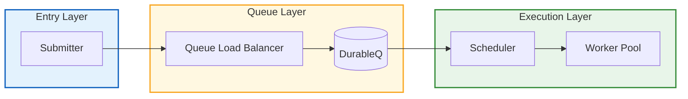
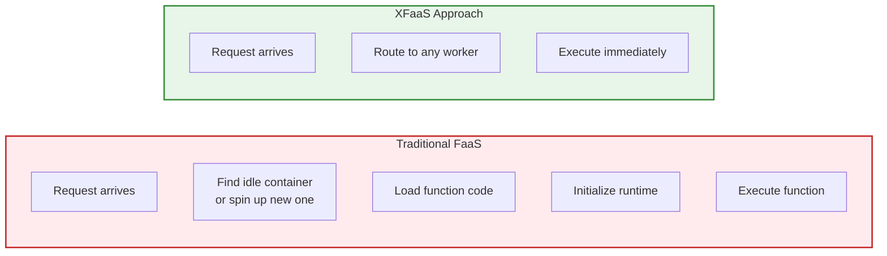
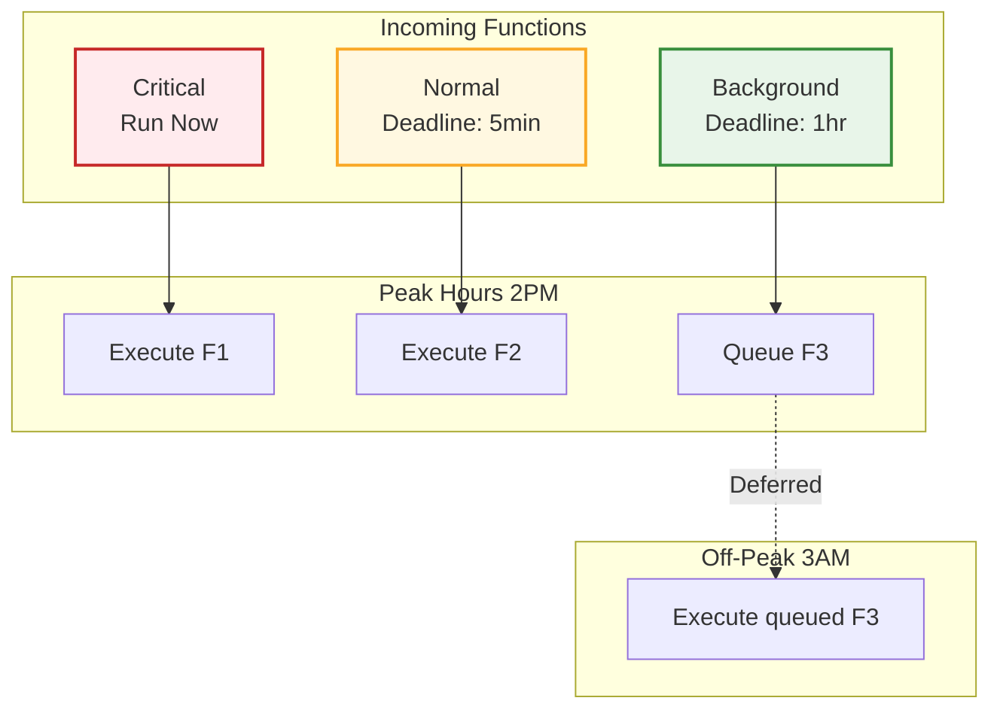
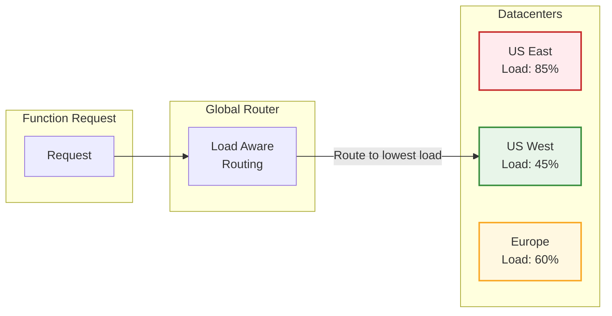
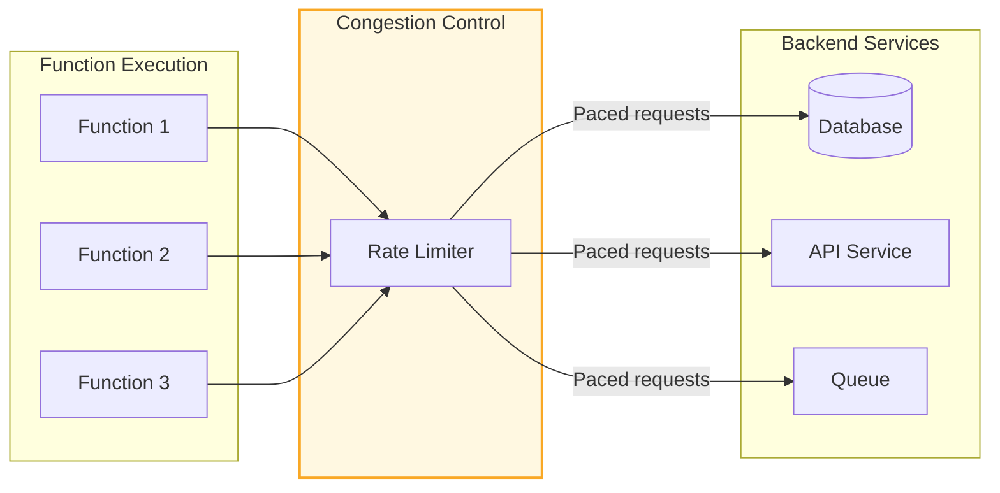
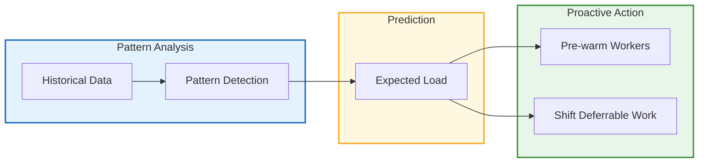

When we think about serverless at scale, most of us picture AWS Lambda or Google Cloud Functions handling a few thousand requests per second. Meta operates at a different level entirely.

Their internal platform called XFaaS processes **trillions of function calls per day**. At peak capacity, that is roughly **11.5 million function calls per second** across more than 100,000 servers in dozens of datacenter regions.

The [SOSP 2023 paper](https://www.cs.cmu.edu/~dskarlat/publications/xfaas_sosp23.pdf) published by Meta's engineering team reveals how they built this system. It is packed with lessons that apply to any developer building distributed systems.

This post breaks down what they did, why it works, and what you can steal for your own systems.

## The Scale Meta Operates At

Let me put some numbers on this so you understand what we are dealing with:

| Metric | Value |
|--------|-------|
| Daily function calls | Trillions |
| Peak calls per second | 11.5 million |
| Servers | 100,000+ |
| Datacenter regions | Dozens |
| Average CPU utilization | 66% |
| Peak vs off-peak ratio | 4.3x |

That last number is important. Their traffic is not smooth. Peak demand is 4.3 times higher than off-peak. During spikes, they receive **20 million function calls within 15 minutes**.

Most serverless platforms would fall over under these conditions. Meta built something different.

## Why 66% CPU Utilization Matters

Before diving into architecture, let me explain why that 66% CPU utilization number is such a big deal.

Typical cloud FaaS platforms run at much lower utilization rates. The problem is cold starts. When a function has not been called recently, the platform needs to spin up a new container, load the code, initialize the runtime, and then execute. This takes time, sometimes seconds.

To hide this latency, platforms keep containers warm and idle, waiting for requests. That means paying for servers that are sitting around doing nothing.

Meta cannot afford that. At their scale, every percentage point of wasted capacity means thousands of servers burning electricity for no reason. Getting to 66% utilization while maintaining performance is the result of careful engineering across the entire stack.

## XFaaS Architecture Overview

The XFaaS platform has five main components. Each one solves a specific problem in handling serverless functions at scale.



Let me explain what each component does.

### <i class="fas fa-door-open"></i> 1. Submitter: The Gatekeeper

The Submitter is the entry point for all function calls. Its main job is protecting the system from overload.

Before XFaaS had this component, clients talked directly to downstream systems. This caused problems. A misbehaving service could exhaust resources and bring down functions for everyone else.

Now the Submitter enforces quotas at the front door:

| Feature | Purpose |
|---------|---------|
| Rate limiting | Prevents any single client from overwhelming the system |
| Default quotas | Every team gets baseline capacity without asking |
| Quota negotiation | Teams can request more capacity through a formal process |
| Admission control | Rejects requests early when system is overloaded |

This is the first lesson for your own systems: **add quota enforcement at your entry points**. It is much cheaper to reject a request immediately than to let it consume resources before failing.

### <i class="fas fa-balance-scale"></i> 2. Queue Load Balancer

Once a function call passes the Submitter, it goes to the Queue Load Balancer (QueueLB). This component distributes load across the durable storage layer.

The key insight here is that function calls are not executed immediately. They are queued first. This decouples submission from execution and allows the system to smooth out traffic spikes.

### <i class="fas fa-database"></i> 3. DurableQ: Persistent Storage

DurableQ stores function call metadata persistently. This is important for reliability. If a server crashes, the queued function calls are not lost.

This component also enables one of XFaaS's key features: time-shifting. Because function calls are stored durably, they can be delayed and executed later when resources are available.

### <i class="fas fa-clock"></i> 4. Scheduler: The Brain

The Scheduler is where the magic happens. It decides which function calls to execute and when.

The Scheduler considers multiple factors:

| Factor | Description |
|--------|-------------|
| Criticality | Some functions are more important than others |
| Execution deadline | Functions have deadlines they must meet |
| Capacity quotas | Teams have resource allocations to respect |
| Worker availability | No point scheduling if no workers are free |
| Load conditions | Defer work when the system is under stress |

This is not a simple FIFO queue. The Scheduler constantly reorders work to maximize throughput while meeting deadlines.

### <i class="fas fa-server"></i> 5. Worker Pool: Execution

Finally, the Worker Pool executes the actual functions. This is 100,000+ servers distributed across global datacenters.

The key innovation here is what Meta calls the **universal worker** concept. Any worker can execute any function immediately without startup overhead.

## The Three Big Optimizations

XFaaS achieves its performance through three main optimizations. Each one addresses a fundamental challenge in serverless computing.

### <i class="fas fa-bolt"></i> Optimization 1: Eliminate Cold Starts

Cold starts are the biggest enemy of serverless performance. When a function has not run recently, spinning up a new execution environment takes time.

Meta's solution is aggressive: **make every worker ready to run every function at all times**.



How do they achieve this? The details are not fully public, but the paper hints at:

- Pre-loading commonly used function code
- Keeping runtimes initialized and warm
- Using container technologies that start fast
- Sharing resources across function types

The result: consistent, predictable latency without cold start surprises.

**Developer lesson**: If cold starts are hurting your serverless functions, look into provisioned concurrency, keep-warm patterns, or pre-initialization strategies. The cost of keeping things warm is often less than the cost of slow cold starts.

### <i class="fas fa-calendar-alt"></i> Optimization 2: Spread Load Across Time

Not all functions need to run immediately. Many background tasks like sending notifications, generating thumbnails, or updating caches can tolerate some delay.

XFaaS exploits this with **time-shifting**. Delay-tolerant functions are deferred to off-peak hours when compute resources are cheaper and more available.



This simple idea has massive impact. Instead of provisioning for peak load, Meta provisions for average load and shifts work to fill the valleys.

**Developer lesson**: Classify your workloads by latency sensitivity. Can that report generation wait until 3 AM? Can batch processing run during low-traffic hours? Time-shifting is free capacity optimization.

### <i class="fas fa-globe"></i> Optimization 3: Spread Load Across Space

Meta operates datacenters across the world. When one region is overloaded, XFaaS routes function calls to less busy regions.



This is only possible because:
1. Functions are stateless (no local data dependencies)
2. Network latency between datacenters is acceptable for background work
3. The routing system has real-time visibility into load across all regions

**Developer lesson**: If you run across multiple regions, consider routing workloads based on current load, not just geography. A request served from a less busy distant datacenter may complete faster than one stuck in a queue locally.

## Congestion Control: Protecting Downstream

Here is something many developers overlook: serverless functions do not run in isolation. They call other services. They hit databases. They send messages to queues.

When XFaaS executes 11 million functions per second, those functions generate even more downstream requests. Without controls, this would overwhelm every backend service.

Meta implemented TCP-like congestion control for function execution:



The system monitors downstream service health and slows down function execution when backends show stress. Just like TCP backs off when it detects network congestion, XFaaS backs off when it detects service overload.

**Developer lesson**: When building systems that generate load on other services, implement backpressure. Watch for error rates and latency increases from your dependencies. Slow down before you cause cascading failures.

## What XFaaS Does NOT Do

The Meta paper is clear about one thing: **XFaaS is only for non-user-facing functions**.

| Good Use Cases | Bad Use Cases |
|----------------|---------------|
| Push notifications | API request handlers |
| Thumbnail generation | User authentication |
| Data pipeline stages | Real-time search |
| Cache warming | Payment processing |
| Log aggregation | Live chat |
| Scheduled cleanup | Page rendering |

Why? Serverless functions have variable latency. Even with all of Meta's optimizations, there is inherent unpredictability in shared infrastructure. For user-facing requests where consistent sub-100ms latency matters, they use dedicated services.

**Developer lesson**: Be honest about your latency requirements. Serverless is great for background work, event processing, and batch operations. For user-facing features with strict latency SLAs, you might need dedicated compute.

## Pattern Discovery in Spiky Traffic

One interesting finding from the paper: even very spiky workloads have patterns.

Meta analyzed their function call traffic and found that:
- Daily patterns repeat (high during business hours, low at night)
- Weekly patterns repeat (different on weekends)
- Even "unpredictable" spikes often follow events (product launches, marketing campaigns)

By learning these patterns, the Scheduler can anticipate load changes and prepare resources before spikes hit.



**Developer lesson**: Track your traffic patterns. Even if your system cannot automatically adapt, knowing when spikes occur lets you prepare. Schedule maintenance during low periods. Pre-warm caches before high-traffic events.

## Real World Application: Threads Launch

When Meta launched Threads in 2023, they needed to scale quickly. Very quickly. The app gained [100 million users in five days](https://engineering.fb.com/2023/12/19/core-infra/how-meta-built-the-infrastructure-for-threads/).

Instead of building custom infrastructure, the Threads team used existing platforms like XFaaS. The serverless functions handled:
- Notification sending to millions of users
- Media processing and thumbnail generation  
- Background data synchronization
- Analytics and logging

Because XFaaS was already battle-tested at scale, Threads could focus on product features instead of infrastructure. The platform handled the explosive growth without major reengineering.

**Developer lesson**: Invest in your platform infrastructure. When the next big thing comes along, you want to bolt features onto solid foundations, not scramble to rebuild everything.

## Lessons You Can Apply Today

You probably do not run 100,000 servers. But the principles from XFaaS apply at any scale.

### <i class="fas fa-shield-alt"></i> Lesson 1: Add Quotas at Entry Points

Do not let any single client overwhelm your system. Implement rate limiting and quotas at your API gateway or load balancer. Make it easy for teams to request more capacity, but protect the system by default.

```python
# Simple quota pattern
class QuotaManager:
    def check_quota(self, client_id: str, request_count: int) -> bool:
        current = self.get_current_usage(client_id)
        limit = self.get_quota(client_id)
        return current + request_count <= limit
    
    def reject_early(self, client_id: str) -> bool:
        """Reject before consuming resources"""
        if not self.check_quota(client_id, 1):
            return True  # Reject immediately
        return False
```

### <i class="fas fa-clock"></i> Lesson 2: Classify Workloads by Latency

Not everything is equally urgent. Create clear categories:

| Category | Latency Budget | Example |
|----------|----------------|---------|
| Critical | < 100ms | Payment confirmation |
| Normal | < 1 second | API responses |
| Background | < 1 minute | Email sending |
| Batch | < 1 hour | Report generation |
| Deferrable | < 24 hours | Data archival |

Route each category to appropriate infrastructure. Use serverless for background and batch. Use dedicated services for critical paths.

### <i class="fas fa-wave-square"></i> Lesson 3: Implement Backpressure

When your dependencies struggle, slow down. Do not keep hammering a failing database.

```python
class BackpressureController:
    def __init__(self, target_service):
        self.error_rate = 0.0
        self.request_rate = 1.0  # 100%
    
    def on_response(self, success: bool):
        # Update error rate with exponential moving average
        alpha = 0.1
        error = 0 if success else 1
        self.error_rate = alpha * error + (1 - alpha) * self.error_rate
        
        # Reduce rate when errors increase
        if self.error_rate > 0.1:  # More than 10% errors
            self.request_rate = max(0.1, self.request_rate * 0.9)
        else:
            self.request_rate = min(1.0, self.request_rate * 1.05)
    
    def should_send_request(self) -> bool:
        return random.random() < self.request_rate
```

### <i class="fas fa-chart-line"></i> Lesson 4: Measure Utilization Obsessively

At Meta scale, 1% CPU improvement saves thousands of servers. At your scale, the numbers are smaller but the principle holds.

Track:
- CPU utilization across your fleet
- Memory usage and waste
- Idle time between requests
- Cold start frequency and duration
- Queue depths and wait times

What gets measured gets improved.

### <i class="fas fa-route"></i> Lesson 5: Consider Geographic Load Balancing

If you run in multiple regions, route based on load, not just geography. A request handled by a less busy distant server often beats one stuck in a local queue.

This requires:
- Real-time visibility into load across regions
- Latency-aware routing decisions
- Stateless services that can run anywhere

## The Bigger Picture

XFaaS represents a broader trend at Meta and other hyperscalers: treating all global datacenters as a single computer.

Traditional infrastructure thinking is: "I have servers in US-East. I will optimize those servers."

Meta's thinking is: "I have a million servers worldwide. I will optimize the entire fleet as one system."

This requires:
- Centralized visibility into all resources
- Automated movement of workloads across regions
- Software that works with hardware constraints, not against them

We are seeing similar patterns at Google, Amazon, and Microsoft. The hyperscalers are building operating systems for datacenters, not just servers.

## Key Takeaways

1. **Scale changes everything.** At 11 million requests per second, every optimization matters. But the principles apply at any scale.

2. **Cold starts are solvable.** With enough investment in pre-warming and universal workers, you can eliminate the cold start penalty.

3. **Time-shifting is free capacity.** If work can wait, let it wait until resources are cheap and available.

4. **Geographic distribution adds resilience.** Route to where capacity exists, not just where you are.

5. **Protect your dependencies.** Congestion control prevents cascading failures when backends struggle.

6. **Know your limits.** Serverless is great for background work. Keep user-facing features on predictable infrastructure.

7. **Patterns exist in chaos.** Even spiky traffic has patterns you can learn and exploit.

Meta is not the only company operating at this scale. But they are one of the few willing to publish detailed papers about how they do it. For developers building the next generation of distributed systems, this is required reading.

---

**Further Reading:**

- [XFaaS Paper (SOSP 2023)](https://www.cs.cmu.edu/~dskarlat/publications/xfaas_sosp23.pdf) - The original paper with all technical details
- [How X Handles 500M Daily Posts](/system-design/x-twitter-for-you-algorithm/) - Another look at hyperscale architecture
- [Service Discovery Patterns](/explainer/service-discovery/) - How distributed systems find each other
- [Rate Limiting and Throttling](/rate-limiting-and-throttling/) - Protecting your APIs from overload
- [Queues in System Design](/queues-in-system-design/) - Using queues to handle traffic spikes

*References: [SOSP 2023 Paper](https://www.cs.cmu.edu/~dskarlat/publications/xfaas_sosp23.pdf), [Engineer's Codex](https://read.engineerscodex.com/p/meta-xfaas-serverless-functions-explained), [Communications of the ACM](https://cacm.acm.org/research/metas-hyperscale-infrastructure-overview-and-insights/), [Micah Lerner's Paper Review](https://newsletter.micahlerner.com/p/paper-review-xfaas-hyperscale-and)*
