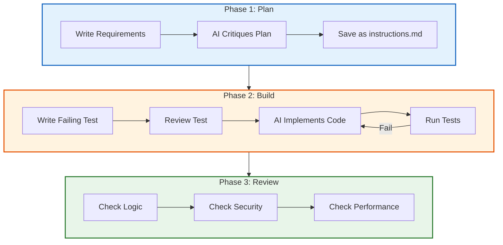
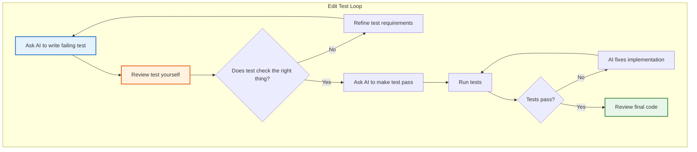
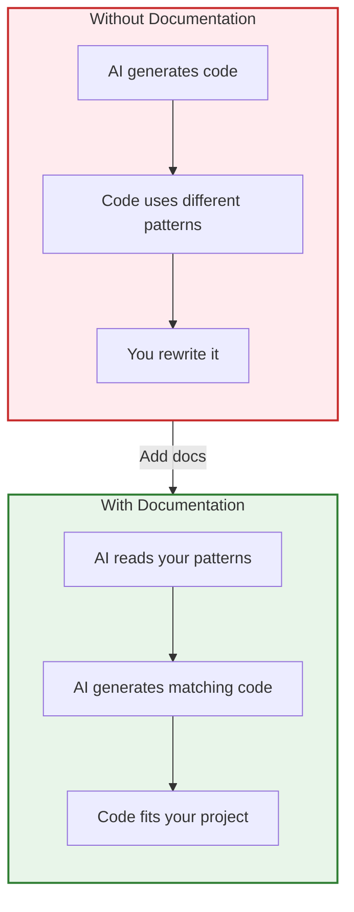
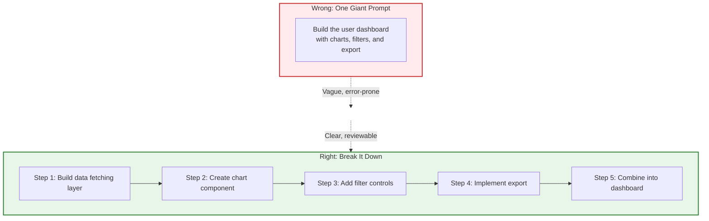

Most developers I know use AI coding assistants daily. Copilot, Cursor, Codeium, Tabnine. The tools are everywhere. But there is a huge gap between developers who get real value from these tools and those who find them frustrating.

The difference is not the tool. It is how you use it.

I have spent the last year talking to developers, reading research, and experimenting with different workflows. This post covers everything I learned about getting actual productivity gains from AI coding assistants. No fluff. Just practical lessons you can apply today.

> **TL;DR**: AI coding assistants work best when you give them structure. Write plans before coding. Keep prompts short and specific. Document your codebase so AI understands your patterns. Always review generated code like a senior engineer reviewing a junior's pull request. Use the edit test loop: write failing tests first, then have AI make them pass.

## The Reality Check

Let me start with some honesty. AI coding assistants are not magic. They will not turn a junior developer into a senior overnight. They will not write your entire application while you drink coffee.

Here is what they actually do well:

| Task | AI Performance |
|------|----------------|
| Writing boilerplate code | Excellent |
| Generating unit tests | Very good |
| Autocompleting repetitive patterns | Excellent |
| Writing regular expressions | Surprisingly good |
| Explaining existing code | Good |
| Debugging syntax errors | Good |
| Complex business logic | Poor without guidance |
| Security sensitive code | Dangerous without review |
| Understanding implicit requirements | Poor |

The developers getting real value from AI treat it as a capable but inexperienced pair programmer. It can type fast and knows a lot of patterns. But it needs clear direction and constant review.

## The Workflow That Works

After talking to dozens of developers who are productive with AI tools, a clear pattern emerged. Here is the workflow:



Let me break down each phase.

## Phase 1: Plan Before You Code

This is the single biggest difference between developers who love AI tools and those who find them frustrating. The ones who love them write a plan first.

### <i class="fas fa-file-alt"></i> Write Your Requirements Down

Before opening your IDE, create a markdown file describing what you want to build. Be specific:

```markdown
# Feature: User Authentication

## Requirements
- Users can sign up with email and password
- Passwords must be at least 8 characters
- Send verification email after signup
- Users can log in with verified email
- Return JWT token on successful login
- Tokens expire after 24 hours

## Technical Constraints
- Use bcrypt for password hashing
- Use our existing EmailService for sending emails
- Store users in PostgreSQL
- Follow our existing API response format

## Edge Cases
- Duplicate email registration should return 409
- Invalid credentials should return 401
- Unverified email login should return 403
```

This document does several things:

1. Forces you to think through the problem before coding
2. Gives AI complete context about what you want
3. Catches missing requirements early
4. Serves as documentation later

### <i class="fas fa-comments"></i> Have AI Critique Your Plan

Once you have a draft, ask AI to find gaps:

```
Review this requirements document and identify:
1. Missing edge cases
2. Security concerns I should address
3. Performance considerations
4. Anything ambiguous that needs clarification
```

A good AI will point out things like: "What happens if the email service is down? Should signup fail or should you queue the email?" or "You mention JWT tokens but not refresh tokens. How will users stay logged in after 24 hours?"

This back and forth catches problems when they are cheap to fix. Changing a requirements doc takes seconds. Changing code takes hours.

### <i class="fas fa-save"></i> Save Your Final Plan

Save your refined plan as `instructions.md` in your project. Reference it in every prompt:

```
Following the requirements in instructions.md, implement the signup endpoint.
```

This simple practice eliminates most "the AI got confused halfway through" problems.

## Phase 2: The Edit Test Loop

This is where most developers go wrong. They ask AI to write code, paste it into their project, and hope it works. Then they spend hours debugging AI generated bugs.

The better approach is test driven development with AI:



### <i class="fas fa-vial"></i> Start With the Test

Ask AI to write a failing test first:

```
Write a pytest test for the signup endpoint that verifies:
- Successful signup returns 201 with user id
- Duplicate email returns 409
- Weak password returns 400 with error message
- Missing fields return 422
```

### <i class="fas fa-search"></i> Review the Test

Before moving on, read the test carefully. Does it actually test what you want? AI often makes assumptions. A test for "weak password returns 400" might only check that the password is 8 characters long without verifying complexity requirements.

This is your checkpoint. If the test is wrong, the implementation will be wrong too.

### <i class="fas fa-code"></i> Let AI Implement

Once the test looks right, ask AI to make it pass:

```
Implement the signup endpoint to make all these tests pass.
Follow the patterns in our existing auth_controller.py.
```

The AI now has a clear target. It will write code until the tests pass. You can let it iterate automatically on failures.

### Why This Works

The edit test loop works because it flips the problem. Instead of "write code that does X" (vague), you ask "write code that passes this specific test" (concrete).

AI is much better at the second task. Tests are unambiguous. Either they pass or they fail. There is no room for AI to misunderstand your requirements if the requirements are expressed as executable tests.

## Phase 3: The Code Review

Never merge AI generated code without review. Ever.

I know this sounds obvious, but I have seen production bugs from developers who trusted Copilot suggestions blindly. AI generated code can look perfectly reasonable while hiding serious problems.

### <i class="fas fa-exclamation-triangle"></i> What AI Gets Wrong

Here are real examples of AI generated code that looked fine but was not:

**Performance Problem:**
```python
# AI generated code that looks reasonable
def get_user_orders(user_ids: list[int]) -> list[Order]:
    orders = []
    for user_id in user_ids:
        user_orders = db.query(Order).filter(Order.user_id == user_id).all()
        orders.extend(user_orders)
    return orders
```

This is an [N+1 query problem](/explainer/n-plus-one-query-problem/). With 1000 users, you make 1000 database calls instead of one. It works in development with 10 users and falls over in production.

**Security Problem:**
```python
# AI generated authentication check
def is_admin(user_id: int) -> bool:
    user = db.query(User).filter(User.id == user_id).first()
    return user.role == "admin"  # What if user is None?
```

This crashes if the user does not exist. Worse, in some frameworks a crash might expose stack traces to attackers.

**Logic Problem:**
```python
# AI generated discount calculation
def apply_discount(price: float, discount_percent: int) -> float:
    return price - (price * discount_percent / 100)
```

Looks fine until someone passes discount_percent=150 and you end up paying customers to take your products.

### <i class="fas fa-clipboard-check"></i> Your Review Checklist

Go through every AI generated code block with this checklist:

| Check | Questions to Ask |
|-------|-----------------|
| Logic | Does this handle edge cases? What if inputs are null, empty, or unexpected? |
| Security | Can users manipulate inputs to cause harm? Is data validated? |
| Performance | Will this scale? Are there N+1 queries, unnecessary loops, or missing indexes? |
| Error Handling | What happens when things fail? Are errors caught and handled gracefully? |
| Readability | Will other developers understand this in 6 months? |

This review should feel like reviewing a pull request from a junior developer. Assume competence but verify everything.

## Context is Everything

AI models only know what you tell them. The quality of their output directly depends on the quality of context you provide.

### <i class="fas fa-database"></i> Document Your Codebase First

Before asking AI to generate new features, make sure your existing code is documented. AI that understands your patterns generates code that fits your codebase.



Create these documents if you do not have them:

1. **README** with project structure and architecture overview
2. **CONTRIBUTING.md** with code style and patterns
3. **API documentation** for existing endpoints
4. **Comments** on complex functions explaining why, not what

This upfront investment pays off quickly. AI starts generating code that looks like it belongs in your project.

### <i class="fas fa-compress-arrows-alt"></i> Keep Context Focused

A counterintuitive lesson: more context is not always better.

Dumping your entire codebase into the prompt overwhelms the model. It loses focus on what matters. Studies show AI performance actually degrades when context gets too large.

Instead:

| Do | Do Not |
|-----|-------|
| Reference specific files: `@auth/controller.py:42-88` | Paste entire files into prompts |
| Link to relevant documentation | Include unrelated code "just in case" |
| Summarize the codebase with tools like gitingest | Copy the whole project |
| Focus on the task at hand | Mix multiple unrelated tasks |

Think of it like giving directions. "Turn left at the coffee shop, then right at the park" is better than describing every building in the neighborhood.

### <i class="fas fa-sync"></i> Re-index After Major Changes

If you refactor significantly, tell AI about it. Most AI tools cache information about your project. That cache goes stale when you rename files, change patterns, or restructure directories.

In Cursor, use the resync command. In Copilot, close and reopen files you changed. The specific method varies by tool, but the principle is the same: keep AI's understanding of your code current.

## Prompting Patterns That Work

### <i class="fas fa-bullseye"></i> Be Specific

Vague prompts produce vague results. Compare:

**Bad prompt:**
```
Write a function to process user data.
```

**Good prompt:**
```
Write a Python function that:
- Takes a list of user dictionaries with keys: name, email, age
- Filters out users under 18
- Sorts remaining users by name alphabetically
- Returns a list of formatted strings: "Name (email)"
- Include type hints and a docstring
```

The good prompt leaves nothing to interpretation. AI knows exactly what you want.

### <i class="fas fa-project-diagram"></i> Show Your Work

Ask AI to explain its reasoning before writing code:

```
Before writing code, explain your approach:
1. What are the key components needed?
2. What edge cases should we handle?
3. What existing patterns in our codebase should we follow?

Then implement the solution.
```

Models that "think out loud" make fewer mistakes. This is backed by research. When AI explains its plan first, you can catch wrong assumptions before they become wrong code.

### <i class="fas fa-cubes"></i> Break Down Complex Tasks

Do not ask AI to build your entire feature in one prompt. Break it into pieces:



Each smaller task is easier for AI to get right. And if something goes wrong, you know exactly where.

## Choosing the Right Tool for the Task

Different AI coding assistants have different strengths. Match your tool to your task:

| Task | Best Tool |
|------|-----------|
| Quick autocomplete while typing | Inline suggestions (Copilot, Codeium) |
| Writing a single function | Inline generation |
| Explaining complex code | Chat interface |
| Refactoring across files | Agentic tools (Cursor Agent, Aider) |
| Large migrations | Agentic frameworks with planning |
| Code review | Chat with file references |

### <i class="fas fa-keyboard"></i> Inline Suggestions

Best for: Completing code as you type. Writing repetitive patterns. Quick boilerplate.

These work like advanced autocomplete. You start typing, AI suggests the rest. Accept or reject with a keystroke.

Good for speed, bad for complex logic. The AI has minimal context about your intent.

### <i class="fas fa-comments"></i> Chat Interfaces

Best for: Explaining code. Debugging. Generating larger code blocks. Asking questions.

You describe what you want in natural language. AI generates code you can review before using. More context means better results.

Takes longer than inline but produces better quality for complex tasks.

### <i class="fas fa-robot"></i> Agentic Tools

Best for: Changes across multiple files. Refactoring. Migrations. Complex features.

These tools can plan, execute, and iterate. They read your codebase, propose changes across files, run tests, and fix failures.

More powerful but less predictable. Requires more oversight. Best for experienced developers who can review the output.

## What AI Cannot Do

Knowing AI limitations saves frustration. Here is what not to expect:

### <i class="fas fa-ban"></i> Understand Your Business

AI does not know your users, your market, or your company goals. It cannot decide whether a feature is worth building or how it should work.

You still need to do product thinking. AI helps with the how, not the what or why.

### <i class="fas fa-user-shield"></i> Guarantee Security

AI generates code that looks secure but might not be. It follows patterns from training data, which includes insecure code.

Never trust AI with:
- Authentication and authorization logic
- Input validation
- Encryption and key management
- SQL queries (without parameterization review)

Always have security sensitive code reviewed by a human who understands security.

### <i class="fas fa-brain"></i> Replace Your Expertise

AI is a tool, not a replacement. It makes good developers more productive. It does not make inexperienced developers good.

If you do not understand the code AI generates, you cannot:
- Debug it when it breaks
- Modify it when requirements change
- Explain it in code review
- Take responsibility for it

Use AI to speed up tasks you already know how to do. Use learning resources to build skills you do not have yet.

## Measuring Your Productivity

How do you know if AI is actually helping? Track these metrics:

| Metric | What It Tells You |
|--------|------------------|
| Tasks completed per day | Overall productivity |
| Time from start to working code | Development speed |
| Bugs found in code review | Code quality |
| Time spent debugging AI code | Hidden costs |
| Test coverage | Confidence in correctness |

Some developers find they complete more tasks but spend more time debugging. That is a net loss. Measure honestly and adjust your workflow based on data.

## Building Good Habits

### <i class="fas fa-undo"></i> Commit Often

Make small, frequent commits when working with AI. This gives you:

- Easy rollback points if AI goes wrong
- Clear history of what changed
- Simpler code review diffs

Do not let AI generate 500 lines and commit it all at once. Build incrementally.

### <i class="fas fa-check-double"></i> Run Your Tests

AI does not run your tests automatically (unless you set it up to). After every AI generated change:

```bash
# Make this a habit
git add -A
npm test  # or your test command
git commit -m "Add signup validation"
```

Catching bugs immediately is much faster than debugging later.

### <i class="fas fa-file-code"></i> Keep Code Simple

AI sometimes generates overly complex solutions. If a function is hard to understand, ask for a simpler version:

```
This implementation is complex. Refactor it to be more readable.
Prioritize clarity over cleverness.
```

Simple code is easier to review, easier to debug, and easier to maintain. Do not accept complexity just because AI generated it.

## Quick Reference: Prompting Cheat Sheet

| Situation | Prompt Pattern |
|-----------|---------------|
| Generate new code | "Write a [language] function that [specific behavior]. Include [constraints]." |
| Fix a bug | "This code has a bug: [paste code]. The expected behavior is [X] but actual behavior is [Y]. Fix it." |
| Add tests | "Write tests for [function] covering: [list of cases]" |
| Explain code | "Explain what this code does step by step: [paste code]" |
| Refactor | "Refactor this to [goal]. Keep the same behavior." |
| Code review | "Review this code for [security/performance/readability]. List specific issues." |

## Key Takeaways

1. **Plan first.** Write requirements in a markdown file before coding. Have AI critique your plan. This prevents confusion later.

2. **Use the edit test loop.** Have AI write failing tests, review them, then ask AI to make them pass. Tests catch wrong assumptions early.

3. **Review everything.** Treat AI output like a junior developer's code. Check logic, security, performance, and edge cases.

4. **Keep context focused.** Reference specific files instead of dumping code. More context is not always better.

5. **Match tool to task.** Use inline suggestions for quick completions. Use chat for complex generation. Use agents for changes across multiple files.

6. **Know the limits.** AI cannot understand business context, guarantee security, or replace your expertise. Use it for what it is good at.

7. **Measure honestly.** Track if AI actually saves time. Some workflows create hidden debugging costs.

The developers getting the most from AI coding assistants are not the ones who type the fewest keystrokes. They are the ones who provide clear direction, review thoroughly, and build good habits around an imperfect but useful tool.

---

**Further Reading:**

- [Context Engineering Guide for AI Developers](/context-engineering/) - Master what information you give to AI
- [How LLMs Generate Text](/how-llms-generate-text/) - Understand what happens under the hood
- [Prompt Engineering Basics](/prompt-engineering-basics/) - Foundational prompting skills
- [Building AI Agents](/building-ai-agents/) - Take AI automation to the next level

*References: [Google Cloud](https://cloud.google.com/blog/topics/developers-practitioners/five-best-practices-for-using-ai-coding-assistants), [GitHub](https://docs.github.com/en/copilot/get-started/best-practices), [Forge Code](https://forgecode.dev/blog/ai-agent-best-practices/), [Sonar](https://sonarsource.com/learn/7-habits-of-highly-effective-ai-coding)*
