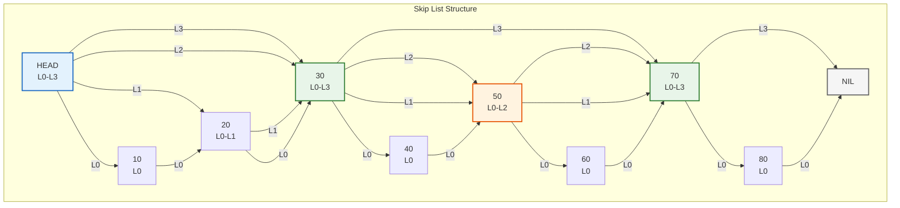
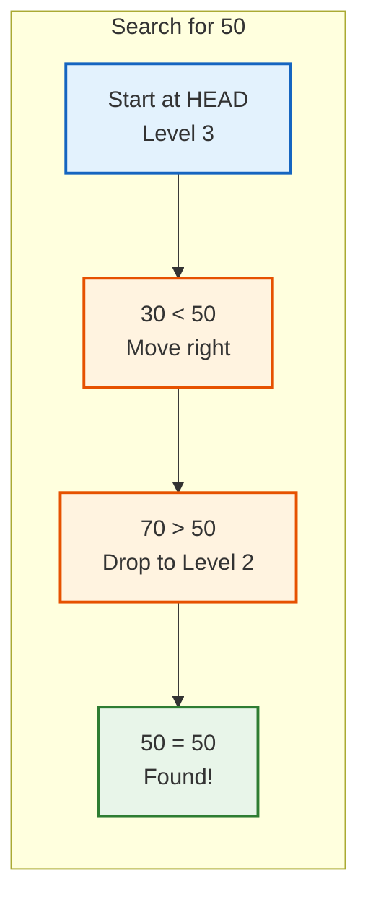

You have a sorted linked list with a million elements. Finding any element takes O(n) time because you have to traverse from the head. That is slow.

You could use a balanced tree instead. AVL trees and red-black trees give you O(log n) search. But implementing them correctly is hard. Rotations, color flipping, height balancing. It is easy to get wrong.

What if you could get O(log n) performance with a data structure that is actually simple to implement? No rotations. No rebalancing. Just flip a coin a few times.

That is what skip lists do. And they work well enough that Redis, LevelDB, and other production systems use them for their core operations.

## What is a Skip List?

A skip list (also written as skiplist) is a data structure that extends a sorted linked list with multiple levels of forward pointers. Think of it as adding express lanes on top of a regular linked list.



In a regular linked list, you traverse every single node. In a skip list, you can jump over many nodes at once using the higher levels, then drop down to find the exact position.

William Pugh invented skip lists in 1989 as a simpler alternative to balanced trees. His original paper showed that skip lists perform comparably to AVL trees and 2-3 trees, but with much simpler algorithms.

### The Key Insight

The genius of skip lists is using randomness instead of strict structure.

In a balanced tree, you maintain balance through careful rotations after every insertion and deletion. Get the rotation wrong, and your tree becomes unbalanced. Debugging is painful.

In a skip list, each node gets a random height when inserted. No rotations needed. No complex invariants to maintain. The randomness naturally creates a balanced structure with high probability.

## How Skip List Structure Works

A skip list node contains:
- A key (the value stored)
- An array of forward pointers (one for each level the node participates in)

```python
class SkipListNode:
    def __init__(self, key, level):
        self.key = key
        self.forward = [None] * (level + 1)  # Array of forward pointers
```

The head node spans all levels. Each regular node spans from level 0 up to its randomly assigned level.

### <i class="fas fa-layer-group"></i> Level Distribution

Levels are assigned randomly using a simple algorithm:

1. Start at level 0
2. Flip a coin
3. If heads, increase level by 1 and flip again
4. If tails, stop

This creates a geometric distribution where:
- 50% of nodes have level 0 (base level only)
- 25% have level 1
- 12.5% have level 2
- 6.25% have level 3
- And so on

```python
import random

def random_level(max_level, p=0.5):
    level = 0
    while random.random() < p and level < max_level:
        level += 1
    return level
```

The expected height of the tallest node in a skip list with n elements is O(log n). This is why search takes logarithmic time.

## How Skip List Search Works

Searching in a skip list is like having express trains and local trains.

To find a value:
1. Start at the head node at the highest level
2. Move right while the next node's key is less than the target
3. When you cannot move right (next is greater or NIL), drop down one level
4. Repeat until you find the target or reach level 0



### Search Implementation

```python
def search(self, target):
    current = self.head
    
    # Start from highest level and work down
    for level in range(self.level, -1, -1):
        # Move right while next node's key is less than target
        while current.forward[level] and current.forward[level].key < target:
            current = current.forward[level]
    
    # Move to level 0 candidate
    current = current.forward[0]
    
    # Check if we found the target
    if current and current.key == target:
        return current
    return None
```

### Why Search is O(log n)

At each level, you skip over roughly half the remaining nodes. This is similar to binary search.

With probability p = 0.5:
- Level k has about n/2^k nodes
- You traverse at most O(1) nodes at each level before dropping down
- There are O(log n) levels

Total comparisons: O(log n)

## How Skip List Insertion Works

Insertion has two phases:
1. Find where the new node should go (like search)
2. Insert the node at its random level and update pointers

### Step by Step Insertion

To insert value 45:

1. Search for position, tracking nodes where you dropped down (these are the update points)
2. Generate random level for new node
3. Create new node and connect it at each level

```mermaid
flowchart LR
    subgraph Before["Before Insert"]
        direction LR
        BH["HEAD"] --> B30["30"] --> B40["40"] --> B50["50"] --> B70["70"]
    end
    
    subgraph After["After Insert 45"]
        direction LR
        AH["HEAD"] --> A30["30"] --> A40["40"] --> A45["45"] --> A50["50"] --> A70["70"]
    end
    
    Before --> After
    
    style BH fill:#e3f2fd,stroke:#1565c0,stroke-width:2px
    style B30 fill:#fff3e0,stroke:#e65100,stroke-width:2px
    style B40 fill:#fff3e0,stroke:#e65100,stroke-width:2px
    style B50 fill:#fff3e0,stroke:#e65100,stroke-width:2px
    style B70 fill:#fff3e0,stroke:#e65100,stroke-width:2px
    style AH fill:#e3f2fd,stroke:#1565c0,stroke-width:2px
    style A30 fill:#e8f5e9,stroke:#2e7d32,stroke-width:2px
    style A40 fill:#e8f5e9,stroke:#2e7d32,stroke-width:2px
    style A45 fill:#fce4ec,stroke:#c2185b,stroke-width:3px
    style A50 fill:#e8f5e9,stroke:#2e7d32,stroke-width:2px
    style A70 fill:#e8f5e9,stroke:#2e7d32,stroke-width:2px
```



### Insertion Implementation

```python
def insert(self, key):
    update = [None] * (self.max_level + 1)
    current = self.head
    
    # Find position and track update points
    for level in range(self.level, -1, -1):
        while current.forward[level] and current.forward[level].key < key:
            current = current.forward[level]
        update[level] = current
    
    # Generate random level for new node
    new_level = random_level(self.max_level)
    
    # If new level exceeds current max, update head pointers
    if new_level > self.level:
        for level in range(self.level + 1, new_level + 1):
            update[level] = self.head
        self.level = new_level
    
    # Create new node
    new_node = SkipListNode(key, new_level)
    
    # Insert node by updating forward pointers
    for level in range(new_level + 1):
        new_node.forward[level] = update[level].forward[level]
        update[level].forward[level] = new_node
```

The beauty of this algorithm: no rotations, no rebalancing. Just pointer updates.

## How Skip List Deletion Works

Deletion is the reverse of insertion:

1. Find the node to delete (tracking update points)
2. Update forward pointers at each level to skip over the deleted node
3. Reduce skip list level if the highest level is now empty

### Deletion Implementation

```python
def delete(self, key):
    update = [None] * (self.max_level + 1)
    current = self.head
    
    # Find the node and track update points
    for level in range(self.level, -1, -1):
        while current.forward[level] and current.forward[level].key < key:
            current = current.forward[level]
        update[level] = current
    
    target = current.forward[0]
    
    if target and target.key == key:
        # Remove target from each level
        for level in range(self.level + 1):
            if update[level].forward[level] != target:
                break
            update[level].forward[level] = target.forward[level]
        
        # Reduce level if highest levels are now empty
        while self.level > 0 and self.head.forward[self.level] is None:
            self.level -= 1
        
        return True
    return False
```

## Skip List Time Complexity

| Operation | Average Case | Worst Case |
|-----------|-------------|------------|
| Search | O(log n) | O(n) |
| Insert | O(log n) | O(n) |
| Delete | O(log n) | O(n) |
| Space | O(n) | O(n log n) |

The worst case happens if all nodes get the same level (extremely unlikely) or if levels are heavily skewed. But the probability of this is negligible.

### Probability Analysis

For a skip list with n = 250 elements, William Pugh calculated that the probability of any search taking more than 3 times the expected time is less than one in a million.

The expected number of comparisons for a search is:

```
(log₂ n) / p + 1/p
```

With p = 0.5, this is roughly 2 log₂ n comparisons. Very close to a perfectly balanced binary search tree.

## Skip List vs Red-Black Tree and Balanced Trees

Why would you choose a skip list over a red-black tree or AVL tree? This is a common question, especially since both provide O(log n) operations.

| Feature | Skip List | Red-Black Tree | AVL Tree |
|---------|-----------|----------------|----------|
| Search complexity | O(log n) avg | O(log n) | O(log n) |
| Implementation complexity | Simple | Complex | Complex |
| Rotations needed | No | Yes | Yes |
| Rebalancing | No | Yes | Yes |
| Concurrent access | Easy | Hard | Hard |
| Range queries | Fast | Fast | Fast |
| Memory overhead | ~2n pointers | 3n pointers | 3n pointers |
| Cache locality | Good | Variable | Variable |

### <i class="fas fa-check"></i> When to Choose Skip Lists

**Simplicity matters**: If you need to implement the data structure yourself, skip lists are much easier to get right. Red-black tree insertion has multiple cases and rotations. Skip list insertion is straightforward.

**Concurrent access**: Skip lists naturally support concurrent operations. Insertions only modify local pointers, making lock-free implementations feasible. Java's `ConcurrentSkipListMap` takes advantage of this.

**Frequent insertions**: Skip lists handle rapid insertions well since there is no rebalancing overhead.

### <i class="fas fa-times"></i> When Balanced Trees Might Be Better

**Guaranteed worst case**: If you absolutely cannot tolerate O(n) worst case (even with one in a million probability), balanced trees guarantee O(log n).

**Memory constrained**: Skip lists have more pointer overhead per node on average.

**Write-once, read-many**: If data is inserted once and searched many times, the extra implementation complexity of balanced trees might be worth it for slightly faster operations.

## Real World Skip List Usage

### <i class="fas fa-database"></i> Redis Sorted Sets: Skip List vs Red-Black Tree

Does Redis use skip lists instead of red-black trees? Yes. Redis uses skip lists for its sorted set (ZSET) implementation rather than red-black trees or other balanced tree structures.

When you run commands like:

```
ZADD leaderboard 1000 "player1"
ZADD leaderboard 2500 "player2"
ZRANK leaderboard "player1"
```

Redis stores this in a skip list. The skip list allows:
- O(log n) insert of new scores
- O(log n) rank queries
- O(log n) range queries by score

Why did Redis choose skip lists over red-black trees? Antirez (Redis creator Salvatore Sanfilippo) explained that skip lists are simpler to implement correctly, easier to debug, and perform just as well as red-black trees in practice. The code is more maintainable, and the performance difference is negligible for real workloads. For a complex system like Redis, code simplicity matters more than theoretical optimality.

### <i class="fas fa-layer-group"></i> LevelDB MemTable Skip List

Google's LevelDB uses a skip list for its MemTable, the in-memory write buffer that stores recent writes before flushing to disk. The LevelDB skip list MemTable is a critical component of the LSM-tree architecture.

When you write to LevelDB:
1. Data goes into the skip list MemTable in memory
2. When the MemTable reaches a size threshold (typically 4MB), it becomes immutable
3. The skip list is flushed to disk as a sorted SSTable file
4. A new empty skip list MemTable is created for incoming writes

Why does LevelDB use a skip list for its MemTable instead of a balanced tree?

- **Fast concurrent writes**: Skip lists handle concurrent insertions efficiently
- **Sorted iteration**: Data is already sorted when flushing to disk
- **Simple implementation**: Fewer bugs in critical storage code
- **No rebalancing overhead**: Insertions are purely local operations

RocksDB, Facebook's fork of LevelDB, also uses skip lists for its MemTable. The skiplist data structure has become the standard choice for LSM-tree based storage engines.

### <i class="fas fa-search"></i> Apache Lucene

Lucene uses skip lists in its inverted index for efficient posting list intersection. When searching for documents matching multiple terms, skip lists allow jumping ahead in sorted document ID lists.

### <i class="fas fa-code"></i> Java ConcurrentSkipListMap

Java's standard library includes `ConcurrentSkipListMap` and `ConcurrentSkipListSet`. These provide thread-safe sorted collections without global locks.

```java
ConcurrentSkipListMap<Integer, String> map = new ConcurrentSkipListMap<>();
map.put(3, "three");
map.put(1, "one");
map.put(2, "two");

// Iteration is in sorted order
for (Map.Entry<Integer, String> entry : map.entrySet()) {
    System.out.println(entry.getKey() + ": " + entry.getValue());
}
```

## Complete Skip List Implementation

Here is a complete, working skip list implementation in Python:

```python
import random

class SkipListNode:
    def __init__(self, key, level):
        self.key = key
        self.forward = [None] * (level + 1)

class SkipList:
    def __init__(self, max_level=16, p=0.5):
        self.max_level = max_level
        self.p = p
        self.level = 0
        self.head = SkipListNode(None, max_level)
    
    def _random_level(self):
        level = 0
        while random.random() < self.p and level < self.max_level:
            level += 1
        return level
    
    def search(self, key):
        current = self.head
        
        for level in range(self.level, -1, -1):
            while current.forward[level] and current.forward[level].key < key:
                current = current.forward[level]
        
        current = current.forward[0]
        
        if current and current.key == key:
            return current.key
        return None
    
    def insert(self, key):
        update = [None] * (self.max_level + 1)
        current = self.head
        
        for level in range(self.level, -1, -1):
            while current.forward[level] and current.forward[level].key < key:
                current = current.forward[level]
            update[level] = current
        
        current = current.forward[0]
        
        # If key already exists, do not insert duplicate
        if current and current.key == key:
            return False
        
        new_level = self._random_level()
        
        if new_level > self.level:
            for level in range(self.level + 1, new_level + 1):
                update[level] = self.head
            self.level = new_level
        
        new_node = SkipListNode(key, new_level)
        
        for level in range(new_level + 1):
            new_node.forward[level] = update[level].forward[level]
            update[level].forward[level] = new_node
        
        return True
    
    def delete(self, key):
        update = [None] * (self.max_level + 1)
        current = self.head
        
        for level in range(self.level, -1, -1):
            while current.forward[level] and current.forward[level].key < key:
                current = current.forward[level]
            update[level] = current
        
        target = current.forward[0]
        
        if target and target.key == key:
            for level in range(self.level + 1):
                if update[level].forward[level] != target:
                    break
                update[level].forward[level] = target.forward[level]
            
            while self.level > 0 and self.head.forward[self.level] is None:
                self.level -= 1
            
            return True
        return False
    
    def display(self):
        print("Skip List:")
        for level in range(self.level, -1, -1):
            print(f"Level {level}: ", end="")
            node = self.head.forward[level]
            while node:
                print(f"{node.key} -> ", end="")
                node = node.forward[level]
            print("NIL")

# Usage example
skip_list = SkipList()

# Insert elements
for val in [30, 10, 50, 20, 70, 40, 60]:
    skip_list.insert(val)

skip_list.display()

# Search
print(f"Search 40: {skip_list.search(40)}")
print(f"Search 35: {skip_list.search(35)}")

# Delete
skip_list.delete(40)
print(f"After deleting 40, search 40: {skip_list.search(40)}")
```

## Skip List Optimizations

### Choosing the Right Probability

The standard probability is p = 0.5, but you can tune it:

| p value | Avg pointers per node | Search comparisons |
|---------|----------------------|-------------------|
| 0.5 | 2 | 2 log₂ n |
| 0.25 | 1.33 | 4 log₄ n |
| 0.125 | 1.14 | 8 log₈ n |

Lower p values use less memory but require more comparisons. For most cases, p = 0.5 or p = 0.25 works well.

### Setting Maximum Level

The maximum level should be chosen based on expected data size:

```
max_level = log(n) / log(1/p)
```

For n = 1 million elements with p = 0.5:
```
max_level = log(1000000) / log(2) ≈ 20
```

A max_level of 16 to 32 works for most applications.

### Unrolled Skip Lists

For better cache performance, store multiple keys per node instead of one. This reduces pointer chasing and improves locality.

## Common Interview Questions

**Q: Why use skip lists instead of hash tables?**

Hash tables give O(1) average lookup but do not maintain sorted order. Skip lists give O(log n) lookup but support range queries, finding minimum/maximum, and iterating in sorted order. Use hash tables for exact key lookup, skip lists when you need ordering.

**Q: How do you choose the maximum level?**

Use `log₂(n)` where n is the expected number of elements. In practice, 16 to 32 levels handles billions of elements.

**Q: Can skip lists have duplicate keys?**

Yes. You can modify insertion to allow duplicates by not checking for existing keys, or by using secondary sorting.

**Q: What is the expected space usage?**

With p = 0.5, each node has 2 pointers on average (1 + 1/2 + 1/4 + ...). Total space is O(n) with approximately 2n pointers.

**Q: Why does Redis use skip lists instead of red-black trees?**

Redis creator Antirez explained: skip lists are simpler to implement correctly, have comparable performance, and are easier to debug. The simplicity matters for maintaining a complex system like Redis.

## Key Takeaways

1. **Skip lists achieve O(log n) search without rotations or rebalancing.** They use randomness to maintain balance probabilistically.

2. **The structure is simple.** A sorted linked list with multiple levels of forward pointers. Higher levels skip over more nodes.

3. **Level assignment uses coin flips.** Each node's height is determined randomly during insertion. This naturally creates logarithmic height.

4. **Real systems use skip lists.** Redis sorted sets, LevelDB MemTable, Java ConcurrentSkipListMap. They are production-proven.

5. **Skip lists excel at concurrent access.** Insertions are local, making lock-free implementations practical.

6. **Trade-off: simplicity for guaranteed worst case.** O(n) worst case is possible but extremely unlikely. For most applications, this is acceptable.

7. **Implementation is straightforward.** About 100 lines of code for a working skip list. Compare that to a correct red-black tree implementation.

---

**Further Reading**:

- [B-Tree Data Structure Explained](/data-structures/b-tree/) - How databases use trees for disk-based storage
- [Bloom Filter Explained](/data-structures/bloom-filter/) - Another probabilistic data structure
- [Graph Data Structure Explained](/data-structures/graph/) - Graphs and graph algorithms
- [Hash Table Collisions Explained](/data-structures/hashtable-collisions/) - How hash tables handle collisions
- [William Pugh's Original Paper](https://ftp.cs.umd.edu/pub/skipLists/skiplists.pdf) - The 1989 paper that introduced skip lists
- [Skip Lists: Done Right](https://ticki.github.io/blog/skip-lists-done-right/) - Practical implementation insights

*Working with sorted data in production? Skip lists might be the simple solution you need. For in-memory caching, check out [Caching Strategies Explained](/caching-strategies-explained/). Building distributed systems? See [How Kafka Works](/distributed-systems/how-kafka-works/) for handling high-throughput data streams.*
