Open a Google Doc. Share it with five colleagues. Start typing. Within milliseconds, everyone sees your cursor moving and characters appearing. Five people editing the same paragraph at the same time, and nothing breaks.

This is one of the most impressive pieces of engineering on the web. Google Docs serves hundreds of millions of users, handling billions of keystrokes every day, and somehow keeps everyone's document in perfect sync.

How does it work? That's what we're going to break down.

## The Core Problem: Concurrent Editing

Collaborative editing sounds simple until you try to build it. Here's why it's hard.

Imagine two users, Alice and Bob, editing the same document at the same time:

1. Document starts with: "Hello"
2. Alice types "X" at position 5 (after "Hello")
3. Bob types "Y" at position 0 (before "Hello")
4. Alice's edit: "HelloX"
5. Bob's edit: "YHello"

If both edits are applied naively, what's the final document? It depends on the order:
- Apply Alice first, then Bob: "YHelloX"
- Apply Bob first, then Alice: "YHelloX"

Okay, that worked out. But what about this:

1. Document starts with: "Hello"
2. Alice deletes the "H" at position 0
3. Bob inserts "X" at position 2 (after "He")

If we apply Alice's delete first, the document becomes "ello". Now Bob's position 2 refers to a different location than he intended. His "X" ends up in the wrong place.

This is the fundamental challenge of collaborative editing: operations are defined relative to a document state, but that state keeps changing as other users make edits.

## Operational Transform: The Solution

Google Docs solves this with an algorithm called Operational Transform (OT). The core idea is simple: when you receive an operation that was created against an older version of the document, you transform it to work correctly against the current version.

### How OT Works

Every edit becomes an operation with three pieces of information:
- **Type**: Insert or Delete
- **Position**: Where in the document
- **Content**: What to insert or delete


When two operations conflict, OT transforms one of them. Here's the transform logic for a simple case:

**Scenario**: Alice inserts at position 5. Bob inserts at position 3. Both operations were created against the same document version.

**Transform**:
- Alice's operation stays at position 5
- Bob's operation stays at position 3

But wait, if Bob's insert happens first, Alice's position 5 is now actually position 6 (because Bob added a character before it). So we transform Alice's operation:
- Alice's transformed operation: insert at position 6

```mermaid
sequenceDiagram
    participant Alice
    participant Server
    participant Bob
    
    Note over Alice,Bob: Document: "Hello"
    
    Alice->>Server: Insert "X" at position 5
    Bob->>Server: Insert "Y" at position 3
    
    Note over Server: Transform operations
    Note over Server: Alice: pos 5 → 6 (Bob added before)
    Note over Server: Bob: pos 3 (unchanged)
    
    Server->>Alice: Apply Bob's "Y" at 3
    Server->>Bob: Apply Alice's "X" at 6
    
    Note over Alice,Bob: Result: "HelYloX"
```



### Transform Rules

The transformation rules depend on the operation types:

| Op 1 | Op 2 | Transform Rule |
|------|------|---------------|
| Insert at X | Insert at Y | If X <= Y, shift Y by 1 |
| Insert at X | Delete at Y | If X <= Y, shift Y by 1 |
| Delete at X | Insert at Y | If X < Y, shift Y by -1 |
| Delete at X | Delete at Y | If X < Y, shift Y by -1 |

These rules ensure that no matter what order operations arrive, the final document state is the same for all users.

### The Server Is the Boss

In Google Docs, there's always a central server that decides the canonical order of operations. Here's the flow:


1. Client sends operation to server
2. Server assigns a global sequence number
3. Server transforms the operation against any operations it has seen since the client's last known state
4. Server applies the operation to its copy of the document
5. Server broadcasts the transformed operation to all other clients
6. Clients transform and apply the operation locally

The server's version is always the source of truth.

## System Architecture

Let's zoom out and look at the complete system design.

### <i class="fas fa-layer-group"></i> High Level Architecture


### <i class="fas fa-plug"></i> Real-Time Connection Layer

Google Docs maintains [WebSocket](/explainer/websockets-explained/) connections with every active user. This is critical because:

1. **Low latency**: No HTTP overhead for each keystroke
2. **Server push**: Server can send updates immediately without client polling
3. **Bidirectional**: Both client and server can initiate messages

Each WebSocket server handles tens of thousands of connections. When a user opens a document, they're assigned to a WebSocket server through the load balancer. That connection stays open for the entire editing session.

```python
# Simplified WebSocket connection handling
class DocumentConnection:
    def __init__(self, user_id, doc_id, websocket):
        self.user_id = user_id
        self.doc_id = doc_id
        self.ws = websocket
        self.last_version = 0  # Last operation version client has seen
    
    async def handle_message(self, message):
        if message.type == 'operation':
            await self.process_operation(message.op)
        elif message.type == 'cursor':
            await self.broadcast_cursor(message.position)
    
    async def process_operation(self, op):
        # Send to collaboration service for OT processing
        transformed_op = await collaboration_service.apply(
            self.doc_id, 
            op, 
            self.last_version
        )
        # Update our version
        self.last_version = transformed_op.version
```

### <i class="fas fa-sync"></i> The Collaboration Service

This is where the OT magic happens. The collaboration service:

1. Receives operations from WebSocket servers
2. Maintains in-memory state of active documents
3. Applies OT transformations
4. Persists operations to storage
5. Broadcasts transformed operations to all connected clients

The collaboration service needs to be fast. Really fast. Every keystroke from every user goes through it. Google likely uses:

- **In-memory data structures** for active documents
- **Sharding by document ID** so each document lives on one server
- **Leader election** so only one server handles a given document


### <i class="fas fa-database"></i> Document Storage

Documents aren't stored as plain text. They're stored as:

1. **Base snapshot**: Complete document state at a point in time
2. **Operation log**: All operations since the last snapshot

This design has several advantages:

- **Version history is free**: Just replay operations from any snapshot
- **Efficient storage**: Operations are small, snapshots are periodic
- **Fast recovery**: Load snapshot, replay recent operations


To get the current document:
1. Load the latest snapshot
2. Replay all operations after that snapshot
3. You now have the current state

To get version history:
1. Load an older snapshot
2. Replay operations up to the desired point
3. Show that version to the user

## Handling Cursor Positions

When multiple people edit a document, you see their cursors moving around. This is trickier than it sounds.

### The Problem

Cursor positions are just numbers (index in the document). But when someone types before your cursor, your cursor position needs to shift.

Alice's cursor is at position 10. Bob inserts "Hello" (5 characters) at position 3. Alice's cursor should now be at position 15.

### The Solution

Cursor positions are transformed using the same OT logic as operations:

```javascript
function transformCursor(cursorPosition, operation) {
    if (operation.type === 'insert') {
        if (operation.position <= cursorPosition) {
            return cursorPosition + operation.content.length;
        }
    } else if (operation.type === 'delete') {
        if (operation.position < cursorPosition) {
            return cursorPosition - operation.length;
        }
    }
    return cursorPosition;
}
```

The server broadcasts cursor updates frequently (every few hundred milliseconds), and clients transform incoming cursor positions against any local pending operations.

## Offline Editing

Google Docs works offline. You can edit documents without an internet connection, and when you reconnect, your changes merge with whatever others have done.

### How It Works

1. **Local storage**: The document is cached in IndexedDB
2. **Operation queue**: Edits are saved locally with timestamps
3. **Reconnection**: Client sends all queued operations to server
4. **Merge**: Server applies OT to merge offline changes


The tricky part is handling conflicts between offline edits. If you deleted a sentence while offline, and someone else edited that sentence, what happens? OT handles this by making delete operations "win" against edits to deleted content. The edited text disappears, but no data corruption occurs.

## Scaling Challenges

Google Docs faces several scaling challenges:

### 1. Hot Documents

A document shared with 1000 simultaneous editors generates massive traffic. Solutions:

- Dedicated server instances for popular documents
- Rate limiting operations per user
- Batching multiple keystrokes into single operations

### 2. Connection Management

Millions of persistent WebSocket connections require:

- Efficient connection pooling
- Graceful handling of server failures
- Connection migration when servers need to restart

### 3. Global Latency

Users are worldwide. A user in Tokyo editing with someone in London has 200+ milliseconds round trip. Solutions:

- Edge servers closer to users
- Optimistic local application (show your edit immediately, confirm later)
- Conflict resolution happens server-side regardless of latency

## OT vs CRDT: Two Approaches

Google Docs uses OT, but there's an alternative: Conflict-Free Replicated Data Types (CRDTs). Let's compare:

| Aspect | Operational Transform (OT) | CRDT |
|--------|---------------------------|------|
| Central server | Required | Not required |
| Offline support | Complex | Natural |
| Memory usage | Lower | Higher |
| Implementation | Simpler | More complex |
| Used by | Google Docs, Google Sheets | Figma, Apple Notes, Notion |

### How CRDTs Work

Instead of transforming operations, CRDTs assign unique IDs to every character. These IDs are designed so edits can be merged in any order and always converge to the same result.


CRDTs don't need a central server because every operation is designed to be commutative and idempotent. Insert "X" at position between "A" and "B" will always put "X" between "A" and "B", regardless of what other operations happen.

The downside: every character carries metadata (unique ID, timestamp, tombstone flags for deletions), which uses more memory.

## What Developers Can Learn

Building Google Docs teaches several patterns that apply broadly:

### 1. Optimistic Updates

Don't wait for the server. Apply changes locally, then reconcile with the server response. This makes the UI feel instant.

```javascript
// Bad: Wait for server
async function handleKeypress(char) {
    await server.insert(char);
    updateUI();
}

// Good: Optimistic update
async function handleKeypress(char) {
    updateUILocally(char);  // Instant feedback
    const result = await server.insert(char);
    if (result.transformed) {
        reconcileUI(result);  // Fix if needed
    }
}
```

### 2. Event Sourcing

Store operations, not just final state. This gives you:
- Complete history
- Easy undo/redo
- Debugging capability
- Time travel

This pattern is used in many systems beyond docs: banking, order management, and any system where audit trails matter.

### 3. Conflict Resolution Strategies

When building any collaborative system, you need a conflict resolution strategy:

- **Last write wins**: Simple but loses data
- **Merge**: Try to keep both changes (OT/CRDT)
- **Lock**: Prevent concurrent edits
- **Branch**: Let users resolve conflicts manually (like Git)

Google Docs uses merge (OT). Git uses branch. Different tradeoffs for different use cases.

### 4. Connection Management

Any real-time application needs robust connection handling:

- Automatic reconnection with exponential backoff
- Heartbeats to detect dead connections
- Message queuing during disconnection
- State synchronization after reconnection

For a deep dive into real-time connections, check out [WebSockets Explained](/explainer/websockets-explained/).

## Building Your Own Collaborative Editor

If you want to build something similar, here are your options:

### Existing Libraries

1. **Yjs** (CRDT): Popular JavaScript library, works with many editors
2. **Automerge** (CRDT): JSON-like CRDT, good for structured data
3. **ShareDB** (OT): Operational transform library from the creators of Google Wave

### Roll Your Own

If you must build from scratch:

1. Start with a simple text model (array of characters)
2. Implement insert and delete operations
3. Build transform functions for each operation pair
4. Add a central server for ordering
5. Add WebSocket connections for real-time sync
6. Add local persistence for offline support
7. Add cursor synchronization
8. Add undo/redo using operation history

This is weeks of work minimum. Use a library if you can.

## Key Takeaways

1. **OT is the core algorithm**: Operational Transform allows concurrent edits by transforming operations to account for concurrent changes.

2. **Central server provides ordering**: All operations pass through a central server that assigns sequence numbers and resolves conflicts.

3. **WebSockets enable real-time**: Persistent connections eliminate HTTP overhead for each keystroke.

4. **Optimistic updates feel fast**: Apply changes locally first, then reconcile with the server.

5. **Operations, not state**: Storing operations instead of document snapshots enables version history and efficient sync.

6. **Cursors need transformation too**: Cursor positions must be transformed when edits happen before them.

7. **Offline is hard but doable**: Queue operations locally, replay and transform on reconnection.

8. **CRDTs are an alternative**: For peer-to-peer or offline-first apps, CRDTs may be better than OT.

---

**Further Reading**:

- [How Stock Brokers Push 1 Million Price Updates Per Second](/how-stock-brokers-handle-real-time-price-updates/) - Another real-time system design
- [WebSockets Explained](/explainer/websockets-explained/) - Deep dive into the underlying connection protocol
- [How Kafka Works](/distributed-systems/how-kafka-works/) - Message queues for high-throughput systems
- [Jupiter Collaboration System](https://dl.acm.org/doi/10.1145/215585.215706) - Academic paper on OT from Xerox PARC
- [Yjs Documentation](https://docs.yjs.dev/) - Popular CRDT library for collaborative editing

*Building real-time collaborative features? The same patterns that power Google Docs work for chat applications, multiplayer games, and any system where multiple users need to see changes instantly. Start simple, optimize later, and always handle the offline case.*
