I spent years reading system design books and articles, watching conference talks, and building actual systems. This cheat sheet is everything I wish I had when I started. It covers the concepts that actually matter when building systems that scale.

Use this as a reference when designing systems, preparing for interviews, or reviewing architecture decisions.

## Table of Contents

- [The System Design Process](#the-system-design-process)
- [Scalability Fundamentals](#scalability-fundamentals)
- [Load Balancing](#load-balancing)
- [Caching](#caching)
- [Databases](#databases)
- [Message Queues](#message-queues)
- [API Design](#api-design)
- [Distributed Systems Concepts](#distributed-systems-concepts)
- [Common Architecture Patterns](#common-architecture-patterns)
- [Monitoring and Observability](#monitoring-and-observability)
- [Capacity Estimation](#capacity-estimation)
- [Quick Reference Tables](#quick-reference-tables)

---

## The System Design Process

Before diving into components, understand the process. Every good design starts with requirements.

### Step 1: Clarify Requirements

Never start designing without understanding what you are building.

**Functional Requirements** (what the system does):
- What features does the system need?
- Who are the users?
- What are the core use cases?

**Non-Functional Requirements** (how well it does it):
- Scale: How many users? How much data?
- Performance: What latency is acceptable?
- Availability: How much downtime is tolerable?
- Consistency: Is eventual consistency acceptable?

### Step 2: Estimate Scale

Back-of-envelope calculations set the foundation. Get the order of magnitude right.

| Metric | Question to Ask |
|--------|-----------------|
| Users | Daily active users? Peak concurrent users? |
| Storage | How much data per user? How long do we keep it? |
| Bandwidth | Average request size? Uploads vs downloads? |
| Throughput | Requests per second? Read-heavy or write-heavy? |

### Step 3: Define High-Level Design

Draw the main components and how data flows between them.

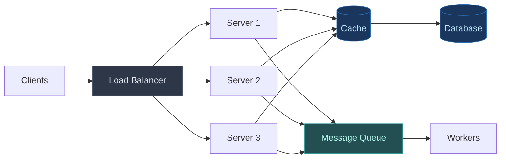

### Step 4: Deep Dive into Components

Pick the most critical or complex components and design them in detail. This includes database schemas, API contracts, and algorithms.

### Step 5: Address Bottlenecks and Trade-offs

Every design has trade-offs. Identify potential bottlenecks and explain how you would handle them.

---

## Scalability Fundamentals

Scalability is the ability to handle increased load. There are two approaches.

### Vertical Scaling (Scale Up)

Add more resources to existing machines.

| Pros | Cons |
|------|------|
| Simple to implement | Hardware limits (you cannot buy a bigger server indefinitely) |
| No code changes needed | Single point of failure |
| Easier to manage | Expensive at high end |
| No distributed complexity | Downtime during upgrades |

### Horizontal Scaling (Scale Out)

Add more machines to distribute the load.

| Pros | Cons |
|------|------|
| Near unlimited scaling | More complex architecture |
| Better fault tolerance | Requires distributed systems knowledge |
| Cost effective (commodity hardware) | Data consistency challenges |
| No single point of failure | Network overhead |

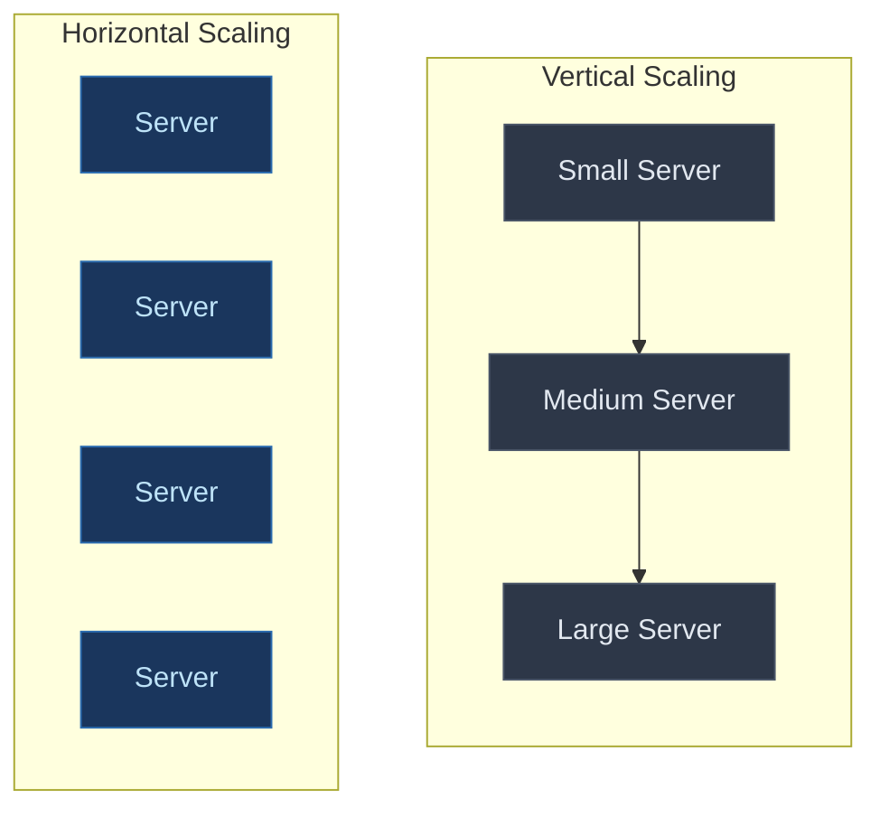

**Rule of thumb**: Start simple with vertical scaling, move to horizontal when you hit limits or need fault tolerance.

---

## Load Balancing

A load balancer distributes traffic across multiple servers.

### Why Use Load Balancers?

- **Availability**: If one server dies, traffic goes to healthy servers
- **Scalability**: Add servers behind the load balancer as traffic grows
- **Performance**: Prevent any single server from being overwhelmed

### Load Balancing Algorithms

| Algorithm | How It Works | Best For |
|-----------|--------------|----------|
| **Round Robin** | Requests go to servers in rotation | Equal-capacity servers, stateless apps |
| **Weighted Round Robin** | Higher-weight servers get more traffic | Mixed-capacity server fleet |
| **Least Connections** | New requests go to server with fewest active connections | Long-running requests, varying request times |
| **IP Hash** | Client IP determines server (sticky sessions) | Stateful applications, session affinity |
| **Least Response Time** | Fastest responding server gets next request | Performance-critical applications |

### Layer 4 vs Layer 7 Load Balancing

**Layer 4 (Transport Layer)** routes based on IP address and port. Fast but cannot inspect content.

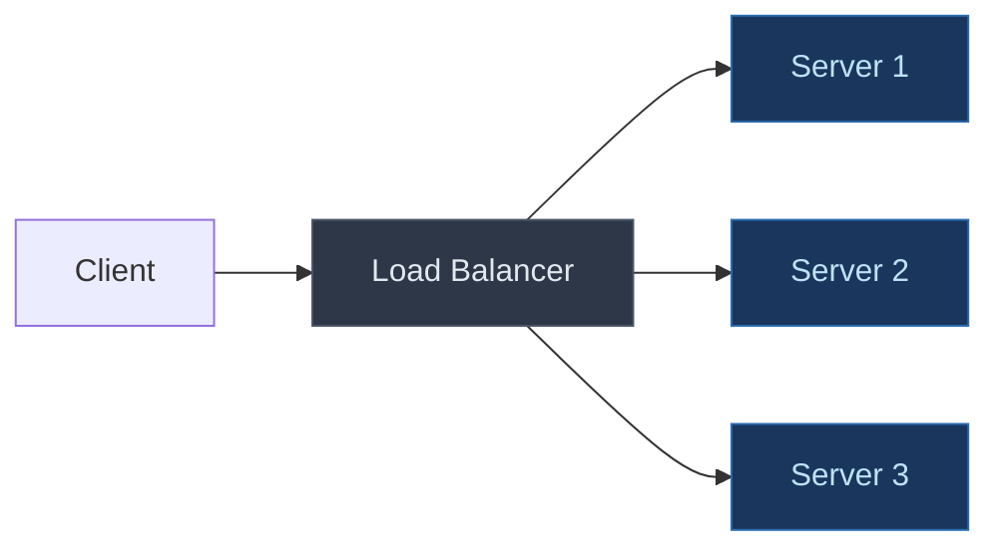

**Layer 7 (Application Layer)** routes based on URL, headers, cookies. Smarter but more processing overhead.

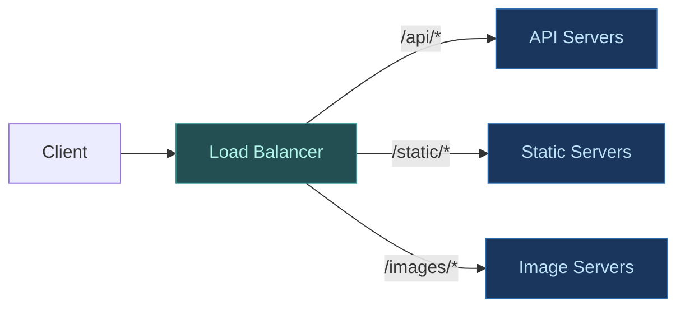

| Layer 4 | Layer 7 |
|---------|---------|
| Faster (less processing) | Smarter routing (URL, headers, cookies) |
| Cannot inspect content | Can cache, compress, SSL terminate |
| Simple configuration | Content-based routing |
| TCP/UDP level | HTTP/HTTPS level |

### Popular Load Balancers

- **Nginx**: Fast, widely used, great for HTTP
- **HAProxy**: High performance, TCP and HTTP
- **AWS ELB/ALB**: Managed, integrates with AWS
- **Cloudflare**: Edge load balancing with CDN

---

## Caching

Caching stores frequently accessed data in fast storage to reduce latency and database load.

### Where to Cache

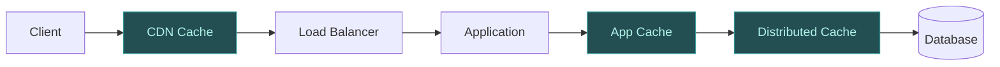

| Cache Layer | What It Caches | Tools |
|-------------|---------------|-------|
| **Browser** | Static assets, API responses | HTTP headers (Cache-Control) |
| **CDN** | Static files, media, edge content | Cloudflare, CloudFront, Fastly |
| **Application** | Computed values, session data | In-memory (Guava, Caffeine) |
| **Distributed** | Shared data across servers | Redis, Memcached |
| **Database** | Query results, frequently accessed rows | MySQL query cache, PostgreSQL |

### Caching Strategies

I covered these in depth in [Caching Strategies Explained](/caching-strategies-explained/). Here is the summary:

| Strategy | How It Works | Best For |
|----------|--------------|----------|
| **Cache-Aside** | App checks cache, fetches from DB on miss, populates cache | General purpose, most control |
| **Read-Through** | Cache fetches from DB automatically on miss | Read-heavy, simpler code |
| **Write-Through** | Writes go to cache and DB synchronously | Consistency critical |
| **Write-Behind** | Writes go to cache, async to DB later | High write throughput |
| **Write-Around** | Writes bypass cache, go to DB only | Write-once data |

### Cache Eviction Policies

When cache is full, what gets removed?

| Policy | Removes | Best For |
|--------|---------|----------|
| **LRU** | Least Recently Used items | General purpose, most common |
| **LFU** | Least Frequently Used items | Stable access patterns |
| **FIFO** | Oldest items | Simple use cases |
| **TTL** | Expired items | Time-sensitive data |

### Cache Invalidation

The hardest problem in caching. Options include:

- **TTL-based**: Expire after fixed time (simple, allows staleness window)
- **Event-based**: Invalidate on data change (immediate, complex to track)
- **Version-based**: Include version in cache key (no stale data, more misses)

---

## Databases

Database choice is one of the most important architectural decisions.

### SQL vs NoSQL

| SQL (Relational) | NoSQL |
|------------------|-------|
| Structured data, fixed schema | Flexible or schema-less |
| ACID transactions | Eventual consistency (often) |
| Complex queries and joins | Simple queries, denormalized data |
| Vertical scaling primarily | Horizontal scaling built-in |
| PostgreSQL, MySQL, Oracle | MongoDB, Cassandra, DynamoDB |

### When to Use SQL

<i class="fas fa-check-circle" style="color: #28a745;"></i> Complex relationships between data (joins)

<i class="fas fa-check-circle" style="color: #28a745;"></i> Transactions are critical (financial systems)

<i class="fas fa-check-circle" style="color: #28a745;"></i> Data integrity and constraints matter

<i class="fas fa-check-circle" style="color: #28a745;"></i> Ad-hoc queries and reporting

### When to Use NoSQL

<i class="fas fa-check-circle" style="color: #28a745;"></i> Massive scale (petabytes of data)

<i class="fas fa-check-circle" style="color: #28a745;"></i> Flexible or evolving schema

<i class="fas fa-check-circle" style="color: #28a745;"></i> High write throughput

<i class="fas fa-check-circle" style="color: #28a745;"></i> Geographic distribution

### NoSQL Types

| Type | Data Model | Examples | Use Case |
|------|------------|----------|----------|
| **Document** | JSON documents | MongoDB, CouchDB | Content management, catalogs |
| **Key-Value** | Simple key to value | Redis, DynamoDB | Caching, sessions |
| **Column-Family** | Wide columns | Cassandra, HBase | Time series, analytics |
| **Graph** | Nodes and edges | Neo4j, Amazon Neptune | Social networks, recommendations |

### Database Scaling Patterns

#### Replication

Copies of data across multiple servers.

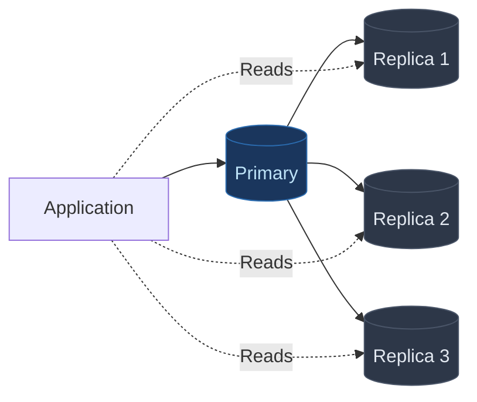

- **Leader-Follower**: One primary handles writes, replicas handle reads
- **Leader-Leader**: Multiple primaries, complex conflict resolution
- **Benefit**: Read scalability, fault tolerance

#### Sharding (Partitioning)

Split data across multiple databases.

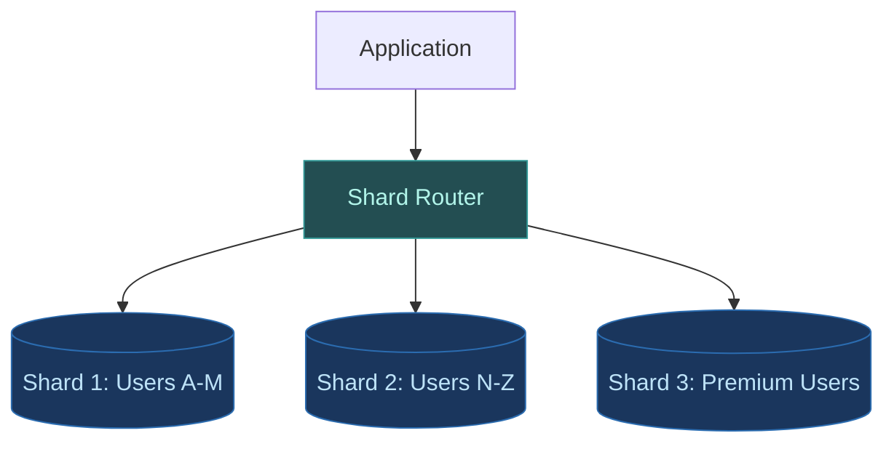

| Sharding Strategy | How It Works | Pros | Cons |
|-------------------|--------------|------|------|
| **Hash-based** | Hash of key determines shard | Even distribution | Resharding is painful |
| **Range-based** | Key ranges determine shard | Range queries work | Hot spots possible |
| **Geographic** | Location determines shard | Low latency | Complex for global users |
| **Directory-based** | Lookup table maps keys to shards | Flexible | Lookup is bottleneck |

See how [Slack uses workspace-based sharding](/slack-system-design/) and [Shopify shards by shop_id](/shopify-system-design/) in their production systems.

---

## Message Queues

Message queues decouple services and enable asynchronous processing.

### Why Use Queues?

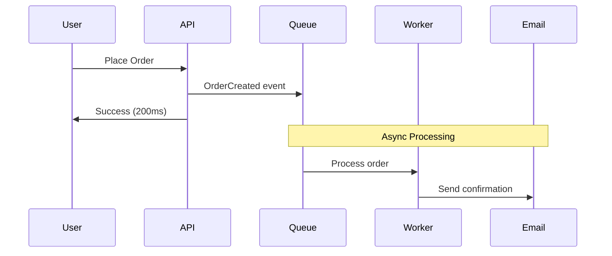

- **Decoupling**: Services don't need to know about each other
- **Resilience**: Failed consumers don't crash producers
- **Buffering**: Absorb traffic spikes
- **Scalability**: Add consumers as needed

For a deep dive, see [Role of Queues in System Design](/role-of-queues-in-system-design/).

### Queue Patterns

| Pattern | Description | Use Case |
|---------|-------------|----------|
| **Point-to-Point** | One producer, one consumer per message | Task distribution |
| **Pub/Sub** | One producer, many consumers get same message | Event notifications |
| **Work Queue** | Multiple consumers compete for messages | Parallel processing |
| **Dead Letter Queue** | Failed messages go here after retries | Error handling |

### Popular Message Queues

| Tool | Best For | Throughput |
|------|----------|------------|
| **Kafka** | Event streaming, log aggregation, replay | Millions/sec |
| **RabbitMQ** | Complex routing, traditional messaging | Thousands/sec |
| **SQS** | Simple AWS-native queuing | Thousands/sec |
| **Redis Streams** | Lightweight streaming | Hundreds of thousands/sec |

See [How Kafka Works](/distributed-systems/how-kafka-works/) for a complete breakdown.

---

## API Design

APIs are contracts between services. Design them carefully.

### REST vs GraphQL vs gRPC

| Aspect | REST | GraphQL | gRPC |
|--------|------|---------|------|
| Data Format | JSON | JSON | Protocol Buffers |
| Contract | Implicit (conventions) | Schema-defined | Protocol definition |
| Over-fetching | Common | Solved (request what you need) | N/A |
| Learning Curve | Low | Medium | Higher |
| Best For | Public APIs, CRUD | Flexible frontends | Internal microservices |

### REST Best Practices

```
# Good URL design
GET    /users              # List users
GET    /users/123          # Get user 123
POST   /users              # Create user
PUT    /users/123          # Update user 123
DELETE /users/123          # Delete user 123

# Bad URL design
GET    /getUsers
POST   /createUser
GET    /users/delete/123
```

### API Versioning

| Strategy | Example | Pros | Cons |
|----------|---------|------|------|
| URL Path | `/v1/users` | Clear, easy caching | URL changes |
| Query Param | `/users?version=1` | Single endpoint | Easy to miss |
| Header | `Accept: application/vnd.api.v1+json` | Clean URLs | Hidden versioning |

### Rate Limiting

Protect your API from abuse and overload.

| Algorithm | How It Works | Best For |
|-----------|--------------|----------|
| **Token Bucket** | Tokens added at fixed rate, requests consume tokens | Burst-friendly, most common |
| **Sliding Window** | Count requests in rolling time window | Smooth rate limiting |
| **Fixed Window** | Count requests in fixed intervals | Simple to implement |

For implementation details, see [Dynamic Rate Limiter System Design](/dynamic-rate-limiter-system-design/).

---

## Distributed Systems Concepts

When you scale beyond a single machine, you enter distributed systems territory.

### CAP Theorem

In a distributed system, during a network partition, you must choose between:

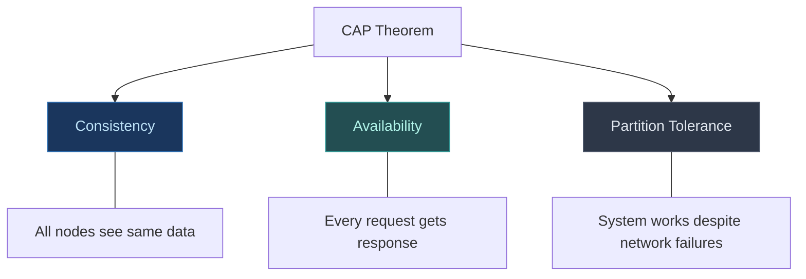

- **CP System**: Consistency + Partition Tolerance (blocks during partition)
  - Example: ZooKeeper, etcd, traditional banking
- **AP System**: Availability + Partition Tolerance (may serve stale data)
  - Example: Cassandra, DynamoDB, DNS

**Reality**: Network partitions are inevitable. You're always choosing between C and A.

### Consistency Models

| Model | Guarantee | Example |
|-------|-----------|---------|
| **Strong** | Read always returns latest write | Bank balance |
| **Eventual** | Reads will eventually see latest write | Social media likes |
| **Causal** | Related events appear in order | Chat messages |
| **Read-your-writes** | You see your own writes immediately | Shopping cart |

### Consensus Algorithms

How do distributed nodes agree on a value?

| Algorithm | Used In | Complexity |
|-----------|---------|------------|
| **Paxos** | Chubby, Spanner | Notoriously complex |
| **Raft** | etcd, Consul | Easier to understand |
| **ZAB** | ZooKeeper | Similar to Paxos |

See [Paxos Distributed Consensus](/distributed-systems/paxos/) for details.

### Distributed Transactions

When a transaction spans multiple services:

| Pattern | How It Works | Consistency |
|---------|--------------|-------------|
| **Two-Phase Commit** | Coordinator asks all nodes, then commits | Strong (but slow) |
| **Saga** | Chain of local transactions with compensations | Eventual |
| **Outbox Pattern** | Write to DB and outbox table atomically | Eventual |

See [Two-Phase Commit](/distributed-systems/two-phase-commit/) for implementation details.

---

## Common Architecture Patterns

### Monolith vs Microservices

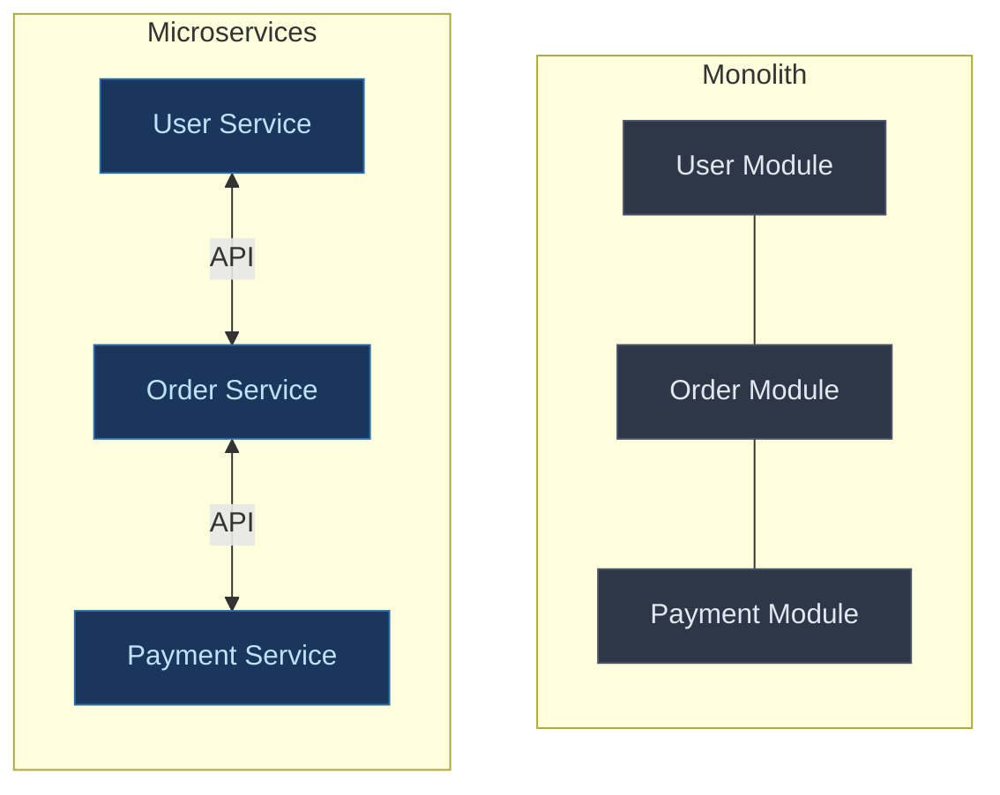

| Monolith | Microservices |
|----------|---------------|
| Simple deployment | Independent deployments |
| Easy debugging | Distributed debugging |
| Shared database | Database per service |
| Tight coupling | Network overhead |
| Team coordination needed | Team autonomy |

**Most teams should start with a monolith** and extract services when needed. See [Modular Monolith Architecture](/modular-monolith-architecture/) for a middle ground.

### Event-Driven Architecture

Services communicate through events instead of direct calls.

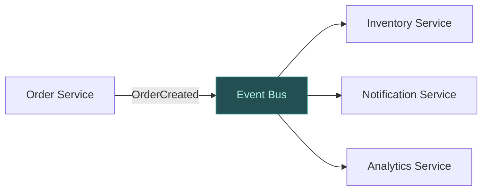

**Benefits**:
- Loose coupling between services
- Services can be added/removed without affecting others
- Natural audit log of events

**Challenges**:
- Eventual consistency
- Debugging across services
- Event ordering

### CQRS (Command Query Responsibility Segregation)

Separate read and write models.

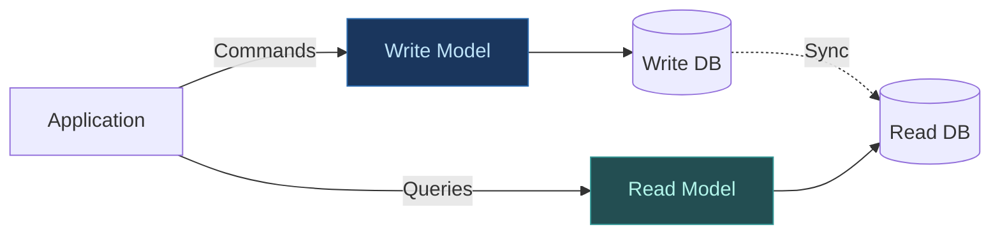

Use when read and write patterns are very different. See [CQRS Pattern Guide](/cqrs-pattern-guide/) for details.

---

## Monitoring and Observability

You cannot fix what you cannot see.

### The Three Pillars

| Pillar | What It Shows | Tools |
|--------|---------------|-------|
| **Metrics** | Numerical measurements over time | Prometheus, Datadog, CloudWatch |
| **Logs** | Discrete events with details | ELK Stack, Splunk, Loki |
| **Traces** | Request path across services | Jaeger, Zipkin, X-Ray |

### Key Metrics to Monitor

| Metric | What It Measures | Alert When |
|--------|------------------|------------|
| **Request Rate** | Requests per second | Sudden drop or spike |
| **Error Rate** | Percentage of errors | Above threshold (e.g., > 1%) |
| **Latency (p50, p95, p99)** | Response time distribution | p99 exceeds SLA |
| **Saturation** | Resource utilization | CPU, memory, disk > 80% |

### SLI, SLO, SLA

| Term | Definition | Example |
|------|------------|---------|
| **SLI** (Service Level Indicator) | Measurement of service | Request latency, error rate |
| **SLO** (Service Level Objective) | Target for the SLI | 99.9% requests under 200ms |
| **SLA** (Service Level Agreement) | Contract with customers | 99.5% uptime or refund |

For more details, see [SLI, SLO, SLA Explained](/explainer/sli-slo-sla-explained/).

---

## Capacity Estimation

Back-of-envelope calculations help validate designs.

### Common Numbers to Know

| Resource | Value |
|----------|-------|
| L1 cache reference | 0.5 ns |
| RAM reference | 100 ns |
| SSD read | 100 μs |
| Network round trip (same datacenter) | 500 μs |
| Network round trip (cross-country) | 150 ms |
| Disk seek | 10 ms |

### Storage Calculations

```
Users: 100 million
Data per user: 1 KB profile + 10 KB posts = 11 KB
Total: 100M × 11 KB = 1.1 TB

With 3x replication: 3.3 TB
Growth over 3 years (2x): 6.6 TB
```

### Throughput Calculations

```
Daily active users: 10 million
Requests per user per day: 20
Daily requests: 200 million
Requests per second: 200M / 86,400 = ~2,300 RPS

Peak (3x average): ~7,000 RPS
Design for: 10,000 RPS (headroom)
```

### Bandwidth Calculations

```
Requests per second: 10,000
Average response size: 10 KB
Bandwidth: 10,000 × 10 KB = 100 MB/s = 800 Mbps
```

---

## Quick Reference Tables

### Database Decision Matrix

| Need | Choose |
|------|--------|
| ACID transactions | PostgreSQL, MySQL |
| Flexible schema | MongoDB, DynamoDB |
| Time series data | InfluxDB, TimescaleDB |
| Graph relationships | Neo4j |
| High write throughput | Cassandra |
| Caching/sessions | Redis |

### Communication Protocol Decision

| Need | Choose |
|------|--------|
| Public API, broad compatibility | REST |
| Flexible queries, multiple clients | GraphQL |
| Internal services, high performance | gRPC |
| Real-time bidirectional | WebSocket |
| One-way server push | Server-Sent Events |

For real-time options, see [WebSockets Explained](/explainer/websockets-explained/), [Server-Sent Events](/server-sent-events-explained/), and [Long Polling](/long-polling-explained/).

### Scaling Decision Matrix

| Problem | Solution |
|---------|----------|
| Database reads too slow | Add read replicas, caching |
| Database writes too slow | Sharding, write-behind cache |
| Single server overloaded | Horizontal scaling with load balancer |
| Too much traffic for one region | CDN, geographic distribution |
| Service calls too slow | Message queues, async processing |

### Common System Design Numbers

| System | Scale |
|--------|-------|
| Twitter (X) | 500 million tweets/day |
| Google | 8.5 billion searches/day |
| Netflix | 15% of global internet traffic |
| WhatsApp | 100 billion messages/day |
| Uber | 1 million matches/minute peak |

---

## Putting It All Together

Here is a typical architecture for a scalable web application:

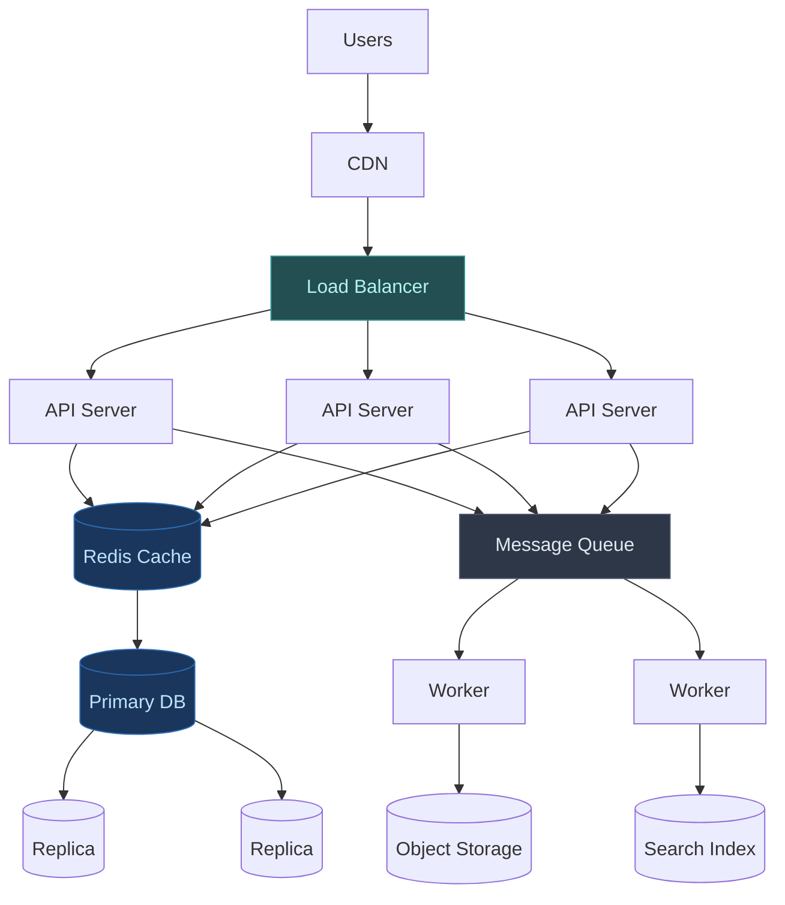

Components:
1. **CDN**: Serves static assets close to users
2. **Load Balancer**: Distributes traffic, provides failover
3. **API Servers**: Handle business logic, stateless for easy scaling
4. **Cache**: Reduce database load, improve latency
5. **Database**: Primary for writes, replicas for reads
6. **Message Queue**: Decouple services, handle async work
7. **Workers**: Process background jobs
8. **Object Storage**: Store files, media
9. **Search Index**: Full-text search capabilities

---

## Further Reading

These posts go deeper into specific topics:

**Caching and Performance**:
- [Caching Strategies Explained](/caching-strategies-explained/)
- [How Meta Achieves Cache Consistency](/meta-cache-consistency/)

**Database and Storage**:
- [Write-Ahead Log in Distributed Systems](/distributed-systems/write-ahead-log/)
- [How Amazon S3 Works](/how-amazon-s3-works/)

**Scaling Case Studies**:
- [How Netflix Video Processing Pipeline Works](/netflix-video-processing-pipeline/)
- [How OpenAI Scales PostgreSQL to 800M Users](/how-openai-scales-postgresql/)
- [How Uber Finds Nearby Drivers at 1M RPS](/how-uber-finds-nearby-drivers-1-million-requests-per-second/)
- [Slack System Design Architecture](/slack-system-design/)
- [How Stripe Prevents Double Payment](/how-stripe-prevents-double-payment/)
- [How WhatsApp Scales](/whatsapp-scaling-secrets/)

**Distributed Systems**:
- [Role of Queues in System Design](/role-of-queues-in-system-design/)
- [Two-Phase Commit](/distributed-systems/two-phase-commit/)
- [Distributed Counter Architecture](/distributed-counter-architecture-guide/)

**Operations and Deployment**:
- [Feature Flags: How to Deploy Code Without Releasing Features](/feature-flags-guide/)
- [Kubernetes Cheat Sheet](/kubernetes-cheat-sheet/)
- [Kubernetes Architecture](/devops/kubernetes-architecture/)
- [Linux Commands Cheat Sheet](/linux-commands-cheat-sheet/)

---

**External Resources**:

- [System Design Primer (GitHub)](https://github.com/donnemartin/system-design-primer)
- [Designing Data-Intensive Applications (Book)](https://dataintensive.net/)
- [High Scalability Blog](http://highscalability.com/)
- [Martin Fowler's Architecture Posts](https://martinfowler.com/architecture/)
