OpenAI shared how they scale PostgreSQL to handle 800 million ChatGPT users. This is one of the largest PostgreSQL deployments in the world, and the lessons apply to any team scaling a relational database.

Most applications never hit this scale. But the techniques OpenAI uses work at every level. Whether you have 10,000 users or 10 million, these patterns will make your database faster and more reliable.

This post breaks down the key scaling strategies with practical code examples. No fluff. Just the stuff that works. For a broader overview, see the [System Design Cheat Sheet](/system-design-cheat-sheet/).

---

## The Challenge: 800 Million Users on PostgreSQL

ChatGPT is one of the fastest-growing applications in history. OpenAI needed their database to handle:

| Metric | Scale |
|--------|-------|
| Active users | 800+ million |
| Concurrent connections | Millions |
| Requests per second | Very high |
| Data growth | Massive |

Most teams would reach for a NoSQL database at this point. OpenAI stuck with PostgreSQL. Why? Because PostgreSQL is battle-tested, has excellent tooling, and with the right architecture, it scales further than most people think.

---

## Strategy 1: Connection Pooling with PgBouncer

The first bottleneck at scale is not query speed. It is connections.

### The Problem

Every PostgreSQL connection costs memory. A single connection can use 10MB or more. If you have 1,000 application servers each opening 10 connections, that is 10,000 connections consuming 100GB of memory just for connection overhead.

PostgreSQL was not designed for thousands of concurrent connections. It handles hundreds well. Thousands badly. Tens of thousands not at all.

### The Solution: PgBouncer

PgBouncer is a lightweight connection pooler that sits between your application and PostgreSQL. Instead of each app instance maintaining its own connections, they all talk to PgBouncer. PgBouncer maintains a much smaller pool of actual database connections.


**Without PgBouncer:** 1,000 app instances × 10 connections = 10,000 database connections

**With PgBouncer:** 1,000 app instances → PgBouncer → 200 database connections

That is a 50x reduction in database connections.

### PgBouncer Configuration

Here is a basic PgBouncer configuration:

```ini
[databases]
myapp = host=localhost port=5432 dbname=myapp

[pgbouncer]
listen_addr = 0.0.0.0
listen_port = 6432
auth_type = md5
auth_file = /etc/pgbouncer/userlist.txt

; Pool mode: transaction is best for web apps
pool_mode = transaction

; Connection settings
max_client_conn = 10000    ; Max connections FROM app servers TO PgBouncer
default_pool_size = 100    ; Connections FROM PgBouncer TO PostgreSQL (per database/user pair)
min_pool_size = 10         ; Keep at least this many connections open
reserve_pool_size = 5      ; Extra connections for burst traffic
```

### Pool Modes Explained

PgBouncer has three pool modes. Choosing the right one matters:

| Mode | How It Works | Use When |
|------|--------------|----------|
| **session** | Connection stays with client for entire session | Legacy apps that use session state |
| **transaction** | Connection assigned per transaction | Most web applications |
| **statement** | Connection assigned per statement | Only for autocommit queries |

**Use transaction mode for most applications.** It gives you the best connection reuse while still supporting transactions.

### Practical Example: Django with PgBouncer

```python
# settings.py
DATABASES = {
    'default': {
        'ENGINE': 'django.db.backends.postgresql',
        'HOST': 'pgbouncer.internal',  # Point to PgBouncer, not PostgreSQL
        'PORT': '6432',                 # PgBouncer port
        'NAME': 'myapp',
        'USER': 'myapp_user',
        'PASSWORD': 'secret',
        'CONN_MAX_AGE': 0,              # Let PgBouncer manage pooling
        'OPTIONS': {
            'options': '-c statement_timeout=30000'  # 30 second timeout
        }
    }
}
```

**Important:** Set `CONN_MAX_AGE = 0` when using PgBouncer. Django's connection pooling conflicts with PgBouncer. Let PgBouncer handle it.

---

## Strategy 2: Read Replicas

Most applications are read-heavy. ChatGPT users read their conversation history far more often than they create new messages. OpenAI uses read replicas to handle this.

### How Read Replicas Work

```mermaid
flowchart LR
    subgraph App[" "]
        direction TB
        W[✏️ Writes]
        R[📖 Reads]
    end
    
    P[(🗄️ Primary)]
    
    subgraph Replicas[" "]
        direction TB
        R1[(Replica 1)]
        R2[(Replica 2)]
        R3[(Replica 3)]
    end
    
    W -->|write| P
    R -->|read| Replicas
    P -.->|sync| R1
    P -.->|sync| R2
    P -.->|sync| R3
    
    style W fill:#fee2e2,stroke:#dc2626,stroke-width:2px,color:#991b1b
    style R fill:#dcfce7,stroke:#16a34a,stroke-width:2px,color:#166534
    style P fill:#fef3c7,stroke:#d97706,stroke-width:2px,color:#92400e
    style R1 fill:#dbeafe,stroke:#2563eb,stroke-width:2px,color:#1e40af
    style R2 fill:#dbeafe,stroke:#2563eb,stroke-width:2px,color:#1e40af
    style R3 fill:#dbeafe,stroke:#2563eb,stroke-width:2px,color:#1e40af
```



- **Writes** go to the primary database
- **Reads** go to the replicas
- Changes on the primary replicate to all replicas

This separation of reads and writes is a core principle in distributed systems. For a formalized version of this pattern, see [CQRS Pattern Guide](/cqrs-pattern-guide/).

### Setting Up PostgreSQL Streaming Replication

On the primary server:

```sql
-- postgresql.conf on primary
wal_level = replica
max_wal_senders = 10
wal_keep_size = 1GB
```

```sql
-- Create replication user
CREATE USER replicator WITH REPLICATION ENCRYPTED PASSWORD 'secret';
```

On the replica:

```bash
# Stop PostgreSQL
sudo systemctl stop postgresql

# Remove existing data
rm -rf /var/lib/postgresql/15/main/*

# Copy data from primary
pg_basebackup -h primary.internal -U replicator -D /var/lib/postgresql/15/main -P -R
```

The `-R` flag creates a `standby.signal` file and configures the replica automatically.

### Routing Reads and Writes in Your Application

The application needs to know which queries go to which database. Here is a simple Python example:

```python
import random
from contextlib import contextmanager

class DatabaseRouter:
    def __init__(self, primary_conn, replica_conns):
        self.primary = primary_conn
        self.replicas = replica_conns
    
    @contextmanager
    def read_connection(self):
        """Get a random read replica connection."""
        conn = random.choice(self.replicas)
        try:
            yield conn
        finally:
            conn.commit()
    
    @contextmanager
    def write_connection(self):
        """Get the primary connection for writes."""
        try:
            yield self.primary
        finally:
            self.primary.commit()

# Usage
router = DatabaseRouter(primary, [replica1, replica2, replica3])

# Read operations
with router.read_connection() as conn:
    cursor = conn.cursor()
    cursor.execute("SELECT * FROM users WHERE id = %s", [user_id])
    user = cursor.fetchone()

# Write operations
with router.write_connection() as conn:
    cursor = conn.cursor()
    cursor.execute("INSERT INTO messages (content) VALUES (%s)", [content])
```

### Handling Replication Lag

Replicas are slightly behind the primary. This is called replication lag. For most reads, a few milliseconds of lag does not matter. But sometimes you need to read your own writes immediately. For more on consistency in distributed systems, see [Majority Quorum in Distributed Systems](/distributed-systems/majority-quorum/).

```python
def get_user_after_update(user_id, use_primary=False):
    """
    Get user data. Use primary if we just wrote and need fresh data.
    """
    if use_primary:
        conn = router.primary
    else:
        conn = random.choice(router.replicas)
    
    cursor = conn.cursor()
    cursor.execute("SELECT * FROM users WHERE id = %s", [user_id])
    return cursor.fetchone()

# After an update, read from primary to get fresh data
update_user(user_id, new_email)
user = get_user_after_update(user_id, use_primary=True)
```

---

## Strategy 3: Horizontal Sharding

When a single PostgreSQL instance cannot handle your data or traffic, you split the data across multiple instances. This is horizontal sharding.

### How Sharding Works


Each shard is a complete PostgreSQL instance with the same schema. Data is partitioned based on a shard key, typically user_id or tenant_id.

### Choosing a Shard Key

The shard key determines which shard holds which data. Choose wisely:

| Good Shard Keys | Bad Shard Keys |
|-----------------|----------------|
| user_id | created_at (hot spots) |
| tenant_id | country (uneven distribution) |
| organization_id | status (low cardinality) |

**The best shard key is one that:**
- Distributes data evenly
- Keeps related data together
- Is included in most queries

### Implementing a Shard Router

```python
import hashlib

class ShardRouter:
    def __init__(self, shard_connections):
        """
        shard_connections: dict of shard_id -> connection
        """
        self.shards = shard_connections
        self.num_shards = len(shard_connections)
    
    def get_shard_id(self, user_id):
        """Consistent hash to determine shard."""
        hash_value = int(hashlib.md5(str(user_id).encode()).hexdigest(), 16)
        return hash_value % self.num_shards
    
    def get_connection(self, user_id):
        """Get database connection for a user."""
        shard_id = self.get_shard_id(user_id)
        return self.shards[shard_id]
    
    def execute_on_shard(self, user_id, query, params):
        """Execute query on the correct shard."""
        conn = self.get_connection(user_id)
        cursor = conn.cursor()
        cursor.execute(query, params)
        return cursor

# Usage
router = ShardRouter({
    0: shard0_connection,
    1: shard1_connection,
    2: shard2_connection,
    3: shard3_connection,
})

# Query automatically goes to the right shard
messages = router.execute_on_shard(
    user_id=12345,
    query="SELECT * FROM messages WHERE user_id = %s",
    params=[12345]
)
```

### Cross-Shard Queries

Sometimes you need to query across all shards. This is expensive but sometimes necessary:

```python
def get_total_message_count():
    """Query all shards and aggregate results."""
    total = 0
    for shard_id, conn in router.shards.items():
        cursor = conn.cursor()
        cursor.execute("SELECT COUNT(*) FROM messages")
        total += cursor.fetchone()[0]
    return total
```

**Avoid cross-shard queries in hot paths.** They do not scale. If you need aggregated data frequently, maintain it separately (in a cache or analytics database).

### Sharding Tools

You do not have to build sharding from scratch. These tools handle the complexity:

| Tool | Type | Best For |
|------|------|----------|
| **Citus** | PostgreSQL extension | Transparent sharding, stays within PostgreSQL ecosystem |
| **Vitess** | Middleware proxy | Large-scale MySQL/PostgreSQL, used by YouTube and Slack |
| **pgcat** | Connection pooler | Lightweight sharding with pooling built-in |
| **pg_partman** | PostgreSQL extension | Time-based partitioning (not true sharding but helps) |

**Citus** is the most popular choice for PostgreSQL. It turns PostgreSQL into a distributed database:

```sql
-- Create a distributed table with Citus
SELECT create_distributed_table('messages', 'user_id');

-- Queries automatically route to the correct shard
SELECT * FROM messages WHERE user_id = 12345;
```

**For most teams:** Start with application-level sharding (the Python router shown above) to understand your access patterns. Move to Citus or Vitess when managing shards manually becomes painful.

---

## Strategy 4: Query Optimization

At scale, bad queries become very bad queries. A query that takes 100ms with 1,000 rows might take 10 seconds with 10 million rows.

### Using EXPLAIN ANALYZE

Always analyze slow queries:

```sql
EXPLAIN ANALYZE
SELECT m.*, u.name 
FROM messages m
JOIN users u ON m.user_id = u.id
WHERE m.created_at > '2026-01-01'
ORDER BY m.created_at DESC
LIMIT 100;
```

Look for:
- **Seq Scan** on large tables (needs an index)
- **High actual time** compared to estimated
- **Rows removed by filter** (query scanning too much data)

### Index Strategies

Create indexes for your query patterns:

```sql
-- For filtering by user and time
CREATE INDEX idx_messages_user_created 
ON messages(user_id, created_at DESC);

-- For covering queries (includes all columns needed)
CREATE INDEX idx_messages_covering 
ON messages(user_id, created_at DESC) 
INCLUDE (content, status);

-- Partial index for active records only
CREATE INDEX idx_messages_active 
ON messages(user_id, created_at) 
WHERE status = 'active';
```

See [How Database Indexing Works](/database-indexing-explained/) for a deep dive on index types and when to use each. For the underlying data structure, see [B-Tree Data Structure Explained](/data-structures/b-tree/).

### Query Patterns That Kill Performance

**Bad: Using functions on indexed columns**

```sql
-- Index on created_at will NOT be used
SELECT * FROM messages 
WHERE DATE(created_at) = '2026-01-15';

-- Better: Keep the column bare
SELECT * FROM messages 
WHERE created_at >= '2026-01-15' 
  AND created_at < '2026-01-16';
```

**Bad: SELECT ***

```sql
-- Fetches all columns, even unused ones
SELECT * FROM users WHERE id = 123;

-- Better: Only fetch what you need
SELECT id, name, email FROM users WHERE id = 123;
```

**Bad: N+1 queries**

```python
# BAD: N+1 queries
users = db.execute("SELECT * FROM users LIMIT 100")
for user in users:
    messages = db.execute(
        "SELECT * FROM messages WHERE user_id = %s", 
        [user.id]
    )
```

```python
# GOOD: Single query with JOIN
results = db.execute("""
    SELECT u.*, m.* 
    FROM users u
    LEFT JOIN messages m ON m.user_id = u.id
    WHERE u.id IN (SELECT id FROM users LIMIT 100)
""")
```

See [N+1 Query Problem Explained](/explainer/n-plus-one-query-problem/) for more on this common performance killer.

---

## Strategy 5: Connection Management

At massive scale, connection management becomes critical. Here is what matters:

### Connection Timeouts

Set aggressive timeouts to prevent runaway queries:

```sql
-- In postgresql.conf
statement_timeout = '30s'           -- Kill queries after 30 seconds
idle_in_transaction_session_timeout = '60s'  -- Kill idle transactions
```

### Connection Limits

Configure limits to prevent overload:

```sql
-- In postgresql.conf
max_connections = 200               -- Actual connections to PostgreSQL
```

With PgBouncer in front:

```ini
# pgbouncer.ini
max_client_conn = 10000             -- Connections from apps to PgBouncer
default_pool_size = 100             -- Connections from PgBouncer to PostgreSQL
```

### Monitoring Connections

Keep an eye on connection usage:

```sql
-- Current connections by state
SELECT state, COUNT(*) 
FROM pg_stat_activity 
GROUP BY state;

-- Long-running queries
SELECT pid, now() - pg_stat_activity.query_start AS duration, query
FROM pg_stat_activity
WHERE state = 'active'
  AND now() - pg_stat_activity.query_start > interval '1 minute';
```

---

## Strategy 6: Caching

Not every request needs to hit the database. Caching reduces load significantly.

### Application-Level Caching with Redis

```python
import redis
import json

cache = redis.Redis(host='redis.internal', port=6379)

def get_user(user_id):
    # Try cache first
    cache_key = f"user:{user_id}"
    cached = cache.get(cache_key)
    if cached:
        return json.loads(cached)
    
    # Cache miss: query database
    user = db.execute(
        "SELECT * FROM users WHERE id = %s", 
        [user_id]
    ).fetchone()
    
    # Store in cache for 5 minutes
    cache.setex(cache_key, 300, json.dumps(user))
    return user

def update_user(user_id, data):
    # Update database
    db.execute(
        "UPDATE users SET name = %s WHERE id = %s",
        [data['name'], user_id]
    )
    
    # Invalidate cache
    cache.delete(f"user:{user_id}")
```

### Query Result Caching

For expensive queries that do not change often:

```python
def get_popular_messages():
    cache_key = "popular_messages"
    cached = cache.get(cache_key)
    if cached:
        return json.loads(cached)
    
    # Expensive aggregation query
    results = db.execute("""
        SELECT m.*, COUNT(r.id) as reaction_count
        FROM messages m
        LEFT JOIN reactions r ON r.message_id = m.id
        WHERE m.created_at > NOW() - INTERVAL '7 days'
        GROUP BY m.id
        ORDER BY reaction_count DESC
        LIMIT 100
    """).fetchall()
    
    # Cache for 10 minutes
    cache.setex(cache_key, 600, json.dumps(results))
    return results
```

For a deeper look at caching patterns, see [Caching Strategies Explained](/caching-strategies-explained/).

---

## Strategy 7: Monitoring and Observability

You cannot fix what you cannot see. At scale, monitoring is essential.

### Key Metrics to Track

These metrics form the foundation of your database SLIs. For the full framework on setting reliability targets, see [SLI, SLO, SLA Explained](/explainer/sli-slo-sla-explained/).

| Metric | Why It Matters |
|--------|---------------|
| Connections | Approaching limits causes failures |
| Query latency (p50, p95, p99) | User experience |
| Replication lag | Data freshness on replicas |
| Cache hit rate | Database load |
| Slow query count | Performance regressions |
| Disk I/O | Storage bottlenecks |

### pg_stat_statements for Query Analysis

Enable the `pg_stat_statements` extension to track query performance:

```sql
-- Enable the extension
CREATE EXTENSION pg_stat_statements;

-- Top 10 queries by total time
SELECT 
    query,
    calls,
    total_exec_time / 1000 as total_seconds,
    mean_exec_time as avg_ms,
    rows
FROM pg_stat_statements
ORDER BY total_exec_time DESC
LIMIT 10;

-- Queries with high execution time variance
SELECT 
    query,
    calls,
    mean_exec_time as avg_ms,
    stddev_exec_time as stddev_ms
FROM pg_stat_statements
WHERE calls > 100
ORDER BY stddev_exec_time DESC
LIMIT 10;
```

---

## Architecture Summary

Here is the complete architecture OpenAI uses to scale PostgreSQL:


**Request flow:**

1. Application checks Redis cache first
2. Cache miss → request goes to PgBouncer
3. PgBouncer routes to the correct shard based on user_id
4. Reads go to replicas, writes go to primary
5. Results cached in Redis for future requests

---

## Key Takeaways

1. **Start with connection pooling.** PgBouncer is the easiest win. Most applications hit connection limits before query performance limits.

2. **Add read replicas early.** Most workloads are 80%+ reads. Replicas distribute this load and give you redundancy.

3. **Shard when you must.** Sharding adds complexity. Do it when a single PostgreSQL instance cannot handle your data or traffic, not before.

4. **Optimize queries first.** A bad query on 10 shards is still a bad query. Fix the query patterns before scaling infrastructure.

5. **Cache aggressively.** The fastest database query is the one you do not make. Use Redis or Memcached for frequently accessed data.

6. **Monitor everything.** Use pg_stat_statements, track slow queries, and monitor connection usage. You cannot fix what you cannot measure. Consider [performance testing with Grafana k6](/performance-testing-with-grafana-k6/) before major releases.

7. **PostgreSQL scales further than you think.** With the right architecture, PostgreSQL handles hundreds of millions of users. Do not switch to a new database just because things got busy.

---

**Related Posts:**

- [How Database Indexing Works](/database-indexing-explained/) - Deep dive into B-trees and index optimization
- [B-Tree Data Structure](/data-structures/b-tree/) - The data structure behind PostgreSQL indexes
- [Caching Strategies Explained](/caching-strategies-explained/) - When and how to add caching
- [N+1 Query Problem](/explainer/n-plus-one-query-problem/) - Fix this common performance killer
- [How WhatsApp Scales to Billions](/whatsapp-scaling-secrets/) - Another massive scale case study
- [How Uber Handles 1M Requests/Second](/how-uber-finds-nearby-drivers-1-million-requests-per-second/) - Geospatial scaling at extreme scale
- [CQRS Pattern Guide](/cqrs-pattern-guide/) - Formal pattern for read/write separation
- [System Design Cheat Sheet](/system-design-cheat-sheet/) - Quick reference for scaling patterns

---

*Have questions about scaling PostgreSQL? Share your experience in the comments below.*
