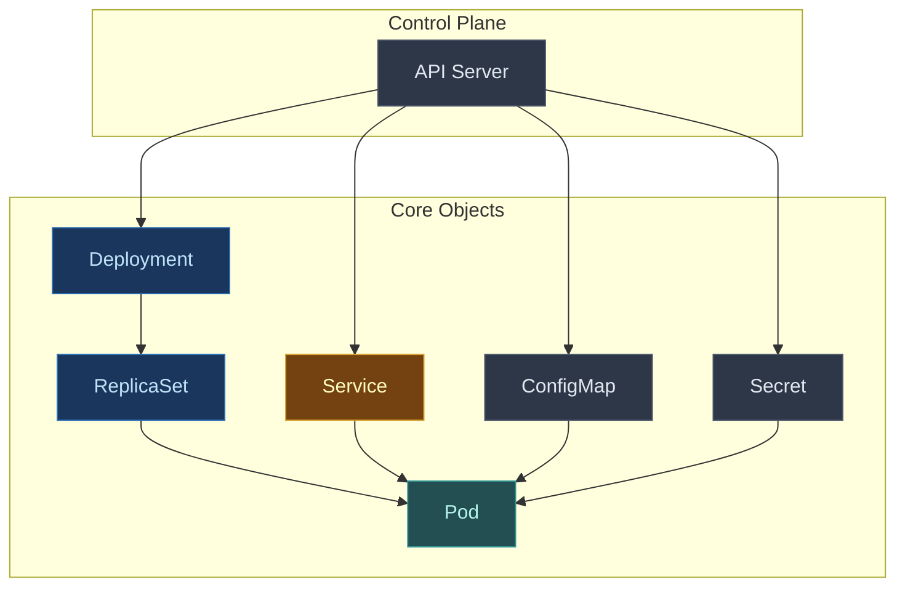
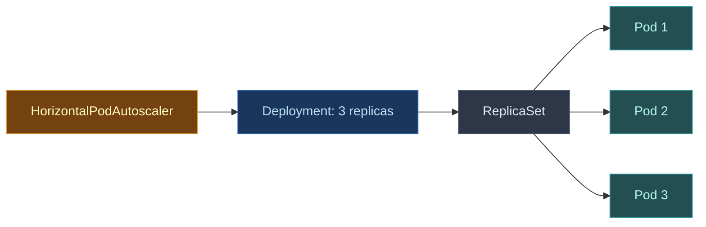
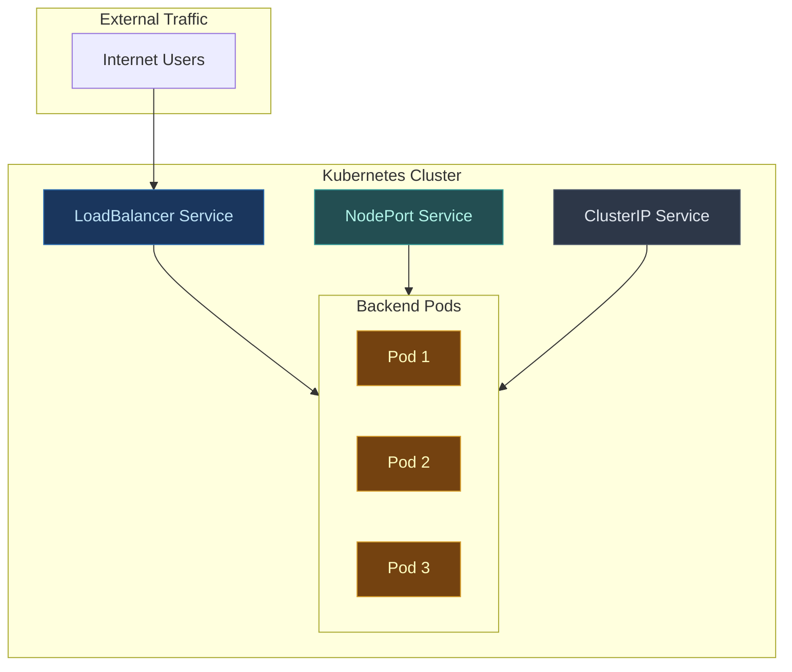
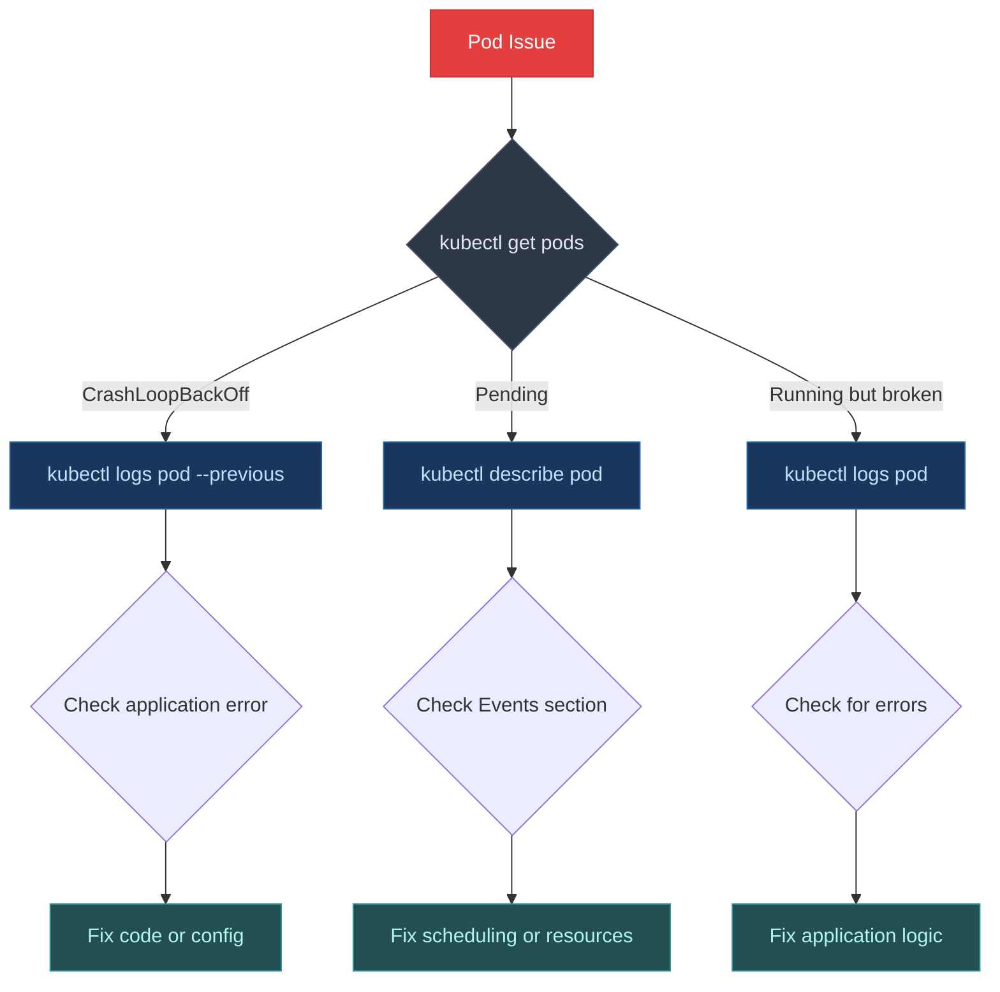

This cheat sheet is everything I wish I had when I started with Kubernetes. It covers the commands you will actually use, organized by what you are trying to do. No theory dumps. Just practical commands that work.

Bookmark this page. You will come back to it.

## Table of Contents

- [Getting Started](#getting-started)
- [Cluster and Context Management](#cluster-and-context-management)
- [Pods](#pods)
- [Deployments](#deployments)
- [Services](#services)
- [Namespaces](#namespaces)
- [ConfigMaps and Secrets](#configmaps-and-secrets)
- [Logs and Debugging](#logs-and-debugging)
- [Resource Management](#resource-management)
- [Other Workload Types](#other-workload-types)
- [Common Debugging Workflows](#common-debugging-workflows)
- [Productivity Tips](#productivity-tips)
- [Quick Reference Tables](#quick-reference-tables)

---

## Getting Started

Before running commands, you need kubectl installed and configured.

### Install kubectl

**macOS (Homebrew):**
```bash
brew install kubectl
```

**Linux (curl):**
```bash
# Download the latest release
curl -LO "https://dl.k8s.io/release/$(curl -L -s https://dl.k8s.io/release/stable.txt)/bin/linux/amd64/kubectl"

# Install kubectl
sudo install -o root -g root -m 0755 kubectl /usr/local/bin/kubectl
```

**Windows (Chocolatey):**
```powershell
choco install kubernetes-cli
```

**Windows (winget):**
```powershell
winget install -e --id Kubernetes.kubectl
```

After installation, verify it works:

```bash
kubectl version --client
```

You should see output showing the client version. If you get "command not found", ensure kubectl is in your PATH.

### Check Your Setup

```bash
# Check kubectl version
kubectl version --client

# Check cluster connection
kubectl cluster-info

# Check current context (which cluster you are talking to)
kubectl config current-context

# List all nodes in cluster
kubectl get nodes
```

### Understanding Kubernetes Objects

Everything in Kubernetes is an object. Here is how they relate:



| Object | What It Does |
|--------|--------------|
| **Pod** | Smallest deployable unit. Runs one or more containers |
| **Deployment** | Manages pods. Handles scaling, updates, rollbacks |
| **Service** | Stable network endpoint. Load balances to pods |
| **ConfigMap** | Stores configuration data. Mounted into pods |
| **Secret** | Stores sensitive data. Base64 encoded |
| **Namespace** | Logical isolation. Groups related resources |

For a deeper understanding of how these components work together, see [Kubernetes Architecture Explained](/devops/kubernetes-architecture/).

---

## Cluster and Context Management

When you work with multiple clusters (dev, staging, prod), context management becomes essential.

### Viewing Contexts

```bash
# List all contexts
kubectl config get-contexts

# Show current context
kubectl config current-context

# Show full config
kubectl config view
```

### Switching Contexts

```bash
# Switch to a different cluster
kubectl config use-context production-cluster

# Set default namespace for current context
kubectl config set-context --current --namespace=my-namespace

# Create a new context
kubectl config set-context dev-context \
  --cluster=dev-cluster \
  --user=dev-user \
  --namespace=development
```

### Quick Tip: kubectx and kubens

If you switch contexts frequently, install [kubectx](https://github.com/ahmetb/kubectx). It provides:
- `kubectx` to switch clusters quickly
- `kubens` to switch namespaces quickly

```bash
# Instead of: kubectl config use-context production
kubectx production

# Instead of: kubectl config set-context --current --namespace=my-app
kubens my-app
```

---

## Pods

Pods are the atomic unit of Kubernetes. A pod runs one or more containers that share network and storage.

### Viewing Pods

```bash
# List pods in current namespace
kubectl get pods

# List pods in all namespaces
kubectl get pods -A

# List pods with more details
kubectl get pods -o wide

# List pods with labels
kubectl get pods --show-labels

# Watch pods in real time
kubectl get pods -w

# Get pod details
kubectl describe pod my-pod

# Get pod YAML
kubectl get pod my-pod -o yaml
```

### Creating Pods

For production, always use Deployments instead of creating pods directly. Direct pods are not recreated when they die.

```bash
# Run a quick test pod
kubectl run nginx --image=nginx

# Run and expose a port
kubectl run nginx --image=nginx --port=80

# Run with environment variables
kubectl run myapp --image=myapp:v1 --env="DB_HOST=localhost"

# Generate YAML without creating (dry run)
kubectl run nginx --image=nginx --dry-run=client -o yaml > pod.yaml
```

### Deleting Pods

```bash
# Delete a pod
kubectl delete pod my-pod

# Delete pod immediately (no grace period)
kubectl delete pod my-pod --grace-period=0 --force

# Delete all pods in namespace
kubectl delete pods --all

# Delete pods by label
kubectl delete pods -l app=myapp
```

### Interacting with Pods

```bash
# Execute command in pod
kubectl exec my-pod -- ls /app

# Get interactive shell
kubectl exec -it my-pod -- /bin/bash

# For pods without bash
kubectl exec -it my-pod -- /bin/sh

# Execute in specific container (multi-container pod)
kubectl exec -it my-pod -c sidecar -- /bin/bash

# Copy file to pod
kubectl cp local-file.txt my-pod:/path/in/pod/

# Copy file from pod
kubectl cp my-pod:/path/in/pod/file.txt ./local-copy.txt
```

---

## Deployments

Deployments manage pods and provide rolling updates, rollbacks, and scaling.

### Viewing Deployments

```bash
# List deployments
kubectl get deployments

# List with details
kubectl get deployments -o wide

# Describe deployment
kubectl describe deployment my-deployment

# Get deployment YAML
kubectl get deployment my-deployment -o yaml
```

### Creating Deployments

```bash
# Create deployment from image
kubectl create deployment nginx --image=nginx

# Create with replicas
kubectl create deployment nginx --image=nginx --replicas=3

# Generate YAML without creating
kubectl create deployment nginx --image=nginx --dry-run=client -o yaml > deployment.yaml

# Apply from YAML file (preferred method)
kubectl apply -f deployment.yaml
```

Here is a basic deployment YAML:

```yaml
apiVersion: apps/v1
kind: Deployment
metadata:
  name: web-app
spec:
  replicas: 3
  selector:
    matchLabels:
      app: web-app
  template:
    metadata:
      labels:
        app: web-app
    spec:
      containers:
      - name: web
        image: nginx:1.21
        ports:
        - containerPort: 80
        resources:
          requests:
            cpu: 100m
            memory: 128Mi
          limits:
            cpu: 500m
            memory: 512Mi
```

For understanding CPU and memory units like `100m` and `128Mi`, see [Kubernetes Resource Units Explained](/explainer/kubernetes-resource-units/).

### Scaling Deployments

```bash
# Scale to 5 replicas
kubectl scale deployment my-deployment --replicas=5

# Autoscale based on CPU
kubectl autoscale deployment my-deployment --min=2 --max=10 --cpu-percent=80

# View autoscaler
kubectl get hpa
```



### Updating Deployments

```bash
# Update image (triggers rolling update)
kubectl set image deployment/my-deployment web=nginx:1.22

# Edit deployment directly
kubectl edit deployment my-deployment

# Apply updated YAML
kubectl apply -f deployment.yaml

# Restart all pods (rolling restart)
kubectl rollout restart deployment my-deployment
```

### Rollouts and Rollbacks

```bash
# Check rollout status
kubectl rollout status deployment my-deployment

# View rollout history
kubectl rollout history deployment my-deployment

# Rollback to previous version
kubectl rollout undo deployment my-deployment

# Rollback to specific revision
kubectl rollout undo deployment my-deployment --to-revision=2

# Pause rollout
kubectl rollout pause deployment my-deployment

# Resume rollout
kubectl rollout resume deployment my-deployment
```

### Deleting Deployments

```bash
# Delete deployment (also deletes pods)
kubectl delete deployment my-deployment

# Delete from YAML file
kubectl delete -f deployment.yaml
```

---

## Services

Services provide stable network endpoints for accessing pods. Since pods are ephemeral and get new IPs when recreated, Services give you a consistent way to reach them.

### Service Types

| Type | Description | Use Case |
|------|-------------|----------|
| **ClusterIP** | Internal IP only. Default type | Internal communication between services |
| **NodePort** | Exposes on each node's IP at a static port | Development, testing |
| **LoadBalancer** | Creates cloud load balancer | Production external access |
| **ExternalName** | Maps to external DNS name | Accessing external services |



### Viewing Services

```bash
# List services
kubectl get services

# List with shorthand
kubectl get svc

# Describe service
kubectl describe service my-service

# Get service YAML
kubectl get service my-service -o yaml
```

### Creating Services

```bash
# Expose deployment as ClusterIP (internal only)
kubectl expose deployment my-deployment --port=80

# Expose as NodePort (accessible on node IP)
kubectl expose deployment my-deployment --port=80 --type=NodePort

# Expose as LoadBalancer (cloud only)
kubectl expose deployment my-deployment --port=80 --type=LoadBalancer

# Create from YAML
kubectl apply -f service.yaml
```

Service YAML example:

```yaml
apiVersion: v1
kind: Service
metadata:
  name: web-service
spec:
  selector:
    app: web-app    # Finds pods with this label
  ports:
  - port: 80        # Service port
    targetPort: 80  # Pod port
  type: ClusterIP
```

<i class="fas fa-exclamation-triangle" style="color: #d69e2e;"></i> **Important**: The `selector` must match labels on your pods. If they do not match, the service will not route traffic to your pods. This is the most common service configuration mistake.

### Testing Services

```bash
# Port forward to access locally
kubectl port-forward service/my-service 8080:80

# Access at http://localhost:8080

# Get service endpoints (which pods it routes to)
kubectl get endpoints my-service

# Test from within cluster
kubectl run test --image=busybox --rm -it -- wget -qO- my-service:80
```

### Deleting Services

```bash
# Delete service
kubectl delete service my-service

# Delete by label
kubectl delete service -l app=myapp
```

---

## Namespaces

Namespaces provide logical isolation within a cluster. Use them to separate environments, teams, or applications.

### Viewing Namespaces

```bash
# List namespaces
kubectl get namespaces

# Short form
kubectl get ns

# Describe namespace
kubectl describe namespace my-namespace
```

### Working with Namespaces

```bash
# Create namespace
kubectl create namespace my-namespace

# Run commands in specific namespace
kubectl get pods -n my-namespace

# Run commands in all namespaces
kubectl get pods -A

# Set default namespace for current context
kubectl config set-context --current --namespace=my-namespace

# Delete namespace (deletes ALL resources inside)
kubectl delete namespace my-namespace
```

### Default Namespaces

| Namespace | Purpose |
|-----------|---------|
| **default** | Where resources go if you don't specify |
| **kube-system** | System components (DNS, scheduler) |
| **kube-public** | Publicly accessible resources |
| **kube-node-lease** | Node heartbeats |

---

## ConfigMaps and Secrets

### ConfigMaps

ConfigMaps store non-sensitive configuration data.

```bash
# Create from literal values
kubectl create configmap my-config \
  --from-literal=DATABASE_HOST=db.example.com \
  --from-literal=LOG_LEVEL=info

# Create from file
kubectl create configmap app-config --from-file=config.properties

# Create from directory
kubectl create configmap app-config --from-file=./config-files/

# View configmap
kubectl get configmap my-config -o yaml

# Delete configmap
kubectl delete configmap my-config
```

Using ConfigMap in a pod:

```yaml
spec:
  containers:
  - name: app
    image: myapp
    envFrom:
    - configMapRef:
        name: my-config
    # Or mount as volume
    volumeMounts:
    - name: config-volume
      mountPath: /etc/config
  volumes:
  - name: config-volume
    configMap:
      name: my-config
```

### Secrets

Secrets store sensitive data like passwords, tokens, and keys. Values are base64 encoded (not encrypted by default).

```bash
# Create from literal values
kubectl create secret generic db-secret \
  --from-literal=username=admin \
  --from-literal=password=s3cret

# Create from file
kubectl create secret generic tls-secret \
  --from-file=tls.crt=path/to/cert \
  --from-file=tls.key=path/to/key

# Create Docker registry secret
kubectl create secret docker-registry regcred \
  --docker-server=registry.example.com \
  --docker-username=user \
  --docker-password=pass

# View secret (base64 encoded)
kubectl get secret my-secret -o yaml

# Decode secret value
kubectl get secret my-secret -o jsonpath='{.data.password}' | base64 --decode

# Delete secret
kubectl delete secret my-secret
```

Using Secret in a pod:

```yaml
spec:
  containers:
  - name: app
    image: myapp
    env:
    - name: DB_PASSWORD
      valueFrom:
        secretKeyRef:
          name: db-secret
          key: password
```

<i class="fas fa-lock" style="color: #e53e3e;"></i> **Security Note**: Base64 is encoding, not encryption. Anyone with cluster access can decode secrets using a [base64 decoder](/tools/base64-encoder/). For production, consider using a secrets management tool like HashiCorp Vault or AWS Secrets Manager.

---

## Logs and Debugging

This is where you spend most of your time when things go wrong.

### Viewing Logs

```bash
# View pod logs
kubectl logs my-pod

# Follow logs in real time
kubectl logs -f my-pod

# View last 100 lines
kubectl logs --tail=100 my-pod

# View logs from last hour
kubectl logs --since=1h my-pod

# View logs from specific container
kubectl logs my-pod -c sidecar

# View logs from previous container (after crash)
kubectl logs my-pod --previous

# View logs from all pods with label
kubectl logs -l app=myapp

# View logs from all containers in pod
kubectl logs my-pod --all-containers
```

### Debugging Pods

```bash
# Get detailed pod info
kubectl describe pod my-pod

# Check events in namespace
kubectl get events --sort-by='.lastTimestamp'

# Check events for specific pod
kubectl get events --field-selector involvedObject.name=my-pod

# Get shell in running pod
kubectl exec -it my-pod -- /bin/bash

# Run debug container (for distroless images)
kubectl debug my-pod -it --image=busybox

# Check pod resource usage
kubectl top pods

# Check node resource usage
kubectl top nodes
```

### The Debugging Workflow

When a pod is not working, follow this sequence:



### Common Pod States

| State | Meaning | What to Check |
|-------|---------|---------------|
| **Pending** | Not scheduled yet | Events, node resources, taints |
| **Running** | At least one container running | Logs if misbehaving |
| **Succeeded** | All containers completed | Expected for Jobs |
| **Failed** | All containers stopped, at least one failed | Logs, previous logs |
| **CrashLoopBackOff** | Container keeps crashing | Previous logs, resource limits |
| **ImagePullBackOff** | Cannot pull image | Image name, registry auth |

---

## Resource Management

### Setting Resource Limits

Always set resource requests and limits. Without them, a single pod can consume all node resources.

```yaml
resources:
  requests:
    cpu: 100m      # Guaranteed CPU
    memory: 128Mi  # Guaranteed memory
  limits:
    cpu: 500m      # Maximum CPU
    memory: 512Mi  # Maximum memory (OOMKill if exceeded)
```

| Unit | Meaning |
|------|---------|
| `100m` | 100 millicores = 0.1 CPU core |
| `1` | 1 full CPU core |
| `128Mi` | 128 mebibytes |
| `1Gi` | 1 gibibyte |

See [Kubernetes Resource Units](/explainer/kubernetes-resource-units/) for detailed explanations.

### Checking Resource Usage

```bash
# Pod resource usage (requires metrics-server)
kubectl top pods

# Node resource usage
kubectl top nodes

# Pod resource usage sorted by memory
kubectl top pods --sort-by=memory

# Describe node to see allocatable resources
kubectl describe node my-node | grep -A 5 "Allocatable"
```

### Resource Quotas

Limit resources per namespace:

```bash
# View resource quotas
kubectl get resourcequota

# Describe quota
kubectl describe resourcequota my-quota
```

```yaml
apiVersion: v1
kind: ResourceQuota
metadata:
  name: compute-quota
spec:
  hard:
    requests.cpu: "4"
    requests.memory: 8Gi
    limits.cpu: "8"
    limits.memory: 16Gi
    pods: "20"
```

---

## Other Workload Types

Beyond Deployments, Kubernetes has specialized controllers for different workload patterns.

### StatefulSets

For stateful applications that need stable network identity and persistent storage.

```bash
# List statefulsets
kubectl get statefulsets

# Scale statefulset
kubectl scale statefulset my-statefulset --replicas=5

# Delete pod (will be recreated with same identity)
kubectl delete pod my-statefulset-0
```

Use for: databases, message queues, anything needing stable storage and network identity.

### DaemonSets

Run one pod per node. Great for node agents.

```bash
# List daemonsets
kubectl get daemonsets

# Describe daemonset
kubectl describe daemonset my-daemonset
```

Use for: log collectors, monitoring agents, network plugins.

### Jobs and CronJobs

Run tasks to completion or on a schedule.

```bash
# Create job
kubectl create job my-job --image=busybox -- echo "Hello"

# List jobs
kubectl get jobs

# Create cronjob
kubectl create cronjob my-cronjob --image=busybox --schedule="0 * * * *" -- echo "Hourly"

# List cronjobs
kubectl get cronjobs

# View job logs
kubectl logs job/my-job
```

For cron expression syntax, see [Cron Jobs Explained](/explainer/cron-jobs-explained/) or use the [Cron Expression Tool](/tools/cron-expression/).

---

## Common Debugging Workflows

### Workflow 1: Pod Keeps Crashing

```bash
# 1. Check pod status
kubectl get pods

# 2. Check events
kubectl describe pod my-pod | grep -A 20 Events

# 3. Check previous logs (from crashed container)
kubectl logs my-pod --previous

# 4. Check current logs
kubectl logs my-pod

# 5. Check resource limits
kubectl describe pod my-pod | grep -A 10 Limits
```

Common causes:
- Application error (check logs)
- OOMKilled (increase memory limit)
- Liveness probe failing (check probe config)
- Missing dependencies (check ConfigMaps, Secrets, Services)

### Workflow 2: Service Not Reachable

```bash
# 1. Check service exists
kubectl get service my-service

# 2. Check endpoints (pods the service routes to)
kubectl get endpoints my-service

# 3. If no endpoints, check selector matches pod labels
kubectl describe service my-service
kubectl get pods --show-labels

# 4. Test from within cluster
kubectl run test --image=busybox --rm -it -- wget -qO- my-service:80

# 5. Check pod is ready
kubectl get pods -l app=myapp
```

Common causes:
- Selector does not match pod labels
- Pod is not ready (readiness probe failing)
- Wrong port in service definition
- Pod crashed

### Workflow 3: Pod Stuck in Pending

```bash
# 1. Check pod events
kubectl describe pod my-pod | grep -A 10 Events

# 2. Check node resources
kubectl describe nodes | grep -A 5 "Allocated resources"

# 3. Check for taints
kubectl describe nodes | grep Taints

# 4. Check pod resource requests
kubectl get pod my-pod -o yaml | grep -A 10 resources
```

Common causes:
- Insufficient CPU or memory on nodes
- Node selector or affinity not matching any nodes
- Taints without matching tolerations
- Volume cannot be mounted

---

## Productivity Tips

### Essential Aliases

Add these to your shell profile (`.bashrc` or `.zshrc`):

```bash
# Basic alias
alias k=kubectl

# Get commands
alias kg='kubectl get'
alias kgp='kubectl get pods'
alias kgd='kubectl get deployments'
alias kgs='kubectl get services'
alias kgn='kubectl get nodes'

# Describe and logs
alias kd='kubectl describe'
alias kl='kubectl logs'
alias klf='kubectl logs -f'

# Apply and delete
alias ka='kubectl apply -f'
alias kdel='kubectl delete'

# Context
alias kctx='kubectl config use-context'
alias kns='kubectl config set-context --current --namespace'
```

### Shell Completion

Enable tab completion for kubectl:

```bash
# Bash
echo 'source <(kubectl completion bash)' >> ~/.bashrc

# Zsh
echo 'source <(kubectl completion zsh)' >> ~/.zshrc

# Make alias work with completion
complete -F __start_kubectl k
```

### Output Formats

```bash
# Wide output (more columns)
kubectl get pods -o wide

# YAML output
kubectl get pod my-pod -o yaml

# JSON output
kubectl get pod my-pod -o json

# Custom columns
kubectl get pods -o custom-columns=NAME:.metadata.name,STATUS:.status.phase

# JSONPath (extract specific fields)
kubectl get pods -o jsonpath='{.items[*].metadata.name}'

# Get just names
kubectl get pods -o name
```

### Dry Run and Diff

```bash
# Preview what would be created
kubectl apply -f deployment.yaml --dry-run=client

# Server-side dry run (validates against API)
kubectl apply -f deployment.yaml --dry-run=server

# Show diff before applying
kubectl diff -f deployment.yaml
```

---

## Quick Reference Tables

### Most Used Commands

| Task | Command |
|------|---------|
| List pods | `kubectl get pods` |
| Pod details | `kubectl describe pod NAME` |
| Pod logs | `kubectl logs NAME` |
| Follow logs | `kubectl logs -f NAME` |
| Shell into pod | `kubectl exec -it NAME -- /bin/bash` |
| Apply YAML | `kubectl apply -f FILE` |
| Delete resource | `kubectl delete -f FILE` |
| Scale deployment | `kubectl scale deployment NAME --replicas=N` |
| Rollback | `kubectl rollout undo deployment NAME` |
| Port forward | `kubectl port-forward pod/NAME LOCAL:POD` |

### Flags You Should Know

| Flag | What It Does |
|------|--------------|
| `-n NAMESPACE` | Target specific namespace |
| `-A` | All namespaces |
| `-o wide` | More output columns |
| `-o yaml` | Output as YAML |
| `-w` | Watch for changes |
| `-l KEY=VALUE` | Filter by label |
| `--dry-run=client` | Preview without creating |
| `-f FILE` | Use file as input |

### Common Object Shortnames

| Full Name | Short Name |
|-----------|------------|
| pods | po |
| deployments | deploy |
| services | svc |
| namespaces | ns |
| configmaps | cm |
| persistentvolumeclaims | pvc |
| statefulsets | sts |
| daemonsets | ds |
| replicasets | rs |
| horizontalpodautoscalers | hpa |

---

## Related Posts

These posts go deeper into specific topics:

**Kubernetes Fundamentals**:
- [Kubernetes Architecture Explained](/devops/kubernetes-architecture/)
- [Kubernetes Resource Units](/explainer/kubernetes-resource-units/)

**Container Orchestration and System Design**:
- [System Design Cheat Sheet](/system-design-cheat-sheet/)
- [Role of Queues in System Design](/role-of-queues-in-system-design/)
- [Service Discovery Explained](/explainer/service-discovery/)

**Related Tools**:
- [Linux Commands Cheat Sheet](/linux-commands-cheat-sheet/)
- [Cron Jobs Explained](/explainer/cron-jobs-explained/)
- [cURL Commands Reference](/explainer/curl-commands/)

---

## External Resources

- [Official kubectl Cheat Sheet](https://kubernetes.io/docs/reference/kubectl/cheatsheet/)
- [Kubernetes Documentation](https://kubernetes.io/docs/)
- [kubectx + kubens](https://github.com/ahmetb/kubectx) for fast context switching
- [k9s](https://k9scli.io/) terminal UI for Kubernetes
- [Lens](https://k8slens.dev/) desktop Kubernetes IDE

---

The best way to learn kubectl is to use it. Start with `kubectl get` and `kubectl describe`. When something breaks, follow the debugging workflow. The commands will become muscle memory faster than you expect.

*Have a command or tip that should be here? Drop it in the comments below.*
